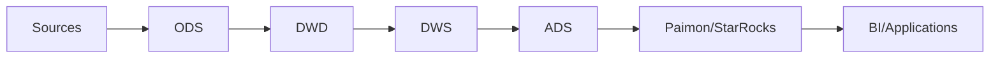

# Real-Time Data Warehouse Architecture

> **Stage**: Knowledge | **Prerequisites**: [State Management](../Flink/02-core/flink-state-management-complete-guide.md) | **Formal Level**: L4
>
> Streaming layered architecture (ODS/DWD/DWS/ADS) with Flink, delivering sub-second latency vs batch hours.

---

## 1. Definitions

**Def-K-03-35: Real-Time Data Warehouse (RTDW)**

$$
\mathcal{RTDW} = (\mathcal{S}, \mathcal{L}, \mathcal{T}, \mathcal{Q}, \mathcal{G})
$$

where $\mathcal{S}$ = sources, $\mathcal{L}$ = layers, $\mathcal{T}$ = time semantics, $\mathcal{Q}$ = query interfaces, $\mathcal{G}$ = consistency guarantees.

Key difference from OLAP: $L_{max} \ll T_{batch}$.

**Def-K-03-36: Streaming Layered Architecture**

$$
\mathcal{SLA} = (\text{ODS}, \text{DWD}, \text{DWS}, \text{ADS})
$$

- **ODS**: Raw data stream, 1:1 mapping with input
- **DWD**: Detail layer, cleansing and enrichment
- **DWS**: Summary layer, window aggregation and pre-computation
- **ADS**: Application layer, scenario-specific transformations

Layer dependency forms DAG: $\text{ODS} \prec \text{DWD} \prec \text{DWS} \prec \text{ADS}$.

**Def-K-03-37: Serving Layer Pattern**

$$
\mathcal{SP} = (\mathcal{E}, \mathcal{I}, \mathcal{R})
$$

where $\mathcal{E}$ = engine (Paimon, StarRocks, ClickHouse, Doris), $\mathcal{I}$ = ingestion, $\mathcal{R}$ = query capabilities.

---

## 2. Properties

**Prop-K-03-18: Consistency Composition**

Full-pipeline consistency is the composition of per-layer consistency:

- Exactly-Once $\circ$ Exactly-Once = Exactly-Once
- At-Least-Once $\circ$ $x$ = At-Least-Once

**Prop-K-03-19: Layer Independence**

Each layer can scale, upgrade, and recover independently due to message queue decoupling.

---

## 3. Relations

- **with Batch Data Warehouse**: RTDW mirrors the layered architecture but with continuous processing.
- **with Data Mesh**: ADS layer outputs are streaming data products.

---

## 4. Argumentation

**Serving Engine Selection**:

| Engine | Freshness | Query Latency | Best For |
|--------|-----------|---------------|----------|
| Paimon | Minutes | Medium | Lakehouse |
| StarRocks | Seconds | Low | OLAP |
| ClickHouse | Seconds | Low | Analytics |
| Doris | Seconds | Low | Unified |

---

## 5. Engineering Argument

**Exactly-Once Pipeline**: With Flink Checkpoint + 2PC Sink, full-pipeline Exactly-Once is achievable. This is the key technical guarantee for RTDW to match offline warehouse consistency.

---

## 6. Examples

```sql
-- Flink SQL: DWD layer enrichment
INSERT INTO dwd_order
SELECT 
    o.order_id,
    o.user_id,
    u.user_name,
    o.amount,
    o.event_time
FROM ods_order o
LEFT JOIN dim_user FOR SYSTEM_TIME AS OF o.proc_time u
  ON o.user_id = u.user_id;
```

---

## 7. Visualizations

**RTDW Architecture**:


---

## 8. References

[^1]: Apache Flink Documentation, "Real-Time Data Warehouse", 2025.
[^2]: Paimon Documentation, "Streaming Lakehouse", 2025.
