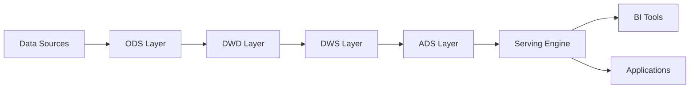

# Real-Time Data Warehouse Architecture

> **Stage**: Knowledge/03-business-patterns | **Prerequisites**: [Flink State Management](flink-state-management.md) | **Formalization Level**: L4
> **Translation Date**: 2026-04-21

## Abstract

Real-time data warehouse (RTDW) provides sub-second latency analytics by replacing batch processing with streaming pipelines, maintaining time-semantic continuity and recoverable state management.

---

## 1. Definitions

### Def-K-03-01 (Real-Time Data Warehouse)

$$\mathcal{RTDW} = (\mathcal{S}, \mathcal{L}, \mathcal{T}, \mathcal{Q}, \mathcal{G})$$

where:

- $\mathcal{S}$: data sources (event-timestamped streams)
- $\mathcal{L}$: layered computation
- $\mathcal{T}$: time semantics function
- $\mathcal{Q}$: query interfaces
- $\mathcal{G}$: consistency guarantees (Checkpoint, Exactly-Once Sink)

Key difference from offline DW: $L_{max} \ll T_{batch}$

### Def-K-03-02 (Streaming Layered Architecture)

$$\mathcal{SLA} = (\text{ODS}, \text{DWD}, \text{DWS}, \text{ADS})$$

| Layer | Function | Output |
|-------|----------|--------|
| ODS | Raw data, format validation | 1:1 with input |
| DWD | Cleansing, joining, denormalization | Normalized schema |
| DWS | Window aggregation, pre-computation | Aggregated metrics |
| ADS | Scenario-specific transformation | Serving-ready |

Dependency DAG: $\text{ODS} \prec \text{DWD} \prec \text{DWS} \prec \text{ADS}$

### Def-K-03-03 (Serving Layer Pattern)

$$\mathcal{SP} = (\mathcal{E}, \mathcal{I}, \mathcal{R})$$

| Engine | Freshness | Latency | Best For |
|--------|-----------|---------|----------|
| Paimon | High | Medium | Lakehouse unified |
| StarRocks | High | Low | Real-time OLAP |
| ClickHouse | Medium | Low | Wide-table analytics |
| Doris | High | Low | Unified batch/stream |

---

## 2. Architecture

---

## 3. References
