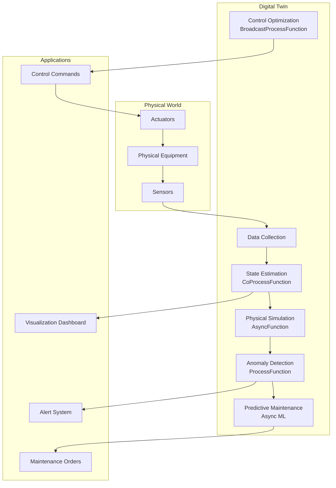
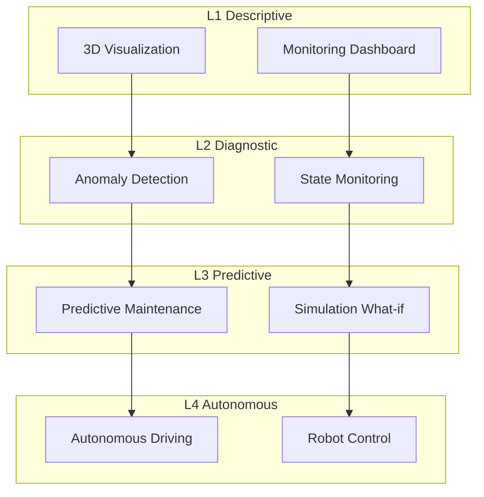

# Operators and Real-Time Digital Twins

> **Stage**: Knowledge/10-case-studies | **Prerequisites**: [01.07-two-input-operators.md](../Knowledge/01-concept-atlas/operator-deep-dive/01.07-two-input-operators.md), [01.08-multi-stream-operators.md](../Knowledge/01-concept-atlas/operator-deep-dive/01.08-multi-stream-operators.md) | **Formalization Level**: L3
> **Document Positioning**: Operator fingerprints and Pipeline design for stream processing operators in real-time digital twin systems, physical-virtual synchronization, and predictive maintenance
> **Version**: 2026.04

---

## Table of Contents

- [Operators and Real-Time Digital Twins](#operators-and-real-time-digital-twins)
  - [Table of Contents](#table-of-contents)
  - [1. Definitions](#1-definitions)
    - [Def-DT-01-01: Digital Twin (数字孪生)](#def-dt-01-01-digital-twin-数字孪生)
    - [Def-DT-01-02: Physical-Virtual Synchronization (物理-虚拟同步)](#def-dt-01-02-physical-virtual-synchronization-物理-虚拟同步)
    - [Def-DT-01-03: Predictive Maintenance (预测性维护)](#def-dt-01-03-predictive-maintenance-预测性维护)
    - [Def-DT-01-04: State Estimation (状态估计)](#def-dt-01-04-state-estimation-状态估计)
    - [Def-DT-01-05: Simulation What-if (仿真推演)](#def-dt-01-05-simulation-what-if-仿真推演)
  - [2. Properties](#2-properties)
    - [Lemma-DT-01-01: Accumulation of Synchronization Error](#lemma-dt-01-01-accumulation-of-synchronization-error)
    - [Lemma-DT-01-02: Convergence of Kalman Filter](#lemma-dt-01-02-convergence-of-kalman-filter)
    - [Prop-DT-01-01: Benefits of Predictive Maintenance](#prop-dt-01-01-benefits-of-predictive-maintenance)
    - [Prop-DT-01-02: Real-Time Constraints of Digital Twins](#prop-dt-01-02-real-time-constraints-of-digital-twins)
  - [3. Relations](#3-relations)
    - [3.1 Digital Twin Pipeline Operator Mapping](#31-digital-twin-pipeline-operator-mapping)
    - [3.2 Operator Fingerprints](#32-operator-fingerprints)
    - [3.3 Digital Twin Level Comparison](#33-digital-twin-level-comparison)
  - [4. Argumentation](#4-argumentation)
    - [4.1 Why Digital Twins Need Stream Processing Rather Than Offline Simulation](#41-why-digital-twins-need-stream-processing-rather-than-offline-simulation)
    - [4.2 Challenges of Multi-Physics Coupling](#42-challenges-of-multi-physics-coupling)
    - [4.3 Distributed Architecture for Large-Scale Digital Twins](#43-distributed-architecture-for-large-scale-digital-twins)
  - [5. Proof / Engineering Argument](#5-proof--engineering-argument)
    - [5.1 Real-Time State Estimation Pipeline](#51-real-time-state-estimation-pipeline)
    - [5.2 Predictive Maintenance System](#52-predictive-maintenance-system)
    - [5.3 Simulation What-if Engine](#53-simulation-what-if-engine)
  - [6. Examples](#6-examples)
    - [6.1 Case Study: Smart Factory Equipment Twin](#61-case-study-smart-factory-equipment-twin)
    - [6.2 Case Study: Smart City Traffic Twin](#62-case-study-smart-city-traffic-twin)
  - [7. Visualizations](#7-visualizations)
    - [Digital Twin Pipeline](#digital-twin-pipeline)
    - [Digital Twin Hierarchy Architecture](#digital-twin-hierarchy-architecture)
  - [8. References](#8-references)

---

## 1. Definitions

### Def-DT-01-01: Digital Twin (数字孪生)

A Digital Twin (数字孪生) is a real-time mirror of a physical entity in digital space:

$$\text{DigitalTwin}(t) = \mathcal{M}(\text{PhysicalEntity}, \text{SensorData}_{\leq t}, \text{ControlActions}_{\leq t})$$

where $\mathcal{M}$ is the twin model, comprising geometric, physical, and behavioral models.

### Def-DT-01-02: Physical-Virtual Synchronization (物理-虚拟同步)

Physical-Virtual Synchronization (物理-虚拟同步) is the process of maintaining consistency between the digital twin and the physical entity's state:

$$\text{SyncError}(t) = \|\text{State}_{virtual}(t) - \text{State}_{physical}(t)\|$$

Objective: $\text{SyncError}(t) < \epsilon_{sync}, \forall t$.

### Def-DT-01-03: Predictive Maintenance (预测性维护)

Predictive Maintenance (预测性维护) predicts equipment failures based on real-time data and degradation models:

$$\text{RUL}(t) = \inf\{\tau : \text{Health}(t+\tau) < \theta_{failure}\}$$

where RUL (Remaining Useful Life) denotes the remaining useful life.

### Def-DT-01-04: State Estimation (状态估计)

State Estimation (状态估计) infers the true system state from noisy observations:

$$\hat{x}_t = \arg\max_x P(x_t \mid z_{1:t}, u_{1:t})$$

Common methods: Kalman filter (linear Gaussian), particle filter (non-linear non-Gaussian).

### Def-DT-01-05: Simulation What-if (仿真推演)

Simulation What-if (仿真推演) simulates the effects of different control strategies within the digital twin:

$$\text{Outcome}(a) = \text{Simulate}(\text{DigitalTwin}(t), a, T_{horizon})$$

where $a$ is the control action and $T_{horizon}$ is the simulation horizon.

---

## 2. Properties

### Lemma-DT-01-01: Accumulation of Synchronization Error

If the synchronization error per step is $\delta$, then the accumulated error after $n$ steps:

$$\text{SyncError}(t_n) \leq n \cdot \delta$$

**Proof**: By the triangle inequality, $\|x_n - \hat{x}_n\| \leq \sum_{i=1}^{n} \|x_i - \hat{x}_i\| \leq n \cdot \delta$. ∎

### Lemma-DT-01-02: Convergence of Kalman Filter

Under the conditions that the system is observable and the noise covariance is bounded:

$$\lim_{t \to \infty} P_t = P_{\infty}$$

where $P_t$ is the estimation error covariance matrix and $P_{\infty}$ is the steady-state value.

### Prop-DT-01-01: Benefits of Predictive Maintenance

Compared with scheduled maintenance, the benefit of Predictive Maintenance:

$$\text{CostSaving} = C_{unplanned} \cdot (1 - \text{MTBF}_{pred} / \text{MTBF}_{reactive}) - C_{monitoring}$$

Typical values: maintenance cost reduction of 25–40%, equipment downtime reduction of 70%.

### Prop-DT-01-02: Real-Time Constraints of Digital Twins

The maximum allowable latency for a digital twin:

$$\mathcal{L}_{max} < \frac{\epsilon_{sync}}{v_{max}}$$

where $v_{max}$ is the maximum state change rate of the physical system.

---

## 3. Relations

### 3.1 Digital Twin Pipeline Operator Mapping

| Application Scenario | Operator Composition | Data Source | Latency Requirement |
|---------------------|---------------------|-------------|---------------------|
| **Sensor Fusion** | window+aggregate + map | IoT Sensors | < 100ms |
| **State Estimation** | KeyedProcessFunction | Observations + Control | < 50ms |
| **Physical Model Simulation** | AsyncFunction | Model Computation | < 200ms |
| **Anomaly Detection** | ProcessFunction + Timer | State Deviation | < 1s |
| **Predictive Maintenance** | Async ML + window | Historical + Real-time | < 5s |
| **Control Optimization** | Broadcast + ProcessFunction | Policy Update | < 100ms |

### 3.2 Operator Fingerprints

| Dimension | Digital Twin Characteristics |
|-----------|------------------------------|
| **Core Operators** | KeyedProcessFunction (state estimation), AsyncFunction (physical simulation / ML inference), BroadcastProcessFunction (control strategy), CoProcessFunction (observation + control fusion) |
| **State Types** | ValueState (current entity state), MapState (historical trajectory), BroadcastState (control strategy) |
| **Time Semantics** | Event time (sensor timestamps) |
| **Data Characteristics** | Multi-modal (sensor / video / control commands), high frequency (100Hz+), strong causality |
| **State Scale** | Keyed by entity, industrial scenarios can reach millions of keys |
| **Performance Bottleneck** | Physical model computation, large-scale state synchronization |

### 3.3 Digital Twin Level Comparison

| Level | Description | Data Frequency | Application |
|-------|-------------|----------------|-------------|
| **L1 Descriptive** | 3D visualization | Second-level | Monitoring dashboard |
| **L2 Diagnostic** | State monitoring + alerts | Second-level | Anomaly detection |
| **L3 Predictive** | Simulation what-if + prediction | Minute-level | Predictive maintenance |
| **L4 Autonomous** | Closed-loop control + optimization | Millisecond-level | Autonomous driving / robotics |

---

## 4. Argumentation

### 4.1 Why Digital Twins Need Stream Processing Rather Than Offline Simulation

Problems with offline simulation:

- Cannot synchronize in real time: simulation results lag behind the physical world
- Cannot perform closed-loop control: unable to feedback control commands in real time
- Cannot predict and warn: only post-hoc analysis is possible

Advantages of stream processing:

- Real-time mirroring: physical changes are reflected in the digital model within seconds
- Closed-loop control: digital twin outputs control commands back to the physical system
- Online learning: model parameters are continuously updated with real-time data

### 4.2 Challenges of Multi-Physics Coupling

**Problem**: Complex systems (e.g., aircraft engines) involve multi-physics coupling such as aerodynamics, thermodynamics, and structural mechanics.

**Solutions**:

1. **Reduced-Order Model (ROM) (降阶模型)**: reduce high-dimensional physical models to low-dimensional surrogate models
2. **Partitioned Coupling (分区耦合)**: each physics field is computed separately and coupled through boundary conditions
3. **Data-Driven (数据驱动)**: replace part of the physical equations with neural networks

### 4.3 Distributed Architecture for Large-Scale Digital Twins

**Challenge**: City-level digital twins involve millions of entities, which a single node cannot handle.

**Solutions**:

1. **Spatial Partitioning (空间分区)**: shard by geographic region, each region has an independent twin
2. **Hierarchical Aggregation (层级聚合)**: device-level → building-level → block-level → city-level aggregation
3. **Edge-Cloud Collaboration (边缘-云协同)**: high real-time requirements are processed at the edge, complex simulation runs in the cloud

---

## 5. Proof / Engineering Argument

### 5.1 Real-Time State Estimation Pipeline

```java
public class StateEstimationFunction extends CoProcessFunction<SensorReading, ControlCommand, EntityState> {
    private ValueState<EntityState> estimatedState;
    private ValueState<Matrix> covariance;  // Kalman filter covariance

    @Override
    public void processElement1(SensorReading reading, Context ctx, Collector<EntityState> out) throws Exception {
        EntityState state = estimatedState.value();
        Matrix P = covariance.value();

        if (state == null) {
            state = new EntityState(reading.getPosition(), reading.getVelocity());
            P = Matrix.eye(6).multiply(100);  // Initial covariance
        }

        // Prediction step
        Matrix F = getStateTransitionMatrix(ctx.timestamp() - state.getTimestamp());
        EntityState predicted = state.transition(F);
        Matrix P_pred = F.multiply(P).multiply(F.transpose()).add(Q);  // Q: process noise

        // Update step
        Matrix H = getObservationMatrix(reading.getSensorType());
        Matrix z = reading.toVector();
        Matrix z_pred = H.multiply(predicted.toVector());
        Matrix y = z.subtract(z_pred);  // Residual
        Matrix S = H.multiply(P_pred).multiply(H.transpose()).add(R);  // R: measurement noise
        Matrix K = P_pred.multiply(H.transpose()).multiply(S.inverse());  // Kalman gain

        // State update
        Matrix newState = predicted.toVector().add(K.multiply(y));
        state = EntityState.fromVector(newState, ctx.timestamp());
        P = Matrix.eye(6).subtract(K.multiply(H)).multiply(P_pred);

        estimatedState.update(state);
        covariance.update(P);

        out.collect(state);
    }

    @Override
    public void processElement2(ControlCommand cmd, Context ctx, Collector<EntityState> out) {
        EntityState state = estimatedState.value();
        if (state != null) {
            state.applyControl(cmd);
            estimatedState.update(state);
        }
    }
}
```

### 5.2 Predictive Maintenance System

```java
// Equipment sensor stream
DataStream<SensorReading> sensors = env.addSource(new EquipmentSensorSource());

// Feature extraction
DataStream<FeatureVector> features = sensors.keyBy(SensorReading::getEquipmentId)
    .window(SlidingEventTimeWindows.of(Time.hours(1), Time.minutes(10)))
    .aggregate(new FeatureExtractionAggregate());

// RUL prediction (async ML model invocation)
DataStream<RULPrediction> predictions = AsyncDataStream.unorderedWait(
    features,
    new RULModelInference(),
    Time.seconds(5),
    100
);

// Maintenance decision
predictions.keyBy(RULPrediction::getEquipmentId)
    .process(new KeyedProcessFunction<String, RULPrediction, MaintenanceOrder>() {
        private ValueState<MaintenancePolicy> policy;

        @Override
        public void processElement(RULPrediction pred, Context ctx, Collector<MaintenanceOrder> out) throws Exception {
            MaintenancePolicy p = policy.value();
            if (p == null) p = new MaintenancePolicy();

            double daysToFailure = pred.getRulDays();

            // Decision logic
            if (daysToFailure < p.getCriticalThreshold()) {
                out.collect(new MaintenanceOrder(pred.getEquipmentId(), "URGENT", ctx.timestamp()));
            } else if (daysToFailure < p.getWarningThreshold()) {
                out.collect(new MaintenanceOrder(pred.getEquipmentId(), "SCHEDULED", ctx.timestamp()));
                // Set reminder timer
                ctx.timerService().registerProcessingTimeTimer(
                    ctx.timestamp() + (long)((daysToFailure - p.getCriticalThreshold()) * 86400000)
                );
            }
        }

        @Override
        public void onTimer(long timestamp, OnTimerContext ctx, Collector<MaintenanceOrder> out) {
            out.collect(new MaintenanceOrder(ctx.getCurrentKey(), "REMINDER", timestamp));
        }
    })
    .addSink(new MaintenanceSystemSink());
```

### 5.3 Simulation What-if Engine

```java
// Control strategy broadcast
DataStream<ControlStrategy> strategies = env.addSource(new StrategySource());

// Entity state stream
DataStream<EntityState> states = env.addSource(new StateSource());

// What-if simulation
states.keyBy(EntityState::getEntityId)
    .connect(strategies.broadcast())
    .process(new BroadcastProcessFunction<EntityState, ControlStrategy, SimulationResult>() {
        @Override
        public void processElement(EntityState state, ReadOnlyContext ctx, Collector<SimulationResult> out) {
            ReadOnlyBroadcastState<String, ControlStrategy> strategyState = ctx.getBroadcastState(STRATEGY_DESCRIPTOR);
            ControlStrategy strategy = strategyState.get(state.getEntityType());

            if (strategy == null) return;

            // Run simulation (simplified)
            EntityState simulated = state.copy();
            List<EntityState> trajectory = new ArrayList<>();

            for (int i = 0; i < strategy.getHorizon(); i++) {
                ControlAction action = strategy.computeAction(simulated);
                simulated = simulated.step(action);
                trajectory.add(simulated);

                // Detect constraint violation
                if (strategy.violatesConstraint(simulated)) {
                    out.collect(new SimulationResult(state.getEntityId(), strategy.getId(), "VIOLATION", i, trajectory));
                    return;
                }
            }

            out.collect(new SimulationResult(state.getEntityId(), strategy.getId(), "SUCCESS", strategy.getHorizon(), trajectory));
        }

        @Override
        public void processBroadcastElement(ControlStrategy strategy, Context ctx, Collector<SimulationResult> out) {
            ctx.getBroadcastState(STRATEGY_DESCRIPTOR).put(strategy.getEntityType(), strategy);
        }
    })
    .addSink(new SimulationResultSink());
```

---

## 6. Examples

### 6.1 Case Study: Smart Factory Equipment Twin

```java
// 1. Multi-sensor fusion
DataStream<SensorReading> readings = env.addSource(new FactorySensorSource());

// 2. State estimation
DataStream<EntityState> states = readings
    .keyBy(SensorReading::getEquipmentId)
    .connect(controlCommands.broadcast())
    .process(new StateEstimationFunction());

// 3. Anomaly detection
states.keyBy(EntityState::getEquipmentId)
    .process(new KeyedProcessFunction<String, EntityState, AnomalyAlert>() {
        private ValueState<EntityState> normalState;

        @Override
        public void processElement(EntityState state, Context ctx, Collector<AnomalyAlert> out) throws Exception {
            EntityState normal = normalState.value();
            if (normal == null) {
                normalState.update(state);
                return;
            }

            double deviation = state.deviationFrom(normal);
            if (deviation > 3.0) {  // 3-sigma rule
                out.collect(new AnomalyAlert(state.getEquipmentId(), deviation, ctx.timestamp()));
            }

            // Update normal state (exponential smoothing)
            normal = normal.interpolate(state, 0.1);
            normalState.update(normal);
        }
    })
    .addSink(new AlertSink());

// 4. Predictive maintenance
states.keyBy(EntityState::getEquipmentId)
    .window(SlidingEventTimeWindows.of(Time.hours(24), Time.hours(1)))
    .aggregate(new DegradationFeatureAggregate())
    .map(new RULPredictionFunction())
    .filter(p -> p.getRulDays() < 7)
    .addSink(new MaintenanceOrderSink());
```

### 6.2 Case Study: Smart City Traffic Twin

```java
// Traffic sensor stream
DataStream<TrafficReading> traffic = env.addSource(new TrafficSensorSource());

// Signal control commands
DataStream<SignalCommand> signals = env.addSource(new SignalControlSource());

// Traffic flow state estimation
traffic.keyBy(TrafficReading::getIntersectionId)
    .connect(signals.broadcast())
    .process(new TrafficStateEstimation())
    .addSink(new TrafficDashboardSink());

// Congestion prediction
DataStream<TrafficState> trafficStates = env.addSource(new TrafficStateSource());
trafficStates.keyBy(TrafficState::getRoadId)
    .window(SlidingEventTimeWindows.of(Time.minutes(30), Time.minutes(5)))
    .aggregate(new CongestionPredictionAggregate())
    .filter(p -> p.getCongestionProbability() > 0.8)
    .addSink(new CongestionAlertSink());
```

---

## 7. Visualizations

### Digital Twin Pipeline

The following diagram illustrates the end-to-end digital twin pipeline, from physical-world sensing through digital twin processing to application outputs.



### Digital Twin Hierarchy Architecture

The following diagram shows the four-level hierarchy of digital twin maturity, from descriptive visualization to autonomous closed-loop control.



---

## 8. References

*Related Documents*: [01.07-two-input-operators.md](../Knowledge/01-concept-atlas/operator-deep-dive/01.07-two-input-operators.md) | [01.08-multi-stream-operators.md](../Knowledge/01-concept-atlas/operator-deep-dive/01.08-multi-stream-operators.md) | [realtime-smart-manufacturing-case-study.md](realtime-smart-manufacturing-case-study.md)
