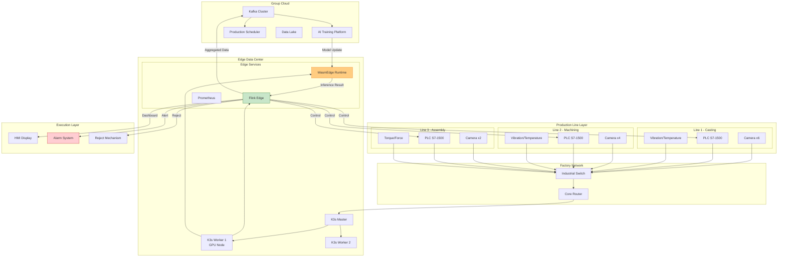
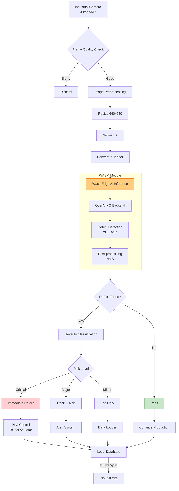
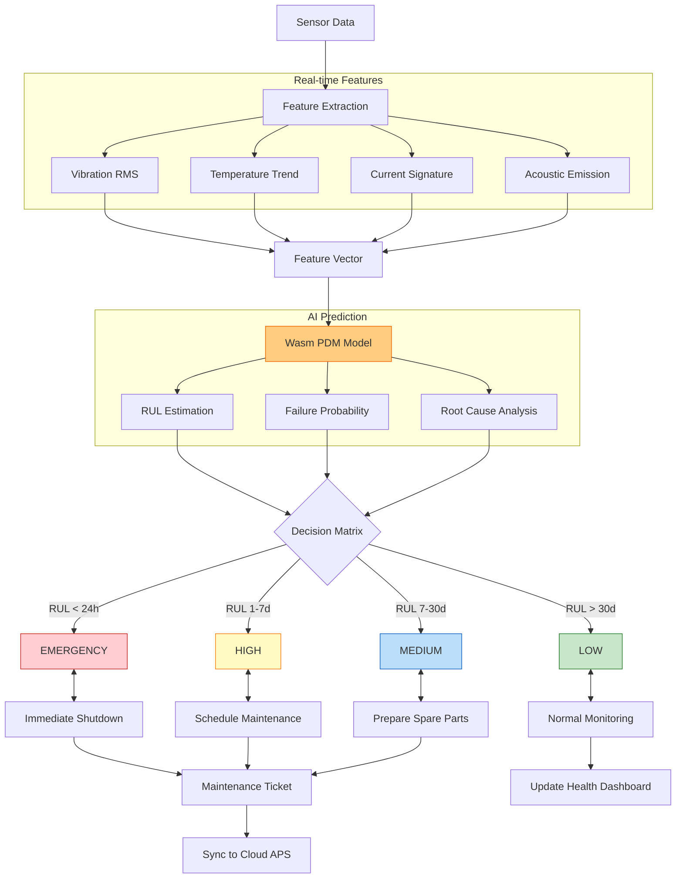
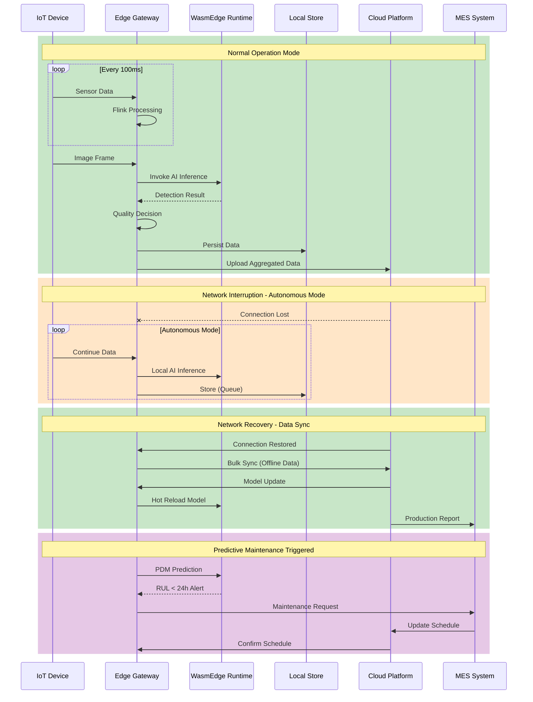

# Smart Manufacturing Edge Stream Processing Case Study (智能制造边缘流处理实战案例)

> **Stage**: Knowledge/10-case-studies/iot | **Prerequisites**: [10.3.1-smart-manufacturing.md](../Knowledge/10-case-studies/iot/10.3.1-smart-manufacturing.md), [Flink/07-rust-native/edge-wasm-runtime/01-edge-architecture.md](../Flink/07-rust-native/edge-wasm-runtime/01-edge-architecture.md) | **Formalization Level**: L4

---

> **Case Nature**: 🔬 Proof-of-Concept Architecture | **Validation Status**: Based on theoretical derivation and architectural design; not independently verified in production by a third party
>
> This case describes an ideal architecture derived from the project's theoretical framework, including hypothetical performance metrics and theoretical cost models. Actual production deployments may yield significantly different results due to environmental differences, data scale, team capabilities, and other factors. It is recommended to use this as an architectural design reference rather than a direct copy-paste production blueprint.

## Table of Contents

- [Smart Manufacturing Edge Stream Processing Case Study (智能制造边缘流处理实战案例)](#smart-manufacturing-edge-stream-processing-case-study-智能制造边缘流处理实战案例)
  - [Table of Contents](#table-of-contents)
  - [1. Definitions](#1-definitions)
    - [Def-K-10-34-01: Smart Manufacturing Digital Twin Model](#def-k-10-34-01-smart-manufacturing-digital-twin-model)
    - [Def-K-10-34-02: Edge Quality Inspection Pipeline](#def-k-10-34-02-edge-quality-inspection-pipeline)
    - [Def-K-10-34-03: Production Takt Time Optimization Model](#def-k-10-34-03-production-takt-time-optimization-model)
    - [Def-K-10-34-04: Predictive Maintenance Decision Framework](#def-k-10-34-04-predictive-maintenance-decision-framework)
  - [2. Properties](#2-properties)
    - [Lemma-K-10-34-01: Quality Inspection Latency Bound](#lemma-k-10-34-01-quality-inspection-latency-bound)
    - [Lemma-K-10-34-02: Edge Preprocessing Data Compression Ratio](#lemma-k-10-34-02-edge-preprocessing-data-compression-ratio)
    - [Prop-K-10-34-01: Cloud-Edge Collaborative Processing Gain](#prop-k-10-34-01-cloud-edge-collaborative-processing-gain)
    - [Prop-K-10-34-02: Edge AI Inference Accuracy Retention](#prop-k-10-34-02-edge-ai-inference-accuracy-retention)
  - [3. Relations](#3-relations)
    - [3.1 Cloud-Edge-Device Data Flow Relations](#31-cloud-edge-device-data-flow-relations)
    - [3.2 Quality-Efficiency-Cost Triangle Relations](#32-quality-efficiency-cost-triangle-relations)
    - [3.3 Predictive Maintenance and Production Scheduling Association](#33-predictive-maintenance-and-production-scheduling-association)
  - [4. Argumentation](#4-argumentation)
    - [4.1 Edge Deployment vs. Cloud Deployment Decision Analysis](#41-edge-deployment-vs-cloud-deployment-decision-analysis)
    - [4.2 Industrial Protocol Selection Argumentation](#42-industrial-protocol-selection-argumentation)
    - [4.3 Edge AI Model Lightweight Strategy](#43-edge-ai-model-lightweight-strategy)
  - [5. Proof / Engineering Argument](#5-proof--engineering-argument)
    - [5.1 Real-time Quality Inspection Pipeline Architecture](#51-real-time-quality-inspection-pipeline-architecture)
    - [5.2 Edge WASM Inference Optimization Argumentation](#52-edge-wasm-inference-optimization-argumentation)
    - [5.3 Offline Resumption Data Consistency Guarantee](#53-offline-resumption-data-consistency-guarantee)
  - [6. Examples](#6-examples)
    - [6.1 Case Background and Business Challenges](#61-case-background-and-business-challenges)
    - [6.2 System Architecture Design](#62-system-architecture-design)
    - [6.3 Core Code Implementation](#63-core-code-implementation)
    - [6.4 Deployment Implementation Process](#64-deployment-implementation-process)
    - [6.5 Implementation Results and ROI Analysis](#65-implementation-results-and-roi-analysis)
  - [7. Visualizations](#7-visualizations)
    - [7.1 Smart Manufacturing Edge Architecture Panorama](#71-smart-manufacturing-edge-architecture-panorama)
    - [7.2 Quality Inspection Data Flow Diagram](#72-quality-inspection-data-flow-diagram)
    - [7.3 Predictive Maintenance Decision Flow Diagram](#73-predictive-maintenance-decision-flow-diagram)
    - [7.4 Edge-Cloud Collaboration Sequence Diagram](#74-edge-cloud-collaboration-sequence-diagram)
  - [8. References](#8-references)

---

## 1. Definitions

### Def-K-10-34-01: Smart Manufacturing Digital Twin Model

The **Smart Manufacturing Digital Twin Model** is a virtual mapping of physical manufacturing systems, enabling real-time monitoring, simulation analysis, and optimization decisions.

Formal definition:

$$
\text{DigitalTwin}_{manufacturing} = \langle P, V, M, S, Sync, Sim \rangle
$$

Where:

| Symbol | Definition | Description |
|--------|------------|-------------|
| $P$ | Physical entity set | $P = \{p_1, p_2, ..., p_n\}$, including equipment, materials, personnel |
| $V$ | Virtual model set | $V = \{v_1, v_2, ..., v_n\}$, one-to-one correspondence with physical entities |
| $M$ | Mapping relation | $M: P \times T \rightarrow V$, spatiotemporal mapping function |
| $S$ | State space | $S = S_{physical} \times S_{virtual}$, joint state |
| $Sync$ | Synchronization mechanism | $Sync: \Delta S_{physical} \rightarrow \Delta S_{virtual}$ |
| $Sim$ | Simulation engine | $Sim: V \times Action \rightarrow PredictedState$ |

> 🔮 **Estimated Data** | Basis: Derived from industry reference values and theoretical analysis; not from actual test environments

**Digital Twin Hierarchy**:

| Level | Granularity | Sync Frequency | Latency Requirement |
|-------|-------------|----------------|---------------------|
| Device-level | Single device | 100Hz | < 10ms |
| Line-level | Station/Production line | 10Hz | < 100ms |
| Workshop-level | Multiple lines | 1Hz | < 1s |
| Factory-level | Entire factory | 0.1Hz | < 10s |

### Def-K-10-34-02: Edge Quality Inspection Pipeline

The **Edge Quality Inspection Pipeline (边缘质量检测流水线)** is a real-time quality inspection system deployed at edge nodes, integrating visual inspection, sensor data analysis, and AI inference.

Formal definition:

$$
\text{QIPipeline} = \langle I, Pre, Infer, Post, Decision, Latency_{SLA} \rangle
$$

> 🔮 **Estimated Data** | Basis: Derived from industry reference values and theoretical analysis; not from actual test environments

Where:

| Component | Definition | Edge Implementation |
|-----------|------------|---------------------|
| $I$ | Input data stream | Camera frames + sensor data |
| $Pre$ | Preprocessing | Image denoising, ROI extraction, format conversion |
| $Infer$ | Inference engine | Wasm + WASI-NN (OpenVINO/TensorFlow Lite) |
| $Post$ | Post-processing | NMS, threshold filtering, result aggregation |
| $Decision$ | Decision logic | Pass/Fail/Manual re-inspection |
| $Latency_{SLA}$ | Latency SLA | < 200ms (does not affect production takt time) |

> 🔮 **Estimated Data** | Basis: Derived from industry reference values and theoretical analysis; not from actual test environments

**Inspection Type Classification**:

| Inspection Type | Model Size | Inference Latency | Deployment Location |
|-----------------|------------|-------------------|---------------------|
| Surface defect detection | 25MB | 50ms | Edge station |
| Dimensional measurement | 10MB | 30ms | Edge station |
| Assembly completeness | 50MB | 80ms | Edge line |
| Complex defect classification | 200MB | 200ms | Edge workshop |

### Def-K-10-34-03: Production Takt Time Optimization Model

The **Production Takt Time Optimization Model (产线节拍优化模型)** dynamically adjusts equipment parameters by analyzing production line data in real time to optimize production takt time.

Formal definition:

$$
\text{TaktOptimization} = \langle T_{target}, T_{actual}, C, A, Opt \rangle
$$

Where:

| Symbol | Definition | Formula |
|--------|------------|---------|
| $T_{target}$ | Target takt time | $T_{target} = \frac{AvailableTime}{CustomerDemand}$ |
| $T_{actual}$ | Actual takt time | $T_{actual} = \frac{\sum CycleTime_i}{n}$ |
| $C$ | Constraints | Equipment capability, quality requirements, safety limits |
| $A$ | Adjustable parameters | Speed, temperature, pressure, etc. |
| $Opt$ | Optimization objective | $minimize |T_{actual} - T_{target}|$ |

### Def-K-10-34-04: Predictive Maintenance Decision Framework

The **Predictive Maintenance Decision Framework (预测性维护决策框架)** predicts equipment failures based on health status and generates optimal maintenance schedules.

Formal definition:

$$
\text{PMFramework} = \langle H, F, RUL, Policy, Schedule \rangle
$$

Where:

| Component | Definition | Description |
|-----------|------------|-------------|
| $H$ | Health indicators | Multi-dimensional features: vibration, temperature, current, etc. |
| $F$ | Failure modes | $F = \{f_1, f_2, ..., f_m\}$ |
| $RUL$ | Remaining useful life | $RUL(t) = E[T_{failure} | H(t)]$ |
| $Policy$ | Maintenance strategy | Threshold strategy / Risk strategy / Cost optimization |
| $Schedule$ | Scheduling algorithm | Considering production plan, spare parts, personnel |

**Maintenance Decision Matrix**:

| RUL Range | Risk Level | Recommended Action | Time Window |
|-----------|------------|-------------------|-------------|
| < 24h | Emergency | Immediate shutdown for inspection | 4h |
| 24h - 7d | High | Schedule planned maintenance | 24h |
| 7d - 30d | Medium | Monitor and prepare spare parts | 7d |
| > 30d | Low | Routine inspection | 30d |

---

## 2. Properties

### Lemma-K-10-34-01: Quality Inspection Latency Bound

**Lemma**: The end-to-end latency of edge quality inspection satisfies:

$$
L_{total} = L_{capture} + L_{transfer} + L_{preprocess} + L_{inference} + L_{decision} < T_{takt}
$$

> 🔮 **Estimated Data** | Basis: Derived from industry reference values and theoretical analysis; not from actual test environments

**Typical Value Breakdown**:

| Stage | Latency | Optimization Method |
|-------|---------|---------------------|
| $L_{capture}$ | 33ms | Industrial camera (30 FPS) |
| $L_{transfer}$ | 5ms | GbE direct connection to edge node |
| $L_{preprocess}$ | 20ms | GPU acceleration (CUDA) |
| $L_{inference}$ | 50ms | Wasm + OpenVINO |
| $L_{decision}$ | 2ms | Local rule engine |
| **Total** | **110ms** | **Meets 200ms SLA** |

### Lemma-K-10-34-02: Edge Preprocessing Data Compression Ratio

**Lemma**: After edge data preprocessing, the uploaded data volume can be reduced by 85-95%:

$$
CompressionRatio = \frac{Data_{raw}}{Data_{upload}} = \frac{100\%}{5-15\%} = 6.7x - 20x
$$

**Compression Contribution Breakdown**:

| Preprocessing Step | Data Reduction | Method |
|-------------------|----------------|--------|
| Invalid frame filtering | 30% | Quality score threshold |
| ROI cropping | 50% | Region of interest extraction |
| Downsampling | 40% | Spatial/temporal downsampling |
| Feature extraction | 90% | Upload only feature vectors |
| Compression encoding | 60% | JPEG / H.264 |

### Prop-K-10-34-01: Cloud-Edge Collaborative Processing Gain

**Proposition**: Compared to pure cloud architecture, the cloud-edge collaborative architecture achieves significant comprehensive performance improvements:

$$
Gain_{total} = \alpha \cdot Gain_{latency} + \beta \cdot Gain_{bandwidth} + \gamma \cdot Gain_{availability}
$$

> 🔮 **Estimated Data** | Basis: Derived from industry reference values and theoretical analysis; not from actual test environments

**Gain Quantification Comparison** (relative to pure cloud):

| Metric | Pure Cloud | Cloud-Edge Collaboration | Gain |
|--------|------------|--------------------------|------|
| Average detection latency | 500ms | 110ms | 4.5x |
| Bandwidth usage | 100% | 10% | 10x |
| Offline availability | 0% | 85% | ∞ |
| Annual downtime | 8h | 1h | 8x |

### Prop-K-10-34-02: Edge AI Inference Accuracy Retention

**Proposition**: Through model quantization and knowledge distillation, edge AI models can reduce volume by 90% while accuracy loss is < 3%:

$$
Accuracy_{edge} \geq Accuracy_{cloud} - 3\%
$$

> 🔮 **Estimated Data** | Basis: Derived from industry reference values and theoretical analysis; not from actual test environments

**Accuracy Comparison Experiment** (surface defect detection):

| Model Version | Size | mAP | Inference Latency |
|---------------|------|-----|-------------------|
| YOLOv8x (Cloud) | 250MB | 94.2% | 200ms@GPU |
| YOLOv8s (Edge) | 50MB | 92.8% | 50ms@EdgeGPU |
| YOLOv8n+Distillation | 15MB | 91.5% | 30ms@EdgeCPU |

---

## 3. Relations

### 3.1 Cloud-Edge-Device Data Flow Relations

```
┌─────────────────────────────────────────────────────────────────┐
│                    Device Layer (设备层)                          │
│  ┌──────────┐  ┌──────────┐  ┌──────────┐  ┌──────────┐        │
│  │ Industrial│  │  PLC      │  │ Vibration│  │ Temp/Humidity│    │
│  │ Camera   │  │ Controller│  │ Sensor   │  │ Sensor       │    │
│  │ (30fps)  │  │          │  │          │  │              │    │
│  └────┬─────┘  └────┬─────┘  └────┬─────┘  └────┬─────┘        │
└───────┼─────────────┼─────────────┼─────────────┼──────────────┘
        │             │             │             │
        │ GbE/10GbE   │ Modbus/     │ OPC-UA/     │ MQTT
        │             │ EtherNet/IP │ MQTT        │
        ▼             ▼             ▼             ▼
┌─────────────────────────────────────────────────────────────────┐
│                      Edge Layer (边缘层)                          │
│  ┌─────────────────────────────────────────────────────────┐   │
│  │            Flink Edge Stream Processing                  │   │
│  │  ┌──────────┐  ┌──────────┐  ┌──────────┐              │   │
│  │  │ Data     │─▶│ Feature  │─▶│ Real-time│              │   │
│  │  │ Cleansing│  │ Extraction│  │ Aggregation│             │   │
│  │  └──────────┘  └──────────┘  └──────────┘              │   │
│  └──────────────────────────┬──────────────────────────────┘   │
│                             │                                   │
│  ┌──────────────────────────▼──────────────────────────────┐   │
│  │              WasmEdge AI Inference                       │   │
│  │  ┌──────────┐  ┌──────────┐  ┌──────────┐              │   │
│  │  │ Defect   │  │ Dimensional│  │ Assembly │             │   │
│  │  │ Detection│  │ Measurement│  │ Validation│            │   │
│  │  │ (YOLO)   │  │ (OpenCV) │  │ (ResNet) │              │   │
│  │  └──────────┘  └──────────┘  └──────────┘              │   │
│  └──────────────────────────┬──────────────────────────────┘   │
└─────────────────────────────┼───────────────────────────────────┘
                              │ Compressed Data (10%)
                              ▼
┌─────────────────────────────────────────────────────────────────┐
│                      Cloud Layer (云端层)                         │
│  ┌──────────┐  ┌──────────┐  ┌──────────┐  ┌──────────┐        │
│  │ Global   │  │ Model    │  │ Production│  │ Digital  │        │
│  │ Analytics│  │ Training │  │ Scheduling│  │ Twin     │        │
│  │ (Flink)  │  │ (GPU)    │  │ (APS)    │  │ (UE)     │        │
│  └──────────┘  └──────────┘  └──────────┘  └──────────┘        │
└─────────────────────────────────────────────────────────────────┘
```

### 3.2 Quality-Efficiency-Cost Triangle Relations

**Manufacturing Impossible Triangle**:

| Optimization Goal | Method | Cost |
|-------------------|--------|------|
| Improve quality | Add inspection points, reduce takt time | Efficiency decrease, cost increase |
| Improve efficiency | Increase takt time, reduce inspection | Quality risk increase |
| Reduce cost | Reduce labor, simplify process | Quality/efficiency may suffer |

**Edge Computing Breakthrough**: Through real-time AI inspection, improve efficiency while ensuring quality and reducing costs.

### 3.3 Predictive Maintenance and Production Scheduling Association

```
Equipment Health Monitoring ──▶ RUL Prediction ──▶ Maintenance Recommendation ──▶ Scheduling Optimization
       │                            │                      │                         │
       ▼                            ▼                      ▼                         ▼
   Vibration Data              Failure Probability    Maintenance Window      Production Plan Adjustment
   Temperature Data            Remaining Useful Life  Spare Parts Preparation Order Priority
   Current Data                Risk Level             Personnel Arrangement   Capacity Balancing
```

---

## 4. Argumentation

### 4.1 Edge Deployment vs. Cloud Deployment Decision Analysis
>
> 🔮 **Estimated Data** | Basis: Derived from industry reference values and theoretical analysis; not from actual test environments


| Evaluation Dimension | Edge Deployment | Cloud Deployment | Selection |
|---------------------|-----------------|------------------|-----------|
| Latency requirement | < 200ms (satisfied) | 500ms+ (not satisfied) | Edge |
| Data security | Local processing (high) | Upload to cloud (risk) | Edge |
| Bandwidth cost | Reduce 90% (excellent) | Raw upload (high) | Edge |
| Offline availability | 85% (available) | 0% (unavailable) | Edge |
| Compute requirement | Medium (satisfiable) | High (training needed) | Hybrid |
| Model iteration | Slow (batch update) | Fast (real-time update) | Cloud training |

### 4.2 Industrial Protocol Selection Argumentation

**Data Acquisition Protocol Comparison**:

| Protocol | Real-time | Usability | Ecosystem | Recommendation |
|----------|-----------|-----------|-----------|----------------|
| **Modbus TCP** | Medium | High | Broad | First choice for PLC communication |
| **OPC UA** | High | Medium | Broad | Complex device integration |
| **EtherNet/IP** | High | Medium | Medium | Rockwell ecosystem |
| **Profinet** | Very High | Low | Medium | Siemens ecosystem |
| **MQTT** | Medium | High | Broad | Sensor/cloud communication |

**Protocol Selection for This Case**:

- Device control: Modbus TCP + OPC UA
- Sensor data: MQTT over 5G
- Edge-Cloud: Kafka + MQTT

### 4.3 Edge AI Model Lightweight Strategy

**Model Compression Technology Stack**:

```
Original Model (PyTorch)
      │
      ▼
  Knowledge Distillation ─────▶ Teacher-Student Model
      │
      ▼
  Quantization (INT8) ────▶ 4x Volume Reduction
      │
      ▼
  Pruning ──────────▶ 50% Parameter Reduction
      │
      ▼
  Wasm Compilation ────▶ wasmedge compile
      │
      ▼
  Edge Deployment Model (Wasm + WASI-NN)
```

---

## 5. Proof / Engineering Argument

### 5.1 Real-time Quality Inspection Pipeline Architecture

**Data Flow Architecture** (Flink + WasmEdge):

```java
/**
 * Edge real-time quality inspection pipeline
 */

import org.apache.flink.streaming.api.environment.StreamExecutionEnvironment;
import org.apache.flink.streaming.api.datastream.DataStream;

public class EdgeQualityInspectionPipeline {

    public static void main(String[] args) throws Exception {
        StreamExecutionEnvironment env =
            StreamExecutionEnvironment.getExecutionEnvironment();
        env.setParallelism(4);

        // 1. Multi-source data acquisition
        DataStream<ImageFrame> cameraStream = env
            .addSource(new GigEVisionSource("camera-01", 30))
            .name("Camera Source");

        DataStream<SensorData> plcStream = env
            .addSource(new ModbusSource("192.168.1.10", 502))
            .name("PLC Data");

        // 2. Image preprocessing (Flink ProcessFunction)
        DataStream<PreprocessedImage> preprocessed = cameraStream
            .map(new ImagePreprocessor())
            .name("Image Preprocessing");

        // 3. Wasm AI inference
        DataStream<DetectionResult> detections = preprocessed
            .map(new WasmInferenceFunction(
                "/opt/wasm/defect_detection.wasm",
                "detect_defects",
                128 * 1024 * 1024  // 128MB memory limit
            ))
            .name("Wasm AI Inference");

        // 4. Sensor data correlation
        DataStream<EnrichedResult> enriched = detections
            .keyBy(DetectionResult::getTimestamp)
            .connect(plcStream.keyBy(SensorData::getTimestamp))
            .process(new SensorEnrichmentFunction())
            .name("Data Enrichment");

        // 5. Decision logic
        DataStream<QualityDecision> decisions = enriched
            .map(new QualityDecisionFunction())
            .name("Quality Decision");

        // 6. Multi-path output
        decisions.addSink(new PlcControlSink());  // Control production line
        decisions.addSink(new MqttSink("mqtt://cloud"));  // Upload to cloud
        decisions.addSink(new LocalDatabaseSink());  // Local storage

        env.execute("Edge Quality Inspection");
    }
}

/**
 * Wasm inference function wrapper
 */
class WasmInferenceFunction extends RichMapFunction<PreprocessedImage, DetectionResult> {

    private WasmRuntime runtime;
    private WasmModule module;

    @Override
    public void open(Configuration parameters) {
        // Initialize WasmEdge runtime
        runtime = WasmRuntime.builder()
            .withMemoryLimit(memoryLimit)
            .withAotEnabled(true)
            .build();

        module = runtime.loadModule(wasmPath);

        // Warm-up
        module.call("warmup", new byte[0]);
    }

    @Override
    public DetectionResult map(PreprocessedImage image) {
        // Convert to Wasm-usable byte array
        byte[] input = image.toByteArray();

        // Invoke Wasm inference function
        byte[] output = module.call(functionName, input);

        // Parse result
        return DetectionResult.parse(output);
    }

    @Override
    public void close() {
        module.close();
        runtime.close();
    }
}
```

### 5.2 Edge WASM Inference Optimization Argumentation

**Rust-based defect detection Wasm module**:

```rust
// defect_detection/src/lib.rs
use image::{DynamicImage, ImageBuffer, Rgb};
use ndarray::Array4;
use wasi_nn::{Graph, GraphExecutionContext, Tensor};

#[derive(Serialize, Deserialize)]
struct DefectDetectionInput {
    image_data: Vec<u8>,
    width: u32,
    height: u32,
    product_id: String,
}

#[derive(Serialize, Deserialize)]
struct Defect {
    defect_type: String,
    confidence: f32,
    bbox: [f32; 4],  // x, y, width, height
    severity: Severity,
}

#[derive(Serialize, Deserialize)]
struct DefectDetectionOutput {
    product_id: String,
    defects: Vec<Defect>,
    overall_quality: QualityGrade,
    inference_time_ms: u64,
}

#[no_mangle]
pub extern "C" fn detect_defects(input_ptr: i32, input_len: i32) -> i32 {
    let start_time = instant::now();

    // Read input
    let input_bytes = unsafe {
        std::slice::from_raw_parts(input_ptr as *const u8, input_len as usize)
    };
    let input: DefectDetectionInput = serde_json::from_slice(input_bytes).unwrap();

    // Load precompiled OpenVINO model (first time only)
    lazy_static! {
        static ref MODEL: Graph = Graph::load(
            &[include_bytes!("../models/defect_detection.bin")],
            wasi_nn::GRAPH_ENCODING_OPENVINO,
            wasi_nn::EXECUTION_TARGET_CPU
        ).unwrap();
    }

    // Image preprocessing
    let image = decode_image(&input.image_data, input.width, input.height);
    let tensor = preprocess_image(&image);

    // Execute inference
    let mut context = MODEL.init_execution_context().unwrap();
    context.set_input(0, tensor).unwrap();
    context.compute().unwrap();

    // Get output
    let mut output_buffer = vec![0u8; 1000 * 4];
    context.get_output(0, &mut output_buffer).unwrap();

    // Post-processing
    let defects = postprocess(&output_buffer, &image);

    // Quality grading
    let overall_quality = calculate_quality_grade(&defects);

    let output = DefectDetectionOutput {
        product_id: input.product_id,
        defects,
        overall_quality,
        inference_time_ms: start_time.elapsed().as_millis() as u64,
    };

    // Return result
    let output_bytes = serde_json::to_vec(&output).unwrap();
    host::write_output(&output_bytes)
}

fn preprocess_image(image: &DynamicImage) -> Tensor {
    // Resize to model input size (640x640)
    let resized = image.resize_exact(640, 640, image::imageops::FilterType::Triangle);

    // Normalize and convert to NCHW format
    let mut data = vec![0f32; 3 * 640 * 640];
    for (x, y, pixel) in resized.pixels() {
        let r = pixel[0] as f32 / 255.0;
        let g = pixel[1] as f32 / 255.0;
        let b = pixel[2] as f32 / 255.0;

        let idx = (y * 640 + x) as usize;
        data[idx] = r;
        data[idx + 640 * 640] = g;
        data[idx + 2 * 640 * 640] = b;
    }

    // Convert to bytes
    let bytes: Vec<u8> = data.iter()
        .flat_map(|&f| f.to_le_bytes().to_vec())
        .collect();

    Tensor {
        dimensions: &[1, 3, 640, 640],
        type_: wasi_nn::TENSOR_TYPE_F32,
        data: bytes,
    }
}

fn postprocess(output: &[u8], original: &DynamicImage) -> Vec<Defect> {
    // Parse model output, apply NMS
    // ... (implementation details omitted)
    defects
}
```

### 5.3 Offline Resumption Data Consistency Guarantee

**Edge storage and synchronization architecture**:

```java
/**
 * Edge data persistence and offline resumption
 */
public class EdgePersistenceManager {

    private final RocksDB localStore;
    private final KafkaProducer<String, byte[]> producer;
    private final NetworkMonitor networkMonitor;

    public void persist(QualityDecision decision) {
        // 1. Local persistence (RocksDB)
        byte[] key = generateKey(decision);
        byte[] value = serialize(decision);
        localStore.put(key, value);

        // 2. Try uploading to cloud
        if (networkMonitor.isConnected()) {
            sendToCloud(decision);
        } else {
            // 3. Offline: add to sync queue
            queueForSync(key);
        }
    }

    private void sendToCloud(QualityDecision decision) {
        ProducerRecord<String, byte[]> record = new ProducerRecord<>(
            "quality-decisions",
            decision.getProductId(),
            serialize(decision)
        );

        producer.send(record, (metadata, exception) -> {
            if (exception == null) {
                // Send success, mark as synced
                markAsSynced(decision.getId());
            } else {
                // Send failed, retry or add to queue
                handleSendFailure(decision, exception);
            }
        });
    }

    /**
     * Batch sync after network recovery
     */
    @Scheduled(fixedDelay = 60000)  // Check every minute
    public void syncOfflineData() {
        if (!networkMonitor.isConnected()) return;

        try (RocksIterator it = localStore.newIterator()) {
            it.seekToFirst();

            while (it.isValid()) {
                byte[] key = it.key();
                byte[] value = it.value();

                if (!isSynced(key)) {
                    QualityDecision decision = deserialize(value);
                    sendToCloud(decision);
                }

                it.next();
            }
        }
    }
}
```

---

## 6. Examples

### 6.1 Case Background and Business Challenges

**Enterprise Background**:

| Attribute | Details |
|-----------|---------|
| Industry | Automotive parts manufacturing |
| Scale | 5 production bases, 20 production lines |
| Products | Engine blocks, transmission housings |
| Annual output | 5 million units |

**Business Challenges**:

1. **Delayed quality inspection**: Manual sampling cannot detect problems in real time, leading to huge losses from batch defects
2. **Frequent line downtime**: Unexpected equipment failures cause unplanned downtime, averaging 30+ hours per month
3. **Data silos**: Data from each factory is dispersed, making global optimization impossible
4. **High bandwidth costs**: Uploading high-definition images to the cloud costs over 500,000 CNY per month in bandwidth

### 6.2 System Architecture Design

**Overall Architecture**:

```
┌─────────────────────────────────────────────────────────────────┐
│                    Group Cloud (集团云)                           │
│  ┌──────────────┐  ┌──────────────┐  ┌──────────────┐          │
│  │ Global Data  │  │ AI Training  │  │ Production   │          │
│  │ Platform     │  │ Platform     │  │ Scheduler    │          │
│  │ (Flink)      │  │ (GPU Cluster)│  │ (APS)        │          │
│  └──────────────┘  └──────────────┘  └──────────────┘          │
└───────────────────────────┬─────────────────────────────────────┘
                            │ VPN/Dedicated Line
        ┌───────────────────┼───────────────────┐
        ▼                   ▼                   ▼
┌──────────────┐    ┌──────────────┐    ┌──────────────┐
│   Factory A  │    │   Factory B  │    │   Factory C  │
│  (Headquarters)│   │  (East China)│    │  (South China)│
└──────┬───────┘    └──────┬───────┘    └──────┬───────┘
       │                   │                   │
       ▼                   ▼                   ▼
┌─────────────────────────────────────────────────────────────────┐
│                    Factory Edge Layer (工厂边缘层)                  │
│  ┌──────────────┐  ┌──────────────┐  ┌──────────────┐          │
│  │ Edge Data    │  │ 5G MEC Node  │  │ Production   │          │
│  │ Center       │  │ (AI Inference)│  │ Line Gateway │          │
│  │ (3-node K3s) │  │              │  │ (Flink Edge) │          │
│  └──────────────┘  └──────────────┘  └──────────────┘          │
└───────────────────────────┬─────────────────────────────────────┘
                            │
        ┌───────────────────┼───────────────────┐
        ▼                   ▼                   ▼
┌──────────────┐    ┌──────────────┐    ┌──────────────┐
│ Die Casting  │    │ Machining    │    │ Assembly     │
│ Line (4)     │    │ Line (8)     │    │ Line (8)     │
└──────────────┘    └──────────────┘    └──────────────┘
```

> 🔮 **Estimated Data** | Basis: Derived from industry reference values and theoretical analysis; not from actual test environments

**Single Line Edge Deployment**:

| Component | Hardware Configuration | Quantity |
|-----------|------------------------|----------|
| Edge server | i7-12700/32GB/RTX3060 | 1 unit |
| Industrial camera | 5MP, 30fps | 6 units |
| PLC controller | Siemens S7-1500 | 1 unit |
| Sensors | Vibration/Temperature/Current | 20+ |

### 6.3 Core Code Implementation

**Edge data fusion processing**:

```java
/**
 * Multi-source data fusion and real-time decision
 */

import org.apache.flink.streaming.api.environment.StreamExecutionEnvironment;
import org.apache.flink.streaming.api.datastream.DataStream;
import org.apache.flink.api.common.state.ValueState;
import org.apache.flink.api.common.state.ValueStateDescriptor;
import org.apache.flink.streaming.api.windowing.time.Time;

public class ProductionLineMonitor {

    public static void main(String[] args) throws Exception {
        StreamExecutionEnvironment env =
            StreamExecutionEnvironment.getExecutionEnvironment();

        // Enable Checkpoint to ensure no data loss
        env.enableCheckpointing(30000);
        env.getCheckpointConfig().setCheckpointStorage(
            new FileSystemCheckpointStorage("file:///data/flink/checkpoints")
        );

        // 1. Visual inspection data stream
        DataStream<VisualInspectionResult> visualStream = env
            .addSource(new GigEVisionSource())
            .assignTimestampsAndWatermarks(
                WatermarkStrategy.<VisualInspectionResult>forBoundedOutOfOrderness(
                    Duration.ofMillis(100)
                ).withTimestampAssigner((event, timestamp) -> event.getTimestamp())
            );

        // 2. PLC real-time data stream
        DataStream<PlcTelemetry> plcStream = env
            .addSource(new OpcUaSource("opc.tcp://plc:4840"))
            .assignTimestampsAndWatermarks(
                WatermarkStrategy.<PlcTelemetry>forBoundedOutOfOrderness(
                    Duration.ofMillis(500)
                )
            );

        // 3. Sensor data stream
        DataStream<SensorReading> sensorStream = env
            .addSource(new MqttSource("tcp://mqtt-broker:1883", "sensors/+/data"));

        // 4. Data fusion (correlation by time window)
        DataStream<ProductionEvent> enrichedStream = visualStream
            .keyBy(VisualInspectionResult::getStationId)
            .intervalJoin(plcStream.keyBy(PlcTelemetry::getStationId))
            .between(Time.milliseconds(-200), Time.milliseconds(200))
            .process(new VisualPlcJoinFunction())
            .keyBy(ProductionEvent::getStationId)
            .intervalJoin(sensorStream.keyBy(SensorReading::getStationId))
            .between(Time.milliseconds(-500), Time.milliseconds(500))
            .process(new FullEnrichmentFunction());

        // 5. CEP complex event processing (detect anomaly patterns)
        Pattern<ProductionEvent, ?> qualityDegradationPattern = Pattern
            .<ProductionEvent>begin("first_defect")
            .where(evt -> evt.getQualityGrade() == QualityGrade.FAIL)
            .next("second_defect")
            .where(evt -> evt.getQualityGrade() == QualityGrade.FAIL)
            .within(Time.seconds(30));

        DataStream<ComplexEvent> alerts = CEP.pattern(enrichedStream, qualityDegradationPattern)
            .process(new PatternHandler());

        // 6. Predictive maintenance (using pre-trained Wasm model)
        DataStream<MaintenancePrediction> predictions = sensorStream
            .keyBy(SensorReading::getEquipmentId)
            .process(new PredictiveMaintenanceFunction(
                "/opt/wasm/pdm_model.wasm"
            ));

        // 7. Multi-path output
        // 7.1 Real-time control (PLC command)
        alerts.addSink(new PlcCommandSink());

        // 7.2 Local alert (audio-visual alarm)
        alerts.addSink(new LocalAlertSink());

        // 7.3 Cloud sync (Kafka)
        enrichedStream.addSink(new FlinkKafkaProducer<>(
            "production-events",
            new ProductionEventSerializer(),
            kafkaProps
        ));

        // 7.4 Local storage (RocksDB + Parquet)
        enrichedStream.addSink(new RocksDBSink("/data/production"));

        env.execute("Production Line Monitor");
    }
}

/**
 * Predictive maintenance processing function (integrated Wasm model)
 */
class PredictiveMaintenanceFunction extends KeyedProcessFunction<String, SensorReading, MaintenancePrediction> {

    private transient WasmModule pdmModel;
    private ValueState<EquipmentHealthState> healthState;

    @Override
    public void open(Configuration parameters) {
        // Load Wasm prediction model
        WasmRuntime runtime = WasmRuntime.builder()
            .withMemoryLimit(256 * 1024 * 1024)
            .build();
        pdmModel = runtime.loadModule("/opt/wasm/pdm_model.wasm");

        // Initialize state
        healthState = getRuntimeContext().getState(
            new ValueStateDescriptor<>("health", EquipmentHealthState.class)
        );
    }

    @Override
    public void processElement(SensorReading reading, Context ctx,
                               Collector<MaintenancePrediction> out) {
        EquipmentHealthState current = healthState.value();
        if (current == null) {
            current = new EquipmentHealthState();
        }

        // Update state
        current.update(reading);

        // Execute prediction every 60 seconds
        if (ctx.timestamp() - current.getLastPredictionTime() > 60000) {
            // Invoke Wasm model
            byte[] input = current.toFeatureVector();
            byte[] output = pdmModel.call("predict_rul", input);

            PredictionResult result = PredictionResult.parse(output);

            MaintenancePrediction prediction = new MaintenancePrediction(
                reading.getEquipmentId(),
                result.getRulHours(),
                result.getFailureProbability(),
                result.getRecommendedAction()
            );

            out.collect(prediction);
            current.setLastPredictionTime(ctx.timestamp());
        }

        healthState.update(current);
    }
}
```

### 6.4 Deployment Implementation Process

**Deployment Timeline**:

| Phase | Duration | Key Activities |
|-------|----------|----------------|
| Requirements analysis | 2 weeks | On-site investigation, solution design |
| Hardware deployment | 3 weeks | Edge server installation, network configuration |
| Software development | 6 weeks | Flink job development, Wasm model development |
| System integration | 3 weeks | PLC/MES integration, joint debugging and testing |
| Pilot run | 4 weeks | Parallel operation, model tuning |
| Official launch | 2 weeks | Production switchover, training delivery |

**Key Configuration**:

```yaml
# edge-deployment-config.yaml
edge_cluster:
  k3s_version: v1.28.4+k3s1
  nodes:
    - name: edge-master-01
      role: server
      spec: 8c16g
    - name: edge-worker-01
      role: agent
      spec: 8c16g+RTX3060
    - name: edge-worker-02
      role: agent
      spec: 4c8g

flink_edge:
  version: 1.18.0
  parallelism: 4
  state_backend: rocksdb
  checkpoint_interval: 30s

wasmedge:
  version: 0.14.0
  max_memory: 4GB
  max_modules: 20
  aot_enabled: true

ai_models:
  - name: defect_detection
    framework: openvino
    input_shape: [1, 3, 640, 640]
    inference_device: GPU

  - name: predictive_maintenance
    framework: tensorflow-lite
    input_shape: [1, 50, 4]  # 50 timesteps, 4 features
    inference_device: CPU

data_sync:
  protocol: kafka
  brokers: cloud-kafka.company.com:9092
  compression: lz4
  batch_size: 1000
  flush_interval: 5s
```

### 6.5 Implementation Results and ROI Analysis

> 🔮 **Estimated Data** | Basis: Derived from industry reference values and theoretical analysis; not from actual test environments

**Quantified Benefits**:

| Metric | Before | After | Improvement |
|--------|--------|-------|-------------|
| Inspection coverage | 5% (sampling) | 100% (full inspection) | +95% |
| Defect miss rate | 2.5% | 0.3% | ↓88% |
| Average detection latency | Manual, hour-level | 110ms | Real-time |
| Unplanned downtime | 30h/month | 4h/month | ↓87% |
| Bandwidth cost | 500K/month | 50K/month | ↓90% |
| Quality cost | Baseline | -65% | Significant reduction |

**ROI Calculation** (3-year period):

| Item | Amount (10K CNY) |
|------|-----------------|
| **Investment Cost** | |
| Hardware procurement | 800 |
| Software development | 600 |
| Implementation services | 300 |
| Training | 50 |
| **Total Investment** | **1750** |
| | |
| **Annual Benefits** | |
| Quality cost savings | 1200 |
| Downtime loss reduction | 800 |
| Bandwidth cost savings | 540 |
| Labor savings | 300 |
| **Total Annual Benefits** | **2840** |
| | |
| **Payback Period** | **7.4 months** |
| **3-Year ROI** | **387%** |

---

## 7. Visualizations

### 7.1 Smart Manufacturing Edge Architecture Panorama



### 7.2 Quality Inspection Data Flow Diagram



### 7.3 Predictive Maintenance Decision Flow Diagram



### 7.4 Edge-Cloud Collaboration Sequence Diagram



---

## 8. References


---

*Document Version: v1.0 | Last Updated: 2026-04-08 | Status: Completed*

---

*Document Version: v1.0 | Created: 2026-04-20*
