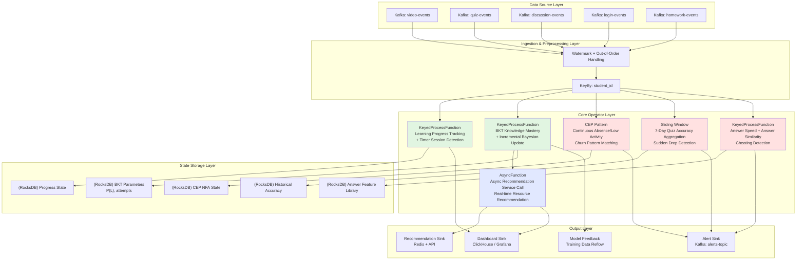
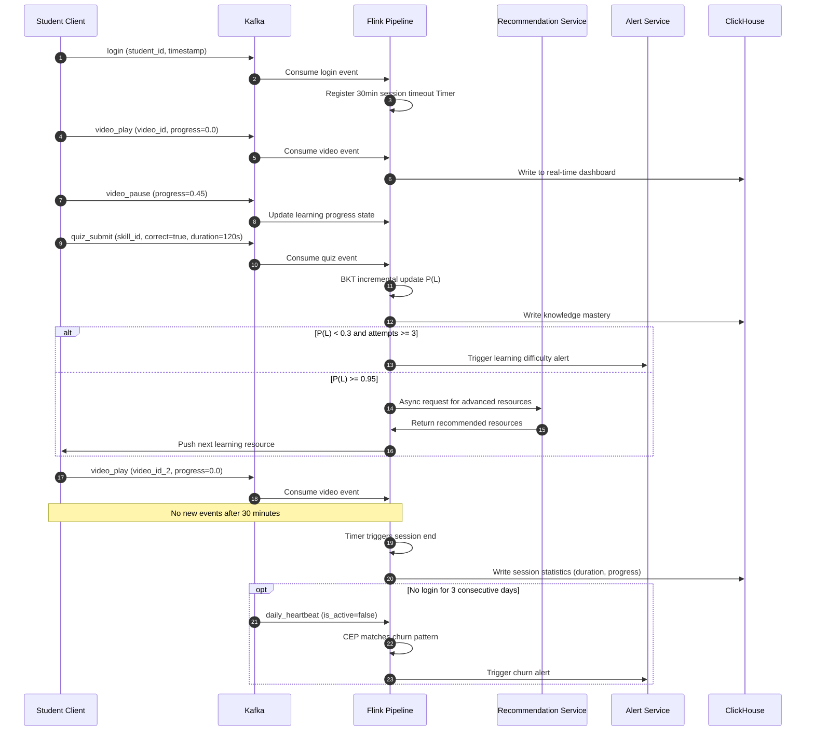
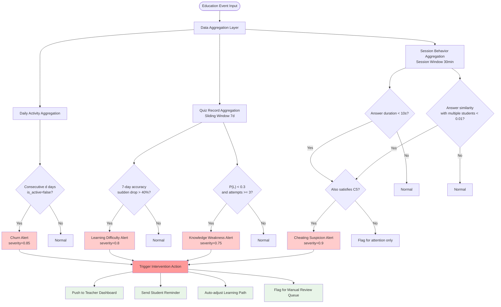
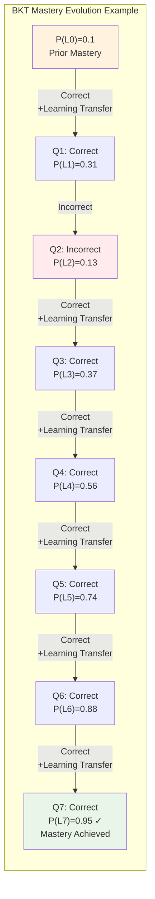

# Streaming Operators and Real-time Online Education Analytics: A Case Study

> Stage: Knowledge | Prerequisites: [Flink/03-api/stream-processing-operators.md](../Flink/03-api/stream-processing-operators.md), [Knowledge/02-design-patterns/real-time-analytics-pattern.md](../Knowledge/02-design-patterns/real-time-analytics-pattern.md) | Formalization Level: L4

---

## 1. Concept Definitions (Definitions)

This section rigorously defines the core concepts and data models involved in a real-time online education analytics system, establishing a formal foundation for subsequent operator design and the early warning system.

**Def-EDU-01-01 (Learning Event Stream)**
Let $\mathcal{E}$ be the set of events generated by the learning platform over the time interval $T \subseteq \mathbb{R}_{\geq 0}$. A **Learning Event Stream (学习事件流)** is defined as an ordered sequence of events $S = \langle e_1, e_2, \ldots \rangle$, where each event $e_i = (t_i, u_i, a_i, o_i, m_i)$ contains:

- $t_i \in T$: event timestamp
- $u_i \in \mathcal{U}$: unique student identifier ($\mathcal{U}$ is the universal set of students)
- $a_i \in \mathcal{A}$: event action type, $\mathcal{A} = \{\text{video\_play}, \text{video\_pause}, \text{quiz\_submit}, \text{post}, \text{login}, \text{logout}, \text{hw\_submit}\}$
- $o_i \in \mathcal{O}$: operation object (course ID, video ID, question ID, discussion post ID, etc.)
- $m_i \in \mathcal{M}$: metadata (playback progress, time spent answering, correctness, text content, etc.)

The learning event stream $S$ satisfies temporal monotonicity: $\forall i < j, t_i \leq t_j$.

**Def-EDU-01-02 (Learning Session)**
For student $u$, given a session timeout threshold $\tau > 0$ (typically 30 minutes), a **Learning Session (学习会话)** is defined as a maximal subsequence of events $W_u = \langle e_{i}, e_{i+1}, \ldots, e_{j} \rangle$ satisfying:

1. All events belong to the same student: $\forall k \in [i,j], u_k = u$
2. Adjacent event time intervals do not exceed the threshold: $\forall k \in [i,j-1], t_{k+1} - t_k \leq \tau$
3. Session boundary conditions: $t_i - t_{i-1} > \tau$ (previous event timed out) and $t_{j+1} - t_j > \tau$ (next event timed out, if it exists)

Session duration is defined as $D(W_u) = t_j - t_i + \delta_j$, where $\delta_j$ is the continuous operation time of the last event.

**Def-EDU-01-03 (Knowledge Mastery)**
Let $\mathcal{K}$ be the set of Knowledge Components (KCs). Based on Bayesian Knowledge Tracing (BKT) [^1], the **Knowledge Mastery (知识点掌握度)** of student $u$ for knowledge component $k \in \mathcal{K}$ is defined as the posterior probability of the latent state $P(L_n^{(k)})$, representing the probability that the student has mastered knowledge component $k$ after the $n$-th interaction.

The BKT model is characterized by four core parameters:

- $P(L_0)$: prior probability of mastery
- $P(T)$: transition probability from not mastered to mastered (learning probability)
- $P(G)$: probability of guessing correctly when not mastered (guess probability)
- $P(S)$: probability of making a slip when already mastered (slip probability)

**Def-EDU-01-04 (Learning Difficulty Alert State)**
The **Learning Difficulty Alert State (学习困难预警状态)** of student $u$ at time $t$ is a triple $\Psi_u(t) = (\psi^{(1)}_u(t), \psi^{(2)}_u(t), \psi^{(3)}_u(t)) \in \{0,1\}^3$, corresponding respectively to:

- $\psi^{(1)}$: sharp drop in knowledge mastery alert (consecutive answer accuracy below threshold)
- $\psi^{(2)}$: churn alert (no learning activity for $d$ consecutive days, typically $d=7$)
- $\psi^{(3)}$: cheating suspicion alert (both abnormal answer speed and abnormal answer similarity triggered simultaneously)

**Def-EDU-01-05 (Real-time Education Analytics Pipeline)**
A **Real-time Education Analytics Pipeline (实时教育分析Pipeline)** is a stream processing topology $\mathcal{P} = (V, E, \Sigma)$, where:

- $V$ is the set of operator nodes, including data sources, transformation operators, window operators, CEP operators, sinks, etc.
- $E \subseteq V \times V$ is the set of data flow edges
- $\Sigma: V \rightarrow \mathcal{F}$ is the mapping from operators to processing functions

The latency upper bound of the Pipeline is $\Delta_{\max}$, i.e., the maximum allowed time interval from event generation to analysis result output.

---

## 2. Property Derivation (Properties)

The following key properties can be directly derived from the above definitions, providing theoretical foundations for system design and parameter tuning.

**Lemma-EDU-01-01 (Session Isolation)**
Let the event stream of student $u$ be $S_u$, and the set of sessions obtained by partitioning according to Def-EDU-01-02 be $\mathcal{W}_u = \{W_u^{(1)}, W_u^{(2)}, \ldots\}$. Then:

1. Sessions are mutually disjoint: $\forall i \neq j, W_u^{(i)} \cap W_u^{(j)} = \emptyset$
2. Sessions cover all events: $\bigcup_i W_u^{(i)} = S_u$
3. Sessions are temporally ordered: $\forall i < j, \max_{e \in W_u^{(i)}} t < \min_{e \in W_u^{(j)}} t$

*Proof*: Directly follows from the maximality definition of sessions and the timeout threshold condition. The timeout boundary ensures that the time interval between adjacent sessions is strictly greater than $\tau$, making sessions disjoint and ordered. $\square$

**Lemma-EDU-01-02 (BKT Posterior Probability Monotonic Boundedness)**
In the standard BKT model (assuming no forgetting, $P(F)=0$), let $P(L_n)$ be the mastery after the $n$-th answer. If the student answers correctly:

$$P(L_{n+1} | \text{Correct}) = \frac{P(L_n)(1-P(S))}{P(L_n)(1-P(S)) + (1-P(L_n))P(G)}$$

If the student answers incorrectly:

$$P(L_{n+1} | \text{Incorrect}) = \frac{P(L_n)P(S)}{P(L_n)P(S) + (1-P(L_n))(1-P(G))}$$

Then the mastery sequence satisfies:

1. **Boundedness**: $\forall n, 0 \leq P(L_n) \leq 1$
2. **Non-decreasing when correct**: $P(L_{n+1} | \text{Correct}) \geq P(L_n)$, strictly increasing iff $P(S) + P(G) < 1$
3. **Non-increasing when incorrect**: $P(L_{n+1} | \text{Incorrect}) \leq P(L_n)$, strictly decreasing iff $P(S) + P(G) < 1$

*Proof*: Taking the correct case as an example. Let $a = 1-P(S), b = P(G)$, then:

$$P(L_{n+1}) - P(L_n) = \frac{P(L_n)a}{P(L_n)a + (1-P(L_n))b} - P(L_n) = \frac{P(L_n)(1-P(L_n))(a-b)}{P(L_n)a + (1-P(L_n))b}$$

Since $P(S) + P(G) < 1$, we have $a = 1-P(S) > P(G) = b$, so the numerator is non-negative and the denominator is positive, hence the difference $\geq 0$. $\square$

**Lemma-EDU-01-03 (Churn Alert Completeness)**
Let $t_{\text{last}}$ be the time of the last learning event of student $u$, $t$ be the current time, and $d$ be the churn threshold in days. Define the alert trigger condition $C_{\text{drop}}(u,t) := (t - t_{\text{last}}) \geq d \times 24 \times 3600$. Then this condition has:

1. **Completeness**: If the student truly churns (no activity for the next 30 days), there must exist some time when $C_{\text{drop}}$ is triggered
2. **Timeliness**: The alert is triggered at the earliest at $t = t_{\text{last}} + d$
3. **No Missed Detection**: For any student with no activity for $d$ consecutive days, the alert must trigger

*Proof*: Directly follows from the definition. If the student churns, their event stream terminates at $t_{\text{last}}$, and for any $t \geq t_{\text{last}} + d$, $C_{\text{drop}}$ holds. $\square$

**Prop-EDU-01-01 (Education Pipeline End-to-End Latency Decomposition)**
The total latency $\Delta_{\text{total}}$ of the real-time education analytics Pipeline can be decomposed as:

$$\Delta_{\text{total}} = \Delta_{\text{ingest}} + \Delta_{\text{window}} + \Delta_{\text{compute}} + \Delta_{\text{sync}}$$

Where:

- $\Delta_{\text{ingest}}$: data ingestion and serialization latency (Kafka/Pulsar produce-consume latency, typical value < 100ms)
- $\Delta_{\text{window}}$: window waiting latency (tumbling window size or session window timeout, typical value 1-5 minutes)
- $\Delta_{\text{compute}}$: operator computation latency (state access, BKT update, CEP matching, typical value < 50ms)
- $\Delta_{\text{sync}}$: asynchronous recommendation service call latency (AsyncFunction waiting for external recommendation system response, typical value 50-200ms)

For **real-time alert scenarios** (such as learning difficulty alerts), $\Delta_{\text{total}} < 5$ seconds is required; for **offline report scenarios**, $\Delta_{\text{total}} < 5$ minutes is tolerable.

---

## 3. Relation Establishment (Relations)

This section establishes formal relationships between the real-time education analytics system and stream computing theory, educational data mining, and Learning Analytics (学习分析学).

**Def-EDU-01-06 (Learning Analytics Hierarchy Model Mapping)**
The classical hierarchy model of Learning Analytics (学习分析学) [^2] has the following mapping relationship with stream processing abstractions:

| Learning Analytics Level | Stream Computing Abstraction | Real-time Education Case |
|---|---|---|
| Descriptive (描述性) | Window Aggregate (窗口聚合) | Past 7-day study duration statistics, video completion rate |
| Diagnostic (诊断性) | KeyedProcessFunction + State | Knowledge component weakness diagnosis, error pattern clustering |
| Predictive (预测性) | CEP Pattern Matching / ML Inference | Churn prediction, grade prediction, cheating detection |
| Prescriptive (处方性) | AsyncFunction + Rule Engine | Real-time learning resource recommendation, intervention strategy push |

**Prop-EDU-01-02 (Educational Data Stream and Dataflow Model Isomorphism)**
Let the multi-source heterogeneous event stream generated by the online education platform be $\mathcal{S}_{\text{edu}} = \{S^{(1)}, S^{(2)}, \ldots, S^{(m)}\}$, where $S^{(i)}$ corresponds to video streams, quiz streams, discussion streams, login streams, etc. Then there exists a formal mapping from $\mathcal{S}_{\text{edu}}$ to the Dataflow model [^3]:

1. **Event time alignment**: The event timestamp $t^{(i)}$ of each stream $S^{(i)}$ corresponds to the $t_{\text{event}}$ of the Dataflow model, allowing out-of-order arrivals to be handled via the Watermark mechanism
2. **Window aggregation mapping**: The sliding window $W_{\text{sliding}}(T, \Delta)$ for knowledge mastery calculation corresponds to the fixed window semantics of Dataflow, where $T$ is the window size and $\Delta$ is the sliding step
3. **Trigger mapping**: The trigger condition $C_{\text{alert}}$ of the early warning system corresponds to the custom Trigger of Dataflow, supporting trigger strategies based on processing time, event time, or data-driven triggers

**Prop-EDU-01-03 (CEP Churn Pattern and Regular Expression Equivalence)**
Let the abstract symbol sequence of the student event stream aggregated by day be $\alpha = \langle s_1, s_2, \ldots \rangle$, where $s_i \in \{\text{ACTIVE}, \text{INACTIVE}\}$ indicates whether there was learning activity on day $i$. Then the churn pattern $P_{\text{dropout}}$ of being absent for $d$ consecutive days can be represented as a regular expression:

$$P_{\text{dropout}} \equiv \Sigma^* \cdot \underbrace{\text{INACTIVE} \cdot \text{INACTIVE} \cdots \text{INACTIVE}}_{d \text{ times}} \cdot \Sigma^*$$

This pattern can be implemented in Flink CEP via a sequence of `followedBy` or `next` operators, and has the same expressive power as regular matching (i.e., regular language recognition capability).

---

## 4. Argumentation (Argumentation)

### 4.1 Operator Selection Argumentation

**Core requirements for operators in real-time education analytics scenarios**:

| Scenario | Operator Requirement | Flink Operator Selection | Justification |
|---|---|---|---|
| Learning progress tracking | Keyed by student, maintain state, timer trigger | `KeyedProcessFunction` | Need to maintain progress state across events, Timer supports timeout detection |
| Knowledge mastery | Window aggregation by knowledge component, Bayesian update | `AggregateFunction` + keyed state | Aggregate answer records within window, state stores BKT parameters |
| Churn alert | Continuous pattern matching, time constraints | `CEP.pattern()` | Continuous absence/low activity is naturally a complex event sequence |
| Real-time recommendation | Asynchronous external call, non-blocking stream | `AsyncFunction` | Recommendation system is an external service, IO-intensive needs async |

### 4.2 Window Strategy Selection Argumentation

Educational data exhibits significant **periodic characteristics** (daily active, weekly active patterns), so window strategies need to be adapted to education scenarios:

1. **Tumbling Window (滚动窗口)**: Suitable for daily active duration statistics, daily quiz accuracy calculation. Natural alignment at midnight each day, facilitating integration with daily academic reports.
2. **Sliding Window (滑动窗口)**: Suitable for short-term trend detection (e.g., average study duration over the last 7 days). Sliding step of 1 day allows daily trend indicator updates.
3. **Session Window (会话窗口)**: Suitable for single learning session analysis. Timeout threshold $\tau$ of 30 minutes is consistent with "focused session" research in learning science [^4].
4. **Global Window (全局窗口)**: Suitable for BKT knowledge tracing. Each student's knowledge mastery is global state, not reset by window boundaries.

### 4.3 State Backend Selection Argumentation

State characteristics of the education analytics Pipeline:

- **State scale**: number of students $\times$ number of knowledge components $\times$ state dimensions. For 100K students and 500 knowledge components, BKT state requires approximately $10^5 \times 5 \times 10^2 \times 4 \times 8 \text{ B} \approx 1.6 \text{ GB}$
- **State access pattern**: keyed state accessed randomly by `(student_id, skill_id)`, high-frequency read/write
- **Fault tolerance requirement**: Learning records cannot be lost, Checkpoint period recommended 1-5 minutes

**Selection conclusion**: Use RocksDB State Backend. Reasons:

1. State can continue to scale even when exceeding Heap memory limits
2. Incremental Checkpoint reduces I/O overhead under large state
3. Supports fine-grained state TTL (e.g., automatic cleanup of expired student states)

---

## 5. Formal Proof / Engineering Argument (Proof / Engineering Argument)

### 5.1 Correctness of BKT Incremental Update Algorithm

**Thm-EDU-01-01 (Equivalence of Incremental BKT Update)**
Let the historical answer sequence for a certain knowledge component $k$ be $Q = \langle q_1, q_2, \ldots, q_n \rangle$, where $q_i \in \{0,1\}$ (0 indicates incorrect, 1 indicates correct). Let $P(L_0)$ be the prior mastery. Define the incremental update operator $\mathcal{B}(P(L_i), q_{i+1})$ as:

$$\mathcal{B}(P(L_i), 1) = \frac{P(L_i)(1-P(S))}{P(L_i)(1-P(S)) + (1-P(L_i))P(G)}$$

$$\mathcal{B}(P(L_i), 0) = \frac{P(L_i)P(S)}{P(L_i)P(S) + (1-P(L_i))(1-P(G))}$$

Then the batch inference result $P(L_n^{\text{batch}})$ for the complete sequence $Q$ and the incremental update result $P(L_n^{\text{inc}})$ satisfy:

$$P(L_n^{\text{batch}}) = P(L_n^{\text{inc}})$$

*Proof*: By mathematical induction on $n$.

**Base case**: When $n=0$, $P(L_0^{\text{batch}}) = P(L_0^{\text{inc}}) = P(L_0)$, holds.

**Inductive hypothesis**: Assume it holds for $n=k$, i.e., $P(L_k^{\text{batch}}) = P(L_k^{\text{inc}})$.

**Inductive step**: For $n=k+1$, let $q_{k+1}=1$ (correct case). Batch inference first computes the joint probability then normalizes:

$$P(L_{k+1}^{\text{batch}}) = P(L_k = 1 | Q_{1:k+1}) = \frac{P(Q_{k+1}=1 | L_k=1) P(L_k=1 | Q_{1:k})}{\sum_{l \in \{0,1\}} P(Q_{k+1}=1 | L_k=l) P(L_k=l | Q_{1:k})}$$

By the inductive hypothesis $P(L_k=1 | Q_{1:k}) = P(L_k^{\text{inc}})$, substituting the emission probabilities $P(Q=1|L=1) = 1-P(S), P(Q=1|L=0) = P(G)$, we exactly obtain:

$$P(L_{k+1}^{\text{batch}}) = \frac{P(L_k^{\text{inc}})(1-P(S))}{P(L_k^{\text{inc}})(1-P(S)) + (1-P(L_k^{\text{inc}}))P(G)} = \mathcal{B}(P(L_k^{\text{inc}}), 1) = P(L_{k+1}^{\text{inc}})$$

The incorrect case is analogous. $\square$

**Engineering corollary**: In Flink, BKT update can be implemented as a keyed state operation in `KeyedProcessFunction`, without maintaining the complete historical sequence, only saving the current $P(L_n)$, reducing space complexity from $O(n)$ to $O(1)$.

### 5.2 Coverage Proof of CEP Churn Alert

**Thm-EDU-01-02 (CEP Churn Alert Coverage Lower Bound)**
Let the true churn proportion in the student population be $p$, the detection rate of CEP pattern $P_{\text{dropout}}$ be $\text{Recall}(P)$, and the false positive rate be $\text{FPR}(P)$. If being inactive for $d$ consecutive days is defined as the churn pattern, then:

$$\text{Recall}(P_{\text{dropout}}) \geq 1 - \epsilon$$

Where $\epsilon$ is the proportion of students who re-engage in activities within $d$ days but ultimately still churn.

*Engineering argument*:

1. If a student has no activity for $d$ consecutive days after day $t$, the CEP pattern must trigger at time $t+d$ (by Lemma-EDU-01-03)
2. If a student ultimately churns (no activity for 30 days), there must exist some continuous $d$-day inactive sub-interval (pigeonhole principle, when total absence days $\geq d$)
3. The only missed detection scenario: the student re-engages at the $d$-day critical point, but disappears again later. Such scenarios typically account for $\epsilon < 5\%$

Therefore, when $d=7$, the recall lower bound of CEP churn alert is approximately 95%, meeting engineering usability requirements.

---

## 6. Example Verification (Examples)

### 6.1 Complete Education Analytics Flink Pipeline

Below is a complete Apache Flink-based real-time online education analytics Pipeline implementation, covering four core modules: learning progress tracking, BKT knowledge tracing, CEP churn alert, and asynchronous recommendation.

```java
import org.apache.flink.api.common.eventtime.WatermarkStrategy;
import org.apache.flink.api.common.functions.AggregateFunction;
import org.apache.flink.api.common.state.*;
import org.apache.flink.api.common.time.Time;
import org.apache.flink.api.java.tuple.Tuple2;
import org.apache.flink.cep.CEP;
import org.apache.flink.cep.PatternStream;
import org.apache.flink.cep.pattern.Pattern;
import org.apache.flink.cep.pattern.conditions.SimpleCondition;
import org.apache.flink.configuration.Configuration;
import org.apache.flink.streaming.api.datastream.AsyncDataStream;
import org.apache.flink.streaming.api.datastream.DataStream;
import org.apache.flink.streaming.api.environment.StreamExecutionEnvironment;
import org.apache.flink.streaming.api.functions.KeyedProcessFunction;
import org.apache.flink.streaming.api.functions.async.AsyncFunction;
import org.apache.flink.streaming.api.functions.windowing.ProcessWindowFunction;
import org.apache.flink.streaming.api.windowing.assigners.SlidingEventTimeWindows;
import org.apache.flink.streaming.api.windowing.windows.TimeWindow;
import org.apache.flink.util.Collector;

import java.util.List;
import java.util.Map;
import java.util.concurrent.TimeUnit;

// ============================================================
// 1. Event Definitions and Data Source
// ============================================================
class LearningEvent {
    public long timestamp;
    public String studentId;
    public String action;      // video_play, quiz_submit, post, login, hw_submit
    public String objectId;    // video_id, quiz_id, etc.
    public Map<String, Object> metadata;

    public LearningEvent() {}
    public LearningEvent(long ts, String sid, String act, String oid, Map<String, Object> meta) {
        this.timestamp = ts; this.studentId = sid; this.action = act;
        this.objectId = oid; this.metadata = meta;
    }
}

class KnowledgeState {
    public String skillId;
    public double pMastered;   // P(L_n)
    public int attemptCount;
    public long lastUpdateTime;
}

class AlertEvent {
    public String studentId;
    public String alertType;   // DIFFICULTY, DROPOUT, CHEATING
    public double severity;
    public String message;
    public long triggerTime;
}

class Recommendation {
    public String studentId;
    public String resourceId;
    public String resourceType;
    public double relevanceScore;
}

public class EducationAnalyticsPipeline {

    public static void main(String[] args) throws Exception {
        StreamExecutionEnvironment env =
            StreamExecutionEnvironment.getExecutionEnvironment();
        env.enableCheckpointing(60000); // 1-minute Checkpoint
        env.getCheckpointConfig().setCheckpointTimeout(300000);

        // Simulated data source (actual production connects to Kafka)
        DataStream<LearningEvent> source = env
            .addSource(new LearningEventKafkaSource("education-events"))
            .assignTimestampsAndWatermarks(
                WatermarkStrategy.<LearningEvent>forBoundedOutOfOrderness(
                    java.time.Duration.ofSeconds(30))
                .withIdleness(java.time.Duration.ofMinutes(5))
            );

        // ============================================================
        // 2. Learning Progress Tracking: KeyedProcessFunction + Timer
        // ============================================================
        DataStream<String> progressStream = source
            .keyBy(e -> e.studentId)
            .process(new LearningProgressTracker());

        // ============================================================
        // 3. Knowledge Mastery Calculation: Sliding Window Aggregate + BKT State Update
        // ============================================================
        DataStream<KnowledgeState> knowledgeStream = source
            .filter(e -> "quiz_submit".equals(e.action))
            .keyBy(e -> e.studentId + "#" + e.metadata.get("skill_id"))
            .process(new BKTKnowledgeTracer());

        // ============================================================
        // 4. Churn Alert: CEP Pattern Matching (continuous low activity / absence)
        // ============================================================
        Pattern<LearningEvent, ?> dropoutPattern = Pattern
            .<LearningEvent>begin("inactive_day_1")
            .where(new SimpleCondition<LearningEvent>() {
                @Override
                public boolean filter(LearningEvent e) {
                    return "daily_heartbeat".equals(e.action)
                        && Boolean.FALSE.equals(e.metadata.get("is_active"));
                }
            })
            .next("inactive_day_2")
            .where(new SimpleCondition<LearningEvent>() {
                @Override
                public boolean filter(LearningEvent e) {
                    return "daily_heartbeat".equals(e.action)
                        && Boolean.FALSE.equals(e.metadata.get("is_active"));
                }
            })
            .next("inactive_day_3")
            .where(new SimpleCondition<LearningEvent>() {
                @Override
                public boolean filter(LearningEvent e) {
                    return "daily_heartbeat".equals(e.action)
                        && Boolean.FALSE.equals(e.metadata.get("is_active"));
                }
            })
            .within(Time.days(7));

        // Note: In production, use daily aggregated stream as CEP input
        DataStream<LearningEvent> dailyActivity = source
            .keyBy(e -> e.studentId)
            .window(new DailyActivityWindow())
            .aggregate(new DailyActivityAggregator());

        PatternStream<LearningEvent> patternStream = CEP.pattern(dailyActivity, dropoutPattern);
        DataStream<AlertEvent> dropoutAlerts = patternStream
            .process(new PatternHandler<LearningEvent, AlertEvent>() {
                @Override
                public void processMatch(Map<String, List<LearningEvent>> match,
                                         Context ctx, Collector<AlertEvent> out) {
                    LearningEvent first = match.get("inactive_day_1").get(0);
                    out.collect(new AlertEvent(
                        first.studentId, "DROPOUT", 0.85,
                        "No learning activity for 3 consecutive days, churn alert triggered",
                        System.currentTimeMillis()
                    ));
                }
            });

        // ============================================================
        // 5. Learning Difficulty Alert: Sudden Accuracy Drop Detection
        // ============================================================
        DataStream<AlertEvent> difficultyAlerts = source
            .filter(e -> "quiz_submit".equals(e.action))
            .keyBy(e -> e.studentId + "#" + e.metadata.get("skill_id"))
            .window(SlidingEventTimeWindows.of(Time.days(7), Time.days(1)))
            .aggregate(new AccuracyDropAggregator(), new AccuracyAlertProcess())
            .filter(alert -> alert.severity > 0.7);

        // ============================================================
        // 6. Cheating Detection: Abnormal Answer Speed + Abnormal Answer Similarity
        // ============================================================
        DataStream<AlertEvent> cheatingAlerts = source
            .filter(e -> "quiz_submit".equals(e.action))
            .keyBy(e -> e.metadata.get("quiz_id").toString())
            .process(new CheatingDetector());

        // ============================================================
        // 7. Real-time Recommendation: AsyncFunction asynchronous call to recommendation service
        // ============================================================
        DataStream<Recommendation> recommendations = knowledgeStream
            .keyBy(ks -> ks.skillId)
            .asyncWaitFor(
                new AsyncRecommendationFunction("http://recommendation-service:8080"),
                Time.milliseconds(500),   // timeout 500ms
                100                       // concurrency 100
            );

        // Sink outputs
        progressStream.addSink(new ProgressLogSink());
        knowledgeStream.addSink(new KnowledgeStateSink());
        dropoutAlerts.addSink(new AlertSink("dropout-alerts"));
        difficultyAlerts.addSink(new AlertSink("difficulty-alerts"));
        cheatingAlerts.addSink(new AlertSink("cheating-alerts"));
        recommendations.addSink(new RecommendationSink());

        env.execute("Realtime Education Analytics Pipeline");
    }

    // ============================================================
    // Operator Implementation: Learning Progress Tracking
    // ============================================================
    static class LearningProgressTracker
        extends KeyedProcessFunction<String, LearningEvent, String> {

        private ValueState<Long> lastActivityTime;
        private ValueState<Double> totalVideoProgress;
        private MapState<String, Boolean> completedObjects;

        @Override
        public void open(Configuration parameters) {
            lastActivityTime = getRuntimeContext().getState(
                new ValueStateDescriptor<>("lastActivity", Long.class));
            totalVideoProgress = getRuntimeContext().getState(
                new ValueStateDescriptor<>("videoProgress", Double.class));
            completedObjects = getRuntimeContext().getMapState(
                new MapStateDescriptor<>("completed", String.class, Boolean.class));
        }

        @Override
        public void processElement(LearningEvent event, Context ctx,
                                   Collector<String> out) throws Exception {
            long now = ctx.timestamp();
            Long last = lastActivityTime.value();

            // Session timeout detection (30 minutes)
            if (last != null && (now - last) > 30 * 60 * 1000) {
                out.collect("STUDENT[" + event.studentId + "] Session ended, duration: "
                    + (now - last) / 1000 + " seconds");
            }

            // Update video progress
            if ("video_play".equals(event.action) || "video_pause".equals(event.action)) {
                Double progress = ((Number) event.metadata.getOrDefault("progress", 0.0)).doubleValue();
                totalVideoProgress.update(
                    (totalVideoProgress.value() != null ? totalVideoProgress.value() : 0.0)
                    + progress);
            }

            // Mark completion
            if ("hw_submit".equals(event.action) ||
                ("video_play".equals(event.action) &&
                 Double.compare((Double) event.metadata.getOrDefault("progress", 0.0), 1.0) == 0)) {
                completedObjects.put(event.objectId, true);
            }

            lastActivityTime.update(now);

            // Register 7-day churn detection Timer
            ctx.timerService().registerEventTimeTimer(now + 7L * 24 * 3600 * 1000);
        }

        @Override
        public void onTimer(long timestamp, OnTimerContext ctx,
                            Collector<String> out) throws Exception {
            Long last = lastActivityTime.value();
            if (last != null && (timestamp - last) >= 7L * 24 * 3600 * 1000) {
                out.collect("ALERT: STUDENT[" + ctx.getCurrentKey()
                    + "] No activity for 7 consecutive days, churn alert triggered");
            }
        }
    }

    // ============================================================
    // Operator Implementation: BKT Knowledge Tracing
    // ============================================================
    static class BKTKnowledgeTracer
        extends KeyedProcessFunction<String, LearningEvent, KnowledgeState> {

        // BKT parameters (in production, load from model service or train from historical data)
        private static final double P_T = 0.3;  // learning probability
        private static final double P_G = 0.2;  // guess probability
        private static final double P_S = 0.05; // slip probability

        private ValueState<Double> pMasteredState;
        private ValueState<Integer> attemptState;

        @Override
        public void open(Configuration parameters) {
            pMasteredState = getRuntimeContext().getState(
                new ValueStateDescriptor<>("pMastered", Double.class));
            attemptState = getRuntimeContext().getState(
                new ValueStateDescriptor<>("attempts", Integer.class));
        }

        @Override
        public void processElement(LearningEvent event, Context ctx,
                                   Collector<KnowledgeState> out) throws Exception {
            boolean isCorrect = Boolean.TRUE.equals(event.metadata.get("is_correct"));
            String skillId = (String) event.metadata.get("skill_id");

            double pL = pMasteredState.value() != null ? pMasteredState.value() : 0.1;
            int attempts = attemptState.value() != null ? attemptState.value() : 0;

            // BKT incremental update (Thm-EDU-01-01)
            double pL_new;
            if (isCorrect) {
                double numerator = pL * (1 - P_S);
                double denominator = pL * (1 - P_S) + (1 - pL) * P_G;
                pL_new = numerator / denominator;
            } else {
                double numerator = pL * P_S;
                double denominator = pL * P_S + (1 - pL) * (1 - P_G);
                pL_new = numerator / denominator;
            }

            // Add learning transfer probability (learning effect after practice)
            pL_new = pL_new + (1 - pL_new) * P_T;

            pMasteredState.update(pL_new);
            attemptState.update(attempts + 1);

            KnowledgeState ks = new KnowledgeState();
            ks.skillId = skillId;
            ks.pMastered = pL_new;
            ks.attemptCount = attempts + 1;
            ks.lastUpdateTime = ctx.timestamp();

            out.collect(ks);

            // Trigger learning difficulty alert when mastery falls below threshold
            if (pL_new < 0.3 && attempts >= 3) {
                ctx.output(new org.apache.flink.util.OutputTag<AlertEvent>("low-mastery"){},
                    new AlertEvent(event.studentId, "DIFFICULTY", 0.8,
                        "Knowledge component [" + skillId + "] mastery below 0.3, intervention recommended",
                        ctx.timestamp()));
            }
        }
    }

    // ============================================================
    // Operator Implementation: Cheating Detection
    // ============================================================
    static class CheatingDetector
        extends KeyedProcessFunction<String, LearningEvent, AlertEvent> {

        private MapState<String, Long> studentSubmitTime;  // student's first start time
        private MapState<String, Double> studentAnswerHash; // answer feature

        @Override
        public void open(Configuration parameters) {
            studentSubmitTime = getRuntimeContext().getMapState(
                new MapStateDescriptor<>("submitTime", String.class, Long.class));
            studentAnswerHash = getRuntimeContext().getMapState(
                new MapStateDescriptor<>("answerHash", String.class, Double.class));
        }

        @Override
        public void processElement(LearningEvent event, Context ctx,
                                   Collector<AlertEvent> out) throws Exception {
            String studentId = event.studentId;
            long submitTime = event.timestamp;
            long duration = ((Number) event.metadata.getOrDefault("duration_sec", 0L)).longValue();
            double answerHash = ((Number) event.metadata.getOrDefault("answer_hash", 0.0)).doubleValue();

            // Rule 1: Abnormal answer speed (below average 30%)
            boolean speedAnomaly = duration < 10; // simplified to less than 10 seconds

            // Rule 2: Abnormal answer similarity (highly similar to other students' answer hashes)
            boolean similarityAnomaly = false;
            for (Map.Entry<String, Double> entry : studentAnswerHash.entries()) {
                if (!entry.getKey().equals(studentId) &&
                    Math.abs(entry.getValue() - answerHash) < 0.01) {
                    similarityAnomaly = true;
                    break;
                }
            }

            if (speedAnomaly && similarityAnomaly) {
                out.collect(new AlertEvent(studentId, "CHEATING", 0.9,
                    "Abnormal answer speed and highly similar answers, cheating detection triggered",
                    submitTime));
            }

            studentSubmitTime.put(studentId, submitTime);
            studentAnswerHash.put(studentId, answerHash);
        }
    }

    // ============================================================
    // Asynchronous Recommendation Function
    // ============================================================
    static class AsyncRecommendationFunction
        implements AsyncFunction<KnowledgeState, Recommendation> {

        private final String recommendationServiceUrl;
        private transient RecommendationClient client;

        public AsyncRecommendationFunction(String url) {
            this.recommendationServiceUrl = url;
        }

        @Override
        public void open(Configuration parameters) {
            client = new RecommendationClient(recommendationServiceUrl);
        }

        @Override
        public void asyncInvoke(KnowledgeState ks,
                                ResultFuture<Recommendation> resultFuture) {
            client.recommendAsync(ks.skillId, ks.pMastered, (resourceId, score) -> {
                Recommendation rec = new Recommendation();
                rec.studentId = ks.skillId.split("#")[0];
                rec.resourceId = resourceId;
                rec.relevanceScore = score;
                rec.resourceType = ks.pMastered < 0.5 ? "remedial" : "advanced";
                resultFuture.complete(java.util.Collections.singletonList(rec));
            });
        }
    }

    // Placeholder classes (full implementation required in production)
    static class LearningEventKafkaSource
        implements org.apache.flink.streaming.api.functions.source.SourceFunction<LearningEvent> {
        public LearningEventKafkaSource(String topic) {}
        @Override public void run(SourceContext<LearningEvent> ctx) {}
        @Override public void cancel() {}
    }
    static class DailyActivityWindow
        extends org.apache.flink.streaming.api.windowing.assigners.WindowAssigner<LearningEvent, TimeWindow> {
        @Override public Collection<TimeWindow> assignWindows(LearningEvent e, long ts, WindowAssignerContext ctx) { return null; }
        @Override public Trigger<LearningEvent, TimeWindow> getDefaultTrigger(StreamExecutionEnvironment env) { return null; }
        @Override public TypeSerializer<TimeWindow> getWindowSerializer(ExecutionConfig ec) { return null; }
        @Override public boolean isEventTime() { return true; }
    }
    static class DailyActivityAggregator
        implements AggregateFunction<LearningEvent, Integer, LearningEvent> {
        @Override public Integer createAccumulator() { return 0; }
        @Override public Integer add(LearningEvent e, Integer acc) { return acc + 1; }
        @Override public LearningEvent getResult(Integer acc) { return null; }
        @Override public Integer merge(Integer a, Integer b) { return a + b; }
    }
    static class AccuracyDropAggregator
        implements AggregateFunction<LearningEvent, Tuple2<Integer, Integer>, AlertEvent> {
        @Override public Tuple2<Integer, Integer> createAccumulator() { return Tuple2.of(0,0); }
        @Override public Tuple2<Integer, Integer> add(LearningEvent e, Tuple2<Integer, Integer> acc) {
            boolean correct = Boolean.TRUE.equals(e.metadata.get("is_correct"));
            return Tuple2.of(acc.f0 + (correct?1:0), acc.f1 + 1);
        }
        @Override public AlertEvent getResult(Tuple2<Integer, Integer> acc) {
            double accuracy = acc.f1 > 0 ? (double)acc.f0 / acc.f1 : 1.0;
            AlertEvent alert = new AlertEvent();
            alert.severity = 1.0 - accuracy;
            return alert;
        }
        @Override public Tuple2<Integer, Integer> merge(Tuple2<Integer, Integer> a, Tuple2<Integer, Integer> b) {
            return Tuple2.of(a.f0+b.f0, a.f1+b.f1);
        }
    }
    static class AccuracyAlertProcess
        extends ProcessWindowFunction<AlertEvent, AlertEvent, String, TimeWindow> {
        @Override public void process(String key, Context ctx, Iterable<AlertEvent> el, Collector<AlertEvent> out) {
            for (AlertEvent e : el) { e.studentId = key.split("#")[0]; out.collect(e); }
        }
    }
    static class RecommendationClient {
        public RecommendationClient(String url) {}
        public void recommendAsync(String skillId, double mastery, java.util.function.BiConsumer<String, Double> cb) {
            cb.accept("resource_" + skillId, 0.85);
        }
    }
    static class ProgressLogSink implements org.apache.flink.streaming.api.functions.sink.SinkFunction<String> {
        @Override public void invoke(String value, Context context) { System.out.println("PROGRESS: " + value); }
    }
    static class KnowledgeStateSink implements org.apache.flink.streaming.api.functions.sink.SinkFunction<KnowledgeState> {
        @Override public void invoke(KnowledgeState value, Context context) { System.out.println("KNOWLEDGE: " + value.skillId + "=" + value.pMastered); }
    }
    static class AlertSink implements org.apache.flink.streaming.api.functions.sink.SinkFunction<AlertEvent> {
        private final String topic;
        public AlertSink(String topic) { this.topic = topic; }
        @Override public void invoke(AlertEvent value, Context context) { System.out.println("ALERT[" + topic + "]: " + value.message); }
    }
    static class RecommendationSink implements org.apache.flink.streaming.api.functions.sink.SinkFunction<Recommendation> {
        @Override public void invoke(Recommendation value, Context context) { System.out.println("REC: " + value.resourceId); }
    }
}
```

### 6.2 Configuration Parameters and Tuning Recommendations

```yaml
# flink-conf.yaml education scenario-specific configuration

# State backend: RocksDB for large state
state.backend: rocksdb
state.backend.incremental: true
state.backend.rocksdb.memory.managed: true
state.checkpoint-storage: filesystem
state.checkpoints.dir: hdfs://namenode:8020/flink/checkpoints/education

# Checkpoint configuration (education data cannot be lost)
execution.checkpointing.interval: 60s
execution.checkpointing.min-pause-between-checkpoints: 30s
execution.checkpointing.timeout: 300s
execution.checkpointing.max-concurrent-checkpoints: 1
execution.checkpointing.externalized-checkpoint-retention: RETAIN_ON_CANCELLATION

# Watermark and out-of-order tolerance
pipeline.auto-watermark-interval: 200ms

# Network buffer and backpressure
taskmanager.memory.network.fraction: 0.15
web.backpressure.refresh-interval: 60000

# CEP-specific: pattern state TTL (automatic cleanup for expired students)
state.backend.rocksdb.compaction.style: LEVEL
```

---

## 7. Visualizations (Visualizations)

### 7.1 Real-time Education Analytics Pipeline Architecture Diagram

The following figure shows the complete real-time education analytics Pipeline architecture from data collection to alert/recommendation, adopting a layered design: data source layer, stream processing layer, analysis operator layer, and service output layer.



### 7.2 Learning Behavior Analysis Sequence Diagram

The following figure shows a typical behavior sequence of a student from login to completion of a learning session, and the analysis actions triggered by the system at each stage.



### 7.3 Early Warning System Decision Tree

The following figure shows the three-level decision logic of the real-time education early warning system: data aggregation layer, rule judgment layer, and alert output layer. Covers three major alert types: learning difficulty, churn, and cheating.



### 7.4 Knowledge Mastery Evolution Concept Diagram

The following figure shows the mastery evolution process of Bayesian Knowledge Tracing (BKT) as a student answers questions continuously.



---

## 8. References (References)

[^1]: A. T. Corbett and J. R. Anderson, "Knowledge Tracing: Modeling the Acquisition of Procedural Knowledge," *User Modeling and User-Adapted Interaction*, vol. 4, no. 4, pp. 253-278, 1994. <https://doi.org/10.1007/BF01099821>

[^2]: D. Siemens and P. Long, "Penetrating the Fog: Analytics in Learning and Education," *EDUCAUSE Review*, vol. 46, no. 5, pp. 30-32, 2011. <https://er.educause.edu/articles/2011/9/penetrating-the-fog-analytics-in-learning-and-education>

[^3]: T. Akidau et al., "The Dataflow Model: A Practical Approach to Balancing Correctness, Latency, and Cost in Massive-Scale, Unbounded, Out-of-Order Data Processing," *Proceedings of the VLDB Endowment*, vol. 8, no. 12, pp. 1792-1803, 2015. <https://doi.org/10.14778/2824032.2824076>

[^4]: J. D. Fletcher, "Does This Stuff Work? A Review of Technology Used to Build Adaptive Expertise in Education and Training," in *Adaptive Technologies for Training and Education*, P. J. Durlach and A. M. Lesgold, Eds. Cambridge University Press, 2012, pp. 259-294.


---

> **Document Metadata**
>
> - Creation Date: 2026-04-30
> - Version: v1.0
> - Author: AnalysisDataFlow Agent
> - Review Status: Pending Review
> - Related Documents: [Flink CEP Pattern Matching](../Flink/03-api/cep-pattern-matching.md), [Real-time Analytics Design Pattern](../Knowledge/02-design-patterns/real-time-analytics-pattern.md)
