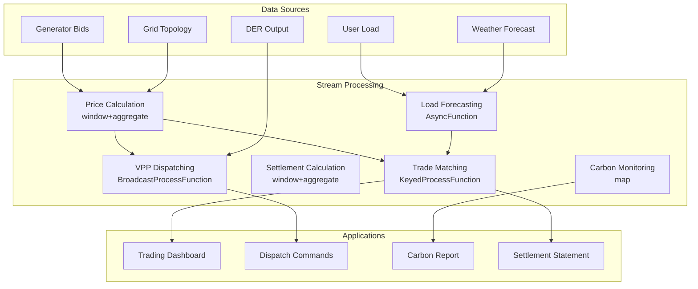

# Operators and Real-time Energy Trading (算子与实时能源交易)

> **Stage**: Knowledge/10-case-studies | **Prerequisites**: [01.10-process-and-async-operators.md](./01.10-process-and-async-operators.md), [operator-energy-grid-monitoring.md](./operator-energy-grid-monitoring.md) | **Formalization Level**: L3
> **Document Scope**: Operator fingerprints and Pipeline design for stream processing operators in real-time electricity market trading, demand response, and carbon emission monitoring
> **Version**: 2026.04

---

## Table of Contents

- [Operators and Real-time Energy Trading (算子与实时能源交易)](#operators-and-real-time-energy-trading-算子与实时能源交易)
  - [Table of Contents](#table-of-contents)
  - [1. Definitions (概念定义)](#1-definitions-概念定义)
    - [Def-ETR-01-01: Real-time Electricity Market (实时电力市场)](#def-etr-01-01-real-time-electricity-market-实时电力市场)
    - [Def-ETR-01-02: Locational Marginal Price (LMP) (节点边际电价)](#def-etr-01-02-locational-marginal-price-lmp-节点边际电价)
    - [Def-ETR-01-03: Demand Response (DR) (需求响应)](#def-etr-01-03-demand-response-dr-需求响应)
    - [Def-ETR-01-04: Virtual Power Plant (VPP) (虚拟电厂)](#def-etr-01-04-virtual-power-plant-vpp-虚拟电厂)
    - [Def-ETR-01-05: Carbon Intensity (碳排放强度)](#def-etr-01-05-carbon-intensity-碳排放强度)
  - [2. Properties (属性推导)](#2-properties-属性推导)
    - [Lemma-ETR-01-01: Power Supply-Demand Balance Constraint (电力供需平衡约束)](#lemma-etr-01-01-power-supply-demand-balance-constraint-电力供需平衡约束)
    - [Lemma-ETR-01-02: Complementarity of Energy Storage Charging and Discharging (储能充放电的互补性)](#lemma-etr-01-02-complementarity-of-energy-storage-charging-and-discharging-储能充放电的互补性)
    - [Prop-ETR-01-01: Volatility of Renewable Energy Output (可再生能源出力的波动性)](#prop-etr-01-01-volatility-of-renewable-energy-output-可再生能源出力的波动性)
    - [Prop-ETR-01-02: Relationship Between Demand Elasticity and Price (需求弹性与价格的关系)](#prop-etr-01-02-relationship-between-demand-elasticity-and-price-需求弹性与价格的关系)
  - [3. Relations (关系建立)](#3-relations-关系建立)
    - [3.1 Energy Trading Pipeline Operator Mapping (能源交易Pipeline算子映射)](#31-energy-trading-pipeline-operator-mapping-能源交易pipeline算子映射)
    - [3.2 Operator Fingerprint (算子指纹)](#32-operator-fingerprint-算子指纹)
    - [3.3 Electricity Market Time Scales (电力市场时间尺度)](#33-electricity-market-time-scales-电力市场时间尺度)
  - [4. Argumentation (论证过程)](#4-argumentation-论证过程)
    - [4.1 Why Energy Trading Needs Stream Processing Rather Than Traditional Dispatching (为什么能源交易需要流处理而非传统调度)](#41-why-energy-trading-needs-stream-processing-rather-than-traditional-dispatching-为什么能源交易需要流处理而非传统调度)
    - [4.2 Challenges of Renewable Energy Grid Integration (可再生能源并网的挑战)](#42-challenges-of-renewable-energy-grid-integration-可再生能源并网的挑战)
    - [4.3 Electricity Market Game Theory and Strategies (电力市场博弈与策略)](#43-electricity-market-game-theory-and-strategies-电力市场博弈与策略)
  - [5. Proof / Engineering Argument (形式证明 / 工程论证)](#5-proof--engineering-argument-形式证明--工程论证)
    - [5.1 Real-time LMP Calculation (实时LMP计算)](#51-real-time-lmp-calculation-实时lmp计算)
    - [5.2 Demand Response Automation (需求响应自动化)](#52-demand-response-automation-需求响应自动化)
    - [5.3 Real-time Carbon Emission Monitoring (碳排放实时监测)](#53-real-time-carbon-emission-monitoring-碳排放实时监测)
  - [6. Examples (实例验证)](#6-examples-实例验证)
    - [6.1 Case Study: Virtual Power Plant Aggregation and Dispatching (实战：虚拟电厂聚合调度)](#61-case-study-virtual-power-plant-aggregation-and-dispatching-实战虚拟电厂聚合调度)
    - [6.2 Case Study: Electric Vehicle V2G Dispatching (实战：电动汽车V2G调度)](#62-case-study-electric-vehicle-v2g-dispatching-实战电动汽车v2g调度)
  - [7. Visualizations (可视化)](#7-visualizations-可视化)
    - [Energy Trading Pipeline (能源交易Pipeline)](#energy-trading-pipeline-能源交易pipeline)
  - [8. References (引用参考)](#8-references-引用参考)

---

## 1. Definitions (概念定义)

### Def-ETR-01-01: Real-time Electricity Market (实时电力市场)

The real-time electricity market is a trading mechanism that determines electricity prices minutes to hours before delivery:

$$\text{Price}_t = \frac{\text{MarginalCost}(\text{Supply}_t)}{1 - \text{CongestionFactor}_t}$$

Market participants: generators, retailers, large consumers, energy storage operators, and Virtual Power Plants (VPPs).

### Def-ETR-01-02: Locational Marginal Price (LMP) (节点边际电价)

LMP is the nodal electricity price that considers generation cost, transmission congestion, and line losses:

$$\text{LMP}_i = \lambda + \sum_{k} \mu_k \cdot \text{SF}_{i,k}$$

where $\lambda$ is the system energy price, $\mu_k$ is the congestion shadow price of line $k$, and $\text{SF}_{i,k}$ is the shift distribution factor of node $i$ with respect to line $k$.

### Def-ETR-01-03: Demand Response (DR) (需求响应)

Demand response is the behavior of consumers adjusting their electricity load based on price signals:

$$\text{Load}_t^{actual} = \text{Load}_t^{baseline} - \text{Response}(\text{Price}_t - \text{Price}_t^{expected})$$

### Def-ETR-01-04: Virtual Power Plant (VPP) (虚拟电厂)

A Virtual Power Plant is a coordination system that aggregates distributed energy resources into a unified dispatchable unit:

$$\text{VPP}_{capacity} = \sum_{i \in \text{DERs}} \text{Capacity}_i \cdot \text{Availability}_i$$

DERs include: distributed photovoltaics, wind power, energy storage, electric vehicles, and controllable loads.

### Def-ETR-01-05: Carbon Intensity (碳排放强度)

Carbon intensity is the amount of CO₂ emitted per unit of electricity generated:

$$\text{CI}_t = \frac{\sum_{g} \text{Output}_{g,t} \cdot \text{EF}_g}{\sum_{g} \text{Output}_{g,t}}$$

where $\text{EF}_g$ is the emission factor of generator $g$ (coal: ~820g/kWh, gas: ~490g/kWh, wind/solar: ~0g/kWh).

---

## 2. Properties (属性推导)

### Lemma-ETR-01-01: Power Supply-Demand Balance Constraint (电力供需平衡约束)

The power system must be balanced in real time:

$$\sum_{g} \text{Generation}_{g,t} = \sum_{d} \text{Demand}_{d,t} + \text{Losses}_t$$

Imbalance will cause the frequency to deviate from the standard 50/60Hz value.

### Lemma-ETR-01-02: Complementarity of Energy Storage Charging and Discharging (储能充放电的互补性)

An energy storage system cannot charge and discharge simultaneously at the same moment:

$$\text{Charge}_t \cdot \text{Discharge}_t = 0$$

**Proof**: Charging and discharging are mutually exclusive physical processes; only one operation can be performed at any given moment. ∎

### Prop-ETR-01-01: Volatility of Renewable Energy Output (可再生能源出力的波动性)

The relationship between wind/solar power output and meteorological conditions:

$$P_{wind} = \frac{1}{2} \rho A C_p v^3, \quad P_{solar} = \eta \cdot A \cdot G \cdot (1 - \alpha \cdot (T - T_{ref}))$$

where $v$ is wind speed, $G$ is solar irradiance, and $T$ is panel temperature. Output uncertainty leads to electricity price volatility.

### Prop-ETR-01-02: Relationship Between Demand Elasticity and Price (需求弹性与价格的关系)

Price elasticity of demand:

$$\epsilon_D = \frac{\Delta Q / Q}{\Delta P / P}$$

Short-term elasticity for electricity is approximately -0.1 to -0.3 (inelastic), and long-term elasticity is approximately -0.3 to -0.7.

---

## 3. Relations (关系建立)

### 3.1 Energy Trading Pipeline Operator Mapping (能源交易Pipeline算子映射)

| Application Scenario | Operator Combination | Data Source | Latency Requirement |
|---------|---------|--------|---------|
| **Price Calculation** | window+aggregate + map | Generator bids | < 5min |
| **Load Forecasting** | AsyncFunction + window | Historical + weather | < 15min |
| **Trade Matching** | KeyedProcessFunction | Buy/sell orders | < 1min |
| **Settlement Calculation** | window+aggregate | Actual output | Daily |
| **Carbon Monitoring** | map + window | Generation mix | < 5min |
| **Demand Response** | Broadcast + ProcessFunction | Price signals | < 1min |

### 3.2 Operator Fingerprint (算子指纹)

| Dimension | Energy Trading Characteristics |
|------|------------|
| **Core Operators** | KeyedProcessFunction (trade matching), AsyncFunction (load forecasting), BroadcastProcessFunction (price signals), window+aggregate (settlement) |
| **State Types** | ValueState (account balance/position), MapState (order book), BroadcastState (market rules) |
| **Time Semantics** | Event time (transaction timestamp) |
| **Data Characteristics** | High frequency (second-level bids), strong seasonality, policy-sensitive |
| **State Hotspots** | Keys of popular trading products |
| **Performance Bottlenecks** | Complex optimization solving, external weather APIs |

### 3.3 Electricity Market Time Scales (电力市场时间尺度)

| Market Type | Trading Cycle | Delivery Time | Price Characteristics |
|---------|---------|---------|---------|
| **Day-ahead Market** | Day before | Next day 24h | Relatively stable |
| **Intraday Market** | 4h before delivery | 1-4h later | Moderate volatility |
| **Real-time Market** | 5-15min before delivery | 5-15min later | High volatility |
| **Ancillary Services** | Real-time | Instantaneous | High premium |

---

## 4. Argumentation (论证过程)

### 4.1 Why Energy Trading Needs Stream Processing Rather Than Traditional Dispatching (为什么能源交易需要流处理而非传统调度)

Problems with traditional dispatching:

- Day-ahead planning: Unable to handle sudden changes in renewable energy output
- Manual dispatching: Slow response, unable to capture market opportunities
- Offline settlement: Disputes discovered with significant delay

Advantages of stream processing:

- Real-time pricing: Dynamic pricing based on the latest supply and demand data
- Automated trading: Algorithms automatically place orders based on price signals
- Real-time settlement: Transactions cleared immediately upon execution

### 4.2 Challenges of Renewable Energy Grid Integration (可再生能源并网的挑战)

**Problem**: Wind/solar power output fluctuates randomly, and traditional thermal power cannot track it quickly.

**Stream Processing Solution**:

1. **Real-time Output Forecasting**: Predict output for the next 15 minutes based on weather data
2. **Energy Storage Coordination**: Automatically dispatch energy storage charging/discharging when forecast deviations occur
3. **Demand Response**: Guide users to adjust loads through price signals

### 4.3 Electricity Market Game Theory and Strategies (电力市场博弈与策略)

**Scenario**: Multiple generators bidding strategically in the real-time market.

**Strategies**:

1. **Price Taker**: Bid at marginal cost
2. **Strategic Bidding**: Consider competitors' behavior
3. **Learning Algorithms**: Optimize bidding strategies using reinforcement learning

---

## 5. Proof / Engineering Argument (形式证明 / 工程论证)

### 5.1 Real-time LMP Calculation (实时LMP计算)

```java
public class LMPCalculationFunction extends BroadcastProcessFunction<GeneratorBid, GridTopology, LMPResult> {
    private ValueState<GridState> gridState;

    @Override
    public void processElement(GeneratorBid bid, ReadOnlyContext ctx, Collector<LMPResult> out) throws Exception {
        GridState state = gridState.value();
        if (state == null) state = new GridState();

        state.updateBid(bid);

        // Read grid topology (Broadcast State)
        ReadOnlyBroadcastState<String, GridTopology> topo = ctx.getBroadcastState(TOPOLOGY_DESCRIPTOR);
        GridTopology topology = topo.get("default");

        if (topology == null) return;

        // Economic dispatch solution (simplified: sort by marginal cost)
        List<GeneratorBid> sortedBids = state.getAllBids().stream()
            .sorted(Comparator.comparing(GeneratorBid::getMarginalCost))
            .collect(Collectors.toList());

        double totalDemand = state.getTotalDemand();
        double dispatched = 0;
        double systemLambda = 0;

        for (GeneratorBid b : sortedBids) {
            if (dispatched >= totalDemand) break;
            double toDispatch = Math.min(b.getMaxOutput(), totalDemand - dispatched);
            dispatched += toDispatch;
            systemLambda = b.getMarginalCost();
            state.dispatch(b.getGeneratorId(), toDispatch);
        }

        // Calculate LMP for each node (simplified: assume no congestion)
        for (String node : topology.getNodes()) {
            double lmp = systemLambda;
            // Add congestion component (actual solution requires DC OPF)
            double congestion = topology.getCongestionFactor(node);
            lmp *= (1 + congestion);

            out.collect(new LMPResult(node, lmp, systemLambda, congestion, ctx.timestamp()));
        }

        gridState.update(state);
    }

    @Override
    public void processBroadcastElement(GridTopology topo, Context ctx, Collector<LMPResult> out) {
        ctx.getBroadcastState(TOPOLOGY_DESCRIPTOR).put("default", topo);
    }
}
```

### 5.2 Demand Response Automation (需求响应自动化)

```java
// Price signal stream
DataStream<PriceSignal> prices = env.addSource(new MarketPriceSource());

// User load stream
DataStream<UserLoad> loads = env.addSource(new SmartMeterSource());

// Demand response engine
loads.keyBy(UserLoad::getUserId)
    .connect(prices.broadcast())
    .process(new BroadcastProcessFunction<UserLoad, PriceSignal, LoadAdjustment>() {
        private ValueState<UserPreference> userPref;

        @Override
        public void processElement(UserLoad load, ReadOnlyContext ctx, Collector<LoadAdjustment> out) throws Exception {
            ReadOnlyBroadcastState<String, PriceSignal> priceState = ctx.getBroadcastState(PRICE_DESCRIPTOR);
            PriceSignal price = priceState.get(load.getRegion());

            if (price == null) return;

            UserPreference pref = userPref.value();
            if (pref == null) pref = new UserPreference();

            // Price response model
            double baseline = load.getBaselineLoad();
            double priceRatio = price.getCurrentPrice() / price.getExpectedPrice();

            double elasticity = pref.getPriceElasticity();
            double adjustment = baseline * elasticity * (priceRatio - 1);

            // Constraint: maximum adjustment cannot exceed 30% of capacity
            double maxAdjustment = baseline * 0.3;
            adjustment = Math.max(-maxAdjustment, Math.min(maxAdjustment, adjustment));

            out.collect(new LoadAdjustment(load.getUserId(), adjustment, price.getCurrentPrice(), ctx.timestamp()));
        }

        @Override
        public void processBroadcastElement(PriceSignal price, Context ctx, Collector<LoadAdjustment> out) {
            ctx.getBroadcastState(PRICE_DESCRIPTOR).put(price.getRegion(), price);
        }
    })
    .addSink(new DRControlSink());
```

### 5.3 Real-time Carbon Emission Monitoring (碳排放实时监测)

```java
// Generation output stream
DataStream<GenerationOutput> generation = env.addSource(new SCADASource());

// Carbon emission calculation
generation.keyBy(GenerationOutput::getRegion)
    .window(TumblingProcessingTimeWindows.of(Time.minutes(5)))
    .aggregate(new CarbonAggregate())
    .map(new CarbonIntensityFunction())
    .addSink(new CarbonDashboardSink());

public class CarbonIntensityFunction implements MapFunction<CarbonAggregateResult, CarbonIntensityReport> {
    private Map<String, Double> emissionFactors = new HashMap<>();

    public CarbonIntensityFunction() {
        emissionFactors.put("COAL", 0.82);
        emissionFactors.put("GAS", 0.49);
        emissionFactors.put("OIL", 0.72);
        emissionFactors.put("NUCLEAR", 0.012);
        emissionFactors.put("WIND", 0.0);
        emissionFactors.put("SOLAR", 0.0);
        emissionFactors.put("HYDRO", 0.024);
    }

    @Override
    public CarbonIntensityReport map(CarbonAggregateResult result) {
        double totalEmissions = 0;
        double totalOutput = 0;

        for (Map.Entry<String, Double> entry : result.getGenerationByType().entrySet()) {
            String type = entry.getKey();
            double output = entry.getValue();
            double ef = emissionFactors.getOrDefault(type, 0.5);
            totalEmissions += output * ef;
            totalOutput += output;
        }

        double ci = totalOutput > 0 ? totalEmissions / totalOutput : 0;
        return new CarbonIntensityReport(result.getRegion(), ci, totalOutput, result.getTimestamp());
    }
}
```

---

## 6. Examples (实例验证)

### 6.1 Case Study: Virtual Power Plant Aggregation and Dispatching (实战：虚拟电厂聚合调度)

```java
// Distributed Energy Resource (DER) data stream
DataStream<DEROutput> ders = env.addSource(new DERSource());

// VPP aggregation
ders.keyBy(DEROutput::getVppId)
    .window(SlidingEventTimeWindows.of(Time.minutes(15), Time.minutes(5)))
    .aggregate(new VPPCapacityAggregate())
    .process(new KeyedProcessFunction<String, VPPCapacity, VPPBid>() {
        private ValueState<VPPStrategy> strategy;

        @Override
        public void processElement(VPPCapacity capacity, Context ctx, Collector<VPPBid> out) throws Exception {
            VPPStrategy s = strategy.value();
            if (s == null) s = new VPPStrategy();

            // Determine bidding strategy based on market price
            double availableCapacity = capacity.getTotalCapacity();
            double bidPrice = s.calculateBidPrice(capacity.getMarginalCost());

            out.collect(new VPPBid(capacity.getVppId(), availableCapacity, bidPrice, ctx.timestamp()));
        }
    })
    .addSink(new MarketBidSink());
```

### 6.2 Case Study: Electric Vehicle V2G Dispatching (实战：电动汽车V2G调度)

```java
// Electric vehicle status stream
DataStream<EVStatus> evs = env.addSource(new EVChargingSource());

// V2G (Vehicle-to-Grid) dispatching
evs.keyBy(EVStatus::getChargingStationId)
    .connect(priceSignals.broadcast())
    .process(new CoProcessFunction<EVStatus, PriceSignal, EVCommand>() {
        private MapState<String, EVStatus> connectedEVs;

        @Override
        public void processElement1(EVStatus ev, Context ctx, Collector<EVCommand> out) throws Exception {
            connectedEVs.put(ev.getVehicleId(), ev);

            // Decide charging/discharging based on electricity price and SOC
            if (ev.getSoc() < 0.2) {
                out.collect(new EVCommand(ev.getVehicleId(), "CHARGE", ev.getMaxChargeRate()));
            } else if (ev.getSoc() > 0.8 && price.getCurrentPrice() > price.getExpectedPrice() * 1.5) {
                out.collect(new EVCommand(ev.getVehicleId(), "DISCHARGE", ev.getMaxDischargeRate()));
            }
        }

        @Override
        public void processElement2(PriceSignal price, Context ctx, Collector<EVCommand> out) {
            // Price update triggers global dispatch optimization
        }
    })
    .addSink(new EVControllerSink());
```

---

## 7. Visualizations (可视化)

### Energy Trading Pipeline (能源交易Pipeline)

The following diagram illustrates the end-to-end data flow in a real-time energy trading system, from data sources through stream processing to downstream applications.



---

## 8. References (引用参考)


---

*Related Documents*: [01.10-process-and-async-operators.md](./01.10-process-and-async-operators.md) | [operator-energy-grid-monitoring.md](./operator-energy-grid-monitoring.md) | [realtime-smart-agriculture-case-study.md](./realtime-smart-agriculture-case-study.md)
