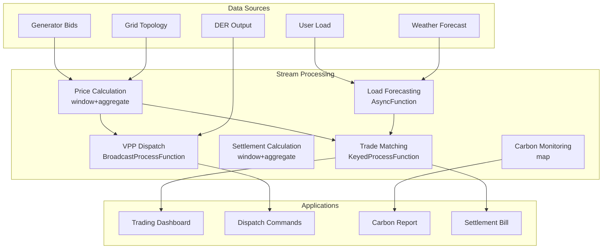

# Operators and Real-time Energy Trading

> **Stage**: Knowledge/10-case-studies | **Prerequisites**: [01.10-process-and-async-operators.md](../Knowledge/01-concept-atlas/operator-deep-dive/01.10-process-and-async-operators.md), [operator-energy-grid-monitoring.md](operator-energy-grid-monitoring.md) | **Formalization Level**: L3
> **Document Positioning**: Operator fingerprints and Pipeline design for stream processing operators in real-time electricity market trading, demand response, and carbon emission monitoring
> **Version**: 2026.04

---

## Table of Contents

- [Operators and Real-time Energy Trading](#operators-and-real-time-energy-trading)
  - [Table of Contents](#table-of-contents)
  - [1. Definitions](#1-definitions)
    - [Def-ETR-01-01: Real-time Electricity Market (实时电力市场)](#def-etr-01-01-real-time-electricity-market-实时电力市场)
    - [Def-ETR-01-02: Locational Marginal Price, LMP (节点边际电价)](#def-etr-01-02-locational-marginal-price-lmp-节点边际电价)
    - [Def-ETR-01-03: Demand Response, DR (需求响应)](#def-etr-01-03-demand-response-dr-需求响应)
    - [Def-ETR-01-04: Virtual Power Plant, VPP (虚拟电厂)](#def-etr-01-04-virtual-power-plant-vpp-虚拟电厂)
    - [Def-ETR-01-05: Carbon Intensity (碳排放强度)](#def-etr-01-05-carbon-intensity-碳排放强度)
  - [2. Properties](#2-properties)
    - [Lemma-ETR-01-01: Power Supply-Demand Balance Constraint](#lemma-etr-01-01-power-supply-demand-balance-constraint)
    - [Lemma-ETR-01-02: Complementarity of Energy Storage Charge and Discharge](#lemma-etr-01-02-complementarity-of-energy-storage-charge-and-discharge)
    - [Prop-ETR-01-01: Volatility of Renewable Energy Output](#prop-etr-01-01-volatility-of-renewable-energy-output)
    - [Prop-ETR-01-02: Relationship Between Demand Elasticity and Price](#prop-etr-01-02-relationship-between-demand-elasticity-and-price)
  - [3. Relations](#3-relations)
    - [3.1 Energy Trading Pipeline Operator Mapping](#31-energy-trading-pipeline-operator-mapping)
    - [3.2 Operator Fingerprints](#32-operator-fingerprints)
    - [3.3 Electricity Market Time Scales](#33-electricity-market-time-scales)
  - [4. Argumentation](#4-argumentation)
    - [4.1 Why Energy Trading Requires Stream Processing Instead of Traditional Dispatch](#41-why-energy-trading-requires-stream-processing-instead-of-traditional-dispatch)
    - [4.2 Challenges of Renewable Energy Grid Integration](#42-challenges-of-renewable-energy-grid-integration)
    - [4.3 Electricity Market Game Theory and Strategies](#43-electricity-market-game-theory-and-strategies)
  - [5. Proof / Engineering Argument](#5-proof--engineering-argument)
    - [5.1 Real-time LMP Calculation](#51-real-time-lmp-calculation)
    - [5.2 Demand Response Automation](#52-demand-response-automation)
    - [5.3 Real-time Carbon Emission Monitoring](#53-real-time-carbon-emission-monitoring)
  - [6. Examples](#6-examples)
    - [6.1 Practical Case: Virtual Power Plant Aggregated Dispatch](#61-practical-case-virtual-power-plant-aggregated-dispatch)
    - [6.2 Practical Case: Electric Vehicle V2G Dispatch](#62-practical-case-electric-vehicle-v2g-dispatch)
  - [7. Visualizations](#7-visualizations)
    - [Energy Trading Pipeline](#energy-trading-pipeline)
  - [8. References](#8-references)

---

## 1. Definitions

### Def-ETR-01-01: Real-time Electricity Market (实时电力市场)

The real-time electricity market is a trading mechanism that determines electricity prices minutes to hours before delivery:

$$\text{Price}_t = \frac{\text{MarginalCost}(\text{Supply}_t)}{1 - \text{CongestionFactor}_t}$$

Market participants: generators, retailers, large consumers, energy storage operators, and Virtual Power Plants (VPPs).

### Def-ETR-01-02: Locational Marginal Price, LMP (节点边际电价)

LMP is the nodal electricity price that considers generation cost, transmission congestion, and line losses:

$$\text{LMP}_i = \lambda + \sum_{k} \mu_k \cdot \text{SF}_{i,k}$$

Where $\lambda$ is the system energy price, $\mu_k$ is the congestion shadow price of line $k$, and $\text{SF}_{i,k}$ is the shift distribution factor of node $i$ with respect to line $k$.

### Def-ETR-01-03: Demand Response, DR (需求响应)

Demand Response is the behavior of users adjusting their electricity load based on price signals:

$$\text{Load}_t^{actual} = \text{Load}_t^{baseline} - \text{Response}(\text{Price}_t - \text{Price}_t^{expected})$$

### Def-ETR-01-04: Virtual Power Plant, VPP (虚拟电厂)

A Virtual Power Plant is a coordination system that aggregates distributed energy resources into a unified dispatchable unit:

$$\text{VPP}_{capacity} = \sum_{i \in \text{DERs}} \text{Capacity}_i \cdot \text{Availability}_i$$

DERs include: distributed photovoltaic (PV), wind power, energy storage, electric vehicles (EVs), and controllable loads.

### Def-ETR-01-05: Carbon Intensity (碳排放强度)

Carbon Intensity is the CO₂ emission per unit of electricity generated:

$$\text{CI}_t = \frac{\sum_{g} \text{Output}_{g,t} \cdot \text{EF}_g}{\sum_{g} \text{Output}_{g,t}}$$

Where $\text{EF}_g$ is the emission factor of generator $g$ (coal: ~820g/kWh, gas: ~490g/kWh, wind/solar: ~0g/kWh).

---

## 2. Properties

### Lemma-ETR-01-01: Power Supply-Demand Balance Constraint

The power system must be balanced in real time:

$$\sum_{g} \text{Generation}_{g,t} = \sum_{d} \text{Demand}_{d,t} + \text{Losses}_t$$

Imbalance will cause frequency deviation from the standard 50/60Hz value.

### Lemma-ETR-01-02: Complementarity of Energy Storage Charge and Discharge

An energy storage system cannot charge and discharge simultaneously at the same moment:

$$\text{Charge}_t \cdot \text{Discharge}_t = 0$$

**Proof**: Charging and discharging are mutually exclusive physical processes; only one operation can be performed at any given moment. ∎

### Prop-ETR-01-01: Volatility of Renewable Energy Output

The relationship between wind/solar power output and meteorological conditions:

$$P_{wind} = \frac{1}{2} \rho A C_p v^3, \quad P_{solar} = \eta \cdot A \cdot G \cdot (1 - \alpha \cdot (T - T_{ref}))$$

Where $v$ is wind speed, $G$ is solar irradiance, and $T$ is panel temperature. Output uncertainty leads to electricity price volatility.

### Prop-ETR-01-02: Relationship Between Demand Elasticity and Price

Price elasticity of demand:

$$\epsilon_D = \frac{\Delta Q / Q}{\Delta P / P}$$

The short-term elasticity of electricity is approximately -0.1 to -0.3 (inelastic), and the long-term elasticity is approximately -0.3 to -0.7.

---

## 3. Relations

### 3.1 Energy Trading Pipeline Operator Mapping

| Application Scenario | Operator Combination | Data Source | Latency Requirement |
|---------|---------|--------|---------|
| **Price Calculation** | window+aggregate + map | Generator bids | < 5min |
| **Load Forecasting** | AsyncFunction + window | Historical + weather | < 15min |
| **Trade Matching** | KeyedProcessFunction | Buy/sell orders | < 1min |
| **Settlement Calculation** | window+aggregate | Actual output | Daily |
| **Carbon Monitoring** | map + window | Generation mix | < 5min |
| **Demand Response** | Broadcast + ProcessFunction | Price signals | < 1min |

### 3.2 Operator Fingerprints

| Dimension | Energy Trading Characteristics |
|------|------------|
| **Core Operators** | KeyedProcessFunction (trade matching), AsyncFunction (load forecasting), BroadcastProcessFunction (price signals), window+aggregate (settlement) |
| **State Types** | ValueState (account balance/position), MapState (order book), BroadcastState (market rules) |
| **Time Semantics** | Event time (transaction timestamp) |
| **Data Characteristics** | High frequency (second-level bids), strong seasonality, policy-sensitive |
| **State Hotspots** | Hot trading product keys |
| **Performance Bottlenecks** | Complex optimization solving, external weather APIs |

### 3.3 Electricity Market Time Scales

| Market Type | Trading Cycle | Delivery Time | Price Characteristics |
|---------|---------|---------|---------|
| **Day-ahead Market** | Day before | Next day 24h | Relatively stable |
| **Intraday Market** | 4h before delivery | 1-4h later | Medium volatility |
| **Real-time Market** | 5-15min before delivery | 5-15min later | High volatility |
| **Ancillary Services** | Real-time | Immediate | High premium |

---

## 4. Argumentation

### 4.1 Why Energy Trading Requires Stream Processing Instead of Traditional Dispatch

Problems with traditional dispatch:

- Day-ahead planning: Unable to cope with sudden changes in renewable energy output
- Manual dispatch: Slow response, unable to capture market opportunities
- Offline settlement: Delayed dispute discovery

Advantages of stream processing:

- Real-time pricing: Dynamic pricing based on the latest supply and demand data
- Automated trading: Algorithms automatically place orders based on price signals
- Real-time settlement: Trade-and-clear

### 4.2 Challenges of Renewable Energy Grid Integration

**Problem**: Wind/PV output fluctuates randomly, and traditional thermal power cannot track quickly.

**Stream Processing Solution**:

1. **Real-time output forecasting**: Predict output for the next 15 minutes based on weather data
2. **Energy storage coordination**: Automatically dispatch energy storage charging/discharging when forecast deviations occur
3. **Demand response**: Price signals guide users to adjust their load

### 4.3 Electricity Market Game Theory and Strategies

**Scenario**: Multiple generators bid strategically in the real-time market.

**Strategies**:

1. **Price taker**: Bid at marginal cost
2. **Strategic bidding**: Consider competitor behavior
3. **Learning algorithms**: Reinforcement learning optimizes bidding strategies

---

## 5. Proof / Engineering Argument

### 5.1 Real-time LMP Calculation

```java
public class LMPCalculationFunction extends BroadcastProcessFunction<GeneratorBid, GridTopology, LMPResult> {
    private ValueState<GridState> gridState;

    @Override
    public void processElement(GeneratorBid bid, ReadOnlyContext ctx, Collector<LMPResult> out) throws Exception {
        GridState state = gridState.value();
        if (state == null) state = new GridState();

        state.updateBid(bid);

        // Read grid topology (Broadcast State)
        ReadOnlyBroadcastState<String, GridTopology> topo = ctx.getBroadcastState(TOPOLOGY_DESCRIPTOR);
        GridTopology topology = topo.get("default");

        if (topology == null) return;

        // Economic dispatch solution (simplified: sort by marginal cost)
        List<GeneratorBid> sortedBids = state.getAllBids().stream()
            .sorted(Comparator.comparing(GeneratorBid::getMarginalCost))
            .collect(Collectors.toList());

        double totalDemand = state.getTotalDemand();
        double dispatched = 0;
        double systemLambda = 0;

        for (GeneratorBid b : sortedBids) {
            if (dispatched >= totalDemand) break;
            double toDispatch = Math.min(b.getMaxOutput(), totalDemand - dispatched);
            dispatched += toDispatch;
            systemLambda = b.getMarginalCost();
            state.dispatch(b.getGeneratorId(), toDispatch);
        }

        // Calculate LMP for each node (simplified: assume no congestion)
        for (String node : topology.getNodes()) {
            double lmp = systemLambda;
            // Add congestion component (actual solution requires DC OPF)
            double congestion = topology.getCongestionFactor(node);
            lmp *= (1 + congestion);

            out.collect(new LMPResult(node, lmp, systemLambda, congestion, ctx.timestamp()));
        }

        gridState.update(state);
    }

    @Override
    public void processBroadcastElement(GridTopology topo, Context ctx, Collector<LMPResult> out) {
        ctx.getBroadcastState(TOPOLOGY_DESCRIPTOR).put("default", topo);
    }
}
```

### 5.2 Demand Response Automation

```java
// Price signal stream
DataStream<PriceSignal> prices = env.addSource(new MarketPriceSource());

// User load stream
DataStream<UserLoad> loads = env.addSource(new SmartMeterSource());

// Demand response engine
loads.keyBy(UserLoad::getUserId)
    .connect(prices.broadcast())
    .process(new BroadcastProcessFunction<UserLoad, PriceSignal, LoadAdjustment>() {
        private ValueState<UserPreference> userPref;

        @Override
        public void processElement(UserLoad load, ReadOnlyContext ctx, Collector<LoadAdjustment> out) throws Exception {
            ReadOnlyBroadcastState<String, PriceSignal> priceState = ctx.getBroadcastState(PRICE_DESCRIPTOR);
            PriceSignal price = priceState.get(load.getRegion());

            if (price == null) return;

            UserPreference pref = userPref.value();
            if (pref == null) pref = new UserPreference();

            // Price response model
            double baseline = load.getBaselineLoad();
            double priceRatio = price.getCurrentPrice() / price.getExpectedPrice();

            double elasticity = pref.getPriceElasticity();
            double adjustment = baseline * elasticity * (priceRatio - 1);

            // Constraint: maximum adjustment does not exceed 30% of capacity
            double maxAdjustment = baseline * 0.3;
            adjustment = Math.max(-maxAdjustment, Math.min(maxAdjustment, adjustment));

            out.collect(new LoadAdjustment(load.getUserId(), adjustment, price.getCurrentPrice(), ctx.timestamp()));
        }

        @Override
        public void processBroadcastElement(PriceSignal price, Context ctx, Collector<LoadAdjustment> out) {
            ctx.getBroadcastState(PRICE_DESCRIPTOR).put(price.getRegion(), price);
        }
    })
    .addSink(new DRControlSink());
```

### 5.3 Real-time Carbon Emission Monitoring

```java
// Generation output stream
DataStream<GenerationOutput> generation = env.addSource(new SCADASource());

// Carbon emission calculation
generation.keyBy(GenerationOutput::getRegion)
    .window(TumblingProcessingTimeWindows.of(Time.minutes(5)))
    .aggregate(new CarbonAggregate())
    .map(new CarbonIntensityFunction())
    .addSink(new CarbonDashboardSink());

public class CarbonIntensityFunction implements MapFunction<CarbonAggregateResult, CarbonIntensityReport> {
    private Map<String, Double> emissionFactors = new HashMap<>();

    public CarbonIntensityFunction() {
        emissionFactors.put("COAL", 0.82);
        emissionFactors.put("GAS", 0.49);
        emissionFactors.put("OIL", 0.72);
        emissionFactors.put("NUCLEAR", 0.012);
        emissionFactors.put("WIND", 0.0);
        emissionFactors.put("SOLAR", 0.0);
        emissionFactors.put("HYDRO", 0.024);
    }

    @Override
    public CarbonIntensityReport map(CarbonAggregateResult result) {
        double totalEmissions = 0;
        double totalOutput = 0;

        for (Map.Entry<String, Double> entry : result.getGenerationByType().entrySet()) {
            String type = entry.getKey();
            double output = entry.getValue();
            double ef = emissionFactors.getOrDefault(type, 0.5);
            totalEmissions += output * ef;
            totalOutput += output;
        }

        double ci = totalOutput > 0 ? totalEmissions / totalOutput : 0;
        return new CarbonIntensityReport(result.getRegion(), ci, totalOutput, result.getTimestamp());
    }
}
```

---

## 6. Examples

### 6.1 Practical Case: Virtual Power Plant Aggregated Dispatch

```java
// Distributed Energy Resource (DER) data stream
DataStream<DEROutput> ders = env.addSource(new DERSource());

// VPP aggregation
ders.keyBy(DEROutput::getVppId)
    .window(SlidingEventTimeWindows.of(Time.minutes(15), Time.minutes(5)))
    .aggregate(new VPPCapacityAggregate())
    .process(new KeyedProcessFunction<String, VPPCapacity, VPPBid>() {
        private ValueState<VPPStrategy> strategy;

        @Override
        public void processElement(VPPCapacity capacity, Context ctx, Collector<VPPBid> out) throws Exception {
            VPPStrategy s = strategy.value();
            if (s == null) s = new VPPStrategy();

            // Determine bidding strategy based on market price
            double availableCapacity = capacity.getTotalCapacity();
            double bidPrice = s.calculateBidPrice(capacity.getMarginalCost());

            out.collect(new VPPBid(capacity.getVppId(), availableCapacity, bidPrice, ctx.timestamp()));
        }
    })
    .addSink(new MarketBidSink());
```

### 6.2 Practical Case: Electric Vehicle V2G Dispatch

```java
// EV status stream
DataStream<EVStatus> evs = env.addSource(new EVChargingSource());

// V2G (Vehicle-to-Grid) dispatch
evs.keyBy(EVStatus::getChargingStationId)
    .connect(priceSignals.broadcast())
    .process(new CoProcessFunction<EVStatus, PriceSignal, EVCommand>() {
        private MapState<String, EVStatus> connectedEVs;

        @Override
        public void processElement1(EVStatus ev, Context ctx, Collector<EVCommand> out) throws Exception {
            connectedEVs.put(ev.getVehicleId(), ev);

            // Determine charge/discharge based on electricity price and SOC
            if (ev.getSoc() < 0.2) {
                out.collect(new EVCommand(ev.getVehicleId(), "CHARGE", ev.getMaxChargeRate()));
            } else if (ev.getSoc() > 0.8 && price.getCurrentPrice() > price.getExpectedPrice() * 1.5) {
                out.collect(new EVCommand(ev.getVehicleId(), "DISCHARGE", ev.getMaxDischargeRate()));
            }
        }

        @Override
        public void processElement2(PriceSignal price, Context ctx, Collector<EVCommand> out) {
            // Price update triggers global dispatch optimization
        }
    })
    .addSink(new EVControllerSink());
```

---

## 7. Visualizations

### Energy Trading Pipeline

The following diagram illustrates the end-to-end stream processing pipeline for real-time energy trading.



---

## 8. References


---

*Related Documents*: [01.10-process-and-async-operators.md](../Knowledge/01-concept-atlas/operator-deep-dive/01.10-process-and-async-operators.md) | [operator-energy-grid-monitoring.md](operator-energy-grid-monitoring.md) | [realtime-smart-agriculture-case-study.md](realtime-smart-agriculture-case-study.md)
