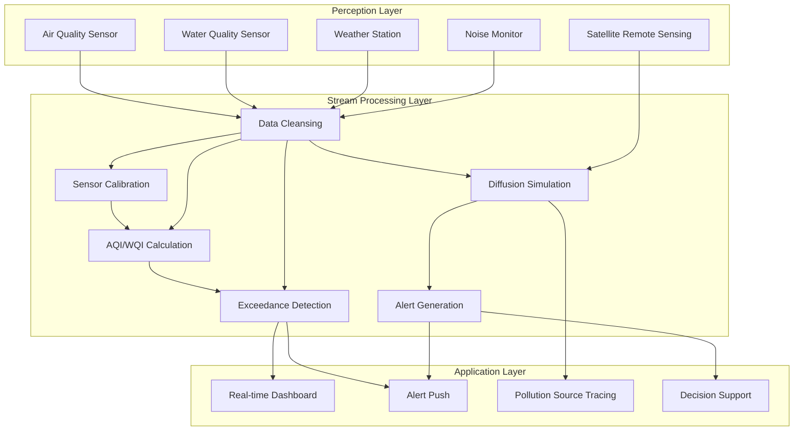

# Operators and Real-Time Environmental Monitoring

> **Stage**: Knowledge/10-case-studies | **Prerequisites**: [01.06-single-input-operators.md](../Knowledge/01-concept-atlas/operator-deep-dive/01.06-single-input-operators.md), [operator-edge-computing-integration.md](./operator-edge-computing-integration.md) | **Formalization Level**: L3
> **Document Positioning**: Operator fingerprints and Pipeline design for stream processing operators in real-time air quality monitoring, water quality monitoring, and meteorological early warning
> **Version**: 2026.04

---

## Table of Contents

- [Operators and Real-Time Environmental Monitoring](#operators-and-real-time-environmental-monitoring)
  - [Table of Contents](#table-of-contents)
  - [1. Concept Definitions](#1-concept-definitions)
    - [Def-ENV-01-01: Environmental Monitoring IoT (环境监测物联网, Env-IoT)](#def-env-01-01-environmental-monitoring-iot-环境监测物联网-env-iot)
    - [Def-ENV-01-02: Air Quality Index (空气质量指数, AQI)](#def-env-01-02-air-quality-index-空气质量指数-aqi)
    - [Def-ENV-01-03: Water Quality Index (水质指数, WQI)](#def-env-01-03-water-quality-index-水质指数-wqi)
    - [Def-ENV-01-04: Gaussian Plume Model (高斯烟羽模型)](#def-env-01-04-gaussian-plume-model-高斯烟羽模型)
    - [Def-ENV-01-05: Extreme Weather Alert (极端天气预警)](#def-env-01-05-extreme-weather-alert-极端天气预警)
  - [2. Property Derivation](#2-property-derivation)
    - [Lemma-ENV-01-01: Temporal Correlation of Sensor Data](#lemma-env-01-01-temporal-correlation-of-sensor-data)
    - [Lemma-ENV-01-02: Spatial Smoothness of AQI](#lemma-env-01-02-spatial-smoothness-of-aqi)
    - [Prop-ENV-01-01: Impact of Missing Data on AQI Calculation](#prop-env-01-01-impact-of-missing-data-on-aqi-calculation)
    - [Prop-ENV-01-02: Trade-off Between Alert Lead Time and False Alarm Rate](#prop-env-01-02-trade-off-between-alert-lead-time-and-false-alarm-rate)
  - [3. Relation Establishment](#3-relation-establishment)
    - [3.1 Environmental Monitoring Pipeline Operator Mapping](#31-environmental-monitoring-pipeline-operator-mapping)
    - [3.2 Operator Fingerprint](#32-operator-fingerprint)
    - [3.3 Monitoring Parameter Comparison](#33-monitoring-parameter-comparison)
  - [4. Argumentation](#4-argumentation)
    - [4.1 Why Environmental Monitoring Needs Stream Processing Instead of Scheduled Sampling](#41-why-environmental-monitoring-needs-stream-processing-instead-of-scheduled-sampling)
    - [4.2 Data Compensation for Sensor Failures](#42-data-compensation-for-sensor-failures)
    - [4.3 Challenges of Multi-Source Data Fusion](#43-challenges-of-multi-source-data-fusion)
  - [5. Formal Proof / Engineering Argument](#5-formal-proof--engineering-argument)
    - [5.1 Real-Time AQI Calculation Pipeline](#51-real-time-aqi-calculation-pipeline)
    - [5.2 Pollution Source Diffusion Tracking](#52-pollution-source-diffusion-tracking)
    - [5.3 Extreme Weather Alert](#53-extreme-weather-alert)
  - [6. Example Verification](#6-example-verification)
    - [6.1 Case Study: Urban Air Quality Real-Time Monitoring Platform](#61-case-study-urban-air-quality-real-time-monitoring-platform)
    - [6.2 Case Study: River Water Quality Real-Time Monitoring](#62-case-study-river-water-quality-real-time-monitoring)
  - [7. Visualizations](#7-visualizations)
    - [Environmental Monitoring Pipeline](#environmental-monitoring-pipeline)
  - [8. References](#8-references)

---

## 1. Concept Definitions

### Def-ENV-01-01: Environmental Monitoring IoT (环境监测物联网, Env-IoT)

Environmental Monitoring IoT (环境监测物联网, Env-IoT) is a sensor network deployed in urban/natural areas for real-time collection of environmental parameters:

$$\text{EnvIoT} = \{s_i : (\text{parameter}_i, \text{location}_i, \text{frequency}_i, \text{calibration}_i)\}_{i=1}^{n}$$

Monitoring parameters: PM2.5, PM10, SO₂, NO₂, CO, O₃, CO₂, temperature, humidity, wind speed, noise, water quality (pH/dissolved oxygen/turbidity).

### Def-ENV-01-02: Air Quality Index (空气质量指数, AQI)

Air Quality Index (空气质量指数, AQI) is an index that synthesizes multiple pollutant concentrations into a single value:

$$\text{AQI} = \max_i \left(\frac{C_i - C_{i}^{low}}{C_{i}^{high} - C_{i}^{low}} \times (I_{i}^{high} - I_{i}^{low}) + I_{i}^{low}\right)$$

Where $C_i$ is the concentration of pollutant $i$, $C_i^{low/high}$ are the corresponding concentration limits, and $I_i^{low/high}$ are the corresponding index limits.

### Def-ENV-01-03: Water Quality Index (水质指数, WQI)

Water Quality Index (水质指数, WQI) is a multi-parameter comprehensive water quality evaluation indicator:

$$\text{WQI} = \frac{\sum_{i=1}^{n} w_i \cdot q_i}{\sum_{i=1}^{n} w_i}$$

Where $w_i$ is the parameter weight, and $q_i = \frac{C_i}{S_i} \times 100$ is the parameter quality score ($S_i$ is the standard limit).

### Def-ENV-01-04: Gaussian Plume Model (高斯烟羽模型)

The Gaussian Plume Model (高斯烟羽模型) describes the spatial diffusion of pollutants:

$$C(x, y, z) = \frac{Q}{2\pi u \sigma_y \sigma_z} \exp\left(-\frac{y^2}{2\sigma_y^2}\right) \left[\exp\left(-\frac{(z-H)^2}{2\sigma_z^2}\right) + \exp\left(-\frac{(z+H)^2}{2\sigma_z^2}\right)\right]$$

Where $Q$ is the emission rate, $u$ is the wind speed, $\sigma_y, \sigma_z$ are the diffusion coefficients, and $H$ is the effective emission height.

### Def-ENV-01-05: Extreme Weather Alert (极端天气预警)

Extreme Weather Alert (极端天气预警) is a disaster forecast based on multi-source data fusion:

$$\text{Alert} = \text{Severity}(\text{modelForecast}) \times \text{Confidence}(\text{observationValidation}) > \theta_{alert}$$

---

## 2. Property Derivation

### Lemma-ENV-01-01: Temporal Correlation of Sensor Data

Environmental parameters at adjacent moments satisfy autocorrelation:

$$\rho(\tau) = \frac{\text{Cov}(X_t, X_{t+\tau})}{\sigma^2} = e^{-\lambda \tau}$$

Where $\lambda$ is the decay rate, with typical values of 0.01-0.1 /minute.

### Lemma-ENV-01-02: Spatial Smoothness of AQI

AQI values at adjacent monitoring stations have spatial correlation:

$$\text{Cov}(AQI_i, AQI_j) = \sigma^2 \cdot \exp\left(-\frac{d_{ij}}{r_0}\right)$$

Where $d_{ij}$ is the inter-station distance, and $r_0$ is the correlation radius (approximately 5-20 km).

### Prop-ENV-01-01: Impact of Missing Data on AQI Calculation

When $m$ out of $k$ pollutants are missing:

$$\text{AQI}_{effective} = \max_{i \in \text{available}} \text{IAQI}_i \cdot \left(1 + \alpha \cdot \frac{m}{k}\right)$$

Where $\alpha$ is the missing penalty factor (usually 0.05-0.1).

### Prop-ENV-01-02: Trade-off Between Alert Lead Time and False Alarm Rate

$$\text{Precision} = \frac{TP}{TP + FP}, \quad \text{Recall} = \frac{TP}{TP + FN}$$

Increasing the alert threshold can reduce the false alarm rate but decreases the lead time; lowering the threshold has the opposite effect. The optimal threshold is the point where the F1-score is maximized.

---

## 3. Relation Establishment

### 3.1 Environmental Monitoring Pipeline Operator Mapping

| Use Case | Operator Combination | Data Source | Latency Requirement |
|---------|---------|--------|---------|
| **Air Quality Monitoring** | Source + map + window+aggregate | Air Sensor | < 5min |
| **AQI Calculation** | map + window+aggregate | Multi-pollutant Concentration | < 1min |
| **Pollution Source Tracking** | ProcessFunction + Broadcast | Wind Direction + Emission Source | < 10min |
| **Water Quality Monitoring** | Source + map + window | Water Quality Sensor | < 5min |
| **Extreme Weather Alert** | AsyncFunction + window | Weather Model + Observation | < 15min |
| **Noise Monitoring** | window+aggregate | Acoustic Sensor | < 1min |

### 3.2 Operator Fingerprint

| Dimension | Environmental Monitoring Characteristics |
|------|------------|
| **Core Operators** | window+aggregate (period statistics), map (AQI/WQI calculation), BroadcastProcessFunction (diffusion model parameters), AsyncFunction (weather API) |
| **State Types** | ValueState (station calibration parameters), MapState (sensor metadata), WindowState (period aggregation) |
| **Time Semantics** | Event time (sensor with timestamp) |
| **Data Characteristics** | Periodic (day/night/season), strong spatial correlation, partial sensor failures causing missing data |
| **State Scale** | Keyed by monitoring station, city-level about 100-1000 stations |
| **Performance Bottleneck** | Spatial interpolation calculation, external weather model API |

### 3.3 Monitoring Parameter Comparison

| Parameter | Sampling Frequency | Accuracy | Standard Limit | Health Impact |
|------|---------|------|---------|---------|
| **PM2.5** | 1min | ±2μg/m³ | 35μg/m³(24h) | Respiratory |
| **PM10** | 1min | ±5μg/m³ | 150μg/m³(24h) | Respiratory |
| **O₃** | 1min | ±5ppb | 70ppb(8h) | Lung function |
| **NO₂** | 1min | ±10ppb | 100ppb(1h) | Cardiovascular |
| **SO₂** | 1min | ±5ppb | 75ppb(1h) | Respiratory tract |
| **CO** | 1min | ±0.1ppm | 9ppm(8h) | Hypoxia |
| **Noise** | 1s | ±1dB | 55dB(day)/45dB(night) | Hearing/Psychological |

---

## 4. Argumentation

### 4.1 Why Environmental Monitoring Needs Stream Processing Instead of Scheduled Sampling

Problems with scheduled sampling:

- Long data intervals: unable to capture sudden pollution peaks
- Response lag: delayed discovery of exceedance events
- Spatial blind spots: fixed points cannot cover the entire city

Advantages of stream processing (流处理):

- Real-time alert: second-level discovery of pollutant exceedance
- Dynamic interpolation: real-time fusion of multi-station data
- Trend prediction: predicting future changes based on real-time data

### 4.2 Data Compensation for Sensor Failures

**Problem**: A station's PM2.5 sensor fails, data is missing.

**Solution**:

1. **Spatial Interpolation**: Use neighboring station data to estimate via Kriging interpolation
2. **Temporal Prediction**: Use historical same-period data plus real-time trend prediction
3. **Model Fusion**: Combine satellite remote sensing AOD (Aerosol Optical Depth) inversion

### 4.3 Challenges of Multi-Source Data Fusion

**Scenario**: Air quality monitoring requires fusion of ground station, satellite remote sensing, and mobile monitoring vehicle data.

**Challenges**:

- Spatial resolution differences: ground station point-based vs satellite area-based
- Temporal frequency differences: ground 1-minute vs satellite daily-level
- Accuracy differences: ground high-precision vs satellite low-precision large-range

**Solution**: Use Kalman filter for multi-source data assimilation.

---

## 5. Formal Proof / Engineering Argument

### 5.1 Real-Time AQI Calculation Pipeline

```java
public class AQICalculationFunction extends ProcessFunction<SensorReading, AQIResult> {
    private MapState<String, Double> latestReadings;
    private ValueState<Map<String, Double>> hourlyMax;

    @Override
    public void processElement(SensorReading reading, Context ctx, Collector<AQIResult> out) throws Exception {
        String pollutant = reading.getParameter();
        double value = reading.getValue();

        // Save the latest reading
        latestReadings.put(pollutant, value);

        // Calculate IAQI for each pollutant
        Map<String, Double> iaqiMap = new HashMap<>();
        for (Map.Entry<String, Double> entry : latestReadings.entries()) {
            String param = entry.getKey();
            double val = entry.getValue();
            double iaqi = calculateIAQI(param, val);
            iaqiMap.put(param, iaqi);
        }

        // AQI = max(IAQI)
        double aqi = iaqiMap.values().stream().mapToDouble(Double::doubleValue).max().orElse(0);
        String primaryPollutant = iaqiMap.entrySet().stream()
            .max(Map.Entry.comparingByValue()).map(Map.Entry::getKey).orElse("NONE");

        // Determine level
        String level = determineLevel(aqi);

        out.collect(new AQIResult(reading.getStationId(), aqi, primaryPollutant, level, ctx.timestamp()));
    }

    private double calculateIAQI(String pollutant, double concentration) {
        // Simplified IAQI piecewise linear interpolation
        double[][] breakpoints = getBreakpoints(pollutant);  // [C_low, C_high, I_low, I_high]
        for (double[] bp : breakpoints) {
            if (concentration >= bp[0] && concentration <= bp[1]) {
                return (concentration - bp[0]) / (bp[1] - bp[0]) * (bp[3] - bp[2]) + bp[2];
            }
        }
        return 500;  // Off the charts (hazardous)
    }

    private String determineLevel(double aqi) {
        if (aqi <= 50) return "优";
        if (aqi <= 100) return "良";
        if (aqi <= 150) return "轻度污染";
        if (aqi <= 200) return "中度污染";
        if (aqi <= 300) return "重度污染";
        return "严重污染";
    }
}
```

### 5.2 Pollution Source Diffusion Tracking

```java
// Pollution emission source data
DataStream<EmissionSource> sources = env.addSource(new EmissionSourceRegistry());

// Weather data (Broadcast)
DataStream<WeatherData> weather = env.addSource(new WeatherStationSource());

// Real-time diffusion simulation
sources.connect(weather.broadcast())
    .process(new BroadcastProcessFunction<EmissionSource, WeatherData, PollutionForecast>() {
        @Override
        public void processElement(EmissionSource source, ReadOnlyContext ctx, Collector<PollutionForecast> out) {
            ReadOnlyBroadcastState<String, WeatherData> weatherState = ctx.getBroadcastState(WEATHER_DESCRIPTOR);
            WeatherData wd = weatherState.get(source.getRegion());

            if (wd == null) return;

            // Simplified Gaussian plume model calculation
            for (int x = 100; x <= 10000; x += 100) {
                double concentration = gaussianPlume(source, wd, x, 0, 0);
                if (concentration > 0.01) {
                    out.collect(new PollutionForecast(source.getId(), x, 0, concentration, ctx.timestamp()));
                }
            }
        }

        private double gaussianPlume(EmissionSource s, WeatherData wd, double x, double y, double z) {
            double Q = s.getEmissionRate();
            double u = wd.getWindSpeed();
            double sigmaY = 0.08 * x * Math.pow(1 + 0.0001 * x, -0.5);
            double sigmaZ = 0.06 * x * Math.pow(1 + 0.0015 * x, -0.5);
            double H = s.getStackHeight();

            return Q / (2 * Math.PI * u * sigmaY * sigmaZ)
                * Math.exp(-y * y / (2 * sigmaY * sigmaY))
                * (Math.exp(-(z-H)*(z-H)/(2*sigmaZ*sigmaZ)) + Math.exp(-(z+H)*(z+H)/(2*sigmaZ*sigmaZ)));
        }

        @Override
        public void processBroadcastElement(WeatherData wd, Context ctx, Collector<PollutionForecast> out) {
            ctx.getBroadcastState(WEATHER_DESCRIPTOR).put(wd.getRegion(), wd);
        }
    })
    .addSink(new ForecastSink());
```

### 5.3 Extreme Weather Alert

```java
// Weather observation data
DataStream<WeatherObservation> observations = env.addSource(new WeatherStationSource());

// Weather model forecast
DataStream<ModelForecast> forecasts = AsyncDataStream.unorderedWait(
    observations,
    new WeatherModelAPICall(),
    Time.seconds(30),
    100
);

// Alert generation
forecasts.keyBy(ModelForecast::getRegion)
    .process(new KeyedProcessFunction<String, ModelForecast, WeatherAlert>() {
        private ValueState<ModelForecast> lastForecast;

        @Override
        public void processElement(ModelForecast forecast, Context ctx, Collector<WeatherAlert> out) throws Exception {
            ModelForecast last = lastForecast.value();

            // New alert or escalation
            if (last == null || forecast.getSeverity() > last.getSeverity()) {
                if (forecast.getSeverity() >= 3) {  // Yellow level or above
                    out.collect(new WeatherAlert(
                        forecast.getRegion(),
                        forecast.getType(),
                        forecast.getSeverity(),
                        forecast.getStartTime(),
                        forecast.getEndTime(),
                        ctx.timestamp()
                    ));
                }
            }

            lastForecast.update(forecast);
        }
    })
    .addSink(new AlertDistributionSink());
```

---

## 6. Example Verification

### 6.1 Case Study: Urban Air Quality Real-Time Monitoring Platform

```java
// 1. Multi-site sensor data ingestion
DataStream<SensorReading> readings = env.addSource(new MQTTSource("env/sensors/+/+"));

// 2. Data cleansing and calibration
DataStream<SensorReading> calibrated = readings
    .map(new CalibrationFunction())
    .filter(r -> r.getValue() >= 0 && !Double.isNaN(r.getValue()));

// 3. Real-time AQI calculation
calibrated.keyBy(SensorReading::getStationId)
    .process(new AQICalculationFunction())
    .addSink(new DashboardSink());

// 4. Exceedance alert
DataStream<AQIResult> aqiResults = calibrated.keyBy(SensorReading::getStationId)
    .process(new AQICalculationFunction());

aqiResults.filter(r -> r.getAqi() > 100)
    .addSink(new AlertSink());

// 5. Regional ranking
aqiResults.keyBy(AQIResult::getLevel)
    .window(TumblingProcessingTimeWindows.of(Time.minutes(5)))
    .aggregate(new StationRankingAggregate())
    .addSink(new RankingSink());
```

### 6.2 Case Study: River Water Quality Real-Time Monitoring

```java
// Water quality sensor stream
DataStream<WaterQualityReading> water = env.addSource(new WaterSensorSource());

// WQI calculation
water.keyBy(WaterQualityReading::getStationId)
    .window(SlidingEventTimeWindows.of(Time.hours(1), Time.minutes(10)))
    .aggregate(new WQIAggregate())
    .process(new ProcessFunction<WQIResult, WaterQualityAlert>() {
        @Override
        public void processElement(WQIResult wqi, Context ctx, Collector<WaterQualityAlert> out) {
            if (wqi.getWqi() < 50) {
                out.collect(new WaterQualityAlert(wqi.getStationId(), "严重污染", wqi.getWqi(), ctx.timestamp()));
            } else if (wqi.getWqi() < 70) {
                out.collect(new WaterQualityAlert(wqi.getStationId(), "中度污染", wqi.getWqi(), ctx.timestamp()));
            }
        }
    })
    .addSink(new WaterQualityAlertSink());
```

---

## 7. Visualizations

### Environmental Monitoring Pipeline

The following diagram illustrates the three-layer architecture of the environmental monitoring stream processing pipeline, from perception to application.



---

## 8. References

---

*Related Documents*: [01.06-single-input-operators.md](../Knowledge/01-concept-atlas/operator-deep-dive/01.06-single-input-operators.md) | [operator-edge-computing-integration.md](./operator-edge-computing-integration.md) | [case-iot-stream-processing.md](./case-iot-stream-processing.md)
