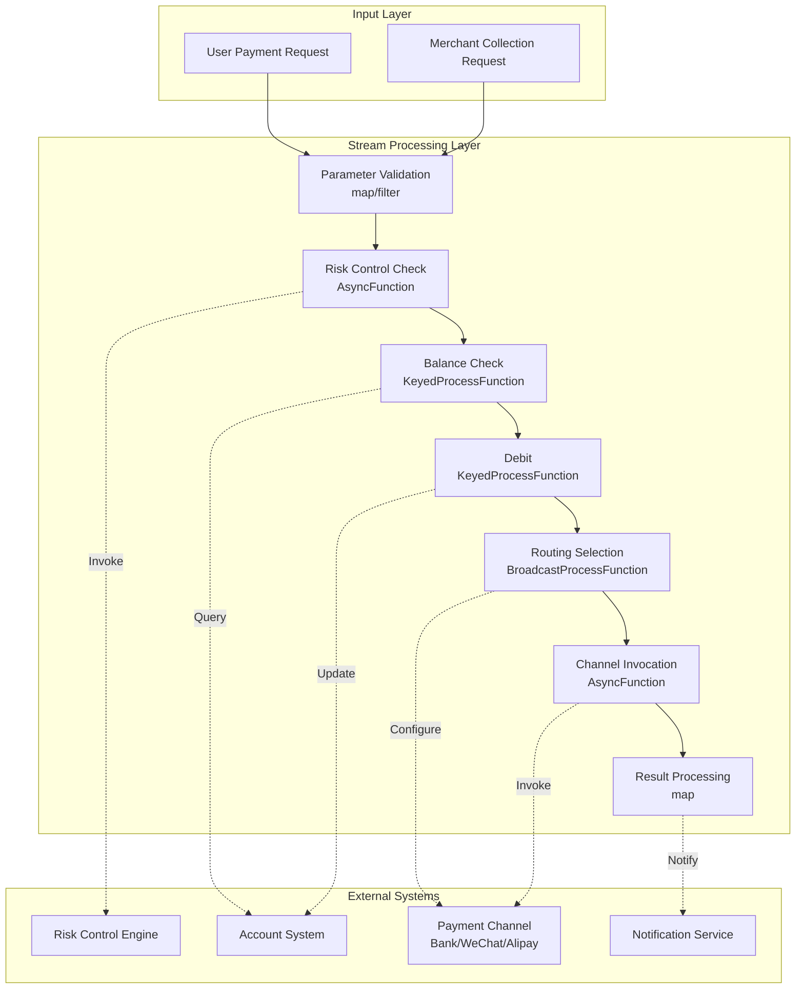
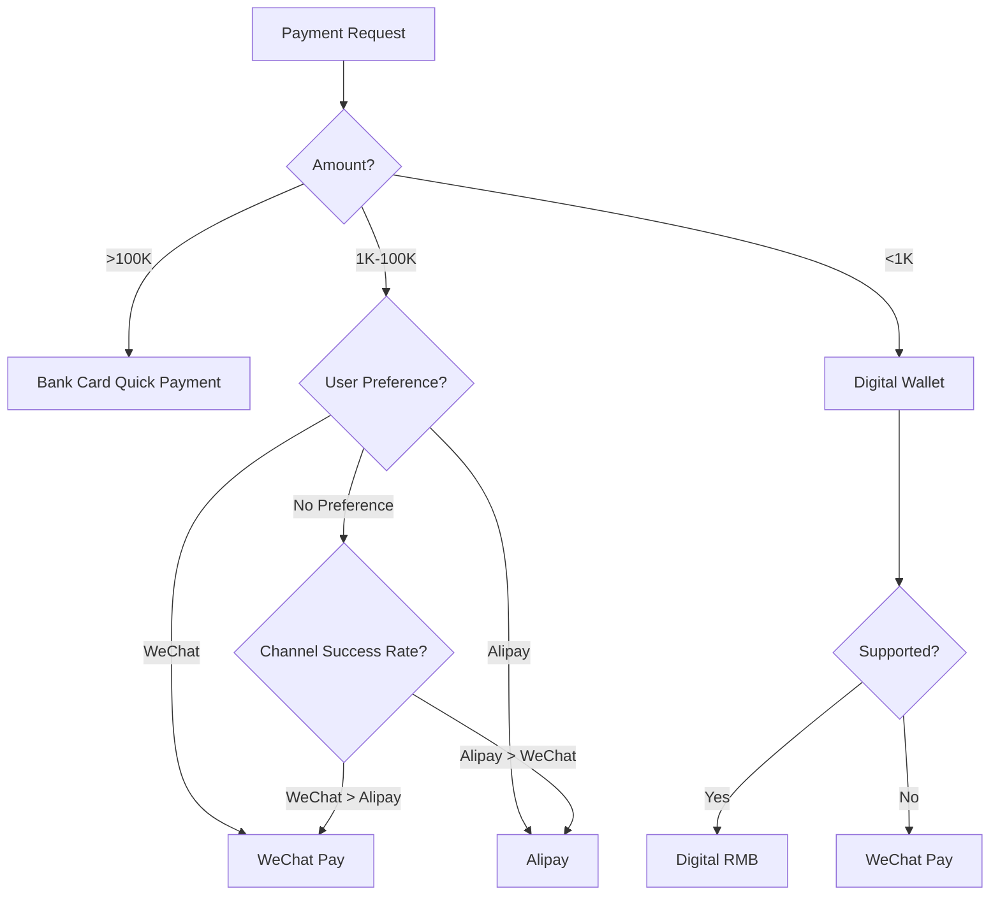

# Operators and Real-Time FinTech (Payment Processing)

> **Stage**: Knowledge/10-case-studies | **Prerequisites**: [01.10-process-and-async-operators.md](../Knowledge/01-concept-atlas/operator-deep-dive/01.10-process-and-async-operators.md), [operator-evolution-and-version-compatibility.md](./operator-evolution-and-version-compatibility.md) | **Formal Level**: L3
> **Document Positioning**: Operator fingerprints and Pipeline design for stream processing operators in real-time payment processing, clearing, and risk control
> **Version**: 2026.04

---

## Table of Contents

- [Operators and Real-Time FinTech (Payment Processing)](#operators-and-real-time-fintech-payment-processing)
  - [Table of Contents](#table-of-contents)
  - [1. Definitions](#1-definitions)
    - [Def-FIN-01-01: Real-time Payment Processing (实时支付处理)](#def-fin-01-01-real-time-payment-processing)
    - [Def-FIN-01-02: ACID Properties of Payment Transactions (支付事务的ACID特性)](#def-fin-01-02-acid-properties-of-payment-transactions)
    - [Def-FIN-01-03: Double Spending (双花问题)](#def-fin-01-03-double-spending)
    - [Def-FIN-01-04: Payment Routing (支付路由)](#def-fin-01-04-payment-routing)
    - [Def-FIN-01-05: RegTech (Regulatory Technology, 监管科技) Real-Time Compliance](#def-fin-01-05-regtech-real-time-compliance)
  - [2. Properties](#2-properties)
    - [Lemma-FIN-01-01: Throughput-Latency Trade-off in Payment Systems](#lemma-fin-01-01-throughput-latency-trade-off-in-payment-systems)
    - [Lemma-FIN-01-02: Uniqueness Guarantee of Idempotency Keys](#lemma-fin-01-02-uniqueness-guarantee-of-idempotency-keys)
    - [Prop-FIN-01-01: Impact of Isolation Levels on Concurrent Payments](#prop-fin-01-01-impact-of-isolation-levels-on-concurrent-payments)
    - [Prop-FIN-01-02: Benefits of Circuit Breaker Mechanism](#prop-fin-01-02-benefits-of-circuit-breaker-mechanism)
  - [3. Relations](#3-relations)
    - [3.1 Payment Pipeline Operator Mapping](#31-payment-pipeline-operator-mapping)
    - [3.2 Operator Fingerprints](#32-operator-fingerprints)
    - [3.3 Payment Channel Comparison](#33-payment-channel-comparison)
  - [4. Argumentation](#4-argumentation)
    - [4.1 Why Payments Need Stream Processing Instead of Traditional Batch Processing](#41-why-payments-need-stream-processing-instead-of-traditional-batch-processing)
    - [4.2 Consistency Challenges in Payment Systems](#42-consistency-challenges-in-payment-systems)
    - [4.3 Hotspot Account Problem Under High Concurrency](#43-hotspot-account-problem-under-high-concurrency)
  - [5. Proof / Engineering Argument](#5-proof--engineering-argument)
    - [5.1 Idempotent Payment Implementation](#51-idempotent-payment-implementation)
    - [5.2 Dynamic Payment Routing Selection](#52-dynamic-payment-routing-selection)
    - [5.3 Stream Processing Implementation for Real-Time Reconciliation](#53-stream-processing-implementation-for-real-time-reconciliation)
  - [6. Examples](#6-examples)
    - [6.1 Practical Case: E-Commerce Platform Payment Pipeline](#61-practical-case-e-commerce-platform-payment-pipeline)
    - [6.2 Practical Case: Cross-Border Payment Real-Time Foreign Exchange](#62-practical-case-cross-border-payment-real-time-foreign-exchange)
  - [7. Visualizations](#7-visualizations)
    - [Payment Processing Pipeline](#payment-processing-pipeline)
    - [Payment Routing Decision Tree](#payment-routing-decision-tree)
  - [8. References](#8-references)

---

## 1. Definitions

### Def-FIN-01-01: Real-time Payment Processing (实时支付处理)

Real-time Payment Processing (实时支付处理) is a payment system that completes authorization, clearing, and settlement within seconds after a transaction is initiated:

$$\text{Payment} = (\text{Authorization}, \text{Clearing}, \text{Settlement})$$

Where Authorization (授权) verifies transaction legitimacy, Clearing (清算) calculates net positions of all parties, and Settlement (结算) completes the fund transfer.

### Def-FIN-01-02: ACID Properties of Payment Transactions (支付事务的ACID特性)

Payment transactions must satisfy ACID properties:

- **Atomicity (原子性)**: A transaction either succeeds completely or fails completely
- **Consistency (一致性)**: Account balances satisfy conservation constraints before and after the transaction
- **Isolation (隔离性)**: Concurrent transactions do not interfere with each other
- **Durability (持久性)**: Confirmed transactions cannot be lost

### Def-FIN-01-03: Double Spending (双花问题)

Double Spending (双花问题) is the risk of the same funds being used multiple times:

$$\text{DoubleSpend} = \exists t_1, t_2: \text{Source}(t_1) = \text{Source}(t_2) \land \text{Amount}(t_1) + \text{Amount}(t_2) > \text{Balance}$$

Solution: Global unique transaction ID + idempotency check.

### Def-FIN-01-04: Payment Routing (支付路由)

Payment Routing (支付路由) is the decision process of selecting the optimal payment channel based on success rate, cost, and latency:

$$\text{Route}^* = \arg\max_{r \in \text{Routes}} (\alpha \cdot \text{SuccessRate}_r - \beta \cdot \text{Cost}_r - \gamma \cdot \text{Latency}_r)$$

### Def-FIN-01-05: RegTech Real-Time Compliance

RegTech (Regulatory Technology, 监管科技) is a solution that leverages technology to achieve real-time regulatory compliance:

$$\text{Compliance} = \forall t \in \text{Transactions}: \text{Check}(t, \text{Regulations}) = \text{PASS}$$

Including Anti-Money Laundering (AML, 反洗钱), Know Your Customer (KYC, 了解你的客户), and Sanctions Screening (制裁名单筛查).

---

## 2. Properties

### Lemma-FIN-01-01: Throughput-Latency Trade-off in Payment Systems

The throughput $\lambda$ of a payment system and the average latency $\mathcal{L}$ satisfy the queuing theory relationship:

$$\mathcal{L} = \frac{1}{\mu - \lambda}$$

Where $\mu$ is the system processing capacity. When $\lambda \to \mu$, latency tends to infinity.

### Lemma-FIN-01-02: Uniqueness Guarantee of Idempotency Keys

Transactions using an idempotency key $k$ satisfy:

$$\forall k: \text{Execute}(k) = \text{Execute}(\text{Execute}(k))$$

**Proof**: The system maintains a set of processed keys $K_{processed}$. If $k \in K_{processed}$, it directly returns the previous result; otherwise, it executes and records. ∎

### Prop-FIN-01-01: Impact of Isolation Levels on Concurrent Payments

Result consistency of concurrent payments under different isolation levels:

| Isolation Level | Dirty Read | Non-Repeatable Read | Phantom Read | Applicability to Payment Scenarios |
|----------------|------------|---------------------|--------------|-----------------------------------|
| READ UNCOMMITTED | ✅ | ✅ | ✅ | ❌ Not applicable |
| READ COMMITTED | ❌ | ✅ | ✅ | ⚠️ May oversell |
| REPEATABLE READ | ❌ | ❌ | ✅ | ✅ Applicable |
| SERIALIZABLE | ❌ | ❌ | ❌ | ✅ Safest |

**Recommendation**: Use SERIALIZABLE for payment debits, and READ COMMITTED for queries.

### Prop-FIN-01-02: Benefits of Circuit Breaker Mechanism

When a payment channel fails, the circuit breaker mechanism can reduce invalid requests:

$$\text{ResourceSaved} = \lambda_{fail} \cdot \mathcal{L}_{timeout}$$

Where $\lambda_{fail}$ is the failed request rate, and $\mathcal{L}_{timeout}$ is the timeout duration.

---

## 3. Relations

### 3.1 Payment Pipeline Operator Mapping

| Processing Stage | Operator | Function | Latency Requirement |
|-----------------|----------|----------|---------------------|
| **Payment Request Ingestion** | Source | Receive payment requests | < 10ms |
| **Parameter Validation** | map/filter | Format/signature verification | < 5ms |
| **Risk Control Check** | AsyncFunction | Invoke risk control engine | < 50ms |
| **Balance Check** | KeyedProcessFunction | Query account balance | < 10ms |
| **Debit** | KeyedProcessFunction | Atomic deduction | < 10ms |
| **Routing Selection** | map | Select payment channel | < 5ms |
| **Channel Invocation** | AsyncFunction | Invoke bank/third-party payment | < 200ms |
| **Result Processing** | map | Update order status | < 5ms |
| **Notification** | AsyncFunction | Notify merchant/user | Asynchronous |

### 3.2 Operator Fingerprints

| Dimension | Payment Processing Characteristics |
|-----------|-----------------------------------|
| **Core Operators** | KeyedProcessFunction (account state machine), AsyncFunction (risk control/channel), Broadcast (routing configuration) |
| **State Types** | ValueState (account balance), MapState (idempotency key set), BroadcastState (channel configuration) |
| **Time Semantics** | Processing time dominated (payments emphasize real-time) |
| **Data Characteristics** | High concurrency (10K-level TPS), high sensitivity (fund security), strong consistency |
| **State Hotspots** | Popular account keys (e.g., platform-owned accounts) |
| **Performance Bottlenecks** | External channel invocation, risk control engine response |

### 3.3 Payment Channel Comparison

| Channel | Latency | Cost | Success Rate | Applicable Scenario |
|---------|---------|------|--------------|---------------------|
| **Bank Card Quick Payment** | 1-3s | 0.6% | 95% | Large-amount payment |
| **WeChat Pay** | 500ms-2s | 0.6% | 98% | Small-amount high-frequency |
| **Alipay** | 500ms-2s | 0.6% | 98% | Small-amount high-frequency |
| **Digital RMB** | 100ms-1s | 0% | 99% | Policy promotion |
| **Cross-border SWIFT** | 1-5 days | $20-50 | 90% | International remittance |
| **Blockchain** | 10s-1h | Variable | 99% | Decentralized |

---

## 4. Argumentation

### 4.1 Why Payments Need Stream Processing Instead of Traditional Batch Processing

Problems with traditional batch processing:

- End-of-day reconciliation: Transaction anomalies are discovered 24 hours late
- Lagging risk control: Fraudulent transactions have already caused losses
- User experience: Long waiting time for payment results

Advantages of stream processing:

- Real-time risk control: Intercept suspicious transactions at millisecond level
- Real-time reconciliation: Transaction and verification occur simultaneously
- Real-time notification: Instant push upon payment success

### 4.2 Consistency Challenges in Payment Systems

**Scenario**: User A transfers 100 CNY to User B.

**Must guarantee**:

1. Account A deducts 100 CNY successfully
2. Account B increases 100 CNY successfully
3. Either 1 and 2 both succeed, or both fail

**Stream processing solution**:

- Use TwoPhaseCommitSinkFunction to implement distributed transactions
- Or adopt Saga pattern: A deducts → B adds → if failure then compensates

### 4.3 Hotspot Account Problem Under High Concurrency

**Problem**: During promotion events, the platform collection account is updated 100,000 times per second, causing single-key hotspot.

**Solutions**:

1. **Bucketing**: Logically split the hotspot account into 100 sub-accounts
2. **Buffering**: Write to local buffer first, then merge and update periodically
3. **Asynchronous processing**: Return success in real time, perform actual debit asynchronously

---

## 5. Proof / Engineering Argument

### 5.1 Idempotent Payment Implementation

```java
public class IdempotentPaymentFunction extends KeyedProcessFunction<String, PaymentRequest, PaymentResult> {
    private MapState<String, PaymentResult> idempotencyState;
    private ValueState<BigDecimal> balanceState;

    @Override
    public void open(Configuration parameters) {
        idempotencyState = getRuntimeContext().getMapState(
            new MapStateDescriptor<>("idempotency", Types.STRING, Types.POJO(PaymentResult.class))
        );
        balanceState = getRuntimeContext().getState(
            new ValueStateDescriptor<>("balance", Types.BIG_DEC)
        );
    }

    @Override
    public void processElement(PaymentRequest req, Context ctx, Collector<PaymentResult> out) throws Exception {
        // Idempotency check
        PaymentResult cached = idempotencyState.get(req.getIdempotencyKey());
        if (cached != null) {
            out.collect(cached);  // Return previous result directly
            return;
        }

        // Balance check
        BigDecimal balance = balanceState.value();
        if (balance == null) balance = BigDecimal.ZERO;

        if (balance.compareTo(req.getAmount()) < 0) {
            PaymentResult result = new PaymentResult(req.getId(), "FAILED", "INSUFFICIENT_BALANCE", ctx.timestamp());
            idempotencyState.put(req.getIdempotencyKey(), result);
            out.collect(result);
            return;
        }

        // Debit
        BigDecimal newBalance = balance.subtract(req.getAmount());
        balanceState.update(newBalance);

        PaymentResult result = new PaymentResult(req.getId(), "SUCCESS", null, ctx.timestamp());
        idempotencyState.put(req.getIdempotencyKey(), result);
        out.collect(result);
    }
}
```

### 5.2 Dynamic Payment Routing Selection

```java
public class PaymentRouter extends BroadcastProcessFunction<PaymentRequest, RouteConfig, RoutedPayment> {
    private MapState<String, ChannelMetrics> channelMetrics;

    @Override
    public void processElement(PaymentRequest req, ReadOnlyContext ctx, Collector<RoutedPayment> out) {
        ReadOnlyBroadcastState<String, RouteConfig> routes = ctx.getBroadcastState(ROUTE_DESCRIPTOR);

        String bestChannel = null;
        double bestScore = Double.NEGATIVE_INFINITY;

        for (Map.Entry<String, RouteConfig> entry : routes.immutableEntries()) {
            String channel = entry.getKey();
            RouteConfig config = entry.getValue();

            ChannelMetrics metrics = channelMetrics.get(channel);
            if (metrics == null) metrics = new ChannelMetrics();

            // Score = success rate weight - cost weight - latency weight
            double score = config.getSuccessWeight() * metrics.getSuccessRate()
                         - config.getCostWeight() * metrics.getAvgCost()
                         - config.getLatencyWeight() * metrics.getAvgLatency();

            if (score > bestScore) {
                bestScore = score;
                bestChannel = channel;
            }
        }

        out.collect(new RoutedPayment(req, bestChannel));
    }

    @Override
    public void processBroadcastElement(RouteConfig config, Context ctx, Collector<RoutedPayment> out) {
        ctx.getBroadcastState(ROUTE_DESCRIPTOR).put(config.getChannelId(), config);
    }
}
```

### 5.3 Stream Processing Implementation for Real-Time Reconciliation

```java
// Payment request stream
DataStream<PaymentRequest> requests = env.addSource(new KafkaSource<>("payment-requests"));

// Payment result stream
DataStream<PaymentResult> results = env.addSource(new KafkaSource<>("payment-results"));

// Real-time reconciliation: correlate requests with results
requests.keyBy(PaymentRequest::getTransactionId)
    .intervalJoin(results.keyBy(PaymentResult::getTransactionId))
    .between(Time.seconds(-5), Time.minutes(5))
    .process(new ReconciliationFunction())
    .addSink(new ReconciliationReportSink());

// Timeout unmatched detection
requests.keyBy(PaymentRequest::getTransactionId)
    .process(new KeyedProcessFunction<String, PaymentRequest, TimeoutAlert>() {
        private ValueState<PaymentRequest> pendingState;

        @Override
        public void processElement(PaymentRequest req, Context ctx, Collector<TimeoutAlert> out) {
            pendingState.update(req);
            ctx.timerService().registerProcessingTimeTimer(ctx.timestamp() + 300000);  // 5-minute timeout
        }

        @Override
        public void onTimer(long timestamp, OnTimerContext ctx, Collector<TimeoutAlert> out) {
            PaymentRequest pending = pendingState.value();
            if (pending != null) {
                out.collect(new TimeoutAlert(pending.getTransactionId(), timestamp));
                pendingState.clear();
            }
        }
    })
    .addSink(new TimeoutAlertSink());
```

---

## 6. Examples

### 6.1 Practical Case: E-Commerce Platform Payment Pipeline

```java
// 1. Payment request ingestion
DataStream<PaymentRequest> requests = env.addSource(new KafkaSource<>("payment-requests"));

// 2. Parameter validation
DataStream<PaymentRequest> validRequests = requests
    .filter(req -> req.getAmount().compareTo(BigDecimal.ZERO) > 0)
    .filter(req -> req.getSignature() != null);

// 3. Risk control check
DataStream<RiskCheckedPayment> riskChecked = AsyncDataStream.unorderedWait(
    validRequests,
    new RiskCheckFunction(),
    Time.milliseconds(100),
    100
);

// 4. Split: high-risk goes to manual review
DataStream<PaymentRequest> autoPayments = riskChecked
    .filter(r -> r.getRiskLevel().equals("LOW"))
    .map(RiskCheckedPayment::getRequest);

DataStream<PaymentRequest> manualPayments = riskChecked
    .filter(r -> !r.getRiskLevel().equals("LOW"))
    .map(RiskCheckedPayment::getRequest);

// 5. Automatic payment: debit + routing
autoPayments.keyBy(PaymentRequest::getPayerId)
    .process(new IdempotentPaymentFunction())
    .map(new PaymentRouter())
    .addSink(new ChannelCallSink());

// 6. Result notification
results.addSink(new NotificationSink());  // Asynchronous notification to user/merchant
```

### 6.2 Practical Case: Cross-Border Payment Real-Time Foreign Exchange

```java
// Multi-currency payment: real-time exchange rate conversion
DataStream<CrossBorderPayment> xborder = env.addSource(new KafkaSource<>("cross-border"));

// Obtain real-time exchange rate (Broadcast State)
xborder.connect(exchangeRateBroadcast)
    .process(new CoProcessFunction<CrossBorderPayment, ExchangeRate, ConvertedPayment>() {
        private ValueState<ExchangeRate> currentRate;

        @Override
        public void processElement1(CrossBorderPayment payment, Context ctx, Collector<ConvertedPayment> out) {
            ExchangeRate rate = currentRate.value();
            if (rate == null) return;

            BigDecimal converted = payment.getAmount().multiply(rate.getRate());
            out.collect(new ConvertedPayment(payment, converted, rate.getRate()));
        }

        @Override
        public void processElement2(ExchangeRate rate, Context ctx, Collector<ConvertedPayment> out) {
            currentRate.update(rate);
        }
    })
    .keyBy(ConvertedPayment::getPayerId)
    .process(new IdempotentPaymentFunction())
    .addSink(new SWIFTGatewaySink());
```

---

## 7. Visualizations

### Payment Processing Pipeline

The following diagram illustrates the end-to-end payment processing pipeline, showing how stream processing operators interact with external systems.



### Payment Routing Decision Tree

The following decision tree shows how payment requests are dynamically routed to different payment channels based on amount, user preference, and channel success rate.



---

## 8. References

---

*Related Documents*: [01.10-process-and-async-operators.md](../Knowledge/01-concept-atlas/operator-deep-dive/01.10-process-and-async-operators.md) | [operator-evolution-and-version-compatibility.md](./operator-evolution-and-version-compatibility.md) | [operator-security-and-permission-model.md](../Knowledge/08-standards/operator-security-and-permission-model.md)
