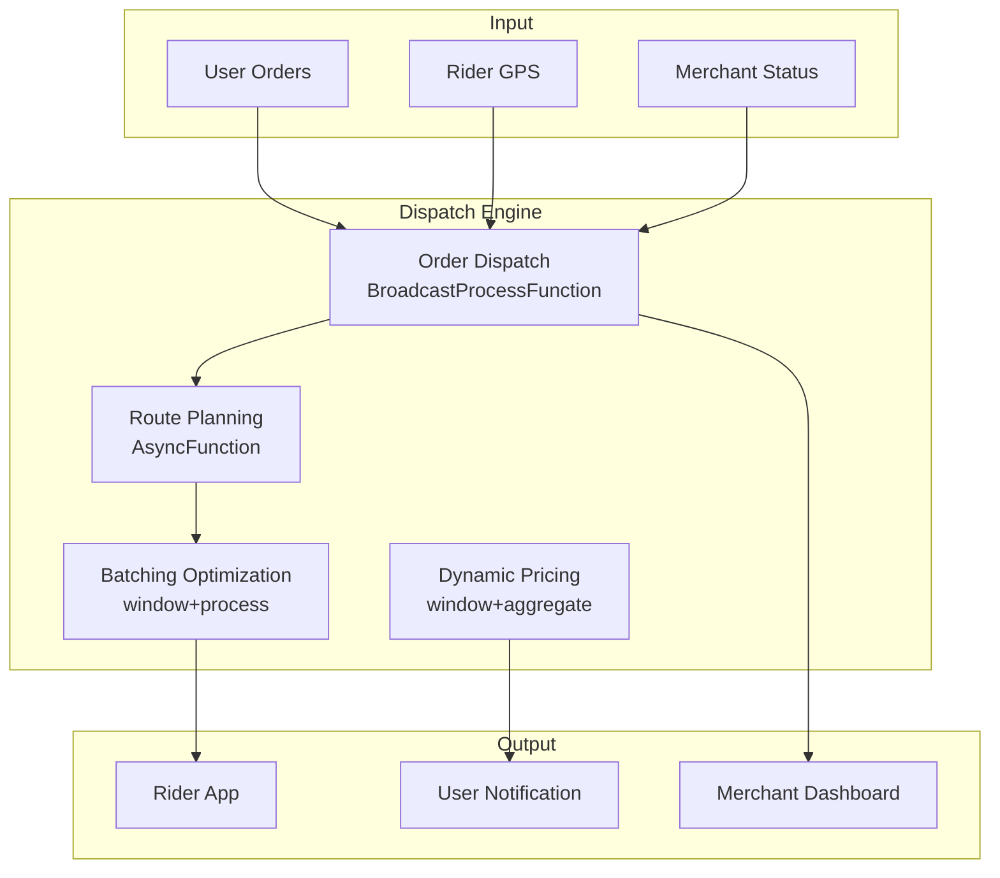

# Operators and Real-time Food Delivery (外卖配送)

> **Stage**: Knowledge/10-case-studies | **Prerequisites**: [01.07-two-input-operators.md](../Knowledge/01-concept-atlas/operator-deep-dive/01.07-two-input-operators.md), [realtime-traffic-management-case-study.md](../Knowledge/10-case-studies/realtime-traffic-management-case-study.md) | **Formalization Level**: L3
> **Document Positioning**: Operator fingerprint and Pipeline design for stream processing operators in real-time food delivery order allocation, rider dispatch, and delivery route optimization
> **Version**: 2026.04

---

## Table of Contents

- [Operators and Real-time Food Delivery (外卖配送)](#operators-and-real-time-food-delivery-外卖配送)
  - [Table of Contents](#table-of-contents)
  - [1. Definitions](#1-definitions)
    - [Def-FOD-01-01: Food Delivery Order Stream (外卖订单流)](#def-fod-01-01-food-delivery-order-stream-外卖订单流)
    - [Def-FOD-01-02: Delivery Radius (骑手调度半径)](#def-fod-01-02-delivery-radius-骑手调度半径)
    - [Def-FOD-01-03: On-time Delivery Rate (准时率)](#def-fod-01-03-on-time-delivery-rate-准时率)
    - [Def-FOD-01-04: Batching Efficiency (拼单效率)](#def-fod-01-04-batching-efficiency-拼单效率)
    - [Def-FOD-01-05: Rider Load Balancing (骑手负载均衡)](#def-fod-01-05-rider-load-balancing-骑手负载均衡)
  - [2. Properties](#2-properties)
    - [Lemma-FOD-01-01: Composition of Delivery Time](#lemma-fod-01-01-composition-of-delivery-time)
    - [Lemma-FOD-01-02: Rider Capacity Limit](#lemma-fod-01-02-rider-capacity-limit)
    - [Prop-FOD-01-01: Supply-Demand Imbalance during Peak Hours](#prop-fod-01-01-supply-demand-imbalance-during-peak-hours)
    - [Prop-FOD-01-02: Order Regulation Effect of Dynamic Pricing](#prop-fod-01-02-order-regulation-effect-of-dynamic-pricing)
  - [3. Relations](#3-relations)
    - [3.1 Food Delivery Pipeline Operator Mapping](#31-food-delivery-pipeline-operator-mapping)
    - [3.2 Operator Fingerprint](#32-operator-fingerprint)
  - [4. Argumentation](#4-argumentation)
    - [4.1 Why Food Delivery Needs Stream Processing Instead of Traditional Scheduling](#41-why-food-delivery-needs-stream-processing-instead-of-traditional-scheduling)
    - [4.2 Delivery Challenges in Adverse Weather](#42-delivery-challenges-in-adverse-weather)
    - [4.3 Rider Safety Monitoring](#43-rider-safety-monitoring)
  - [5. Proof / Engineering Argument](#5-proof--engineering-argument)
    - [5.1 Real-time Order Dispatch Engine](#51-real-time-order-dispatch-engine)
    - [5.2 Batching Optimization](#52-batching-optimization)
    - [5.3 On-time Monitoring and Alerting](#53-on-time-monitoring-and-alerting)
  - [6. Examples](#6-examples)
    - [6.1 Real-world: Real-time Scheduling for Food Delivery Platform](#61-real-world-real-time-scheduling-for-food-delivery-platform)
    - [6.2 Real-world: Dynamic Pricing Engine](#62-real-world-dynamic-pricing-engine)
  - [7. Visualizations](#7-visualizations)
    - [Food Delivery Pipeline](#food-delivery-pipeline)
  - [8. References](#8-references)

---

## 1. Definitions

### Def-FOD-01-01: Food Delivery Order Stream (外卖订单流)

A food delivery order stream is the complete event sequence of user placing an order, merchant accepting the order, rider picking up the meal, and delivering it to the customer:

$$\text{OrderLifecycle} = (\text{Created}, \text{Accepted}, \text{Prepared}, \text{PickedUp}, \text{Delivered})$$

### Def-FOD-01-02: Delivery Radius (骑手调度半径)

The delivery radius is the maximum distance within which the platform assigns orders to a rider:

$$R_{max} = \min(R_{platform}, R_{rider}, R_{SLA})$$

Where $R_{platform}$ is the platform policy radius, $R_{rider}$ is the rider's current acceptable range, and $R_{SLA}$ is the maximum distance to satisfy the time-of-arrival SLA.

### Def-FOD-01-03: On-time Delivery Rate (准时率)

The on-time delivery rate is the proportion of orders completed within the promised time:

$$\text{OTD} = \frac{\text{Orders}_{delivered \leq SLA}}{\text{Orders}_{total}}$$

Industry target: OTD > 95%.

### Def-FOD-01-04: Batching Efficiency (拼单效率)

Batching efficiency measures the benefit of combining multiple orders into a single delivery trip:

$$\eta_{batch} = \frac{\sum_{i} T_{single,i} - T_{batch}}{\sum_{i} T_{single,i}}$$

Where $T_{single,i}$ is the individual delivery time for order $i$, and $T_{batch}$ is the combined delivery time.

### Def-FOD-01-05: Rider Load Balancing (骑手负载均衡)

Rider load balancing is the even distribution of orders among available riders:

$$\text{Balance} = 1 - \frac{\sigma_{load}}{\mu_{load}}$$

Where $\sigma_{load}$ is the standard deviation of rider load, and $\mu_{load}$ is the average load.

---

## 2. Properties

### Lemma-FOD-01-01: Composition of Delivery Time

$$T_{delivery} = T_{pickup} + T_{travel} + T_{wait}$$

Where $T_{pickup}$ is the meal pickup time, $T_{travel}$ is the travel time, and $T_{wait}$ is the waiting time (merchant meal preparation / elevator, etc.).

### Lemma-FOD-01-02: Rider Capacity Limit

The maximum number of concurrent orders a rider can handle:

$$N_{max} = \left\lfloor \frac{T_{SLA} - T_{pickup,avg}}{T_{stop,avg}} \right\rfloor$$

Where $T_{stop,avg}$ is the average stop time per order (approximately 3-5 minutes).

### Prop-FOD-01-01: Supply-Demand Imbalance during Peak Hours

$$\text{SurgeMultiplier} = \left(\frac{D_{peak}}{S_{available}}\right)^{\gamma}$$

Where $\gamma \approx 0.5\text{-}0.8$. During peak hours (lunch and dinner rushes), the supply-demand ratio can reach 3:1.

### Prop-FOD-01-02: Order Regulation Effect of Dynamic Pricing

$$\Delta Q = Q_{base} \cdot \epsilon \cdot \Delta P$$

Price elasticity $\epsilon \approx -0.3$ (short-term). A 20% dynamic price increase can reduce order volume by approximately 6%.

---

## 3. Relations

### 3.1 Food Delivery Pipeline Operator Mapping

| Application Scenario | Operator Combination | Data Source | Latency Requirement |
|---------|---------|--------|---------|
| **Order Dispatch** | KeyedProcessFunction | Order Stream | < 1s |
| **Rider Matching** | AsyncFunction | Rider Location | < 2s |
| **Route Planning** | AsyncFunction | Map API | < 3s |
| **Batching Optimization** | window+aggregate | Orders in Zone | < 30s |
| **Dynamic Pricing** | Broadcast + map | Supply-Demand Data | < 1s |
| **On-time Monitoring** | ProcessFunction + Timer | Delivery Progress | < 1min |

### 3.2 Operator Fingerprint

| Dimension | Food Delivery Characteristics |
|------|------------|
| **Core Operators** | KeyedProcessFunction (order state machine), AsyncFunction (route planning / ETA), BroadcastProcessFunction (dynamic pricing), window+aggregate (batching) |
| **State Types** | ValueState (order status), MapState (rider location), BroadcastState (pricing strategy) |
| **Time Semantics** | Processing time as primary (delivery emphasizes real-time responsiveness) |
| **Data Characteristics** | High burstiness (meal-time peaks), strong spatial locality, time-sensitive |
| **State Hotspots** | Hot business district keys, large office building keys |
| **Performance Bottlenecks** | Map route planning API, rider matching algorithm |

---

## 4. Argumentation

### 4.1 Why Food Delivery Needs Stream Processing Instead of Traditional Scheduling

Problems with traditional scheduling:

- **Static dispatch**: Unable to respond to real-time traffic changes
- **Manual scheduling**: Low efficiency, unable to handle large-scale order volumes
- **Information lag**: Rider location updates are delayed

Advantages of stream processing:

- **Real-time dispatch**: Rider locations updated at second-level granularity, assigned to nearest available rider
- **Dynamic routing**: Routes adjusted based on real-time traffic conditions
- **Automatic batching**: Real-time discovery of combinable orders

### 4.2 Delivery Challenges in Adverse Weather

**Problem**: Rain and snow cause delivery times to double, while rider supply decreases.

**Stream Processing Solution**:

1. **Dynamic surcharge**: Increase delivery fees to attract more riders online
2. **Expanded radius**: Relax delivery distance constraints
3. **Extended SLA**: Adjust user expected delivery time
4. **Smart cancellation**: In extreme weather, automatically suggest users switch to self-pickup

### 4.3 Rider Safety Monitoring

**Scenario**: Rider speeding, riding against traffic, fatigued driving.

**Stream Processing Solution**: Real-time GPS trajectory analysis → Anomaly behavior detection → Safety alert → Mandatory rest.

---

## 5. Proof / Engineering Argument

### 5.1 Real-time Order Dispatch Engine

```java
public class OrderDispatchFunction extends BroadcastProcessFunction<Order, RiderStatus, DispatchResult> {
    private MapState<String, RiderStatus> riderPool;

    @Override
    public void processElement(Order order, ReadOnlyContext ctx, Collector<DispatchResult> out) throws Exception {
        String bestRider = null;
        double bestScore = Double.NEGATIVE_INFINITY;

        for (Map.Entry<String, RiderStatus> entry : riderPool.entries()) {
            RiderStatus rider = entry.getValue();
            if (!rider.isAvailable()) continue;
            if (rider.getLoad() >= rider.getMaxLoad()) continue;

            double distance = calculateDistance(order.getRestaurantLocation(), rider.getLocation());
            if (distance > rider.getMaxRadius()) continue;

            // Score = distance weight + load weight + rating weight
            double score = -0.6 * distance - 0.3 * rider.getLoad() + 0.1 * rider.getRating();

            if (score > bestScore) {
                bestScore = score;
                bestRider = entry.getKey();
            }
        }

        if (bestRider != null) {
            RiderStatus rider = riderPool.get(bestRider);
            rider.assignOrder(order.getId());
            riderPool.put(bestRider, rider);

            out.collect(new DispatchResult(order.getId(), bestRider, ctx.timestamp()));
        }
    }

    @Override
    public void processBroadcastElement(RiderStatus rider, Context ctx, Collector<DispatchResult> out) {
        riderPool.put(rider.getId(), rider);
    }
}
```

### 5.2 Batching Optimization

```java
// Zone order stream
DataStream<Order> orders = env.addSource(new OrderSource());

// 30-second window batching
orders.keyBy(Order::getZoneId)
    .window(TumblingProcessingTimeWindows.of(Time.seconds(30)))
    .process(new ProcessFunction<Iterable<Order>, BatchOrder>() {
        @Override
        public void process(Iterable<Order> windowOrders, Context ctx, Collector<BatchOrder> out) {
            List<Order> orderList = new ArrayList<>();
            windowOrders.forEach(orderList::add);

            if (orderList.size() < 2) {
                orderList.forEach(o -> out.collect(new BatchOrder(Collections.singletonList(o))));
                return;
            }

            // Greedy batching: find orders on the way
            List<BatchOrder> batches = new ArrayList<>();
            Set<String> assigned = new HashSet<>();

            for (Order o1 : orderList) {
                if (assigned.contains(o1.getId())) continue;

                List<Order> batch = new ArrayList<>();
                batch.add(o1);
                assigned.add(o1.getId());

                for (Order o2 : orderList) {
                    if (assigned.contains(o2.getId())) continue;
                    if (isOnTheWay(o1, o2)) {
                        batch.add(o2);
                        assigned.add(o2.getId());
                        if (batch.size() >= 3) break;  // Max 3 orders
                    }
                }

                batches.add(new BatchOrder(batch));
            }

            batches.forEach(out::collect);
        }

        private boolean isOnTheWay(Order o1, Order o2) {
            // Simplified: check if o2 is on o1's delivery path
            return calculateDistance(o1.getRestaurantLocation(), o2.getCustomerLocation()) < 1000;
        }
    })
    .addSink(new BatchDispatchSink());
```

### 5.3 On-time Monitoring and Alerting

```java
// Delivery progress stream
DataStream<DeliveryProgress> progress = env.addSource(new GPSProgressSource());

// Timeout alert
progress.keyBy(DeliveryProgress::getOrderId)
    .process(new KeyedProcessFunction<String, DeliveryProgress, DeliveryAlert>() {
        private ValueState<DeliveryProgress> progressState;

        @Override
        public void processElement(DeliveryProgress p, Context ctx, Collector<DeliveryAlert> out) throws Exception {
            progressState.update(p);

            long remainingTime = p.getPromisedTime() - ctx.timestamp();
            double progressRatio = p.getDistanceCovered() / p.getTotalDistance();
            double timeRatio = (double)(ctx.timestamp() - p.getStartTime()) / (p.getPromisedTime() - p.getStartTime());

            // Progress lag
            if (progressRatio < timeRatio * 0.8 && remainingTime < 300000) {  // Less than 5 min remaining and lagging
                out.collect(new DeliveryAlert(p.getOrderId(), "AT_RISK", remainingTime, ctx.timestamp()));
            }

            // Already overdue
            if (remainingTime < 0) {
                out.collect(new DeliveryAlert(p.getOrderId(), "OVERDUE", remainingTime, ctx.timestamp()));
            }
        }
    })
    .addSink(new AlertSink());
```

---

## 6. Examples

### 6.1 Real-world: Real-time Scheduling for Food Delivery Platform

```java
// 1. Order stream
DataStream<Order> orders = env.addSource(new OrderSource());

// 2. Rider status stream
DataStream<RiderStatus> riders = env.addSource(new RiderGPSSource());

// 3. Order dispatch
orders.connect(riders.broadcast())
    .process(new OrderDispatchFunction())
    .addSink(new DispatchNotificationSink());

// 4. Batching optimization
orders.keyBy(Order::getZoneId)
    .window(TumblingProcessingTimeWindows.of(Time.seconds(30)))
    .process(new BatchOptimizationFunction())
    .addSink(new BatchDispatchSink());

// 5. On-time monitoring
DataStream<DeliveryProgress> progress = env.addSource(new GPSProgressSource());
progress.keyBy(DeliveryProgress::getOrderId)
    .process(new OnTimeMonitorFunction())
    .addSink(new AlertSink());
```

### 6.2 Real-world: Dynamic Pricing Engine

```java
// Supply-demand data stream
DataStream<SupplyDemand> sd = env.addSource(new SupplyDemandSource());

// Dynamic pricing
sd.keyBy(SupplyDemand::getZoneId)
    .window(SlidingProcessingTimeWindows.of(Time.minutes(5), Time.minutes(1)))
    .aggregate(new DemandRatioAggregate())
    .map(new MapFunction<DemandRatio, PriceMultiplier>() {
        @Override
        public PriceMultiplier map(DemandRatio ratio) {
            double multiplier = 1.0;
            if (ratio.getRatio() > 2.0) multiplier = 1.3;
            else if (ratio.getRatio() > 1.5) multiplier = 1.2;
            else if (ratio.getRatio() > 1.2) multiplier = 1.1;
            return new PriceMultiplier(ratio.getZoneId(), multiplier, ratio.getTimestamp());
        }
    })
    .addSink(new PriceUpdateSink());
```

---

## 7. Visualizations

### Food Delivery Pipeline



---

## 8. References

*Related Documents*: [01.07-two-input-operators.md](../Knowledge/01-concept-atlas/operator-deep-dive/01.07-two-input-operators.md) | [realtime-traffic-management-case-study.md](../Knowledge/10-case-studies/realtime-traffic-management-case-study.md) | [realtime-retail-store-operations-case-study.md](../Knowledge/10-case-studies/realtime-retail-store-operations-case-study.md)
