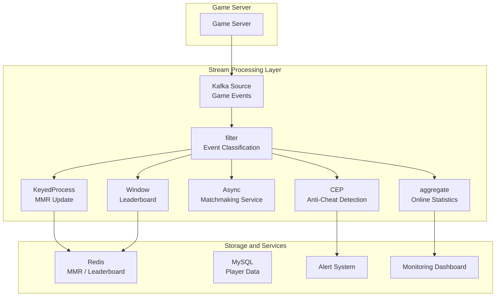
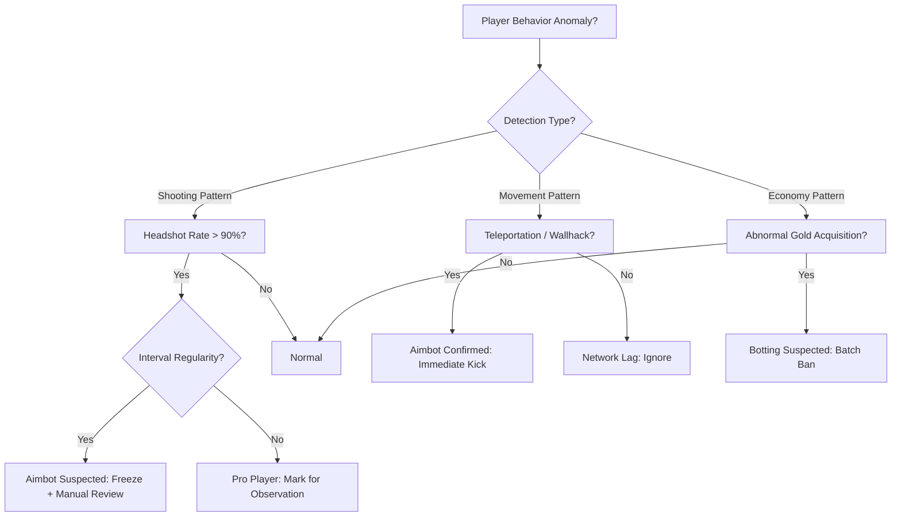

# Operators and Real-time Gaming Analytics

> **Stage**: Knowledge/10-case-studies | **Prerequisites**: [01.06-single-input-operators.md](../Knowledge/01-concept-atlas/operator-deep-dive/01.06-single-input-operators.md), [operator-ai-ml-integration.md](operator-ai-ml-integration.md) | **Formalization Level**: L3
> **Document Scope**: Operator fingerprint (算子指纹) and Pipeline design of stream processing operators (算子) in real-time Gaming Analytics (游戏数据分析)
> **Version**: 2026.04

---

## Table of Contents

- [Operators and Real-time Gaming Analytics](#operators-and-real-time-gaming-analytics)
  - [Table of Contents](#table-of-contents)
  - [1. Concept Definitions (概念定义)](#1-concept-definitions-概念定义)
    - [Def-GAME-01-01: Game Event Stream (游戏事件流)](#def-game-01-01-game-event-stream-游戏事件流)
    - [Def-GAME-01-02: Player Session (玩家会话)](#def-game-01-02-player-session-玩家会话)
    - [Def-GAME-01-03: Real-time Matchmaking Rating, MMR (实时匹配评分)](#def-game-01-03-real-time-matchmaking-rating-mmr-实时匹配评分)
    - [Def-GAME-01-04: Anti-Cheat Detection Window (反作弊检测窗口)](#def-game-01-04-anti-cheat-detection-window-反作弊检测窗口)
    - [Def-GAME-01-05: Real-time Leaderboard (实时排行榜)](#def-game-01-05-real-time-leaderboard-实时排行榜)
  - [2. Property Derivation (属性推导)](#2-property-derivation-属性推导)
    - [Lemma-GAME-01-01: Peak-Valley Pattern (峰谷模式)](#lemma-game-01-01-peak-valley-pattern-峰谷模式)
    - [Lemma-GAME-01-02: MMR Convergence (MMR收敛性)](#lemma-game-01-02-mmr-convergence-mmr收敛性)
    - [Prop-GAME-01-01: Latency-Accuracy Tradeoff in Anti-Cheat Detection (反作弊检测的延迟-准确率权衡)](#prop-game-01-01-latency-accuracy-tradeoff-in-anti-cheat-detection-反作弊检测的延迟-准确率权衡)
    - [Prop-GAME-01-02: Incremental Update Complexity of Real-time Leaderboards (实时排行榜的增量更新复杂度)](#prop-game-01-02-incremental-update-complexity-of-real-time-leaderboards-实时排行榜的增量更新复杂度)
  - [3. Relations (关系建立)](#3-relations-关系建立)
    - [3.1 Gaming Data Analytics Pipeline Operator Mapping](#31-gaming-data-analytics-pipeline-operator-mapping)
    - [3.2 Operator Fingerprint (算子指纹)](#32-operator-fingerprint-算子指纹)
    - [3.3 Comparison of Gaming Events with Other Industries](#33-comparison-of-gaming-events-with-other-industries)
  - [4. Argumentation (论证过程)](#4-argumentation-论证过程)
    - [4.1 Why Gaming Requires Stream Processing Rather Than Batch Analytics](#41-why-gaming-requires-stream-processing-rather-than-batch-analytics)
    - [4.2 Stream Processing Implementation of Matchmaking Systems](#42-stream-processing-implementation-of-matchmaking-systems)
    - [4.3 Real-time vs. Offline Anti-Cheat Detection](#43-real-time-vs-offline-anti-cheat-detection)
  - [5. Formal Proof / Engineering Argument (形式证明 / 工程论证)](#5-formal-proof--engineering-argument-形式证明--工程论证)
    - [5.1 Stream Processing Implementation of Real-time MMR Updates](#51-stream-processing-implementation-of-real-time-mmr-updates)
    - [5.2 Incremental Top-N Maintenance for Leaderboards](#52-incremental-top-n-maintenance-for-leaderboards)
    - [5.3 Anti-Cheat CEP Pattern Example](#53-anti-cheat-cep-pattern-example)
  - [6. Examples (实例验证)](#6-examples-实例验证)
    - [6.1 In Practice: Real-time Analytics for Multiplayer Online Competitive Games](#61-in-practice-real-time-analytics-for-multiplayer-online-competitive-games)
    - [6.2 In Practice: Real-time Matchmaking System](#62-in-practice-real-time-matchmaking-system)
  - [7. Visualizations (可视化)](#7-visualizations-可视化)
    - [Gaming Data Analytics Pipeline](#gaming-data-analytics-pipeline)
    - [Anti-Cheat Detection Decision Tree](#anti-cheat-detection-decision-tree)
  - [8. References (引用参考)](#8-references-引用参考)

---

## 1. Concept Definitions (概念定义)

### Def-GAME-01-01: Game Event Stream (游戏事件流)

A Game Event Stream is the temporal sequence of discrete events generated by a player during gameplay:

$$\text{EventStream}_u = \{e_1, e_2, ..., e_n\}, \quad e_i = (\text{type}, \text{timestamp}, \text{payload})$$

Event types include: LOGIN (登录), LOGOUT (登出), MATCH (匹配), KILL (击杀), DEATH (死亡), PURCHASE (购买), CHAT (聊天), REPORT (举报), etc.

### Def-GAME-01-02: Player Session (玩家会话)

A Player Session is the continuous gaming period from login to logout:

$$\text{Session}_u = [t_{login}, t_{logout}]$$

Session characteristics: duration, active operation frequency, behavioral pattern sequence.

### Def-GAME-01-03: Real-time Matchmaking Rating, MMR (实时匹配评分)

MMR is a dynamic rating that measures a player's skill level, updated in real time based on match outcomes:

$$\text{MMR}_{new} = \text{MMR}_{old} + K \cdot (S_{actual} - S_{expected})$$

where $K$ is the learning rate, $S_{actual}$ is the actual result (win=1, loss=0), and $S_{expected} = \frac{1}{1 + 10^{(\text{MMR}_{opponent} - \text{MMR}_{self})/400}}$ is the expected win rate (Elo formula).

### Def-GAME-01-04: Anti-Cheat Detection Window (反作弊检测窗口)

The Anti-Cheat Detection Window is the time range used to analyze suspicious behavior:

$$W_{cheat} = \{e \in \text{EventStream} \mid t_{current} - \delta \leq t_e \leq t_{current}\}$$

where $\delta$ is the detection window size (typically 5 minutes to 1 hour).

### Def-GAME-01-05: Real-time Leaderboard (实时排行榜)

A Real-time Leaderboard is a continuously updated player ranking view based on stream processing:

$$\text{Leaderboard}_t = \text{sort}_{desc}(\{(u, \text{Score}_u(t)) \mid u \in \text{Players}\})$$

Update challenge: scores for millions of players are updated thousands of times per second, requiring efficient Top-N ranking maintenance.

---

## 2. Property Derivation (属性推导)

### Lemma-GAME-01-01: Peak-Valley Pattern (峰谷模式)

Game Event Streams exhibit a clear daily periodic peak-valley pattern:

$$\lambda(t) = \lambda_{base} + \lambda_{peak} \cdot \mathbb{1}_{[18:00, 24:00]}(t)$$

Evening (18:00–24:00) event volume is typically 5–10× that of the early morning.

### Lemma-GAME-01-02: MMR Convergence (MMR收敛性)

In the Elo system, the variance of MMR decreases as the number of matches increases:

$$\text{Var}(\text{MMR}_n) \approx \frac{K^2 \cdot \sigma^2}{n}$$

where $\sigma^2$ is the result variance and $n$ is the number of matches played.

**Corollary**: New players (small $n$) have large MMR fluctuations and require more matches to stabilize.

### Prop-GAME-01-01: Latency-Accuracy Tradeoff in Anti-Cheat Detection (反作弊检测的延迟-准确率权衡)

The relationship between detection window $\delta$ and accuracy $A$:

$$A(\delta) = 1 - e^{-\alpha \cdot \delta}$$

But latency $\mathcal{L} = \delta$. The optimal window must be selected based on cheat type:

- Aimbot (外挂): detectable with a tiny window (shooting pattern anomaly)
- Macro (脚本): medium window (repeated operation patterns)
- Farming (工作室): large window (long-term behavior analysis)

### Prop-GAME-01-02: Incremental Update Complexity of Real-time Leaderboards (实时排行榜的增量更新复杂度)

The incremental update complexity for maintaining a Top-N leaderboard:

$$\mathcal{C}_{update} = O(\log N)$$

Logarithmic updates can be achieved using skip lists or ordered sets (Redis Sorted Set).

---

## 3. Relations (关系建立)

### 3.1 Gaming Data Analytics Pipeline Operator Mapping

| Analytics Scenario | Operator Combination | Latency Requirement | State Scale |
|-------------------|---------------------|--------------------|-------------|
| **Real-time MMR Update** | keyBy(playerId) → ProcessFunction | < 100 ms | ValueState per player |
| **Matchmaking Recommendation** | AsyncFunction → join | < 500 ms | MapState (player queue) |
| **Anti-Cheat Detection** | CEP (复杂事件处理) / window + aggregate | < 1 min | WindowState |
| **Leaderboard Update** | keyBy → aggregate → Sink | < 1 s | Top-N state |
| **Payment Prediction** | window + ML inference | < 5 min | Window features |
| **Player Churn Early Warning** | Session window + pattern | < 1 hr | Session State |
| **Real-time Ad Insertion** | AsyncFunction | < 50 ms | Stateless |

### 3.2 Operator Fingerprint (算子指纹)

| Dimension | Gaming Data Analytics Characteristics |
|-----------|--------------------------------------|
| **Core Operators** | KeyedProcessFunction (MMR / state machine), CEP (anti-cheat), AsyncFunction (matchmaking service), WindowAggregate (statistics) |
| **State Types** | ValueState (MMR, gold), MapState (inventory, friends), ListState (recent matches) |
| **Time Semantics** | Primarily Processing Time (处理时间) (in-game time typically uses server time) |
| **Data Characteristics** | High concurrency (millions online), high frequency (several operations per second per player), obvious peaks |
| **State Hotspots** | Popular players / leaderboard keys (high-frequency updates) |
| **Performance Bottlenecks** | Matchmaking algorithm (NP-hard approximation), leaderboard sorting |

### 3.3 Comparison of Gaming Events with Other Industries

| Dimension | E-commerce | Finance | Gaming |
|-----------|------------|---------|--------|
| **Event Frequency** | Medium (browse / purchase) | Low (transactions) | Extremely high (multiple operations per second) |
| **State Complexity** | Medium | Low | Extremely high (multi-dimensional game state) |
| **Real-time Latency** | Seconds | Milliseconds | Milliseconds to seconds |
| **Pattern Detection** | Simple | Moderate | Complex (behavior sequences) |
| **Data Retention** | Long-term | Long-term | Short-term (decays after match) |

---

## 4. Argumentation (论证过程)

### 4.1 Why Gaming Requires Stream Processing Rather Than Batch Analytics

**Problems with Batch Analytics**:

- Offline T+1 reports cannot support real-time operational decisions
- By the time cheating is discovered, the damage is already done
- Player experience issues (such as unbalanced matchmaking) cannot be fixed in time

**Advantages of Stream Processing**:

- Real-time MMR: ratings updated immediately after a match ends
- Real-time anti-cheat: anomalous behavior detected within seconds
- Real-time operations: campaign effects evaluated within minutes

### 4.2 Stream Processing Implementation of Matchmaking Systems

**Matchmaking Problem**: Assign $N$ waiting players to $M$ matches, with the goal of minimizing MMR variance and wait time.

**Stream Processing Solution**:

1. Player clicks "Start Matchmaking" → match request event is generated
2. KeyedProcessFunction keys by game mode, maintaining a matchmaking queue (MapState)
3. Timer triggers matchmaking algorithm (executes every 5 seconds)
4. Outputs match results to the game server

**Challenges**:

- High-rank players are scarce, leading to long matchmaking wait times → gradually relax MMR difference constraints
- Team matchmaking must ensure team integrity → teams enter matchmaking as a whole

### 4.3 Real-time vs. Offline Anti-Cheat Detection

| Dimension | Real-time Detection | Offline Detection |
|-----------|--------------------|--------------------|
| **Latency** | < 1 min | Hours to days |
| **Precision** | Medium (limited context) | High (full history) |
| **Action** | Temporary freeze / demoted matchmaking | Permanent ban |
| **Algorithm** | Rules + simple statistics | Deep learning + graph analysis |
| **False Positive Cost** | Low (can be quickly unbanned) | High (impacts player experience) |

**Recommendation**: Real-time detection is used for preliminary screening; offline detection is used for final verdicts.

---

## 5. Formal Proof / Engineering Argument (形式证明 / 工程论证)

### 5.1 Stream Processing Implementation of Real-time MMR Updates

```java
public class MMRUpdateFunction extends KeyedProcessFunction<String, MatchResult, MMRUpdate> {
    private ValueState<Integer> mmrState;
    private ValueState<Integer> gamesPlayedState;
    private static final int K_BASE = 32;

    @Override
    public void open(Configuration parameters) {
        mmrState = getRuntimeContext().getState(new ValueStateDescriptor<>("mmr", Types.INT));
        gamesPlayedState = getRuntimeContext().getState(new ValueStateDescriptor<>("games", Types.INT));
    }

    @Override
    public void processElement(MatchResult result, Context ctx, Collector<MMRUpdate> out) throws Exception {
        int myMMR = mmrState.value() != null ? mmrState.value() : 1500;
        int games = gamesPlayedState.value() != null ? gamesPlayedState.value() : 0;

        // Dynamic K: larger K for new players, smaller K for veterans
        int K = Math.max(16, K_BASE - games / 100);

        // Elo expected win rate
        double expected = 1.0 / (1.0 + Math.pow(10, (result.getOpponentMMR() - myMMR) / 400.0));

        // MMR update
        int newMMR = myMMR + (int)(K * (result.getActualScore() - expected));
        mmrState.update(newMMR);
        gamesPlayedState.update(games + 1);

        out.collect(new MMRUpdate(result.getPlayerId(), myMMR, newMMR, ctx.timestamp()));
    }
}
```

### 5.2 Incremental Top-N Maintenance for Leaderboards

**Solution**: Use Flink's ProcessFunction to maintain an ordered set, updating only when a new score enters the Top-N:

```java
public class TopNLeaderboard extends KeyedProcessFunction<String, ScoreEvent, LeaderboardUpdate> {
    private MapState<String, Integer> topNState;  // playerId → score
    private static final int N = 100;

    @Override
    public void processElement(ScoreEvent event, Context ctx, Collector<LeaderboardUpdate> out) throws Exception {
        // Get current Top-N minimum score
        int minTopScore = getMinTopScore();

        if (event.getScore() > minTopScore || topNState.keys().hasNext() == false) {
            topNState.put(event.getPlayerId(), event.getScore());

            // If exceeding N entries, remove the lowest score
            if (getTopNSize() > N) {
                removeLowestScore();
            }

            out.collect(new LeaderboardUpdate(getSortedTopN()));
        }
    }
}
```

**Optimization**: For millions of players, full sorting is infeasible. A tiered design is adopted:

- Real-time tier: maintains only Top-100 (in-memory)
- Near-real-time tier: computes Top-10000 every 5 minutes (RocksDB)
- Offline tier: full sorting every hour

### 5.3 Anti-Cheat CEP Pattern Example

**Aimbot Detection Pattern**: 10 consecutive shots, 100% headshot rate, and identical intervals.

```java
Pattern<ShootEvent, ?> aimbotPattern = Pattern
    .<ShootEvent>begin("shoots")
    .where(evt -> evt.getType().equals("SHOOT"))
    .timesOrMore(10)
    .within(Time.seconds(5))
    .followedBy("headshots")
    .where(new IterativeCondition<ShootEvent>() {
        @Override
        public boolean filter(ShootEvent event, Context<ShootEvent> ctx) {
            // Check if all are headshots
            return event.isHeadshot();
        }
    });

// Additional condition: shooting interval std dev is extremely small (mechanical regularity)
aimbotPattern.subtype(ShootEvent.class)
    .where(new IterativeCondition<ShootEvent>() {
        @Override
        public boolean filter(ShootEvent event, Context<ShootEvent> ctx) {
            // Get all shooting events in the window
            List<ShootEvent> events = ctx.getEventsForPattern("shoots");
            double stdDev = calculateIntervalStdDev(events);
            return stdDev < 0.01;  // Intervals are almost identical
        }
    });
```

---

## 6. Examples (实例验证)

### 6.1 In Practice: Real-time Analytics for Multiplayer Online Competitive Games

```java
// 1. Game event ingestion
DataStream<GameEvent> events = env.addSource(new KafkaSource<>("game-events"));

// 2. Real-time MMR update
events.filter(e -> e.getType().equals("MATCH_END"))
    .map(e -> (MatchResult)e)
    .keyBy(MatchResult::getPlayerId)
    .process(new MMRUpdateFunction())
    .addSink(new MMRStoreSink());

// 3. Anti-cheat detection
events.filter(e -> e.getType().equals("SHOOT"))
    .map(e -> (ShootEvent)e)
    .keyBy(ShootEvent::getPlayerId)
    .pattern(aimbotPattern)
    .process(new PatternHandler())
    .addSink(new CheatAlertSink());

// 4. Real-time leaderboard (5-second window)
events.filter(e -> e.getType().equals("SCORE"))
    .map(e -> (ScoreEvent)e)
    .keyBy(ScoreEvent::getGameMode)
    .window(TumblingProcessingTimeWindows.of(Time.seconds(5)))
    .aggregate(new Top100Aggregate())
    .addSink(new LeaderboardSink());

// 5. Player online statistics
events.filter(e -> e.getType().equals("LOGIN") || e.getType().equals("LOGOUT"))
    .keyBy(GameEvent::getServerId)
    .process(new OnlineCountFunction())
    .addSink(new MetricsSink());
```

### 6.2 In Practice: Real-time Matchmaking System

```java
// Match request stream
DataStream<MatchRequest> requests = env.addSource(new KafkaSource<>("match-requests"));

// Matchmaking engine
requests.keyBy(MatchRequest::getGameMode)
    .process(new KeyedProcessFunction<String, MatchRequest, MatchResult>() {
        private MapState<String, MatchRequest> queueState;

        @Override
        public void open(Configuration parameters) {
            queueState = getRuntimeContext().getMapState(
                new MapStateDescriptor<>("queue", Types.STRING, Types.POJO(MatchRequest.class))
            );
            // Trigger matchmaking every 5 seconds
            ctx.timerService().registerProcessingTimeTimer(ctx.timerService().currentProcessingTime() + 5000);
        }

        @Override
        public void processElement(MatchRequest req, Context ctx, Collector<MatchResult> out) {
            queueState.put(req.getPlayerId(), req);
        }

        @Override
        public void onTimer(long timestamp, OnTimerContext ctx, Collector<MatchResult> out) {
            List<MatchRequest> queue = new ArrayList<>();
            queueState.values().forEach(queue::add);

            // Sort by MMR, try to match players with similar ratings
            queue.sort(Comparator.comparingInt(MatchRequest::getMmr));

            // Match in groups of 10
            for (int i = 0; i + 9 < queue.size(); i += 10) {
                List<MatchRequest> team = queue.subList(i, i + 10);
                out.collect(new MatchResult(team));
                team.forEach(p -> {
                    try { queueState.remove(p.getPlayerId()); } catch (Exception e) {}
                });
            }

            // Register next timer
            ctx.timerService().registerProcessingTimeTimer(timestamp + 5000);
        }
    });
```

---

## 7. Visualizations (可视化)

### Gaming Data Analytics Pipeline



### Anti-Cheat Detection Decision Tree



---

## 8. References (引用参考)


---

*Related Documents*: [01.06-single-input-operators.md](../Knowledge/01-concept-atlas/operator-deep-dive/01.06-single-input-operators.md) | [operator-ai-ml-integration.md](operator-ai-ml-integration.md) | [operator-chaos-engineering-and-resilience.md](operator-chaos-engineering-and-resilience.md)
