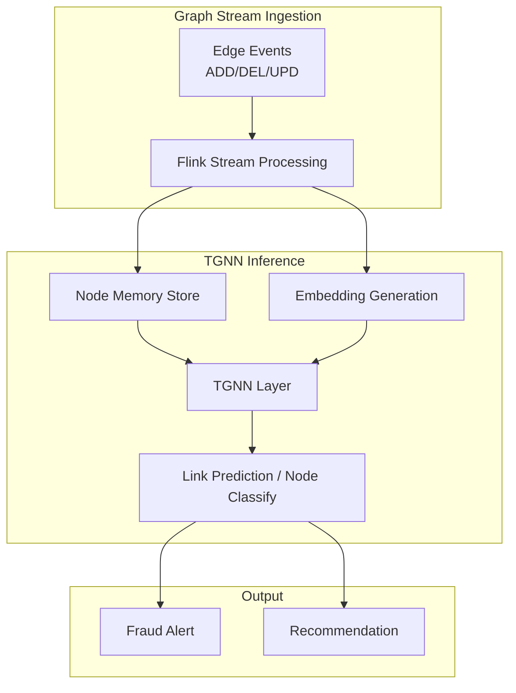

# Real-Time Graph Streaming & Temporal GNN (StreamTGN)

> **Language**: English | **Source**: [Knowledge/06-frontier/realtime-graph-streaming-tgnn.md](../Knowledge/06-frontier/realtime-graph-streaming-tgnn.md) | **Last Updated**: 2026-04-21

---

## 1. Definitions

### Def-K-06-EN-230: Temporal Graph

A dynamic graph structure with timestamped edges $\mathcal{G}_T = (V, E_T)$:

- $V$: Node set, $|V| = n$
- $E_T = \{(u, v, t) \mid u, v \in V, t \in \mathcal{T}\}$: Timestamped edge set
- $\mathcal{T} = \{t_1, t_2, ..., t_m\}$: Time domain, $t_1 < t_2 < ... < t_m$

Graph state at time $t$: $\mathcal{G}_t = (V, E_t)$, where $E_t = \{(u, v, t') \in E_T \mid t' \leq t\}$.

### Def-K-06-EN-231: Streaming Graph

An infinite sequence of graph update events:

$$
\mathcal{S}_G = \langle e_1, e_2, e_3, ... \rangle
$$

where $e_i = (\text{type}_i, (u_i, v_i), t_i, \text{feat}_i)$ with:

- $\text{type}_i \in \{\text{ADD}, \text{DEL}, \text{UPD}\}$
- $(u_i, v_i)$: Edge endpoints
- $t_i$: Event timestamp
- $\text{feat}_i$: Edge feature vector

| Characteristic | Static Graph | Streaming Graph |
|---------------|-------------|-----------------|
| Scale | Fixed $|V|$ | Dynamic growth |
| Edge set | $E$ fixed | $E_t$ evolves |
| Query | Full-graph | Time-window based |
| Complexity | $O(f(|V|, |E|))$ | $O(f(|V|, |E_t|, W))$ |
| Storage | Batch load | Incremental update |

### Def-K-06-EN-232: Temporal Graph Neural Network (TGNN)

A neural network learning temporal graph representations:

$$
\mathcal{N}_{TGNN}: \mathcal{G}_t \times \mathcal{H}_{t-1} \rightarrow \mathcal{H}_t \times \mathcal{Z}_t
$$

where:

- $\mathcal{H}_t = \{h_v^{(t)} \mid v \in V\}$: Node memory states at time $t$
- $\mathcal{Z}_t = \{z_v^{(t)} \mid v \in V\}$: Node embedding outputs
- State update: $h_v^{(t)} = \text{MEM}_{\text{UPDATE}}(h_v^{(t-1)}, m_v^{(t)})$
- Message aggregation: $m_v^{(t)} = \text{AGG}_{u \in \mathcal{N}(v)} \text{MSG}(h_u^{(t-1)}, e_{uv}^{(t)})$

## 2. Architecture



## 3. Streaming TGNN with Flink

```java
// Graph event ingestion
DataStream<GraphEvent> graphEvents = env
    .addSource(new GraphEventSource("kafka-topic"));

// Temporal window aggregation
DataStream<NodeUpdate> nodeUpdates = graphEvents
    .keyBy(e -> e.getNodeId())
    .window(SlidingEventTimeWindows.of(Time.minutes(5), Time.minutes(1)))
    .aggregate(new NeighborhoodAggregator());

// TGNN inference (async)
DataStream<Embedding> embeddings = AsyncDataStream
    .unorderedWait(
        nodeUpdates,
        new TGNNEmbedder(),
        500, TimeUnit.MILLISECONDS, 100
    );
```

## 4. Use Cases

| Domain | Graph | Task | Latency Req |
|--------|-------|------|-------------|
| **Finance** | Transaction network | Fraud detection | < 100ms |
| **Social** | Interaction graph | Trend prediction | < 1s |
| **IoT** | Device connectivity | Anomaly detection | < 500ms |
| **Knowledge** | Entity relation graph | Fact completion | < 2s |

## References
