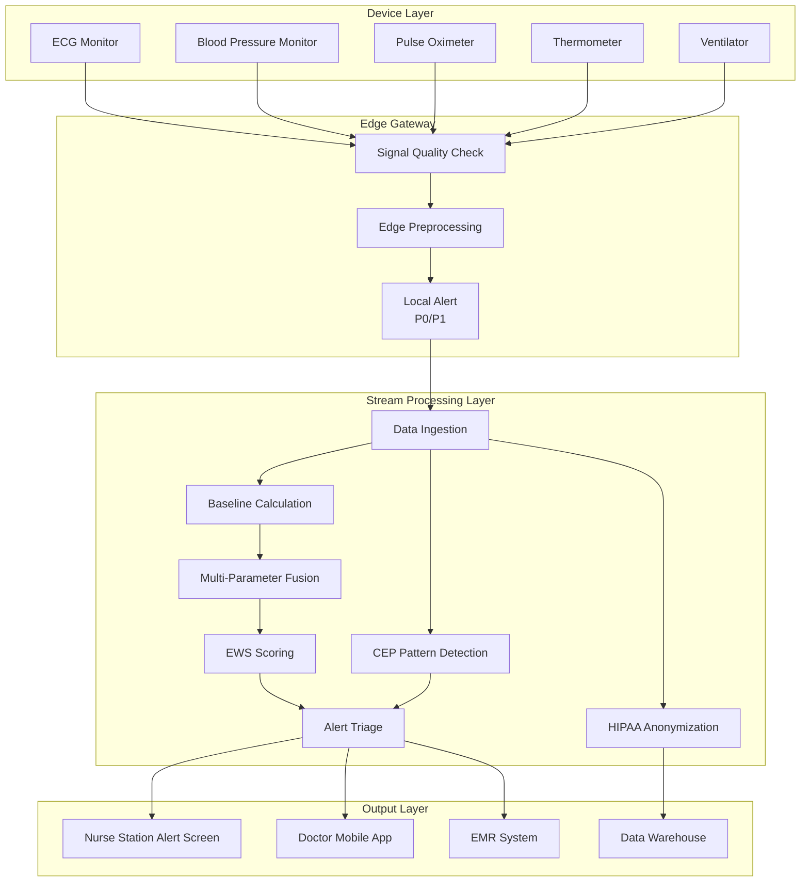
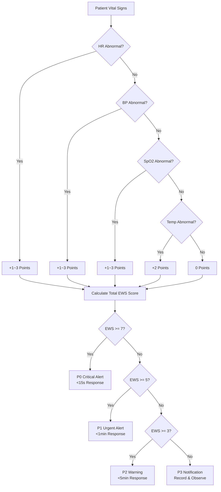

# Operators and Real-Time Healthcare Monitoring

> **Stage**: Knowledge/10-case-studies | **Prerequisites**: [01.10-process-and-async-operators.md](../Knowledge/01-concept-atlas/operator-deep-dive/01.10-process-and-async-operators.md), [operator-edge-computing-integration.md](../Knowledge/06-frontier/operator-edge-computing-integration.md) | **Formalization Level**: L3
> **Document Positioning**: Operator fingerprinting and pipeline design for stream processing operators in real-time patient monitoring and medical alert systems
> **Version**: 2026.04

---

## Table of Contents

- [Operators and Real-Time Healthcare Monitoring](#operators-and-real-time-healthcare-monitoring)
  - [Table of Contents](#table-of-contents)
  - [1. Definitions](#1-definitions)
    - [Def-MED-01-01: Internet of Medical Things (IoMT - 医疗物联网)](#def-med-01-01-internet-of-medical-things-iomt---internet-of-medical-things)
    - [Def-MED-01-02: Vital Signs Stream (生命体征数据流)](#def-med-01-02-vital-signs-stream)
    - [Def-MED-01-03: Early Warning Score (EWS - 早期预警评分)](#def-med-01-03-early-warning-score-ews)
    - [Def-MED-01-04: Clinical Alert Triage (临床告警分级)](#def-med-01-04-clinical-alert-triage)
    - [Def-MED-01-05: HIPAA/GDPR Compliant Dataflow](#def-med-01-05-hipaagdpr-compliant-dataflow)
  - [2. Properties](#2-properties)
    - [Lemma-MED-01-01: Relationship Between Medical Data Sampling Frequency and Accuracy](#lemma-med-01-01-relationship-between-medical-data-sampling-frequency-and-accuracy)
    - [Lemma-MED-01-02: False Positive Alerts and Nurse Fatigue](#lemma-med-01-02-false-positive-alerts-and-nurse-fatigue)
    - [Prop-MED-01-01: Advantages of Multi-Parameter Fusion](#prop-med-01-01-advantages-of-multi-parameter-fusion)
    - [Prop-MED-01-02: Latency Advantage of Edge Computing](#prop-med-01-02-latency-advantage-of-edge-computing)
  - [3. Relations](#3-relations)
    - [3.1 Medical Monitoring Pipeline Operator Mapping](#31-medical-monitoring-pipeline-operator-mapping)
    - [3.2 Operator Fingerprint](#32-operator-fingerprint)
    - [3.3 Healthcare vs. Other Industries Comparison](#33-healthcare-vs-other-industries-comparison)
  - [4. Argumentation](#4-argumentation)
    - [4.1 Why Traditional Batch Processing Cannot Be Used for Medical Monitoring](#41-why-traditional-batch-processing-cannot-be-used-for-medical-monitoring)
    - [4.2 Engineering Solutions to False Positive Problems](#42-engineering-solutions-to-false-positive-problems)
    - [4.3 Edge-Cloud Collaborative Medical Architecture](#43-edge-cloud-collaborative-medical-architecture)
  - [5. Proof / Engineering Argument](#5-proof--engineering-argument)
    - [5.1 Dynamic EWS Scoring Algorithm](#51-dynamic-ews-scoring-algorithm)
    - [5.2 CEP Pattern for Ventricular Fibrillation Detection](#52-cep-pattern-for-ventricular-fibrillation-detection)
    - [5.3 Operator-Level Implementation of Data Privacy Protection](#53-operator-level-implementation-of-data-privacy-protection)
  - [6. Examples](#6-examples)
    - [6.1 In Practice: ICU Real-Time Monitoring System](#61-in-practice-icu-real-time-monitoring-system)
    - [6.2 In Practice: Remote Patient Monitoring (Home)](#62-in-practice-remote-patient-monitoring-home)
  - [7. Visualizations](#7-visualizations)
    - [Medical Monitoring Pipeline Architecture](#medical-monitoring-pipeline-architecture)
    - [EWS Scoring and Alert Triage](#ews-scoring-and-alert-triage)
  - [8. References](#8-references)

---

## 1. Definitions

### Def-MED-01-01: Internet of Medical Things (IoMT - 医疗物联网)

IoMT (Internet of Medical Things) refers to systems that connect medical devices through IoT technology to collect and transmit patient physiological data in real time:

$$\text{IoMT} = (\text{Sensors}, \text{Gateways}, \text{Stream Platform}, \text{Clinical Decision Support})$$

Typical devices: ECG monitor (心电图监护仪), blood pressure monitor (血压计 NIBP), pulse oximeter (血氧仪 SpO2), thermometer (体温计), ventilator (呼吸机), infusion pump (输液泵).

### Def-MED-01-02: Vital Signs Stream (生命体征数据流)

Vital Signs Stream (生命体征数据流) is the time series of a patient's physiological parameters:

$$\text{Vitals}_p(t) = (\text{HR}(t), \text{BP}_{sys}(t), \text{BP}_{dia}(t), \text{SpO2}(t), \text{Temp}(t), \text{RR}(t))$$

Where HR is heart rate, BP is blood pressure, SpO2 is blood oxygen saturation, Temp is body temperature, and RR is respiratory rate.

### Def-MED-01-03: Early Warning Score (EWS - 早期预警评分)

Early Warning Score (EWS - 早期预警评分) is a weighted scoring system based on the deviation of multiple vital signs from their normal ranges:

$$\text{EWS}_p = \sum_{i} w_i \cdot \text{deviation}(v_i, v_i^{normal})$$

When $\text{EWS}_p > \text{Threshold}$, clinical intervention is triggered.

### Def-MED-01-04: Clinical Alert Triage (临床告警分级)

Clinical Alert Triage (临床告警分级) classifies alerts into four levels by urgency:

| Level | Name | Response Time | Examples |
|-------|------|--------------|----------|
| **P0** | Critical | < 15s | Cardiac arrest, ventricular fibrillation |
| **P1** | Urgent | < 1min | Severe hypotension, SpO2 < 85% |
| **P2** | Warning | < 5min | Abnormal heart rate trend, fever |
| **P3** | Notification | < 30min | Device offline, poor signal quality |

### Def-MED-01-05: HIPAA/GDPR Compliant Dataflow

Medical dataflow processing must satisfy privacy regulations:

- **Data Minimization (数据最小化)**: Only process clinically necessary data fields
- **Access Control (访问控制)**: Operator-level permission control (who can access which patient data)
- **Audit Logging (审计日志)**: All data access operations are traceable
- **Data Retention (数据保留期)**: Automatic expiration and deletion (e.g., research data retained for 7 years)

---

## 2. Properties

### Lemma-MED-01-01: Relationship Between Medical Data Sampling Frequency and Accuracy

The sampling frequency $f$ of vital signs and clinical diagnostic accuracy $P$ satisfy:

$$P(f) = 1 - e^{-\beta f}$$

However, excessively high frequencies lead to data explosion. Recommended frequencies:

- ECG: 250-500Hz (requires waveform detail)
- SpO2: 1Hz
- Blood pressure: 1-5 minutes/times (non-invasive) or continuous (invasive)
- Temperature: 1-5 minutes/times

### Lemma-MED-01-02: False Positive Alerts and Nurse Fatigue

False positive rate $FPR$ and clinical response compliance rate $C$ are negatively correlated:

$$C = C_{max} \cdot (1 - FPR)^{\gamma}$$

Where $\gamma$ is the fatigue coefficient (typically 2-3).

**Engineering Significance (工程意义)**: When FPR > 50%, nurses may ignore genuinely critical alerts (the "boy who cried wolf" effect).

### Prop-MED-01-01: Advantages of Multi-Parameter Fusion

The sensitivity $Sens_1$ and specificity $Spec_1$ of a single parameter are limited; multi-parameter fusion can improve them:

$$Sens_{fusion} = 1 - \prod_{i}(1 - Sens_i)$$

$$Spec_{fusion} = \prod_{i} Spec_i$$

**Trade-off (权衡)**: Sensitivity improves but specificity decreases; balance must be achieved through threshold tuning.

### Prop-MED-01-02: Latency Advantage of Edge Computing

For P0-level alerts (cardiac arrest), the latency difference between edge processing vs. cloud processing:

$$\Delta \mathcal{L} = \mathcal{L}_{cloud} - \mathcal{L}_{edge} = 50-200ms$$

**Key (关键)**: Cardiac arrest detection requires response within 5-10 seconds; edge processing is mandatory.

---

## 3. Relations

### 3.1 Medical Monitoring Pipeline Operator Mapping

| Processing Stage | Operator | Input | Output | Latency Requirement |
|-----------------|----------|-------|--------|-------------------|
| **Device Data Ingestion** | Source | MQTT/HL7 FHIR | Raw waveform/numeric | < 1s |
| **Signal Quality Check** | filter | Raw signal | Quality-qualified signal | < 100ms |
| **Baseline Extraction** | window+aggregate | Signal window | Baseline value | < 1s |
| **Anomaly Detection** | ProcessFunction/CEP | Current value+baseline | Anomaly event | < 500ms |
| **Multi-Parameter Fusion** | keyBy+aggregate | Multi-channel anomalies | Composite score | < 1s |
| **Alert Triage** | map | Composite score | Triage alert | < 100ms |
| **Alert Distribution** | AsyncFunction | Alert | Nurse station/mobile | < 1s |
| **Data Persistence** | Sink | Raw+processed data | Data warehouse | Async |

### 3.2 Operator Fingerprint

| Dimension | Medical Monitoring Characteristics |
|-----------|-----------------------------------|
| **Core Operators** | ProcessFunction (state machine: patient status tracking), window+aggregate (baseline calculation), CEP (pattern detection: e.g., ventricular fibrillation waveform) |
| **State Types** | ValueState (current EWS score), ListState (recent waveform segments), MapState (patient baseline) |
| **Time Semantics** | Processing time as primary (clinical decisions require immediate response) |
| **Data Characteristics** | Multi-parameter heterogeneous (waveform+numeric+alarm), high frequency (ECG 250Hz), large peak fluctuations (emergency periods) |
| **State Hotspots** | Critical patient keys (high-frequency updates) |
| **Performance Bottlenecks** | Waveform pattern recognition (requires ML inference), multi-parameter fusion computation |

### 3.3 Healthcare vs. Other Industries Comparison

| Dimension | Financial Risk Control | RTB Advertising | Gaming | Medical Monitoring |
|-----------|----------------------|-----------------|--------|-------------------|
| **Latency Requirement** | < 50ms | < 100ms | Milliseconds-seconds | < 1s (P0 < 15s) |
| **Correctness** | High | Medium | Medium | **Extremely High** (life-critical) |
| **Data Sensitivity** | High | Medium | Low | **Extremely High** (privacy regulations) |
| **Fault Tolerance** | High | Medium | Low | **Extremely High** (must not miss alerts) |
| **State Complexity** | Medium | Medium | Extremely High | High (multi-parameter+waveform) |

---

## 4. Argumentation

### 4.1 Why Traditional Batch Processing Cannot Be Used for Medical Monitoring

Problems with traditional Hospital Information Systems (HIS):

- Nurses manually record vital signs every 1-4 hours
- Critical changes may occur between two recordings
- Retrospective analysis cannot save lives

Advantages of stream processing:

- **Continuous Monitoring (连续监测)**: Update vital signs every second
- **Instant Alerting (即时告警)**: Abnormalities detected within seconds
- **Trend Prediction (趋势预测)**: Predict deterioration based on historical data

### 4.2 Engineering Solutions to False Positive Problems

**Problem (问题)**: Traditional monitors have a false positive rate as high as 85-90%, leading to nurse fatigue.

**Solutions (解决方案)**:

1. **Dynamic Thresholds (动态阈值)**: Personalized threshold adjustment based on patient baseline (rather than fixed values)
2. **Multi-Parameter Confirmation (多参数确认)**: Single-parameter anomalies do not trigger alerts; 2+ parameters must be abnormal simultaneously
3. **Trend Analysis (趋势分析)**: Transient value anomalies do not trigger alerts; abnormality must persist for more than 30 seconds
4. **Intelligent Suppression (智能抑制)**: Automatically suppress alerts in known interference scenarios (e.g., patient movement)

### 4.3 Edge-Cloud Collaborative Medical Architecture

**Edge Layer (Ward/ICU)**:

- Raw signal acquisition and preprocessing
- Real-time detection and response of P0/P1 alerts
- Patient privacy data does not leave the local environment

**Cloud Layer (Hospital Data Center)**:

- Long-term data storage and analysis
- Cross-patient epidemiological monitoring
- Machine learning model training

**Collaboration Points (协同点)**:

- Edge is responsible for real-time processing, cloud is responsible for deep analysis
- Models are deployed from cloud to edge devices
- Anomalous events are reported from edge to cloud for archiving

---

## 5. Proof / Engineering Argument

### 5.1 Dynamic EWS Scoring Algorithm

```java
public class EWSCalculator extends KeyedProcessFunction<String, VitalSigns, EWSAlert> {
    private MapState<String, Double> baselineState;
    private ValueState<Long> lastAlertTime;

    @Override
    public void processElement(VitalSigns vitals, Context ctx, Collector<EWSAlert> out) throws Exception {
        double ews = 0;

        // Heart rate scoring
        double hrBaseline = baselineState.get("HR");
        if (Math.abs(vitals.getHR() - hrBaseline) > 30) ews += 3;
        else if (Math.abs(vitals.getHR() - hrBaseline) > 15) ews += 1;

        // Systolic blood pressure scoring
        double sysBaseline = baselineState.get("SYS_BP");
        if (Math.abs(vitals.getSysBP() - sysBaseline) > 40) ews += 3;
        else if (Math.abs(vitals.getSysBP() - sysBaseline) > 20) ews += 1;

        // SpO2 scoring
        if (vitals.getSpO2() < 85) ews += 3;
        else if (vitals.getSpO2() < 90) ews += 2;
        else if (vitals.getSpO2() < 95) ews += 1;

        // Temperature scoring
        if (vitals.getTemp() > 39.0 || vitals.getTemp() < 35.0) ews += 2;

        // Alert triage
        String level;
        if (ews >= 7) level = "P0";
        else if (ews >= 5) level = "P1";
        else if (ews >= 3) level = "P2";
        else level = "P3";

        // Suppress duplicate alerts (only alert once per level within 1 minute)
        Long lastAlert = lastAlertTime.value();
        if (lastAlert == null || ctx.timestamp() - lastAlert > 60000 || !level.equals(prevLevel)) {
            out.collect(new EWSAlert(vitals.getPatientId(), ews, level, ctx.timestamp()));
            lastAlertTime.update(ctx.timestamp());
        }
    }
}
```

### 5.2 CEP Pattern for Ventricular Fibrillation Detection

Ventricular Fibrillation (室颤) ECG characteristics:

- Frequency: 150-500 beats/minute
- Waveform: Irregular, no clear QRS complex

```java
Pattern<ECGSample, ?> vfPattern = Pattern
    .<ECGSample>begin("irregular_rhythm")
    .where(new IterativeCondition<ECGSample>() {
        @Override
        public boolean filter(ECGSample sample, Context<ECGSample> ctx) {
            // R-R interval irregularity (coefficient of variation > 0.2)
            List<ECGSample> recent = ctx.getEventsForPattern("irregular_rhythm");
            if (recent.size() < 5) return true;  // Accumulate sufficient samples
            return calculateRRIrregularity(recent) > 0.2;
        }
    })
    .timesOrMore(10)  // Sustained for 10 cycles
    .where(new IterativeCondition<ECGSample>() {
        @Override
        public boolean filter(ECGSample sample, Context<ECGSample> ctx) {
            // Heart rate in 150-500 bpm range
            double hr = 60000.0 / sample.getRrInterval();
            return hr >= 150 && hr <= 500;
        }
    })
    .within(Time.seconds(5));
```

### 5.3 Operator-Level Implementation of Data Privacy Protection

**HIPAA-Compliant Field-Level Anonymization**:

```java
public class HIPAACompliantMapper extends RichMapFunction<PatientData, AnonymizedData> {
    private transient FieldEncryption encryptor;

    @Override
    public AnonymizedData map(PatientData data) {
        return AnonymizedData.builder()
            // Direct identifiers: encrypt
            .patientId(encryptor.encrypt(data.getPatientId()))
            .name(encryptor.encrypt(data.getName()))
            .ssn(encryptor.encrypt(data.getSsn()))
            // Quasi-identifiers: generalize
            .ageRange(generalizeAge(data.getAge()))  // 25 -> 20-30
            .zipPrefix(data.getZipCode().substring(0, 3))  // 12345 -> 123**
            // Clinical data: retain
            .heartRate(data.getHeartRate())
            .bloodPressure(data.getBloodPressure())
            .build();
    }
}
```

---

## 6. Examples

### 6.1 In Practice: ICU Real-Time Monitoring System

```java
// 1. Multi-device data ingestion
DataStream<VitalSigns> vitals = env.addSource(new MQTTSource("hospital/icu/+/vitals"));

// 2. Signal quality filtering
DataStream<VitalSigns> qualityVitals = vitals
    .filter(v -> v.getSignalQuality() > 0.7);  // Process only if quality > 70%

// 3. Baseline update (sliding window, update baseline every hour)
qualityVitals.keyBy(VitalSigns::getPatientId)
    .window(SlidingEventTimeWindows.of(Time.hours(1), Time.minutes(10)))
    .aggregate(new BaselineAggregate())
    .addSink(new BaselineStoreSink());

// 4. EWS scoring and alerting
qualityVitals.keyBy(VitalSigns::getPatientId)
    .process(new EWSCalculator())
    .addSink(new AlertNotificationSink());

// 5. Ventricular fibrillation detection (ECG waveform)
qualityVitals.filter(v -> v.getType().equals("ECG"))
    .map(v -> (ECGSample)v)
    .keyBy(ECGSample::getPatientId)
    .pattern(vfPattern)
    .process(new VFAlertHandler())
    .addSink(new CriticalAlertSink());

// 6. Data persistence (asynchronous, does not affect real-time alerting)
qualityVitals.addSink(new HIPAACompliantSink("s3://hospital-data/"));
```

### 6.2 In Practice: Remote Patient Monitoring (Home)

**Scenario (场景)**: Chronic disease patients wear wearable devices at home, with data uploaded in real time to the cloud monitoring center.

**Edge Layer (Patient Phone/Gateway)**:

```java
// Edge preprocessing: anomaly detection + downsampling
 wearableData.map(new EdgePreprocess())  // Filter motion artifacts
    .filter(v -> v.isAnomaly())  // Only upload anomalous data
    .windowAll(TumblingProcessingTimeWindows.of(Time.minutes(5)))  // Batch upload
    .aggregate(new BatchUploadAggregate())
    .addSink(new HTTPSink("https://hospital-cloud/api/vitals"));
```

**Cloud Layer (Monitoring Center)**:

```java
// Receive batch data from multiple patients
DataStream<BatchVitals> batches = env.addSource(new HTTPSource(8080));

// Doctor dashboard: real-time patient status
batches.flatMap(new FlatMapFunction<BatchVitals, PatientStatus>() {
    @Override
    public void flatMap(BatchVitals batch, Collector<PatientStatus> out) {
        for (VitalSigns v : batch.getVitals()) {
            out.collect(new PatientStatus(v.getPatientId(), calculateEWS(v)));
        }
    }
})
.keyBy(PatientStatus::getPatientId)
    .window(TumblingProcessingTimeWindows.of(Time.seconds(10)))
    .aggregate(new DashboardAggregate())
    .addSink(new WebSocketSink());  // Real-time push to doctor workstation
```

---

## 7. Visualizations

### Medical Monitoring Pipeline Architecture



### EWS Scoring and Alert Triage



---

## 8. References

[^1]: Apache Flink Documentation, "State Processors and Async I/O", 2025. https://nightlies.apache.org/flink/flink-docs-stable/docs/dev/datastream/operators/async_io/
[^2]: HL7 FHIR Specification, "FHIR R5 Streaming Patterns", 2024. https://hl7.org/fhir/R5/
[^3]: HIPAA Privacy Rule, "De-identification Standards", 45 CFR § 164.514. https://www.hhs.gov/hipaa/for-professionals/privacy/special-topics/de-identification/index.html
[^4]: R. Taori et al., "Reducing Alert Fatigue in ICU Monitoring", Journal of Biomedical Informatics, 2023.
[^5]: Apache Flink CEP Library, "Complex Event Processing for Healthcare", 2025. https://nightlies.apache.org/flink/flink-docs-stable/docs/libs/cep/

---

*Related Documents*: [01.10-process-and-async-operators.md](../Knowledge/01-concept-atlas/operator-deep-dive/01.10-process-and-async-operators.md) | [operator-edge-computing-integration.md](../Knowledge/06-frontier/operator-edge-computing-integration.md) | [operator-security-and-permission-model.md](../Knowledge/08-standards/operator-security-and-permission-model.md)
