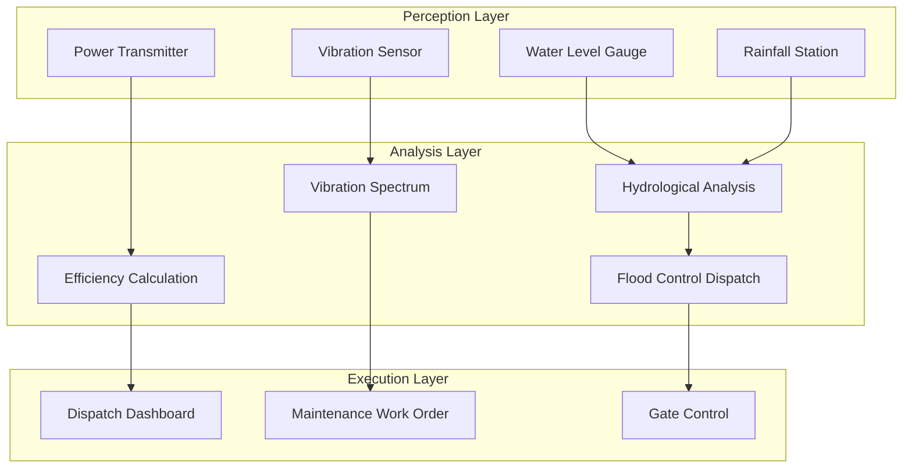

# Operators and Real-time Hydropower Monitoring

> **Stage**: Knowledge/10-case-studies | **Prerequisites**: [01.06-single-input-operators.md](01.06-single-input-operators.md), [operator-energy-grid-monitoring.md](operator-energy-grid-monitoring.md) | **Formalization Level**: L3
> **Document Scope**: Operator fingerprint and Pipeline design for streaming operators in real-time hydropower plant operation monitoring, flood control dispatch, and equipment health diagnosis
> **Version**: 2026.04

---

## Table of Contents

- [1. Definitions](#1-definitions)
- [2. Properties](#2-properties)
- [3. Relations](#3-relations)
- [4. Argumentation](#4-argumentation)
- [5. Proof / Engineering Argument](#5-proof--engineering-argument)
- [6. Examples](#6-examples)
- [7. Visualizations](#7-visualizations)
- [8. References](#8-references)

---

## 1. Definitions

### Def-HYD-01-01: Hydropower Real-time Monitoring (水电站实时监测系统)

Hydropower Real-time Monitoring is a comprehensive surveillance system for hydraulic structures, electromechanical equipment, and operating conditions:

$$\text{HydroMonitor} = (\text{Dam}_t, \text{Turbine}_t, \text{Generator}_t, \text{Transformer}_t, \text{WaterSystem}_t)$$

### Def-HYD-01-02: Reservoir Operation Chart (水库调度图)

Reservoir Operation Chart is a zoned rule set that guides reservoir operations:

$$\text{Zone}(V_t, Q_{in,t}) \in \{\text{Normal}, \text{FloodControl}, \text{Conservation}, \text{Dead}\}$$

### Def-HYD-01-03: Vibration Severity (机组振动烈度)

Vibration Severity is a comprehensive indicator measuring the operating state of rotating machinery:

$$V_s = \sqrt{\sum_{i} (a_i \cdot w_i)^2}$$

Where $a_i$ is the vibration acceleration in the $i$-th frequency band, and $w_i$ is the weight. Per ISO 10816 standard: $V_s < 2.8$ mm/s is excellent, $2.8-7.1$ is good, and $> 7.1$ is abnormal.

### Def-HYD-01-04: Turbine Efficiency (水轮机效率)

$$\eta = \frac{P_{out}}{\rho g Q H}$$

Where $P_{out}$ is the output power, $Q$ is the flow rate, and $H$ is the water head.

### Def-HYD-01-05: Flood Control Level (防洪限制水位)

Flood Control Level is the maximum allowable water storage level during the flood season:

$$Z_{flood} = Z_{normal} - \Delta Z_{safety}$$

---

## 2. Properties

### Lemma-HYD-01-01: Reservoir Water Balance

$$\frac{dV}{dt} = Q_{in} - Q_{out} - Q_{loss}$$

**Proof**: Directly derived from the continuity equation. ∎

### Lemma-HYD-01-02: Turbine Similarity Laws

$$\frac{Q_1}{Q_2} = \left(\frac{D_1}{D_2}\right)^3 \cdot \frac{n_1}{n_2}, \quad \frac{H_1}{H_2} = \left(\frac{D_1}{D_2}\right)^2 \cdot \left(\frac{n_1}{n_2}\right)^2$$

### Prop-HYD-01-01: Characteristic Frequencies of Vibration Spectrum

| Fault Type | Characteristic Frequency | Diagnostic Basis |
|-----------|-------------------------|------------------|
| Imbalance | 1× rotation frequency | 1× amplitude dominant |
| Misalignment | 2× rotation frequency | 2× amplitude significant |
| Oil whip | 0.42-0.48× rotation frequency | Subsynchronous component |
| Blade passing | Number of blades × rotation frequency | High-frequency periodicity |

### Prop-HYD-01-02: Water Level – Power Generation Relationship

$$P = \eta \cdot \rho g \cdot Q \cdot (Z_{up} - Z_{down})$$

---

## 3. Relations

### 3.1 Hydropower Monitoring Pipeline Operator Mapping

| Application Scenario | Operator Combination | Data Source | Latency Requirement |
|---------------------|---------------------|-------------|---------------------|
| **Hydrological monitoring** | Source + map | Water level / rainfall sensors | < 1 min |
| **Vibration analysis** | AsyncFunction + window | Accelerometer sensors | < 5 min |
| **Efficiency calculation** | map | Flow rate / power | < 1 min |
| **Flood control dispatch** | Broadcast + ProcessFunction | Dispatch command | < 10 min |
| **Equipment diagnosis** | Async ML | Multi-sensor | < 15 min |

### 3.2 Operator Fingerprint

| Dimension | Hydropower Monitoring Characteristics |
|-----------|--------------------------------------|
| **Core operators** | ProcessFunction (equipment state machine), AsyncFunction (spectrum analysis), BroadcastProcessFunction (dispatch command), window+aggregate (statistics) |
| **State types** | ValueState (equipment health index), MapState (sensor calibration), BroadcastState (dispatch rules) |
| **Time semantics** | Event time (sensor timestamp) |
| **Data characteristics** | Periodicity (day/night / seasonal), spatial correlation (upstream/downstream), strong causality |
| **State scale** | Keyed by unit; large hydropower plants can have dozens of units |
| **Performance bottleneck** | Spectrum analysis computation, external weather API |

---

## 4. Argumentation

### 4.1 Why Hydropower Plants Need Stream Processing Instead of Traditional SCADA

Problems with traditional SCADA:
- Second-level refresh: unable to capture high-frequency vibration signals
- Manual interpretation: delayed fault detection
- Offline analysis: health trends cannot be tracked in real time

Advantages of stream processing:
- Millisecond-level sampling: high-frequency vibration real-time analysis
- Automatic diagnosis: AI models identify fault patterns in real time
- Predictive maintenance: schedule maintenance ahead of time based on trends

### 4.2 Real-time Decision-making for Flood Control Dispatch

**Scenario**: Upstream heavy rain causes a surge in inflow.

**Stream processing solution**:
1. Real-time rainfall data → Flood forecasting model → Inflow prediction
2. Current reservoir capacity → Comparison with Flood Control Level → Discharge decision
3. Downstream safety → Flow control → Automatic gate adjustment

### 4.3 Early Warning for Unit Vibration

**Problem**: In the early stage of runner cracks in hydraulic turbines, vibration changes are subtle and difficult for humans to detect.

**Solution**: Stream processing real-time spectrum analysis → Feature frequency energy change detection → Trend-based early warning.

---

## 5. Proof / Engineering Argument

### 5.1 Real-time Vibration Monitoring

```java
// Vibration sensor stream
DataStream<VibrationData> vibration = env.addSource(new AccelerometerSource());

// Spectrum analysis
vibration.keyBy(VibrationData::getUnitId)
    .window(TumblingProcessingTimeWindows.of(Time.minutes(5)))
    .process(new ProcessFunction<Iterable<VibrationData>, VibrationSpectrum>() {
        @Override
        public void process(Iterable<VibrationData> values, Context ctx, Collector<VibrationSpectrum> out) {
            List<Double> samples = new ArrayList<>();
            values.forEach(v -> samples.add(v.getAcceleration()));
            
            // FFT spectrum analysis
            Complex[] fftResult = FFT.fft(samples.stream().mapToDouble(Double::doubleValue).toArray());
            
            double[] magnitudes = new double[fftResult.length / 2];
            for (int i = 0; i < magnitudes.length; i++) {
                magnitudes[i] = fftResult[i].abs();
            }
            
            // Extract feature frequencies
            double rotationFreq = 50.0 / 60.0;  // 50Hz = 3000rpm
            double[] featureFreqs = {1, 2, 0.45};
            
            Map<String, Double> features = new HashMap<>();
            for (double f : featureFreqs) {
                int idx = (int)(f * rotationFreq * samples.size() / 200.0);
                features.put(f + "x", magnitudes[idx]);
            }
            
            out.collect(new VibrationSpectrum(ctx.getCurrentKey(), features, ctx.timestamp()));
        }
    })
    .addSink(new DiagnosticSink());
```

### 5.2 Reservoir Flood Control Dispatch

```java
// Inflow stream
DataStream<InflowData> inflow = env.addSource(new HydrologicalSource());

// Real-time dispatch decision
inflow.keyBy(InflowData::getReservoirId)
    .connect(dispatchRulesBroadcast)
    .process(new BroadcastProcessFunction<InflowData, DispatchRule, FloodControlCommand>() {
        @Override
        public void processElement(InflowData data, ReadOnlyContext ctx, Collector<FloodControlCommand> out) {
            ReadOnlyBroadcastState<String, DispatchRule> rules = ctx.getBroadcastState(RULE_DESCRIPTOR);
            DispatchRule rule = rules.get(data.getReservoirId());
            
            if (rule == null) return;
            
            // Calculate current reservoir capacity status
            double currentLevel = data.getCurrentLevel();
            double floodLimit = rule.getFloodControlLevel();
            double inflowRate = data.getInflowRate();
            
            if (currentLevel > floodLimit && inflowRate > rule.getMaxInflow()) {
                double releaseRate = calculateRelease(currentLevel, floodLimit, inflowRate);
                out.collect(new FloodControlCommand(data.getReservoirId(), releaseRate, "FLOOD_RELEASE", ctx.timestamp()));
            }
        }
        
        @Override
        public void processBroadcastElement(DispatchRule rule, Context ctx, Collector<FloodControlCommand> out) {
            ctx.getBroadcastState(RULE_DESCRIPTOR).put(rule.getReservoirId(), rule);
        }
    })
    .addSink(new GateControlSink());
```

---

## 6. Examples

### 6.1 Case Study: Large Hydropower Plant Intelligent Monitoring

```java
// 1. Multi-sensor data ingestion
DataStream<VibrationData> vibration = env.addSource(new AccelerometerSource());
DataStream<InflowData> inflow = env.addSource(new HydrologicalSource());
DataStream<PowerData> power = env.addSource(new GeneratorSource());

// 2. Vibration diagnosis
vibration.keyBy(VibrationData::getUnitId)
    .window(TumblingProcessingTimeWindows.of(Time.minutes(5)))
    .process(new VibrationDiagnosticFunction())
    .addSink(new MaintenanceAlertSink());

// 3. Efficiency monitoring
power.connect(inflow.keyBy(InflowData::getReservoirId))
    .process(new CoProcessFunction<PowerData, InflowData, EfficiencyReport>() {
        private ValueState<InflowData> lastInflow;
        
        @Override
        public void processElement1(PowerData p, Context ctx, Collector<EfficiencyReport> out) {
            InflowData inf = lastInflow.value();
            if (inf == null) return;
            
            double efficiency = p.getPower() / (9.81 * inf.getFlowRate() * inf.getHead());
            out.collect(new EfficiencyReport(p.getUnitId(), efficiency, ctx.timestamp()));
        }
        
        @Override
        public void processElement2(InflowData inf, Context ctx, Collector<EfficiencyReport> out) {
            lastInflow.update(inf);
        }
    })
    .addSink(new EfficiencyDashboardSink());

// 4. Flood control dispatch
inflow.connect(dispatchRulesBroadcast)
    .process(new FloodControlFunction())
    .addSink(new GateControlSink());
```

---

## 7. Visualizations

### Hydropower Monitoring Pipeline



---

## 8. References

[^1]: IEC, "Technical Specifications for Hydropower Plant Monitoring", https://www.iec.ch/

[^2]: China Institute of Water Resources, "Hydropower Station Operation Standards", 2023.

[^3]: ISO, "10816 Mechanical Vibration - Evaluation of Machine Vibration", https://www.iso.org/

[^4]: Wikipedia, "Hydroelectricity", https://en.wikipedia.org/wiki/Hydroelectricity

[^5]: Wikipedia, "Dam Safety", https://en.wikipedia.org/wiki/Dam_safety

---

*Related Documents*: [01.06-single-input-operators.md](01.06-single-input-operators.md) | [operator-energy-grid-monitoring.md](operator-energy-grid-monitoring.md) | [realtime-energy-trading-case-study.md](realtime-energy-trading-case-study.md)
