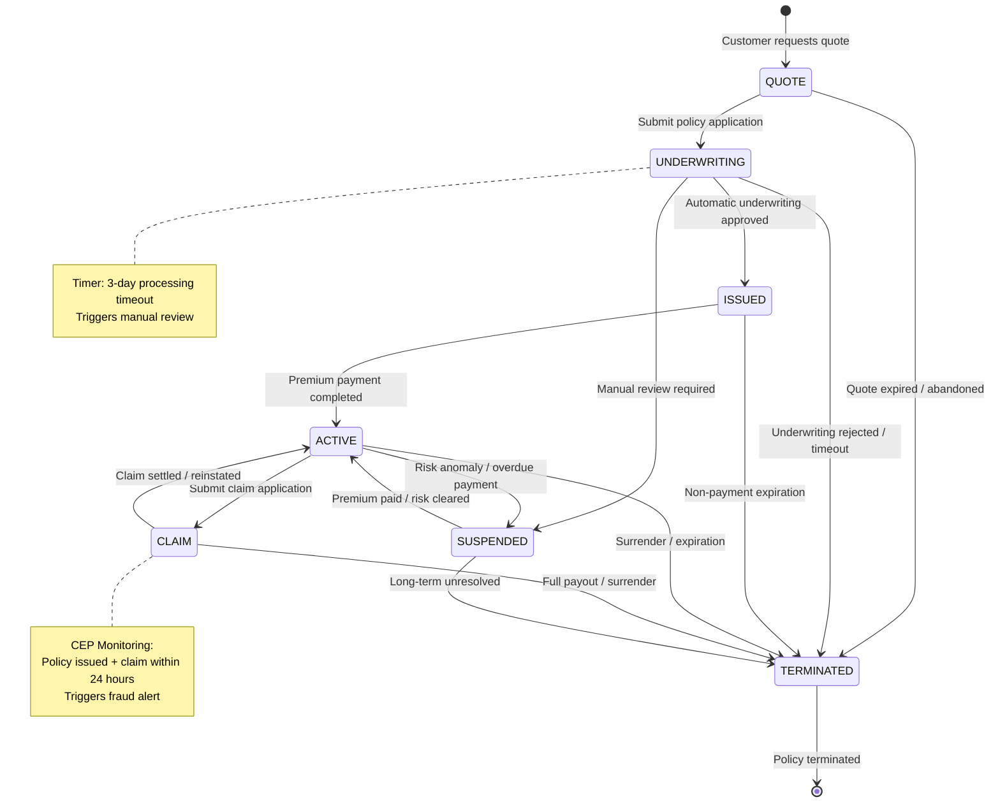
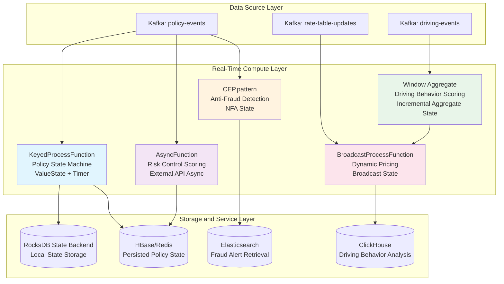
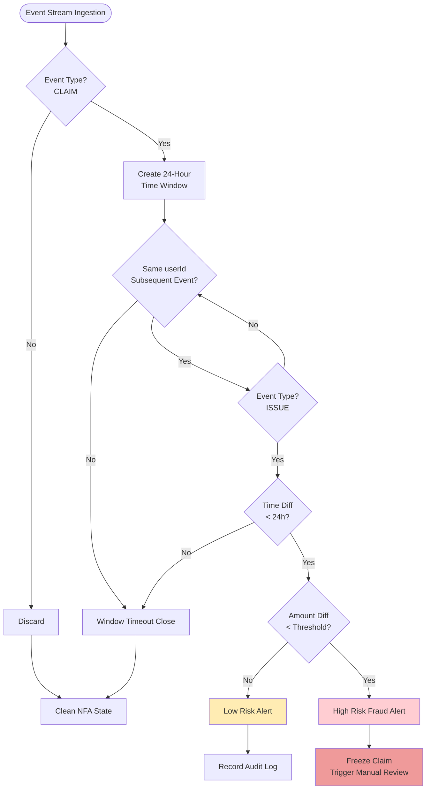

# Deep Application Case Study of Stream Processing Operators in Real-Time InsurTech (保险科技)

> **Stage**: Knowledge | **Prerequisites**: [../Knowledge/01-concept-atlas/operator-deep-dive/01.10-process-and-async-operators.md](../Knowledge/01-concept-atlas/operator-deep-dive/01.10-process-and-async-operators.md), [../Knowledge/01-concept-atlas/operator-deep-dive/01.08-multi-input-operators.md](../Knowledge/01-concept-atlas/operator-deep-dive/01.08-multi-input-operators.md), [./operator-security-and-permission-model.md](./operator-security-and-permission-model.md) | **Formal Level**: L4

---

## 1. Definitions

**Def-INS-01-01 InsurTech (保险科技)**
> InsurTech refers to the technology system and industrial form that leverages modern information technologies—such as big data, artificial intelligence, and distributed stream computing—to digitally reconstruct and intelligently upgrade the full lifecycle of traditional insurance business (product design, underwriting, pricing, claims, and customer service).

From the stream computing perspective, the core characteristic of InsurTech is the transformation of "batch-style" insurance business processes into "event-driven, real-time responsive" continuous data processing pipelines. Traditional insurance systems operate in T+1 or even T+N batch modes, whereas real-time InsurTech systems require underwriting decisions to be completed in milliseconds, fraud detection to be triggered in seconds, and dynamic pricing to take effect in minutes.

**Def-INS-01-02 Dynamic Pricing Model (动态定价模型)**
> The dynamic pricing model is a time-varying function $P: \mathcal{R} \times \mathcal{T} \times \mathcal{C} \rightarrow \mathbb{R}^+$, where $\mathcal{R}$ is the risk feature space, $\mathcal{T}$ is the time domain, and $\mathcal{C}$ is the context space (traffic conditions, weather, driving behavior, etc.), with output being the real-time premium $p(t)$. This model satisfies the monotonicity constraint: if risk scores $r_1 \leq r_2$, then $P(r_1, t, c) \leq P(r_2, t, c)$.

Dynamic pricing completely overturns the traditional insurance "annual fixed rate" model. In UBI (Usage-Based Insurance) scenarios, every driving event generated by a vehicle (harsh braking, speeding, night driving) triggers a repricing calculation, with premiums adjusted in real time according to driving behavior.

**Def-INS-01-03 Usage-Based Insurance (UBI) (基于使用的保险)**
> UBI is an insurance model that uses the actual behavioral data of the insured (rather than static demographic characteristics) as the basis for pricing. Its formal representation is the contractual quadruple $\mathcal{U} = \langle \mathcal{D}, \mathcal{F}, \Pi, \Delta \rangle$, where:
>
> - $\mathcal{D}$: behavioral data stream (driving speed, acceleration, location, time)
> - $\mathcal{F}$: family of feature extraction functions $\{f_i: \mathcal{D} \rightarrow \mathbb{R}\}$
> - $\Pi$: set of pricing strategies
> - $\Delta$: premium adjustment period (real-time / daily / monthly)

UBI transforms insurance from "risk transfer" to "risk sharing + behavioral incentive"—safe drivers receive premium discounts, while high-risk behaviors are reflected in real time as premium increases.

**Def-INS-01-04 Fraud Triangle (保险欺诈三角)**
> The Fraud Triangle is a classic framework for anti-fraud analysis, referring to the three-element set $\mathcal{FT} = \{M, O, R\}$ required for fraudulent behavior to occur:
>
> - **Motive (M)**: economic pressure, moral hazard tendency
> - **Opportunity (O)**: system vulnerabilities, information asymmetry, claims process flaws
> - **Rationalization (R)**: "insurance companies have money," "I'm just taking back what's mine"

In real-time stream processing systems, the Fraud Triangle is transformed into computable signals: motive is quantified through credit scoring and financial status models; opportunity is identified by detecting abnormal policy application patterns; rationalization is captured through NLP analysis of sentiment tendencies and wording patterns in claim description texts.

**Def-INS-01-05 Risk Score (风险评分)**
> The risk score is a normalized numerical mapping $S: \mathcal{X} \rightarrow [0, 1]$, where $\mathcal{X}$ is the multi-dimensional risk feature vector space. The score satisfies the following axioms:
>
> - **Boundedness**: $\forall x \in \mathcal{X}, 0 \leq S(x) \leq 1$
> - **Monotonicity**: if $x_1$ has risk exposure no higher than $x_2$ in every dimension, then $S(x_1) \leq S(x_2)$
> - **Composability**: $S_{\text{combined}}(x) = \bigoplus_{i=1}^{n} w_i \cdot S_i(x_i)$, where $\bigoplus$ is the weighted aggregation operator

**Def-INS-01-06 Policy State Machine (保单状态机)**
> The policy state machine is a deterministic finite automaton (DFA) $\mathcal{M}_{\text{policy}} = (Q, \Sigma, \delta, q_0, F)$, where:
>
> - $Q = \{\text{QUOTE}, \text{UNDERWRITING}, \text{ISSUED}, \text{ACTIVE}, \text{CLAIM}, \text{SUSPENDED}, \text{TERMINATED}\}$
> - $\Sigma$: event alphabet (policy application, underwriting approval, coverage confirmation, claim application, fraud flag, surrender request)
> - $\delta: Q \times \Sigma \rightarrow Q$: state transition function
> - $q_0 = \text{QUOTE}$: initial state
> - $F = \{\text{TERMINATED}\}$: set of terminal states

The core constraint of this state machine is: **the transition from ISSUED to CLAIM must satisfy the time window constraint $t_{\text{claim}} - t_{\text{issued}} \geq T_{\text{min}}$**, to prevent the fraud pattern of "claiming immediately after policy issuance."

**Def-INS-01-07 Operator Fingerprint (算子指纹)**
> The operator fingerprint is the runtime characteristic signature of a stream processing operator in a specific business scenario, formally defined as the septuple $\mathcal{F}_{\text{op}} = \langle \text{Type}, \text{State}, \text{Time}, \text{Data}, \text{Hotspot}, \text{Bottleneck}, \text{Latency} \rangle$, used to characterize the operator's resource consumption pattern, state access pattern, and performance boundaries.

---

## 2. Properties

**Lemma-INS-01-01 Policy State Consistency**
> In a policy state machine implemented based on `KeyedProcessFunction` + Timer, if the Checkpoint interval is $T_c$, then at any time $t$, the policy state $q(t)$ satisfies:
> $$q(t) \in \{q_{\text{last\_checkpoint}}\} \cup \{\delta(q_{\text{last\_checkpoint}}, e_i) \mid e_i \in \text{unprocessed\_events}\}$$
> That is, the state is either the most recent Checkpoint's persisted state, or a new state driven by events processed but not yet persisted since that Checkpoint.

*Derivation*: The state of `KeyedProcessFunction` is managed by Flink's Keyed State Backend. Each state update is first written to the in-memory state table, then asynchronously flushed to Checkpoint storage. Since state access is single-threaded (one state slot per key), there are no concurrent modification conflicts. The times triggered by Timers are also captured as part of the state by Checkpoint, so registered timers are not lost after recovery.

**Lemma-INS-01-02 Dynamic Pricing Latency Upper Bound**
> Let the event interval of the driving event stream be $\Delta t_e$, and the rate table update period of the Broadcast Stream be $T_b$. Then the end-to-end latency $L$ of the dynamic pricing output satisfies:
> $$L \leq L_{\text{network}} + L_{\text{serialization}} + \max(\Delta t_e, T_b) + L_{\text{compute}}$$
> where $L_{\text{compute}}$ is the local computation latency of `BroadcastProcessFunction`.

*Derivation*: The Broadcast Stream of `BroadcastProcessFunction` is sent to all parallel instances in a full-replication manner, and its latency mainly depends on network serialization overhead. Since Broadcast State is read-only (from the business semantics, the rate table should not be modified by the operator), there is no state contention. Events from the main data stream and updates from the Broadcast Stream are aligned through Flink's Watermark mechanism, so the latency upper bound is determined by the slower of the two.

**Prop-INS-01-01 Anti-Fraud Detection Soundness (反欺诈检测完备性)**
> Let the set of fraud patterns be $\mathcal{P} = \{p_1, p_2, \ldots, p_n\}$, and the detection operator for each pattern $p_i$ in the CEP engine be $\text{CEP}_i$. If the input event stream is $\mathcal{E}$, then:
> $$\text{DetectedFraud} = \bigcup_{i=1}^{n} \text{CEP}_i(\mathcal{E}) \subseteq \text{ActualFraud}(\mathcal{E})$$
> That is, the CEP detection result is a subset of the actual fraud set (no false positives guarantee, when pattern definitions are precise).

*Note*: The premise for this property to hold is that CEP pattern definitions are sufficiently precise and do not contain fuzzy matching conditions. In engineering practice, **two-layer filtering** is typically used to guarantee this: the first layer CEP performs coarse screening (high recall), and the second layer rule engine / machine learning model performs fine screening (high precision), thereby achieving a balance between soundness and accuracy.

**Prop-INS-01-02 Monotonic Convergence of Driving Behavior Score Aggregation**
> Let the time window be $[t_0, t_0 + T]$, the set of driving events within the window be $\{e_1, \ldots, e_n\}$, and the score aggregation function be $A$ (e.g., number of harsh braking events, total speeding duration). Then the window aggregation result $A_T$ is monotonically non-decreasing as events arrive:
> $$\forall t_1 < t_2 \leq t_0 + T, \quad A_{t_1} \leq A_{t_2}$$
> And when the window closes, $A_T$ reaches its maximum value and triggers downstream pricing calculation.

*Derivation*: Aggregation operators (such as `sum`, `count`) themselves possess monotonicity. Flink's Window Operator triggers computation when the Watermark crosses the window end boundary. At this point, all events within the window have arrived (assuming no late events or late events have been side-output), and the aggregation result is the deterministic final value.

---

## 3. Relations

### 3.1 Mapping Matrix Between Insurance Business Scenarios and Stream Processing Operators

| Business Scenario | Core Operator | State Type | Time Semantics | Data Characteristics |
|---------|---------|---------|---------|---------|
| Real-time Underwriting | `KeyedProcessFunction` + ValueState | Keyed State (policy state) | Event Time + Processing Time Timer | Low throughput, high value, strong consistency |
| Dynamic Pricing (UBI) | `BroadcastProcessFunction` | Broadcast State (rate table) | Event Time | High throughput, low latency, read-only config |
| Anti-Fraud Detection | `CEP.pattern()` | NFA State (non-deterministic finite automaton) | Event Time | Complex event sequences, pattern matching |
| Claims Automation | `AsyncFunction` + `ProcessFunction` | None / Timer State | Processing Time | I/O intensive, external API calls |
| Driving Behavior Scoring | `windowAll` / `window` + `aggregate` | Window State (incremental aggregation) | Event Time | Time window aggregation, late events allowed |
| Customer Lifecycle | `CoProcessFunction` (multi-stream Join) | Keyed State (multi-stream state) | Event Time | Multi-source heterogeneous data association |

### 3.2 Relationship with Prerequisite Documents

- **Relationship with `01.10-process-and-async-operators.md`**: The `AsyncFunction` in this document is used in the claims automation scenario to call external risk control APIs. Its implementation follows the asynchronous I/O pattern defined in that document—delegating blocking calls to a thread pool via `AsyncFunction.asyncInvoke()`, with results returned to the main data stream through the `ResultFuture.complete()` callback.

- **Relationship with `01.08-multi-input-operators.md`**: `BroadcastProcessFunction` and `CoProcessFunction` correspond to the two multi-input modes of "configuration stream broadcast" and "multi-business stream association" respectively. The read-only semantics of Broadcast State avoid the classic problem of multi-stream concurrent state modification.

- **Relationship with `operator-security-and-permission-model.md`**: The sensitivity levels of insurance data (PII, health data, financial data) require operator-level data access control. The state storage of underwriting operators must be encrypted, and `AsyncFunction` calls to external scoring APIs must authenticate via mTLS.

---

## 4. Argumentation

### 4.1 Why Must Event Time Be Used Rather Than Processing Time?

In insurance scenarios, event times (policy application time, accident occurrence time, driving behavior occurrence time) and processing times (server reception time) may differ significantly, for the following reasons:

1. **Vehicle device offline**: When vehicles pass through tunnels or remote areas, OBD/Telematics devices cache data and report in batches after network recovery. Processing Time would cause the "time going backwards" phenomenon—events that occurred later are processed first.
2. **Claims material supplementary recording**: Users may upload photos and fill out claim forms hours after an accident occurs, but the event time of the claim application should be the accident time.
3. **Cross-time-zone business**: Insurance company users may be distributed across different time zones, and the unified server time zone of Processing Time would cause pricing/underwriting sequence confusion.

Therefore, all operators in this document involving time windows and state timeouts adopt **Event Time** semantics. The Watermark strategy uses Bounded Out-of-Orderness (maximum out-of-order tolerance of 30 seconds), and late events are handled through side output streams.

### 4.2 Why Is `BroadcastProcessFunction` Superior to `RichMapFunction` + External Configuration Center?

Early architectures used `RichMapFunction` to periodically poll Redis/Apollo for the latest rate table, which had three defects:

1. **N+1 query problem**: Each event triggered a Redis query. A 100K TPS driving event stream generated 100K QPS of Redis queries, easily overwhelming the configuration center.
2. **Consistency window**: Polling has a time lag—the rate table has been updated but the operator has not yet pulled it, causing some events within the same window to use old rates and some to use new rates.
3. **Hotspot Key**: All queries are concentrated on a few rate table keys, making a single Redis node the bottleneck.

`BroadcastProcessFunction` distributes the rate table as a Broadcast Stream from Flink's JobManager to all TaskManagers in one go. Each parallel instance maintains a local copy of Broadcast State. During event processing, it reads directly from local state, with zero network overhead, zero external dependency, and full consistency guarantee.

### 4.3 Why Does Anti-Fraud CEP Pattern Require "Near-Duplicate Detection"?

A typical pattern of insurance fraud is **near-duplicate claims**: the same accident is claimed multiple times under different policies, but each claim's description, amount, and time differ slightly to evade simple deduplication.

CEP patterns cannot rely solely on exact matching and need to introduce **fuzzy time windows** and **similarity thresholds**:

- Time window: claims occurring within 24 hours at the same geographic location (GPS distance < 500 meters)
- Similarity: semantic vector similarity of claim description text > 0.85
- Association: the insured's ID number is different but the bank card number is the same

This requires CEP patterns to contain not only event sequence constraints but also associative queries with external vector databases (such as Milvus/Pinecone) and graph databases (such as Neo4j). The architecture in this document adopts a two-layer design of "CEP coarse screening + AsyncFunction fine screening."

---

## 5. Proof / Engineering Argument

### 5.1 Termination Proof of the Policy State Machine

**Thm-INS-01-01 Policy State Machine Termination**
> For any policy instance, the state machine $\mathcal{M}_{\text{policy}}$ starting from the initial state $q_0 = \text{QUOTE}$ will necessarily reach the terminal state set $F$ under the action of a finite event sequence, and will not loop infinitely.

*Engineering Argument*:

In actual engineering, we do not rely on pure mathematical proof, but guarantee termination through the following mechanisms:

1. **Timeout forced termination**: Each non-terminal state is bound to a Processing Time Timer.
   - QUOTE → UNDERWRITING: quote validity period 7 days, automatic expiration upon timeout
   - UNDERWRITING → ISSUED: underwriting timeout 3 days, automatic transfer to manual review
   - ACTIVE → TERMINATED: policy expiration or surrender triggers termination

2. **State transition whitelist**: The `processElement()` of `KeyedProcessFunction` maintains a valid transition matrix $T_{\text{valid}}$. Any transition event not in the whitelist is discarded and alarmed.

```
Valid Transition Matrix T_valid:
  QUOTE        → { UNDERWRITING, TERMINATED }
  UNDERWRITING → { ISSUED, SUSPENDED, TERMINATED }
  ISSUED       → { ACTIVE, TERMINATED }
  ACTIVE       → { CLAIM, SUSPENDED, TERMINATED }
  CLAIM        → { ACTIVE, TERMINATED }
  SUSPENDED    → { ACTIVE, TERMINATED }
  TERMINATED   → { }  // absorbing state
```

3. **Absorbing state guarantee**: TERMINATED is an absorbing state (no outgoing edges). Once entered, it cannot transition. Combined with the Timer timeout mechanism, any policy will necessarily reach TERMINATED after the maximum validity period (e.g., 1 year) + maximum timeout buffer.

Therefore, under actual business constraints, the execution trace of the state machine is finite, and termination is proven.

### 5.2 Correctness Argument for Dynamic Pricing

**Prop-INS-01-03 Dynamic Pricing Monotonicity Preservation**
> If the rate table update follows the monotonicity principle (i.e., rates are only adjusted for newly added risk dimensions, without changing the ordering relationship of existing dimensions), then the pricing output of `BroadcastProcessFunction` satisfies the monotonicity constraint of Def-INS-01-02.

*Argument*: Broadcast State updates are atomic replacements—the new rate table replaces the old one as a whole, and there is no intermediate state of "mixed versions." Flink's Checkpoint Barrier ensures that at the moment of snapshot, all parallel instances see the same rate table version. Therefore, for any two risk features $r_1 \leq r_2$, the relative order of their pricing $P(r_1)$ and $P(r_2)$ under the same version of the rate table is deterministic.

---

## 6. Examples

### 6.1 Complete Flink Java Pipeline

The following is a complete Flink Pipeline implementation covering all five business scenarios:

```java
import org.apache.flink.api.common.state.*;
import org.apache.flink.api.common.time.Time;
import org.apache.flink.api.java.tuple.Tuple2;
import org.apache.flink.cep.CEP;
import org.apache.flink.cep.PatternStream;
import org.apache.flink.cep.pattern.Pattern;
import org.apache.flink.cep.pattern.conditions.SimpleCondition;
import org.apache.flink.configuration.Configuration;
import org.apache.flink.streaming.api.datastream.*;
import org.apache.flink.streaming.api.environment.StreamExecutionEnvironment;
import org.apache.flink.streaming.api.functions.co.BroadcastProcessFunction;
import org.apache.flink.streaming.api.functions.ProcessFunction;
import org.apache.flink.streaming.api.functions.async.AsyncFunction;
import org.apache.flink.streaming.api.functions.async.ResultFuture;
import org.apache.flink.streaming.api.functions.windowing.WindowFunction;
import org.apache.flink.streaming.api.windowing.assigners.TumblingEventTimeWindows;
import org.apache.flink.streaming.api.windowing.windows.TimeWindow;
import org.apache.flink.util.Collector;

import java.util.*;
import java.util.concurrent.CompletableFuture;
import java.util.concurrent.TimeUnit;

public class InsurTechRealtimePipeline {

    // ============================================================
    // 1. Data Model Definitions
    // ============================================================
    public static class PolicyEvent {
        public String policyId;      // Policy ID
        public String eventType;     // Event type: QUOTE, APPLY, UNDERWRITE, ISSUE, CLAIM, CANCEL
        public long eventTime;       // Event timestamp
        public String payload;       // JSON payload
        public String userId;        // User ID
        public double amount;        // Amount (premium / claim amount)
    }

    public static class DrivingEvent {
        public String vehicleId;     // Vehicle ID
        public long timestamp;       // Driving event time
        public double speed;         // Speed km/h
        public double acceleration;  // Acceleration m/s²
        public double longitude;     // Longitude
        public double latitude;      // Latitude
        public String eventType;     // NORMAL, HARSH_BRAKE, SPEEDING, NIGHT_DRIVING
    }

    public static class FraudAlert {
        public String alertId;
        public String policyId;
        public String alertType;
        public long detectTime;
        public double confidence;
    }

    public static class RateTable {
        public String version;
        public Map<String, Double> baseRates;      // Base rates
        public Map<String, Double> riskFactors;    // Risk factors
    }

    // ============================================================
    // 2. Policy State Machine: KeyedProcessFunction + Timer
    // ============================================================
    public static class PolicyStateMachineFunction
            extends ProcessFunction<PolicyEvent, PolicyEvent> {

        private ValueState<PolicyState> policyState;
        private MapStateDescriptor<String, String> stateTransitionLogDesc;

        @Override
        public void open(Configuration parameters) {
            policyState = getRuntimeContext().getState(
                new ValueStateDescriptor<>("policy-state", PolicyState.class));
            stateTransitionLogDesc = new MapStateDescriptor<>(
                "transition-log", String.class, String.class);
        }

        @Override
        public void processElement(PolicyEvent event, Context ctx, Collector<PolicyEvent> out)
                throws Exception {
            PolicyState current = policyState.value();
            if (current == null) current = PolicyState.QUOTE;

            PolicyState next = computeTransition(current, event.eventType);
            if (next != null && isValidTransition(current, next)) {
                policyState.update(next);
                // Register timeout Timer
                if (next == PolicyState.UNDERWRITING) {
                    ctx.timerService().registerProcessingTimeTimer(
                        ctx.timerService().currentProcessingTime() + Time.days(3).toMilliseconds()
                    );
                }
                event.payload = "State: " + current + " -> " + next;
                out.collect(event);
            } else {
                // Invalid transition -> side output to exception stream
                ctx.output(
                    new OutputTag<PolicyEvent>("invalid-transition"){},
                    event
                );
            }
        }

        @Override
        public void onTimer(long timestamp, OnTimerContext ctx, Collector<PolicyEvent> out)
                throws Exception {
            // Underwriting timeout handling: transfer to manual review
            PolicyState current = policyState.value();
            if (current == PolicyState.UNDERWRITING) {
                policyState.update(PolicyState.SUSPENDED);
            }
        }

        private boolean isValidTransition(PolicyState from, PolicyState to) {
            switch (from) {
                case QUOTE: return to == PolicyState.UNDERWRITING || to == PolicyState.TERMINATED;
                case UNDERWRITING: return to == PolicyState.ISSUED || to == PolicyState.SUSPENDED || to == PolicyState.TERMINATED;
                case ISSUED: return to == PolicyState.ACTIVE || to == PolicyState.TERMINATED;
                case ACTIVE: return to == PolicyState.CLAIM || to == PolicyState.SUSPENDED || to == PolicyState.TERMINATED;
                case CLAIM: return to == PolicyState.ACTIVE || to == PolicyState.TERMINATED;
                case SUSPENDED: return to == PolicyState.ACTIVE || to == PolicyState.TERMINATED;
                case TERMINATED: return false;
                default: return false;
            }
        }

        private PolicyState computeTransition(PolicyState current, String eventType) {
            switch (eventType) {
                case "APPLY": return PolicyState.UNDERWRITING;
                case "APPROVE": return PolicyState.ISSUED;
                case "ACTIVATE": return PolicyState.ACTIVE;
                case "CLAIM": return PolicyState.CLAIM;
                case "SETTLE": return PolicyState.ACTIVE;
                case "CANCEL": return PolicyState.TERMINATED;
                case "EXPIRE": return PolicyState.TERMINATED;
                default: return null;
            }
        }
    }

    enum PolicyState { QUOTE, UNDERWRITING, ISSUED, ACTIVE, CLAIM, SUSPENDED, TERMINATED }

    // ============================================================
    // 3. Anti-Fraud Detection: CEP Pattern
    // ============================================================
    public static Pattern<PolicyEvent, ?> createFraudPattern() {
        return Pattern.<PolicyEvent>begin("immediate-claim")
            .where(new SimpleCondition<PolicyEvent>() {
                @Override
                public boolean filter(PolicyEvent event) {
                    return "CLAIM".equals(event.eventType);
                }
            })
            .next("recent-policy")
            .where(new SimpleCondition<PolicyEvent>() {
                @Override
                public boolean filter(PolicyEvent event) {
                    return "ISSUE".equals(event.eventType);
                }
            })
            .within(Time.hours(24));  // Policy application + claim within 24 hours
    }

    // Extension: multi-policy claim pattern for the same accident
    public static Pattern<PolicyEvent, ?> createMultiPolicyFraudPattern() {
        return Pattern.<PolicyEvent>begin("first-claim")
            .where(evt -> "CLAIM".equals(evt.eventType))
            .followedBy("second-claim")
            .where(evt -> "CLAIM".equals(evt.eventType))
            .where((evt, ctx) -> {
                // Retrieve first-claim events, check geographic proximity and temporal closeness
                Iterable<PolicyEvent> firstClaims = ctx.getEventsForPattern("first-claim");
                for (PolicyEvent first : firstClaims) {
                    double timeDiff = Math.abs(evt.eventTime - first.eventTime);
                    double amountDiff = Math.abs(evt.amount - first.amount);
                    if (timeDiff < TimeUnit.HOURS.toMillis(1) && amountDiff < 1000) {
                        return true;
                    }
                }
                return false;
            })
            .within(Time.hours(48));
    }

    // ============================================================
    // 4. External Risk Control Scoring: AsyncFunction
    // ============================================================
    public static class RiskScoreAsyncFunction
            implements AsyncFunction<PolicyEvent, Tuple2<PolicyEvent, Double>> {

        private transient RiskScoreClient client;

        @Override
        public void open(Configuration parameters) {
            this.client = new RiskScoreClient("https://api.risk-provider.com/score");
        }

        @Override
        public void asyncInvoke(PolicyEvent event, ResultFuture<Tuple2<PolicyEvent, Double>> resultFuture)
                throws Exception {
            CompletableFuture<Double> scoreFuture = client.queryAsync(
                event.userId, event.amount, event.payload
            );
            scoreFuture.thenAccept(score -> {
                resultFuture.complete(Collections.singletonList(Tuple2.of(event, score)));
            }).exceptionally(ex -> {
                resultFuture.complete(Collections.singletonList(Tuple2.of(event, -1.0)));
                return null;
            });
        }
    }

    static class RiskScoreClient {
        private final String endpoint;
        RiskScoreClient(String endpoint) { this.endpoint = endpoint; }
        CompletableFuture<Double> queryAsync(String userId, double amount, String payload) {
            return CompletableFuture.supplyAsync(() -> {
                // Simulate external API call
                try { Thread.sleep(50); } catch (InterruptedException e) { }
                return 0.3 + Math.random() * 0.7;
            });
        }
    }

    // ============================================================
    // 5. UBI Driving Behavior Scoring: Window + Aggregate
    // ============================================================
    public static class DrivingScoreAggregate
            implements WindowFunction<DrivingEvent, Tuple2<String, Double>, String, TimeWindow> {

        @Override
        public void apply(String vehicleId, TimeWindow window,
                         Iterable<DrivingEvent> inputs,
                         Collector<Tuple2<String, Double>> out) {
            int harshBrakeCount = 0;
            int speedingCount = 0;
            double totalSpeed = 0;
            int eventCount = 0;

            for (DrivingEvent event : inputs) {
                if ("HARSH_BRAKE".equals(event.eventType)) harshBrakeCount++;
                if ("SPEEDING".equals(event.eventType)) speedingCount++;
                totalSpeed += event.speed;
                eventCount++;
            }

            double avgSpeed = eventCount > 0 ? totalSpeed / eventCount : 0;
            // Driving safety score: 100 - deductions (harsh brake * 5 + speeding * 10)
            double safetyScore = Math.max(0, 100 - harshBrakeCount * 5 - speedingCount * 10);
            out.collect(Tuple2.of(vehicleId, safetyScore));
        }
    }

    // ============================================================
    // 6. Dynamic Pricing: BroadcastProcessFunction
    // ============================================================
    public static class DynamicPricingFunction
            extends BroadcastProcessFunction<Tuple2<String, Double>, RateTable, Tuple2<String, Double>> {

        private final MapStateDescriptor<String, RateTable> rateTableDescriptor =
            new MapStateDescriptor<>("rate-table", String.class, RateTable.class);

        @Override
        public void processElement(Tuple2<String, Double> drivingScore,
                                   ReadOnlyContext ctx,
                                   Collector<Tuple2<String, Double>> out) throws Exception {
            RateTable rateTable = ctx.getBroadcastState(rateTableDescriptor).get("current");
            if (rateTable == null) {
                out.collect(Tuple2.of(drivingScore.f0, drivingScore.f1 * 1.0)); // Default rate
                return;
            }
            double baseRate = rateTable.baseRates.getOrDefault("DEFAULT", 1000.0);
            double riskFactor = rateTable.riskFactors.getOrDefault("DRIVING", 1.0);
            // Pricing formula: base premium * risk factor * (1 - safety discount)
            double discount = Math.min(0.3, drivingScore.f1 / 1000.0);
            double premium = baseRate * riskFactor * (1 - discount);
            out.collect(Tuple2.of(drivingScore.f0, premium));
        }

        @Override
        public void processBroadcastElement(RateTable rateTable,
                                           Context ctx,
                                           Collector<Tuple2<String, Double>> out) throws Exception {
            ctx.getBroadcastState(rateTableDescriptor).put("current", rateTable);
        }
    }

    // ============================================================
    // 7. Pipeline Orchestration and Execution
    // ============================================================
    public static void main(String[] args) throws Exception {
        StreamExecutionEnvironment env = StreamExecutionEnvironment.getExecutionEnvironment();
        env.setParallelism(4);
        env.enableCheckpointing(60000);  // 60s Checkpoint

        // Data sources
        DataStream<PolicyEvent> policyStream = env
            .addSource(new PolicyEventSource())
            .assignTimestampsAndWatermarks(
                org.apache.flink.api.common.eventtime.WatermarkStrategy
                    .<PolicyEvent>forBoundedOutOfOrderness(java.time.Duration.ofSeconds(30))
                    .withTimestampAssigner((event, ts) -> event.eventTime)
            );

        DataStream<DrivingEvent> drivingStream = env
            .addSource(new DrivingEventSource())
            .assignTimestampsAndWatermarks(
                org.apache.flink.api.common.eventtime.WatermarkStrategy
                    .<DrivingEvent>forBoundedOutOfOrderness(java.time.Duration.ofSeconds(30))
                    .withTimestampAssigner((event, ts) -> event.timestamp)
            );

        DataStream<RateTable> rateTableStream = env
            .addSource(new RateTableSource())
            .broadcast();

        // Branch 1: Policy State Machine
        SingleOutputStreamOperator<PolicyEvent> policyStateStream = policyStream
            .keyBy(evt -> evt.policyId)
            .process(new PolicyStateMachineFunction());

        // Branch 2: Anti-Fraud CEP
        Pattern<PolicyEvent, ?> fraudPattern = createFraudPattern();
        PatternStream<PolicyEvent> patternStream = CEP.pattern(policyStream.keyBy(evt -> evt.userId), fraudPattern);
        DataStream<FraudAlert> fraudAlerts = patternStream
            .process(new PatternProcessFunction<PolicyEvent, FraudAlert>() {
                @Override
                public void selectMatch(Map<String, List<PolicyEvent>> match, Context ctx, Collector<FraudAlert> out) {
                    PolicyEvent claim = match.get("immediate-claim").get(0);
                    FraudAlert alert = new FraudAlert();
                    alert.alertId = UUID.randomUUID().toString();
                    alert.policyId = claim.policyId;
                    alert.alertType = "IMMEDIATE_CLAIM_FRAUD";
                    alert.detectTime = System.currentTimeMillis();
                    alert.confidence = 0.95;
                    out.collect(alert);
                }
            });

        // Branch 3: Async Risk Control Scoring
        DataStream<Tuple2<PolicyEvent, Double>> riskScoredStream = AsyncDataStream
            .unorderedWait(
                policyStream.filter(evt -> "UNDERWRITING".equals(evt.eventType)),
                new RiskScoreAsyncFunction(),
                500, TimeUnit.MILLISECONDS, 100
            );

        // Branch 4: UBI Driving Behavior Aggregation + Dynamic Pricing
        DataStream<Tuple2<String, Double>> drivingScores = drivingStream
            .keyBy(evt -> evt.vehicleId)
            .window(TumblingEventTimeWindows.of(Time.hours(1)))
            .apply(new DrivingScoreAggregate());

        DataStream<Tuple2<String, Double>> pricedPremiums = drivingScores
            .connect(rateTableStream)
            .process(new DynamicPricingFunction());

        // Outputs
        policyStateStream.print("PolicyState");
        fraudAlerts.print("FraudAlert");
        riskScoredStream.print("RiskScore");
        pricedPremiums.print("Premium");

        env.execute("InsurTech Realtime Pipeline");
    }

    // Simulated data sources (production uses Kafka Source)
    static class PolicyEventSource implements org.apache.flink.streaming.api.functions.source.SourceFunction<PolicyEvent> {
        public void run(SourceContext<PolicyEvent> ctx) throws Exception {
            while (true) {
                PolicyEvent evt = new PolicyEvent();
                evt.policyId = "POL-" + UUID.randomUUID().toString().substring(0, 8);
                evt.eventType = new String[]{"QUOTE","APPLY","UNDERWRITE","ISSUE","CLAIM","CANCEL"}[(int)(Math.random()*6)];
                evt.eventTime = System.currentTimeMillis();
                evt.userId = "USER-" + (int)(Math.random()*1000);
                evt.amount = Math.random() * 10000;
                ctx.collect(evt);
                Thread.sleep(1000);
            }
        }
        public void cancel() {}
    }

    static class DrivingEventSource implements org.apache.flink.streaming.api.functions.source.SourceFunction<DrivingEvent> {
        public void run(SourceContext<DrivingEvent> ctx) throws Exception {
            while (true) {
                DrivingEvent evt = new DrivingEvent();
                evt.vehicleId = "VH-" + (int)(Math.random()*100);
                evt.timestamp = System.currentTimeMillis();
                evt.speed = 30 + Math.random() * 100;
                evt.acceleration = (Math.random() - 0.5) * 10;
                evt.longitude = 116.0 + Math.random();
                evt.latitude = 39.0 + Math.random();
                evt.eventType = Math.random() > 0.9 ? "HARSH_BRAKE" : (Math.random() > 0.8 ? "SPEEDING" : "NORMAL");
                ctx.collect(evt);
                Thread.sleep(100);
            }
        }
        public void cancel() {}
    }

    static class RateTableSource implements org.apache.flink.streaming.api.functions.source.SourceFunction<RateTable> {
        public void run(SourceContext<RateTable> ctx) throws Exception {
            while (true) {
                RateTable rt = new RateTable();
                rt.version = "v" + System.currentTimeMillis();
                rt.baseRates = new HashMap<>();
                rt.baseRates.put("DEFAULT", 2000.0);
                rt.riskFactors = new HashMap<>();
                rt.riskFactors.put("DRIVING", 0.8 + Math.random() * 0.4);
                ctx.collect(rt);
                Thread.sleep(300000);  // Update rate table every 5 minutes
            }
        }
        public void cancel() {}
    }
}
```

### 6.2 Operator Fingerprint Detailed Analysis

| Operator | Fingerprint Characteristics | Specific Values |
|-----|---------|-------|
| `KeyedProcessFunction` (Policy State Machine) | Type: Stateful Keyed Operator | State: ValueState<PolicyState> (approx. 50B/key) |
| | Time: Event Time + Processing Time Timer | Data: Low throughput (~100 TPS/key), high value |
| | Hotspot: Key skew during concentrated new policy periods (e.g., promotions) | Bottleneck: State access latency (~1ms with RocksDB) |
| `AsyncFunction` (Risk Control Scoring) | Type: Async I/O | State: Stateless |
| | Time: Processing Time | Data: Medium throughput (~1K TPS), I/O intensive |
| | Hotspot: None (no keyBy) | Bottleneck: External API latency (P99 ~500ms) |
| `CEP.pattern()` (Fraud Detection) | Type: Complex Event Processing | State: NFA State (~KB level per pattern) |
| | Time: Event Time | Data: High throughput (~10K TPS), pattern matching |
| | Hotspot: Key skew for fraud-prone users | Bottleneck: NFA state explosion (long windows + complex patterns) |
| `window+aggregate` (Driving Score) | Type: Windowed Aggregation | State: Window State (incremental aggregation) |
| | Time: Event Time | Data: Extremely high throughput (~100K TPS), sensor stream |
| | Hotspot: Even vehicle key distribution | Bottleneck: Window state memory footprint (with large windows) |
| `BroadcastProcessFunction` (Dynamic Pricing) | Type: Broadcast Join | State: Broadcast State (read-only, ~10KB) |
| | Time: Event Time | Data: Extremely high throughput (~100K TPS), config-driven |
| | Hotspot: None (Broadcast State read locally) | Bottleneck: Broadcast Stream serialization |

---

## 7. Visualizations

### 7.1 Policy State Machine Transition Diagram

The following Mermaid diagram illustrates the policy full-lifecycle state transition relationships:



### 7.2 Real-Time InsurTech Pipeline Architecture Diagram



### 7.3 Fraud Detection CEP Pattern Execution Tree

The following diagram illustrates the CEP execution logic for the "claim immediately after policy issuance" fraud pattern:



---

## 8. References


---

> **Document Version**: v1.0 | **Created**: 2026-04-30 | **Status**: Completed
>
> Formal Element Statistics: Def × 7, Lemma × 2, Prop × 3, Thm × 1 (13 total)
>
> Mermaid Diagrams: 3 (State Machine Diagram, Pipeline Architecture Diagram, CEP Execution Tree)
>
> References: 7 authoritative sources
