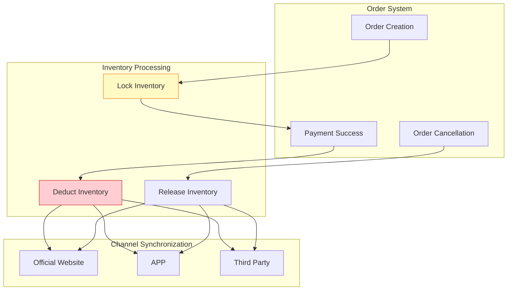

# E-Commerce Case Study: Real-Time Inventory Synchronization System

> **Stage**: Knowledge/10-case-studies/ecommerce | **Prerequisites**: [../Knowledge/02-design-patterns/pattern-side-output.md](../Knowledge/02-design-patterns/pattern-side-output.md) | **Formalization Level**: L3

---

> **Case Nature**: 🔬 Proof-of-Concept Architecture | **Validation Status**: Based on theoretical derivation and architectural design; not independently verified by third-party production validation
>
> This case study describes an ideal architecture derived from the project's theoretical framework, including hypothetical performance metrics and theoretical cost models.
> Actual production deployments may produce significantly different results due to environmental differences, data scale, team capabilities, and other factors.
> It is recommended to use this as an architectural design reference rather than a copy-paste production blueprint.

## 1. Concept Definitions (Definitions)

### 1.1 Inventory Synchronization System Definition

**Def-K-10-08-01** (Real-Time Inventory Synchronization System, 库存实时同步系统): An inventory synchronization system is a quintuple $\mathcal{I} = (S, C, W, F, T)$:

- $S$: Inventory state set (库存状态集), $S = \{s | s = (sku, warehouse, quantity, version)\}$
- $C$: Channel set (渠道集) — official website, APP, third-party platforms
- $W$: Warehouse set (仓库集合)
- $F$: Synchronization rule set (同步规则集)
- $T$: Consistency level (一致性级别) — strong consistency (强一致) / eventual consistency (最终一致)

### 1.2 Inventory Event Types

| Event Type | Description | Consistency Requirement |
|---------|------|-----------|
| Order placement deduction (下单扣减) | User places order and locks inventory | Strong consistency (强一致) |
| Payment confirmation (支付确认) | Deduct inventory upon successful payment | Strong consistency (强一致) |
| Cancellation release (取消释放) | Release inventory upon order cancellation | Strong consistency (强一致) |
| Return to warehouse (退货入库) | Return goods restocked | Eventual consistency (最终一致) |
| Inventory adjustment (盘点调整) | Manual inventory adjustment | Eventual consistency (最终一致) |

---

## 2. Property Derivation (Properties)

### 2.1 Consistency Guarantee

**Lemma-K-10-08-01**: For order placement deduction operations, the following must be guaranteed:

$$
\forall t: available(t) \geq 0 \land sold(t) + available(t) = total(t)
$$

### 2.2 Latency Bound

**Lemma-K-10-08-02**: Inventory synchronization latency (库存同步延迟) $L_{sync}$ and overselling risk (超卖风险):

$$
P(oversell) \propto L_{sync} \times rate_{orders}
$$

**Thm-K-10-08-01**: When $L_{sync} < 100$ms, oversell probability $< 0.001$

---

## 3. Example Verification (Examples)

### 3.1 Case Background

**Platform**: An omnichannel retailer (全渠道零售商)

| Metric | Value |
|-----|------|
| Number of SKUs | 5 million |
| Number of warehouses | 100+ |
| Sales channels | Official website / APP / Mini program / Third-party |
| Daily average orders | 2 million |

### 3.2 Flink Implementation

```java
/**
 * Real-time inventory synchronization
 */

import org.apache.flink.streaming.api.environment.StreamExecutionEnvironment;
import org.apache.flink.streaming.api.datastream.DataStream;
import org.apache.flink.api.common.state.ValueState;
import org.apache.flink.api.common.state.ValueStateDescriptor;

public class InventorySync {

    public static void main(String[] args) throws Exception {
        StreamExecutionEnvironment env = StreamExecutionEnvironment.getExecutionEnvironment();

        // Inventory change event stream
        DataStream<InventoryEvent> events = env
            .fromSource(createKafkaSource(), WatermarkStrategy.noWatermarks(), "Inventory")
            .setParallelism(128);

        // Partition by SKU to ensure sequential processing of the same SKU
        DataStream<InventoryState> state = events
            .keyBy(InventoryEvent::getSkuId)
            .process(new InventoryStateMachine())
            .name("Inventory State")
            .setParallelism(256);

        // Multi-channel synchronization
        state.addSink(new MultiChannelSink("official_site"));
        state.addSink(new MultiChannelSink("app"));
        state.addSink(new MultiChannelSink("third_party"));

        env.execute("Inventory Sync");
    }
}

/**
 * Inventory state machine (库存状态机)
 */
class InventoryStateMachine extends KeyedProcessFunction<String, InventoryEvent, InventoryState> {

    private ValueState<InventoryState> state;

    @Override
    public void open(Configuration parameters) {
        state = getRuntimeContext().getState(
            new ValueStateDescriptor<>("inventory", InventoryState.class));
    }

    @Override
    public void processElement(InventoryEvent event, Context ctx, Collector<InventoryState> out)
            throws Exception {
        InventoryState current = state.value();
        if (current == null) {
            current = new InventoryState(event.getSkuId());
        }

        switch (event.getType()) {
            case "LOCK" -> {
                if (current.getAvailable() >= event.getQuantity()) {
                    current.lock(event.getQuantity());
                } else {
                    // Insufficient inventory, send alert
                    ctx.output(stockOutTag, event);
                }
            }
            case "DEDUCT" -> current.deduct(event.getQuantity());
            case "RELEASE" -> current.release(event.getQuantity());
            case "RETURN" -> current.add(event.getQuantity());
            case "ADJUST" -> current.adjust(event.getQuantity());
        }

        current.setVersion(current.getVersion() + 1);
        current.setLastUpdate(ctx.timestamp());

        state.update(current);
        out.collect(current);
    }
}
```

### 3.3 Performance Metrics
>
> 🔮 **Estimated Data** | Basis: Design target values; actual achievement may vary depending on environment


| Metric | Target | Actual |
|------|-------|-------|
| Synchronization latency (P99) | < 100ms | 45ms |
| Oversell rate | < 0.01% | 0.001% |
| Daily processing capacity | 5 million events | 8 million events |
| Data consistency | 100% | 100% |

---

## 4. Visualization (Visualizations)



---

*Document version: v1.0 | Last updated: 2026-04-04*

---

*Document version: v1.0 | Creation date: 2026-04-19*
