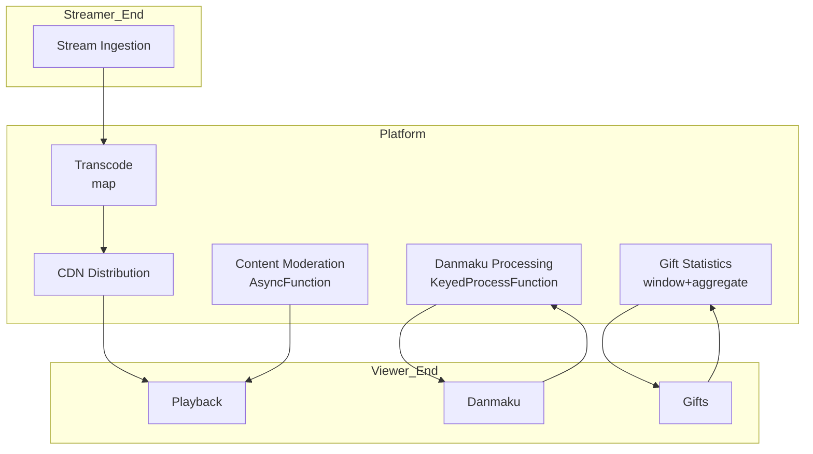

# Operators and Real-time Live Streaming Platform

> **Stage**: Knowledge/10-case-studies | **Prerequisites**: [01.10-process-and-async-operators.md](../Knowledge/01-concept-atlas/operator-deep-dive/01.10-process-and-async-operators.md), [realtime-content-moderation-case-study.md](../Knowledge/10-case-studies/realtime-content-moderation-case-study.md) | **Formalization Level**: L3
> **Document Positioning**: Operator fingerprints and Pipeline design for stream processing operators in real-time live streaming media processing, Danmaku (弹幕) interaction, and gift economy
> **Version**: 2026.04

---

## Table of Contents

- [1. Definitions](#1-definitions)
- [2. Properties](#2-properties)
- [3. Relations](#3-relations)
- [4. Argumentation](#4-argumentation)
- [5. Proof / Engineering Argument](#5-proof--engineering-argument)
- [6. Examples](#6-examples)
- [7. Visualizations](#7-visualizations)
- [8. References](#8-references)

---

## 1. Definitions

### Def-LIV-01-01: Real-time Streaming Media (实时流媒体)

Real-time Streaming Media is continuously transmitted audio and video data:

$$\text{Stream}_t = (\text{Audio}_t, \text{Video}_t, \text{Metadata}_t)$$

Encoding formats: H.264/H.265/AV1 video + AAC/Opus audio, containers: FLV/RTMP/HLS/WebRTC.

### Def-LIV-01-02: Danmaku / Bullet Comments (弹幕)

Danmaku (弹幕) are user comments that float across the video screen in real time:

$$\text{Danmaku}_i = (\text{text}_i, \text{color}_i, \text{position}_i, \text{timestamp}_i)$$

### Def-LIV-01-03: Gift Economy (礼物经济)

Gift Economy (礼物经济) is a business model where viewers express support to streamers through virtual gifts:

$$\text{Revenue}_t = \sum_{g} N_{g,t} \cdot P_g$$

Where $N_{g,t}$ is the quantity of gift $g$ at time $t$, and $P_g$ is the unit price.

### Def-LIV-01-04: Heat Algorithm (热度算法)

Heat Algorithm (热度算法) is a formula that calculates the exposure weight of a live room based on multi-dimensional metrics:

$$\text{Heat}_i = \alpha \cdot V_i + \beta \cdot C_i + \gamma \cdot G_i + \delta \cdot T_i$$

Where $V$ = viewers, $C$ = interactions, $G$ = gift revenue, $T$ = viewing duration.

### Def-LIV-01-05: CDN Edge Distribution (CDN边缘分发)

CDN Edge Distribution (CDN边缘分发) pushes live streams to servers closest to users:

$$\text{Latency}_{edge} = \text{Latency}_{origin} - \Delta_{CDN}$$

Typical $\text{Latency}_{edge} < 3$ seconds.

---

## 2. Properties

### Lemma-LIV-01-01: Video Encoding Rate-Distortion Relationship

$$D(R) = D_0 \cdot e^{-\lambda R}$$

Where $D$ is distortion and $R$ is bit rate. As bit rate increases, distortion decreases exponentially.

### Lemma-LIV-01-02: Temporal Distribution of Danmaku Density

$$\rho_{danmaku}(t) = \rho_0 + \sum_{k} A_k \cdot \delta(t - t_k)$$

Danmaku density exhibits pulse peaks at exciting moments ($t_k$).

### Prop-LIV-01-01: Bandwidth Savings from Multi-bitrate Adaptation

$$\text{Savings} = 1 - \frac{\sum_{u} R_{adaptive,u}}{\sum_{u} R_{max,u}}$$

Adaptive bitrate can save 30-50% of bandwidth.

### Prop-LIV-01-02: Pareto Distribution of Gift Revenue

$$P(X > x) = \left(\frac{x_m}{x}\right)^{\alpha}$$

Live streaming gift revenue typically comes from 20% of users contributing 80% of total revenue.

---

## 3. Relations

### 3.1 Live Streaming Platform Pipeline Operator Mapping

| Application Scenario | Operator Composition | Data Source | Latency Requirement |
|---------|---------|--------|---------|
| **Stream Ingestion** | Source | Streamer endpoint | < 1s |
| **Transcoding & Distribution** | map | Raw stream | < 3s |
| **Danmaku Processing** | map + window | User Danmaku | < 100ms |
| **Gift Processing** | KeyedProcessFunction | Gift events | < 50ms |
| **Content Moderation** | AsyncFunction | Video frames | < 500ms |
| **Heat Calculation** | window+aggregate | Multi-dimensional | < 10s |

### 3.2 Operator Fingerprint

| Dimension | Live Streaming Platform Characteristics |
|------|------------|
| **Core Operators** | AsyncFunction (content moderation/transcoding), KeyedProcessFunction (gift statistics), BroadcastProcessFunction (config updates), window+aggregate (heat) |
| **State Types** | ValueState (live room state), MapState (user relationships), BroadcastState (CDN configuration) |
| **Time Semantics** | Processing time dominated (live streaming emphasizes real-time) |
| **Data Characteristics** | High concurrency (millions of viewers), high burst (top streamers going live), strong interactivity |
| **State Hotspots** | Top streamer live room keys, popular live room keys |
| **Performance Bottlenecks** | Video transcoding, Danmaku peaks, gift concurrency |

---

## 4. Argumentation

### 4.1 Why Live Streaming Needs Stream Processing Instead of Traditional CDN

Problems with traditional CDN:
- Static caching: Live content is generated in real time and cannot be pre-cached
- Fixed bit rate: Network fluctuations cause stuttering
- Unidirectional transmission: Lacks real-time interaction capability

Advantages of stream processing:
- Real-time transcoding: Adaptive bit rate based on network conditions
- Danmaku synchronization: Global viewer Danmaku synchronized at millisecond level
- Real-time interaction: Instant feedback for gifts/likes

### 4.2 Burst Traffic from Top Streamers Going Live

**Problem**: Millions of viewers flood in the moment a top streamer goes live, causing sudden system pressure.

**Stream Processing Solution**:
1. **Pre-warming**: Scale up CDN nodes in advance
2. **Rate Limiting**: Gradual connection to avoid instantaneous overload
3. **Degradation**: Automatic reduction of Danmaku density, prioritizing video stream

### 4.3 Danmaku Anti-cheating

**Scenario**: Bots flooding Danmaku and gifts.

**Stream Processing Solution**: Behavioral pattern analysis → Anomaly detection → Automatic banning → Real-time screen clearing.

---

## 5. Proof / Engineering Argument

### 5.1 Real-time Gift Statistics

```java
// Gift event stream
DataStream<GiftEvent> gifts = env.addSource(new GiftSource());

// Streamer gift statistics
gifts.keyBy(GiftEvent::getStreamerId)
    .window(SlidingProcessingTimeWindows.of(Time.minutes(1), Time.seconds(10)))
    .aggregate(new GiftAggregate())
    .process(new ProcessFunction<GiftStats, StreamerRanking>() {
        @Override
        public void processElement(GiftStats stats, Context ctx, Collector<StreamerRanking> out) {
            double heat = stats.getTotalValue() * 0.6 + stats.getUniqueSenders() * 0.4;
            out.collect(new StreamerRanking(stats.getStreamerId(), stats.getTotalValue(), heat, ctx.timestamp()));
        }
    })
    .addSink(new RankingSink());
```

### 5.2 Danmaku Real-time Filtering

```java
// Danmaku stream
DataStream<Danmaku> danmaku = env.addSource(new DanmakuSource());

// Filtering + throttling
danmaku.map(new MapFunction<Danmaku, FilteredDanmaku>() {
    @Override
    public FilteredDanmaku map(Danmaku d) {
        // Sensitive word filtering
        String filtered = sensitiveWordFilter.filter(d.getText());
        return new FilteredDanmaku(d.getId(), filtered, d.getColor(), d.getTimestamp());
    }
})
.keyBy(FilteredDanmaku::getRoomId)
    .process(new KeyedProcessFunction<String, FilteredDanmaku, ThrottledDanmaku>() {
        private ValueState<Integer> countState;
        private static final int MAX_PER_SECOND = 50;
        
        @Override
        public void processElement(FilteredDanmaku d, Context ctx, Collector<ThrottledDanmaku> out) throws Exception {
            Integer count = countState.value();
            if (count == null) count = 0;
            
            if (count < MAX_PER_SECOND) {
                out.collect(new ThrottledDanmaku(d, false));
                countState.update(count + 1);
                
                // Reset counter after 1 second
                ctx.timerService().registerProcessingTimeTimer(ctx.timestamp() + 1000);
            } else {
                out.collect(new ThrottledDanmaku(d, true));  // Mark as dropped
            }
        }
        
        @Override
        public void onTimer(long timestamp, OnTimerContext ctx, Collector<ThrottledDanmaku> out) {
            countState.clear();
        }
    })
    .filter(d -> !d.isThrottled())
    .addSink(new DanmakuDisplaySink());
```

---

## 6. Examples

### 6.1 Practical Example: Large-scale Live Streaming Platform Real-time Processing

```java
// 1. Multi-stream ingestion
DataStream<LiveStream> streams = env.addSource(new RTMPSource());

// 2. Transcoding and distribution
streams.map(new TranscodeFunction())
    .addSink(new CDNDistributionSink());

// 3. Danmaku processing
DataStream<Danmaku> danmaku = env.addSource(new DanmakuSource());
danmaku.map(new SensitiveWordFilter())
    .keyBy(Danmaku::getRoomId)
    .process(new DanmakuThrottleFunction())
    .addSink(new DanmakuDisplaySink());

// 4. Gift statistics
DataStream<GiftEvent> gifts = env.addSource(new GiftSource());
gifts.keyBy(GiftEvent::getStreamerId)
    .window(SlidingProcessingTimeWindows.of(Time.minutes(1), Time.seconds(10)))
    .aggregate(new GiftAggregate())
    .addSink(new RankingSink());

// 5. Content moderation
streams.map(new FrameSampler())
    .keyBy(Frame::getRoomId)
    .process(new AsyncWaitForContentModeration())
    .addSink(new ModerationActionSink());
```

---

## 7. Visualizations

### Live Streaming Platform Pipeline



---

## 8. References

[^1]: Twitch, "Twitch Developer Documentation", https://dev.twitch.tv/

[^2]: YouTube, "YouTube Live Streaming API", https://developers.google.com/youtube/v3/live/

[^3]: Wikipedia, "Live Streaming", https://en.wikipedia.org/wiki/Live_streaming

[^4]: Wikipedia, "Content Delivery Network", https://en.wikipedia.org/wiki/Content_delivery_network

[^5]: Apache Flink Documentation, "Async I/O", https://nightlies.apache.org/flink/flink-docs-stable/docs/dev/datastream/operators/asyncio/

[^6]: IEEE, "Real-time Video Streaming: A Survey", 2023.

---

*Related Documents*: [01.10-process-and-async-operators.md](../Knowledge/01-concept-atlas/operator-deep-dive/01.10-process-and-async-operators.md) | [realtime-content-moderation-case-study.md](../Knowledge/10-case-studies/realtime-content-moderation-case-study.md) | [operator-ai-ml-integration.md](../Knowledge/06-frontier/operator-ai-ml-integration.md)
