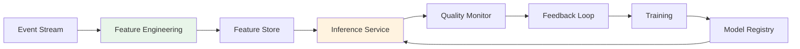

# Real-Time ML Pipeline Mapping

> **Stage**: Knowledge/05-mapping-guides | **Prerequisites**: [Flink ML Architecture](flink-ml-architecture.md) | **Formalization Level**: L3-L4
> **Translation Date**: 2026-04-21

## Abstract

This document formalizes the real-time ML pipeline architecture, covering feature engineering, training, model management, inference, quality monitoring, and feedback loops.

---

## 1. Definitions

### Def-K-05-60-01 (Real-Time ML Pipeline)

A **real-time ML pipeline** $\mathcal{P}_{ML}$ is a 6-tuple:

$$\mathcal{P}_{ML} = \langle \mathcal{F}, \mathcal{T}, \mathcal{M}, \mathcal{I}, \mathcal{Q}, \mathcal{R} \rangle$$

where:

- $\mathcal{F}$: feature engineering (raw events → feature vectors)
- $\mathcal{T}$: training (learn parameters $\theta$ from $(\mathbf{x}, y)$)
- $\mathcal{M}$: model management (versions, metadata, lineage)
- $\mathcal{I}$: inference ($\hat{y}_t = f_\theta(\mathbf{x}_t)$)
- $\mathcal{Q}$: quality monitoring (accuracy, latency, drift)
- $\mathcal{R}$: feedback loop (results → training)

**Latency constraint**: $L_{e2e} = t_{inference} - t_{event} \leq \tau_{SLA}$

### Def-K-05-60-02 (Feature Store Consistency)

Feature store $\mathcal{S}_f$ consistency model $\mathcal{C}_f = \langle \mathcal{W}, \mathcal{R}, \delta \rangle$:

- $\mathcal{W}$: write path (streaming + batch)
- $\mathcal{R}$: read path (low-latency store)
- $\delta = |t_{write} - t_{read}|$: feature freshness

**Variants**:

- **Point-in-Time**: $\delta \to 0$
- **Eventual Freshness**: $\delta \leq \Delta_{max}$
- **Training-Serving Skew**: $\delta_{TS} = |\mathbf{x}_{train} - \mathbf{x}_{serve}|$

---

## 2. Properties

### Lemma-K-05-60-01 (Freshness-Performance Decay)

Model performance decays with feature staleness:

$$P(t) = P_0 \cdot e^{-\lambda \delta}$$

where $\lambda$ is the decay rate.

---

## 3. Architecture

---

## 4. References
