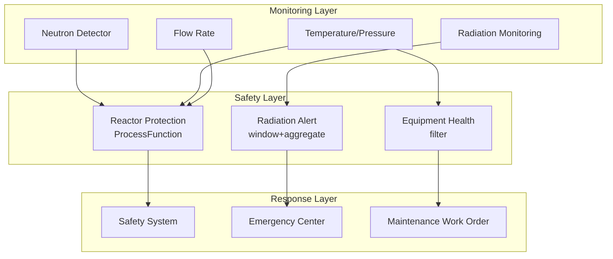

# Operators and Real-time Nuclear Power Monitoring

> **Stage**: Knowledge/10-case-studies | **Prerequisites**: [01.10-process-and-async-operators.md](01.10-process-and-async-operators.md), [realtime-hydropower-monitoring-case-study.md](realtime-hydropower-monitoring-case-study.md) | **Formalization Level**: L3
> **Document Scope**: Operator fingerprint and Pipeline design for streaming operators in real-time nuclear power plant (核电站) operation monitoring, radiation monitoring, and safety system response
> **Version**: 2026.04

---

## Table of Contents

- [1. Definitions](#1-definitions)
- [2. Properties](#2-properties)
- [3. Relations](#3-relations)
- [4. Argumentation](#4-argumentation)
- [5. Proof / Engineering Argument](#5-proof--engineering-argument)
- [6. Examples](#6-examples)
- [7. Visualizations](#7-visualizations)
- [8. References](#8-references)

---

## 1. Definitions

### Def-NUC-01-01: Nuclear Safety System (核电站安全系统)

A Nuclear Safety System (核电站安全系统) is a multi-layered defense system ensuring the safe operation of a nuclear reactor:

$$\text{SafetySystem} = (\text{Prevention}, \text{Detection}, \text{Protection}, \text{Mitigation})$$

### Def-NUC-01-02: Reactivity (反应性)

Reactivity (反应性) is a physical quantity characterizing the degree to which a reactor deviates from the critical state:

$$\rho = \frac{k_{eff} - 1}{k_{eff}}$$

where $k_{eff}$ is the effective multiplication factor. $\rho > 0$ indicates supercritical, $\rho < 0$ indicates subcritical, and $\rho = 0$ indicates critical.

### Def-NUC-01-03: Radiation Dose Rate (辐射剂量率)

Radiation Dose Rate (辐射剂量率) is the radiation dose received per unit time:

$$\dot{D} = \frac{dD}{dt}$$

Unit: Sv/h (Sieverts per hour). Public limit: 1 mSv/year, worker limit: 20 mSv/year.

### Def-NUC-01-04: Containment Integrity (安全壳完整性)

Containment Integrity (安全壳完整性) is the final barrier preventing the release of radioactive materials:

$$I_{containment} = P_{design} - P_{actual} > 0 \land \text{LeakRate} < \text{Limit}$$

### Def-NUC-01-05: Redundancy and Diversity (冗余与多样性)

Safety systems employ Redundancy and Diversity (冗余与多样性) design to ensure reliability:

$$R_{system} = 1 - \prod_{i}(1 - R_i)$$

For a quadruple redundant system ($R_i = 0.99$), the overall reliability is $R_{system} = 1 - 10^{-8}$.

---

## 2. Properties

### Lemma-NUC-01-01: Point Kinetics Neutron Equation

$$\frac{dn}{dt} = \frac{\rho - \beta}{\Lambda} n + \sum_{i} \lambda_i C_i$$

where $n$ is the neutron density, $\beta$ is the delayed neutron fraction, $\Lambda$ is the neutron generation time, and $C_i$ is the concentration of the $i$-th group of delayed neutron precursors.

### Lemma-NUC-01-02: Decay Heat Power

Decay heat power after shutdown:

$$P_{decay}(t) = 0.066 \cdot P_0 \cdot \left(\frac{t}{t_0}\right)^{-0.2}$$

where $P_0$ is the rated power and $t$ is the shutdown time (seconds).

### Prop-NUC-01-01: Safety System Response Time

| Safety Function | Detection Time | Execution Time | Total Response Time |
|-----------------|----------------|----------------|---------------------|
| Emergency Shutdown (SCRAM) | 10ms | 100ms | < 1s |
| Safety Injection | 100ms | 5s | < 10s |
| Containment Spray | 1s | 30s | < 1min |
| Emergency Core Cooling | 1s | 10s | < 30s |

### Prop-NUC-01-02: Single Failure Criterion

$$P_{failure} < 10^{-3}/\text{demand}$$

No single equipment failure shall result in the loss of a safety function.

---

## 3. Relations

### 3.1 Nuclear Power Monitoring Pipeline Operator Mapping

| Application Scenario | Operator Composition | Data Source | Latency Requirement |
|----------------------|----------------------|-------------|---------------------|
| **Neutron Flux Monitoring** | Source + map | Neutron Detector | < 10ms |
| **Radiation Monitoring** | window + aggregate | Radiation Detector | < 1s |
| **Safety System Trigger** | ProcessFunction + Timer | Protection Parameters | < 100ms |
| **Equipment Health** | AsyncFunction | Vibration/Temperature | < 1min |
| **Personnel Dosimetry** | KeyedProcessFunction | Personal Dosimeter | < 1min |
| **Emergency Command** | Broadcast + ProcessFunction | Emergency Instructions | < 5s |

### 3.2 Operator Fingerprint

| Dimension | Nuclear Power Monitoring Characteristics |
|-----------|------------------------------------------|
| **Core Operators** | ProcessFunction (safety protection logic), AsyncFunction (equipment diagnosis), BroadcastProcessFunction (emergency instructions), KeyedProcessFunction (personnel tracking) |
| **State Types** | ValueState (reactor state), MapState (equipment health), BroadcastState (protection setpoints) |
| **Time Semantics** | Processing Time (millisecond-level response for safety systems) |
| **Data Characteristics** | Extremely high reliability requirements, strong regulation, data sensitivity |
| **State Hotspots** | Reactor Key, Safety System Key |
| **Performance Bottlenecks** | Safety logic verification, external regulatory reporting |

---

## 4. Argumentation

### 4.1 Why Nuclear Power Needs Stream Processing Instead of Traditional DCS

Problems with Traditional DCS (Distributed Control System, 分布式控制系统):
- Fixed scan cycle: typically 100ms–1s, unable to capture transients
- Hard-wired logic: difficult to change, poor flexibility
- Data silos: each system operates independently, making comprehensive analysis difficult

Advantages of Stream Processing:
- Millisecond-level response: meets safety system response time requirements
- Software-based logic: protection algorithms can be rapidly iterated and verified
- Unified analysis: multi-system data fusion and real-time analysis

### 4.2 Cybersecurity and Physical Isolation

**Problem**: Nuclear facilities have extremely high cybersecurity requirements; how should stream processing systems be deployed?

**Solution**:
1. **Physical Isolation**: Safety-grade networks and non-safety-grade networks are physically isolated
2. **Unidirectional Transfer**: Data is only allowed to flow unidirectionally from safety-grade to non-safety-grade networks
3. **Independent Verification**: All algorithms are verified on an independent validation platform before deployment

### 4.3 Transient Condition Identification

**Scenario**: The initial signs of a Loss of Coolant Accident (LOCA, 冷却剂丧失事故) are not obvious.

**Stream Processing Solution**: Multi-parameter joint monitoring (pressure + flow + temperature) → CEP pattern recognition → automatic protection triggering.

---

## 5. Proof / Engineering Argument

### 5.1 Safety Protection System

```java
public class ReactorProtectionSystem extends KeyedProcessFunction<String, ProcessParameter, SafetyAction> {
    private ValueState<ReactorState> reactorState;
    
    @Override
    public void processElement(ProcessParameter param, Context ctx, Collector<SafetyAction> out) throws Exception {
        ReactorState state = reactorState.value();
        if (state == null) state = new ReactorState();
        
        state.update(param);
        
        // Emergency shutdown signal (reactor trip)
        if (param.getNeutronFlux() > 1.2 * state.getNominalFlux() ||  // High neutron flux
            param.getPressurizerPressure() < 12.0 ||                   // Low pressure
            param.getCoreDeltaT() > 50.0) {                           // High delta T
            out.collect(new SafetyAction("SCRAM", "HIGH_NEUTRON_FLUX", ctx.timestamp()));
        }
        
        // Safety injection signal
        if (param.getPressurizerPressure() < 11.0 && 
            param.getCoreCoolantFlow() < 0.8 * state.getNominalFlow()) {
            out.collect(new SafetyAction("SAFETY_INJECTION", "LOCA", ctx.timestamp()));
        }
        
        // Containment isolation
        if (param.getContainmentPressure() > 0.3) {
            out.collect(new SafetyAction("CONTAINMENT_ISOLATION", "HIGH_PRESSURE", ctx.timestamp()));
        }
        
        reactorState.update(state);
    }
}
```

### 5.2 Real-time Radiation Monitoring

```java
// Radiation detector data
DataStream<RadiationReading> radiation = env.addSource(new RadiationMonitorSource());

// Regional dose rate monitoring
radiation.keyBy(RadiationReading::getZoneId)
    .window(SlidingProcessingTimeWindows.of(Time.minutes(1), Time.seconds(10)))
    .aggregate(new DoseRateAggregate())
    .process(new ProcessFunction<DoseRate, RadiationAlert>() {
        @Override
        public void processElement(DoseRate rate, Context ctx, Collector<RadiationAlert> out) {
            double doseRate = rate.getDoseRate();  // mSv/h
            
            if (doseRate > 100) {
                out.collect(new RadiationAlert(rate.getZoneId(), "CRITICAL", doseRate, ctx.timestamp()));
            } else if (doseRate > 10) {
                out.collect(new RadiationAlert(rate.getZoneId(), "HIGH", doseRate, ctx.timestamp()));
            } else if (doseRate > 2.5) {
                out.collect(new RadiationAlert(rate.getZoneId(), "ELEVATED", doseRate, ctx.timestamp()));
            }
        }
    })
    .addSink(new RadiationDashboardSink());
```

---

## 6. Examples

### 6.1 Practical Example: Integrated Nuclear Power Monitoring System

```java
// 1. Multi-parameter ingestion
DataStream<ProcessParameter> process = env.addSource(new NuclearPlantSource());
DataStream<RadiationReading> radiation = env.addSource(new RadiationMonitorSource());

// 2. Safety protection
process.keyBy(ProcessParameter::getSystemId)
    .process(new ReactorProtectionSystem())
    .addSink(new SafetyActionSink());

// 3. Radiation monitoring
radiation.keyBy(RadiationReading::getZoneId)
    .window(SlidingProcessingTimeWindows.of(Time.minutes(1), Time.seconds(10)))
    .aggregate(new DoseRateAggregate())
    .addSink(new RadiationDashboardSink());

// 4. Equipment health
DataStream<EquipmentHealth> health = env.addSource(new EquipmentSource());
health.filter(h -> h.getHealthIndex() < 0.7)
    .addSink(new MaintenanceAlertSink());
```

---

## 7. Visualizations

### Nuclear Power Monitoring Pipeline

The following diagram illustrates the three-layer architecture of a nuclear power monitoring pipeline: monitoring layer, safety layer, and response layer.



---

## 8. References

[^1]: IAEA, "Nuclear Safety Standards", https://www.iaea.org/

[^2]: NRC, "Reactor Safety Study (WASH-1400)", https://www.nrc.gov/

[^3]: Wikipedia, "Nuclear Reactor Safety Systems", https://en.wikipedia.org/wiki/Nuclear_reactor_safety_system

[^4]: Wikipedia, "Containment Building", https://en.wikipedia.org/wiki/Containment_building

[^5]: Apache Flink Documentation, "ProcessFunction", https://nightlies.apache.org/flink/flink-docs-stable/docs/dev/datastream/operators/process_function/

[^6]: IEEE, "Digital Instrumentation and Control Systems in Nuclear Power Plants", 2023.

---

*Related Documents*: [01.10-process-and-async-operators.md](01.10-process-and-async-operators.md) | [realtime-hydropower-monitoring-case-study.md](realtime-hydropower-monitoring-case-study.md) | [operator-chaos-engineering-and-resilience.md](operator-chaos-engineering-and-resilience.md)
