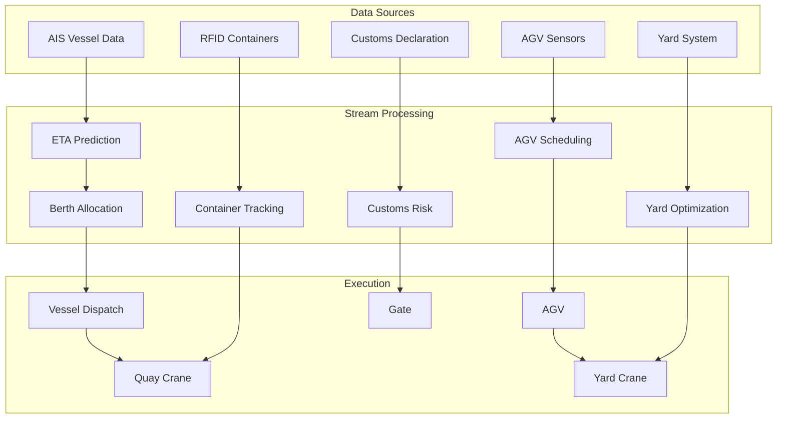

# Operators and Real-Time Port Logistics

> **Stage**: Knowledge/10-case-studies | **Prerequisites**: [01.07-two-input-operators.md](../Knowledge/01-concept-atlas/operator-deep-dive/01.07-two-input-operators.md), [realtime-supply-chain-tracking-case-study.md](../Knowledge/10-case-studies/realtime-supply-chain-tracking-case-study.md) | **Formalization Level**: L3
> **Document Scope**: Operator fingerprints and Pipeline design for streaming operators in real-time port container dispatching, AGV (自动导引车, Automated Guided Vehicle) path optimization, and vessel arrival prediction
> **Version**: 2026.04

---

## Table of Contents

- [1. Definitions](#1-definitions)
- [2. Properties](#2-properties)
- [3. Relations](#3-relations)
- [4. Argumentation](#4-argumentation)
- [5. Proof / Engineering Argument](#5-proof--engineering-argument)
- [6. Examples](#6-examples)
- [7. Visualizations](#7-visualizations)
- [8. References](#8-references)

---

## 1. Definitions

### Def-PRT-01-01: Port Logistics Digital Twin (港口物流数字孪生)

Port Logistics Digital Twin is a real-time virtual mapping of port physical operations:

$$\text{PortTwin}(t) = (\text{Vessels}_t, \text{Containers}_t, \text{AGVs}_t, \text{Cranes}_t, \text{Yard}_t)$$

### Def-PRT-01-02: Estimated Time of Arrival — ETA (船舶到港时间)

ETA is the predicted arrival time based on vessel speed, route, and meteorological conditions:

$$\text{ETA} = t_{current} + \frac{D_{remaining}}{v_{avg}} + \sum_{i} \Delta t_{delay,i}$$

where $D_{remaining}$ is the remaining voyage distance, $v_{avg}$ is the average sailing speed, and $\Delta t_{delay,i}$ is the $i$-th delay factor (e.g., port congestion, weather).

### Def-PRT-01-03: Yard Optimization (集装箱堆场优化)

Yard Optimization is the decision-making process to maximize space utilization while minimizing relocation (翻箱) operations:

$$\min \sum_{c} \text{Relocations}(c) \quad \text{s.t.} \quad \text{SpaceUtilization} < 0.85$$

### Def-PRT-01-04: AGV Scheduling (AGV调度)

AGV Scheduling is the optimization problem of assigning tasks and paths to Automated Guided Vehicles:

$$\min \sum_{v} \left(\alpha \cdot T_{travel,v} + \beta \cdot T_{wait,v} + \gamma \cdot T_{charging,v}\right)$$

### Def-PRT-01-05: Customs Risk Score (海关风险评分)

Customs Risk Score evaluates the inspection probability based on cargo characteristics:

$$\text{Risk} = w_1 \cdot f_{origin} + w_2 \cdot f_{commodity} + w_3 \cdot f_{shipper} + w_4 \cdot f_{history}$$

---

## 2. Properties

### Lemma-PRT-01-01: Queuing Theory Model for Port Throughput

Port throughput capacity follows the M/M/c queuing model:

$$\rho = \frac{\lambda}{c \cdot \mu}$$

where $\lambda$ is the vessel arrival rate, $\mu$ is the single-berth service rate, and $c$ is the number of berths. When $\rho \to 1$, vessel waiting time approaches infinity.

### Lemma-PRT-01-02: Graph-Theoretic Decision for AGV Path Conflicts

AGV path conflicts can be modeled as a graph coloring problem:

$$\chi(G) \leq \Delta(G) + 1$$

where $\chi(G)$ is the chromatic number of conflict graph $G$, and $\Delta(G)$ is the maximum degree. Conflict avoidance is equivalent to assigning different time slots to AGVs traversing the same segment simultaneously.

### Prop-PRT-01-01: Relationship Between Yard Relocation Rate and Stacking Height

$$\text{RelocationRate} = 1 - \frac{1}{H_{avg}}$$

where $H_{avg}$ is the average stacking height. Higher stacks lead to higher relocation rates.

### Prop-PRT-01-02: Berth Utilization Improvement from Pre-Arrival Information

$$\Delta \eta = \eta_{withETA} - \eta_{withoutETA} \approx 15\text{-}25\%$$

---

## 3. Relations

### 3.1 Port Logistics Pipeline Operator Mapping

| Application Scenario | Operator Combination | Data Source | Latency Requirement |
|---------------------|----------------------|-------------|---------------------|
| **Vessel Arrival Prediction** | AsyncFunction + map | AIS/Weather | < 15min |
| **Container Tracking** | KeyedProcessFunction | RFID/GPS | < 1min |
| **AGV Scheduling** | Broadcast + ProcessFunction | Task Queue | < 5s |
| **Yard Optimization** | window+aggregate | Yard Status | < 10min |
| **Customs Risk** | Async ML | Declaration Data | < 30s |
| **Equipment Monitoring** | ProcessFunction + Timer | Sensors | < 1min |

### 3.2 Operator Fingerprint

| Dimension | Port Logistics Characteristics |
|-----------|-------------------------------|
| **Core Operators** | BroadcastProcessFunction (AGV Scheduling), KeyedProcessFunction (Container State Machine), AsyncFunction (ETA/Risk Model), window+aggregate (Yard Statistics) |
| **State Types** | ValueState (Container Location), MapState (AGV Status), BroadcastState (Scheduling Policy) |
| **Time Semantics** | Primarily Processing Time (scheduling real-time requirements) |
| **Data Characteristics** | Spatially dense (location data), temporally correlated (vessel arrivals), multi-source heterogeneous |
| **State Hotspots** | Popular yard zone keys, active AGV keys |
| **Performance Bottlenecks** | AGV conflict resolution, external ETA API |

---

## 4. Argumentation

### 4.1 Why Port Logistics Needs Stream Processing Instead of Traditional Scheduling

Problems with traditional scheduling:

- **Static plans**: Unable to handle vessels arriving late or early
- **Manual dispatching**: Low efficiency, error-prone
- **Information lag**: Container location updates are not timely

Advantages of stream processing:

- **Real-time tracking**: Container locations updated at second-level granularity
- **Dynamic dispatching**: Adjust AGV tasks based on real-time conditions
- **Predictive optimization**: ETA predictions enable advance berth arrangement

### 4.2 AGV Conflict Avoidance

**Problem**: Multiple AGVs request the same passage at the same time.

**Solution**:

1. **Time-slot allocation**: Assign passages to different AGVs by time slots
2. **Priority**: Emergency tasks (reefer containers 冷藏箱) take precedence
3. **Path replanning**: Automatic rerouting when conflicts are detected

### 4.3 Cold Chain (冷链) Container Monitoring

**Scenario**: Refrigerated container temperature must remain below -18°C.

**Stream Processing Solution**: Real-time temperature monitoring → anomaly alerting → automatic maintenance notification → backup container dispatching.

---

## 5. Proof / Engineering Argument

### 5.1 Real-Time AGV Scheduling System

```java
public class AGVScheduler extends BroadcastProcessFunction<TaskRequest, SchedulePolicy, AGVAssignment> {
    private MapState<String, AGVState> agvFleet;

    @Override
    public void processElement(TaskRequest task, ReadOnlyContext ctx, Collector<AGVAssignment> out) throws Exception {
        // Retrieve current scheduling policy
        ReadOnlyBroadcastState<String, SchedulePolicy> policyState = ctx.getBroadcastState(POLICY_DESCRIPTOR);
        SchedulePolicy policy = policyState.get("default");

        // Find the best AGV
        String bestAGV = null;
        double bestScore = Double.NEGATIVE_INFINITY;

        for (Map.Entry<String, AGVState> entry : agvFleet.entries()) {
            AGVState agv = entry.getValue();
            if (!agv.isAvailable()) continue;

            double score = policy.calculateScore(agv, task);
            if (score > bestScore) {
                bestScore = score;
                bestAGV = entry.getKey();
            }
        }

        if (bestAGV != null) {
            AGVState assigned = agvFleet.get(bestAGV);
            assigned.assignTask(task);
            agvFleet.put(bestAGV, assigned);

            out.collect(new AGVAssignment(bestAGV, task.getId(), task.getDestination(), ctx.timestamp()));
        }
    }

    @Override
    public void processBroadcastElement(SchedulePolicy policy, Context ctx, Collector<AGVAssignment> out) {
        ctx.getBroadcastState(POLICY_DESCRIPTOR).put("default", policy);
    }
}
```

### 5.2 Container State Tracking

```java
// Container event stream
DataStream<ContainerEvent> containers = env.addSource(new ContainerRFIDSource());

// Real-time location tracking
containers.keyBy(ContainerEvent::getContainerId)
    .process(new KeyedProcessFunction<String, ContainerEvent, ContainerLocation>() {
        private ValueState<ContainerLocation> locationState;

        @Override
        public void processElement(ContainerEvent event, Context ctx, Collector<ContainerLocation> out) throws Exception {
            ContainerLocation loc = locationState.value();
            if (loc == null) loc = new ContainerLocation(event.getContainerId());

            loc.update(event.getLocation(), event.getTimestamp());
            locationState.update(loc);

            // Check for abnormal dwell time
            if (loc.getDwellTime() > 3600000) {  // Exceeds 1 hour
                out.collect(loc.withAlert("LONG_DWELL"));
            } else {
                out.collect(loc);
            }
        }
    })
    .addSink(new ContainerTrackingSink());
```

### 5.3 Vessel Arrival Prediction

```java
// AIS data stream
DataStream<AISMessage> ais = env.addSource(new AISSource());

// ETA calculation
ais.keyBy(AISMessage::getMmsi)
    .process(new KeyedProcessFunction<String, AISMessage, ETAPrediction>() {
        private ValueState<VesselTrack> trackState;

        @Override
        public void processElement(AISMessage msg, Context ctx, Collector<ETAPrediction> out) throws Exception {
            VesselTrack track = trackState.value();
            if (track == null) track = new VesselTrack(msg.getMmsi());

            track.updatePosition(msg.getLat(), msg.getLon(), msg.getSpeed(), msg.getTimestamp());

            // Calculate ETA
            double distanceToPort = calculateDistance(track.getLastPosition(), PORT_LOCATION);
            double avgSpeed = track.getAverageSpeed(3600000);  // Average over last 1 hour

            if (avgSpeed > 0) {
                long etaMillis = (long)(distanceToPort / avgSpeed * 3600000);
                Date eta = new Date(ctx.timestamp() + etaMillis);
                out.collect(new ETAPrediction(msg.getMmsi(), eta, distanceToPort, ctx.timestamp()));
            }

            trackState.update(track);
        }
    })
    .addSink(new PortScheduleSink());
```

---

## 6. Examples

### 6.1 Practice: Intelligent Port Real-Time Dispatching

```java
// 1. Vessel arrival prediction
DataStream<ETAPrediction> etas = env.addSource(new AISSource())
    .keyBy(AISMessage::getMmsi)
    .process(new ETACalculationFunction());

// 2. Berth allocation
etas.keyBy(ETAPrediction::getMmsi)
    .connect(berthAvailabilityBroadcast)
    .process(new BerthAllocationFunction())
    .addSink(new BerthScheduleSink());

// 3. Container tracking
DataStream<ContainerEvent> containerEvents = env.addSource(new RFIDSource());
containerEvents.keyBy(ContainerEvent::getContainerId)
    .process(new ContainerTrackingFunction())
    .addSink(new YardManagementSink());

// 4. AGV scheduling
DataStream<TaskRequest> tasks = env.addSource(new TaskQueueSource());
tasks.connect(agvStatusBroadcast)
    .process(new AGVScheduler())
    .addSink(new AGVCommandSink());
```

### 6.2 Practice: Cold Chain Container Monitoring

```java
// Reefer container temperature sensors
DataStream<TemperatureReading> temps = env.addSource(new ReeferSensorSource());

// Anomaly detection
temps.keyBy(TemperatureReading::getContainerId)
    .process(new KeyedProcessFunction<String, TemperatureReading, TemperatureAlert>() {
        private ValueState<TemperatureStats> stats;

        @Override
        public void processElement(TemperatureReading reading, Context ctx, Collector<TemperatureAlert> out) throws Exception {
            TemperatureStats s = stats.value();
            if (s == null) s = new TemperatureStats();

            s.update(reading.getTemperature());

            // High temperature alert
            if (reading.getTemperature() > reading.getMaxAllowed()) {
                out.collect(new TemperatureAlert(reading.getContainerId(), "HIGH_TEMP", reading.getTemperature(), ctx.timestamp()));
            }

            // Trend alert: continuous rise
            if (s.isRising(5) && reading.getTemperature() > reading.getMaxAllowed() - 2) {
                out.collect(new TemperatureAlert(reading.getContainerId(), "RISING_TREND", reading.getTemperature(), ctx.timestamp()));
            }

            stats.update(s);
        }
    })
    .addSink(new MaintenanceAlertSink());
```

---

## 7. Visualizations

### Port Logistics Pipeline

The following diagram illustrates the end-to-end streaming pipeline for real-time port logistics, covering data ingestion, stream processing, and physical execution layers.



---

## 8. References

[^1]: Apache Flink Documentation, "State Backends", 2025. https://nightlies.apache.org/flink/flink-docs-stable/docs/ops/state/state_backends/
[^2]: T. Akidau et al., "The Dataflow Model", PVLDB, 8(12), 2015.
[^3]: D. P. Bertsekas, "Dynamic Programming and Optimal Control", Athena Scientific, 2017.
[^4]: International Maritime Organization, "Guidelines on Maritime Cyber Risk Management", 2021.

---

*Related Documents*: [01.07-two-input-operators.md](../Knowledge/01-concept-atlas/operator-deep-dive/01.07-two-input-operators.md) | [realtime-supply-chain-tracking-case-study.md](../Knowledge/10-case-studies/realtime-supply-chain-tracking-case-study.md) | [realtime-digital-twin-case-study.md](../Knowledge/10-case-studies/realtime-digital-twin-case-study.md)
