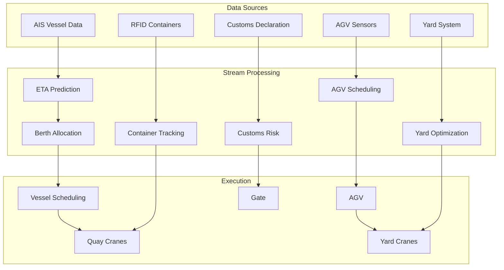

# Operators and Real-Time Port Logistics

> **Stage**: Knowledge/10-case-studies | **Prerequisites**: [01.07-two-input-operators.md](../Knowledge/01-concept-atlas/operator-deep-dive/01.07-two-input-operators.md), [realtime-supply-chain-tracking-case-study.md](realtime-supply-chain-tracking-case-study.md) | **Formalization Level**: L3
> **Document Positioning**: Operator fingerprint and Pipeline design for stream processing operators in real-time port container dispatching, AGV path optimization, and vessel arrival prediction
> **Version**: 2026.04

---

## Table of Contents

- [Operators and Real-Time Port Logistics](#operators-and-real-time-port-logistics)
  - [Table of Contents](#table-of-contents)
  - [1. Concept Definitions (Definitions)](#1-concept-definitions-definitions)
    - [Def-PRT-01-01: Port Logistics Digital Twin (港口物流数字孪生)](#def-prt-01-01-port-logistics-digital-twin-港口物流数字孪生)
    - [Def-PRT-01-02: Estimated Time of Arrival, ETA (船舶到港时间)](#def-prt-01-02-estimated-time-of-arrival-eta-船舶到港时间)
    - [Def-PRT-01-03: Yard Optimization (集装箱堆场优化)](#def-prt-01-03-yard-optimization-集装箱堆场优化)
    - [Def-PRT-01-04: AGV Scheduling (AGV调度)](#def-prt-01-04-agv-scheduling-agv调度)
    - [Def-PRT-01-05: Customs Risk Score (海关风险评分)](#def-prt-01-05-customs-risk-score-海关风险评分)
  - [2. Property Derivation (Properties)](#2-property-derivation-properties)
    - [Lemma-PRT-01-01: Queuing Theory Model for Port Throughput](#lemma-prt-01-01-queuing-theory-model-for-port-throughput)
    - [Lemma-PRT-01-02: Graph-Theoretic Determination of AGV Path Conflicts](#lemma-prt-01-02-graph-theoretic-determination-of-agv-path-conflicts)
    - [Prop-PRT-01-01: Relationship Between Yard Relocation Rate and Stacking Height](#prop-prt-01-01-relationship-between-yard-relocation-rate-and-stacking-height)
    - [Prop-PRT-01-02: Berth Utilization Improvement from Pre-Arrival Information](#prop-prt-01-02-berth-utilization-improvement-from-pre-arrival-information)
  - [3. Relations Establishment (Relations)](#3-relations-establishment-relations)
    - [3.1 Port Logistics Pipeline Operator Mapping](#31-port-logistics-pipeline-operator-mapping)
    - [3.2 Operator Fingerprint](#32-operator-fingerprint)
  - [4. Argumentation Process (Argumentation)](#4-argumentation-process-argumentation)
    - [4.1 Why Port Logistics Needs Stream Processing Instead of Traditional Scheduling](#41-why-port-logistics-needs-stream-processing-instead-of-traditional-scheduling)
    - [4.2 AGV Conflict Avoidance](#42-agv-conflict-avoidance)
    - [4.3 Reefer Container Cold Chain Monitoring](#43-reefer-container-cold-chain-monitoring)
  - [5. Formal Proof / Engineering Argument (Proof / Engineering Argument)](#5-formal-proof--engineering-argument-proof--engineering-argument)
    - [5.1 Real-Time AGV Scheduling System](#51-real-time-agv-scheduling-system)
    - [5.2 Container Status Tracking](#52-container-status-tracking)
    - [5.3 Vessel Arrival Prediction](#53-vessel-arrival-prediction)
  - [6. Example Verification (Examples)](#6-example-verification-examples)
    - [6.1 Practice: Smart Port Real-Time Scheduling (智能港口实时调度)](#61-practice-smart-port-real-time-scheduling-智能港口实时调度)
    - [6.2 Practice: Reefer Container Monitoring (冷链集装箱监控)](#62-practice-reefer-container-monitoring-冷链集装箱监控)
  - [7. Visualizations (Visualizations)](#7-visualizations-visualizations)
    - [Port Logistics Pipeline](#port-logistics-pipeline)
  - [8. References (References)](#8-references-references)

---

## 1. Concept Definitions (Definitions)

### Def-PRT-01-01: Port Logistics Digital Twin (港口物流数字孪生)

Port Logistics Digital Twin is a real-time virtual mapping of physical port operations:

$$\text{PortTwin}(t) = (\text{Vessels}_t, \text{Containers}_t, \text{AGVs}_t, \text{Cranes}_t, \text{Yard}_t)$$

### Def-PRT-01-02: Estimated Time of Arrival, ETA (船舶到港时间)

ETA is the arrival time prediction based on sailing speed, route, and weather conditions:

$$\text{ETA} = t_{current} + \frac{D_{remaining}}{v_{avg}} + \sum_{i} \Delta t_{delay,i}$$

where $D_{remaining}$ is the remaining voyage distance, $v_{avg}$ is the average sailing speed, and $\Delta t_{delay,i}$ is the $i$-th delay factor (e.g., port congestion, weather).

### Def-PRT-01-03: Yard Optimization (集装箱堆场优化)

Yard optimization is the decision-making process that maximizes space utilization while minimizing container relocation count:

$$\min \sum_{c} \text{Relocations}(c) \quad \text{s.t.} \quad \text{SpaceUtilization} < 0.85$$

### Def-PRT-01-04: AGV Scheduling (AGV调度)

AGV scheduling is the optimization problem of assigning tasks and paths to Automated Guided Vehicles (自动导引车):

$$\min \sum_{v} \left(\alpha \cdot T_{travel,v} + \beta \cdot T_{wait,v} + \gamma \cdot T_{charging,v}\right)$$

### Def-PRT-01-05: Customs Risk Score (海关风险评分)

Customs Risk Score is the inspection probability assessment based on cargo characteristics:

$$\text{Risk} = w_1 \cdot f_{origin} + w_2 \cdot f_{commodity} + w_3 \cdot f_{shipper} + w_4 \cdot f_{history}$$

---

## 2. Property Derivation (Properties)

### Lemma-PRT-01-01: Queuing Theory Model for Port Throughput

Port throughput capacity follows the M/M/c queuing model:

$$\rho = \frac{\lambda}{c \cdot \mu}$$

where $\lambda$ is the vessel arrival rate, $\mu$ is the single-berth service rate, and $c$ is the number of berths. When $\rho \to 1$, vessel waiting time tends to infinity.

### Lemma-PRT-01-02: Graph-Theoretic Determination of AGV Path Conflicts

AGV path conflicts can be modeled as a graph coloring problem:

$$\chi(G) \leq \Delta(G) + 1$$

where $\chi(G)$ is the chromatic number of conflict graph $G$, and $\Delta(G)$ is the maximum degree. Conflict avoidance is equivalent to assigning different time slices to AGVs that traverse the same road segment simultaneously.

### Prop-PRT-01-01: Relationship Between Yard Relocation Rate and Stacking Height

$$\text{RelocationRate} = 1 - \frac{1}{H_{avg}}$$

where $H_{avg}$ is the average stacking height. The higher the stack, the higher the relocation rate.

### Prop-PRT-01-02: Berth Utilization Improvement from Pre-Arrival Information

$$\Delta \eta = \eta_{withETA} - \eta_{withoutETA} \approx 15\text{-}25\%$$

---

## 3. Relations Establishment (Relations)

### 3.1 Port Logistics Pipeline Operator Mapping

| Application Scenario | Operator Combination | Data Source | Latency Requirement |
|---------|---------|--------|---------|
| **Vessel Arrival Prediction** | AsyncFunction + map | AIS/Weather | < 15min |
| **Container Tracking** | KeyedProcessFunction | RFID/GPS | < 1min |
| **AGV Scheduling** | Broadcast + ProcessFunction | Task Queue | < 5s |
| **Yard Optimization** | window + aggregate | Yard Status | < 10min |
| **Customs Risk** | Async ML | Declaration Data | < 30s |
| **Equipment Monitoring** | ProcessFunction + Timer | Sensors | < 1min |

### 3.2 Operator Fingerprint

| Dimension | Port Logistics Characteristics |
|------|------------|
| **Core Operators** | BroadcastProcessFunction (AGV scheduling), KeyedProcessFunction (container state machine), AsyncFunction (ETA/risk model), window + aggregate (yard statistics) |
| **State Types** | ValueState (container location), MapState (AGV status), BroadcastState (scheduling policy) |
| **Time Semantics** | Processing time dominated (scheduling real-time requirements) |
| **Data Characteristics** | Spatially dense (location data), temporally correlated (vessel arrivals), multi-source heterogeneous |
| **State Hotspots** | Hot yard zone keys, active AGV keys |
| **Performance Bottlenecks** | AGV conflict resolution, external ETA API |

---

## 4. Argumentation Process (Argumentation)

### 4.1 Why Port Logistics Needs Stream Processing Instead of Traditional Scheduling

Problems with traditional scheduling:

- **Static Planning**: Cannot handle vessel delays or early arrivals
- **Manual Scheduling**: Low efficiency, prone to errors
- **Information Lag**: Container position updates are not timely

Advantages of stream processing:

- **Real-Time Tracking**: Container positions updated at second-level granularity
- **Dynamic Scheduling**: Adjust AGV tasks based on real-time conditions
- **Predictive Optimization**: ETA prediction enables advance berth arrangement

### 4.2 AGV Conflict Avoidance

**Problem**: Multiple AGVs request the same passage at the same time.

**Solution**:

1. **Time-Slice Allocation**: Allocate passage time slices to different AGVs
2. **Priority**: Urgent tasks (reefer containers) take priority
3. **Path Replanning**: Automatically reroute when conflicts are detected

### 4.3 Reefer Container Cold Chain Monitoring

**Scenario**: Reefer container (冷藏集装箱) temperatures must be kept below -18°C.

**Stream Processing Solution**: Real-time temperature monitoring → anomaly alerting → automatic maintenance notification → backup container scheduling.

---

## 5. Formal Proof / Engineering Argument (Proof / Engineering Argument)

### 5.1 Real-Time AGV Scheduling System

```java
public class AGVScheduler extends BroadcastProcessFunction<TaskRequest, SchedulePolicy, AGVAssignment> {
    private MapState<String, AGVState> agvFleet;

    @Override
    public void processElement(TaskRequest task, ReadOnlyContext ctx, Collector<AGVAssignment> out) throws Exception {
        // Retrieve current scheduling policy
        ReadOnlyBroadcastState<String, SchedulePolicy> policyState = ctx.getBroadcastState(POLICY_DESCRIPTOR);
        SchedulePolicy policy = policyState.get("default");

        // Find the best AGV
        String bestAGV = null;
        double bestScore = Double.NEGATIVE_INFINITY;

        for (Map.Entry<String, AGVState> entry : agvFleet.entries()) {
            AGVState agv = entry.getValue();
            if (!agv.isAvailable()) continue;

            double score = policy.calculateScore(agv, task);
            if (score > bestScore) {
                bestScore = score;
                bestAGV = entry.getKey();
            }
        }

        if (bestAGV != null) {
            AGVState assigned = agvFleet.get(bestAGV);
            assigned.assignTask(task);
            agvFleet.put(bestAGV, assigned);

            out.collect(new AGVAssignment(bestAGV, task.getId(), task.getDestination(), ctx.timestamp()));
        }
    }

    @Override
    public void processBroadcastElement(SchedulePolicy policy, Context ctx, Collector<AGVAssignment> out) {
        ctx.getBroadcastState(POLICY_DESCRIPTOR).put("default", policy);
    }
}
```

### 5.2 Container Status Tracking

```java
// Container event stream
DataStream<ContainerEvent> containers = env.addSource(new ContainerRFIDSource());

// Real-time location tracking
containers.keyBy(ContainerEvent::getContainerId)
    .process(new KeyedProcessFunction<String, ContainerEvent, ContainerLocation>() {
        private ValueState<ContainerLocation> locationState;

        @Override
        public void processElement(ContainerEvent event, Context ctx, Collector<ContainerLocation> out) throws Exception {
            ContainerLocation loc = locationState.value();
            if (loc == null) loc = new ContainerLocation(event.getContainerId());

            loc.update(event.getLocation(), event.getTimestamp());
            locationState.update(loc);

            // Check for abnormal dwell time
            if (loc.getDwellTime() > 3600000) {  // exceeds 1 hour
                out.collect(loc.withAlert("LONG_DWELL"));
            } else {
                out.collect(loc);
            }
        }
    })
    .addSink(new ContainerTrackingSink());
```

### 5.3 Vessel Arrival Prediction

```java
// AIS data stream
DataStream<AISMessage> ais = env.addSource(new AISSource());

// ETA calculation
ais.keyBy(AISMessage::getMmsi)
    .process(new KeyedProcessFunction<String, AISMessage, ETAPrediction>() {
        private ValueState<VesselTrack> trackState;

        @Override
        public void processElement(AISMessage msg, Context ctx, Collector<ETAPrediction> out) throws Exception {
            VesselTrack track = trackState.value();
            if (track == null) track = new VesselTrack(msg.getMmsi());

            track.updatePosition(msg.getLat(), msg.getLon(), msg.getSpeed(), msg.getTimestamp());

            // Calculate ETA
            double distanceToPort = calculateDistance(track.getLastPosition(), PORT_LOCATION);
            double avgSpeed = track.getAverageSpeed(3600000);  // average over the last 1 hour

            if (avgSpeed > 0) {
                long etaMillis = (long)(distanceToPort / avgSpeed * 3600000);
                Date eta = new Date(ctx.timestamp() + etaMillis);
                out.collect(new ETAPrediction(msg.getMmsi(), eta, distanceToPort, ctx.timestamp()));
            }

            trackState.update(track);
        }
    })
    .addSink(new PortScheduleSink());
```

---

## 6. Example Verification (Examples)

### 6.1 Practice: Smart Port Real-Time Scheduling (智能港口实时调度)

```java
// 1. Vessel arrival prediction
DataStream<ETAPrediction> etas = env.addSource(new AISSource())
    .keyBy(AISMessage::getMmsi)
    .process(new ETACalculationFunction());

// 2. Berth allocation
etas.keyBy(ETAPrediction::getMmsi)
    .connect(berthAvailabilityBroadcast)
    .process(new BerthAllocationFunction())
    .addSink(new BerthScheduleSink());

// 3. Container tracking
DataStream<ContainerEvent> containerEvents = env.addSource(new RFIDSource());
containerEvents.keyBy(ContainerEvent::getContainerId)
    .process(new ContainerTrackingFunction())
    .addSink(new YardManagementSink());

// 4. AGV scheduling
DataStream<TaskRequest> tasks = env.addSource(new TaskQueueSource());
tasks.connect(agvStatusBroadcast)
    .process(new AGVScheduler())
    .addSink(new AGVCommandSink());
```

### 6.2 Practice: Reefer Container Monitoring (冷链集装箱监控)

```java
// Reefer container temperature sensors
DataStream<TemperatureReading> temps = env.addSource(new ReeferSensorSource());

// Anomaly detection
temps.keyBy(TemperatureReading::getContainerId)
    .process(new KeyedProcessFunction<String, TemperatureReading, TemperatureAlert>() {
        private ValueState<TemperatureStats> stats;

        @Override
        public void processElement(TemperatureReading reading, Context ctx, Collector<TemperatureAlert> out) throws Exception {
            TemperatureStats s = stats.value();
            if (s == null) s = new TemperatureStats();

            s.update(reading.getTemperature());

            // High-temperature alert
            if (reading.getTemperature() > reading.getMaxAllowed()) {
                out.collect(new TemperatureAlert(reading.getContainerId(), "HIGH_TEMP", reading.getTemperature(), ctx.timestamp()));
            }

            // Trend alert: continuously rising
            if (s.isRising(5) && reading.getTemperature() > reading.getMaxAllowed() - 2) {
                out.collect(new TemperatureAlert(reading.getContainerId(), "RISING_TREND", reading.getTemperature(), ctx.timestamp()));
            }

            stats.update(s);
        }
    })
    .addSink(new MaintenanceAlertSink());
```

---

## 7. Visualizations (Visualizations)

### Port Logistics Pipeline

The following diagram illustrates the end-to-end real-time port logistics pipeline, from multi-source data ingestion through stream processing to physical execution.



---

## 8. References (References)

---

*Related Documents*: [01.07-two-input-operators.md](../Knowledge/01-concept-atlas/operator-deep-dive/01.07-two-input-operators.md) | [realtime-supply-chain-tracking-case-study.md](realtime-supply-chain-tracking-case-study.md) | [realtime-digital-twin-case-study.md](realtime-digital-twin-case-study.md)
