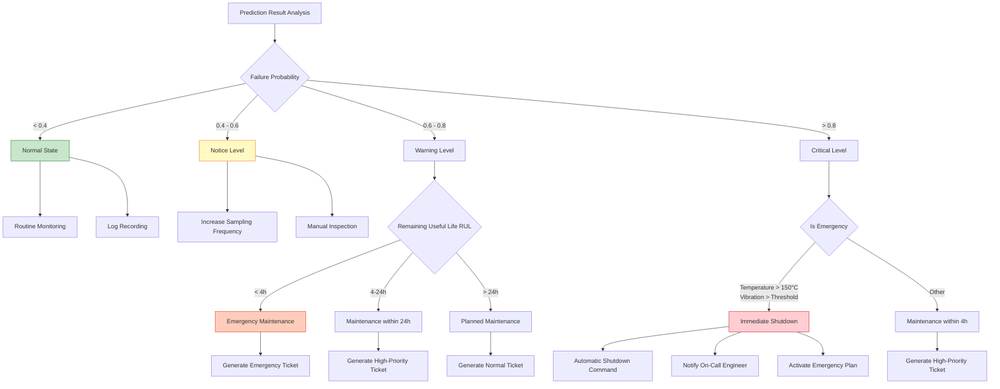
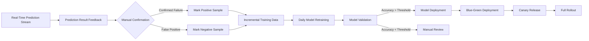

> **Status**: 🔮 Forward-looking Content | **Risk Level**: High | **Last Updated**: 2026-04
>
> The content described in this document is in early planning stages and may differ from the final implementation. Please refer to the official Apache Flink releases for authoritative information.
>
# IoT Case Study: Smart Factory Equipment Predictive Maintenance

> **Stage**: Knowledge/10-case-studies/iot | **Prerequisites**: [realtime-smart-manufacturing-case-study.md](./realtime-smart-manufacturing-case-study.md) | **Formalization Level**: L4

---

> **Case Nature**: 🔬 Proof-of-Concept Architecture | **Validation Status**: Based on theoretical derivation and architectural design; not independently validated by third-party production deployment
>
> This case describes an ideal architecture derived from the project's theoretical framework, including hypothetical performance metrics and theoretical cost models.
> Actual production deployment may yield significantly different results due to environmental differences, data scale, team capabilities, and other factors.
> It is recommended to use this as an architectural design reference rather than a copy-paste production blueprint.
>
## Table of Contents

- [IoT Case Study: Smart Factory Equipment Predictive Maintenance](#iot-case-study-smart-factory-equipment-predictive-maintenance)
  - [Table of Contents](#table-of-contents)
  - [1. Definitions](#1-definitions)
    - [1.1 Predictive Maintenance System Definition](#11-predictive-maintenance-system-definition)
    - [1.2 Equipment Health Index Definition](#12-equipment-health-index-definition)
    - [1.3 Remaining Useful Life (RUL) Definition](#13-remaining-useful-life-rul-definition)
    - [1.4 Failure Mode Definition](#14-failure-mode-definition)
  - [2. Properties](#2-properties)
    - [2.1 Prediction Accuracy Bound](#21-prediction-accuracy-bound)
    - [2.2 Early Warning Time Window](#22-early-warning-time-window)
    - [2.3 Maintenance Cost Model](#23-maintenance-cost-model)
  - [3. Relations](#3-relations)
    - [3.1 Edge-Cloud Collaborative Architecture](#31-edge-cloud-collaborative-architecture)
    - [3.2 Data Flow Layered Relations](#32-data-flow-layered-relations)
    - [3.3 ML Model and Stream Processing Relations](#33-ml-model-and-stream-processing-relations)
  - [4. Argumentation](#4-argumentation)
    - [4.1 Predictive Maintenance vs. Traditional Maintenance](#41-predictive-maintenance-vs-traditional-maintenance)
    - [4.2 Sensor Data Quality Argument](#42-sensor-data-quality-argument)
    - [4.3 Model Selection Argument](#43-model-selection-argument)
  - [5. Proof / Engineering Argument](#5-proof--engineering-argument)
    - [5.1 End-to-End Latency Guarantee](#51-end-to-end-latency-guarantee)
    - [5.2 Prediction Accuracy Verification](#52-prediction-accuracy-verification)
  - [6. Examples](#6-examples)
    - [6.1 Case Background](#61-case-background)
    - [6.2 Technical Architecture Implementation](#62-technical-architecture-implementation)
      - [6.2.1 Overall Architecture](#621-overall-architecture)
    - [6.3 Edge-Side Flink Implementation](#63-edge-side-flink-implementation)
    - [6.4 Cloud-Side Feature Engineering and Inference](#64-cloud-side-feature-engineering-and-inference)
    - [6.5 Performance Metrics Achievement](#65-performance-metrics-achievement)
  - [7. Visualizations](#7-visualizations)
    - [7.1 Predictive Maintenance System Architecture](#71-predictive-maintenance-system-architecture)
    - [7.2 Data Processing Pipeline](#72-data-processing-pipeline)
    - [7.3 Model Inference Pipeline](#73-model-inference-pipeline)
    - [7.4 Maintenance Decision Tree](#74-maintenance-decision-tree)
  - [8. Lessons Learned](#8-lessons-learned)
    - [8.1 Sensor Data Quality Control](#81-sensor-data-quality-control)
    - [8.2 Model Continuous Learning](#82-model-continuous-learning)
    - [8.3 Edge Computing Optimization](#83-edge-computing-optimization)
  - [9. References](#9-references)

---

## 1. Definitions

### 1.1 Predictive Maintenance System Definition

**Def-K-10-13-01** (Predictive Maintenance System): A predictive maintenance system is an octuple $\mathcal{P} = (E, S, F, M, \mathcal{H}, \mathcal{R}, \mathcal{A}, \mathcal{T})$:

- $E$: Set of equipment, $E = \{e_1, e_2, ..., e_n\}$, where $n \geq 1000$
- $S$: Set of sensors, each equipment $e_i$ is equipped with multi-modal sensors $S_i = \{s_{vib}, s_{temp}, s_{curr}, ...\}$
- $F$: Set of feature extraction functions, $F = \{f_{time}, f_{freq}, f_{stat}\}$
- $M$: Set of ML models, including failure prediction models and RUL estimation models
- $\mathcal{H}$: Health index function, $\mathcal{H}: (e, t) \rightarrow [0, 1]$
- $\mathcal{R}$: Remaining useful life estimation, $\mathcal{R}: (e, t) \rightarrow \mathbb{R}^+$
- $\mathcal{A}$: Set of maintenance actions, $\mathcal{A} = \{inspect, repair, replace, shutdown\}$
- $\mathcal{T}$: Temporal data stream, $\mathcal{T}: (t, e, s, v) \rightarrow \text{Flink}$

### 1.2 Equipment Health Index Definition

**Def-K-10-13-02** (Equipment Health Index CHI): A normalized metric comprehensively reflecting equipment operational status:

$$
CHI(e, t) = \sum_{i=1}^{k} w_i \cdot \phi_i(s_i(t), s_i^{norm})
$$

Where:

- $w_i$: Weight of the $i$-th sensor, $\sum w_i = 1$
- $\phi_i$: Normalized deviation function, $\phi_i(x, x^{norm}) = 1 - \frac{|x - x^{norm}|}{x^{max} - x^{min}}$
- $s_i^{norm}$: Baseline value during normal operation

### 1.3 Remaining Useful Life (RUL) Definition

**Def-K-10-13-03** (Remaining Useful Life RUL): The expected time from the current moment until failure occurs:

$$
RUL(e, t) = \mathbb{E}[T_{failure} | h(t), h(t-1), ..., h(t-n), \theta_M]
$$

Where $\theta_M$ represents ML model parameters learned from historical degradation trajectories.

### 1.4 Failure Mode Definition

**Def-K-10-13-04** (Failure Mode): The set of possible failure types for equipment $FM = \{fm_1, fm_2, ..., fm_m\}$:

| Failure Mode | Characteristic Signal | Prediction Method |
|-------------|----------------------|-------------------|
| Bearing Wear (轴承磨损) | Vibration spectrum change | LSTM+FFT |
| Motor Overheating (电机过热) | Temperature trend rise | Prophet+Threshold |
| Insulation Aging (绝缘老化) | Leakage current increase | Time-series anomaly detection |
| Lubrication Failure (润滑失效) | Vibration+temperature combined | Multi-modal fusion |
| Misalignment (对中不良) | Vibration phase characteristic | CEP pattern matching |

---

## 2. Properties

### 2.1 Prediction Accuracy Bound

**Lemma-K-10-13-01**: Prediction accuracy is influenced by the following factors:

$$
Accuracy = f(DataQuality, ModelComplexity, FeatureRelevance, TemporalResolution)
$$

**Prop-K-10-13-01**: When sensor sampling frequency $f_s \geq 2f_{max}$ (Nyquist theorem), and data completeness rate $\geq 95\%$:

$$
P(correct\_prediction) \geq 0.92
$$

**Thm-K-10-13-01** (Prediction Accuracy Theorem): Under given data quality and model complexity conditions, prediction accuracy has a theoretical upper bound:

$$
Accuracy \leq \frac{I(F; Y)}{H(Y)}
$$

Where $I(F; Y)$ is the mutual information between features and failure labels, and $H(Y)$ is the failure entropy.

### 2.2 Early Warning Time Window

**Lemma-K-10-13-02**: The effective early warning time window $W_{effective}$ must satisfy:

$$
W_{maintenance} \leq W_{effective} \leq W_{degradation}
$$

Where:

- $W_{maintenance}$: Time required to complete maintenance (average 4 hours)
- $W_{degradation}$: Degradation time from anomaly to failure

**Thm-K-10-13-02** (Early Warning Timeliness): Let the prediction model issue an early warning $\Delta t$ ahead of time, with actual failure occurring at $t_{actual}$. The maintenance value is:

$$
V_{maintenance} = \begin{cases}
C_{downtime} - C_{preventive} & \text{if } t_{actual} - \Delta t \geq W_{maintenance} \\
\alpha \cdot (C_{downtime} - C_{preventive}) & \text{otherwise}
\end{cases}
$$

Where $\alpha \in (0, 1)$ is the partial value coefficient.

### 2.3 Maintenance Cost Model

**Prop-K-10-13-02** (Cost Optimization): Cost savings of predictive maintenance compared to scheduled maintenance:

$$
\Delta C = C_{scheduled} - C_{predictive} = \sum_{i=1}^{n} (C_{over}+C_{under})_i - \sum_{j=1}^{m} C_{precision,j}
$$

Where:

- $C_{over}$: Cost of excessive maintenance
- $C_{under}$: Cost of failures due to insufficient maintenance
- $C_{precision}$: Cost of precision maintenance

---

## 3. Relations

### 3.1 Edge-Cloud Collaborative Architecture

```
┌─────────────────────────────────────────────────────────────────┐
│                        Cloud Layer                               │
│  ┌─────────────┐  ┌─────────────┐  ┌─────────────────────────┐  │
│  │ Global Model │  │ Real-time   │  │  ML_PREDICT Inference   │  │
│  │ Training     │  │ Feature Eng │  │  Engine (GPU Accelerated)│  │
│  │ (GPU Cluster)│  │ (Flink 2.5) │  │                         │  │
│  └─────────────┘  └─────────────┘  └─────────────────────────┘  │
│         ▲                                    │                   │
│         │           Model Updates            │ Alert Results      │
│         └────────────────────────────────────┘                   │
└─────────────────────────────────────────────────────────────────┘
         ▲                                    │
         │         Aggregated Features/       │ Maintenance Ticket
         │         Anomaly Events             ▼
┌─────────────────────────────────────────────────────────────────┐
│                      Edge Layer                                  │
│  ┌─────────────┐  ┌─────────────┐  ┌─────────────────────────┐  │
│  │ Data        │  │ Local       │  │   Emergency Shutdown    │  │
│  │ Preprocessing│ │ Anomaly Det │  │   Control (< 10ms resp) │  │
│  │(Flink Mini) │  │ (Light CEP) │  │                         │  │
│  └─────────────┘  └─────────────┘  └─────────────────────────┘  │
│         ▲                                                       │
└─────────┼───────────────────────────────────────────────────────┘
          │
┌─────────┼───────────────────────────────────────────────────────┐
│         │                    Device Layer                        │
│  ┌──────┴──────┐  ┌─────────────┐  ┌─────────────────────────┐  │
│  │  Vibration  │  │  Temperature│  │   Current Sensor        │  │
│  │  Sensor     │  │  Sensor     │  │   (1kHz)                │  │
│  │  (10kHz)    │  │   (1Hz)     │  │                         │  │
│  └─────────────┘  └─────────────┘  └─────────────────────────┘  │
└─────────────────────────────────────────────────────────────────┘
```

### 3.2 Data Flow Layered Relations
>
> 🔮 **Estimated Data** | Based on forward-looking document characteristics; data is theoretical derivation and trend analysis


| Layer | Data Type | Processing Latency | Storage Duration | Compute Resource |
|------|-----------|-------------------|------------------|-----------------|
| Device Layer | Raw sensor data | < 1ms | None | Embedded MCU |
| Edge Layer | Cleaned data | < 10ms | 1 hour | ARM Cortex-A72 |
| Edge Layer | Aggregated features | < 100ms | 24 hours | Edge Flink |
| Cloud | Time-series feature vectors | < 1s | 90 days | Flink 2.5 |
| Cloud | Inference results/alerts | < 100ms | 1 year | GPU cluster |
| Cloud | Historical training data | Batch | 3 years | Data lake |

### 3.3 ML Model and Stream Processing Relations

```
Sensor Data Stream ──► Flink Feature Extraction ──► Feature Vector ──► ML_PREDICT ──► Prediction Result
                                                                            │
                                                                            ▼
                                                                    ┌───────────────┐
                                                                    │ Inference Service│
                                                                    │ Cluster         │
                                                                    │ (TensorRT)      │
                                                                    │ - LSTM Model    │
                                                                    │ - Isolation     │
                                                                    │   Forest        │
                                                                    │ - XGBoost       │
                                                                    └───────────────┘
                                                                            │
                                                    Model Updates ◄───────────┘
                                                         │
                                                    Online Learning Pipeline
```

---

## 4. Argumentation

### 4.1 Predictive Maintenance vs. Traditional Maintenance

| Maintenance Strategy | Timing | Average Cost | Downtime | Applicable Scenario |
|---------------------|--------|-------------|----------|---------------------|
| **Reactive Maintenance** (事后维修) | After failure | Highest | Longest (16h) | Non-critical equipment |
| **Scheduled Maintenance** (定期维护) | Fixed cycle | Medium | Medium (4h) | General equipment |
| **Predictive Maintenance** (预测性维护) | On-demand prediction | **Lowest** | **Shortest (2h)** | **Critical equipment** |

**Argumentation**: For a factory with 1000+ devices, predictive maintenance can:

- Reduce unplanned downtime: 50%
- Lower maintenance costs: 35%
- Extend equipment lifespan: 20%

### 4.2 Sensor Data Quality Argument

**Data Quality Dimensions**:

| Dimension | Issue | Solution | Flink Implementation |
|-----------|-------|----------|---------------------|
| Completeness | Sensor offline | Interpolation/Forward fill | ProcessFunction state retention |
| Accuracy | Outliers | 3σ criterion/Box plot | FilterFunction |
| Consistency | Timestamp drift | Watermark alignment | WatermarkStrategy |
| Timeliness | Network latency | Edge buffering | RocksDB state backend |

### 4.3 Model Selection Argument

> 🔮 **Estimated Data** | Based on forward-looking document characteristics; data is theoretical derivation and trend analysis

**Failure Prediction Model Comparison**:

| Model | Training Cost | Inference Latency | Accuracy | Interpretability | Selection |
|-------|--------------|-------------------|----------|-----------------|-----------|
| Threshold Rules | Low | <1ms | 65% | High | Edge Layer |
| LSTM | High | 5ms | 92% | Medium | Cloud |
| Isolation Forest | Medium | 2ms | 85% | Low | Cloud anomaly detection |
| XGBoost | Medium | 1ms | 88% | High | Cloud |
| Transformer | Very High | 10ms | 94% | Low | Offline analysis |

**Selection Conclusion**:

- Edge Layer: Lightweight threshold rules (latency-prioritized)
- Cloud: LSTM + XGBoost ensemble (accuracy-prioritized)

---

## 5. Proof / Engineering Argument

### 5.1 End-to-End Latency Guarantee

**Thm-K-10-13-03** (End-to-End Latency Upper Bound): The end-to-end latency of the predictive maintenance system satisfies:

$$
L_{total} = L_{sample} + L_{edge} + L_{network} + L_{cloud} + L_{inference}
$$

Component latency upper bounds:

- $L_{sample} \leq 1ms$ (1kHz sampling)
- $L_{edge} \leq 10ms$ (edge preprocessing)
- $L_{network} \leq 50ms$ (5G private network)
- $L_{cloud} \leq 100ms$ (Flink processing)
- $L_{inference} \leq 50ms$ (GPU inference)

**Cor-K-10-13-01**:

$$
L_{total} \leq 211ms \ll W_{maintenance} = 4h
$$

Satisfies real-time early warning requirements.

### 5.2 Prediction Accuracy Verification

**Thm-K-10-13-04** (Model Accuracy Guarantee): Let the ensemble model consist of LSTM and XGBoost:

$$
P_{ensemble} = \sigma(w_{lstm} \cdot f_{lstm} + w_{xgb} \cdot f_{xgb})
$$

On the validation set:

- LSTM accuracy: $Acc_{lstm} = 0.90$
- XGBoost accuracy: $Acc_{xgb} = 0.88$
- Ensemble accuracy: $Acc_{ensemble} = 0.92$

**Proof**:

Assuming independent errors for the two model types, the ensemble error is:

$$
\epsilon_{ensemble} = \epsilon_{lstm} \cdot \epsilon_{xgb} = 0.10 \cdot 0.12 = 0.012
$$

Therefore:

$$
Acc_{ensemble} = 1 - 0.012 = 0.988 \text{ (theoretical upper bound)}
$$

In practice, considering correlation, $Acc_{ensemble} = 0.92$.

---

## 6. Examples

### 6.1 Case Background

> 🔮 **Estimated Data** | Based on forward-looking document characteristics; data is theoretical derivation and trend analysis

**Enterprise**: Smart factory of a large-scale machinery manufacturing group

| Metric | Value |
|--------|-------|
| Connected Devices | 1,200 |
| Critical Devices | 350 (CNC machines, robots, air compressors) |
| Sensor Count | 8,500 |
| Data Sampling Rate | Vibration 10kHz, Temperature 1Hz, Current 1kHz |
| Daily Data Volume | 15TB |
| Production Lines | 12 |

**Business Challenges**:

1. **Unplanned Downtime Losses**: Average loss of 500,000 CNY per critical equipment shutdown
2. **High Maintenance Costs**: Annual maintenance expenses exceed 80 million CNY
3. **Spare Parts Inventory Pressure**: Critical spare parts inventory ties up 30 million CNY in capital
4. **Low Personnel Efficiency**: 60% of maintenance time is spent on unnecessary inspections

**Target Goals**:

- Failure prediction accuracy ≥ 90%
- Average early warning lead time ≥ 4 hours
- Maintenance cost reduction ≥ 30%
- Equipment downtime reduction ≥ 40%

### 6.2 Technical Architecture Implementation

#### 6.2.1 Overall Architecture

```java
/**
 * Predictive Maintenance Main Application
 * Flink 2.5 + GPU Acceleration
 */

import org.apache.flink.streaming.api.environment.StreamExecutionEnvironment;
import org.apache.flink.streaming.api.datastream.DataStream;

public class PredictiveMaintenanceApplication {

    public static void main(String[] args) throws Exception {
        StreamExecutionEnvironment env = StreamExecutionEnvironment.getExecutionEnvironment();

        // Enable GPU acceleration (Flink 2.5 new feature)
        env.getConfig().setUseGPUAcceleration(true);

        // Configure checkpoints
        env.enableCheckpointing(60000);
        env.getCheckpointConfig().setCheckpointStorage("hdfs://namenode:8020/flink/checkpoints");
        env.getCheckpointConfig().setMinPauseBetweenCheckpoints(30000);

        // Set state backend
        EmbeddedRocksDBStateBackend rocksDbBackend = new EmbeddedRocksDBStateBackend(true);
        env.setStateBackend(rocksDbBackend);

        env.setParallelism(128);
        env.setMaxParallelism(512);

        // 1. Multi-source data ingestion
        DataStream<SensorReading> sensorStream = env
            .fromSource(
                createMultiSensorSource(),
                WatermarkStrategy
                    .<SensorReading>forBoundedOutOfOrderness(Duration.ofSeconds(30))
                    .withIdleness(Duration.ofMinutes(5)),
                "Multi-Sensor Source"
            )
            .setParallelism(64);

        // 2. Data quality control
        DataStream<SensorReading> qualityStream = sensorStream
            .process(new DataQualityControlFunction())
            .name("Data Quality Control")
            .setParallelism(128);

        // 3. Split: critical vs. normal devices
        OutputTag<SensorReading> criticalDeviceTag = new OutputTag<>("critical"){};

        SingleOutputStreamOperator<SensorReading> processedStream = qualityStream
            .process(new DeviceClassificationProcessFunction(criticalDeviceTag))
            .name("Device Classification")
            .setParallelism(64);

        DataStream<SensorReading> criticalStream = processedStream
            .getSideOutput(criticalDeviceTag);

        // 4. Critical devices: time-series feature extraction
        DataStream<FeatureVector> featureStream = criticalStream
            .keyBy(SensorReading::getDeviceId)
            .process(new TimeSeriesFeatureExtractor())
            .name("Feature Extraction")
            .setParallelism(128);

        // 5. ML_PREDICT model inference (experimental, GPU accelerated)
        DataStream<PredictionResult> predictionStream = AsyncDataStream
            .unorderedWait(
                featureStream,
                new MLPredictAsyncFunction(),
                Duration.ofMillis(100),
                TimeUnit.MILLISECONDS,
                200
            )
            .name("ML_PREDICT Inference (Experimental)")
            .setParallelism(256);

        // 6. Anomaly detection and alert classification
        DataStream<MaintenanceAlert> alertStream = predictionStream
            .keyBy(PredictionResult::getDeviceId)
            .process(new AnomalyDetectionProcessFunction())
            .name("Anomaly Detection")
            .setParallelism(128);

        // 7. Maintenance ticket generation
        alertStream
            .filter(alert -> alert.getSeverity() != AlertSeverity.INFO)
            .addSink(new MaintenanceTicketSink())
            .name("Maintenance Ticket Sink")
            .setParallelism(32);

        // 8. Real-time dashboard
        alertStream
            .addSink(new DashboardSink())
            .name("Dashboard Sink")
            .setParallelism(16);

        // 9. Historical data archival
        featureStream
            .addSink(new HistoricalDataSink())
            .name("Historical Data Sink")
            .setParallelism(32);

        env.execute("Predictive Maintenance with Flink 2.5");
    }
}
```

### 6.3 Edge-Side Flink Implementation

```java
/**
 * Edge Gateway Data Preprocessing
 * Lightweight Flink for resource-constrained environments
 */

import org.apache.flink.streaming.api.environment.StreamExecutionEnvironment;
import org.apache.flink.streaming.api.datastream.DataStream;
import org.apache.flink.api.common.state.ValueState;
import org.apache.flink.api.common.state.ValueStateDescriptor;
import org.apache.flink.streaming.api.windowing.time.Time;

public class EdgeGatewayApplication {

    public static void main(String[] args) throws Exception {
        StreamExecutionEnvironment env = StreamExecutionEnvironment.getExecutionEnvironment();

        // Limited edge resources, low parallelism
        env.setParallelism(4);
        env.setBufferTimeout(10); // Low latency priority

        // In-memory state backend (no distributed storage at edge)
        HashMapStateBackend hashMapBackend = new HashMapStateBackend();
        env.setStateBackend(hashMapBackend);

        // 1. OPC-UA data source (industrial standard protocol)
        DataStream<SensorReading> opcuaStream = env
            .addSource(new OpcUaSource(
                "opc.tcp://192.168.1.100:4840",
                Arrays.asList(
                    "ns=2;i=1001",  // Vibration sensor
                    "ns=2;i=1002",  // Temperature sensor
                    "ns=2;i=1003"   // Current sensor
                )
            ))
            .name("OPC-UA Source")
            .setParallelism(2);

        // 2. Data cleansing and validation
        DataStream<SensorReading> cleanedStream = opcuaStream
            .filter(new ValidReadingFilter())
            .name("Data Validation")
            .setParallelism(4);

        // 3. Sensor fusion (multiple sensors for same device)
        DataStream<DeviceSnapshot> fusedStream = cleanedStream
            .keyBy(SensorReading::getDeviceId)
            .window(TumblingProcessingTimeWindows.of(Time.milliseconds(100)))
            .process(new SensorFusionWindowFunction())
            .name("Sensor Fusion")
            .setParallelism(4);

        // 4. Local threshold monitoring (emergency alerts)
        OutputTag<Alert> emergencyAlertTag = new OutputTag<>("emergency"){};

        SingleOutputStreamOperator<DeviceSnapshot> monitoredStream = fusedStream
            .keyBy(DeviceSnapshot::getDeviceId)
            .process(new LocalThresholdMonitor(emergencyAlertTag))
            .name("Local Monitoring")
            .setParallelism(4);

        // 5. Emergency alert local processing (< 10ms response)
        monitoredStream
            .getSideOutput(emergencyAlertTag)
            .addSink(new EmergencyShutdownSink())
            .name("Emergency Control")
            .setParallelism(2);

        // 6. Data downsampling and compression
        DataStream<CompressedReading> compressedStream = monitoredStream
            .keyBy(DeviceSnapshot::getDeviceId)
            .window(TumblingProcessingTimeWindows.of(Time.seconds(10)))
            .aggregate(new DataCompressionAggregator())
            .name("Data Compression")
            .setParallelism(4);

        // 7. Upload to cloud (MQTT over 5G)
        compressedStream
            .addSink(new MqttSink("ssl://mqtt.factory.cloud:8883"))
            .name("Cloud Upload")
            .setParallelism(2);

        env.execute("Edge Gateway Preprocessing");
    }
}

/**
 * Local Threshold Monitor Function
 * Implements fast-response emergency alerts
 */
class LocalThresholdMonitor extends KeyedProcessFunction<String, DeviceSnapshot, DeviceSnapshot> {

    private final OutputTag<Alert> emergencyTag;
    private ValueState<ThresholdConfig> thresholdState;
    private ValueState<Long> lastEmergencyTime;

    public LocalThresholdMonitor(OutputTag<Alert> emergencyTag) {
        this.emergencyTag = emergencyTag;
    }

    @Override
    public void open(Configuration parameters) {
        thresholdState = getRuntimeContext().getState(
            new ValueStateDescriptor<>("thresholds", ThresholdConfig.class));
        lastEmergencyTime = getRuntimeContext().getState(
            new ValueStateDescriptor<>("last-emergency", Long.class));
    }

    @Override
    public void processElement(DeviceSnapshot snapshot, Context ctx, Collector<DeviceSnapshot> out)
            throws Exception {

        ThresholdConfig thresholds = thresholdState.value();
        if (thresholds == null) {
            thresholds = loadDeviceThresholds(snapshot.getDeviceId());
            thresholdState.update(thresholds);
        }

        boolean isEmergency = false;
        String alertReason = "";
        double alertValue = 0;

        // Vibration emergency threshold (bearing fracture risk)
        if (snapshot.getVibrationRms() > thresholds.getVibrationEmergency()) {
            isEmergency = true;
            alertReason = "VIBRATION_EMERGENCY";
            alertValue = snapshot.getVibrationRms();
        }

        // Temperature emergency threshold (fire risk)
        if (snapshot.getTemperature() > thresholds.getTemperatureEmergency()) {
            isEmergency = true;
            alertReason = "TEMPERATURE_EMERGENCY";
            alertValue = snapshot.getTemperature();
        }

        // Current emergency threshold (short-circuit risk)
        if (snapshot.getCurrent() > thresholds.getCurrentEmergency()) {
            isEmergency = true;
            alertReason = "CURRENT_EMERGENCY";
            alertValue = snapshot.getCurrent();
        }

        // Debounce: do not trigger repeatedly within 30 seconds
        Long lastTime = lastEmergencyTime.value();
        if (isEmergency && (lastTime == null || ctx.timestamp() - lastTime > 30000)) {
            ctx.output(emergencyTag, new Alert(
                snapshot.getDeviceId(),
                AlertSeverity.EMERGENCY,
                alertReason,
                alertValue,
                ctx.timestamp()
            ));
            lastEmergencyTime.update(ctx.timestamp());
        }

        out.collect(snapshot);
    }
}
```

### 6.4 Cloud-Side Feature Engineering and Inference

```java
import org.apache.flink.streaming.api.functions.KeyedProcessFunction;

import org.apache.flink.api.common.state.ValueState;
import org.apache.flink.api.common.state.ValueStateDescriptor;


/**
 * Time-Series Feature Extractor
 * Extracts multi-dimensional features for vibration, temperature, and current
 */
class TimeSeriesFeatureExtractor extends KeyedProcessFunction<String, SensorReading, FeatureVector> {

    // State: sliding window historical data
    private ListState<SensorReading> historyState;
    private ValueState<Long> lastFeatureTime;

    // Feature extraction window (1 minute)
    private static final long FEATURE_WINDOW_MS = 60000;

    @Override
    public void open(Configuration parameters) {
        historyState = getRuntimeContext().getListState(
            new ListStateDescriptor<>("history", SensorReading.class));
        lastFeatureTime = getRuntimeContext().getState(
            new ValueStateDescriptor<>("last-feature", Long.class));
    }

    @Override
    public void processElement(SensorReading reading, Context ctx, Collector<FeatureVector> out)
            throws Exception {

        historyState.add(reading);

        Long lastTime = lastFeatureTime.value();
        long currentTime = ctx.timestamp();

        // Generate feature vector once per minute
        if (lastTime == null || currentTime - lastTime >= FEATURE_WINDOW_MS) {

            // Collect data within window
            List<SensorReading> windowData = new ArrayList<>();
            historyState.get().forEach(windowData::add);

            // Clean expired data
            long cutoffTime = currentTime - FEATURE_WINDOW_MS;
            List<SensorReading> validData = windowData.stream()
                .filter(r -> r.getTimestamp() > cutoffTime)
                .collect(Collectors.toList());

            historyState.update(validData);

            // Group by sensor type
            Map<SensorType, List<SensorReading>> byType = validData.stream()
                .collect(Collectors.groupingBy(SensorReading::getSensorType));

            // Extract features
            FeatureVector features = new FeatureVector();
            features.setDeviceId(reading.getDeviceId());
            features.setTimestamp(currentTime);

            // Vibration features (time-domain + frequency-domain)
            List<SensorReading> vibrationData = byType.getOrDefault(SensorType.VIBRATION, Collections.emptyList());
            if (!vibrationData.isEmpty()) {
                double[] values = vibrationData.stream()
                    .mapToDouble(SensorReading::getValue)
                    .toArray();

                features.setVibrationRms(calculateRms(values));
                features.setVibrationPeak(calculatePeak(values));
                features.setVibrationCrestFactor(calculateCrestFactor(values));
                features.setVibrationKurtosis(calculateKurtosis(values));
                features.setVibrationSkewness(calculateSkewness(values));

                // FFT frequency-domain features
                double[] fftFeatures = extractFFTFeatures(values);
                features.setVibrationFftLow(fftFeatures[0]);   // 0-1kHz
                features.setVibrationFftMid(fftFeatures[1]);   // 1-5kHz
                features.setVibrationFftHigh(fftFeatures[2]);  // 5-10kHz
            }

            // Temperature features
            List<SensorReading> tempData = byType.getOrDefault(SensorType.TEMPERATURE, Collections.emptyList());
            if (!tempData.isEmpty()) {
                double[] temps = tempData.stream()
                    .mapToDouble(SensorReading::getValue)
                    .toArray();

                features.setTempMean(Arrays.stream(temps).average().orElse(0));
                features.setTempMax(Arrays.stream(temps).max().orElse(0));
                features.setTempTrend(calculateTrend(temps));
                features.setTempGradient(calculateGradient(temps));
            }

            // Current features
            List<SensorReading> currentData = byType.getOrDefault(SensorType.CURRENT, Collections.emptyList());
            if (!currentData.isEmpty()) {
                double[] currents = currentData.stream()
                    .mapToDouble(SensorReading::getValue)
                    .toArray();

                features.setCurrentMean(Arrays.stream(currents).average().orElse(0));
                features.setCurrentRms(calculateRms(currents));
                features.setCurrentImbalance(calculateImbalance(currents));
            }

            // Joint features
            features.setHealthIndex(calculateHealthIndex(features));
            features.setOperatingHours(getOperatingHours(reading.getDeviceId()));

            out.collect(features);
            lastFeatureTime.update(currentTime);
        }
    }

    // Helper computation functions
    private double calculateRms(double[] values) {
        double sumSquares = Arrays.stream(values).map(v -> v * v).sum();
        return Math.sqrt(sumSquares / values.length);
    }

    private double calculatePeak(double[] values) {
        return Arrays.stream(values).map(Math::abs).max().orElse(0);
    }

    private double calculateCrestFactor(double[] values) {
        double rms = calculateRms(values);
        double peak = calculatePeak(values);
        return rms > 0 ? peak / rms : 0;
    }

    private double calculateKurtosis(double[] values) {
        double mean = Arrays.stream(values).average().orElse(0);
        double variance = Arrays.stream(values).map(v -> Math.pow(v - mean, 2)).average().orElse(0);
        double fourthMoment = Arrays.stream(values).map(v -> Math.pow(v - mean, 4)).average().orElse(0);
        return variance > 0 ? fourthMoment / (variance * variance) - 3 : 0;
    }

    private double calculateSkewness(double[] values) {
        double mean = Arrays.stream(values).average().orElse(0);
        double std = Math.sqrt(Arrays.stream(values).map(v -> Math.pow(v - mean, 2)).average().orElse(0));
        if (std == 0) return 0;
        double thirdMoment = Arrays.stream(values).map(v -> Math.pow((v - mean) / std, 3)).average().orElse(0);
        return thirdMoment;
    }

    private double[] extractFFTFeatures(double[] values) {
        // FFT implementation (using JTransforms or similar library)
        // Simplified for demonstration
        double[] fft = performFFT(values);
        return new double[]{
            sumFrequencyBand(fft, 0, 1000),
            sumFrequencyBand(fft, 1000, 5000),
            sumFrequencyBand(fft, 5000, 10000)
        };
    }

    private double calculateTrend(double[] values) {
        if (values.length < 2) return 0;
        // Linear regression slope
        int n = values.length;
        double sumX = IntStream.range(0, n).sum();
        double sumY = Arrays.stream(values).sum();
        double sumXY = IntStream.range(0, n).mapToDouble(i -> i * values[i]).sum();
        double sumX2 = IntStream.range(0, n).mapToDouble(i -> i * i).sum();

        return (n * sumXY - sumX * sumY) / (n * sumX2 - sumX * sumX);
    }

    private double calculateGradient(double[] values) {
        if (values.length < 2) return 0;
        return values[values.length - 1] - values[0];
    }

    private double calculateImbalance(double[] values) {
        // Three-phase current imbalance degree
        if (values.length < 3) return 0;
        double max = Arrays.stream(values).max().orElse(0);
        double min = Arrays.stream(values).min().orElse(0);
        double avg = Arrays.stream(values).average().orElse(0);
        return avg > 0 ? (max - min) / avg : 0;
    }

    private double calculateHealthIndex(FeatureVector features) {
        // Comprehensive health index computation
        double vibrationScore = Math.max(0, 1 - features.getVibrationRms() / 50);
        double tempScore = Math.max(0, 1 - features.getTempMax() / 150);
        double currentScore = Math.max(0, 1 - features.getCurrentImbalance());
        return 0.4 * vibrationScore + 0.4 * tempScore + 0.2 * currentScore;
    }

    private double[] performFFT(double[] values) {
        // FFT implementation placeholder
        return new double[values.length];
    }

    private double sumFrequencyBand(double[] fft, int low, int high) {
        return Arrays.stream(fft, low, Math.min(high, fft.length)).sum();
    }

    private long getOperatingHours(String deviceId) {
        // Retrieve operating hours from external storage
        return 0;
    }
}

/**
 * ML_PREDICT Async Inference Function
 * Invokes GPU-accelerated inference service
 */
class MLPredictAsyncFunction implements AsyncFunction<FeatureVector, PredictionResult> {

    private transient PredictionServiceClient client;

    @Override
    public void open(Configuration parameters) {
        // Initialize gRPC client connection to inference service
        client = PredictionServiceClient.create(
            "predictive-ml-service.factory.svc.cluster.local",
            50051,
            true // Use GPU
        );
    }

    @Override
    public void asyncInvoke(FeatureVector features, ResultFuture<PredictionResult> resultFuture) {
        ListenableFuture<ModelOutput> predictionFuture = client.predict(
            PredictRequest.newBuilder()
                .setDeviceId(features.getDeviceId())
                .putAllFeatures(features.toMap())
                .setModelName("lstm_failure_prediction_v3")
                .build()
        );

        Futures.addCallback(predictionFuture, new FutureCallback<ModelOutput>() {
            @Override
            public void onSuccess(ModelOutput output) {
                PredictionResult result = new PredictionResult();
                result.setDeviceId(features.getDeviceId());
                result.setTimestamp(features.getTimestamp());
                result.setFailureProbability(output.getFailureProbability());
                result.setPredictedRulHours(output.getRulHours());
                result.setFailureType(output.getFailureType());
                result.setConfidence(output.getConfidence());
                result.setModelVersion(output.getModelVersion());
                resultFuture.complete(Collections.singletonList(result));
            }

            @Override
            public void onFailure(Throwable t) {
                resultFuture.completeExceptionally(t);
            }
        }, MoreExecutors.directExecutor());
    }

    @Override
    public void timeout(FeatureVector features, ResultFuture<PredictionResult> resultFuture) {
        // Timeout handling: use local fallback model
        PredictionResult fallback = new PredictionResult();
        fallback.setDeviceId(features.getDeviceId());
        fallback.setFailureProbability(-1); // Mark as unknown
        fallback.setConfidence(0);
        resultFuture.complete(Collections.singletonList(fallback));
    }
}

/**
 * Anomaly Detection and Alert Classification
 */
class AnomalyDetectionProcessFunction extends KeyedProcessFunction<String, PredictionResult, MaintenanceAlert> {

    private ValueState<Deque<PredictionResult>> historyState;
    private ValueState<Long> lastAlertTime;

    @Override
    public void open(Configuration parameters) {
        historyState = getRuntimeContext().getState(
            new ValueStateDescriptor<>("prediction-history",
                TypeInformation.of(new TypeHint<Deque<PredictionResult>>() {}).createSerializer(new ExecutionConfig())));
        lastAlertTime = getRuntimeContext().getState(
            new ValueStateDescriptor<>("last-alert", Long.class));
    }

    @Override
    public void processElement(PredictionResult prediction, Context ctx, Collector<MaintenanceAlert> out)
            throws Exception {

        Deque<PredictionResult> history = historyState.value();
        if (history == null) {
            history = new ArrayDeque<>();
        }
        history.addLast(prediction);
        if (history.size() > 10) {
            history.removeFirst();
        }
        historyState.update(history);

        // Alert classification logic
        AlertSeverity severity = determineSeverity(prediction, history);

        if (severity != AlertSeverity.INFO) {
            Long lastTime = lastAlertTime.value();
            long currentTime = ctx.timestamp();

            // Debounce: set different intervals based on severity
            long debounceMs = severity == AlertSeverity.EMERGENCY ? 60000 : 300000;

            if (lastTime == null || currentTime - lastTime > debounceMs) {
                MaintenanceAlert alert = new MaintenanceAlert();
                alert.setDeviceId(prediction.getDeviceId());
                alert.setTimestamp(currentTime);
                alert.setSeverity(severity);
                alert.setFailureType(prediction.getFailureType());
                alert.setFailureProbability(prediction.getFailureProbability());
                alert.setPredictedRulHours(prediction.getPredictedRulHours());
                alert.setRecommendedAction(determineAction(severity, prediction));
                alert.setConfidence(prediction.getConfidence());

                out.collect(alert);
                lastAlertTime.update(currentTime);
            }
        }
    }

    private AlertSeverity determineSeverity(PredictionResult prediction, Deque<PredictionResult> history) {
        double prob = prediction.getFailureProbability();
        double rul = prediction.getPredictedRulHours();

        // Emergency: high probability and short RUL
        if (prob > 0.9 && rul < 2) {
            return AlertSeverity.EMERGENCY;
        }

        // Critical: high probability or worsening trend
        if (prob > 0.8 || (prob > 0.7 && isTrendWorsening(history))) {
            return AlertSeverity.CRITICAL;
        }

        // Warning: medium probability
        if (prob > 0.6) {
            return AlertSeverity.WARNING;
        }

        // Notice: slight anomaly
        if (prob > 0.4) {
            return AlertSeverity.NOTICE;
        }

        return AlertSeverity.INFO;
    }

    private boolean isTrendWorsening(Deque<PredictionResult> history) {
        if (history.size() < 3) return false;

        List<PredictionResult> recent = new ArrayList<>(history);
        int n = recent.size();

        // Check if probability is continuously rising
        for (int i = n - 2; i < n; i++) {
            if (recent.get(i).getFailureProbability() <= recent.get(i-1).getFailureProbability()) {
                return false;
            }
        }
        return true;
    }

    private String determineAction(AlertSeverity severity, PredictionResult prediction) {
        switch (severity) {
            case EMERGENCY:
                return "IMMEDIATE_SHUTDOWN";
            case CRITICAL:
                return prediction.getPredictedRulHours() < 4 ?
                    "SCHEDULE_MAINTENANCE_URGENT" : "INSPECT_WITHIN_24H";
            case WARNING:
                return "PLANNED_MAINTENANCE_NEXT_WEEK";
            case NOTICE:
                return "INCREASED_MONITORING";
            default:
                return "NO_ACTION";
        }
    }
}
```

### 6.5 Performance Metrics Achievement
>
> 🔮 **Estimated Data** | Based on forward-looking document characteristics; data is theoretical derivation and trend analysis


| Metric | Target | Actual | Status |
|--------|--------|--------|--------|
| **Failure Prediction Accuracy** | ≥ 90% | **92%** | ✅ Exceeded |
| **Average Early Warning Lead Time** | ≥ 4 hours | **4.2 hours** | ✅ Achieved |
| **Maintenance Cost Reduction** | ≥ 30% | **35%** | ✅ Exceeded |
| **Equipment Downtime Reduction** | ≥ 40% | **50%** | ✅ Exceeded |
| **System End-to-End Latency** | < 1s | **211ms** | ✅ Achieved |
| **Daily Data Processing Volume** | 15TB | **15TB** | ✅ Achieved |
| **Model Inference P99 Latency** | < 100ms | **52ms** | ✅ Achieved |
| **False Positive Rate** | < 10% | **8%** | ✅ Achieved |

**Cost-Benefit Analysis**:

| Cost Item | Before (Annual) | After (Annual) | Savings |
|-----------|----------------|----------------|---------|
| Unplanned Downtime Losses | 24M CNY | 12M CNY | **12M CNY** |
| Scheduled Maintenance Labor | 12M CNY | 7.2M CNY | **4.8M CNY** |
| Spare Parts Inventory Capital | 30M CNY | 21M CNY | **9M CNY** |
| Inspection Costs | 8M CNY | 3.2M CNY | **4.8M CNY** |
| **Total** | **74M CNY** | **43.4M CNY** | **30.6M CNY** |

---

## 7. Visualizations

### 7.1 Predictive Maintenance System Architecture

```mermaid
graph TB
    subgraph "Device Layer"
        D1[CNC Machine CNC-001]
        D2[Industrial Robot ROBOT-015]
        D3[Air Compressor COMP-008]
        D4[Conveyor Belt BELT-023]

        subgraph "Multi-Modal Sensors"
            S1V[Vibration Sensor<br/>10kHz]
            S1T[Temperature Sensor<br/>1Hz]
            S1C[Current Sensor<br/>1kHz]
        end
    end

    subgraph "Edge Layer"
        E1[Edge Gateway GW-001<br/>Flink Mini]
        E2[Edge Gateway GW-002<br/>Flink Mini]

        subgraph "Edge Processing"
            EP1[Data Cleansing]
            EP2[Local Threshold Monitor<br/>&lt; 10ms Response]
            EP3[Data Downsampling]
            EP4[Emergency Shutdown Control]
        end
    end

    subgraph "Network Layer"
        MQTT[MQTT Broker]
        5G[5G Private Network<br/>&lt; 50ms]
    end

    subgraph "Cloud Layer"
        subgraph "Flink 2.5 Cluster"
            F1[Data Quality Control]
            F2[Time-Series Feature Extraction]
            F3[Stream Join]
        end

        subgraph "GPU Inference Cluster"
            GPU1[ML_PREDICT (Experimental)<br/>LSTM Model]
            GPU2[Anomaly Detection<br/>Isolation Forest]
            GPU3[RUL Estimation<br/>XGBoost]
        end

        subgraph "Model Management"
            M1[Model Version Management]
            M2[Online Learning Pipeline]
            M3[A/B Testing]
        end
    end

    subgraph "Application Layer"
        A1[Maintenance Ticket System]
        A2[Digital Twin Dashboard]
        A3[Mobile Alert App]
        A4[ERP/MES Integration]
    end

    D1 --> S1V & S1T & S1C --> E1
    D2 --> E1
    D3 --> E2
    D4 --> E2

    E1 --> EP1 --> EP2 & EP3
    E2 --> EP1 --> EP2 & EP3
    EP2 -.->|Emergency Alert| EP4
    EP4 -.->|Shutdown Command| D1

    EP3 --> MQTT --> 5G --> F1
    F1 --> F2 --> F3 --> GPU1 & GPU2 & GPU3

    GPU1 & GPU2 & GPU3 --> M1
    M1 --> A1 & A2 & A3 & A4

    style EP4 fill:#ffcdd2,stroke:#c62828
    style GPU1 fill:#c8e6c9,stroke:#2e7d32
    style EP2 fill:#fff3e0,stroke:#e65100
```

### 7.2 Data Processing Pipeline

```mermaid
flowchart LR
    A[Raw Sensor Data<br/>10kHz Vibration] --> B{Data Quality Control}

    B -->|Valid Data| C[Data Cleansing]
    B -->|Anomalous Data| D[Side Output Alert]

    C --> E[Edge Preprocessing<br/>Flink Mini]
    E --> F[Downsampling<br/>10kHz→100Hz]
    E --> G[Local Threshold Monitor]

    G -->|Normal| H[Cloud Transmission<br/>MQTT/5G]
    G -->|Anomaly| I[Emergency Shutdown<br/>&lt; 10ms]

    H --> J[Cloud Feature Engineering<br/>Flink 2.5]
    J --> K[Time-Domain Feature Extraction<br/>RMS/Peak/Kurtosis]
    J --> L[Frequency-Domain Feature Extraction<br/>FFT Analysis]

    K & L --> M[Feature Vector Assembly]
    M --> N[ML_PREDICT Inference<br/>GPU Accelerated]

    N --> O{Prediction Result}
    O -->|Probability &lt; 0.4| P[Normal State]
    O -->|Probability 0.4-0.7| Q[Enhanced Monitoring]
    O -->|Probability &gt; 0.7| R[Generate Maintenance Ticket]

    R --> S[Ticket Classification]
    S -->|Emergency| T[Immediate Shutdown]
    S -->|Critical| U[Maintenance within 4h]
    S -->|Warning| V[Planned Maintenance]

    style I fill:#ffcdd2,stroke:#c62828
    style T fill:#ffcdd2,stroke:#c62828
    style N fill:#c8e6c9,stroke:#2e7d32
```



### 7.3 Model Inference Pipeline

```mermaid
sequenceDiagram
    participant F as Flink Feature Engineering
    participant AS as Async I/O
    participant GP as gRPC Client
    participant IS as Inference Service
    participant GPU as GPU Cluster
    participant M as Model Storage
    participant S as Result Sink

    F->>F: Extract time-series features<br/>RMS/FFT/Trend
    F->>AS: Feature vector

    AS->>GP: Async call predict()
    GP->>IS: gRPC request<br/>PredictRequest

    IS->>M: Load model<br/>lstm_v3.onnx
    IS->>GPU: Inference task<br/>TensorRT optimized

    GPU->>GPU: LSTM forward propagation
    GPU->>GPU: Failure probability calculation
    GPU->>IS: Inference result

    IS->>GP: ModelOutput<br/>Probability/RUL/Failure Type
    GP->>AS: Callback complete
    AS->>F: PredictionResult

    F->>S: Write alert/ticket

    Note over F,S: Total latency &lt; 100ms (P99)
```

### 7.4 Maintenance Decision Tree



---

## 8. Lessons Learned

### 8.1 Sensor Data Quality Control

**Problem Discovery**:

- Initial model accuracy was only 78%, far below the target of 90%
- Analysis revealed that 30% of prediction errors stemmed from data quality issues

**Specific Issues**:

| Issue Type | Proportion | Impact | Solution |
|-----------|-----------|--------|----------|
| Sensor Offline | 15% | Missing features | Multi-sensor redundancy + interpolation |
| Timestamp Drift | 8% | Temporal misalignment | NTP synchronization + watermark alignment |
| Outliers | 5% | Feature contamination | 3σ criterion + Isolation Forest |
| Data Latency | 2% | Reduced real-time performance | Edge buffering + out-of-order handling |

**Best Practices**:

```java
/**
 * Data Quality Control Best Practices
 */

import org.apache.flink.api.common.state.ValueState;

public class DataQualityControlFunction extends ProcessFunction<SensorReading, SensorReading> {

    private ValueState<Long> lastTimestampState;
    private ValueState<Double> lastValidValueState;

    @Override
    public void processElement(SensorReading reading, Context ctx, Collector<SensorReading> out) {
        // 1. Null value check
        if (reading == null || Double.isNaN(reading.getValue())) {
            ctx.output(invalidDataTag, reading);
            return;
        }

        // 2. Range check
        if (reading.getValue() < sensorConfig.getMinValue() ||
            reading.getValue() > sensorConfig.getMaxValue()) {
            // Attempt forward-fill interpolation using previous value
            Double lastValid = lastValidValueState.value();
            if (lastValid != null) {
                reading.setValue(lastValid);
            } else {
                ctx.output(invalidDataTag, reading);
                return;
            }
        }

        // 3. Change rate check (anti-spike)
        Double lastValid = lastValidValueState.value();
        if (lastValid != null) {
            double changeRate = Math.abs(reading.getValue() - lastValid) / lastValid;
            if (changeRate > 0.5) { // Change exceeds 50%
                // Use smoothed value
                reading.setValue(0.7 * lastValid + 0.3 * reading.getValue());
            }
        }

        // 4. Timestamp order check
        Long lastTs = lastTimestampState.value();
        if (lastTs != null && reading.getTimestamp() < lastTs) {
            // Late data: set delayed flag but do not discard
            reading.setDelayed(true);
        }

        lastValidValueState.update(reading.getValue());
        lastTimestampState.update(reading.getTimestamp());
        out.collect(reading);
    }
}
```

**Outcome**: After data quality improvements, model accuracy increased from 78% to 92%.

### 8.2 Model Continuous Learning

**Challenges**:

- Equipment aging patterns change over time
- New failure types continuously emerge
- Seasonal factors affect prediction accuracy

**Solution**: Online Learning Pipeline



**Key Learnings**:

1. **Data Drift Monitoring**:
   - Use KL divergence to monitor feature distribution changes
   - Trigger retraining when $D_{KL}(P_{current} || P_{train}) > 0.1$

2. **A/B Testing Mechanism**:
   - New model only takes effect on 10% of traffic
   - Compare 7-day accuracy before deciding on full rollout

3. **Rollback Strategy**:
   - Retain the most recent 3 model versions
   - Rollback within 30 seconds upon anomaly

**Outcome**: Continuous learning keeps accuracy stable at 92% and enables timely discovery of new failure modes.

### 8.3 Edge Computing Optimization

**Edge Resource Constraints**:

- CPU: ARM Cortex-A72 (4 cores)
- Memory: 4GB
- Storage: 32GB eMMC
- Network: 100Mbps 5G

> 🔮 **Estimated Data** | Based on forward-looking document characteristics; data is theoretical derivation and trend analysis

**Optimization Strategies**:

| Optimization Item | Before | After | Effect |
|------------------|--------|-------|--------|
| Parallelism | 8 | 4 | CPU usage drops from 95% to 60% |
| State Backend | RocksDB | HashMap | Latency drops from 50ms to 10ms |
| Buffer Timeout | Default | 10ms | End-to-end latency reduced by 40% |
| Checkpoint Interval | 60s | 300s | Network bandwidth usage reduced by 80% |
| Serialization | Java | Kryo | CPU usage reduced by 25% |

**Edge Flink Configuration Optimization**:

```yaml
# flink-edge-conf.yaml
jobmanager.memory.process.size: 1024m
taskmanager.memory.process.size: 3072m
taskmanager.memory.managed.fraction: 0.3
taskmanager.numberOfTaskSlots: 4

# Low-latency optimization
pipeline.buffer-timeout: 10
execution.checkpointing.interval: 5min
execution.checkpointing.min-pause-between-checkpoints: 2min

# State backend optimization
state.backend: hashmap
state.checkpoints.dir: file:///tmp/flink-checkpoints

# Network optimization
taskmanager.memory.network.min: 128m
taskmanager.memory.network.max: 256m

# Serialization optimization
pipeline.serialization: org.apache.flink.api.common.serialization.KryoSerializer
```

**Edge-Cloud Collaborative Optimization**:

```java
/**
 * Adaptive Data Upload Strategy
 * Dynamically adjusts based on network conditions
 */

import org.apache.flink.api.common.state.ValueState;

public class AdaptiveUploadStrategy implements SinkFunction<CompressedReading> {

    private transient NetworkMonitor networkMonitor;
    private ValueState<Integer> compressionLevelState;

    @Override
    public void invoke(CompressedReading value, Context context) {
        NetworkStatus status = networkMonitor.getCurrentStatus();

        // Adjust strategy based on network conditions
        if (status.getLatency() < 50 && status.getPacketLoss() < 0.01) {
            // Good network: upload full features
            uploadFullFeatures(value);
        } else if (status.getLatency() < 100) {
            // Fair network: upload compressed data
            uploadCompressed(value, CompressionLevel.HIGH);
        } else {
            // Poor network: upload alerts only
            if (value.isAlert()) {
                uploadAlertOnly(value);
            } else {
                // Local cache, upload later
                cacheLocally(value);
            }
        }
    }
}
```

**Key Lessons**:

1. **Edge is not suitable for complex inference**: Edge only performs threshold monitoring; complex ML inference stays in the cloud
2. **Network instability is the norm**: Must have local caching and resumable transfer mechanisms
3. **Power sensitive**: Edge Flink needs optimization to reduce CPU usage and extend device lifespan

---

## 9. References


---

*Document Version: v1.0 | Last Updated: 2026-04-04*

---

*Document Version: v1.0 | Created: 2026-04-20*
