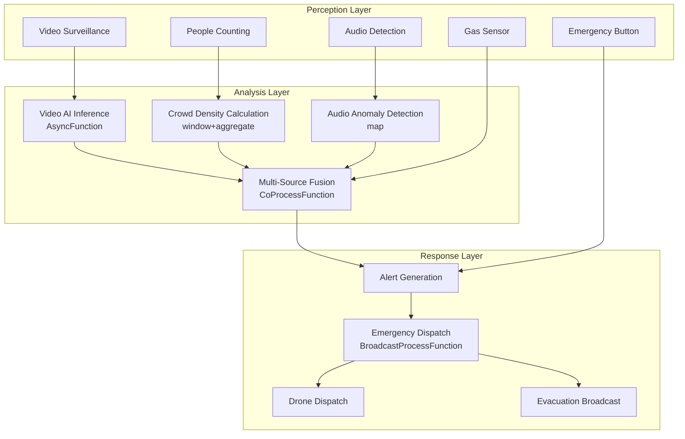

# Operators and Real-Time Public Safety

> **Stage**: Knowledge/10-case-studies | **Prerequisites**: [01.10-process-and-async-operators.md](01.10-process-and-async-operators.md), [operator-edge-computing-integration.md](operator-edge-computing-integration.md) | **Formalization Level**: L3
> **Document Positioning**: Operator fingerprints and Pipeline design for stream processing operators in real-time urban security monitoring, emergency response, and crowd management
> **Version**: 2026.04

---

## Table of Contents

- [1. Concept Definitions](#1-concept-definitions)
- [2. Property Derivation](#2-property-derivation)
- [3. Relation Establishment](#3-relation-establishment)
- [4. Argumentation](#4-argumentation)
- [5. Formal Proof / Engineering Argument](#5-formal-proof--engineering-argument)
- [6. Example Validation](#6-example-validation)
- [7. Visualizations](#7-visualizations)
- [8. References](#8-references)

---

## 1. Concept Definitions

### Def-SAF-01-01: Urban Safety IoT (城市安全物联网)

Urban Safety IoT is a multi-modal sensing network deployed in urban public areas:

$$\text{UrbanSafetyIoT} = \{s_i : (\text{type}_i, \text{location}_i, \text{coverage}_i)\}_{i=1}^{n}$$

Sensor types: video surveillance, audio detection, gas detection, people counting, emergency buttons, and drones.

### Def-SAF-01-02: Crowd Density (人群密度)

Crowd Density is the number of gathered people per unit area:

$$\rho = \frac{N}{A}$$

where $N$ is the number of people and $A$ is the area. The critical density $\rho_{critical} \approx 4-6 \text{ persons/m}^2$; exceeding this value poses a stampede risk.

### Def-SAF-01-03: Anomalous Behavior Detection (异常行为检测)

Anomalous Behavior Detection is the identification of threatening actions from video/audio streams:

$$\text{Anomaly}(x) = \|f(x) - f_{normal}(x)\| > \theta_{anomaly}$$

where $f(x)$ is the behavioral feature vector and $f_{normal}$ is the normal behavior model.

### Def-SAF-01-04: Emergency Response Time (应急响应时间)

Emergency Response Time is the duration from event occurrence to arrival of emergency forces:

$$\text{ResponseTime} = T_{detection} + T_{dispatch} + T_{travel}$$

Target: $\text{ResponseTime} < 5 \text{ minutes}$ (urban center).

### Def-SAF-01-05: Situational Awareness Fusion (态势感知融合)

Multi-source data fusion forms a unified security situational map:

$$\text{Situation}_t = \text{Fusion}(\text{Video}_t, \text{Audio}_t, \text{Sensor}_t, \text{Social}_t)$$

---

## 2. Property Derivation

### Lemma-SAF-01-01: Crowd Evacuation Time

Crowd evacuation time follows the Togawa model:

$$T_{evac} = \frac{N}{W \cdot v_{flow}} + \frac{L}{v_{walk}}$$

where $W$ is the exit width, $v_{flow}$ is the flow velocity (approximately 1.3 m/s), and $L$ is the distance to the exit.

### Lemma-SAF-01-02: Video Analysis Computational Complexity

The computational load for single-frame video analysis:

$$C = O(H \cdot W \cdot D \cdot K^2)$$

where $H \times W$ is the resolution, $D$ is the network depth, and $K$ is the convolution kernel size. Real-time analysis of 4K video requires GPU acceleration.

### Prop-SAF-01-01: Edge Computing Bandwidth Saving

$$\text{BandwidthSaving} = 1 - \frac{V_{metadata}}{V_{raw}}$$

where $V_{metadata}$ is the analysis result data volume and $V_{raw}$ is the raw video data volume. Typical values: raw video 100 Mbps, analysis result 1 Kbps, saving 99.999%.

### Prop-SAF-01-02: Multi-Sensor Fusion Detection Rate Improvement

$$P_{fusion} = 1 - \prod_{i}(1 - P_i)$$

where $P_i$ is the detection rate of the $i$-th sensor. Three independent sensors each with 90% detection rate achieve 99.9% detection rate after fusion.

---

## 3. Relation Establishment

### 3.1 Public Safety Pipeline Operator Mapping

| Application Scenario | Operator Combination | Data Source | Latency Requirement |
|---------|---------|--------|---------|
| **Video Surveillance** | Source + AsyncFunction | Camera | < 500ms |
| **People Counting** | window + aggregate | People counter sensor | < 5s |
| **Anomaly Detection** | Async ML + ProcessFunction | Video/Audio | < 2s |
| **Emergency Response** | CEP + Broadcast | Multi-source events | < 1s |
| **Drone Dispatch** | Broadcast + ProcessFunction | Task commands | < 1s |
| **Situational Fusion** | CoProcessFunction | Multi-modal | < 10s |

### 3.2 Operator Fingerprints

| Dimension | Public Safety Characteristics |
|------|------------|
| **Core Operators** | AsyncFunction (ML inference), ProcessFunction (state machine), BroadcastProcessFunction (emergency commands), CEP (event patterns), CoProcessFunction (multi-source fusion) |
| **State Types** | ValueState (area headcount), MapState (device status), BroadcastState (emergency strategies) |
| **Time Semantics** | Processing time as primary (emergency response emphasizes real-time performance) |
| **Data Characteristics** | High concurrency (ten-thousand-level cameras), high sensitivity (security & privacy), multi-modal (video/audio/sensors) |
| **State Hotspots** | Hot area keys, large event keys |
| **Performance Bottlenecks** | Video ML inference, multi-source data fusion |

---

## 4. Argumentation

### 4.1 Why Public Safety Requires Stream Processing Rather Than Traditional Monitoring

Problems with traditional monitoring:

- Post-event playback: reviewing recordings after an incident occurs, unable to intervene in real time
- Manual screen watching: monitor fatigue leads to missed detections
- Data silos: each system operates independently without coordination

Advantages of stream processing:

- Real-time detection: anomalous behavior identified within seconds
- Automatic alerting: no need for manual screen watching
- Multi-system coordination: detection → alerting → dispatch → handling automation

### 4.2 Privacy Protection Challenges

**Problem**: Video surveillance involves personal privacy.

**Solutions**:

1. **Edge Processing**: video is analyzed at edge nodes; only analysis results are uploaded
2. **Anonymization**: face blurring, retaining only behavioral features
3. **Data Minimization**: retain only alert-before and alert-after fragments; routine video is not stored

### 4.3 Large-Scale Event Security Assurance

**Scenario**: New Year's Eve gala site with 100,000 people gathered.

**Stream Processing Solution**:

1. **Real-time Crowd Density**: multi-point people counting aggregation
2. **Anomalous Gathering Detection**: alert when density in a certain area suddenly rises
3. **Evacuation Path Planning**: real-time computation of optimal evacuation paths
4. **Drone Patrol**: automatic drone dispatch to alert areas

---

## 5. Formal Proof / Engineering Argument

### 5.1 Real-Time Anomaly Detection Pipeline

```java
// Video frame stream
DataStream<VideoFrame> video = env.addSource(new CameraSource());

// Asynchronous AI inference
DataStream<DetectionResult> detections = AsyncDataStream.unorderedWait(
    video,
    new ObjectDetectionFunction(),
    Time.milliseconds(200),
    100
);

// Anomalous behavior recognition
detections.keyBy(DetectionResult::getCameraId)
    .process(new KeyedProcessFunction<String, DetectionResult, SafetyAlert>() {
        private ValueState<BehaviorHistory> behaviorState;

        @Override
        public void processElement(DetectionResult det, Context ctx, Collector<SafetyAlert> out) throws Exception {
            BehaviorHistory history = behaviorState.value();
            if (history == null) history = new BehaviorHistory();

            history.addDetection(det);

            // Detect anomalous behavior patterns
            if (history.hasFightingPattern()) {
                out.collect(new SafetyAlert(det.getCameraId(), "FIGHTING", det.getConfidence(), ctx.timestamp()));
            } else if (history.hasIntrusionPattern()) {
                out.collect(new SafetyAlert(det.getCameraId(), "INTRUSION", det.getConfidence(), ctx.timestamp()));
            } else if (history.hasAbandonedObject()) {
                out.collect(new SafetyAlert(det.getCameraId(), "ABANDONED_OBJECT", det.getConfidence(), ctx.timestamp()));
            }

            behaviorState.update(history);
        }
    })
    .addSink(new AlertDispatchSink());
```

### 5.2 Real-Time Crowd Density Monitoring

```java
// Multi-source people flow data
DataStream<PeopleCount> counts = env.addSource(new PeopleCounterSource());

// Area density calculation
counts.keyBy(PeopleCount::getZoneId)
    .window(SlidingProcessingTimeWindows.of(Time.minutes(1), Time.seconds(10)))
    .aggregate(new DensityAggregate())
    .process(new ProcessFunction<DensityResult, DensityAlert>() {
        @Override
        public void processElement(DensityResult density, Context ctx, Collector<DensityAlert> out) {
            double rho = density.getDensity();

            if (rho > 6.0) {
                out.collect(new DensityAlert(density.getZoneId(), "CRITICAL", rho, ctx.timestamp()));
            } else if (rho > 4.0) {
                out.collect(new DensityAlert(density.getZoneId(), "WARNING", rho, ctx.timestamp()));
            }
        }
    })
    .addSink(new DensityDashboardSink());
```

### 5.3 Emergency Response Automatic Dispatch

```java
// Safety alert stream
DataStream<SafetyAlert> alerts = env.addSource(new AlertSource());

// Emergency resource status (Broadcast)
DataStream<EmergencyResource> resources = env.addSource(new ResourceStatusSource());

// Automatic dispatch
alerts.connect(resources.broadcast())
    .process(new BroadcastProcessFunction<SafetyAlert, EmergencyResource, DispatchOrder>() {
        @Override
        public void processElement(SafetyAlert alert, ReadOnlyContext ctx, Collector<DispatchOrder> out) {
            ReadOnlyBroadcastState<String, EmergencyResource> resourceState = ctx.getBroadcastState(RESOURCE_DESCRIPTOR);

            // Find the nearest available resource
            EmergencyResource nearest = null;
            double minDistance = Double.MAX_VALUE;

            for (Map.Entry<String, EmergencyResource> entry : resourceState.immutableEntries()) {
                EmergencyResource res = entry.getValue();
                if (!res.isAvailable()) continue;

                double dist = calculateDistance(alert.getLocation(), res.getLocation());
                if (dist < minDistance) {
                    minDistance = dist;
                    nearest = res;
                }
            }

            if (nearest != null) {
                out.collect(new DispatchOrder(
                    nearest.getId(),
                    alert.getLocation(),
                    alert.getType(),
                    alert.getTimestamp()
                ));
            }
        }

        @Override
        public void processBroadcastElement(EmergencyResource resource, Context ctx, Collector<DispatchOrder> out) {
            ctx.getBroadcastState(RESOURCE_DESCRIPTOR).put(resource.getId(), resource);
        }
    })
    .addSink(new DispatchSink());
```

---

## 6. Example Validation

### 6.1 Practical Case: Large-Scale Event Security Assurance System

```java
// 1. Multi-modal data ingestion
DataStream<VideoFrame> video = env.addSource(new CameraSource());
DataStream<PeopleCount> people = env.addSource(new PeopleCounterSource());
DataStream<AudioEvent> audio = env.addSource(new AudioSensorSource());

// 2. Video anomaly detection
DataStream<SafetyAlert> videoAlerts = AsyncDataStream.unorderedWait(
    video,
    new VideoAnalysisFunction(),
    Time.milliseconds(200),
    100
);

// 3. Crowd density monitoring
DataStream<DensityAlert> densityAlerts = people
    .keyBy(PeopleCount::getZoneId)
    .window(SlidingProcessingTimeWindows.of(Time.minutes(1), Time.seconds(10)))
    .aggregate(new DensityAggregate())
    .filter(d -> d.getDensity() > 4.0);

// 4. Audio anomaly detection
DataStream<SafetyAlert> audioAlerts = audio
    .map(new AudioFeatureExtractor())
    .filter(f -> f.getAnomalyScore() > 0.8);

// 5. Fusion alerting
videoAlerts.union(densityAlerts.map(a -> new SafetyAlert(a.getZoneId(), "CROWD", a.getDensity(), a.getTimestamp())))
    .union(audioAlerts)
    .keyBy(SafetyAlert::getZoneId)
    .window(TumblingProcessingTimeWindows.of(Time.seconds(5)))
    .aggregate(new AlertFusionAggregate())
    .addSink(new CommandCenterSink());
```

### 6.2 Practical Case: Smart Campus Security Management

```java
// Access control event stream
DataStream<AccessEvent> access = env.addSource(new AccessControlSource());

// Anomalous access detection
access.keyBy(AccessEvent::getPersonId)
    .process(new KeyedProcessFunction<String, AccessEvent, SecurityAlert>() {
        private ValueState<AccessPattern> patternState;

        @Override
        public void processElement(AccessEvent event, Context ctx, Collector<SecurityAlert> out) throws Exception {
            AccessPattern pattern = patternState.value();
            if (pattern == null) pattern = new AccessPattern();

            pattern.addEvent(event);

            // Detect anomaly: entering sensitive area outside work hours
            if (event.isSensitiveArea() && !event.isWorkHours()) {
                out.collect(new SecurityAlert(event.getPersonId(), "OFF_HOUR_ACCESS", event.getLocation(), ctx.timestamp()));
            }

            // Detect anomaly: multiple failed attempts within a short time
            if (pattern.getFailedAttempts(300000) > 3) {
                out.collect(new SecurityAlert(event.getPersonId(), "BRUTE_FORCE", event.getLocation(), ctx.timestamp()));
            }

            patternState.update(pattern);
        }
    })
    .addSink(new SecurityAlertSink());
```

---

## 7. Visualizations

### Public Safety Pipeline



---

## 8. References

[^1]: Togawa K., "Study on Fire Escapes Basing on the Observation of Mustering Behaviour", Journal of the Architecture Institute of Japan, 1955.

[^2]: Apache Flink Documentation, "Broadcast State Pattern", 2025. https://nightlies.apache.org/flink/flink-docs-stable/docs/dev/datastream/fault-tolerance/broadcast_state/

[^3]: S. S. Cheung et al., "Video Surveillance System for Public Safety: A Review", IEEE Transactions on Circuits and Systems for Video Technology, 2021.

[^4]: General Data Protection Regulation (GDPR), "Video Surveillance and Data Protection", Official Journal of the European Union, 2016.

---

*Related Documents*: [01.10-process-and-async-operators.md](01.10-process-and-async-operators.md) | [operator-edge-computing-integration.md](operator-edge-computing-integration.md) | [realtime-content-moderation-case-study.md](realtime-content-moderation-case-study.md)
