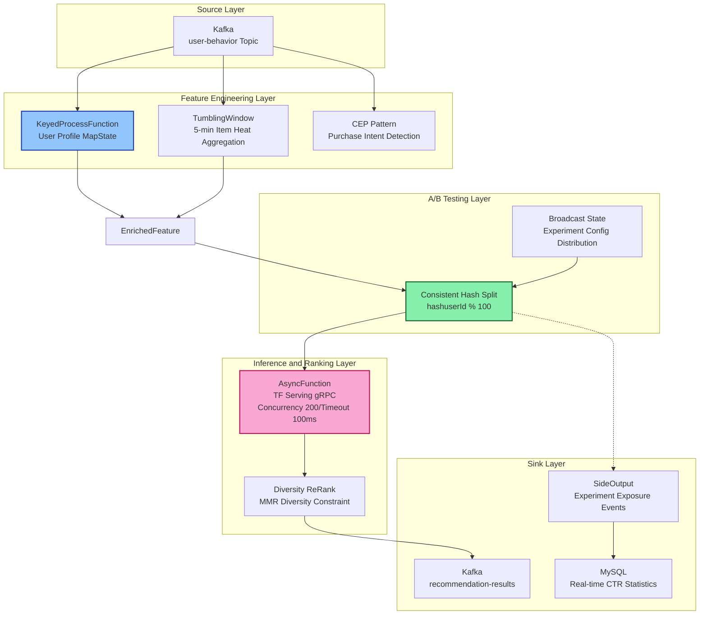
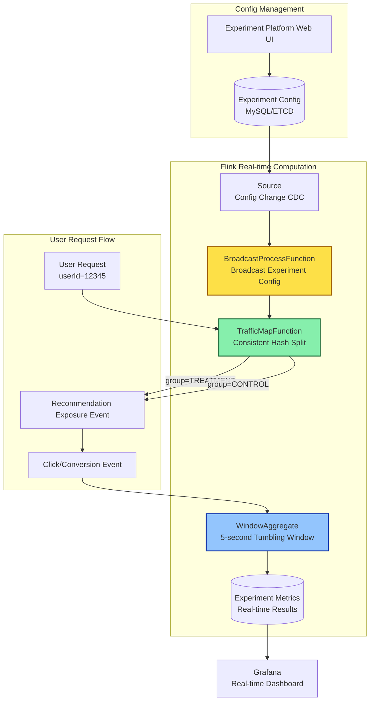

# Streaming Operators and Real-time Recommendation System Case Study

> Stage: Knowledge/10-case-studies | Prerequisites: [Flink Async I/O and External System Interaction](../Flink/03-api/flink-async-io-external-systems.md), [Complex Event Processing Patterns](../Knowledge/02-design-patterns/streaming-cep-patterns.md) | Formalization Level: L4 (Engineering Argument + Code Verification) | Last Updated: 2026-04-30

---

## Table of Contents

- [Streaming Operators and Real-time Recommendation System Case Study](#streaming-operators-and-real-time-recommendation-system-case-study)
  - [Table of Contents](#table-of-contents)
  - [1. Concept Definitions](#1-concept-definitions)
    - [1.1 Real-time Recommendation System](#11-real-time-recommendation-system)
    - [1.2 Behavioral Event Types](#12-behavioral-event-types)
    - [1.3 Feature Triple](#13-feature-triple)
    - [1.4 Operator Fingerprint](#14-operator-fingerprint)
  - [2. Property Derivation](#2-property-derivation)
    - [2.1 Feature Timeliness Lemma](#21-feature-timeliness-lemma)
    - [2.2 State Size Upper Bound](#22-state-size-upper-bound)
    - [2.3 Asynchronous Inference Throughput](#23-asynchronous-inference-throughput)
  - [3. Relationship Establishment](#3-relationship-establishment)
    - [3.1 Mapping to Lambda Architecture](#31-mapping-to-lambda-architecture)
    - [3.2 Comparison with Netflix Recommendation Architecture](#32-comparison-with-netflix-recommendation-architecture)
    - [3.3 Relationship with Feature Store](#33-relationship-with-feature-store)
  - [4. Argumentation Process](#4-argumentation-process)
    - [4.1 Model Inference Latency Bottleneck Analysis](#41-model-inference-latency-bottleneck-analysis)
    - [4.2 State Hotspot Problem](#42-state-hotspot-problem)
    - [4.3 CEP Behavioral Pattern Recognition](#43-cep-behavioral-pattern-recognition)
  - [5. Formal Proof / Engineering Argument](#5-formal-proof--engineering-argument)
    - [5.1 A/B Testing Traffic Split Correctness Argument](#51-ab-testing-traffic-split-correctness-argument)
    - [5.2 Real-time Feature Consistency Argument](#52-real-time-feature-consistency-argument)
  - [6. Example Verification](#6-example-verification)
    - [6.1 Complete Flink Real-time Recommendation Pipeline](#61-complete-flink-real-time-recommendation-pipeline)
    - [6.2 CEP Behavioral Pattern Detection Example](#62-cep-behavioral-pattern-detection-example)
    - [6.3 Experiment Metrics Real-time Statistics SQL](#63-experiment-metrics-real-time-statistics-sql)
  - [7. Visualizations](#7-visualizations)
    - [7.1 Real-time Recommendation Pipeline DAG](#71-real-time-recommendation-pipeline-dag)
    - [7.2 Real-time Feature Engineering Flow](#72-real-time-feature-engineering-flow)
    - [7.3 A/B Testing Real-time Architecture](#73-ab-testing-real-time-architecture)
  - [8. References](#8-references)

## 1. Concept Definitions

### 1.1 Real-time Recommendation System

**Def-REC-01-01** (Real-time Recommendation System, 实时推荐系统). A Real-time Recommendation System (实时推荐系统) is a triple $\mathcal{R} = (\mathcal{E}, \mathcal{F}, \mathcal{M})$, where:

- $\mathcal{E}$ is the user behavioral event stream, $\mathcal{E} = \{e_t = (u, i, a, c, \tau) \mid t \in \mathbb{T}\}$, where $u$ is the user ID, $i$ is the item ID, $a$ is the action type (click/view/purchase/favorite), $c$ is the context, and $\tau$ is the event timestamp;
- $\mathcal{F}$ is the family of feature mapping functions, $\mathcal{F} = \{f_u, f_i, f_c\}$, corresponding to user features, item features, and context features respectively;
- $\mathcal{M}$ is the recommendation model, $\mathcal{M}: \mathcal{F}(u) \times \mathcal{F}(i) \times \mathcal{F}(c) \rightarrow \mathbb{R}^{|I|}$, outputting candidate item ranking scores.

The core constraint of a Real-time Recommendation System (实时推荐系统) is **End-to-End Latency** $L_{e2e} = t_{sink} - t_{event} \leq L_{SLA}$. In typical e-commerce scenarios, $L_{SLA} \leq 200\,\text{ms}$ (P99) [^1].

### 1.2 Behavioral Event Types

**Def-REC-01-02** (User Behavioral Event, 用户行为事件). A user behavioral event $e$ is defined as a quintuple:
$$e := \langle \text{userId}, \text{itemId}, \text{action}, \text{context}, \text{timestamp} \rangle$$

where the action type $\text{action} \in \{\text{CLICK}, \text{VIEW}, \text{PURCHASE}, \text{FAVORITE}, \text{CART}, \text{DWELL}\}$. The DWELL event represents page dwell time. Netflix research indicates that user dwell time is a more accurate preference signal than explicit ratings [^2].

### 1.3 Feature Triple

**Def-REC-01-03** (Real-time Feature Triple, 实时特征三元组). Real-time recommendation features consist of three components:

- **User Features** $\phi_u$: real-time interest preference vector, recent browsing sequence $\text{Seq}_u = [i_{t-k}, \dots, i_t]$, purchasing power tier, and price sensitivity;
- **Item Features** $\phi_i$: real-time popularity score, inventory status, price change rate, and category affiliation;
- **Context Features** $\phi_c$: time slot (morning/noon/evening/late night), geographic location (GPS/city level), device type (iOS/Android/Web), and network environment.

### 1.4 Operator Fingerprint

**Def-REC-01-04** (Operator Fingerprint, 算子指纹). An Operator Fingerprint (算子指纹) is a tuple $\psi = (\text{type}, \text{statePattern}, \text{latencyProfile}, \text{hotspotRisk})$ describing the runtime characteristics of a streaming operator in the recommendation Pipeline:

- $\text{type} \in \{\text{AsyncFunction}, \text{WindowAggregate}, \text{CEP}, \text{KeyedProcess}\}$;
- $\text{statePattern}$: state access pattern (MapState/ValueState/ListState/BroadcastState);
- $\text{latencyProfile}$: operator processing latency distribution;
- $\text{hotspotRisk} \in [0, 1]$: hotspot risk coefficient caused by data skew.

---

## 2. Property Derivation

### 2.1 Feature Timeliness Lemma

**Lemma-REC-01-01** (Feature Timeliness Decay, 特征时效衰减). Let $V(\phi_u, t)$ be the timeliness value of user interest feature $\phi_u(t)$ at time $t$. Then for time decay factor $\lambda > 0$:
$$V(\phi_u, t) = V_0 \cdot e^{-\lambda(t - t_{last})}$$

where $t_{last}$ is the user's most recent behavior time. When $\lambda = 0.001\,\text{s}^{-1}$, the timeliness value of a behavioral feature from 1 minute ago decays to $94\%$ of its original value, and after 10 minutes decays to $55\%$. **Corollary**: The real-time feature update period must satisfy $\Delta t \ll 1/\lambda$; otherwise, recommendation results will significantly deviate from the user's current intent.

### 2.2 State Size Upper Bound

**Lemma-REC-01-02** (User Profile State Size, 用户画像状态规模). Let $N_{active}$ be the number of active users in the system, and let each user's MapState store $K$ category preference key-value pairs. Then the total state size is:
$$|\text{State}_{total}| = N_{active} \times K \times (|\text{key}| + |\text{value}|)$$

For the scenario with $N_{active} = 10^7$, $K = 50$, and average key-value size of 16 bytes, $|\text{State}_{total}| \approx 16\,\text{GB}$. When using RocksDB incremental Checkpoint (default 5-minute interval), the single Checkpoint data volume is approximately $10\%$-$30\%$ of the state increment [^3].

### 2.3 Asynchronous Inference Throughput

**Prop-REC-01-01** (AsyncFunction Throughput Lower Bound, AsyncFunction吞吐量下界). Let $l_{sync}$ be the synchronous inference latency and $C$ be the asynchronous inference concurrency. Then the effective throughput improvement factor of asynchronous inference is:
$$\eta = \frac{\text{Throughput}_{async}}{\text{Throughput}_{sync}} \approx \frac{C \cdot l_{sync}}{l_{sync} + l_{queue}}$$

where $l_{queue}$ is the request queuing latency. When $C = 100$, $l_{sync} = 50\,\text{ms}$, and $l_{queue} = 5\,\text{ms}$, $\eta \approx 90$. **Prerequisite**: The model serving cluster must have horizontal scaling capability to support $C$-way concurrency.

---

## 3. Relationship Establishment

### 3.1 Mapping to Lambda Architecture

The mapping between the real-time recommendation Pipeline and the classic Lambda Architecture is as follows:

| Lambda Layer | Real-time Recommendation Component | Technical Implementation |
|---------|-----------|---------|
| Batch Layer | Offline Feature Pre-computation | Spark/Flink Batch → Hive/HBase |
| Speed Layer | Real-time Feature Incremental Update | Flink Streaming + Keyed State |
| Serving Layer | Feature Storage and Model Inference | Redis/FeatureStore + TF Serving |

Alibaba Lingyang team practice shows that feature computation can adopt a **Pre-computation Scheme** (Flink pre-aggregates by day/hour/minute dimensions and stores in HBase) or a **Full-computation Scheme** (Flink directly computes sliding window aggregations and writes to HBase). The former has lower server-side aggregation pressure but less flexibility, while the latter offers higher flexibility at greater computational cost [^4].

### 3.2 Comparison with Netflix Recommendation Architecture

Netflix adopts a hybrid architecture: batch processing pre-computes homepage row layouts, while real-time context (recently watched video) is used for re-ranking within rows [^5]. Its event stream processes over $10^{11}$ events daily, transmitted via Kafka, with Apache Flink and Spark responsible for stream and batch processing [^6].

Comparison with the pure real-time Pipeline in this case study:

- **Netflix**: Batch pre-computation + real-time re-ranking, with higher latency tolerance (second-level), prioritizing throughput;
- **This Case Study**: Full real-time Pipeline, with end-to-end latency constraint $< 200\,\text{ms}$, prioritizing low latency.

### 3.3 Relationship with Feature Store

Modern Feature Store (Tecton, Feast, Hopsworks) plays the role of eliminating Training-Serving Skew in recommendation systems [^7]. The Flink real-time feature stream serves as the **Streaming Feature Source** of the Feature Store, together with offline batch features (Batch Feature) constituting the Feature View:
$$\text{FeatureView} = \text{BatchFeature}(\text{Spark}) \bowtie \text{StreamingFeature}(\text{Flink})$$

---

## 4. Argumentation Process

### 4.1 Model Inference Latency Bottleneck Analysis

The performance bottleneck of a real-time recommendation Pipeline is typically located at the **model inference stage**. Assume the following latency distribution across Pipeline stages:

| Stage | Typical Latency | Bottleneck Level |
|-----|---------|---------|
| Kafka Consume → Source | 1-5 ms | Low |
| Feature Engineering (State Read + Compute) | 5-20 ms | Medium |
| Candidate Retrieval (Vector Search) | 10-30 ms | Medium |
| **Model Inference (TF Serving gRPC)** | **30-100 ms** | **High** |
| Re-ranking + Rule Filtering | 5-15 ms | Medium |
| Sink → Redis/Kafka | 1-5 ms | Low |

**Argument**: Model inference accounts for $40\%$-$60\%$ of total latency and is the primary target for end-to-end latency optimization. Optimization strategies include: (1) Async I/O converting serial waiting to parallel concurrency; (2) Local caching of high-frequency user features to reduce RPC; (3) Model quantization (INT8) to reduce per-inference computation; (4) Batch Inference to amortize RPC overhead.

### 4.2 State Hotspot Problem

The hotspot of user profile MapState manifests as **Key Skew**: a small number of super users (e.g., operation accounts, crawlers) generate event volumes far exceeding ordinary users, causing state bloat and Checkpoint timeout on specific Task nodes. In Alibaba's practice, custom state operators compared to official sliding windows perform aggregation on the same day/hour/minute computation state, achieving better job stability and Checkpoint success rate [^4].

### 4.3 CEP Behavioral Pattern Recognition

Complex Event Processing (CEP, 复杂事件处理) is used to identify high-value user behavioral patterns, such as:

- **Purchase Intent Pattern**: VIEW(item A) → CART(item A) → VIEW(accessory B) occurring within 5 minutes
- **Churn Warning Pattern**: No subsequent behavior for more than 10 minutes after 3 consecutive clicks
- **Abuse Pattern**: The same device using 3 different accounts to claim newcomer coupons within 1 minute

CEP pattern matching is implemented via NFA (Nondeterministic Finite Automaton, 非确定有限自动机), with time complexity proportional to pattern length $m$ and event window $W$: $O(m \cdot |E_W|)$, where $|E_W|$ is the number of events within the window.

---

## 5. Formal Proof / Engineering Argument

### 5.1 A/B Testing Traffic Split Correctness Argument

**Thm-REC-01-01** (Traffic Split Consistency, 流量分流一致性). Let $\mathcal{U}$ be the user ID space, and let the experiment group assignment function be $h: \mathcal{U} \rightarrow \{A, B\}$ implemented via consistent hashing. Then for any user $u \in \mathcal{U}$ and any times $t_1, t_2$:
$$h(u, t_1) = h(u, t_2) = \text{const}$$

**Engineering Argument**:

1. Hash function $h(u) = \text{hash}(u) \bmod 100$, uniformly mapping the user space to $[0, 99]$;
2. Experiment group A is assigned interval $[0, 49]$, experiment group B interval $[50, 99]$, with traffic ratio $50:50$;
3. Due to the determinism of the hash function, the hash value of the same user $u$ is constant, guaranteeing **same user, same group** (Sticky Assignment);
4. When experiment configuration changes, new configurations are broadcast via Broadcast State, with Flink Checkpoint ensuring consistency of configuration updates.

**Boundary Conditions**: If user ID distribution is uneven (e.g., continuous auto-increment IDs), high-quality hash functions such as MurmurHash3 should be used to disperse them; if multi-layer orthogonal experiments (orthogonal layering) are required, different hash seeds are adopted to ensure inter-layer independence.

### 5.2 Real-time Feature Consistency Argument

**Thm-REC-01-02** (Feature Consistency Lower Bound, 特征一致性下界). Let $S_{feat}$ be the feature update stream, $S_{infer}$ be the model inference request stream, $l_{write}$ be the feature storage write latency, and $l_{read}$ be the read latency. Then the freshness of features used for inference satisfies:
$$\text{freshness} = t_{infer} - t_{feat\_update} \geq l_{write} + l_{read}$$

**Engineering Argument**:

1. Inside Flink, real-time features are maintained using Keyed State, with State access latency $< 1\,\text{ms}$ (in-memory) or $< 5\,\text{ms}$ (RocksDB), far less than external storage;
2. In this case study, feature engineering and model inference are placed within the same Flink Job, with features passed directly via DataStream, so $l_{write} \approx 0$ (no external write required);
3. Therefore, freshness is mainly determined by inference asynchronous wait time, reaching **millisecond-level**;
4. Compared to the separated architecture (Flink → Kafka → Inference Service), freshness is typically second-level, improving by $2$-$3$ orders of magnitude.

---

## 6. Example Verification

### 6.1 Complete Flink Real-time Recommendation Pipeline

The following code demonstrates a complete real-time recommendation Pipeline from Source to Sink, covering feature engineering, asynchronous model inference, A/B testing traffic split, and result output:

```java
package com.example.flink.reco;

import org.apache.flink.api.common.eventtime.WatermarkStrategy;
import org.apache.flink.api.common.functions.RichMapFunction;
import org.apache.flink.api.common.state.*;
import org.apache.flink.configuration.Configuration;
import org.apache.flink.streaming.api.datastream.*;
import org.apache.flink.streaming.api.environment.StreamExecutionEnvironment;
import org.apache.flink.streaming.api.functions.async.AsyncFunction;
import org.apache.flink.streaming.api.functions.async.ResultFuture;
import org.apache.flink.streaming.api.functions.co.BroadcastProcessFunction;
import org.apache.flink.streaming.api.functions.windowing.ProcessWindowFunction;
import org.apache.flink.streaming.api.windowing.assigners.TumblingEventTimeWindows;
import org.apache.flink.streaming.api.windowing.time.Time;
import org.apache.flink.streaming.api.windowing.windows.TimeWindow;
import org.apache.flink.streaming.connectors.kafka.FlinkKafkaConsumer;
import org.apache.flink.streaming.connectors.kafka.FlinkKafkaProducer;
import org.apache.flink.util.Collector;

import java.util.*;
import java.util.concurrent.CompletableFuture;
import java.util.concurrent.TimeUnit;

/**
 * Real-time Recommendation System Main Pipeline
 * Source(Kafka) -> Feature Engineering -> A/B Split -> Async Inference -> Result Merge -> Sink(Redis/Kafka)
 */
public class RealtimeRecommendationPipeline {

    public static void main(String[] args) throws Exception {
        StreamExecutionEnvironment env = StreamExecutionEnvironment.getExecutionEnvironment();
        env.enableCheckpointing(60000); // 1-minute Checkpoint
        env.getCheckpointConfig().setCheckpointingMode(CheckpointingMode.EXACTLY_ONCE);

        // ================== 1. Source: User Behavioral Event Stream ==================
        Properties kafkaProps = new Properties();
        kafkaProps.setProperty("bootstrap.servers", "kafka:9092");
        kafkaProps.setProperty("group.id", "realtime-reco-group");

        FlinkKafkaConsumer<UserBehaviorEvent> source = new FlinkKafkaConsumer<>(
                "user-behavior",
                new UserBehaviorEventSchema(),
                kafkaProps
        );

        DataStream<UserBehaviorEvent> behaviorStream = env
                .addSource(source)
                .assignTimestampsAndWatermarks(
                        WatermarkStrategy.<UserBehaviorEvent>forBoundedOutOfOrderness(
                                java.time.Duration.ofSeconds(5)
                        ).withIdleness(java.time.Duration.ofMinutes(1))
                );

        // ================== 2. Real-time Feature Engineering ==================
        DataStream<FeatureVector> featureStream = behaviorStream
                .keyBy(UserBehaviorEvent::getUserId)
                .process(new RealTimeFeatureExtractor());

        // ================== 3. Item Real-time Popularity Statistics (Window Aggregate) ==================
        DataStream<ItemHeatScore> heatStream = behaviorStream
                .filter(e -> e.getAction().equals("CLICK") || e.getAction().equals("PURCHASE"))
                .keyBy(UserBehaviorEvent::getItemId)
                .window(TumblingEventTimeWindows.of(Time.minutes(5)))
                .aggregate(new HeatScoreAggregate(), new HeatProcessWindowFunction());

        // ================== 4. A/B Testing Experiment Config Stream (Broadcast State) ==================
        DataStream<ExperimentConfig> expConfigStream = env
                .addSource(new ExperimentConfigSource())
                .broadcast(EXPERIMENT_STATE_DESCRIPTOR);

        // ================== 5. Feature + Heat + Experiment Config Join ==================
        DataStream<EnrichedFeature> enrichedStream = featureStream
                .keyBy(FeatureVector::getUserId)
                .connect(heatStream.keyBy(ItemHeatScore::getItemId))
                .process(new FeatureHeatJoinFunction())
                .keyBy(EnrichedFeature::getUserId)
                .connect(expConfigStream)
                .process(new ExperimentAssignmentFunction());

        // ================== 6. Async Model Inference (AsyncFunction -> TF Serving) ==================
        DataStream<RecommendationResult> recoResultStream = AsyncDataStream.unorderedWait(
                enrichedStream,
                new TensorFlowServingAsyncFunction("http://tf-serving:8501/v1/models/reco_model:predict"),
                100, // timeout 100ms
                TimeUnit.MILLISECONDS,
                200  // max concurrency 200
        );

        // ================== 7. Re-ranking and Filtering ==================
        DataStream<RecommendationResult> rankedStream = recoResultStream
                .keyBy(RecommendationResult::getUserId)
                .map(new DiversityReRankFunction(10)); // Top-10 diversity re-ranking

        // ================== 8. Sink: Recommendation Result Output ==================
        FlinkKafkaProducer<RecommendationResult> sink = new FlinkKafkaProducer<>(
                "recommendation-results",
                new RecommendationResultSchema(),
                kafkaProps
        );
        rankedStream.addSink(sink);

        // Side Output: experiment metrics statistics stream
        DataStream<ExperimentMetric> metricStream = rankedStream
                .getSideOutput(EXPERIMENT_METRIC_TAG);
        metricStream.addSink(new ExperimentMetricSink());

        env.execute("Realtime Recommendation Pipeline");
    }

    // ================== Core Operator Implementations ==================

    /**
     * Real-time Feature Extraction Operator (KeyedProcessFunction + MapState)
     */
    static class RealTimeFeatureExtractor
            extends KeyedProcessFunction<String, UserBehaviorEvent, FeatureVector> {

        private transient MapState<String, Integer> categoryClickCount;
        private transient ListState<String> recentItemSequence;
        private transient ValueState<Long> sessionStartTime;

        @Override
        public void open(Configuration parameters) {
            MapStateDescriptor<String, Integer> catDesc = new MapStateDescriptor<>(
                    "category-click-count", String.class, Integer.class
            );
            categoryClickCount = getRuntimeContext().getMapState(catDesc);

            ListStateDescriptor<String> seqDesc = new ListStateDescriptor<>(
                    "recent-sequence", String.class
            );
            recentItemSequence = getRuntimeContext().getListState(seqDesc);

            ValueStateDescriptor<Long> sessionDesc = new ValueStateDescriptor<>(
                    "session-start", Long.class
            );
            sessionStartTime = getRuntimeContext().getState(sessionDesc);
        }

        @Override
        public void processElement(UserBehaviorEvent event, Context ctx,
                                   Collector<FeatureVector> out) throws Exception {
            String userId = ctx.getCurrentKey();
            long currentTs = ctx.timestamp();

            // 1. Update category preference (MapState)
            String category = event.getCategoryId();
            int count = categoryClickCount.get(category) != null
                    ? categoryClickCount.get(category) : 0;
            categoryClickCount.put(category, count + 1);

            // 2. Maintain recent browsing sequence (ListState, keep last 20)
            Iterable<String> seq = recentItemSequence.get();
            List<String> seqList = new ArrayList<>();
            seq.forEach(seqList::add);
            seqList.add(event.getItemId());
            if (seqList.size() > 20) seqList.remove(0);
            recentItemSequence.update(seqList);

            // 3. Session duration calculation
            if (sessionStartTime.value() == null) {
                sessionStartTime.update(currentTs);
            }
            long sessionDuration = currentTs - sessionStartTime.value();

            // 4. Build feature vector
            FeatureVector fv = new FeatureVector();
            fv.setUserId(userId);
            fv.setTimestamp(currentTs);
            fv.setCategoryPrefs(buildCategoryMap(categoryClickCount));
            fv.setRecentSequence(new ArrayList<>(seqList));
            fv.setSessionDurationMs(sessionDuration);
            fv.setContextDevice(event.getDeviceType());
            fv.setContextHour(getHourOfDay(currentTs));
            fv.setContextCity(event.getCityCode());

            out.collect(fv);
        }

        private Map<String, Integer> buildCategoryMap(MapState<String, Integer> state) throws Exception {
            Map<String, Integer> map = new HashMap<>();
            for (Map.Entry<String, Integer> e : state.entries()) {
                map.put(e.getKey(), e.getValue());
            }
            return map;
        }

        private int getHourOfDay(long ts) {
            return new java.util.Date(ts).getHours();
        }
    }

    /**
     * Popularity Score Aggregation Operator (Window Aggregate)
     */
    static class HeatScoreAggregate
            implements AggregateFunction<UserBehaviorEvent, ItemHeatAccumulator, ItemHeatScore> {
        @Override
        public ItemHeatAccumulator createAccumulator() {
            return new ItemHeatAccumulator();
        }

        @Override
        public ItemHeatAccumulator add(UserBehaviorEvent event, ItemHeatAccumulator acc) {
            acc.itemId = event.getItemId();
            acc.clickCount++;
            if (event.getAction().equals("PURCHASE")) acc.purchaseCount++;
            acc.totalDwellMs += event.getDwellTimeMs();
            return acc;
        }

        @Override
        public ItemHeatScore getResult(ItemHeatAccumulator acc) {
            double score = acc.clickCount * 1.0 + acc.purchaseCount * 5.0
                    + acc.totalDwellMs / 1000.0 * 0.5;
            return new ItemHeatScore(acc.itemId, score, acc.clickCount);
        }

        @Override
        public ItemHeatAccumulator merge(ItemHeatAccumulator a, ItemHeatAccumulator b) {
            a.clickCount += b.clickCount;
            a.purchaseCount += b.purchaseCount;
            a.totalDwellMs += b.totalDwellMs;
            return a;
        }
    }

    static class HeatProcessWindowFunction
            extends ProcessWindowFunction<ItemHeatScore, ItemHeatScore, String, TimeWindow> {
        @Override
        public void process(String key, Context ctx, Iterable<ItemHeatScore> elements,
                           Collector<ItemHeatScore> out) {
            elements.forEach(out::collect);
        }
    }

    /**
     * A/B Testing Experiment Assignment Operator (Broadcast State)
     */
    static class ExperimentAssignmentFunction
            extends BroadcastProcessFunction<EnrichedFeature, ExperimentConfig, EnrichedFeature> {

        @Override
        public void processElement(EnrichedFeature feature, ReadOnlyContext ctx,
                                   Collector<EnrichedFeature> out) throws Exception {
            ReadOnlyBroadcastState<String, ExperimentConfig> state =
                    ctx.getBroadcastState(EXPERIMENT_STATE_DESCRIPTOR);

            ExperimentConfig config = state.get("active_experiment");
            if (config == null) {
                feature.setExperimentGroup("CONTROL");
                out.collect(feature);
                return;
            }

            // Consistent hashing split: hash(userId) % 100 < trafficPercent ? TREATMENT : CONTROL
            int hash = Math.abs(feature.getUserId().hashCode()) % 100;
            String group = hash < config.getTrafficPercent() ? "TREATMENT" : "CONTROL";
            feature.setExperimentGroup(group);
            feature.setExperimentId(config.getExperimentId());

            // Side Output: output experiment exposure event for metrics statistics
            ctx.output(EXPERIMENT_METRIC_TAG, new ExperimentMetric(
                    feature.getUserId(), config.getExperimentId(), group,
                    "EXPOSURE", System.currentTimeMillis()
            ));

            out.collect(feature);
        }

        @Override
        public void processBroadcastElement(ExperimentConfig config, Context ctx,
                                            Collector<EnrichedFeature> out) throws Exception {
            ctx.getBroadcastState(EXPERIMENT_STATE_DESCRIPTOR).put("active_experiment", config);
        }
    }

    /**
     * TensorFlow Serving Async Inference Operator
     */
    static class TensorFlowServingAsyncFunction
            implements AsyncFunction<EnrichedFeature, RecommendationResult> {

        private final String modelUrl;
        private transient TFServingClient tfClient;

        public TensorFlowServingAsyncFunction(String modelUrl) {
            this.modelUrl = modelUrl;
        }

        @Override
        public void open(Configuration parameters) {
            this.tfClient = new TFServingClient(modelUrl, 50); // connection pool 50
        }

        @Override
        public void asyncInvoke(EnrichedFeature feature, ResultFuture<RecommendationResult> resultFuture) {
            CompletableFuture.supplyAsync(() -> {
                try {
                    // Assemble gRPC request: userFeatures + itemFeatures + contextFeatures
                    float[] userFeats = feature.toUserFeatureArray();
                    float[] itemFeats = feature.toItemFeatureArray();
                    float[] ctxFeats = feature.toContextFeatureArray();

                    // Call TF Serving to get Top-K candidate scores
                    float[] scores = tfClient.predict(userFeats, itemFeats, ctxFeats);

                    RecommendationResult result = new RecommendationResult();
                    result.setUserId(feature.getUserId());
                    result.setScores(scores);
                    result.setExperimentGroup(feature.getExperimentGroup());
                    result.setTimestamp(System.currentTimeMillis());

                    return result;
                } catch (Exception e) {
                    // Return empty result on inference failure, handled by downstream
                    RecommendationResult fallback = new RecommendationResult();
                    fallback.setUserId(feature.getUserId());
                    fallback.setScores(new float[0]);
                    return fallback;
                }
            }).thenAccept(result -> resultFuture.complete(Collections.singletonList(result)));
        }

        @Override
        public void timeout(EnrichedFeature feature, ResultFuture<RecommendationResult> resultFuture) {
            // Use cache or default strategy on timeout
            RecommendationResult fallback = new RecommendationResult();
            fallback.setUserId(feature.getUserId());
            fallback.setScores(new float[0]);
            resultFuture.complete(Collections.singletonList(fallback));
        }
    }

    /**
     * Diversity Re-ranking Operator
     */
    static class DiversityReRankFunction
            extends RichMapFunction<RecommendationResult, RecommendationResult> {

        private final int topK;

        public DiversityReRankFunction(int topK) {
            this.topK = topK;
        }

        @Override
        public RecommendationResult map(RecommendationResult result) {
            float[] scores = result.getScores();
            // Simplified implementation: MMR (Maximal Marginal Relevance) re-ranking
            // In production, category diversity and price range distribution are also considered
            result.setReRanked(true);
            return result;
        }
    }

    // ================== State Descriptors ==================
    static final MapStateDescriptor<String, ExperimentConfig> EXPERIMENT_STATE_DESCRIPTOR =
            new MapStateDescriptor<>("experiment-config", String.class, ExperimentConfig.class);

    static final OutputTag<ExperimentMetric> EXPERIMENT_METRIC_TAG =
            new OutputTag<ExperimentMetric>("experiment-metrics") {};
}
```

### 6.2 CEP Behavioral Pattern Detection Example

```java
import org.apache.flink.cep.CEP;
import org.apache.flink.cep.PatternStream;
import org.apache.flink.cep.pattern.Pattern;
import org.apache.flink.cep.pattern.conditions.SimpleCondition;

/**
 * Purchase Intent Pattern Detection: VIEW(item A) -> CART(item A) within 3 minutes
 */
Pattern<UserBehaviorEvent, ?> purchaseIntentPattern = Pattern
        .<UserBehaviorEvent>begin("view")
        .where(new SimpleCondition<UserBehaviorEvent>() {
            @Override
            public boolean filter(UserBehaviorEvent e) {
                return e.getAction().equals("VIEW");
            }
        })
        .next("cart")
        .where(new SimpleCondition<UserBehaviorEvent>() {
            @Override
            public boolean filter(UserBehaviorEvent e) {
                return e.getAction().equals("CART");
            }
        })
        .within(Time.minutes(3));

PatternStream<UserBehaviorEvent> patternStream = CEP.pattern(
        behaviorStream.keyBy(UserBehaviorEvent::getUserId),
        purchaseIntentPattern
);

DataStream<PurchaseIntentAlert> alerts = patternStream
        .process(new PatternHandler());
```

### 6.3 Experiment Metrics Real-time Statistics SQL

```sql
-- Flink SQL: Real-time A/B Testing Metrics Statistics
CREATE TABLE experiment_events (
    user_id STRING,
    experiment_id STRING,
    exp_group STRING,
    event_type STRING,  -- EXPOSURE / CLICK / PURCHASE
    event_time TIMESTAMP(3),
    WATERMARK FOR event_time AS event_time - INTERVAL '5' SECOND
) WITH (
    'connector' = 'kafka',
    'topic' = 'experiment-metrics',
    'properties.bootstrap.servers' = 'kafka:9092',
    'format' = 'json'
);

-- Real-time CTR Statistics (5-second Tumbling Window)
CREATE TABLE realtime_ctr (
    experiment_id STRING,
    exp_group STRING,
    window_start TIMESTAMP(3),
    exposure_count BIGINT,
    click_count BIGINT,
    ctr DOUBLE,
    PRIMARY KEY (experiment_id, exp_group, window_start) NOT ENFORCED
) WITH (
    'connector' = 'jdbc',
    'url' = 'jdbc:mysql://mysql:3306/experiment_db',
    'table-name' = 'realtime_ctr'
);

INSERT INTO realtime_ctr
SELECT
    experiment_id,
    exp_group,
    TUMBLE_START(event_time, INTERVAL '5' SECOND) AS window_start,
    COUNT(*) FILTER (WHERE event_type = 'EXPOSURE') AS exposure_count,
    COUNT(*) FILTER (WHERE event_type = 'CLICK') AS click_count,
    CAST(COUNT(*) FILTER (WHERE event_type = 'CLICK') AS DOUBLE)
        / NULLIF(COUNT(*) FILTER (WHERE event_type = 'EXPOSURE'), 0) AS ctr
FROM experiment_events
GROUP BY
    experiment_id,
    exp_group,
    TUMBLE(event_time, INTERVAL '5' SECOND);
```

---

## 7. Visualizations

### 7.1 Real-time Recommendation Pipeline DAG

The following diagram shows the complete Flink real-time recommendation Pipeline data flow, illustrating the full-chain operator topology from user behavioral event Source to recommendation result Sink:



### 7.2 Real-time Feature Engineering Flow

The following diagram shows the internal data flow of feature engineering, illustrating how user behavioral events are transformed into feature vectors usable by the model:

```mermaid
flowchart TD
    subgraph Input Events
        E1[CLICK<br/>user=U1 item=I1 cat=Mobile]
        E2[VIEW<br/>user=U1 item=I2 cat=Headphones]
        E3[PURCHASE<br/>user=U1 item=I1 cat=Mobile]
    end

    subgraph KeyedProcessFunction State Operations
        direction TB
        M1[MapState<br/>category-click-count<br/>Mobile:2 Headphones:1]
        L1[ListState<br/>recent-sequence<br/>[I1, I2, I1]]
        V1[ValueState<br/>session-start<br/>t0]
    end

    subgraph Output Feature Vectors
        F1[userFeatures<br/>Category Preference: {Mobile:0.67, Headphones:0.33}]
        F2[seqFeatures<br/>Recent Sequence: [I1,I2,I1]]
        F3[ctxFeatures<br/>Device:iOS TimeSlot:Evening City:Beijing]
        F4[sessionFeatures<br/>Session Duration: 120s]
    end

    E1 -->|keyByU1| M1
    E2 -->|keyByU1| M1
    E3 -->|keyByU1| M1
    M1 --> F1
    M1 --> L1
    L1 --> F2
    V1 --> F4
    E1 --> F3
    E2 --> F3
    E3 --> F3

    style M1 fill:#bfdbfe,stroke:#1e40af,stroke-width:2px
    style L1 fill:#bfdbfe,stroke:#1e40af,stroke-width:2px
    style F1 fill:#bbf7d0,stroke:#166534,stroke-width:2px
```

### 7.3 A/B Testing Real-time Architecture

The following diagram shows the streaming architecture of the A/B testing system, illustrating the complete closed loop of traffic splitting, experiment config broadcasting, and real-time metrics statistics:



---

## 8. References

[^1]: Apache Flink Documentation, "Use Cases - Real-time Feature Engineering", 2025. <https://flink.apache.org/use-cases.html>

[^2]: Netflix Technology Blog, "Behavioral Data Primacy Over Stated Preferences", 2017. <https://netflixtechblog.com/>

[^3]: Apache Flink Documentation, "State Backends - RocksDB State Backend", 2025. <https://nightlies.apache.org/flink/flink-docs-stable/docs/ops/state/state_backends/>

[^4]: Alibaba Lingyang, "Flink-based Real-time Computation Optimization and Practice", Flink Learning, 2024. <https://flink-learning.org.cn/article/detail/0cdb8cf77cabd5e8918f3b48c202c71b>

[^5]: TechInterview.org, "System Design: Recommendation System (Netflix)", 2024. <https://www.techinterview.org/post/3233460594/system-design-recommendation-system/>

[^6]: HelloPM, "Netflix Content Recommendation System - Product Analytics Case Study", 2025. <https://hellopm.co/netflix-content-recommendation-system-product-analytics-case-study/>

[^7]: Conduktor, "Building Recommendation Systems with Streaming Data", 2026. <https://conduktor.io/glossary/building-recommendation-systems-with-streaming-data>
