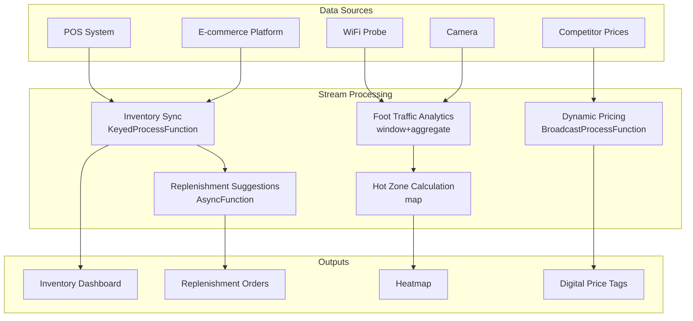

# Operators and Real-time Retail Store Operations

> **Stage**: Knowledge/10-case-studies | **Prerequisites**: [01.06-single-input-operators.md](../Knowledge/01-concept-atlas/operator-deep-dive/01.06-single-input-operators.md), [realtime-recommendation-system-case-study.md](./realtime-recommendation-system-case-study.md) | **Formalization Level**: L3
> **Document Focus**: Operator fingerprints and Pipeline design of stream processing operators in real-time retail store foot traffic analytics, dynamic pricing, and inventory management
> **Version**: 2026.04

---

## Table of Contents

- [Operators and Real-time Retail Store Operations](#operators-and-real-time-retail-store-operations)
  - [Table of Contents](#table-of-contents)
  - [1. Concept Definitions (Definitions)](#1-concept-definitions-definitions)
    - [Def-RTL-01-01: Retail Foot Traffic Analytics（零售客流分析）](#def-rtl-01-01-retail-foot-traffic-analytics零售客流分析)
    - [Def-RTL-01-02: Dynamic Pricing（动态定价）](#def-rtl-01-02-dynamic-pricing动态定价)
    - [Def-RTL-01-03: Real-time Inventory Visibility（实时库存可见性）](#def-rtl-01-03-real-time-inventory-visibility实时库存可见性)
    - [Def-RTL-01-04: Customer Journey（顾客旅程）](#def-rtl-01-04-customer-journey顾客旅程)
    - [Def-RTL-01-05: Stockout Cost（缺货成本）](#def-rtl-01-05-stockout-cost缺货成本)
  - [2. Property Derivation (Properties)](#2-property-derivation-properties)
    - [Lemma-RTL-01-01: Queueing Model for Foot Traffic Peaks](#lemma-rtl-01-01-queueing-model-for-foot-traffic-peaks)
    - [Lemma-RTL-01-02: Revenue Effect of Price Elasticity](#lemma-rtl-01-02-revenue-effect-of-price-elasticity)
    - [Prop-RTL-01-01: Benefits of Real-time Inventory Accuracy](#prop-rtl-01-01-benefits-of-real-time-inventory-accuracy)
    - [Prop-RTL-01-02: Conversion Rate Improvement from Personalized Recommendations](#prop-rtl-01-02-conversion-rate-improvement-from-personalized-recommendations)
  - [3. Relations Establishment (Relations)](#3-relations-establishment-relations)
    - [3.1 Retail Operations Pipeline Operator Mapping](#31-retail-operations-pipeline-operator-mapping)
    - [3.2 Operator Fingerprint](#32-operator-fingerprint)
  - [4. Argumentation Process (Argumentation)](#4-argumentation-process-argumentation)
    - [4.1 Why Retail Needs Stream Processing Instead of Traditional Daily Reports](#41-why-retail-needs-stream-processing-instead-of-traditional-daily-reports)
    - [4.2 Ethical Boundaries of Dynamic Pricing](#42-ethical-boundaries-of-dynamic-pricing)
    - [4.3 Foot Traffic Privacy Protection](#43-foot-traffic-privacy-protection)
  - [5. Formal Proof / Engineering Argument](#5-formal-proof--engineering-argument)
    - [5.1 Real-time Inventory Synchronization](#51-real-time-inventory-synchronization)
    - [5.2 Dynamic Pricing Engine](#52-dynamic-pricing-engine)
    - [5.3 Foot Traffic Hot Zone Analysis](#53-foot-traffic-hot-zone-analysis)
  - [6. Example Verification (Examples)](#6-example-verification-examples)
    - [6.1 Case Study: Omnichannel Retail Operations Platform](#61-case-study-omnichannel-retail-operations-platform)
    - [6.2 Case Study: Intelligent Replenishment System](#62-case-study-intelligent-replenishment-system)
  - [7. Visualizations](#7-visualizations)
    - [Retail Operations Pipeline](#retail-operations-pipeline)
  - [8. References](#8-references)

---

## 1. Concept Definitions (Definitions)

### Def-RTL-01-01: Retail Foot Traffic Analytics（零售客流分析）

Retail foot traffic analytics is the real-time quantitative analysis of in-store customer behavior:

$$\text{TrafficAnalytics} = (\text{EntryRate}, \text{DwellTime}, \text{ConversionRate}, \text{BasketSize})$$

### Def-RTL-01-02: Dynamic Pricing（动态定价）

Dynamic pricing is a strategy that adjusts product prices based on real-time supply and demand:

$$P_t = P_{base} \cdot (1 + \alpha \cdot \frac{D_t - S_t}{S_t}) \cdot (1 + \beta \cdot \text{CompetitorFactor})$$

### Def-RTL-01-03: Real-time Inventory Visibility（实时库存可见性）

Real-time inventory visibility is the second-level update of omnichannel inventory status:

$$\text{Inventory}_t = \text{Inventory}_{t-1} - \text{Sales}_t + \text{Replenishment}_t - \text{Returns}_t$$

### Def-RTL-01-04: Customer Journey（顾客旅程）

Customer journey is the path and interaction sequence of a customer within the store:

$$Journey = (z_1, t_1) \to (z_2, t_2) \to ... \to (z_n, t_n)$$

where $z_i$ is the zone and $t_i$ is the dwell time.

### Def-RTL-01-05: Stockout Cost（缺货成本）

Potential revenue loss caused by stockouts:

$$\text{StockoutCost} = \text{LostSales} + \text{CustomerDissatisfaction} + \text{SwitchingCost}$$

---

## 2. Property Derivation (Properties)

### Lemma-RTL-01-01: Queueing Model for Foot Traffic Peaks

Checkout queueing follows the M/M/c model:

$$W_q = \frac{C(c, \rho)}{c \cdot \mu - \lambda}$$

where $C(c, \rho)$ is the Erlang-C formula. When $W_q > 5$ minutes, the customer churn rate rises significantly.

### Lemma-RTL-01-02: Revenue Effect of Price Elasticity

The impact of price changes on revenue:

$$\frac{dR}{dP} = Q \cdot (1 + \epsilon)$$

When $|\epsilon| > 1$ (elastic), price increases reduce revenue; when $|\epsilon| < 1$ (inelastic), price increases raise revenue.

### Prop-RTL-01-01: Benefits of Real-time Inventory Accuracy

The impact of inventory accuracy on sales:

$$\Delta Sales = Sales \cdot (1 - \text{StockoutRate}_{before}) \cdot \frac{\text{Accuracy}_{after}}{\text{Accuracy}_{before}}$$

Improving inventory accuracy from 70% to 98% can increase sales by 8-12%.

### Prop-RTL-01-02: Conversion Rate Improvement from Personalized Recommendations

$$\text{Conversion}_{personalized} = \text{Conversion}_{generic} \cdot (1 + \gamma \cdot \text{Relevance})$$

Typical value: personalized recommendation conversion rate improves by 20-40%.

---

## 3. Relations Establishment (Relations)

### 3.1 Retail Operations Pipeline Operator Mapping

| Use Case | Operator Combination | Data Source | Latency Requirement |
|---------|---------|--------|---------|
| **Foot Traffic Counting** | Source + map + window | WiFi/Camera | < 1min |
| **Hot Zone Analysis** | window+aggregate | Location Data | < 5min |
| **Dynamic Pricing** | Broadcast + map | Sales/Competitor | < 1min |
| **Inventory Sync** | KeyedProcessFunction | POS/E-commerce | < 5s |
| **Churn Alert** | ProcessFunction + Timer | Behavior Data | < 1min |
| **Replenishment Suggestion** | AsyncFunction + window | Historical+Real-time | < 15min |

### 3.2 Operator Fingerprint

| Dimension | Retail Store Operations Characteristics |
|------|---------------|
| **Core Operators** | KeyedProcessFunction (SKU inventory state machine), BroadcastProcessFunction (price update), window+aggregate (time-period statistics), AsyncFunction (replenishment suggestion) |
| **State Types** | ValueState (SKU inventory), MapState (customer profile), BroadcastState (pricing strategy) |
| **Time Semantics** | Processing time dominant (real-time operational decision-making) |
| **Data Characteristics** | High concurrency (ten-thousands of SKUs), high frequency (second-level POS), strong temporal patterns (day/night/weekend) |
| **State Hotspots** | Hot SKU keys, hot store keys |
| **Performance Bottlenecks** | External competitor price APIs, inventory sync consistency |

---

## 4. Argumentation Process (Argumentation)

### 4.1 Why Retail Needs Stream Processing Instead of Traditional Daily Reports

Problems with traditional daily reports:

- Next-day reports: miss same-day sales opportunities
- Static pricing: unable to respond to competitor promotions
- Inventory lag: online orders discovered out-of-stock after placement

Advantages of stream processing:

- Real-time pricing: second-level price adjustments based on foot traffic and inventory
- Instant replenishment: low inventory automatically triggers replenishment
- Omnichannel sync: online and offline inventory in real-time consistency

### 4.2 Ethical Boundaries of Dynamic Pricing

**Problem**: Dynamic pricing may be perceived as price discrimination.

**Boundaries**:

1. **Transparency**: reasons for price changes are explainable
2. **Fairness**: not based on sensitive attributes (race/gender)
3. **Consistency**: same price at same time under same conditions

### 4.3 Foot Traffic Privacy Protection

**Problem**: WiFi probes/cameras tracking customer locations involve privacy concerns.

**Solutions**:

1. **Anonymization**: MAC address hashing, no personal association possible
2. **Aggregation**: only retain statistical data, not individual trajectories
3. **Opt-out Mechanism**: customers can choose not to be tracked

---

## 5. Formal Proof / Engineering Argument

### 5.1 Real-time Inventory Synchronization

```java
public class InventorySyncFunction extends KeyedProcessFunction<String, InventoryEvent, InventoryState> {
    private ValueState<Integer> stockState;
    private ValueState<Long> lastUpdate;

    @Override
    public void processElement(InventoryEvent event, Context ctx, Collector<InventoryState> out) throws Exception {
        Integer current = stockState.value();
        if (current == null) current = 0;

        switch (event.getType()) {
            case "SALE":
                current -= event.getQuantity();
                break;
            case "REPLENISHMENT":
                current += event.getQuantity();
                break;
            case "RETURN":
                current += event.getQuantity();
                break;
            case "ADJUSTMENT":
                current = event.getQuantity();
                break;
        }

        stockState.update(current);
        lastUpdate.update(ctx.timestamp());

        // Low stock alert
        if (current < event.getReorderPoint()) {
            out.collect(new InventoryState(event.getSkuId(), current, "LOW_STOCK", ctx.timestamp()));
        } else {
            out.collect(new InventoryState(event.getSkuId(), current, "OK", ctx.timestamp()));
        }
    }
}
```

### 5.2 Dynamic Pricing Engine

```java
// Sales data stream
DataStream<SaleEvent> sales = env.addSource(new POSSource());

// Competitor price stream (Broadcast)
DataStream<CompetitorPrice> competitorPrices = env.addSource(new CompetitorPriceSource());

// Real-time pricing
sales.map(SaleEvent::getSkuId)
    .distinct()
    .connect(competitorPrices.broadcast())
    .process(new BroadcastProcessFunction<String, CompetitorPrice, PriceUpdate>() {
        private MapState<String, CompetitorPrice> priceState;

        @Override
        public void processElement(String skuId, ReadOnlyContext ctx, Collector<PriceUpdate> out) throws Exception {
            ReadOnlyBroadcastState<String, CompetitorPrice> competitorState = ctx.getBroadcastState(PRICE_DESCRIPTOR);
            CompetitorPrice comp = competitorState.get(skuId);

            // Pricing strategy: match competitor or maintain profit margin
            double newPrice;
            if (comp != null && comp.getPrice() < getCurrentPrice(skuId)) {
                newPrice = comp.getPrice() * 0.99;  // 1% lower than competitor
            } else {
                newPrice = getCurrentPrice(skuId);
            }

            out.collect(new PriceUpdate(skuId, newPrice, ctx.timestamp()));
        }

        @Override
        public void processBroadcastElement(CompetitorPrice price, Context ctx, Collector<PriceUpdate> out) {
            ctx.getBroadcastState(PRICE_DESCRIPTOR).put(price.getSkuId(), price);
        }
    })
    .addSink(new PriceUpdateSink());
```

### 5.3 Foot Traffic Hot Zone Analysis

```java
// Customer position stream
DataStream<CustomerPosition> positions = env.addSource(new WiFiTrackingSource());

// Hot zone statistics
positions.map(pos -> new ZoneEvent(pos.getZoneId(), pos.getCustomerId(), pos.getTimestamp()))
    .keyBy(ZoneEvent::getZoneId)
    .window(SlidingProcessingTimeWindows.of(Time.minutes(5), Time.minutes(1)))
    .aggregate(new UniqueVisitorAggregate())
    .process(new ProcessFunction<ZoneCount, HeatmapUpdate>() {
        @Override
        public void processElement(ZoneCount count, Context ctx, Collector<HeatmapUpdate> out) {
            double density = count.getUniqueVisitors() / count.getZoneArea();
            String level;
            if (density > 2.0) level = "HOT";
            else if (density > 1.0) level = "WARM";
            else level = "COLD";

            out.collect(new HeatmapUpdate(count.getZoneId(), density, level, ctx.timestamp()));
        }
    })
    .addSink(new HeatmapSink());
```

---

## 6. Example Verification (Examples)

### 6.1 Case Study: Omnichannel Retail Operations Platform

```java
// 1. Multi-source sales data
DataStream<SaleEvent> posSales = env.addSource(new POSSource());
DataStream<SaleEvent> onlineSales = env.addSource(new EcommerceSource());

// 2. Omnichannel inventory synchronization
posSales.union(onlineSales)
    .keyBy(SaleEvent::getSkuId)
    .process(new InventorySyncFunction())
    .addSink(new InventoryDashboardSink());

// 3. Foot traffic analytics
DataStream<CustomerPosition> positions = env.addSource(new WiFiTrackingSource());
positions.keyBy(CustomerPosition::getZoneId)
    .window(SlidingProcessingTimeWindows.of(Time.minutes(5), Time.minutes(1)))
    .aggregate(new UniqueVisitorAggregate())
    .addSink(new HeatmapSink());

// 4. Dynamic pricing
DataStream<PriceUpdate> priceUpdates = env.addSource(new PricingEngineSource());
priceUpdates.addSink(new DigitalPriceTagSink());
```

### 6.2 Case Study: Intelligent Replenishment System

```java
// Sales aggregation
DataStream<SaleEvent> sales = env.addSource(new POSSource());

// Calculate real-time sales rate
sales.keyBy(SaleEvent::getSkuId)
    .window(SlidingEventTimeWindows.of(Time.hours(1), Time.minutes(10)))
    .aggregate(new SalesRateAggregate())
    .connect(inventoryStateBroadcast)
    .process(new CoProcessFunction<SalesRate, InventoryState, ReplenishmentOrder>() {
        @Override
        public void processElement1(SalesRate rate, Context ctx, Collector<ReplenishmentOrder> out) {
            InventoryState inv = inventoryState.value();
            if (inv == null) return;

            // Predict days until stockout
            double daysToStockout = inv.getCurrentStock() / rate.getDailyRate();

            if (daysToStockout < 3 && !inv.hasPendingOrder()) {
                int orderQty = calculateOrderQuantity(rate.getDailyRate(), inv.getLeadTimeDays());
                out.collect(new ReplenishmentOrder(rate.getSkuId(), orderQty, "AUTO", ctx.timestamp()));
            }
        }

        @Override
        public void processElement2(InventoryState inv, Context ctx, Collector<ReplenishmentOrder> out) {
            inventoryState.update(inv);
        }
    })
    .addSink(new ReplenishmentSink());
```

---

## 7. Visualizations

### Retail Operations Pipeline

The following diagram illustrates the end-to-end stream processing pipeline for real-time retail store operations, covering data ingestion from multiple sources, stream processing with Flink operators, and output to downstream systems.



---

## 8. References

---

*Related Documents*: [01.06-single-input-operators.md](../Knowledge/01-concept-atlas/operator-deep-dive/01.06-single-input-operators.md) | [realtime-recommendation-system-case-study.md](./realtime-recommendation-system-case-study.md) | [realtime-supply-chain-tracking-case-study.md](./realtime-supply-chain-tracking-case-study.md)
