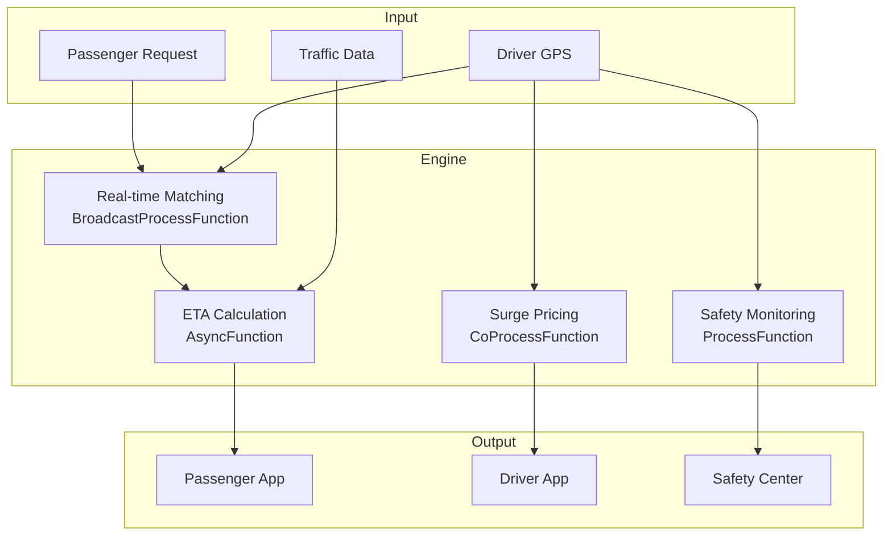

# Operators and Real-time Ride-hailing / Ride-sharing (实时网约车/共享出行)

> **Stage**: Knowledge/10-case-studies | **Prerequisites**: [stream-join-patterns.md](./stream-join-patterns.md), [realtime-traffic-management-case-study.md](./realtime-traffic-management-case-study.md) | **Formalization Level**: L3
> **Document Scope**: Operator fingerprint and Pipeline design for stream processing operators in real-time ride-hailing supply-demand matching, dynamic pricing, and route planning
> **Version**: 2026.04

---

## Table of Contents

- [1. Definitions](#1-definitions)
- [2. Properties](#2-properties)
- [3. Relations](#3-relations)
- [4. Argumentation](#4-argumentation)
- [5. Proof / Engineering Argument](#5-proof--engineering-argument)
- [6. Examples](#6-examples)
- [7. Visualizations](#7-visualizations)
- [8. References](#8-references)

---

## 1. Definitions

### Def-RDH-01-01: Ride-hailing Matching (网约车供需匹配)

Ride-hailing Matching (网约车供需匹配) is the optimal pairing of passenger orders with available drivers:

$$\text{Match}^* = \arg\min_{m} \sum_{(p,d) \in m} \text{Cost}(p, d)$$

where $\text{Cost}$ includes pickup distance, waiting time, driver preferences, etc.

### Def-RDH-01-02: Surge Pricing (动态调价)

Surge Pricing (动态调价) is the real-time adjustment of fare rates based on supply-demand relationship:

$$\text{Multiplier}_z = \left(\frac{D_z}{S_z}\right)^{\gamma}$$

where $D_z$ is the demand in zone $z$, $S_z$ is the supply, and $\gamma$ is the elasticity coefficient.

### Def-RDH-01-03: Estimated Time to Arrival, ETA (接驾时间估计)

ETA (接驾时间估计) is the estimated time for a driver to arrive at the passenger's pickup location:

$$\text{ETA} = \frac{D_{pickup}}{v_{current}} + T_{search} + T_{traffic}$$

### Def-RDH-01-04: Driver Rating Score (司机服务分)

Driver Rating Score (司机服务分) is a historical evaluation of comprehensive service quality:

$$\text{Score}_d = \alpha \cdot \bar{R}_d + \beta \cdot C_{accept} + \gamma \cdot C_{complete} - \delta \cdot C_{cancel}$$

### Def-RDH-01-05: Pool Matching (拼车匹配)

Pool Matching (拼车匹配) is the consolidation of multiple passengers with similar trip directions:

$$\text{Pool} = \{(p_1, p_2) : \text{Angle}(\vec{r}_1, \vec{r}_2) < \theta_{max} \land \Delta D < D_{max}\}$$

---

## 2. Properties

### Lemma-RDH-01-01: Matching Success Rate and Supply-Demand Ratio (供需比)

$$P_{match} = 1 - e^{-\lambda \cdot S/D}$$

where $S/D$ is the supply-demand ratio, and $\lambda$ is the platform efficiency coefficient.

### Lemma-RDH-01-02: Supply-Demand Balancing Effect of Surge Pricing

$$\frac{\Delta S}{S} = \epsilon_S \cdot \Delta M, \quad \frac{\Delta D}{D} = \epsilon_D \cdot \Delta M$$

where $\epsilon_S > 0$ (supply elasticity), $\epsilon_D < 0$ (demand elasticity).

### Prop-RDH-01-01: Pool Savings Rate (拼车节省率)

$$\text{Savings}_{pool} = 1 - \frac{F_{pool,1} + F_{pool,2}}{F_{solo,1} + F_{solo,2}}$$

Typical values: Pool saves 20-40% per passenger, and the platform increases driver income by 30-50%.

### Prop-RDH-01-02: Peak-Hour Supply-Demand Gap (高峰期供需缺口)

$$\text{Gap}_{peak} = D_{peak} - S_{peak} \approx 2\text{-}3 \times S_{normal}$$

---

## 3. Relations

### 3.1 Ride-hailing Pipeline Operator Mapping

| Application Scenario | Operator Composition | Data Source | Latency Requirement |
|---------------------|----------------------|-------------|---------------------|
| **Passenger Hailing (乘客叫车)** | Source + map | Passenger App | < 1s |
| **Driver Matching (司机匹配)** | AsyncFunction | Supply-Demand Data | < 2s |
| **ETA Calculation (ETA计算)** | AsyncFunction | Map API | < 1s |
| **Surge Pricing (动态调价)** | window+aggregate + map | Supply-Demand Stream | < 10s |
| **Pool Matching (拼车匹配)** | window+process | Orders in Zone | < 30s |
| **Trip Monitoring (行程监控)** | ProcessFunction + Timer | GPS | < 5s |

### 3.2 Operator Fingerprint

| Dimension | Ride-hailing Characteristics |
|-----------|------------------------------|
| **Core Operators** | AsyncFunction (matching/ETA), BroadcastProcessFunction (pricing strategy), ProcessFunction (trip state machine), window+aggregate (supply-demand statistics) |
| **State Types** | ValueState (driver status), MapState (zone supply-demand), BroadcastState (pricing strategy) |
| **Time Semantics** | Processing time primarily (matching emphasizes real-time performance) |
| **Data Characteristics** | High burst (peak hours/rain & snow), strong spatial locality, two-sided market (双边市场) |
| **State Hotspots** | Hot zone keys, peak hour keys |
| **Performance Bottlenecks** | Matching algorithm, map ETA API |

---

## 4. Argumentation

### 4.1 Why Ride-hailing Needs Stream Processing Instead of Traditional Scheduling

Problems with traditional scheduling:
- Manual dispatch: low efficiency, not scalable
- Fixed pricing: no cars during peak hours, surplus during off-peak hours
- Static zones: unable to cope with dynamic demand changes

Advantages of stream processing:
- Real-time matching: passenger-driver pairing completed within seconds
- Dynamic pricing: automatic supply-demand balancing
- Global optimization: decision-making based on city-wide real-time state

### 4.2 Network Effects of Two-sided Markets (双边市场)

**Problem**: More passengers → more drivers → shorter waiting time → more passengers.

**Stream Processing Solution**: Real-time monitoring of bilateral density, incentivizing supply in low-density areas through subsidies.

### 4.3 Safety Monitoring

**Scenario**: Route deviation during trip, long stops, abnormal speed.

**Stream Processing Solution**: Real-time GPS trajectory analysis → anomaly detection → automatic alerting → safety customer service intervention.

---

## 5. Proof / Engineering Argument

### 5.1 Real-time Supply-Demand Matching Engine

```java
public class RideMatchingFunction extends BroadcastProcessFunction<RideRequest, DriverStatus, MatchResult> {
    private MapState<String, DriverStatus> availableDrivers;
    
    @Override
    public void processElement(RideRequest request, ReadOnlyContext ctx, Collector<MatchResult> out) throws Exception {
        String bestDriver = null;
        double bestScore = Double.NEGATIVE_INFINITY;
        
        for (Map.Entry<String, DriverStatus> entry : availableDrivers.entries()) {
            DriverStatus driver = entry.getValue();
            if (!driver.isAvailable()) continue;
            
            double pickupDistance = calculateDistance(request.getPickupLocation(), driver.getLocation());
            if (pickupDistance > 5000) continue;  // 5km upper limit
            
            double eta = estimateETA(driver.getLocation(), request.getPickupLocation());
            
            // Score = -distance_weight - wait_weight + rating_weight
            double score = -0.5 * pickupDistance - 0.3 * eta + 0.2 * driver.getRating();
            
            if (score > bestScore) {
                bestScore = score;
                bestDriver = entry.getKey();
            }
        }
        
        if (bestDriver != null) {
            DriverStatus driver = availableDrivers.get(bestDriver);
            driver.setAvailable(false);
            availableDrivers.put(bestDriver, driver);
            
            out.collect(new MatchResult(request.getId(), bestDriver, 
                estimateETA(driver.getLocation(), request.getPickupLocation()), ctx.timestamp()));
        }
    }
    
    @Override
    public void processBroadcastElement(DriverStatus driver, Context ctx, Collector<MatchResult> out) {
        availableDrivers.put(driver.getId(), driver);
    }
}
```

### 5.2 Dynamic Pricing Engine

```java
// Supply-demand data stream
DataStream<ZoneDemand> demand = env.addSource(new DemandSource());
DataStream<ZoneSupply> supply = env.addSource(new DriverLocationSource());

// Zone supply-demand ratio
demand.keyBy(ZoneDemand::getZoneId)
    .connect(supply.keyBy(ZoneSupply::getZoneId))
    .process(new CoProcessFunction<ZoneDemand, ZoneSupply, SurgeMultiplier>() {
        private ValueState<Integer> demandState;
        private ValueState<Integer> supplyState;
        
        @Override
        public void processElement1(ZoneDemand d, Context ctx, Collector<SurgeMultiplier> out) {
            demandState.update(d.getCount());
            calculateAndEmit(out, ctx);
        }
        
        @Override
        public void processElement2(ZoneSupply s, Context ctx, Collector<SurgeMultiplier> out) {
            supplyState.update(s.getCount());
            calculateAndEmit(out, ctx);
        }
        
        private void calculateAndEmit(Collector<SurgeMultiplier> out, Context ctx) {
            Integer d = demandState.value();
            Integer s = supplyState.value();
            if (d == null || s == null || s == 0) return;
            
            double ratio = (double) d / s;
            double multiplier = Math.pow(ratio, 0.6);
            multiplier = Math.max(1.0, Math.min(multiplier, 3.0));  // 1x-3x range
            
            out.collect(new SurgeMultiplier(ctx.getCurrentKey(), multiplier, ctx.timestamp()));
        }
    })
    .addSink(new PriceUpdateSink());
```

### 5.3 Trip Safety Monitoring

```java
// Driver GPS stream
DataStream<DriverGPS> gps = env.addSource(new DriverGPSSource());

// Anomaly detection
gps.keyBy(DriverGPS::getDriverId)
    .process(new KeyedProcessFunction<String, DriverGPS, SafetyAlert>() {
        private ValueState<DriverGPS> lastGPS;
        private ValueState<Integer> alertCount;
        
        @Override
        public void processElement(DriverGPS current, Context ctx, Collector<SafetyAlert> out) throws Exception {
            DriverGPS last = lastGPS.value();
            if (last == null) {
                lastGPS.update(current);
                return;
            }
            
            double timeDiff = (current.getTimestamp() - last.getTimestamp()) / 1000.0;
            double distance = calculateDistance(last.getLocation(), current.getLocation());
            double speed = distance / timeDiff;
            
            // Overspeed detection
            if (speed > 120) {
                out.collect(new SafetyAlert(current.getDriverId(), "OVER_SPEED", speed, ctx.timestamp()));
            }
            
            // Route deviation detection
            double deviation = calculateRouteDeviation(current.getLocation(), current.getExpectedRoute());
            if (deviation > 1000) {
                int alerts = alertCount.value() != null ? alertCount.value() : 0;
                alerts++;
                alertCount.update(alerts);
                
                if (alerts >= 3) {
                    out.collect(new SafetyAlert(current.getDriverId(), "ROUTE_DEVIATION", deviation, ctx.timestamp()));
                    alertCount.clear();
                }
            }
            
            lastGPS.update(current);
        }
    })
    .addSink(new SafetyCenterSink());
```

---

## 6. Examples

### 6.1 Real-world: Real-time Dispatching for Ride-hailing Platform

```java
// 1. Passenger request stream
DataStream<RideRequest> requests = env.addSource(new PassengerSource());

// 2. Driver status stream
DataStream<DriverStatus> drivers = env.addSource(new DriverGPSSource());

// 3. Real-time matching
requests.connect(drivers.broadcast())
    .process(new RideMatchingFunction())
    .addSink(new MatchNotificationSink());

// 4. Dynamic pricing
DataStream<ZoneDemand> demand = env.addSource(new DemandSource());
DataStream<ZoneSupply> supply = env.addSource(new DriverLocationSource());
demand.connect(supply.keyBy(ZoneSupply::getZoneId))
    .process(new SurgePricingFunction())
    .addSink(new FareUpdateSink());

// 5. Safety monitoring
DataStream<DriverGPS> gps = env.addSource(new DriverGPSSource());
gps.keyBy(DriverGPS::getDriverId)
    .process(new SafetyMonitorFunction())
    .addSink(new SafetyAlertSink());
```

---

## 7. Visualizations

### Ride-hailing Pipeline



---

## 8. References

[^1]: Uber, "Uber Marketplace", https://www.uber.com/

[^2]: Didi, "Didi AI Labs", https://www.didiglobal.com/

[^3]: Wikipedia, "Ridesharing Company", https://en.wikipedia.org/wiki/Ridesharing_company

[^4]: Wikipedia, "Surge Pricing", https://en.wikipedia.org/wiki/Surge_pricing

[^5]: Apache Flink Documentation, "Broadcast State", https://nightlies.apache.org/flink/flink-docs-stable/docs/dev/datastream/fault-tolerance/broadcast_state/

[^6]: ACM, "Dynamic Pricing in Ride-sharing Platforms", 2023.

---

*Related Documents*: [stream-join-patterns.md](./stream-join-patterns.md) | [realtime-traffic-management-case-study.md](./realtime-traffic-management-case-study.md) | [realtime-food-delivery-case-study.md](./realtime-food-delivery-case-study.md)
