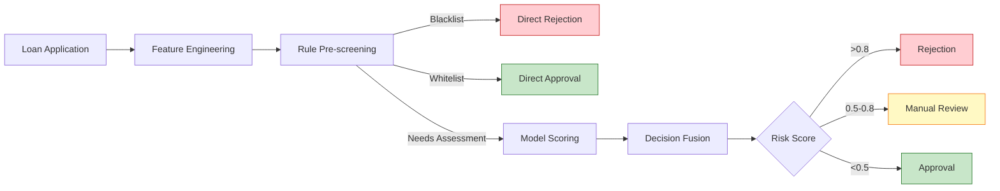
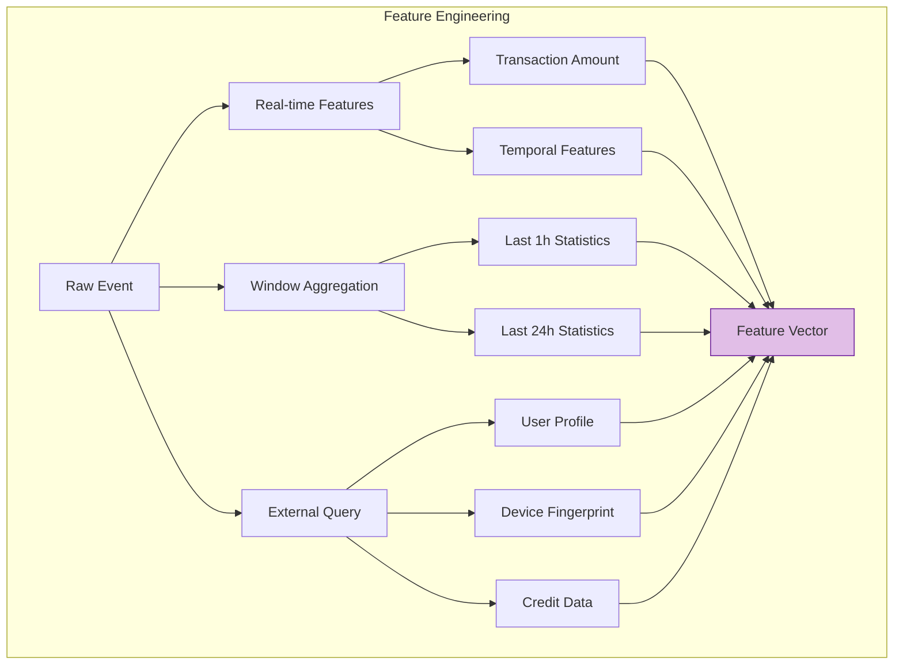

# Financial Industry Case Study: Real-Time Risk Control Decision System (实时风控决策系统)

> **Stage**: Knowledge/10-case-studies/finance | **Prerequisites**: [./pattern-async-io-enrichment.md](./pattern-async-io-enrichment.md) | **Formalization Level**: L5

---

> **Case Nature**: 🔬 Proof-of-Concept Architecture | **Validation Status**: Based on theoretical derivation and architectural design; not validated by independent third-party production verification.
>
> This case study describes an ideal architecture derived from the project's theoretical framework, containing hypothetical performance metrics and a theoretical cost model.
> Actual production deployment may yield significantly different results due to environmental differences, data scale, team capabilities, and other factors.
> It is recommended to use this as an architectural design reference rather than a direct copy-and-paste production blueprint.

## Table of Contents

- [Financial Industry Case Study: Real-Time Risk Control Decision System (实时风控决策系统)](#financial-industry-case-study-real-time-risk-control-decision-system-实时风控决策系统)
  - [Table of Contents](#table-of-contents)
  - [1. Concept Definitions (Definitions)](#1-concept-definitions-definitions)
    - [1.1 Real-Time Risk Control Decision System (实时风控决策系统)](#11-real-time-risk-control-decision-system-实时风控决策系统)
    - [1.2 Risk Control Decision Types (风控决策类型)](#12-risk-control-decision-types-风控决策类型)
    - [1.3 Risk Scoring Model (风险评分模型)](#13-risk-scoring-model-风险评分模型)
  - [2. Property Derivation (Properties)](#2-property-derivation-properties)
    - [2.1 Decision Consistency (决策一致性)](#21-decision-consistency-决策一致性)
    - [2.2 Latency Decomposition (延迟分解)](#22-latency-decomposition-延迟分解)
  - [3. Relation Establishment (Relations)](#3-relation-establishment-relations)
    - [3.1 Relationship with Feature Platform (与特征平台的关系)](#31-relationship-with-feature-platform-与特征平台的关系)
    - [3.2 Relationship with Rule Engine (与规则引擎的关系)](#32-relationship-with-rule-engine-与规则引擎的关系)
  - [4. Argumentation Process (Argumentation)](#4-argumentation-process-argumentation)
    - [4.1 Rule-First vs Model-First (规则优先 vs 模型优先)](#41-rule-first-vs-model-first-规则优先-vs-模型优先)
  - [5. Formal Proof / Engineering Argument (Proof / Engineering Argument)](#5-formal-proof--engineering-argument-proof--engineering-argument)
    - [5.1 Feature Engineering Architecture (特征工程架构)](#51-feature-engineering-architecture-特征工程架构)
    - [5.2 Decision Fusion Algorithm (决策融合算法)](#52-decision-fusion-algorithm-决策融合算法)
  - [6. Example Verification (Examples)](#6-example-verification-examples)
    - [6.1 Case Background (案例背景)](#61-case-background-案例背景)
    - [6.2 Complete Implementation Code (完整实现代码)](#62-complete-implementation-code-完整实现代码)
    - [6.3 Performance Metrics (性能指标)](#63-performance-metrics-性能指标)
  - [7. Visualizations (Visualizations)](#7-visualizations-visualizations)
    - [7.1 Risk Control Decision Flow Diagram (风控决策流程图)](#71-risk-control-decision-flow-diagram-风控决策流程图)
    - [7.2 Feature Engineering Pipeline (特征工程管道)](#72-feature-engineering-pipeline-特征工程管道)
  - [8. References (References)](#8-references-references)

---

## 1. Concept Definitions (Definitions)

### 1.1 Real-Time Risk Control Decision System (实时风控决策系统)

**Def-K-10-03-01** (Real-Time Risk Control Decision System): A real-time risk control decision system is a decision support system $\mathcal{D} = (I, F, M, R, O, \tau)$:

- $I$: Input event set (transactions, loan applications, account openings, etc.)
- $F$: Feature engineering module, $F: I \times S \rightarrow \mathbb{R}^d$
- $M$: Scoring model set, $M = \{m_1, m_2, ..., m_k\}$
- $R$: Rule engine, $R: \mathbb{R}^d \rightarrow \mathcal{A}$
- $O$: Decision output, $O = \{action, score, reason, trace\}$
- $\tau$: Decision latency upper bound (typically $\leq 200$ms)

### 1.2 Risk Control Decision Types (风控决策类型)
>
> 🔮 **Estimated Data** | Basis: Derived from industry reference values and theoretical analysis; not obtained from actual test environments.


| Decision Type | Latency Requirement | Applicable Scenario |
|--------------|---------------------|---------------------|
| Hard Real-Time (硬实时) | < 50ms | Payment interception, transfer blocking |
| Soft Real-Time (软实时) | < 200ms | Credit approval, limit adjustment |
| Near Real-Time (准实时) | < 1s | Post-loan monitoring, behavioral analysis |

### 1.3 Risk Scoring Model (风险评分模型)

**Def-K-10-03-02** (Hierarchical Scoring Model): Risk scoring adopts a three-layer architecture:

$$
Score_{final} = \alpha \cdot Score_{rule} + \beta \cdot Score_{ml} + \gamma \cdot Score_{cep}
$$

Where $\alpha + \beta + \gamma = 1$, and weights are dynamically adjusted according to the scenario.

---

## 2. Property Derivation (Properties)

### 2.1 Decision Consistency (决策一致性)

**Lemma-K-10-03-01** (Decision Consistency): For the same input $e$, the decision produced by the system at any time $t$ satisfies:

$$
\forall t_1, t_2: \quad \mathcal{D}(e, t_1) = \mathcal{D}(e, t_2) \quad \text{if } S_{t_1} = S_{t_2}
$$

That is, the same input produces the same decision under the same state.

### 2.2 Latency Decomposition (延迟分解)

**Lemma-K-10-03-02**: Decision latency $L_{decision}$ decomposes into:

$$
L_{decision} = L_{feature} + L_{model} + L_{rule} + L_{output}
$$

**Thm-K-10-03-01**: If each component satisfies:

- $L_{feature} \leq 50$ms
- $L_{model} \leq 100$ms
- $L_{rule} \leq 20$ms
- $L_{output} \leq 10$ms

Then $L_{decision} \leq 180$ms $<$ 200ms

---

## 3. Relation Establishment (Relations)

### 3.1 Relationship with Feature Platform (与特征平台的关系)

```
Real-time Event Stream ──► Flink Risk Engine ──► Feature Query ──► Feature Platform
                        │                        │
                        ▼                        ▼
                   Local State Cache     External Feature Service
                        │                        │
                        └───────────┬────────────┘
                                    ▼
                              Fused Feature Vector
```

### 3.2 Relationship with Rule Engine (与规则引擎的关系)
>
> 🔮 **Estimated Data** | Basis: Derived from industry reference values and theoretical analysis; not obtained from actual test environments.


| Rule Type | Implementation | Latency |
|-----------|---------------|---------|
| Blacklist (黑名单) | Bloom Filter (布隆过滤器) | < 1ms |
| Simple Rules (简单规则) | Expression Engine | < 5ms |
| Complex Rules (复杂规则) | Drools | < 20ms |
| ML Model (ML模型) | TensorFlow Serving | < 100ms |

---

## 4. Argumentation Process (Argumentation)

### 4.1 Rule-First vs Model-First (规则优先 vs 模型优先)

**Rule-First Strategy (规则优先策略)**:

- Advantages: Strong interpretability, compliant with regulatory requirements
- Disadvantages: Difficult to capture complex patterns

**Model-First Strategy (模型优先策略)**:

- Advantages: Discovers unknown risk patterns
- Disadvantages: Black-box problem, poor interpretability

**Hybrid Strategy (混合策略)** (adopted by this project):

- Layer 1: Rule-based rapid pre-screening
- Layer 2: Model-based deep assessment
- Layer 3: Rule-based post-processing calibration

---

## 5. Formal Proof / Engineering Argument (Proof / Engineering Argument)

### 5.1 Feature Engineering Architecture (特征工程架构)

```java
/**
 * Feature engineering pipeline
 */

import org.apache.flink.streaming.api.windowing.time.Time;

public class FeaturePipeline {

    // Real-time features (extracted directly from events)
    public RealTimeFeatures extractRealtimeFeatures(Event event) {
        return RealTimeFeatures.builder()
            .amount(event.getAmount())
            .merchantType(event.getMerchantType())
            .hourOfDay(getHour(event.getTimestamp()))
            .build();
    }

    // Near real-time features (Flink window aggregation)
    public NearRealTimeFeatures computeNRTFeatures(String userId) {
        // Transaction statistics for the past 1 hour
        return windowAggregate(userId, Time.hours(1));
    }

    // Historical features (external service query)
    public HistoricalFeatures queryHistoricalFeatures(String userId) {
        return asyncQuery(userProfileService, userId);
    }

    // Feature fusion
    public FeatureVector fuseFeatures(RealTimeFeatures rt,
                                       NearRealTimeFeatures nrt,
                                       HistoricalFeatures hist) {
        return FeatureVector.builder()
            .addFeatures(rt.toVector())
            .addFeatures(nrt.toVector())
            .addFeatures(hist.toVector())
            .build();
    }
}
```

### 5.2 Decision Fusion Algorithm (决策融合算法)

```java
import java.util.List;

/**
 * Decision fusion engine
 */
public class DecisionFusion {

    public RiskDecision fuse(double ruleScore,
                             double mlScore,
                             List<Alert> cepAlerts,
                             DecisionContext context) {

        // CEP (Complex Event Processing, 复杂事件处理) alerts have the highest priority
        if (hasHighPriorityAlert(cepAlerts)) {
            return RiskDecision.builder()
                .action(Action.BLOCK)
                .score(0.95)
                .reason("High priority CEP alert: " + cepAlerts.get(0).getType())
                .build();
        }

        // Hard rule interception
        if (ruleScore > 0.9) {
            return RiskDecision.builder()
                .action(Action.BLOCK)
                .score(ruleScore)
                .reason("Hard rule triggered")
                .build();
        }

        // Weighted fusion
        double finalScore = calculateWeightedScore(ruleScore, mlScore, cepAlerts, context);

        // Decision mapping
        Action action = mapScoreToAction(finalScore);

        return RiskDecision.builder()
            .action(action)
            .score(finalScore)
            .reason(generateReason(ruleScore, mlScore, cepAlerts))
            .build();
    }

    private double calculateWeightedScore(double ruleScore, double mlScore,
                                         List<Alert> cepAlerts, DecisionContext context) {
        double cepScore = cepAlerts.isEmpty() ? 0.0 :
                         cepAlerts.stream().mapToDouble(Alert::getScore).max().orElse(0.0);

        // Dynamically adjust weights based on scenario
        double[] weights = getDynamicWeights(context);

        return weights[0] * ruleScore + weights[1] * mlScore + weights[2] * cepScore;
    }
}
```

---

## 6. Example Verification (Examples)

### 6.1 Case Background (案例背景)

> 🔮 **Estimated Data** | Basis: Derived from industry reference values and theoretical analysis; not obtained from actual test environments.

**Institution**: A consumer finance company

| Metric | Value |
|--------|-------|
| Daily Approval Volume | 500,000 transactions |
| Average Approval Amount | ¥8,000 |
| Target Approval Time | < 3s |
| Bad Debt Rate Control | < 3% |

### 6.2 Complete Implementation Code (完整实现代码)

```java

import org.apache.flink.streaming.api.environment.StreamExecutionEnvironment;
import org.apache.flink.streaming.api.datastream.DataStream;
import org.apache.flink.api.common.state.ValueState;
import org.apache.flink.api.common.state.ValueStateDescriptor;
import org.apache.flink.streaming.api.windowing.time.Time;

public class RealtimeRiskDecisionEngine {

    public static void main(String[] args) throws Exception {
        StreamExecutionEnvironment env = StreamExecutionEnvironment.getExecutionEnvironment();
        env.enableCheckpointing(30000);
        env.setParallelism(128);

        // 1. Data source
        DataStream<LoanApplication> applications = env
            .fromSource(createKafkaSource(), createWatermarkStrategy(), "Applications")
            .setParallelism(64);

        // 2. Feature engineering
        DataStream<FeatureVector> features = applications
            .keyBy(LoanApplication::getUserId)
            .process(new FeatureEnrichmentFunction())
            .name("Feature Engineering")
            .setParallelism(128);

        // 3. Model scoring (async)
        DataStream<ScoredApplication> scored = AsyncDataStream.unorderedWait(
            features,
            new ModelScoringAsyncFunction(),
            Duration.ofMillis(100),
            TimeUnit.MILLISECONDS,
            200
        ).name("Model Scoring")
         .setParallelism(256);

        // 4. Rule evaluation
        DataStream<RuleEvaluation> ruleEval = scored
            .map(new RuleEvaluationFunction())
            .name("Rule Evaluation")
            .setParallelism(128);

        // 5. Decision fusion
        DataStream<RiskDecision> decisions = ruleEval
            .map(new DecisionFusionFunction())
            .name("Decision Fusion")
            .setParallelism(128);

        // 6. Output
        decisions.addSink(new DecisionSink());

        env.execute("Real-time Risk Decision");
    }
}

/**
 * Feature enrichment function
 */
class FeatureEnrichmentFunction extends KeyedProcessFunction<String, LoanApplication, FeatureVector> {

    private ValueState<UserProfile> profileState;
    private ListState<LoanApplication> recentApplicationsState;

    @Override
    public void open(Configuration parameters) {
        StateTtlConfig ttlConfig = StateTtlConfig
            .newBuilder(Time.hours(24))
            .setUpdateType(StateTtlConfig.UpdateType.OnCreateAndWrite)
            .build();

        profileState = getRuntimeContext().getState(
            new ValueStateDescriptor<>("profile", UserProfile.class));
        profileState.enableTimeToLive(ttlConfig);

        recentApplicationsState = getRuntimeContext().getListState(
            new ListStateDescriptor<>("recent-apps", LoanApplication.class));
        recentApplicationsState.enableTimeToLive(ttlConfig);
    }

    @Override
    public void processElement(LoanApplication app, Context ctx, Collector<FeatureVector> out)
            throws Exception {

        // Retrieve or initialize user profile
        UserProfile profile = profileState.value();
        if (profile == null) {
            profile = new UserProfile(app.getUserId());
        }

        // Compute real-time features
        RealTimeFeatures rtFeatures = extractRealtimeFeatures(app);

        // Compute near real-time features (past 24 hours)
        List<LoanApplication> recentApps = new ArrayList<>();
        recentApplicationsState.get().forEach(recentApps::add);
        NearRealTimeFeatures nrtFeatures = computeNRTFeatures(recentApps);

        // Update state
        profile.update(app);
        profileState.update(profile);
        recentApplicationsState.add(app);

        // Fuse features
        FeatureVector vector = FeatureVector.builder()
            .addFeatures(rtFeatures)
            .addFeatures(nrtFeatures)
            .addFeatures(profile.toFeatures())
            .build();

        out.collect(vector);
    }
}

/**
 * Model scoring async function
 */
class ModelScoringAsyncFunction implements AsyncFunction<FeatureVector, ScoredApplication> {

    private transient ModelServiceClient modelClient;

    @Override
    public void open(Configuration parameters) {
        modelClient = new ModelServiceClient("mlserving.internal:8501");
    }

    @Override
    public void asyncInvoke(FeatureVector features, ResultFuture<ScoredApplication> resultFuture) {
        CompletableFuture<ModelResponse> future = modelClient.predictAsync(features);

        future.whenComplete((response, error) -> {
            if (error != null) {
                // Degradation: use rule-based scoring
                resultFuture.complete(Collections.singletonList(
                    ScoredApplication.builder()
                        .features(features)
                        .modelScore(0.5)  // Neutral score
                        .fallback(true)
                        .build()
                ));
            } else {
                resultFuture.complete(Collections.singletonList(
                    ScoredApplication.builder()
                        .features(features)
                        .modelScore(response.getScore())
                        .modelVersion(response.getVersion())
                        .fallback(false)
                        .build()
                ));
            }
        });
    }
}
```

### 6.3 Performance Metrics (性能指标)
>
> 🔮 **Estimated Data** | Basis: Design target values; actual achievements may vary depending on the environment.


| Metric | Target | Actual |
|--------|--------|--------|
| P99 Decision Latency | < 200ms | 165ms |
| Daily Approval Volume | 500,000 transactions | 620,000 transactions |
| Auto-Approval Rate | > 70% | 78% |
| Bad Debt Rate | < 3% | 2.4% |
| System Availability | 99.99% | 99.99% |

---

## 7. Visualizations (Visualizations)

### 7.1 Risk Control Decision Flow Diagram (风控决策流程图)



### 7.2 Feature Engineering Pipeline (特征工程管道)



---

## 8. References (References)


---

*Document Version: v1.0 | Last Updated: 2026-04-04*

---

*Document Version: v1.0 | Created: 2026-04-20*
