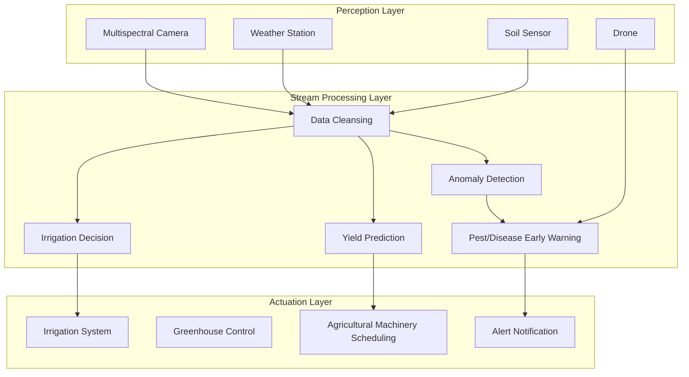

# Operators and Real-Time Smart Agriculture

> **Stage**: Knowledge/10-case-studies | **Prerequisites**: [01.07-two-input-operators.md](../Knowledge/01-concept-atlas/operator-deep-dive/01.07-two-input-operators.md), [realtime-iot-stream-processing-case-study.md](../Knowledge/10-case-studies/realtime-iot-stream-processing-case-study.md) | **Formalization Level**: L3
> **Document Positioning**: Operator fingerprints and Pipeline design for stream-processing operators in smart-agriculture environmental monitoring, precision irrigation, and crop health analysis
> **Version**: 2026.04

---

## Table of Contents

- [Operators and Real-Time Smart Agriculture](#operators-and-real-time-smart-agriculture)
  - [Table of Contents](#table-of-contents)
  - [1. Definitions](#1-definitions)
    - [Def-AGR-01-01: Agricultural Internet of Things (Agri-IoT, 农业物联网)](#def-agr-01-01-agricultural-internet-of-things-agri-iot-农业物联网)
    - [Def-AGR-01-02: Crop Water Stress Index (CWSI, 作物水分亏缺指数)](#def-agr-01-02-crop-water-stress-index-cwsi-作物水分亏缺指数)
    - [Def-AGR-01-03: Precision Irrigation (精准灌溉)](#def-agr-01-03-precision-irrigation-精准灌溉)
    - [Def-AGR-01-04: Pest/Disease Early Warning Model (病虫害预警模型)](#def-agr-01-04-pestdisease-early-warning-model-病虫害预警模型)
    - [Def-AGR-01-05: Normalized Difference Vegetation Index (NDVI, 归一化植被指数)](#def-agr-01-05-normalized-difference-vegetation-index-ndvi-归一化植被指数)
  - [2. Properties](#2-properties)
    - [Lemma-AGR-01-01: Temporal Constraints on Irrigation Decisions](#lemma-agr-01-01-temporal-constraints-on-irrigation-decisions)
    - [Lemma-AGR-01-02: Accuracy Improvement via Multi-Sensor Fusion](#lemma-agr-01-02-accuracy-improvement-via-multi-sensor-fusion)
    - [Prop-AGR-01-01: Irrigation Water-Saving Effect](#prop-agr-01-01-irrigation-water-saving-effect)
    - [Prop-AGR-01-02: Lead Time of Pest/Disease Early Warning](#prop-agr-01-02-lead-time-of-pestdisease-early-warning)
  - [3. Relations](#3-relations)
    - [3.1 Smart Agriculture Pipeline Operator Mapping](#31-smart-agriculture-pipeline-operator-mapping)
    - [3.2 Operator Fingerprint](#32-operator-fingerprint)
    - [3.3 Sensor Comparison](#33-sensor-comparison)
  - [4. Argumentation](#4-argumentation)
    - [4.1 Why Smart Agriculture Needs Stream Processing Instead of Periodic Sampling](#41-why-smart-agriculture-needs-stream-processing-instead-of-periodic-sampling)
    - [4.2 Challenges of Multi-Sensor Data Fusion](#42-challenges-of-multi-sensor-data-fusion)
    - [4.3 Conflict Resolution in Irrigation Decisions](#43-conflict-resolution-in-irrigation-decisions)
  - [5. Proof / Engineering Argument](#5-proof--engineering-argument)
    - [5.1 Precision Irrigation Decision Engine](#51-precision-irrigation-decision-engine)
    - [5.2 Pest/Disease Early Warning System](#52-pestdisease-early-warning-system)
    - [5.3 NDVI Change Monitoring](#53-ndvi-change-monitoring)
  - [6. Examples](#6-examples)
    - [6.1 Real-World Case: Large-Scale Farm Intelligent Irrigation System](#61-real-world-case-large-scale-farm-intelligent-irrigation-system)
    - [6.2 Real-World Case: Greenhouse Environment Control](#62-real-world-case-greenhouse-environment-control)
  - [7. Visualizations](#7-visualizations)
    - [Smart Agriculture Pipeline](#smart-agriculture-pipeline)
  - [8. References](#8-references)

---

## 1. Definitions

### Def-AGR-01-01: Agricultural Internet of Things (Agri-IoT, 农业物联网)

Agricultural Internet of Things (Agri-IoT, 农业物联网) is a sensor network deployed in farmland for real-time monitoring of environmental parameters:

$$\text{AgriIoT} = \{s_i : (\text{type}_i, \text{location}_i, \text{frequency}_i, \text{accuracy}_i)\}_{i=1}^{n}$$

Sensor types: soil moisture, temperature, light intensity, CO₂ concentration, wind speed, rainfall, pH value.

### Def-AGR-01-02: Crop Water Stress Index (CWSI, 作物水分亏缺指数)

Crop Water Stress Index (CWSI, 作物水分亏缺指数) is an indicator characterizing the degree of water stress on crops:

$$\text{CWSI} = \frac{(T_{canopy} - T_{air}) - (T_{canopy}^{wet} - T_{air})}{(T_{canopy}^{dry} - T_{air}) - (T_{canopy}^{wet} - T_{air})}$$

CWSI ∈ [0, 1]; the closer to 1, the more severe the water stress.

### Def-AGR-01-03: Precision Irrigation (精准灌溉)

Precision Irrigation (精准灌溉) is a system that optimizes irrigation decisions based on real-time crop water demand:

$$\text{Irrigate} = \text{CWSI} > \theta_{threshold} \land \text{SoilMoisture} < \theta_{moisture} \land \text{RainForecast} < \theta_{rain}$$

### Def-AGR-01-04: Pest/Disease Early Warning Model (病虫害预警模型)

Pest/Disease Early Warning (病虫害预警模型) is based on an environmental suitability model:

$$\text{Risk} = f(T, RH, L, W) = \prod_{i} \left(1 - \left|\frac{x_i - x_i^{optimal}}{x_i^{max} - x_i^{min}}\right|\right)$$

Where $T$ = temperature, $RH$ = relative humidity, $L$ = light intensity, $W$ = wind speed.

### Def-AGR-01-05: Normalized Difference Vegetation Index (NDVI, 归一化植被指数)

Normalized Difference Vegetation Index (NDVI, 归一化植被指数) is an indicator for assessing vegetation health through remote-sensing data:

$$\text{NDVI} = \frac{NIR - RED}{NIR + RED}$$

NDVI ∈ [-1, 1]; healthy vegetation is approximately 0.3–0.8, bare soil is approximately 0.1–0.2, and water bodies yield negative values.

---

## 2. Properties

### Lemma-AGR-01-01: Temporal Constraints on Irrigation Decisions

Irrigation decisions must account for the timeliness of sensor data:

$$\text{Valid}(d_t) \iff t_{data} \geq t_{decision} - \Delta t_{max}$$

Where $\Delta t_{max}$ is the maximum data validity period (typically 15–60 minutes).

### Lemma-AGR-01-02: Accuracy Improvement via Multi-Sensor Fusion

The standard error of multi-sensor fusion:

$$\sigma_{fusion} = \frac{1}{\sqrt{\sum_{i} \frac{1}{\sigma_i^2}}}$$

**Proof**: The variance of the Best Linear Unbiased Estimator (BLUE) is the harmonic mean of the variances of individual sensors. ∎

### Prop-AGR-01-01: Irrigation Water-Saving Effect

The water-saving rate of precision irrigation compared to traditional flood irrigation:

$$\text{WaterSaving} = 1 - \frac{V_{precision}}{V_{flood}}$$

Typical values: drip irrigation 30–50%, micro-sprinkler irrigation 20–40%, sensor-driven irrigation saves an additional 10–20%.

### Prop-AGR-01-02: Lead Time of Pest/Disease Early Warning

The lead time of an environment-driven early-warning model compared to manual inspection:

$$\text{LeadTime} = t_{symptom} - t_{condition}$$

Typical values: fungal diseases 3–7 days, pest outbreaks 1–3 days.

---

## 3. Relations

### 3.1 Smart Agriculture Pipeline Operator Mapping

| Application Scenario | Operator Combination | Data Source | Latency Requirement |
|---------|---------|--------|---------|
| **Environmental Monitoring** | Source + map | Soil / weather sensors | < 1 min |
| **Anomaly Detection** | window + aggregate + filter | Sensor stream | < 5 min |
| **Irrigation Decision** | KeyedProcessFunction | Multi-sensor fusion | < 10 min |
| **Pest/Disease Early Warning** | Async ML + window | Sensors + images | < 15 min |
| **Yield Prediction** | window + aggregate + ML | Full data | Daily |
| **Resource Scheduling** | Broadcast + KeyedProcess | Agricultural machinery GPS | < 1 min |

### 3.2 Operator Fingerprint

| Dimension | Smart Agriculture Characteristics |
|------|------------|
| **Core Operators** | KeyedProcessFunction (field state machine), AsyncFunction (ML inference), Broadcast (irrigation config), window + aggregate (statistics) |
| **State Types** | ValueState (current field state), MapState (sensor calibration parameters), BroadcastState (irrigation strategy) |
| **Time Semantics** | Processing time primarily (agricultural real-time requirements are relatively relaxed) |
| **Data Characteristics** | Periodicity (day-night cycle), seasonality, strong spatial correlation |
| **State Scale** | Keyed by field; large-scale farms can reach millions of keys |
| **Performance Bottleneck** | Image processing (pest/disease identification), external weather APIs |

### 3.3 Sensor Comparison

| Sensor | Sampling Frequency | Accuracy | Cost | Key Indicator |
|--------|---------|------|------|---------|
| **Soil Moisture** | 15 min | ±2% | Low | Volumetric water content |
| **Temperature** | 5 min | ±0.5°C | Low | Air / soil temperature |
| **Light** | 1 min | ±5% | Low | PAR / total radiation |
| **CO₂** | 5 min | ±20 ppm | Medium | Greenhouse concentration |
| **Multispectral Camera** | Daily / weekly | High | High | NDVI |
| **UAV Remote Sensing** | Weekly / monthly | High | High | Full-field monitoring |

---

## 4. Argumentation

### 4.1 Why Smart Agriculture Needs Stream Processing Instead of Periodic Sampling

Problems with periodic sampling:

- Long data intervals: unable to capture sudden environmental changes
- Response lag: delayed irrigation decisions cause crop damage
- Resource waste: fixed irrigation schedules do not account for real-time demand

Advantages of stream processing:

- Real-time monitoring: immediate response to environmental anomalies
- On-demand irrigation: precise control based on real-time data
- Dynamic adjustment: strategy adaptation combined with weather forecasts

### 4.2 Challenges of Multi-Sensor Data Fusion

**Problem**: Different sensors have varying sampling frequencies, accuracies, and locations. How to fuse them?

**Solution**:

1. **Temporal Alignment**: Align timestamps using nearest-neighbor or interpolation methods
2. **Spatial Interpolation**: Use Kriging interpolation to estimate values at locations without deployed sensors
3. **Quality Assessment**: Down-weight or discard data from anomalous sensors

### 4.3 Conflict Resolution in Irrigation Decisions

**Scenario**: Adjacent fields simultaneously request irrigation, but pump capacity is limited.

**Strategy**:

1. **Priority**: Fields with higher CWSI take precedence
2. **Time Slicing**: Rotate irrigation, 10 minutes per field
3. **Prediction**: Combine with weather forecasts; skip irrigation if rain is imminent

---

## 5. Proof / Engineering Argument

### 5.1 Precision Irrigation Decision Engine

```java
public class IrrigationDecisionFunction extends BroadcastProcessFunction<SensorReading, IrrigationConfig, IrrigationCommand> {
    private ValueState<FieldState> fieldState;
    private MapState<String, SensorReading> latestReadings;

    @Override
    public void processElement(SensorReading reading, ReadOnlyContext ctx, Collector<IrrigationCommand> out) throws Exception {
        // Save latest reading
        latestReadings.put(reading.getSensorId(), reading);

        FieldState state = fieldState.value();
        if (state == null) state = new FieldState();

        // Get all sensor data for this field
        double soilMoisture = getAverage("SOIL_MOISTURE", state.getFieldId());
        double temperature = getAverage("TEMPERATURE", state.getFieldId());
        double canopyTemp = getAverage("CANOPY_TEMP", state.getFieldId());

        // Calculate CWSI
        double cwsi = calculateCWSI(canopyTemp, temperature);

        // Get weather forecast (Broadcast State)
        ReadOnlyBroadcastState<String, WeatherForecast> weather = ctx.getBroadcastState(WEATHER_DESCRIPTOR);
        WeatherForecast forecast = weather.get(state.getFieldId());

        double rainForecast = forecast != null ? forecast.getRainProbability() : 0;

        // Irrigation decision
        boolean shouldIrrigate = cwsi > 0.6 && soilMoisture < 30 && rainForecast < 0.3;

        if (shouldIrrigate && !state.isIrrigating()) {
            double duration = calculateDuration(cwsi, soilMoisture);
            out.collect(new IrrigationCommand(state.getFieldId(), duration, "START"));
            state.setIrrigating(true);
            fieldState.update(state);
        }

        // Update field state
        state.setCwsi(cwsi);
        state.setSoilMoisture(soilMoisture);
        fieldState.update(state);
    }

    private double calculateCWSI(double canopyTemp, double airTemp) {
        double wetDiff = 0;  // Temperature difference under full irrigation
        double dryDiff = 5;  // Temperature difference under severe stress
        double actualDiff = canopyTemp - airTemp;
        return (actualDiff - wetDiff) / (dryDiff - wetDiff);
    }
}
```

### 5.2 Pest/Disease Early Warning System

```java
// Environmental sensor stream
DataStream<SensorReading> sensors = env.addSource(new AgriIoTSource());

// Image recognition stream (drone / fixed camera)
DataStream<DroneImage> images = env.addSource(new DroneImageSource());

// Environmental risk calculation
DataStream<PestRisk> envRisk = sensors.keyBy(SensorReading::getFieldId)
    .window(SlidingEventTimeWindows.of(Time.hours(24), Time.hours(1)))
    .aggregate(new EnvironmentRiskAggregate())
    .filter(r -> r.getRiskScore() > 0.7);

// Image recognition (async ML model invocation)
DataStream<ImageAnalysis> imageAnalysis = AsyncDataStream.unorderedWait(
    images,
    new PestDetectionFunction(),
    Time.seconds(10),
    100
);

// Joint early warning
envRisk.connect(imageAnalysis)
    .keyBy(PestRisk::getFieldId, ImageAnalysis::getFieldId)
    .process(new CoProcessFunction<PestRisk, ImageAnalysis, PestAlert>() {
        private ValueState<PestRisk> pendingRisk;
        private ValueState<ImageAnalysis> pendingImage;

        @Override
        public void processElement1(PestRisk risk, Context ctx, Collector<PestAlert> out) {
            ImageAnalysis img = pendingImage.value();
            if (img != null) {
                out.collect(new PestAlert(risk.getFieldId(), risk.getRiskScore(), img.getPestType(), ctx.timestamp()));
                pendingImage.clear();
            } else {
                pendingRisk.update(risk);
                ctx.timerService().registerEventTimeTimer(ctx.timestamp() + 600000);  // 10-minute timeout
            }
        }

        @Override
        public void processElement2(ImageAnalysis img, Context ctx, Collector<PestAlert> out) {
            PestRisk risk = pendingRisk.value();
            if (risk != null) {
                out.collect(new PestAlert(risk.getFieldId(), risk.getRiskScore(), img.getPestType(), ctx.timestamp()));
                pendingRisk.clear();
            } else {
                pendingImage.update(img);
            }
        }

        @Override
        public void onTimer(long timestamp, OnTimerContext ctx, Collector<PestAlert> out) {
            PestRisk risk = pendingRisk.value();
            if (risk != null) {
                out.collect(new PestAlert(risk.getFieldId(), risk.getRiskScore(), "UNKNOWN", timestamp));
                pendingRisk.clear();
            }
        }
    })
    .addSink(new AlertSink());
```

### 5.3 NDVI Change Monitoring

```java
// Remote sensing data stream
DataStream<SatelliteImage> satellite = env.addSource(new SatelliteSource());

// Calculate NDVI and detect anomalous changes
satellite.keyBy(SatelliteImage::getFieldId)
    .process(new KeyedProcessFunction<String, SatelliteImage, NDVIAlert>() {
        private ValueState<Double> lastNDVI;

        @Override
        public void processElement(SatelliteImage img, Context ctx, Collector<NDVIAlert> out) throws Exception {
            double ndvi = calculateNDVI(img);
            Double last = lastNDVI.value();

            if (last != null) {
                double change = ndvi - last;
                if (Math.abs(change) > 0.2) {
                    String trend = change > 0 ? "IMPROVING" : "DEGRADING";
                    out.collect(new NDVIAlert(img.getFieldId(), ndvi, change, trend, ctx.timestamp()));
                }
            }

            lastNDVI.update(ndvi);
        }

        private double calculateNDVI(SatelliteImage img) {
            double nir = img.getBand("NIR");
            double red = img.getBand("RED");
            return (nir - red) / (nir + red);
        }
    })
    .addSink(new DashboardSink());
```

---

## 6. Examples

### 6.1 Real-World Case: Large-Scale Farm Intelligent Irrigation System

```java
// 1. Multi-sensor data ingestion
DataStream<SensorReading> readings = env.addSource(new MQTTSource("farm/sensors/+/+"));

// 2. Group by field and process
readings.keyBy(SensorReading::getFieldId)
    .connect(irrigationConfigBroadcast)
    .process(new IrrigationDecisionFunction())
    .addSink(new IrrigationControllerSink());

// 3. Global water resource scheduling
DataStream<IrrigationCommand> commands = env.addSource(new IrrigationCommandSource());
commands.keyBy(IrrigationCommand::getWaterSource)
    .window(TumblingProcessingTimeWindows.of(Time.minutes(5)))
    .aggregate(new WaterUsageAggregate())
    .filter(usage -> usage.getTotal() > usage.getCapacity())
    .addSink(new OveruseAlertSink());
```

### 6.2 Real-World Case: Greenhouse Environment Control

```java
// Greenhouse sensor stream
DataStream<GreenhouseReading> greenhouse = env.addSource(new GreenhouseSource());

// Environmental parameter anomaly detection
greenhouse.keyBy(GreenhouseReading::getGreenhouseId)
    .process(new KeyedProcessFunction<String, GreenhouseReading, ControlCommand>() {
        private ValueState<GreenhouseState> state;

        @Override
        public void processElement(GreenhouseReading reading, Context ctx, Collector<ControlCommand> out) {
            GreenhouseState s = state.value();
            if (s == null) s = new GreenhouseState();

            // Temperature control
            if (reading.getTemperature() > s.getTargetTemp() + 2) {
                out.collect(new ControlCommand(reading.getGreenhouseId(), "COOLING", "ON"));
            } else if (reading.getTemperature() < s.getTargetTemp() - 2) {
                out.collect(new ControlCommand(reading.getGreenhouseId(), "HEATING", "ON"));
            }

            // CO₂ control
            if (reading.getCo2() < s.getTargetCO2() - 100) {
                out.collect(new ControlCommand(reading.getGreenhouseId(), "CO2", "ON"));
            }

            // Supplemental lighting control
            if (reading.getLight() < s.getTargetLight() && reading.getHour() > 6 && reading.getHour() < 18) {
                out.collect(new ControlCommand(reading.getGreenhouseId(), "LIGHT", "ON"));
            }
        }
    })
    .addSink(new GreenhouseControllerSink());
```

---

## 7. Visualizations

### Smart Agriculture Pipeline

The following diagram illustrates the three-layer architecture of a smart-agriculture stream-processing pipeline, from sensor perception through stream processing to actuation.



---

## 8. References


---

*Related Documents*: [01.07-two-input-operators.md](../Knowledge/01-concept-atlas/operator-deep-dive/01.07-two-input-operators.md) | [realtime-iot-stream-processing-case-study.md](../Knowledge/10-case-studies/realtime-iot-stream-processing-case-study.md) | [operator-edge-computing-integration.md](../Knowledge/06-frontier/operator-edge-computing-integration.md)
