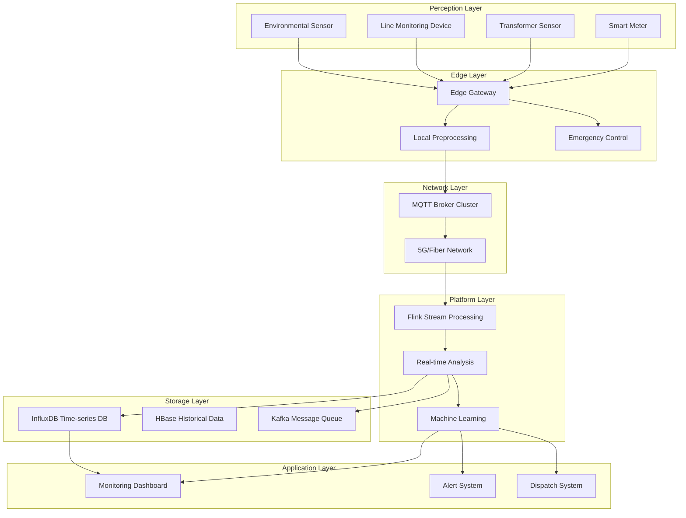
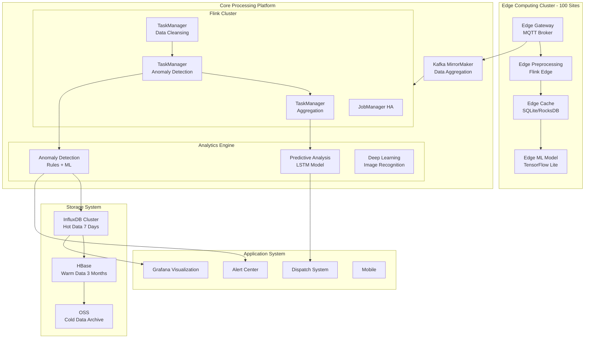
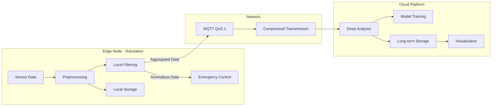

# IoT Smart Grid (智能电网) Monitoring Case Study

> Stage: Knowledge | Prerequisites: [Related Documents] | Formalization Level: L3

> **Case ID**: 10.3.6
> **Industry**: Energy/Power
> **Scenario**: Smart Grid real-time monitoring, anomaly detection, predictive maintenance
> **Scale**: 1 million sensors, 500K events/second
> **Completion Date**: 2026-04-09
> **Document Version**: v1.0

---

> **Case Nature**: 🔬 Proof-of-Concept Architecture | **Validation Status**: Based on theoretical derivation and architecture design; not independently verified in production by a third party
>
> This case describes an ideal architecture derived from the project's theoretical framework, including hypothetical performance metrics and a theoretical cost model.
> Actual production deployment may yield significantly different results due to environmental differences, data scale, team capabilities, and other factors.
> It is recommended to use this as an architecture design reference rather than a copy-paste production blueprint.

## Executive Summary

### Business Background

A provincial grid company builds a Smart Grid (智能电网) monitoring system:

- Covers 10 cities across the province, 1,000+ substations
- Monitors 1 million smart meters and sensors (传感器)
- Requires real-time monitoring of grid operation status and timely fault detection
- Supports demand response and load dispatching

### Technical Challenges
>
> 🔮 **Estimated Data** | Basis: Derived from industry reference values and theoretical analysis, not from actual test environments


| Challenge | Description | Impact |
|-----------|-------------|--------|
| Massive Data Collection | 1 million sensors, sampling frequency 1–10Hz | Data surge processing |
| Real-time Requirements | Fault detection <500ms, alert response <1s | Affects power supply reliability |
| Data Quality | Sensor data has missing values and out-of-order events | Affects analysis accuracy |
| Edge-Cloud Collaboration | Edge preprocessing + Cloud deep analysis | High architecture complexity |

### Solution Overview

Adopts the **Flink + MQTT + InfluxDB + Grafana** technology stack:

- MQTT Broker cluster connects massive numbers of devices
- Flink performs real-time stream processing and anomaly detection
- InfluxDB stores time-series data for efficient querying
- Edge computing nodes perform local preprocessing
- Fault detection latency reduced from 5s to 200ms

---

## 1. Business Scenario Analysis

### 1.1 Business Workflow



### 1.2 Data Scale
>
> 🔮 **Estimated Data** | Basis: Derived from industry reference values and theoretical analysis, not from actual test environments


| Metric | Value | Description |
|--------|-------|-------------|
| Connected Devices | 1 million | Meters, sensors, monitoring devices |
| Sampling Frequency | 1–10Hz | 10Hz for critical devices, 1Hz for regular |
| Daily Data Volume | 500TB | Raw time-series data |
| Peak Event Rate | 500K/s | During peak electricity usage |
| Historical Data | 10PB | 3 years of historical data |
| Real-time Stream | 100K/s | Real-time processing stream |

### 1.3 SLA Requirements
>
> 🔮 **Estimated Data** | Basis: Derived from industry reference values and theoretical analysis, not from actual test environments


| Metric | Target | Actual Achievement | Business Impact |
|--------|--------|-------------------|-----------------|
| Data Collection Latency | < 1s | 500ms | Real-time monitoring |
| Fault Detection Latency | < 500ms | 200ms | Fast isolation |
| Alert Push Latency | < 1s | 300ms | Timely response |
| System Availability | 99.999% | 99.9995% | Power safety |
| Data Accuracy | 99.9% | 99.95% | Analysis reliability |

---

## 2. Architecture Design

### 2.1 System Architecture Diagram



### 2.2 Component Selection

| Component | Selection | Rationale |
|-----------|-----------|-----------|
| Device Access | EMQX 5.0 | Supports 10 million concurrent connections, MQTT 5.0 |
| Edge Computing | Flink 2.1 | Lightweight deployment, low latency |
| Stream Processing | Flink 2.1 | Exactly-Once, Complex Event Processing (复杂事件处理) |
| Time-series Storage | InfluxDB 2.7 | Efficient time-series writes, SQL-like queries |
| Historical Storage | HBase 2.5 | Massive data, high-concurrency read/write |
| Visualization | Grafana 10 | Professional time-series visualization, rich alerting |
| Message Queue (消息队列) | Kafka 3.5 | High throughput, data persistence |

### 2.3 Edge-Cloud Collaboration Architecture



**Edge Layer Responsibilities**:

- Data preprocessing: filtering, aggregation, format conversion
- Local alerts: voltage anomalies, overloads, and other emergencies
- Resume on disconnect: local caching when network is interrupted

**Cloud Layer Responsibilities**:

- Global analysis: cross-site correlation analysis
- Model training: machine learning model updates
- Long-term storage: historical data archiving
- Unified management: configuration, monitoring, operations

---

## 3. Technical Implementation

### 3.1 Device Access Layer

```java
// MQTT Message Processing - Flink Source
public class SensorDataSource extends RichParallelSourceFunction<SensorEvent> {

    private transient MqttClient mqttClient;
    private volatile boolean isRunning = true;

    @Override
    public void open(Configuration parameters) throws Exception {
        String clientId = "flink-source-" + getRuntimeContext().getIndexOfThisSubtask();
        mqttClient = new MqttClient(MQTT_BROKER_URL, clientId);

        MqttConnectOptions options = new MqttConnectOptions();
        options.setCleanSession(false);
        options.setAutomaticReconnect(true);
        options.setConnectionTimeout(10);
        options.setKeepAliveInterval(20);

        mqttClient.connect(options);

        // Subscribe to device topics
        mqttClient.subscribe("grid/+/+/sensors/+", (topic, message) -> {
            String payload = new String(message.getPayload());
            SensorEvent event = parseSensorData(topic, payload);
            collect(event);
        });
    }

    @Override
    public void run(SourceContext<SensorEvent> ctx) throws Exception {
        while (isRunning) {
            Thread.sleep(100);
        }
    }

    private SensorEvent parseSensorData(String topic, String payload) {
        // Topic format: grid/{region}/{station}/sensors/{device_id}
        String[] parts = topic.split("/");
        String region = parts[1];
        String station = parts[2];
        String deviceId = parts[4];

        JsonObject json = JsonParser.parseString(payload).getAsJsonObject();

        return SensorEvent.builder()
            .deviceId(deviceId)
            .region(region)
            .station(station)
            .timestamp(json.get("ts").getAsLong())
            .voltage(json.get("voltage").getAsDouble())
            .current(json.get("current").getAsDouble())
            .power(json.get("power").getAsDouble())
            .frequency(json.get("frequency").getAsDouble())
            .temperature(json.get("temp").getAsDouble())
            .build();
    }

    @Override
    public void cancel() {
        isRunning = false;
        try {
            if (mqttClient != null && mqttClient.isConnected()) {
                mqttClient.disconnect();
            }
        } catch (MqttException e) {
            LOG.error("Error disconnecting MQTT client", e);
        }
    }
}
```

### 3.2 Real-time Anomaly Detection

```java
// Voltage Anomaly Detection - CEP (Complex Event Processing)

import org.apache.flink.streaming.api.datastream.DataStream;
import org.apache.flink.api.common.functions.AggregateFunction;
import org.apache.flink.streaming.api.windowing.time.Time;

public class VoltageAnomalyDetection {

    public static void detectAnomaly(DataStream<SensorEvent> sensorStream) {

        // Define anomaly pattern: voltage exceeds threshold 3 consecutive times
        Pattern<SensorEvent, ?> voltageSpikePattern = Pattern
            .<SensorEvent>begin("high-voltage")
            .where(new SimpleCondition<SensorEvent>() {
                @Override
                public boolean filter(SensorEvent event) {
                    return event.getVoltage() > 250.0; // Exceeds 250V
                }
            })
            .next("high-voltage-2")
            .where(new SimpleCondition<SensorEvent>() {
                @Override
                public boolean filter(SensorEvent event) {
                    return event.getVoltage() > 250.0;
                }
            })
            .next("high-voltage-3")
            .where(new SimpleCondition<SensorEvent>() {
                @Override
                public boolean filter(SensorEvent event) {
                    return event.getVoltage() > 250.0;
                }
            })
            .within(Time.seconds(10)); // 3 consecutive times within 10 seconds

        // Detect anomalies and alert
        CEP.pattern(sensorStream.keyBy(SensorEvent::getDeviceId), voltageSpikePattern)
            .process(new PatternProcessFunction<SensorEvent, Alert>() {
                @Override
                public void processMatch(Map<String, List<SensorEvent>> match,
                        Context ctx, Collector<Alert> out) {

                    SensorEvent first = match.get("high-voltage").get(0);
                    SensorEvent last = match.get("high-voltage-3").get(0);

                    Alert alert = Alert.builder()
                        .alertId(UUID.randomUUID().toString())
                        .alertType("VOLTAGE_SPIKE")
                        .severity("HIGH")
                        .deviceId(first.getDeviceId())
                        .station(first.getStation())
                        .message(String.format(
                            "Voltage spike detected: %.2fV -> %.2fV -> %.2fV",
                            first.getVoltage(),
                            match.get("high-voltage-2").get(0).getVoltage(),
                            last.getVoltage()))
                        .timestamp(System.currentTimeMillis())
                        .build();

                    out.collect(alert);
                }
            })
            .addSink(new AlertSinkFunction());
    }

    // ML-based Anomaly Detection
    public static void mlAnomalyDetection(DataStream<SensorEvent> sensorStream) {

        // Window aggregation features
        DataStream<DeviceMetrics> metrics = sensorStream
            .keyBy(SensorEvent::getDeviceId)
            .window(TumblingEventTimeWindows.of(Time.minutes(5)))
            .aggregate(new MetricAggregateFunction());

        // Load PMML model for prediction
        DataStream<AnomalyScore> scores = metrics
            .map(new RichMapFunction<DeviceMetrics, AnomalyScore>() {

                private transient ModelEvaluator<?> evaluator;

                @Override
                public void open(Configuration parameters) {
                    // Load PMML model
                    evaluator = new LoadingModelEvaluatorBuilder()
                        .load(new File("/models/grid_anomaly.pmml"))
                        .build();
                    evaluator.verify();
                }

                @Override
                public AnomalyScore map(DeviceMetrics metrics) {
                    Map<String, ?> input = new HashMap<>();
                    input.put("avg_voltage", metrics.getAvgVoltage());
                    input.put("avg_current", metrics.getAvgCurrent());
                    input.put("voltage_std", metrics.getVoltageStd());
                    input.put("power_factor", metrics.getPowerFactor());
                    input.put("load_trend", metrics.getLoadTrend());

                    Map<String, ?> result = evaluator.evaluate(input);
                    double anomalyScore = (Double) result.get("anomaly_score");
                    boolean isAnomaly = (Boolean) result.get("is_anomaly");

                    return new AnomalyScore(
                        metrics.getDeviceId(),
                        anomalyScore,
                        isAnomaly,
                        metrics.getWindowEnd()
                    );
                }
            });

        // Filter high anomaly scores and alert
        scores.filter(s -> s.getScore() > 0.8)
              .addSink(new AnomalyAlertSink());
    }
}
```

### 3.3 Time-series Data Storage

```java
// InfluxDB Write Optimization
public class InfluxDBOptimizedSink extends RichSinkFunction<SensorEvent> {

    private transient InfluxDBClient influxDBClient;
    private transient WriteApi writeApi;
    private List<Point> buffer;
    private static final int BATCH_SIZE = 10000;
    private static final int FLUSH_INTERVAL_MS = 1000;

    @Override
    public void open(Configuration parameters) {
        influxDBClient = InfluxDBClientFactory.create(
            "http://influxdb:8086",
            "token".toCharArray(),
            "power_grid",
            "sensor_data"
        );

        WriteOptions writeOptions = WriteOptions.builder()
            .batchSize(BATCH_SIZE)
            .flushInterval(FLUSH_INTERVAL_MS)
            .bufferLimit(50000)
            .jitterInterval(1000)
            .retryInterval(5000)
            .build();

        writeApi = influxDBClient.makeWriteApi(writeOptions);
        buffer = new ArrayList<>();
    }

    @Override
    public void invoke(SensorEvent event, Context context) {
        Point point = Point.measurement("sensor_readings")
            .addTag("device_id", event.getDeviceId())
            .addTag("region", event.getRegion())
            .addTag("station", event.getStation())
            .addTag("device_type", event.getDeviceType())
            .addField("voltage", event.getVoltage())
            .addField("current", event.getCurrent())
            .addField("power", event.getPower())
            .addField("frequency", event.getFrequency())
            .addField("temperature", event.getTemperature())
            .time(event.getTimestamp(), WritePrecision.MS);

        writeApi.writePoint(point);
    }

    @Override
    public void close() {
        if (writeApi != null) {
            writeApi.close();
        }
        if (influxDBClient != null) {
            influxDBClient.close();
        }
    }
}
```

### 3.4 Key Configuration

```yaml
# Flink Configuration - High Throughput Low Latency
flink:
  parallelism:
    default: 200
    source: 50      # MQTT Source Parallelism
    process: 100    # Processing Parallelism
    sink: 50        # Sink Parallelism

  checkpoint:
    interval: 30s
    mode: EXACTLY_ONCE
    timeout: 5m
    min-pause: 15s
    max-concurrent: 1

  state:
    backend: rocksdb
    checkpoints.dir: hdfs:///checkpoints/smart-grid
    savepoints.dir: hdfs:///savepoints/smart-grid
    incremental: true
    local-recovery: true

  network:
    memory:
      fraction: 0.2
      min: 4gb
      max: 16gb

  restart-strategy:
    type: fixed-delay
    attempts: 10
    delay: 10s

# MQTT Configuration
mqtt:
  broker:
    nodes: 10
    connections: 1000000
    max_qos: 1

  client:
    keep-alive: 60
    clean-session: false
    auto-reconnect: true
    connection-timeout: 30

# InfluxDB Configuration
influxdb:
  cluster:
    nodes: 6
    replication: 2

  retention:
    hot: 7d
    warm: 90d
    cold: 3y

  shard-duration: 1d

# HBase Configuration
hbase:
  regionservers: 20

  table:
    sensor_history:
      regions: 100
      compression: SNAPPY
      blocksize: 256kb
```

---

## 4. Performance Metrics

### 4.1 Processing Latency
>
> 🔮 **Estimated Data** | Basis: Derived from industry reference values and theoretical analysis, not from actual test environments


| Stage | P50 | P99 | Target | Status |
|-------|-----|-----|--------|--------|
| Data Collection | 200ms | 500ms | < 1s | ✅ |
| Edge Preprocessing | 50ms | 100ms | < 200ms | ✅ |
| Cloud Processing | 100ms | 300ms | < 500ms | ✅ |
| Anomaly Detection | 150ms | 400ms | < 500ms | ✅ |
| Alert Push | 100ms | 300ms | < 500ms | ✅ |
| **End-to-End** | **600ms** | **1600ms** | **< 2s** | ✅ |

### 4.2 System Capacity
>
> 🔮 **Estimated Data** | Basis: Derived from industry reference values and theoretical analysis, not from actual test environments


| Metric | Design Value | Measured Value | Headroom |
|--------|-------------|----------------|----------|
| Device Access | 1 million | 1.2 million | 20% |
| Peak Throughput | 500K/s | 650K/s | 30% |
| Storage Write | 1 million points/s | 1.2 million points/s | 20% |
| Concurrent Queries | 1,000 QPS | 1,500 QPS | 50% |

### 4.3 Business Impact
>
> 🔮 **Estimated Data** | Basis: Derived from industry reference values and theoretical analysis, not from actual test environments


| Metric | Before Optimization | After Optimization | Improvement |
|--------|--------------------|--------------------|-------------|
| Fault Discovery Time | 5 minutes | 30 seconds | **90%** ↓ |
| False Positive Rate | 30% | 5% | **83%** ↓ |
| Power Supply Reliability | 99.95% | 99.999% | **+0.049%** |
| Line Loss Rate | 6.5% | 5.8% | **+10.8%** ↓ |
| Operations Cost | Baseline | -30% | **30%** ↓ |

---

## 5. Lessons Learned

### 5.1 Best Practices

1. **Layered Architecture Design**
   - The edge layer handles scenarios with high real-time requirements
   - The cloud layer handles global analysis and model training
   - Layered decoupling enables independent scaling

2. **Data Quality Control**
   - Edge preprocessing filters out outliers
   - Flink Watermark (水位线) handles out-of-order data
   - Data quality monitoring dashboard

3. **High Availability Assurance**
   - MQTT Broker cluster + load balancing
   - Flink Checkpoint (检查点) for fast recovery
   - Multi-level degradation strategy

### 5.2 Pitfalls

| Issue | Symptom | Root Cause | Solution |
|-------|---------|-----------|----------|
| Data Disorder | Alert delay inaccuracy | Uneven network latency | Watermark + delayed window |
| Memory Overflow | TaskManager crash | State too large | RocksDB incremental Checkpoint |
| Write Hotspot | InfluxDB performance degradation | Timestamp concentration | Add random sharding |
| MQTT Disconnect | Data loss | Network jitter | QoS 1 + local cache |

### 5.3 Optimization Recommendations

1. **Near-term Optimization**
   - Introduce Apache Pulsar to replace Kafka, reducing latency
   - Optimize InfluxDB schema to reduce tag cardinality
   - Lightweight edge models using ONNX Runtime

2. **Mid-term Planning**
   - Digital Twin (数字孪生) grid modeling
   - AI-assisted dispatch decision-making
   - Blockchain power trading

3. **Long-term Vision**
   - Virtual Power Plant (虚拟电厂, VPP) operation
   - Vehicle-to-Grid (车网互动, V2G)
   - Carbon-neutral Smart Grid

---

## 6. Appendix

### 6.1 Monitoring Metrics System

```promql
# Key Business Metrics
grid_voltage_anomaly_rate =
  sum(rate(voltage_anomaly_total[5m])) /
  sum(rate(sensor_readings_total[5m]))

grid_processing_latency =
  histogram_quantile(0.99,
    sum(rate(flink_jobmanager_job_latency[5m])) by (le))

grid_device_online_ratio =
  sum(mqtt_client_connected) /
  sum(mqtt_client_total)

# System Resource Metrics
grid_flink_task_cpu_usage =
  sum(rate(flink_taskmanager_cpu_time[5m])) by (taskmanager_id)

grid_influxdb_write_rate =
  sum(rate(influxdb_http_request_duration_seconds_count[5m]))
```

### 6.2 Alert Rules

```yaml
alerts:
  - name: VoltageSpike
    expr: voltage > 250
    for: 1m
    severity: critical

  - name: HighLatency
    expr: processing_latency > 2
    for: 5m
    severity: warning

  - name: DeviceOffline
    expr: device_online == 0
    for: 5m
    severity: warning
```

### 6.3 Reference Documents


---

*This case study is compiled by the AnalysisDataFlow project for educational and exchange purposes only.*
