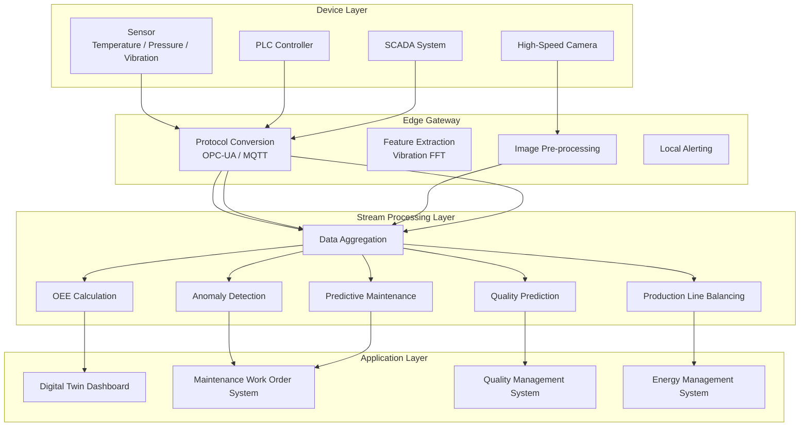
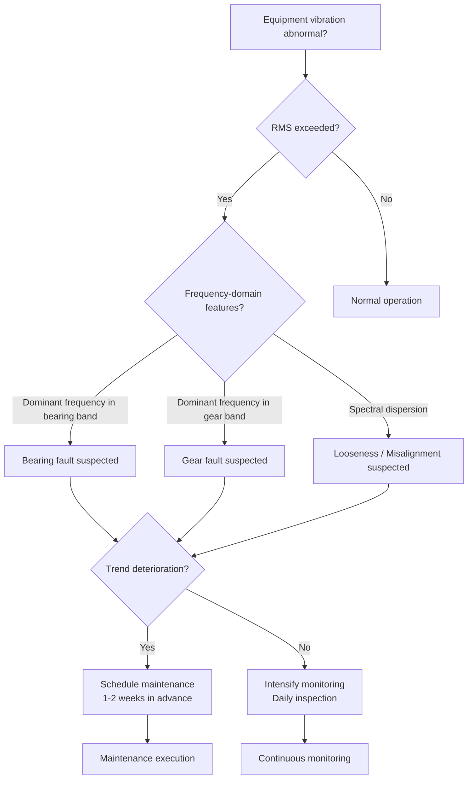

# Operators and Real-Time Smart Manufacturing (智能制造 / Industry 4.0)

> **Stage**: Knowledge/10-case-studies | **Prerequisites**: [operator-iot-stream-processing.md](operator-iot-stream-processing.md), [operator-edge-computing-integration.md](operator-edge-computing-integration.md) | **Formalization Level**: L3
> **Document Positioning**: Stream processing operator fingerprints and pipeline design in Smart Manufacturing (智能制造) and Industry 4.0 (工业4.0)
> **Version**: 2026.04

---

## Table of Contents

- [Operators and Real-Time Smart Manufacturing (Industry 4.0)](#operators-and-real-time-smart-manufacturing-industry-40)
  - [Table of Contents](#table-of-contents)
  - [1. Definitions](#1-definitions)
    - [Def-MFG-01-01: Smart Manufacturing (智能制造) / Industry 4.0 (工业4.0)](#def-mfg-01-01-smart-manufacturing--industry-40)
    - [Def-MFG-01-02: Industrial Data Stream (工业数据流)](#def-mfg-01-02-industrial-data-stream)
    - [Def-MFG-01-03: Digital Twin (数字孪生)](#def-mfg-01-03-digital-twin)
    - [Def-MFG-01-04: OEE (Overall Equipment Effectiveness)](#def-mfg-01-04-oee-overall-equipment-effectiveness)
    - [Def-MFG-01-05: Predictive Maintenance (预测性维护), PdM](#def-mfg-01-05-predictive-maintenance-pdm)
  - [2. Properties](#2-properties)
    - [Lemma-MFG-01-01: Industrial Application of the Sensor Sampling Theorem](#lemma-mfg-01-01-industrial-application-of-the-sensor-sampling-theorem)
    - [Lemma-MFG-01-02: Real-Time Computability of OEE](#lemma-mfg-01-02-real-time-computability-of-oee)
    - [Prop-MFG-01-01: Failure Lead Time of Predictive Maintenance](#prop-mfg-01-01-failure-lead-time-of-predictive-maintenance)
    - [Prop-MFG-01-02: Bandwidth Savings of Edge-Cloud Collaboration](#prop-mfg-01-02-bandwidth-savings-of-edge-cloud-collaboration)
  - [3. Relations](#3-relations)
    - [3.1 Smart Manufacturing Pipeline Operator Mapping](#31-smart-manufacturing-pipeline-operator-mapping)
    - [3.2 Operator Fingerprint](#32-operator-fingerprint)
    - [3.3 Industrial Protocols and Source Operators](#33-industrial-protocols-and-source-operators)
  - [4. Argumentation](#4-argumentation)
    - [4.1 Why Smart Manufacturing Needs Stream Processing Instead of Traditional SCADA](#41-why-smart-manufacturing-needs-stream-processing-instead-of-traditional-scada)
    - [4.2 Real-Time Synchronization Challenges of Digital Twins](#42-real-time-synchronization-challenges-of-digital-twins)
    - [4.3 Real-Time Challenges of Visual Quality Inspection](#43-real-time-challenges-of-visual-quality-inspection)
  - [5. Proof / Engineering Argument](#5-proof--engineering-argument)
    - [5.1 OEE Real-Time Calculation Implementation](#51-oee-real-time-calculation-implementation)
    - [5.2 Vibration Feature Extraction for Predictive Maintenance](#52-vibration-feature-extraction-for-predictive-maintenance)
    - [5.3 Real-Time Production Line Balancing Optimization](#53-real-time-production-line-balancing-optimization)
  - [6. Examples](#6-examples)
    - [6.1 Case Study: Predictive Maintenance in an Automotive Factory](#61-case-study-predictive-maintenance-in-an-automotive-factory)
    - [6.2 Case Study: Visual Quality Inspection Pipeline](#62-case-study-visual-quality-inspection-pipeline)
  - [7. Visualizations](#7-visualizations)
    - [Smart Manufacturing Pipeline Architecture](#smart-manufacturing-pipeline-architecture)
    - [Predictive Maintenance Decision Tree](#predictive-maintenance-decision-tree)
  - [8. References](#8-references)

---

## 1. Definitions

### Def-MFG-01-01: Smart Manufacturing (智能制造) / Industry 4.0 (工业4.0)

Smart Manufacturing (智能制造) is a manufacturing paradigm that achieves self-perception, self-decision, and self-execution of production processes through the Internet of Things (IoT, 物联网), big data (大数据), and artificial intelligence (AI, 人工智能) technologies:

$$\text{SmartMfg} = (\text{CPS}, \text{IoT}, \text{Big Data}, \text{AI}) \times \text{ProductionProcess}$$

Where CPS (Cyber-Physical System, 信息物理系统) serves as the bridge connecting physical devices and digital models.

### Def-MFG-01-02: Industrial Data Stream (工业数据流)

An Industrial Data Stream (工业数据流) is a time series of multi-source heterogeneous data generated by factory equipment, sensors, and control systems:

$$\text{IndustrialStream} = \{S_{sensor}, S_{PLC}, S_{MES}, S_{SCADA}, S_{Quality}\}$$

- $S_{sensor}$: Temperature / pressure / vibration / current sensor data (high frequency, 100Hz-10kHz)
- $S_{PLC}$: Programmable Logic Controller (PLC, 可编程逻辑控制器) state changes (medium frequency, 1-100Hz)
- $S_{MES}$: Manufacturing Execution System (MES, 制造执行系统) work order events (low frequency, event-triggered)
- $S_{SCADA}$: Supervisory Control and Data Acquisition (SCADA, 监控与数据采集系统) alerts (low frequency, anomaly-triggered)
- $S_{Quality}$: Quality inspection data (offline / online hybrid)

### Def-MFG-01-03: Digital Twin (数字孪生)

A Digital Twin (数字孪生) is a real-time virtual mapping of a physical device or production line:

$$\text{DigitalTwin}_t = f(\text{PhysicalState}_t, \text{HistoricalData}, \text{PhysicsModel})$$

Stream processing operators are responsible for mapping real-time sensor data to state updates of the Digital Twin (数字孪生) model.

### Def-MFG-01-04: OEE (Overall Equipment Effectiveness)

OEE (Overall Equipment Effectiveness, 设备综合效率) is a core metric for measuring equipment efficiency:

$$\text{OEE} = \text{Availability} \times \text{Performance} \times \text{Quality}$$

Where:

- Availability = Actual Run Time / Planned Run Time
- Performance = Actual Output / Theoretical Maximum Output
- Quality = Number of Good Units / Total Output

### Def-MFG-01-05: Predictive Maintenance (预测性维护), PdM

Predictive Maintenance (PdM, 预测性维护) is a maintenance strategy that predicts equipment failures and intervenes in advance by analyzing equipment operational data:

$$\text{RUL}(t) = \text{Remaining Useful Life at time } t$$

A maintenance work order is triggered when $P(\text{Failure} \mid \text{Data}_{[t-W, t]}) > \text{Threshold}$.

---

## 2. Properties

### Lemma-MFG-01-01: Industrial Application of the Sensor Sampling Theorem

According to the Nyquist Sampling Theorem, to accurately capture equipment vibration features, the sampling frequency $f_s$ must satisfy:

$$f_s > 2 \cdot f_{max}$$

Where $f_{max}$ is the highest vibration frequency of the equipment (bearing faults typically fall in the 1-20kHz range).

**Engineering Corollary**: Vibration monitoring requires a sampling rate of 40kHz+, generating massive data volumes (> 100MB/day per device). Edge pre-processing is therefore necessary.

### Lemma-MFG-01-02: Real-Time Computability of OEE

All three components of OEE can be computed in real time via stream processing:

$$\text{Availability}_t = \frac{\int_0^t \mathbb{1}_{running}(\tau) d\tau}{t}$$

$$\text{Performance}_t = \frac{\sum_{i} \text{actualCycle}_i}{\sum_{i} \text{idealCycle}_i}$$

$$\text{Quality}_t = \frac{\sum_{i} \mathbb{1}_{pass}(i)}{\sum_{i} 1}$$

### Prop-MFG-01-01: Failure Lead Time of Predictive Maintenance

The value of Predictive Maintenance (预测性维护) is positively correlated with the failure prediction lead time $\Delta t_{pred}$:

$$\text{Value}_{PdM} \propto \Delta t_{pred}$$

**Typical Lead Times**:

- Vibration analysis: 1-4 weeks in advance
- Oil analysis: 2-6 weeks in advance
- Temperature trends: 1-2 weeks in advance
- Current signature analysis: 3-7 days in advance

### Prop-MFG-01-02: Bandwidth Savings of Edge-Cloud Collaboration

Edge pre-processing in industrial scenarios can significantly reduce the volume of uploaded data:

| Data Type | Raw Data Volume | After Edge Processing | Compression Ratio |
|-----------|-----------------|----------------------|-------------------|
| Vibration waveform | 100MB/day/device | Feature vector 1KB/hour | 100,000:1 |
| Temperature records | 10MB/day/device | Anomaly events + trends | 100:1 |
| Visual quality inspection | 10GB/day/line | Defect images + statistics | 100:1 |

---

## 3. Relations

### 3.1 Smart Manufacturing Pipeline Operator Mapping

| Application Scenario | Operator Combination | Data Characteristics | Latency Requirement |
|----------------------|----------------------|----------------------|---------------------|
| **Equipment Status Monitoring** | Source → filter → window aggregate | High-frequency sensors (kHz) | < 1s |
| **OEE Real-Time Calculation** | ProcessFunction + Timer | PLC state changes | < 5s |
| **Quality Prediction** | window + Async ML | Process parameters + quality results | < 1 minute |
| **Predictive Maintenance** | CEP + window + ML | Vibration / temperature / current | < 5 minutes |
| **Production Line Balancing** | keyBy + aggregate + join | Cycle times per station | < 1 minute |
| **Energy Optimization** | window + aggregate + map | Power consumption data | < 5 minutes |
| **Visual Quality Inspection** | Source → Async CNN → filter | High-speed camera images | < 100ms |

### 3.2 Operator Fingerprint

| Dimension | Smart Manufacturing Characteristics |
|-----------|-------------------------------------|
| **Core Operators** | ProcessFunction (state machine: equipment status tracking), window+aggregate (OEE statistics), AsyncFunction (ML inference), CEP (anomaly patterns) |
| **State Types** | ValueState (current equipment status), MapState (station configuration), WindowState (historical statistics) |
| **Time Semantics** | Processing time dominant (device clock); event time used in some scenarios (quality traceability) |
| **Data Characteristics** | Multi-source heterogeneous (time series + events + images), high-frequency fluctuations, strong periodicity |
| **State Hotspots** | Hot production line / equipment keys (high-frequency updates) |
| **Performance Bottlenecks** | High-frequency vibration data processing, visual model inference |

### 3.3 Industrial Protocols and Source Operators

| Protocol | Purpose | Frequency | Flink Source |
|----------|---------|-----------|--------------|
| **OPC-UA** | Unified equipment data interface | 1-1000Hz | OPC-UA Source |
| **Modbus TCP** | PLC communication | 1-10Hz | Modbus Source |
| **MQTT** | Sensor data reporting | 1-100Hz | MQTT Source |
| **Kafka** | Enterprise data bus | Variable | Kafka Source |
| **HTTP REST** | MES / ERP systems | Event-triggered | HTTP Source |

---

## 4. Argumentation

### 4.1 Why Smart Manufacturing Needs Stream Processing Instead of Traditional SCADA

Limitations of traditional SCADA (监控与数据采集) systems:

- Low data sampling rates (typically 1-10 seconds), unable to capture high-frequency fault signatures
- Data display only, lacking real-time analytical capabilities
- Alerts based on fixed thresholds, resulting in high false-positive rates

Advantages of stream processing:

- High-frequency data processing: Vibration analysis requires kHz-level sampling
- Real-time OEE: Equipment efficiency updated every minute
- Intelligent alerting: Based on trends and patterns rather than fixed thresholds
- Predictive Maintenance (预测性维护): Shifting from "repair after failure" to "prevent in advance"

### 4.2 Real-Time Synchronization Challenges of Digital Twins

**Challenge**: A Digital Twin (数字孪生) needs to maintain millisecond-level synchronization with the physical device state.

**Solution**:

1. Edge Layer: PLC / sensor data pre-processed at the edge gateway
2. Stream Processing Layer: Flink computes equipment status in real time and updates the twin model
3. Visualization Layer: WebSocket pushes twin status to the 3D dashboard

**Latency Breakdown**:

- Sensor acquisition: 1-10ms
- Edge pre-processing: 5-20ms
- Network transmission: 10-50ms
- Stream processing computation: 10-50ms
- Visualization rendering: 30-100ms
- **Total latency: 56-230ms** (satisfies most scenarios)

### 4.3 Real-Time Challenges of Visual Quality Inspection

**Scenario**: High-speed production lines produce 10-100 items per second, each requiring visual quality inspection.

**Challenges**:

- Camera frame rate: 100-1000fps
- Per-frame processing: CNN inference requires 50-200ms
- Serial processing cannot meet real-time requirements

**Solution**:

1. Parallelization: Multiple cameras × multiple models for parallel inference
2. Lightweight models: MobileNet / EfficientNet replacing ResNet
3. Edge deployment: GPU industrial PC for local inference, uploading results only
4. Hierarchical detection: Coarse screening (simple rules) → Fine inspection (CNN), reducing 90% of inference load

---

## 5. Proof / Engineering Argument

### 5.1 OEE Real-Time Calculation Implementation

```java
public class OEECalculator extends KeyedProcessFunction<String, MachineEvent, OEEMetric> {
    private ValueState<MachineState> machineState;
    private ValueState<Long> lastUpdateTime;

    @Override
    public void open(Configuration parameters) {
        machineState = getRuntimeContext().getState(
            new ValueStateDescriptor<>("state", MachineState.class));
        lastUpdateTime = getRuntimeContext().getState(
            new ValueStateDescriptor<>("lastUpdate", Types.LONG));
    }

    @Override
    public void processElement(MachineEvent event, Context ctx, Collector<OEEMetric> out) throws Exception {
        MachineState state = machineState.value();
        if (state == null) state = new MachineState();

        long currentTime = ctx.timestamp();
        long lastTime = lastUpdateTime.value() != null ? lastUpdateTime.value() : currentTime;
        long deltaTime = currentTime - lastTime;

        // Update running time
        if (state.isRunning()) {
            state.addRunTime(deltaTime);
        }

        // Process events
        switch (event.getType()) {
            case START:
                state.setRunning(true);
                break;
            case STOP:
                state.setRunning(false);
                break;
            case CYCLE_COMPLETE:
                state.incrementActualCount();
                if (event.isQualityPass()) {
                    state.incrementGoodCount();
                }
                break;
        }

        // Calculate OEE
        double availability = (double) state.getTotalRunTime() / (currentTime - state.getShiftStart());
        double performance = (double) state.getActualCount() * state.getIdealCycleTime() / state.getTotalRunTime();
        double quality = (double) state.getGoodCount() / state.getActualCount();
        double oee = availability * performance * quality;

        out.collect(new OEEMetric(event.getMachineId(), oee, availability, performance, quality, currentTime));

        machineState.update(state);
        lastUpdateTime.update(currentTime);
    }
}
```

### 5.2 Vibration Feature Extraction for Predictive Maintenance

```java
// Vibration signal feature extraction (edge pre-processing)
public class VibrationFeatureExtractor extends WindowFunction<VibrationSample, VibrationFeatures, String, TimeWindow> {
    @Override
    public void apply(String machineId, TimeWindow window, Iterable<VibrationSample> samples, Collector<VibrationFeatures> out) {
        List<Double> values = new ArrayList<>();
        samples.forEach(s -> values.add(s.getAcceleration()));

        double[] data = values.stream().mapToDouble(Double::doubleValue).toArray();

        // Time-domain features
        double rms = calculateRMS(data);           // Root Mean Square
        double peak = Arrays.stream(data).map(Math::abs).max().getAsDouble();  // Peak value
        double crestFactor = peak / rms;           // Crest factor

        // Frequency-domain features (FFT)
        FFTResult fft = performFFT(data);
        double dominantFreq = fft.getDominantFrequency();
        double spectralEntropy = fft.getSpectralEntropy();

        out.collect(new VibrationFeatures(machineId, rms, crestFactor, dominantFreq, spectralEntropy, window.getEnd()));
    }
}
```

### 5.3 Real-Time Production Line Balancing Optimization

**Problem**: Unbalanced cycle times across stations in a pipeline cause bottlenecks.

**Stream Processing Solution**:

1. Collect completion signals from each station
2. Calculate average cycle time per station
3. Identify bottleneck stations (cycle time > target cycle time)
4. Real-time adjustment of personnel / material allocation

```java
DataStream<StationCycle> cycles = env.addSource(new KafkaSource<>("station-cycles"));

// Cycle time statistics per station
cycles.keyBy(StationCycle::getStationId)
    .window(TumblingProcessingTimeWindows.of(Time.minutes(5)))
    .aggregate(new CycleTimeAggregate())
    .keyBy(CycleTimeStats::getLineId)
    .process(new BottleneckDetectionFunction())
    .addSink(new AdjustmentCommandSink());
```

---

## 6. Examples

### 6.1 Case Study: Predictive Maintenance in an Automotive Factory

```java
// 1. Vibration sensor data ingestion
DataStream<VibrationSample> vibration = env.addSource(
    new OPCUASource("opc.tcp://gateway:4840", "ns=2;s=Vibration")
);

// 2. Edge pre-processing: feature extraction (1-minute window)
DataStream<VibrationFeatures> features = vibration
    .keyBy(VibrationSample::getMachineId)
    .window(TumblingProcessingTimeWindows.of(Time.minutes(1)))
    .apply(new VibrationFeatureExtractor());

// 3. Anomaly detection: Async ML inference
DataStream<AnomalyScore> anomalyScores = AsyncDataStream.unorderedWait(
    features,
    new AnomalyDetectionFunction(),
    Time.milliseconds(200),
    50
);

// 4. Alert classification
anomalyScores.keyBy(AnomalyScore::getMachineId)
    .process(new KeyedProcessFunction<String, AnomalyScore, MaintenanceAlert>() {
        private ValueState<Double> baselineState;

        @Override
        public void processElement(AnomalyScore score, Context ctx, Collector<MaintenanceAlert> out) {
            Double baseline = baselineState.value();
            if (baseline == null) baseline = 0.5;

            // Exponentially weighted moving average baseline update
            baseline = 0.95 * baseline + 0.05 * score.getScore();
            baselineState.update(baseline);

            // Alert when deviation exceeds 3 standard deviations from baseline
            if (score.getScore() > 3 * baseline) {
                out.collect(new MaintenanceAlert(score.getMachineId(), "CRITICAL", ctx.timestamp()));
            } else if (score.getScore() > 2 * baseline) {
                out.collect(new MaintenanceAlert(score.getMachineId(), "WARNING", ctx.timestamp()));
            }
        }
    })
    .addSink(new MaintenanceSystemSink());

// 5. OEE real-time calculation
DataStream<MachineEvent> events = env.addSource(new KafkaSource<>("machine-events"));
events.keyBy(MachineEvent::getMachineId)
    .process(new OEECalculator())
    .addSink(new OEEDashboardSink());
```

### 6.2 Case Study: Visual Quality Inspection Pipeline

```java
// High-speed camera image stream
DataStream<ImageFrame> images = env.addSource(new CameraSource("rtsp://camera-ip/stream"));

// Coarse screening: simple rule filter for obviously qualified products
DataStream<ImageFrame> suspicious = images
    .filter(frame -> !quickCheck(frame));  // Quick brightness / size check

// Fine inspection: CNN inference
DataStream<DefectResult> defects = AsyncDataStream.unorderedWait(
    suspicious,
    new CNNInferenceFunction("defect-model.onnx"),
    Time.milliseconds(100),
    20
);

// Routing: defective products handled separately
defects.process(new ProcessFunction<DefectResult, Object>() {
    @Override
    public void processElement(DefectResult result, Context ctx, Collector<Object> out) {
        if (result.getConfidence() > 0.9) {
            // High-confidence defect: stop line immediately
            stopLine(result.getLineId());
        } else if (result.getConfidence() > 0.5) {
            // Medium-confidence: manual re-inspection
            sendToManualInspection(result);
        }
    }
});
```

---

## 7. Visualizations

### Smart Manufacturing Pipeline Architecture



### Predictive Maintenance Decision Tree



---

## 8. References

[^1]: Apache Flink Documentation, "Stateful Stream Processing", 2025. https://nightlies.apache.org/flink/flink-docs-stable/docs/concepts/stateful-stream-processing/
[^2]: OPC Foundation, "OPC Unified Architecture Specification", Part 1-14, 2023. https://opcfoundation.org/about/opc-technologies/opc-ua/
[^3]: S. Nakajima, "Introduction to TPM: Total Productive Maintenance", Productivity Press, 1988.
[^4]: J. Lee et al., "Prognostics and Health Management Design for Rotary Machinery Systems", IEEE Transactions on Reliability, 2010.
[^5]: L. Monostori et al., "Cyber-physical Systems in Manufacturing", CIRP Annals, 65(2), 2016.

---

*Related Documents*: [operator-iot-stream-processing.md](operator-iot-stream-processing.md) | [operator-edge-computing-integration.md](operator-edge-computing-integration.md) | [operator-ai-ml-integration.md](operator-ai-ml-integration.md)
