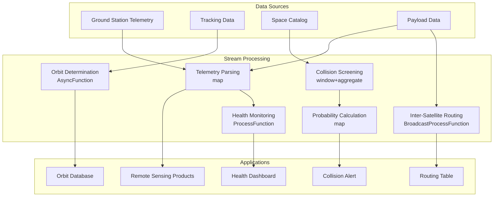

# Operators and Real-Time Space Satellite Data Processing

> **Stage**: Knowledge/10-case-studies | **Prerequisites**: [01.07-two-input-operators.md](./01-concept-atlas/operator-deep-dive/01.07-two-input-operators.md), [operator-iot-stream-processing.md](./operator-iot-stream-processing.md) | **Formalization Level**: L3
> **Document Positioning**: Operator fingerprints and Pipeline design for streaming operators in real-time satellite telemetry, orbit determination, and space situational awareness
> **Version**: 2026.04

---

## Table of Contents

- [Operators and Real-Time Space Satellite Data Processing](#operators-and-real-time-space-satellite-data-processing)
  - [Table of Contents](#table-of-contents)
  - [1. Definitions](#1-definitions)
    - [Def-SPC-01-01: Satellite Telemetry](#def-spc-01-01-satellite-telemetry)
    - [Def-SPC-01-02: Keplerian Elements](#def-spc-01-02-keplerian-elements)
    - [Def-SPC-01-03: Space Situational Awareness (SSA)](#def-spc-01-03-space-situational-awareness-ssa)
    - [Def-SPC-01-04: Collision Probability](#def-spc-01-04-collision-probability)
    - [Def-SPC-01-05: Inter-Satellite Link (ISL)](#def-spc-01-05-inter-satellite-link-isl)
  - [2. Properties](#2-properties)
    - [Lemma-SPC-01-01: Kepler's Third Law of Orbital Period](#lemma-spc-01-01-keplers-third-law-of-orbital-period)
    - [Lemma-SPC-01-02: Telemetry Data Compression Ratio](#lemma-spc-01-02-telemetry-data-compression-ratio)
    - [Prop-SPC-01-01: Ground Station Coverage Time Gap](#prop-spc-01-01-ground-station-coverage-time-gap)
    - [Prop-SPC-01-02: Constellation Networking Latency Advantage](#prop-spc-01-02-constellation-networking-latency-advantage)
  - [3. Relations](#3-relations)
    - [3.1 Satellite Data Processing Pipeline Operator Mapping](#31-satellite-data-processing-pipeline-operator-mapping)
    - [3.2 Operator Fingerprint](#32-operator-fingerprint)
    - [3.3 Orbit Altitude Comparison](#33-orbit-altitude-comparison)
  - [4. Argumentation](#4-argumentation)
    - [4.1 Why Satellite Data Processing Requires Streaming Instead of Traditional Store-and-Forward](#41-why-satellite-data-processing-requires-streaming-instead-of-traditional-store-and-forward)
    - [4.2 Management Challenges of Large-Scale Constellations](#42-management-challenges-of-large-scale-constellations)
    - [4.3 Space Debris Monitoring](#43-space-debris-monitoring)
  - [5. Proof / Engineering Argument](#5-proof--engineering-argument)
    - [5.1 Satellite Health Monitoring Pipeline](#51-satellite-health-monitoring-pipeline)
    - [5.2 Collision Warning System](#52-collision-warning-system)
    - [5.3 Inter-Satellite Routing Optimization](#53-inter-satellite-routing-optimization)
  - [6. Examples](#6-examples)
    - [6.1 Practice: Real-Time LEO Constellation Management](#61-practice-real-time-leo-constellation-management)
    - [6.2 Practice: Real-Time Remote Sensing Payload Data Processing](#62-practice-real-time-remote-sensing-payload-data-processing)
  - [7. Visualizations](#7-visualizations)
    - [Satellite Data Processing Pipeline](#satellite-data-processing-pipeline)
  - [8. References](#8-references)

---

## 1. Definitions

### Def-SPC-01-01: Satellite Telemetry

Satellite Telemetry (卫星遥测数据) is the status and health data downlinked from orbiting spacecraft:

$$\text{Telemetry}_t = (\text{Housekeeping}_t, \text{Payload}_t, \text{Tracking}_t)$$

Including: attitude and orbit control status, power system, thermal control system, payload scientific data, and tracking data.

### Def-SPC-01-02: Keplerian Elements

Keplerian Elements (开普勒轨道要素) are the six orbital elements describing a satellite's orbit:

$$\text{Orbit} = (a, e, i, \Omega, \omega, M)$$

Where $a$ is the semi-major axis, $e$ is the eccentricity, $i$ is the orbital inclination, $\Omega$ is the longitude of the ascending node, $\omega$ is the argument of perigee, and $M$ is the mean anomaly.

### Def-SPC-01-03: Space Situational Awareness (SSA)

SSA (空间态势感知) is the comprehensive capability to detect, track, and catalog space objects:

$$\text{SSA} = (\text{Detection}, \text{Tracking}, \text{Identification}, \text{Cataloging}, \text{Threat Assessment})$$

### Def-SPC-01-04: Collision Probability

Collision Probability (碰撞概率) is the probability of collision between two space objects at a given time:

$$P_c = \frac{1}{2\pi\sqrt{|\Sigma|}} \int_{\text{CombinedHardBody}} \exp\left(-\frac{1}{2}\mathbf{r}^T \Sigma^{-1} \mathbf{r}\right) \, d\mathbf{r}$$

Where $\Sigma$ is the relative position covariance matrix, and CombinedHardBody is the combined hard body radius.

### Def-SPC-01-05: Inter-Satellite Link (ISL)

ISL (星间链路) is the direct communication link between satellites:

$$\text{ISL}_{ij} = \text{Visible}(i, j) \land \text{Distance}(i, j) < D_{max} \land \text{PointingError} < \theta_{max}$$

---

## 2. Properties

### Lemma-SPC-01-01: Kepler's Third Law of Orbital Period

$$T = 2\pi \sqrt{\frac{a^3}{\mu}}$$

Where $\mu = GM_{Earth} \approx 3.986 \times 10^{14} \text{ m}^3/\text{s}^2$.

**Proof**: Derived from the law of universal gravitation and centripetal force balance. ∎

### Lemma-SPC-01-02: Telemetry Data Compression Ratio

The compression ratio using differential encoding:

$$\text{CompressionRatio} = 1 - \frac{H(\Delta x)}{H(x)}$$

Where $H$ is the entropy, $\Delta x_t = x_t - x_{t-1}$. For slowly varying telemetry parameters, the compression ratio can reach 80-95%.

### Prop-SPC-01-01: Ground Station Coverage Time Gap

For a single ground station, the proportion of time when the satellite is not visible:

$$f_{gap} = 1 - \frac{T_{visible}}{T_{orbit}} = 1 - \frac{\arccos(R_E / (R_E + h))}{\pi}$$

Where $R_E$ is the Earth's radius, and $h$ is the orbital altitude. For LEO satellites (h=500km), the gap proportion is approximately 70%.

### Prop-SPC-01-02: Constellation Networking Latency Advantage

For a constellation of $N$ LEO satellites, the maximum number of hops between any two points:

$$H_{max} = O(\sqrt{N})$$

Compared to terrestrial optical fiber (which must follow the Earth's curvature), inter-satellite links can reduce latency by 30-50%.

---

## 3. Relations

### 3.1 Satellite Data Processing Pipeline Operator Mapping

| Application Scenario | Operator Combination | Data Source | Latency Requirement |
|---------------------|----------------------|-------------|---------------------|
| **Telemetry Parsing** | map | Raw telemetry frames | < 1s |
| **Health Assessment** | ProcessFunction + Timer | Parsed telemetry | < 5s |
| **Orbit Determination** | AsyncFunction | Tracking data | < 1min |
| **Collision Warning** | window+aggregate | Catalog data | < 5min |
| **Payload Processing** | map + window | Scientific data | < 10s |
| **Inter-Satellite Routing** | Broadcast + ProcessFunction | Network topology | < 1s |

### 3.2 Operator Fingerprint

| Dimension | Satellite Data Processing Characteristics |
|-----------|-------------------------------------------|
| **Core Operators** | ProcessFunction (health state machine), AsyncFunction (orbit determination), BroadcastProcessFunction (ephemeris update), window+aggregate (collision screening) |
| **State Types** | ValueState (satellite health status), MapState (orbital elements), BroadcastState (space object catalog) |
| **Time Semantics** | Event time (telemetry timestamps) |
| **Data Characteristics** | High burstiness (during overpass), high value (difficult to retransmit), diverse formats (CCSDS/custom) |
| **State Scale** | Keyed by satellite, large constellations can reach tens of thousands |
| **Performance Bottleneck** | Orbital mechanics computation, large-scale collision screening |

### 3.3 Orbit Altitude Comparison

| Orbit Type | Altitude | Period | Coverage Characteristics | Latency |
|-----------|----------|--------|-------------------------|---------|
| **LEO** | 200-2000km | 90-120min | Requires multi-satellite networking | 20-40ms |
| **MEO** | 2000-35786km | 2-12h | Navigation satellites | 60-120ms |
| **GEO** | 35786km | 24h | Fixed coverage | 250ms |
| **HEO** | Elliptical | 12-24h | High-latitude coverage | Variable |

---

## 4. Argumentation

### 4.1 Why Satellite Data Processing Requires Streaming Instead of Traditional Store-and-Forward

Problems with traditional approaches:

- Store-and-forward: Data is downlinked during overpass and processed in batch, discovering anomalies with a lag of one orbital period
- Ground-centric: All computation is performed on the ground, and on-board data cannot be utilized in real time
- Manual interpretation: Telemetry relies on expert interpretation, which is inefficient

Advantages of stream processing:

- Real-time parsing: Telemetry frames are parsed as they are downlinked
- On-board processing: Edge computing performs pre-processing on the satellite
- Automatic alerting: Parameter limit violations automatically trigger alerts

### 4.2 Management Challenges of Large-Scale Constellations

**Problem**: Starlink plans to deploy 12,000+ satellites, making traditional single-satellite management infeasible.

**Streaming Solution**:

1. **Batch health monitoring**: Constellation-level aggregated statistics to identify anomalous satellites
2. **Automatic orbit keeping**: Automatic orbit maneuver calculation based on real-time tracking data
3. **Dynamic frequency coordination**: Real-time avoidance of inter-satellite interference

### 4.3 Space Debris Monitoring

**Scenario**: Monitoring 100,000+ space debris objects and detecting potential collisions.

**Challenges**:

- Large data volume: Millions of observations per day
- Real-time requirements: Collision warnings need to be issued hours in advance
- Uncertainty: Orbit prediction errors grow over time

**Solution**: Use stream processing to filter close approach events in real time, and perform detailed calculations only for high-risk events.

---

## 5. Proof / Engineering Argument

### 5.1 Satellite Health Monitoring Pipeline

```java
public class SatelliteHealthMonitor extends KeyedProcessFunction<String, TelemetryFrame, HealthAlert> {
    private ValueState<SatelliteHealth> healthState;
    private MapState<String, Double> paramThresholds;

    @Override
    public void processElement(TelemetryFrame frame, Context ctx, Collector<HealthAlert> out) throws Exception {
        SatelliteHealth health = healthState.value();
        if (health == null) health = new SatelliteHealth(frame.getSatelliteId());

        // Parse telemetry parameters
        Map<String, Double> params = parseTelemetry(frame);

        for (Map.Entry<String, Double> entry : params.entrySet()) {
            String param = entry.getKey();
            double value = entry.getValue();
            Double threshold = paramThresholds.get(param);

            if (threshold != null && value > threshold) {
                out.collect(new HealthAlert(
                    frame.getSatelliteId(),
                    param,
                    value,
                    threshold,
                    "THRESHOLD_EXCEEDED",
                    ctx.timestamp()
                ));
            }

            // Trend detection: consecutive increase
            health.updateParamTrend(param, value);
            if (health.isRapidlyIncreasing(param, 3)) {  // consecutive increase for 3 frames
                out.collect(new HealthAlert(
                    frame.getSatelliteId(),
                    param,
                    value,
                    threshold,
                    "RAPID_INCREASE",
                    ctx.timestamp()
                ));
            }
        }

        healthState.update(health);
    }
}
```

### 5.2 Collision Warning System

```java
// Catalog object stream (space object positions)
DataStream<SpaceObject> catalog = env.addSource(new CatalogSource());

// Collision screening: coarse filtering
DataStream<PotentialConjunction> candidates = catalog
    .windowAll(TumblingProcessingTimeWindows.of(Time.minutes(5)))
    .apply(new CoarseScreeningFunction() {
        @Override
        public void apply(Date windowStart, Date windowEnd, Iterable<SpaceObject> values, Collector<PotentialConjunction> out) {
            List<SpaceObject> objects = new ArrayList<>();
            values.forEach(objects::add);

            // Geometric screening: only check pairs with close distance
            for (int i = 0; i < objects.size(); i++) {
                for (int j = i + 1; j < objects.size(); j++) {
                    SpaceObject a = objects.get(i);
                    SpaceObject b = objects.get(j);

                    double distance = calculateDistance(a, b);
                    if (distance < 10000) {  // 10km threshold
                        out.collect(new PotentialConjunction(a, b, distance, windowStart));
                    }
                }
            }
        }
    });

// Fine calculation: collision probability
candidates
    .filter(c -> c.getDistance() < 1000)  // Further filter to 1km
    .map(new CollisionProbabilityFunction())
    .filter(p -> p.getProbability() > 1e-6)  // 1/million threshold
    .addSink(new ConjunctionAlertSink());
```

### 5.3 Inter-Satellite Routing Optimization

```java
// Satellite position stream
DataStream<SatellitePosition> positions = env.addSource(new OrbitPropagatorSource());

// Network topology computation
positions.keyBy(SatellitePosition::getConstellationId)
    .window(TumblingProcessingTimeWindows.of(Time.seconds(30)))
    .aggregate(new TopologyAggregate())
    .process(new BroadcastProcessFunction<TopologyGraph, RouteRequest, RouteResult>() {
        private ValueState<TopologyGraph> currentTopology;

        @Override
        public void processElement(RouteRequest req, ReadOnlyContext ctx, Collector<RouteResult> out) throws Exception {
            TopologyGraph topology = currentTopology.value();
            if (topology == null) return;

            // Dijkstra shortest path
            List<String> path = topology.shortestPath(req.getSource(), req.getDestination());
            int hops = path.size() - 1;
            double latency = hops * 10;  // approximately 10ms per hop

            out.collect(new RouteResult(req.getId(), path, hops, latency, ctx.timestamp()));
        }

        @Override
        public void processBroadcastElement(TopologyGraph topology, Context ctx, Collector<RouteResult> out) {
            currentTopology.update(topology);
        }
    })
    .addSink(new RoutingTableSink());
```

---

## 6. Examples

### 6.1 Practice: Real-Time LEO Constellation Management

```java
// 1. Multi-satellite telemetry ingestion
DataStream<TelemetryFrame> telemetry = env.addSource(new GroundStationSource());

// 2. Health monitoring
telemetry.keyBy(TelemetryFrame::getSatelliteId)
    .process(new SatelliteHealthMonitor())
    .addSink(new AlertSink());

// 3. Orbit determination
telemetry.filter(f -> f.getType().equals("TRACKING"))
    .keyBy(TelemetryFrame::getSatelliteId)
    .process(new AsyncWaitForOrbitDetermination())
    .addSink(new OrbitDatabaseSink());

// 4. Collision warning
DataStream<SpaceObject> allObjects = env.addSource(new SpaceTrackAPI());
allObjects.windowAll(TumblingProcessingTimeWindows.of(Time.minutes(10)))
    .apply(new CoarseScreeningFunction())
    .map(new CollisionProbabilityFunction())
    .filter(p -> p.getProbability() > 1e-5)
    .addSink(new CollisionAlertSink());
```

### 6.2 Practice: Real-Time Remote Sensing Payload Data Processing

```java
// Remote sensing data stream
DataStream<RemoteSensingData> rsData = env.addSource(new PayloadDataSource());

// Data preprocessing
rsData.map(new DataPreprocessingFunction())
    .keyBy(RemoteSensingData::getRegion)
    .window(TumblingEventTimeWindows.of(Time.minutes(5)))
    .aggregate(new MosaicAggregate())
    .map(new CloudDetectionFunction())
    .filter(m -> m.getCloudCoverage() < 0.2)
    .addSink(new ImageProductSink());
```

---

## 7. Visualizations

### Satellite Data Processing Pipeline

The following diagram illustrates the end-to-end streaming pipeline for satellite data processing, from multiple data sources through stream processing operators to downstream applications.



---

## 8. References


---

*Related Documents*: [01.07-two-input-operators.md](./01-concept-atlas/operator-deep-dive/01.07-two-input-operators.md) | [operator-iot-stream-processing.md](./operator-iot-stream-processing.md) | [realtime-digital-twin-case-study.md](./realtime-digital-twin-case-study.md)
