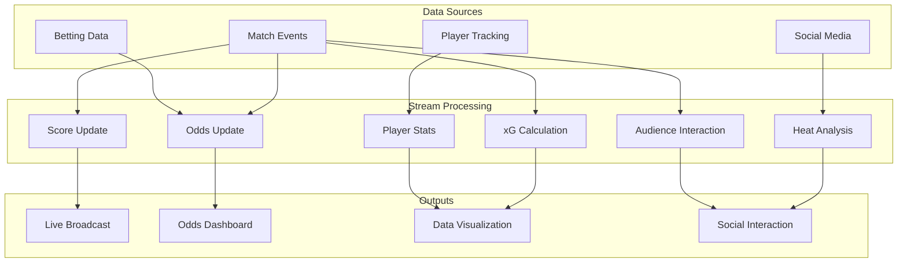

# Operators and Real-time Sports Analytics

> **Stage**: Knowledge/10-case-studies | **Prerequisites**: [01.06-single-input-operators.md](01.06-single-input-operators.md), [operator-ai-ml-integration.md](operator-ai-ml-integration.md) | **Formalization Level**: L3
> **Document Positioning**: Operator fingerprints and Pipeline design for streaming operators (算子) in real-time sports event analysis, odds calculation, and audience interaction
> **Version**: 2026.04

---

## Table of Contents

- [Operators and Real-time Sports Analytics](#operators-and-real-time-sports-analytics)
  - [Table of Contents](#table-of-contents)
  - [1. Definitions](#1-definitions)
    - [Def-SPT-01-01: Sports Event Stream (体育事件流)](#def-spt-01-01-sports-event-stream-体育事件流)
    - [Def-SPT-01-02: Real-time Odds (实时赔率)](#def-spt-01-02-real-time-odds-实时赔率)
    - [Def-SPT-01-03: Expected Goals, xG (预期进球)](#def-spt-01-03-expected-goals-xg-预期进球)
    - [Def-SPT-01-04: Player Tracking Data (球员追踪数据)](#def-spt-01-04-player-tracking-data-球员追踪数据)
    - [Def-SPT-01-05: Crowd Sentiment Stream (观众情绪流)](#def-spt-01-05-crowd-sentiment-stream-观众情绪流)
  - [2. Properties](#2-properties)
    - [Lemma-SPT-01-01: Markov Property of Odds Updates (赔率更新的马尔可夫性)](#lemma-spt-01-01-markov-property-of-odds-updates-赔率更新的马尔可夫性)
    - [Lemma-SPT-01-02: Additivity of Player Running Distance (球员跑动距离的可加性)](#lemma-spt-01-02-additivity-of-player-running-distance-球员跑动距离的可加性)
    - [Prop-SPT-01-01: Elasticity of Odds Changes (赔率变化的弹性)](#prop-spt-01-01-elasticity-of-odds-changes-赔率变化的弹性)
    - [Prop-SPT-01-02: Self-reinforcing Effect of Social Heat (社交热度的自增强效应)](#prop-spt-01-02-self-reinforcing-effect-of-social-heat-社交热度的自增强效应)
  - [3. Relations](#3-relations)
    - [3.1 Sports Analytics Pipeline Operator Mapping](#31-sports-analytics-pipeline-operator-mapping)
    - [3.2 Operator Fingerprint](#32-operator-fingerprint)
    - [3.3 Data Source Comparison](#33-data-source-comparison)
  - [4. Argumentation](#4-argumentation)
    - [4.1 Why Sports Analytics Requires Stream Processing Over Batch Statistics](#41-why-sports-analytics-requires-stream-processing-over-batch-statistics)
    - [4.2 Anti-arbitrage Challenges in Odds Calculation (反套利挑战)](#42-anti-arbitrage-challenges-in-odds-calculation-反套利挑战)
    - [4.3 Real-time Monitoring of Player Fatigue](#43-real-time-monitoring-of-player-fatigue)
  - [5. Proof / Engineering Argument](#5-proof--engineering-argument)
    - [5.1 Real-time Odds Update Algorithm](#51-real-time-odds-update-algorithm)
    - [5.2 Player Tracking Data Processing](#52-player-tracking-data-processing)
    - [5.3 Social Media Heat Calculation](#53-social-media-heat-calculation)
  - [6. Examples](#6-examples)
    - [6.1 Case Study: Real-time Football Match Analysis](#61-case-study-real-time-football-match-analysis)
    - [6.2 Case Study: Real-time Audience Prediction Game](#62-case-study-real-time-audience-prediction-game)
  - [7. Visualizations](#7-visualizations)
    - [Sports Analytics Pipeline](#sports-analytics-pipeline)
  - [8. References](#8-references)

---

## 1. Definitions

### Def-SPT-01-01: Sports Event Stream (体育事件流)

A Sports Event Stream (体育事件流) is a temporal sequence of discrete events occurring during a match:

$$\text{SportsEvent}_t = (\text{type}, \text{player}, \text{team}, \text{position}, \text{timestamp})$$

Event types: SHOT, PASS, FOUL, SUBSTITUTION, GOAL, CORNER, etc.

### Def-SPT-01-02: Real-time Odds (实时赔率)

Real-time Odds (实时赔率) are continuously updated win-rate estimates based on match dynamics and betting distribution:

$$\text{Odds}_t = \frac{1}{P_t(win)} \cdot (1 + \text{margin})$$

Where $P_t(win)$ is the estimated win probability at time $t$, and margin is the bookmaker profit margin (typically 2-10%).

### Def-SPT-01-03: Expected Goals, xG (预期进球)

xG (Expected Goals / 预期进球) is the goal probability calculated from shot position, angle, and technique:

$$xG = f(\text{distance}, \text{angle}, \text{bodyPart}, \text{assistType}, \text{defenders})$$

Typical values: penalty ~0.76, shot inside box ~0.1-0.3, long shot ~0.02-0.05.

### Def-SPT-01-04: Player Tracking Data (球员追踪数据)

Player Tracking Data (球员追踪数据) is a position time series collected via computer vision or GPS/RFID:

$$\text{Position}_p(t) = (x(t), y(t), z(t)), \quad t \in [0, T_{match}]$$

Sampling frequency: 25-60 Hz (video tracking), 10 Hz (GPS).

### Def-SPT-01-05: Crowd Sentiment Stream (观众情绪流)

Crowd Sentiment Stream (观众情绪流) is a text stream of real-time social media discussions about a match:

$$\text{Sentiment}_t = \frac{\sum_{i} s_i \cdot w_i}{\sum_{i} w_i}$$

Where $s_i \in [-1, +1]$ is the sentiment score of a single post, and $w_i$ is the influence weight (follower count / verification status).

---

## 2. Properties

### Lemma-SPT-01-01: Markov Property of Odds Updates (赔率更新的马尔可夫性)

Real-time odds updates satisfy the Markov property (马尔可夫性):

$$P(\text{Odds}_{t+1} \mid \text{Odds}_t, \text{Odds}_{t-1}, ...) = P(\text{Odds}_{t+1} \mid \text{Odds}_t)$$

That is, future odds depend only on the current state and are independent of the historical path.

### Lemma-SPT-01-02: Additivity of Player Running Distance (球员跑动距离的可加性)

The total running distance of a player is the sum of distances in each time segment:

$$D_{total} = \sum_{i} \sqrt{(x_{i+1} - x_i)^2 + (y_{i+1} - y_i)^2}$$

### Prop-SPT-01-01: Elasticity of Odds Changes (赔率变化的弹性)

Elasticity (弹性) of odds with respect to key events:

$$\epsilon = \frac{\Delta \text{Odds} / \text{Odds}}{\Delta P(win) / P(win)}$$

Goal event: extremely high elasticity (odds can change 50-90%); Corner event: medium elasticity (5-15%).

### Prop-SPT-01-02: Self-reinforcing Effect of Social Heat (社交热度的自增强效应)

After a key goal, social discussion volume grows exponentially:

$$N_{posts}(t) = N_0 \cdot e^{\lambda t}, \quad t \in [0, T_{decay}]$$

Then decays by power law: $N_{posts}(t) \propto t^{-\alpha}$.

---

## 3. Relations

### 3.1 Sports Analytics Pipeline Operator Mapping

| Application Scenario | Operator Combination | Data Source | Latency Requirement |
|---------|---------|--------|---------|
| **Real-time Score** | Source → map | Manual/Auto Entry | < 1s |
| **xG Calculation** | map + Async ML | Shot Events | < 2s |
| **Odds Update** | ProcessFunction + Broadcast | Event Stream + Betting Stream | < 1s |
| **Player Stats** | window+aggregate | Tracking Data | < 5s |
| **Hotspot Detection** | window+aggregate | Social Media | < 10s |
| **VAR Assist** | AsyncFunction | Video Clips | < 30s |
| **Audience Interaction** | map+join | Voting/Prediction | < 1s |

### 3.2 Operator Fingerprint

| Dimension | Sports Data Analytics Characteristics |
|------|---------------|
| **Core Operators** | ProcessFunction (odds state machine), AsyncFunction (ML inference), window+aggregate (statistics), Broadcast (config updates) |
| **State Types** | ValueState (current score/odds), MapState (player stats), WindowState (period stats) |
| **Time Semantics** | Processing time dominant (live broadcast real-time requirements) |
| **Data Characteristics** | Event-driven (discrete events), high burst (peaks at goals), strong temporal locality |
| **State Hotspots** | Hot match / popular team keys |
| **Performance Bottlenecks** | xG model inference, social data volume peaks |

### 3.3 Data Source Comparison

| Data Source | Latency | Precision | Cost | Coverage |
|--------|------|------|------|------|
| **Manual Entry** | 1-3s | Medium | Low | Full |
| **Computer Vision** | 100ms-1s | High | High | In-stadium |
| **GPS/RFID** | 100ms | High | Medium | Wearable devices |
| **Social Media** | 1-10s | Low | Low | Global |
| **Betting Data** | 100ms | High | High | Betting users |

---

## 4. Argumentation

### 4.1 Why Sports Analytics Requires Stream Processing Over Batch Statistics

Problems with batch statistics:

- Post-match reports: audience has already left, missing real-time interaction opportunities
- Static odds: pre-match odds cannot reflect match dynamics
- Lagged experience: audience cannot participate in real-time predictions/voting

Advantages of stream processing:

- Real-time score: updated within seconds after an event occurs
- Dynamic odds: odds adjusted after every shot
- Real-time interaction: audience voting, predictions, and social engagement in real time

### 4.2 Anti-arbitrage Challenges in Odds Calculation (反套利挑战)

**Arbitrage Opportunity (套利机会)**: If different platforms offer divergent odds for the same match, arbitrageurs can bet on both sides simultaneously to guarantee profit.

**Stream Processing Solution**:

1. Real-time monitoring of odds across multiple platforms
2. Detect anomalous deviations (beyond normal ranges)
3. Automatically adjust local odds to eliminate arbitrage space

### 4.3 Real-time Monitoring of Player Fatigue

**Metrics**:

- High-speed running distance (>20km/h)
- Sprint count
- Heart rate variability

**Stream Processing**: Real-time calculation of fatigue index; recommend substitution when threshold is exceeded.

---

## 5. Proof / Engineering Argument

### 5.1 Real-time Odds Update Algorithm

```java
public class OddsUpdateFunction extends BroadcastProcessFunction<MatchEvent, OddsConfig, OddsUpdate> {
    private ValueState<MatchState> matchState;

    @Override
    public void processElement(MatchEvent event, ReadOnlyContext ctx, Collector<OddsUpdate> out) {
        MatchState state = matchState.value();
        if (state == null) state = new MatchState();

        // Update match state
        state.update(event);

        // Calculate new probability (simplified model)
        double homeStrength = state.getHomeXG() * 0.6 + state.getHomeScore() * 0.4;
        double awayStrength = state.getAwayXG() * 0.6 + state.getAwayScore() * 0.4;

        double total = homeStrength + awayStrength + 0.1;  // 0.1 is draw weight
        double homeProb = homeStrength / total;
        double awayProb = awayStrength / total;
        double drawProb = 0.1 / total;

        // Convert to odds (including margin)
        double margin = 0.05;
        double homeOdds = 1.0 / (homeProb * (1 - margin));
        double awayOdds = 1.0 / (awayProb * (1 - margin));
        double drawOdds = 1.0 / (drawProb * (1 - margin));

        out.collect(new OddsUpdate(state.getMatchId(), homeOdds, awayOdds, drawOdds, ctx.timestamp()));
        matchState.update(state);
    }
}
```

### 5.2 Player Tracking Data Processing

```java
// Player position stream
DataStream<PlayerPosition> positions = env.addSource(new TrackingSource());

// Calculate real-time running distance
positions.keyBy(PlayerPosition::getPlayerId)
    .process(new KeyedProcessFunction<String, PlayerPosition, PlayerStats>() {
        private ValueState<PlayerPosition> lastPosition;
        private ValueState<Double> totalDistance;

        @Override
        public void processElement(PlayerPosition pos, Context ctx, Collector<PlayerStats> out) throws Exception {
            PlayerPosition last = lastPosition.value();
            Double dist = totalDistance.value();
            if (dist == null) dist = 0.0;

            if (last != null) {
                double segment = Math.sqrt(
                    Math.pow(pos.getX() - last.getX(), 2) +
                    Math.pow(pos.getY() - last.getY(), 2)
                );
                dist += segment;
            }

            // Calculate speed
            double speed = 0;
            if (last != null) {
                double timeDiff = (pos.getTimestamp() - last.getTimestamp()) / 1000.0;
                if (timeDiff > 0) {
                    speed = Math.sqrt(
                        Math.pow(pos.getX() - last.getX(), 2) +
                        Math.pow(pos.getY() - last.getY(), 2)
                    ) / timeDiff;
                }
            }

            lastPosition.update(pos);
            totalDistance.update(dist);

            out.collect(new PlayerStats(pos.getPlayerId(), dist, speed, pos.getTimestamp()));
        }
    })
    .addSink(new StatsDashboardSink());
```

### 5.3 Social Media Heat Calculation

```java
// Social media stream
DataStream<SocialPost> posts = env.addSource(new TwitterSource("#WorldCup"));

// Sentiment analysis + heat aggregation
posts.map(new SentimentAnalysisFunction())
    .keyBy(SentimentResult::getTeam)
    .window(SlidingProcessingTimeWindows.of(Time.minutes(1), Time.seconds(10)))
    .aggregate(new HeatAggregate())
    .addSink(new HeatmapSink());
```

---

## 6. Examples

### 6.1 Case Study: Real-time Football Match Analysis

```java
// 1. Match event ingestion
DataStream<MatchEvent> events = env.addSource(new MatchEventSource());

// 2. Score update
events.filter(e -> e.getType().equals("GOAL"))
    .keyBy(MatchEvent::getMatchId)
    .process(new ScoreUpdateFunction())
    .addSink(new ScoreboardSink());

// 3. xG calculation
events.filter(e -> e.getType().equals("SHOT"))
    .map(new ShotEventExtractor())
    .keyBy(ShotEvent::getMatchId)
    .process(new AsyncWaitForXGFunction())
    .addSink(new XGDisplaySink());

// 4. Real-time odds update
events.keyBy(MatchEvent::getMatchId)
    .connect(oddsConfigBroadcast)
    .process(new OddsUpdateFunction())
    .addSink(new OddsDisplaySink());

// 5. Player statistics
DataStream<PlayerPosition> tracking = env.addSource(new TrackingSource());
tracking.keyBy(PlayerPosition::getPlayerId)
    .process(new PlayerStatsFunction())
    .windowAll(TumblingProcessingTimeWindows.of(Time.minutes(1)))
    .apply(new LeaderboardFunction())
    .addSink(new LeaderboardSink());
```

### 6.2 Case Study: Real-time Audience Prediction Game

```java
// Audience prediction stream
DataStream<PredictionVote> votes = env.addSource(new WebSocketSource("/predictions"));

// Real-time prediction distribution statistics
votes.keyBy(PredictionVote::getMatchId)
    .window(TumblingProcessingTimeWindows.of(Time.minutes(5)))
    .aggregate(new VoteDistributionAggregate())
    .addSink(new PredictionDisplaySink());

// Prediction accuracy calculation (post-match)
votes.keyBy(PredictionVote::getUserId)
    .connect(matchResults.keyBy(MatchResult::getMatchId))
    .process(new PredictionAccuracyFunction())
    .addSink(new LeaderboardSink());
```

---

## 7. Visualizations

### Sports Analytics Pipeline



---

## 8. References


---

*Related Documents*: [01.06-single-input-operators.md](01.06-single-input-operators.md) | [operator-ai-ml-integration.md](operator-ai-ml-integration.md) | [operator-social-media-sentiment-analysis.md](operator-social-media-sentiment-analysis.md)
