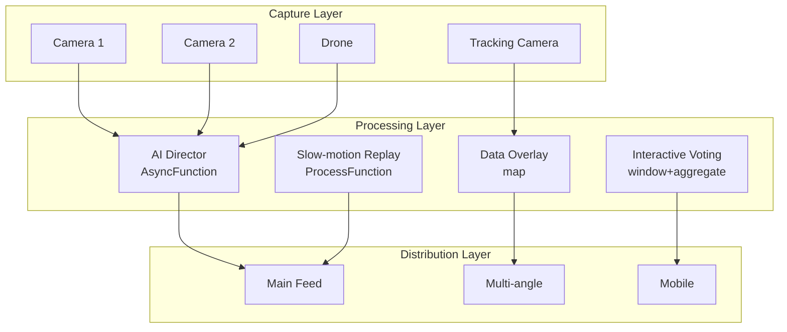

# Operators and Real-Time Sports Broadcasting

> **Stage**: Knowledge/10-case-studies | **Prerequisites**: [01.10-process-and-async-operators.md](../Knowledge/01-concept-atlas/operator-deep-dive/01.10-process-and-async-operators.md), [realtime-sports-analytics-case-study.md](../Knowledge/10-case-studies/realtime-sports-analytics-case-study.md) | **Formalization Level**: L3
> **Document Positioning**: Operator fingerprint and pipeline design for stream-processing operators in real-time sports broadcasting, multi-camera switching, and real-time data analytics
> **Version**: 2026.04

---

## Table of Contents

- [1. Definitions](#1-definitions)
- [2. Properties](#2-properties)
- [3. Relations](#3-relations)
- [4. Argumentation](#4-argumentation)
- [5. Proof / Engineering Argument](#5-proof--engineering-argument)
- [6. Examples](#6-examples)
- [7. Visualizations](#7-visualizations)
- [8. References](#8-references)

---

## 1. Definitions

### Def-SLB-01-01: Sports Event Data Stream (体育赛事数据流)

Sports Event Data Stream (体育赛事数据流) is a composite of multi-dimensional real-time data:

$$\text{SportsStream}_t = (\text{Video}_t, \text{Stats}_t, \text{Tracking}_t, \text{Audio}_t, \text{Social}_t)$$

### Def-SLB-01-02: Multi-camera Broadcasting (多机位导播)

Multi-camera Broadcasting (多机位导播) is a decision process that selects the optimal frame based on the dynamics of the sports event:

$$\text{Camera}^*(t) = \arg\max_{c} f(\text{ActionIntensity}_c, \text{BallProximity}_c, \text{PlayerExpression}_c)$$

### Def-SLB-01-03: Real-time Data Overlay (实时数据叠加)

Real-time Data Overlay (实时数据叠加) dynamically displays statistics on the video frame:

$$\text{Overlay}_t = \text{Render}(\text{Stats}_t, \text{Position}_{screen}, \text{Style})$$

### Def-SLB-01-04: Audience Interactive Voting (观众互动投票)

$$\text{VoteResult}_t = \arg\max_{o} \sum_{u} \mathbf{1}_{vote_u = o}$$

### Def-SLB-01-05: Slow-motion Replay (慢动作回放)

Slow-motion Replay (慢动作回放) is a high-frame-rate replay of key moments:

$$\text{Replay} = \text{Event}_t \text{ where } \text{Importance}(t) > \theta_{replay}$$

---

## 2. Properties

### Lemma-SLB-01-01: Frame Inter-compression Efficiency of Video Encoding

$$\text{CompressionRatio} = \frac{\text{Size}_{intra}}{\text{Size}_{inter}} \approx 3\text{-}10$$

Motion-compensated inter-frame encoding saves 3--10x bandwidth compared to intra-frame encoding.

### Lemma-SLB-01-02: Latency Constraint of Director Switching

$$\mathcal{L}_{switch} + \mathcal{L}_{encode} + \mathcal{L}_{transmit} < 5\text{s}$$

Live broadcast latency must be controlled within 5 seconds to guarantee real-time experience.

### Prop-SLB-01-01: Key-frame Detection Accuracy

$$\text{Precision} = \frac{TP}{TP + FP}, \quad \text{Recall} = \frac{TP}{TP + FN}$$

AI auto-director achieves an F1-score of 85--92%.

### Prop-SLB-01-02: Bandwidth Multiplication of Multi-angle Replay

$$B_{multi} = N_{cameras} \cdot B_{single} \cdot \eta$$

where $\eta \approx 0.3$ is the adaptive bitrate saving coefficient.

---

## 3. Relations

### 3.1 Sports Broadcasting Pipeline Operator Mapping

| Scenario | Operator Combination | Data Source | Latency Requirement |
|---------|---------|--------|---------|
| **Multi-channel Video Ingestion** | Source (数据源算子) | Camera | < 1s |
| **AI Director** | AsyncFunction (异步函数算子) | Video Analysis | < 2s |
| **Data Overlay** | map (映射算子) | Statistics | < 1s |
| **Interactive Voting** | window+aggregate (窗口聚合算子) | Audience Votes | < 5s |
| **Slow-motion Replay** | ProcessFunction (处理函数算子) | Key Events | < 3s |
| **Social Heat** | window+aggregate (窗口聚合算子) | Social Media | < 10s |

### 3.2 Operator Fingerprint

| Dimension | Sports Broadcasting Characteristics |
|------|------------|
| **Core Operators** | AsyncFunction (AI analysis), ProcessFunction (replay control), BroadcastProcessFunction (director command), window+aggregate (interaction statistics) |
| **State Types** | ValueState (current frame), MapState (replay buffer), BroadcastState (director config) |
| **Time Semantics** | Processing time dominates (live real-time requirements) |
| **Data Characteristics** | High bandwidth (multi-channel 4K), high burst (goal moments), strong interactivity |
| **State Hotspots** | Hot-match keys, key-event keys |
| **Performance Bottlenecks** | 4K video processing, AI inference |

---

## 4. Argumentation

### 4.1 Why Sports Broadcasting Needs Stream Processing Instead of Traditional Broadcasting

Problems with traditional broadcasting:
- Manual director: slow reaction, missing highlight moments
- Fixed frame: unable to customize based on user preference
- High latency: satellite transmission latency of 3--5 seconds

Advantages of stream processing:
- AI director: automatically identifies highlight moments and switches frames
- Personalization: users choose their own viewing angles and data overlays
- Low latency: IP transmission < 1 second

### 4.2 Challenges of 4K/8K Ultra HD (4K/8K超高清)

**Problem**: 4K video bitrate is approximately 20--50 Mbps, and 8K is approximately 50--150 Mbps.

**Solution**: Stream-processing real-time transcoding, with adaptive distribution based on user device and network conditions.

### 4.3 Virtual Reality (VR) Live Streaming (虚拟现实直播)

**Scenario**: 360-degree panoramic video, where users can freely choose the viewing angle.

**Stream-processing Solution**: Real-time stitching of multi-camera feeds -> generate 360-degree video stream -> crop viewport based on user head orientation.

---

## 5. Proof / Engineering Argument

### 5.1 AI Auto-Director System

```java
// Multi-camera video stream
DataStream<CameraFeed> cameras = env.addSource(new MultiCameraSource());

// AI analysis selects the best frame
DataStream<CameraSelection> selection = AsyncDataStream.unorderedWait(
    cameras,
    new AIDirectorFunction(),
    Time.milliseconds(500),
    100
);

// Director switching decision
selection.keyBy(CameraSelection::getMatchId)
    .process(new KeyedProcessFunction<String, CameraSelection, BroadcastFeed>() {
        private ValueState<CameraSelection> currentCamera;
        
        @Override
        public void processElement(CameraSelection sel, Context ctx, Collector<BroadcastFeed> out) throws Exception {
            CameraSelection current = currentCamera.value();
            
            if (current == null || sel.getScore() > current.getScore() * 1.2) {
                // New frame is significantly better; switch
                out.collect(new BroadcastFeed(sel.getCameraId(), sel.getFeed(), ctx.timestamp()));
                currentCamera.update(sel);
            }
        }
    })
    .addSink(new BroadcastSink());
```

### 5.2 Real-time Data Overlay

```java
// Game statistics stream
DataStream<GameStats> stats = env.addSource(new StatsSource());

// Overlay rendering
stats.map(new MapFunction<GameStats, OverlayFrame>() {
    @Override
    public OverlayFrame map(GameStats s) {
        String overlay = String.format("Score: %d-%d | Time: %s | Possession: %.0f%%",
            s.getHomeScore(), s.getAwayScore(), s.getTime(), s.getPossession() * 100);
        return new OverlayFrame(s.getMatchId(), overlay, s.getTimestamp());
    }
})
.addSink(new OverlayRenderSink());
```

---

## 6. Examples

### 6.1 In Practice: Large-scale Football Event Live Broadcast

```java
// 1. Multi-camera ingestion
DataStream<CameraFeed> cameras = env.addSource(new StadiumCameraSource());

// 2. AI director
DataStream<BroadcastFeed> broadcast = AsyncDataStream.unorderedWait(
    cameras,
    new AIDirectorFunction(),
    Time.milliseconds(500),
    100
);

// 3. Statistics overlay
DataStream<GameStats> stats = env.addSource(new StatsSource());
stats.map(new OverlayRenderFunction())
    .addSink(new BroadcastOverlaySink());

// 4. Interactive voting
DataStream<VoteEvent> votes = env.addSource(new AudienceVoteSource());
votes.keyBy(VoteEvent::getPollId)
    .window(TumblingProcessingTimeWindows.of(Time.seconds(30)))
    .aggregate(new VoteCountAggregate())
    .addSink(new VoteResultSink());
```

---

## 7. Visualizations

### Sports Broadcasting Pipeline

The following diagram illustrates the layered architecture of a real-time sports broadcasting pipeline, from multi-source capture through stream processing to multi-channel distribution.



---

## 8. References

[^1]: FIFA, "World Cup Broadcast Technology". https://www.fifa.com/

[^2]: NBA, "NBA Advanced Stats". https://www.nba.com/

[^3]: Wikipedia, "Broadcasting of Sports Events". https://en.wikipedia.org/wiki/Broadcasting_of_sports_events

[^4]: Wikipedia, "Video Assistant Referee". https://en.wikipedia.org/wiki/Video_assistant_referee

[^5]: Apache Flink Documentation, "Async I/O". https://nightlies.apache.org/flink/flink-docs-stable/docs/dev/datastream/operators/asyncio/

[^6]: IEEE, "AI in Sports Broadcasting", 2023.

---

*Related Documents*: [01.10-process-and-async-operators.md](../Knowledge/01-concept-atlas/operator-deep-dive/01.10-process-and-async-operators.md) | [realtime-sports-analytics-case-study.md](../Knowledge/10-case-studies/realtime-sports-analytics-case-study.md) | [realtime-live-streaming-platform-case-study.md](../Knowledge/10-case-studies/realtime-live-streaming-platform-case-study.md)
