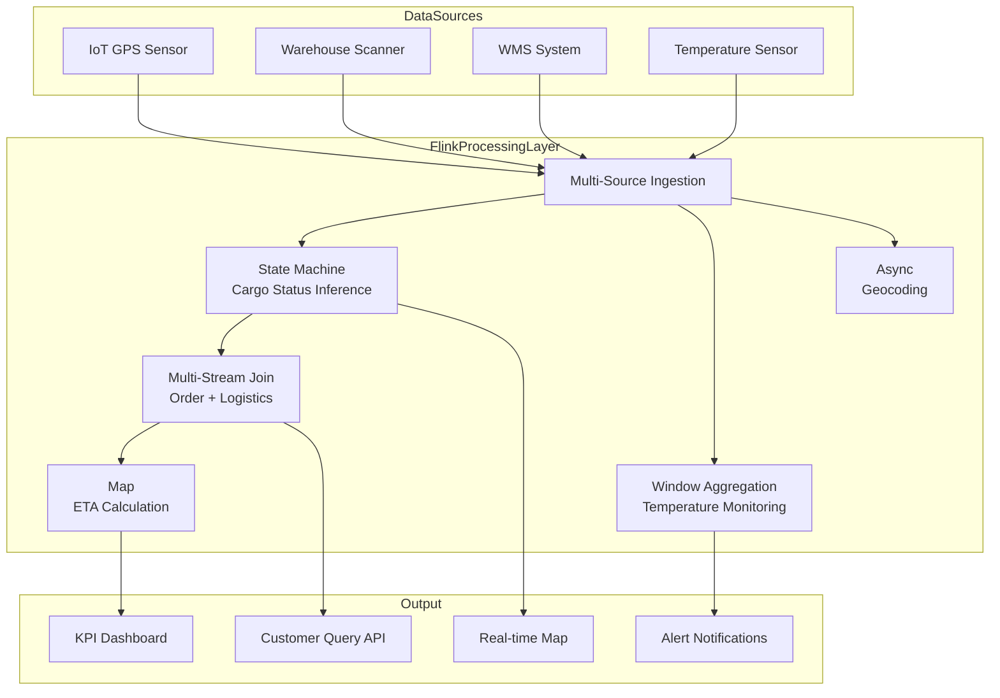
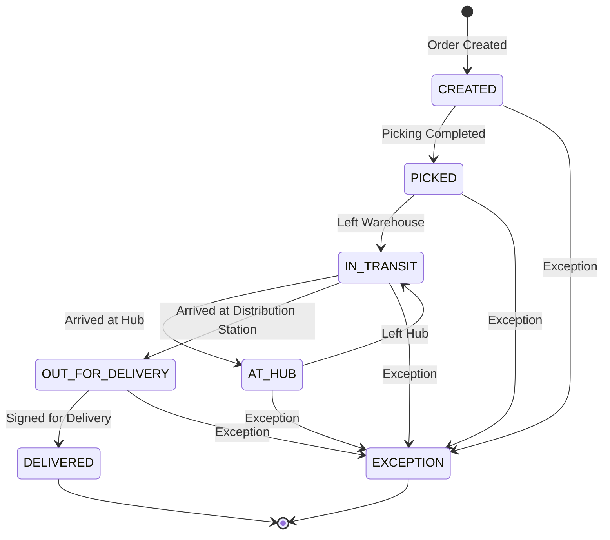

# Operators and Real-time Supply Chain Tracking

> **Stage**: Knowledge/10-case-studies | **Prerequisites**: [01.08-multi-stream-operators.md](01.08-multi-stream-operators.md), [operator-iot-stream-processing.md](operator-iot-stream-processing.md) | **Formalization Level**: L3
> **Document Positioning**: Operator fingerprint and Pipeline design for stream processing operators in real-time supply chain tracking and logistics management
> **Version**: 2026.04

---

## Table of Contents

- [Operators and Real-time Supply Chain Tracking](#operators-and-real-time-supply-chain-tracking)
  - [Table of Contents](#table-of-contents)
  - [1. Concept Definitions (Definitions)](#1-concept-definitions-definitions)
    - [Def-SC-01-01: Real-time Supply Chain Tracking (实时供应链追踪)](#def-sc-01-01-real-time-supply-chain-tracking)
    - [Def-SC-01-02: Cargo State Machine (货物状态机)](#def-sc-01-02-cargo-state-machine)
    - [Def-SC-01-03: Estimated Time of Arrival, ETA (预计到达时间)](#def-sc-01-03-estimated-time-of-arrival-eta)
    - [Def-SC-01-04: Cold Chain Monitoring (冷链监控)](#def-sc-01-04-cold-chain-monitoring)
    - [Def-SC-01-05: Multi-modal Transport (多式联运)](#def-sc-01-05-multi-modal-transport)
  - [2. Property Derivation (Properties)](#2-property-derivation-properties)
    - [Lemma-SC-01-01: GPS Update Frequency vs. Accuracy Trade-off](#lemma-sc-01-01-gps-update-frequency-vs-accuracy-trade-off)
    - [Lemma-SC-01-02: Window Sensitivity of Anomaly Detection](#lemma-sc-01-02-window-sensitivity-of-anomaly-detection)
    - [Prop-SC-01-01: Key Constraints of Multi-Stream Join](#prop-sc-01-01-key-constraints-of-multi-stream-join)
    - [Prop-SC-01-02: Convergence of ETA Prediction Error](#prop-sc-01-02-convergence-of-eta-prediction-error)
  - [3. Relations Establishment (Relations)](#3-relations-establishment-relations)
    - [3.1 Supply Chain Pipeline Operator Mapping](#31-supply-chain-pipeline-operator-mapping)
    - [3.2 Operator Fingerprint](#32-operator-fingerprint)
    - [3.3 Comparison with Other Industry Cases](#33-comparison-with-other-industry-cases)
  - [4. Argumentation Process (Argumentation)](#4-argumentation-process-argumentation)
    - [4.1 Why Supply Chain Needs Stream Processing Instead of Traditional WMS](#41-why-supply-chain-needs-stream-processing-instead-of-traditional-wms)
    - [4.2 Event Correlation Challenges in Multi-modal Transport](#42-event-correlation-challenges-in-multi-modal-transport)
    - [4.3 Cold Chain Break Detection and Recovery](#43-cold-chain-break-detection-and-recovery)
  - [5. Formal Proof / Engineering Argument (Proof / Engineering Argument)](#5-formal-proof--engineering-argument-proof--engineering-argument)
    - [5.1 Formal Definition of Cargo State Machine](#51-formal-definition-of-cargo-state-machine)
    - [5.2 Sliding Window Detection of Temperature Anomalies](#52-sliding-window-detection-of-temperature-anomalies)
    - [5.3 Bayesian Update for ETA Prediction](#53-bayesian-update-for-eta-prediction)
  - [6. Example Verification (Examples)](#6-example-verification-examples)
    - [6.1 Practice: Cross-border Logistics Tracking Pipeline](#61-practice-cross-border-logistics-tracking-pipeline)
    - [6.2 Practice: Smart Warehouse Real-time Dashboard](#62-practice-smart-warehouse-real-time-dashboard)
  - [7. Visualizations (Visualizations)](#7-visualizations-visualizations)
    - [Supply Chain Tracking Pipeline](#supply-chain-tracking-pipeline)
    - [Cargo State Machine](#cargo-state-machine)
  - [8. References (References)](#8-references-references)

---

## 1. Concept Definitions (Definitions)

### Def-SC-01-01: Real-time Supply Chain Tracking (实时供应链追踪)

Real-time Supply Chain Tracking is a system that uses stream processing technology to monitor the full lifecycle of cargo from production to delivery, with real-time anomaly alerting:

$$\text{Tracking} = (\text{IoT Sensors}, \text{GPS Data}, \text{WMS Events}) \xrightarrow{\text{Stream Processing}} (\text{Location}, \text{Status}, \text{ETA}, \text{Alerts})$$

### Def-SC-01-02: Cargo State Machine (货物状态机)

The lifecycle of cargo in the supply chain can be described by a state machine:

$$\text{States} = \{\text{CREATED}, \text{PICKED}, \text{IN_TRANSIT}, \text{AT_HUB}, \text{OUT_FOR_DELIVERY}, \text{DELIVERED}, \text{EXCEPTION}\}$$

State transitions are triggered by events: scanning, GPS location updates, temperature anomalies, etc.

### Def-SC-01-03: Estimated Time of Arrival, ETA (预计到达时间)

ETA (Estimated Time of Arrival) is a dynamic prediction based on real-time location, historical traffic conditions, and transport mode:

$$\text{ETA}_t = t + \frac{D_{remaining}}{\bar{v}_{predicted}} + \mathcal{L}_{hub}$$

Where $D_{remaining}$ is the remaining distance, $\bar{v}_{predicted}$ is the predicted average speed, and $\mathcal{L}_{hub}$ is the hub processing delay.

### Def-SC-01-04: Cold Chain Monitoring (冷链监控)

Cold Chain Monitoring is the continuous temperature tracking of temperature-sensitive cargo (pharmaceuticals, fresh food) during transportation:

$$\text{Compliance} = \forall t \in [t_{start}, t_{end}]: T_{min} \leq T(t) \leq T_{max}$$

Any temperature out-of-range event must trigger an immediate alert and be recorded.

### Def-SC-01-05: Multi-modal Transport (多式联运)

Multi-modal Transport is the intermodal transportation of cargo through multiple transport modes (road, rail, sea, air):

$$\text{Journey} = (\text{Truck}_1, \text{Ship}_1, \text{Train}_1, \text{Truck}_2, ...)$$

Each transport mode generates independent tracking event streams, which need to be correlated at the stream processing layer.

---

## 2. Property Derivation (Properties)

### Lemma-SC-01-01: GPS Update Frequency vs. Accuracy Trade-off

GPS update frequency $f$ and positioning accuracy $\sigma$ satisfy:

$$\sigma \propto \frac{1}{\sqrt{f}}$$

However, higher frequency means more data transmission and processing overhead.

**Recommendation**: Update every 30 seconds to 1 minute during transport; every 5 minutes when stationary (Geofencing triggered).

### Lemma-SC-01-02: Window Sensitivity of Anomaly Detection

The detection latency of anomaly detection (e.g., temperature out-of-range) is related to window size $W$:

$$\mathcal{L}_{detect} \leq W$$

**Corollary**: Using a Sliding Window instead of a Tumbling Window can reduce detection latency.

### Prop-SC-01-01: Key Constraints of Multi-Stream Join

In the supply chain, order streams, inventory streams, and logistics streams need to be joined:

- **Order Stream**: Sparse (several per second)
- **Inventory Stream**: Medium (tens per second)
- **Logistics Stream**: Dense (thousands of GPS points per second)

**Join Strategy**: Use the order stream as the driver, enrich order status with the logistics stream, and avoid using the dense stream as the left table to drive the Join.

### Prop-SC-01-02: Convergence of ETA Prediction Error

As cargo approaches its destination, the ETA prediction error $\epsilon$ decreases monotonically:

$$\frac{d\epsilon}{dD_{remaining}} > 0$$

**Engineering Significance**: In the last mile, ETA can be precise to the minute; in long-haul transport, ETA error may reach several hours.

---

## 3. Relations Establishment (Relations)

### 3.1 Supply Chain Pipeline Operator Mapping

| Processing Stage | Operator | Input | Output | State |
|---------|------|------|------|------|
| **GPS Ingestion** | Source | IoT Device MQTT | GPS Coordinate Stream | None |
| **Geocoding** | AsyncFunction | GPS Coordinates | Address/Region | None |
| **Status Inference** | ProcessFunction | GPS + Scan Events | Cargo Status | ValueState (Current Status) |
| **Multi-Stream Join** | intervalJoin | Order Stream + Logistics Stream | Enriched Order | Dual-State |
| **ETA Calculation** | map | Location + Traffic Conditions | ETA Timestamp | None (Pure Computation) |
| **Anomaly Detection** | window+aggregate | Temperature/Humidity | Alert Events | Window State |
| **Aggregation Dashboard** | window+aggregate | Full-chain Events | KPI Metrics | Window State |

### 3.2 Operator Fingerprint

| Dimension | Supply Chain Tracking Characteristics |
|------|---------------|
| **Core Operators** | ProcessFunction (State Machine), intervalJoin (Multi-Stream Join), AsyncFunction (Geocoding) |
| **State Types** | ValueState (Cargo State Machine), MapState (Vehicle Position Cache), WindowState (Temperature Statistics) |
| **Time Semantics** | Event Time primary (GPS timestamp), out-of-order allowed |
| **Data Characteristics** | Multi-stream heterogeneous (GPS high-frequency + Order low-frequency + Scan event-triggered) |
| **State Hotspot** | Vehicle Position MapState (keyBy vehicle ID, thousand-level keys) |
| **Performance Bottleneck** | Geocoding API calls (asynchronous), Multi-stream Join state growth |

### 3.3 Comparison with Other Industry Cases

| Dimension | E-commerce Recommendation | Financial Risk Control | RTB Advertising | Supply Chain Tracking |
|------|---------|---------|---------|-----------|
| **Latency Requirement** | Second-level | <50ms | <100ms | Minute-level |
| **Data Volume** | Large | Medium | Extremely Large | Medium |
| **State Complexity** | High | Medium | Medium | High (State Machine) |
| **Multi-Stream Join** | Few | Medium | Medium | Many (3+ streams) |
| **Time Semantics** | Event Time | Processing Time | Processing Time | Event Time |

---

## 4. Argumentation Process (Argumentation)

### 4.1 Why Supply Chain Needs Stream Processing Instead of Traditional WMS

Problems with traditional Warehouse Management Systems (WMS):

- Batch processing: Synchronize status every 4 hours
- Blind spots: No real-time visibility while cargo is in transit
- Reactive: Abnormalities can only be discovered hours after they occur

Advantages of stream processing:

- Real-time: GPS updates location every 30 seconds
- Proactive: Temperature out-of-range triggers immediate alerts
- Predictive: ETA dynamically updates, providing early warning of delays

### 4.2 Event Correlation Challenges in Multi-modal Transport

**Challenge**: The same batch of cargo transfers from truck to sea freight and then to train, with each transport mode using a different tracking system.

**Solution**:

1. Scan cargo at the transfer hub to generate a "handover event"
2. Use the handover event as the correlation key to connect event streams from different transport segments
3. Use IntervalJoin to correlate by cargo ID and handover time window

### 4.3 Cold Chain Break Detection and Recovery

**Break**: Refrigerated truck malfunction causes temperature rise, potentially spoiling pharmaceuticals.

**Detection**:

- Temperature sensors report every 10 seconds
- Sliding window (1 minute) calculates average temperature
- If 3 consecutive windows exceed threshold, trigger Level 1 alert
- If 10 consecutive windows exceed threshold, trigger Level 2 alert (cargo spoilage assessment)

**Recovery**:

- Automatically dispatch the nearest backup refrigerated truck
- Notify the recipient to adjust the receiving schedule
- Insurance system automatically initiates the claims process

---

## 5. Formal Proof / Engineering Argument (Proof / Engineering Argument)

### 5.1 Formal Definition of Cargo State Machine

```
StateMachine = (S, E, δ, s0, F)
S = {CREATED, PICKED, IN_TRANSIT, AT_HUB, OUT_FOR_DELIVERY, DELIVERED, EXCEPTION}
E = {pick, scan, gps_update, arrive_hub, depart_hub, deliver, exception}
δ: S × E → S

δ(CREATED, pick) = PICKED
δ(PICKED, gps_update) = IN_TRANSIT
δ(IN_TRANSIT, arrive_hub) = AT_HUB
δ(AT_HUB, depart_hub) = IN_TRANSIT
δ(IN_TRANSIT, deliver) = DELIVERED
δ(s, exception) = EXCEPTION  for all s
```

**Flink Implementation**:

```java
public class CargoStateMachine extends KeyedProcessFunction<String, TrackingEvent, CargoStatus> {
    private ValueState<CargoState> state;

    @Override
    public void processElement(TrackingEvent event, Context ctx, Collector<CargoStatus> out) {
        CargoState current = state.value();
        if (current == null) current = CargoState.CREATED;

        CargoState next = transition(current, event.getType());
        state.update(next);

        out.collect(new CargoStatus(event.getCargoId(), next, ctx.timestamp()));
    }

    private CargoState transition(CargoState current, EventType event) {
        switch (current) {
            case CREATED: return event == PICK ? PICKED : current;
            case PICKED: return event == GPS_UPDATE ? IN_TRANSIT : current;
            case IN_TRANSIT:
                if (event == ARRIVE_HUB) return AT_HUB;
                if (event == DELIVER) return DELIVERED;
                return current;
            case AT_HUB: return event == DEPART_HUB ? IN_TRANSIT : current;
            default: return current;
        }
    }
}
```

### 5.2 Sliding Window Detection of Temperature Anomalies

```java
stream.keyBy(SensorReading::getCargoId)
    .window(SlidingEventTimeWindows.of(Time.minutes(1), Time.seconds(10)))
    .aggregate(new TemperatureMonitorAggregate())
    .process(new AlertFunction());

public class TemperatureMonitorAggregate implements AggregateFunction<SensorReading, TempAccumulator, TempStats> {
    @Override
    public TempAccumulator createAccumulator() { return new TempAccumulator(); }

    @Override
    public TempAccumulator add(SensorReading reading, TempAccumulator acc) {
        acc.count++;
        acc.sum += reading.getTemperature();
        acc.min = Math.min(acc.min, reading.getTemperature());
        acc.max = Math.max(acc.max, reading.getTemperature());
        return acc;
    }

    @Override
    public TempStats getResult(TempAccumulator acc) {
        return new TempStats(acc.min, acc.max, acc.sum / acc.count);
    }
}
```

### 5.3 Bayesian Update for ETA Prediction

**Model**: Based on the prior distribution of historical road segment speeds, updated with real-time GPS data:

$$P(v | data) \propto P(data | v) \cdot P(v)$$

Where $P(v)$ is the historical speed distribution and $P(data | v)$ is the likelihood of the current observation.

**Implementation**: Use Flink's ProcessFunction to maintain the speed distribution state for each road segment, updating in real-time and predicting ETA.

---

## 6. Example Verification (Examples)

### 6.1 Practice: Cross-border Logistics Tracking Pipeline

**Scenario**: A batch of cargo travels from a Chinese factory to a US warehouse via sea freight, involving truck-sea freight-truck three-segment transport.

```java
// 1. Multi-source ingestion (GPS + Scan + WMS)
DataStream<GPSEvent> gpsStream = env.addSource(new MQTTSource("gps/+/+"));
DataStream<ScanEvent> scanStream = env.addSource(new KafkaSource<>("scan-events"));
DataStream<WMSEvent> wmsStream = env.addSource(new KafkaSource<>("wms-events"));

// 2. State machine processing
gpsStream.keyBy(GPSEvent::getCargoId)
    .process(new CargoStateMachine())
    .addSink(new StatusUpdateSink());

// 3. Temperature monitoring (cold chain)
gpsStream.filter(e -> e.getSensorType().equals("TEMPERATURE"))
    .keyBy(GPSEvent::getCargoId)
    .window(SlidingEventTimeWindows.of(Time.minutes(5), Time.minutes(1)))
    .aggregate(new TemperatureMonitorAggregate())
    .filter(stats -> stats.getMaxTemp() > 8.0)  // Cold chain upper limit 8°C
    .addSink(new ColdChainAlertSink());

// 4. Multi-stream join: Order + Logistics
DataStream<EnrichedOrder> enrichedOrders = orderStream
    .keyBy(Order::getCargoId)
    .intervalJoin(gpsStream.keyBy(GPSEvent::getCargoId))
    .between(Time.hours(-24), Time.hours(0))
    .process(new OrderLogisticsJoin());

// 5. ETA calculation
enrichedOrders
    .map(new ETACalculator())
    .addSink(new ETANotificationSink());
```

### 6.2 Practice: Smart Warehouse Real-time Dashboard

**Scenario**: Real-time position tracking and dispatch optimization for hundreds of AGVs (Automated Guided Vehicles) in a warehouse.

```java
// AGV position stream
DataStream<AGVPosition> agvStream = env.addSource(new MQTTSource("warehouse/agv/+/position"));

// Real-time heatmap (aggregate every 10 seconds)
agvStream.keyBy(pos -> pos.getZone())
    .window(TumblingProcessingTimeWindows.of(Time.seconds(10)))
    .aggregate(new ZoneDensityAggregate())
    .addSink(new HeatmapSink());

// Collision warning (multiple AGVs in same zone too close)
agvStream.keyBy(AGVPosition::getZone)
    .window(TumblingProcessingTimeWindows.of(Time.seconds(5)))
    .process(new CollisionDetectionFunction())
    .filter(alert -> alert.getMinDistance() < 1.5)  // Alert within 1.5 meters
    .addSink(new CollisionAlertSink());
```

---

## 7. Visualizations (Visualizations)

### Supply Chain Tracking Pipeline



### Cargo State Machine



---

## 8. References (References)

[^1]: Apache Flink Documentation, "Stream Processing for IoT and Logistics", 2025. https://nightlies.apache.org/flink/flink-docs-stable/
[^2]: T. Akidau et al., "The Dataflow Model", PVLDB, 8(12), 2015.
[^3]: GS1 Standards, "EPCIS and Core Business Vocabulary for Supply Chain Visibility", 2024.

---

*Related Documents*: [01.08-multi-stream-operators.md](01.08-multi-stream-operators.md) | [operator-iot-stream-processing.md](operator-iot-stream-processing.md) | [operator-edge-computing-integration.md](operator-edge-computing-integration.md)
