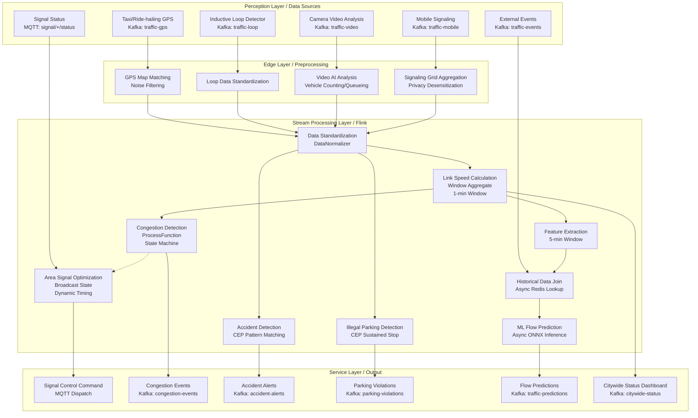
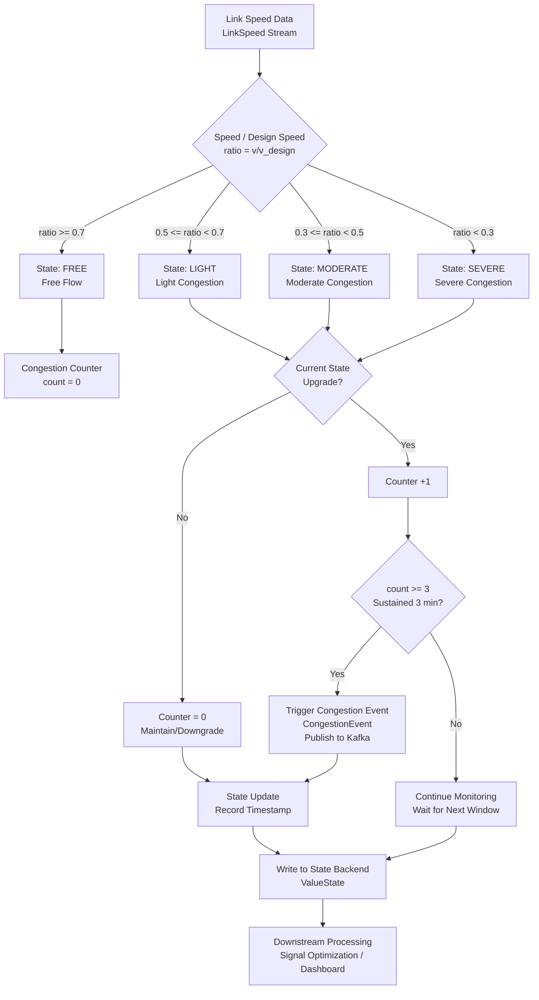
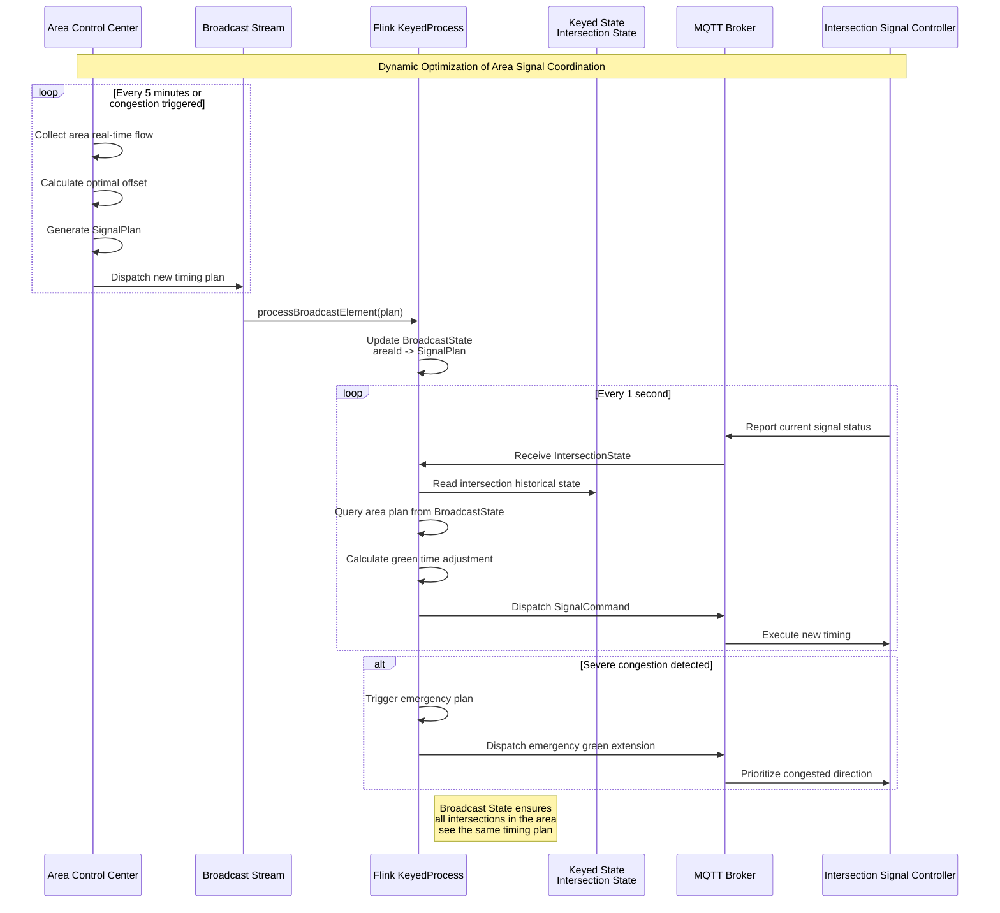

# Stream Processing Operators and Real-time Traffic Flow Management

> **Stage**: Knowledge/10-case-studies | **Prerequisites**: [operator-iot-stream-processing.md](./operator-iot-stream-processing.md), [operator-cep-complex-event-processing.md](./pattern-cep-complex-event.md) | **Formalization Level**: L3
> **Document Scope**: Stream processing operators in Intelligent Transportation Systems (ITS) for real-time traffic flow monitoring, congestion detection, signal optimization, and event detection
> **Version**: 2026.04

---

## Table of Contents

- [Stream Processing Operators and Real-time Traffic Flow Management](#stream-processing-operators-and-real-time-traffic-flow-management)
  - [Table of Contents](#table-of-contents)
  - [1. Definitions](#1-definitions)
    - [Def-TRF-01-01: Intelligent Transportation Data Stream (ITS Data Stream)](#def-trf-01-01-intelligent-transportation-data-stream-its-data-stream)
    - [Def-TRF-01-02: Link Average Speed](#def-trf-01-02-link-average-speed)
    - [Def-TRF-01-03: Traffic Congestion State](#def-trf-01-03-traffic-congestion-state)
    - [Def-TRF-01-04: Area Signal Timing](#def-trf-01-04-area-signal-timing)
    - [Def-TRF-01-05: Traffic Anomaly Event](#def-trf-01-05-traffic-anomaly-event)
    - [Def-TRF-01-06: Short-term Traffic Flow Prediction](#def-trf-01-06-short-term-traffic-flow-prediction)
  - [2. Properties](#2-properties)
    - [Lemma-TRF-01-01: Convergence of Link Speed Estimation from Probe Vehicle Data](#lemma-trf-01-01-convergence-of-link-speed-estimation-from-probe-vehicle-data)
    - [Lemma-TRF-01-02: Delay Lower Bound of Congestion Detection](#lemma-trf-01-02-delay-lower-bound-of-congestion-detection)
    - [Prop-TRF-01-01: Variance Reduction in Speed Estimation via Multi-source Data Fusion](#prop-trf-01-01-variance-reduction-in-speed-estimation-via-multi-source-data-fusion)
    - [Prop-TRF-01-02: Green Wave Bandwidth Maximization via Signal Coordination](#prop-trf-01-02-green-wave-bandwidth-maximization-via-signal-coordination)
  - [3. Relations](#3-relations)
    - [3.1 Traffic Monitoring Pipeline Operator Mapping](#31-traffic-monitoring-pipeline-operator-mapping)
    - [3.2 Multi-source Data Mapping to Flink Source Operators](#32-multi-source-data-mapping-to-flink-source-operators)
    - [3.3 Operator Fingerprint](#33-operator-fingerprint)
  - [4. Argumentation](#4-argumentation)
    - [4.1 Challenges of Multi-source Heterogeneous Traffic Data Fusion](#41-challenges-of-multi-source-heterogeneous-traffic-data-fusion)
    - [4.2 Real-time Requirements and Watermark Strategy](#42-real-time-requirements-and-watermark-strategy)
    - [4.3 Real-time Update Mechanism for Prediction Models](#43-real-time-update-mechanism-for-prediction-models)
  - [5. Proof / Engineering Argument](#5-proof--engineering-argument)
    - [5.1 Link Speed Calculation (Window Aggregate)](#51-link-speed-calculation-window-aggregate)
    - [5.2 Congestion Detection (ProcessFunction)](#52-congestion-detection-processfunction)
    - [5.3 Signal Optimization (Broadcast State)](#53-signal-optimization-broadcast-state)
    - [5.4 Event Detection (CEP)](#54-event-detection-cep)
    - [5.5 Short-term Flow Prediction (Real-time + Historical Data Fusion)](#55-short-term-flow-prediction-real-time--historical-data-fusion)
  - [6. Examples](#6-examples)
    - [6.1 Complete Traffic Monitoring Pipeline](#61-complete-traffic-monitoring-pipeline)
  - [7. Visualizations](#7-visualizations)
    - [Urban Real-time Traffic Processing Pipeline Architecture](#urban-real-time-traffic-processing-pipeline-architecture)
    - [Congestion Detection Flowchart](#congestion-detection-flowchart)
    - [Area Signal Coordination Optimization Flow](#area-signal-coordination-optimization-flow)
  - [8. References](#8-references)

---

## 1. Definitions

### Def-TRF-01-01: Intelligent Transportation Data Stream (ITS Data Stream)

An Intelligent Transportation Data Stream (智能交通数据流) is a spatiotemporal data sequence generated by multi-source heterogeneous sensors in urban road traffic systems:

$$\text{TrafficStream} = \{S_{GPS}, S_{loop}, S_{video}, S_{mobile}, S_{signal}\}$$

where:

- $S_{GPS}$: Probe vehicle GPS trajectory data (taxi/ride-hailing/bus/freight), frequency 1-30s/point, fields `(vehicleId, timestamp, longitude, latitude, speed, heading)`
- $S_{loop}$: Inductive loop detector data, frequency 1-5min, fields `(loopId, roadId, timestamp, volume, occupancy, avgSpeed)`
- $S_{video}$: Camera video analysis data, frequency 1-30s/frame, fields `(cameraId, roadId, timestamp, vehicleCount, vehicleTypes, queueLength)`
- $S_{mobile}$: Mobile signaling data, frequency event-triggered, fields `(cellId, timestamp, userCount, movementVector)`
- $S_{signal}$: Signal status feedback, frequency 1s, fields `(intersectionId, phase, greenTime, redTime, currentStatus)`

### Def-TRF-01-02: Link Average Speed

Link Average Speed (路段平均速度) is the weighted average speed of vehicles on a specific road segment within a given time window:

$$\bar{v}_{link}(t, W) = \frac{\sum_{i \in \mathcal{V}_{link}(t, W)} w_i \cdot v_i}{\sum_{i \in \mathcal{V}_{link}(t, W)} w_i}$$

where:

- $\mathcal{V}_{link}(t, W)$: set of vehicles passing through the link within time window $[t-W, t]$
- $v_i$: observed speed of vehicle $i$
- $w_i$: confidence weight by data source (GPS: 0.9, Inductive Loop: 1.0, Video Analysis: 0.85, Mobile Signaling: 0.6)

**Intuitive Explanation**: By fusing multi-source data, a more stable and reliable link speed estimate is obtained than from any single data source alone.

### Def-TRF-01-03: Traffic Congestion State

Traffic Congestion State (交通拥堵状态) is the state where link speed falls below a certain proportion of the design speed and the duration exceeds a threshold:

$$\text{CongestionState}_{link}(t) = \begin{cases} \text{FREE} & \bar{v} \geq 0.7 v_{design} \\ \text{LIGHT} & 0.5 v_{design} \leq \bar{v} < 0.7 v_{design} \\ \text{MODERATE} & 0.3 v_{design} \leq \bar{v} < 0.5 v_{design} \\ \text{SEVERE} & \bar{v} < 0.3 v_{design} \end{cases}$$

Congestion detection conditions:

- Speed threshold: $\bar{v}_{link} < v_{threshold}$ (typically $0.5 \cdot v_{design}$)
- Duration: $\Delta t_{congestion} \geq T_{min}$ (typically 3-5 minutes, to exclude transient slowdowns)
- Spatial continuity: consecutive $n$ links simultaneously satisfy the condition (typically $n \geq 2$, to exclude single-point anomalies)

### Def-TRF-01-04: Area Signal Timing

Area Signal Timing (区域信号配时) is a coordinated control scheme for traffic signals at multiple intersections within a traffic control area:

$$\text{SignalPlan} = (\Phi, C, \{g_i\}, \{o_{ij}\})$$

where:

- $\Phi$: set of signal phases (e.g., north-south through, north-south left-turn, east-west through, etc.)
- $C$: signal cycle length (seconds)
- $g_i$: green time of phase $i$
- $o_{ij}$: offset between intersection $i$ and intersection $j$, used to achieve green-wave coordination

**Broadcast State Semantics**: The signal optimization plan serves as a broadcast stream (Broadcast Stream); all link processing tasks share the same area timing parameters, supporting dynamic updates.

### Def-TRF-01-05: Traffic Anomaly Event

Traffic Anomaly Event (交通异常事件) is a sudden spatiotemporal pattern that deviates from normal traffic patterns:

$$\text{Anomaly} = \{(e_1, t_1, loc_1), (e_2, t_2, loc_2), \dots \} \mid \text{Pattern}(e_1, e_2, \dots) = \text{True}$$

Common anomaly patterns:

- **Traffic Accident**: multi-vehicle sharp speed drop → stop → road blockage (CEP pattern: `speed_drop → stop → blockage`)
- **Illegal Parking**: vehicle speed drops to 0 and is not in a legal parking zone (CEP pattern: `speed_zero ∧ ¬parking_zone`)
- **Wrong-way Driving**: vehicle heading direction is opposite to the link design direction (CEP pattern: `heading_deviation > 160°`)
- **Debris / Pedestrian Intrusion**: video analysis detects non-vehicle targets appearing in the lane area

### Def-TRF-01-06: Short-term Traffic Flow Prediction

Short-term Traffic Flow Prediction (短时交通流量预测) forecasts traffic conditions for the next 5–30 minutes based on historical and real-time data:

$$\hat{Q}_{link}(t + \Delta t) = f\left(Q_{link}(t), Q_{link}(t-1), \dots, H_{link}(t), E_{link}(t)\right)$$

where:

- $\hat{Q}_{link}(t + \Delta t)$: predicted flow/speed at future time $t + \Delta t$
- $Q_{link}(t)$: real-time flow/speed sequence
- $H_{link}(t)$: historical同期 patterns (weekly patterns, daily patterns, holiday patterns)
- $E_{link}(t)$: external events (weather, accidents, large events, construction)
- $\Delta t \in \{5, 10, 15, 30\}$ minutes

---

## 2. Properties

### Lemma-TRF-01-01: Convergence of Link Speed Estimation from Probe Vehicle Data

Assume probe vehicle penetration rate (probe vehicle count / total vehicle count) is $\rho$, and GPS speed measurement error is $\epsilon \sim \mathcal{N}(0, \sigma^2)$, then the link speed estimation error is:

$$\text{Var}(\hat{v}_{link}) = \frac{\sigma^2}{n_{probe}} + \frac{(1-\rho)}{\rho} \cdot \text{Var}(v_{background})$$

where $n_{probe}$ is the number of probe vehicle samples in the window. **When $n_{probe} \geq 30$ and $\rho \geq 0.05$, the estimation error can be controlled within 10%.**

**Engineering Corollary**: On arterial roads in first-tier cities, taxi/ride-hailing penetration rates are typically > 10%, satisfying the convergence condition; however, urban branch roads and suburban roads require supplemental inductive loop or video data.

### Lemma-TRF-01-02: Delay Lower Bound of Congestion Detection

The minimum delay of congestion detection is determined by three factors:

$$T_{detect}^{min} = T_{sample} + T_{window} + T_{process}$$

- $T_{sample}$: data source sampling interval (GPS: 5-30s, Inductive Loop: 1-5min, Video: 1-30s)
- $T_{window}$: window calculation duration (typically 1-3 minutes, requiring sufficient samples)
- $T_{process}$: stream processing latency (Flink sub-second)

**Optimal Configuration** (GPS + 1-minute window): $T_{detect}^{min} \approx 30s + 60s + 1s \approx 91s$

**Worst Configuration** (Inductive Loop + 3-minute window): $T_{detect}^{min} \approx 5min + 3min + 1s \approx 8min$

### Prop-TRF-01-01: Variance Reduction in Speed Estimation via Multi-source Data Fusion

Fusing $k$ independent data source speed estimates, the variance satisfies:

$$\frac{1}{\text{Var}(\hat{v}_{fused})} = \sum_{j=1}^{k} \frac{w_j}{\text{Var}(\hat{v}_j)}$$

**Typical Scenario**: GPS (variance $0.8$) + Inductive Loop (variance $0.3$) + Video (variance $0.5$) after fusion, the combined variance drops to approximately $0.15$, improving accuracy by about 5×.

### Prop-TRF-01-02: Green Wave Bandwidth Maximization via Signal Coordination

For an arterial road containing $n$ intersections, the green wave bandwidth $B$ and the offset $o_{ij}$ satisfy:

$$B = \min_{i=1}^{n-1} \left( g_{min} - \frac{|o_{i,i+1} - d_{i,i+1}/v_{design}|}{C} \right)$$

where $d_{i,i+1}$ is the distance between intersections, and $g_{min}$ is the minimum green time proportion. **Optimal offset**: $o_{i,i+1}^* = d_{i,i+1} / v_{design}$ (travel time at design speed).

---

## 3. Relations

### 3.1 Traffic Monitoring Pipeline Operator Mapping

| Application Scenario | Operator Composition | Data Sources | Latency Requirement | Output |
|---------|---------|--------|---------|------|
| **Link Speed Calculation** | Source → map → keyBy → window(1min) → aggregate | GPS + Loop + Video | < 2min | Link Speed |
| **Congestion Detection** | keyBy → ProcessFunction + Timer | Link Speed Stream | < 3min | Congestion State Change |
| **Signal Optimization** | Broadcast Stream → KeyedProcessFunction | Area Status + Timing Parameters | < 5s | Signal Timing Command |
| **Accident Detection** | keyBy → CEP → select | GPS Trajectory Stream | < 30s | Accident Alert |
| **Illegal Parking** | keyBy → CEP + Async Map Matching | GPS Trajectory Stream | < 1min | Parking Violation Alert |
| **Flow Prediction** | Async ML + window join (Real-time ∪ Historical) | Flow + Historical + External Events | < 10s | 5/10/30-min Prediction |
| **Traffic Dashboard** | window(1min) → aggregate → sink | Full Fused Data | < 1min | Visualization Update |

### 3.2 Multi-source Data Mapping to Flink Source Operators

| Data Source | Access Protocol | Frequency | Flink Source | Preprocessing Requirement |
|--------|---------|------|-------------|-----------|
| **Taxi/Ride-hailing GPS** | Kafka (JSON/Protobuf) | 5-30s/point | Kafka Source | Map matching, noise filtering |
| **Inductive Loop Detector** | MQTT/Proprietary Protocol | 1-5min | MQTT Source / Custom Source | Data standardization |
| **Camera Video Analysis** | Kafka (analysis results) / RTSP | 1-30s | Kafka Source | Video stream preprocessed at edge |
| **Mobile Signaling** | Kafka (desensitized) | Event-triggered | Kafka Source | Privacy desensitization, grid aggregation |
| **Signal Status** | MQTT/Modbus | 1s | MQTT Source | Status standardization |
| **Weather/Events** | HTTP API / Kafka | 5-15min | HTTP Source / Kafka Source | Format conversion |

### 3.3 Operator Fingerprint

| Dimension | Traffic Flow Processing Characteristics |
|------|---------------|
| **Core Operators** | `window aggregate` (speed/flow statistics), `ProcessFunction` (congestion state machine), `Broadcast State` (area timing synchronization), `CEP` (anomaly pattern matching), `AsyncFunction` (ML prediction) |
| **State Types** | `ValueState` (current congestion level of link), `MapState` (area timing parameters), `ListState` (historical speed window), `BroadcastState` (global signal plan) |
| **Time Semantics** | Event time为主 (GPS timestamp), Watermark tolerance 30-60s delay |
| **Data Characteristics** | Multi-source heterogeneous, spatiotemporal correlation, strong periodicity (morning/evening peaks), sudden anomalies |
| **State Hotspots** | Hot link keys (city center arterials), peak hour keys (time dimension skew) |
| **Performance Bottlenecks** | Massive GPS point map matching, high-concurrency video stream analysis results, historical data join |

---

## 4. Argumentation

### 4.1 Challenges of Multi-source Heterogeneous Traffic Data Fusion

**Challenge 1: Spatiotemporal Alignment**
Different data sources have inconsistent spatial granularity (GPS point vs. link vs. grid) and temporal granularity (second-level vs. minute-level), requiring a unified coordinate system and time base.

**Solution**:

1. Spatial alignment: GPS point → Map Matching → Link ID
2. Temporal alignment: use event timestamp as the baseline, Watermark tolerates maximum delay
3. Data quality: GPS drift filtering (speed > 120km/h or position jump > 500m regarded as noise)

**Challenge 2: Data Missing and Sparsity**
At night or on suburban roads, probe vehicles are sparse, and inductive loop coverage is limited.

**Solution**:

1. Multi-source complement: prioritize inductive loop/video in GPS-sparse areas
2. Spatiotemporal interpolation: linear/Kriging interpolation based on adjacent links and historical同期 data
3. Confidence tagging: low-confidence estimates are down-weighted in downstream processing

### 4.2 Real-time Requirements and Watermark Strategy

Traffic management real-time requirements are layered:

| Application Scenario | Maximum Tolerable Delay | Watermark Strategy |
|---------|------------|--------------|
| Signal Optimization | < 5s | Processing Time, disable event-time delay |
| Congestion Detection | < 3min | Event Time, Watermark = max_timestamp - 30s |
| Accident Detection | < 30s | Event Time, Watermark = max_timestamp - 15s |
| Flow Prediction | < 10s | Event Time, Watermark = max_timestamp - 60s |
| Traffic Dashboard | < 1min | Event Time, Watermark = max_timestamp - 30s |

**Argument**: Signal optimization directly controls physical devices; excessive delay causes control failure, so processing time is adopted; accident detection requires rapid response, allowing small out-of-order tolerance; flow prediction is based on minute-level windows, tolerating larger delay.

### 4.3 Real-time Update Mechanism for Prediction Models

Short-term traffic prediction needs to balance model accuracy and real-time performance:

- **Online Learning**: Flink invokes online learning services (e.g., River, Vowpal Wabbit) via `AsyncFunction`, updating model parameters once per window
- **Batch-Stream Unification**: use FlinkML or connect to external model services (TensorFlow Serving, TorchServe), offline training and online inference
- **Feature Engineering**: real-time features (current flow, speed, occupancy) + historical features (同期 mean, variance) + external features (weather, holidays, events)

---

## 5. Proof / Engineering Argument

### 5.1 Link Speed Calculation (Window Aggregate)

```java
/**
 * Link Speed Calculation: weighted average speed fusing multi-source data
 * Input: TrafficRecord (unified format for GPS/loop/video/mobile signaling)
 * Output: LinkSpeed (roadId, avgSpeed, confidence, timestamp)
 */
public class LinkSpeedCalculator {

    public static SingleOutputStreamOperator<LinkSpeed> calculate(
            DataStream<TrafficRecord> source,
            Time windowSize) {

        return source
            // Data standardization: unify different data sources to (roadId, speed, weight, timestamp)
            .map(new DataNormalizer())
            // Partition by road segment, data of the same segment goes to the same parallel instance
            .keyBy(TrafficRecord::getRoadId)
            // Tumbling window: calculate link speed every minute
            .window(TumblingEventTimeWindows.of(windowSize))
            // Weighted aggregation: data sources with higher confidence have larger weights
            .aggregate(new WeightedSpeedAggregate());
    }
}

/**
 * Weighted Average Aggregate Function
 */
public static class WeightedSpeedAggregate
        implements AggregateFunction<TrafficRecord, SpeedAccumulator, LinkSpeed> {

    @Override
    public SpeedAccumulator createAccumulator() {
        return new SpeedAccumulator();
    }

    @Override
    public SpeedAccumulator add(TrafficRecord record, SpeedAccumulator acc) {
        acc.sumWeightedSpeed += record.getSpeed() * record.getConfidence();
        acc.sumWeight += record.getConfidence();
        acc.sampleCount++;
        return acc;
    }

    @Override
    public LinkSpeed getResult(SpeedAccumulator acc) {
        double avgSpeed = acc.sumWeight > 0 ? acc.sumWeightedSpeed / acc.sumWeight : 0;
        double confidence = Math.min(1.0, acc.sampleCount / 30.0); // Confidence is 1 when sample count >= 30
        return new LinkSpeed(acc.roadId, avgSpeed, confidence, System.currentTimeMillis());
    }

    @Override
    public SpeedAccumulator merge(SpeedAccumulator a, SpeedAccumulator b) {
        a.sumWeightedSpeed += b.sumWeightedSpeed;
        a.sumWeight += b.sumWeight;
        a.sampleCount += b.sampleCount;
        return a;
    }
}
```

### 5.2 Congestion Detection (ProcessFunction)

```java
/**
 * Congestion Detection: state machine based on speed threshold + duration + spatial continuity
 * State transitions: FREE → LIGHT → MODERATE → SEVERE
 */
public class CongestionDetector
    extends KeyedProcessFunction<String, LinkSpeed, CongestionEvent> {

    // Current congestion state of the link
    private ValueState<CongestionLevel> congestionState;
    // Timestamp when entering the current state
    private ValueState<Long> stateEnterTime;
    // Continuous low-speed counter (for detecting duration)
    private ValueState<Integer> lowSpeedCount;

    // Parameter configuration
    private static final double SPEED_THRESHOLD_LIGHT = 0.7;   // 70% design speed
    private static final double SPEED_THRESHOLD_MODERATE = 0.5; // 50% design speed
    private static final double SPEED_THRESHOLD_SEVERE = 0.3;   // 30% design speed
    private static final int MIN_CONTINUOUS_WINDOWS = 3;        // 3 consecutive windows (3 minutes)

    @Override
    public void open(Configuration parameters) {
        congestionState = getRuntimeContext().getState(
            new ValueStateDescriptor<>("congestionState", CongestionLevel.class));
        stateEnterTime = getRuntimeContext().getState(
            new ValueStateDescriptor<>("stateEnterTime", Types.LONG));
        lowSpeedCount = getRuntimeContext().getState(
            new ValueStateDescriptor<>("lowSpeedCount", Types.INT));
    }

    @Override
    public void processElement(LinkSpeed speed, Context ctx, Collector<CongestionEvent> out)
            throws Exception {

        CongestionLevel current = congestionState.value();
        if (current == null) current = CongestionLevel.FREE;

        int count = lowSpeedCount.value() != null ? lowSpeedCount.value() : 0;

        // Determine current observed level based on speed
        double ratio = speed.getAvgSpeed() / speed.getDesignSpeed();
        CongestionLevel observed;
        if (ratio >= SPEED_THRESHOLD_LIGHT) observed = CongestionLevel.FREE;
        else if (ratio >= SPEED_THRESHOLD_MODERATE) observed = CongestionLevel.LIGHT;
        else if (ratio >= SPEED_THRESHOLD_SEVERE) observed = CongestionLevel.MODERATE;
        else observed = CongestionLevel.SEVERE;

        // State machine logic
        if (observed.ordinal() > current.ordinal()) {
            // Degradation: increment counter
            count++;
            if (count >= MIN_CONTINUOUS_WINDOWS) {
                // Sustained above threshold, upgrade state
                CongestionLevel newLevel = observed;
                long enterTime = stateEnterTime.value() != null ? stateEnterTime.value() : ctx.timestamp();
                out.collect(new CongestionEvent(
                    speed.getRoadId(), current, newLevel,
                    enterTime, ctx.timestamp(), speed.getAvgSpeed()
                ));
                congestionState.update(newLevel);
                stateEnterTime.update(ctx.timestamp());
                count = 0;
            }
        } else if (observed.ordinal() < current.ordinal()) {
            // Recovery: direct downgrade (recovery does not require duration verification)
            out.collect(new CongestionEvent(
                speed.getRoadId(), current, observed,
                stateEnterTime.value(), ctx.timestamp(), speed.getAvgSpeed()
            ));
            congestionState.update(observed);
            stateEnterTime.update(ctx.timestamp());
            count = 0;
        } else {
            // Maintain current state, reset counter
            count = 0;
        }

        lowSpeedCount.update(count);
    }
}
```

### 5.3 Signal Optimization (Broadcast State)

```java
/**
 * Area Signal Coordination Optimization: Broadcast State for dynamic timing dispatch
 * - Broadcast stream: signal timing plan dispatched by area control center
 * - Main stream: real-time traffic status at each intersection
 */
public class SignalOptimizer
    extends KeyedBroadcastProcessFunction<String, IntersectionState, SignalPlan, SignalCommand> {

    // Intersection's own state (main stream Keyed State)
    private ValueState<IntersectionState> intersectionState;
    // Area timing plan (Broadcast State, shared by all intersections)
    private MapStateDescriptor<String, SignalPlan> planDescriptor;

    @Override
    public void open(Configuration parameters) {
        intersectionState = getRuntimeContext().getState(
            new ValueStateDescriptor<>("intersectionState", IntersectionState.class));
        planDescriptor = new MapStateDescriptor<>(
            "signalPlan", Types.STRING, Types.POJO(SignalPlan.class));
    }

    @Override
    public void processElement(IntersectionState state, ReadOnlyContext ctx,
            Collector<SignalCommand> out) throws Exception {

        // Read current area timing plan from Broadcast State
        ReadOnlyBroadcastState<String, SignalPlan> planState = ctx.getBroadcastState(planDescriptor);
        String areaId = state.getAreaId();
        SignalPlan plan = planState.get(areaId);

        if (plan == null) return; // Timing plan not yet received

        // Dynamically adjust green time based on real-time flow
        double flowRatio = state.getCurrentFlow() / state.getDesignCapacity();
        int greenAdjustment = 0;
        if (flowRatio > 1.2) greenAdjustment = +5;      // Oversaturated, extend by 5s
        else if (flowRatio < 0.3) greenAdjustment = -3; // Low flow, shorten by 3s

        // Calculate remaining time of current phase
        long now = ctx.currentWatermark();
        long cycleElapsed = (now - plan.getCycleStart()) % (plan.getCycleLength() * 1000);

        // Generate signal control command
        SignalCommand cmd = new SignalCommand(
            state.getIntersectionId(),
            plan.getCurrentPhase(),
            plan.getGreenTime(plan.getCurrentPhase()) + greenAdjustment,
            plan.getOffset(),
            now
        );

        out.collect(cmd);
        intersectionState.update(state);
    }

    @Override
    public void processBroadcastElement(SignalPlan plan, Context ctx,
            Collector<SignalCommand> out) throws Exception {
        // Update Broadcast State: new timing plan overrides old plan
        BroadcastState<String, SignalPlan> state = ctx.getBroadcastState(planDescriptor);
        state.put(plan.getAreaId(), plan);
    }
}
```

### 5.4 Event Detection (CEP)

```java
/**
 * Traffic Accident Detection: CEP Pattern Matching
 * Pattern: vehicle speed drops sharply (>50%) → stop (speed < 5km/h for >30s) → following vehicles queue
 */
public class AccidentDetectionCEP {

    public static Pattern<TrafficRecord, ?> getAccidentPattern() {
        return Pattern.<TrafficRecord>begin("speed_drop")
            // Stage 1: sharp speed drop (current speed < previous speed * 0.5)
            .where(new RichIterativeCondition<TrafficRecord>() {
                private ValueState<Double> lastSpeedState;
                @Override
                public void open(RuntimeContext ctx) {
                    lastSpeedState = ctx.getState(
                        new ValueStateDescriptor<>("lastSpeed", Types.DOUBLE));
                }
                @Override
                public boolean filter(TrafficRecord record, Context<TrafficRecord> ctx)
                        throws Exception {
                    Double lastSpeed = lastSpeedState.value();
                    lastSpeedState.update(record.getSpeed());
                    if (lastSpeed == null) return false;
                    return record.getSpeed() < lastSpeed * 0.5 && record.getSpeed() < 20;
                }
            })
            .next("stop")
            // Stage 2: stop state (speed < 5km/h)
            .where(record -> record.getSpeed() < 5.0)
            .within(Time.seconds(30))
            .next("blockage")
            // Stage 3: rear queue (subsequent vehicles on same link all < 10km/h)
            .where(record -> record.getSpeed() < 10.0)
            .timesOrMore(3)
            .within(Time.minutes(2));
    }

    public static SingleOutputStreamOperator<AccidentAlert> detect(
            DataStream<TrafficRecord> stream) {

        Pattern<TrafficRecord, ?> pattern = getAccidentPattern();

        PatternStream<TrafficRecord> patternStream = CEP.pattern(
            stream.keyBy(TrafficRecord::getRoadId), pattern);

        return patternStream
            .process(new PatternProcessFunction<TrafficRecord, AccidentAlert>() {
                @Override
                public void processMatch(
                        Map<String, List<TrafficRecord>> match,
                        Context ctx,
                        Collector<AccidentAlert> out) {

                    TrafficRecord dropEvent = match.get("speed_drop").get(0);
                    TrafficRecord stopEvent = match.get("stop").get(0);
                    List<TrafficRecord> blockageEvents = match.get("blockage");

                    out.collect(new AccidentAlert(
                        dropEvent.getRoadId(),
                        dropEvent.getVehicleId(),
                        dropEvent.getTimestamp(),
                        stopEvent.getLatitude(),
                        stopEvent.getLongitude(),
                        blockageEvents.size(), // Number of affected vehicles
                        AccidentSeverity.HIGH
                    ));
                }
            });
    }
}
```

### 5.5 Short-term Flow Prediction (Real-time + Historical Data Fusion)

```java
/**
 * Short-term Traffic Flow Prediction: Async ML inference based on real-time stream + historical data
 * Predict flow and speed for the next 5/10/30 minutes
 */
public class TrafficFlowPredictor
    extends AsyncFunction<LinkFeatures, PredictionResult> {

    private transient TrafficPredictionModel model;

    @Override
    public void open(Configuration parameters) {
        // Load pre-trained model (TensorFlow Lite / ONNX Runtime)
        model = TrafficPredictionModel.load("models/traffic_lstm.onnx");
    }

    @Override
    public void asyncInvoke(LinkFeatures features, ResultFuture<PredictionResult> resultFuture) {
        // Build feature vector
        float[] inputVector = buildFeatureVector(features);

        // Async inference
        model.predictAsync(inputVector, new ModelCallback() {
            @Override
            public void onResult(float[][] predictions) {
                // predictions[0]: 5-min prediction, [1]: 10-min, [2]: 30-min
                List<PredictionResult> results = new ArrayList<>();
                int[] horizons = {5, 10, 30};
                for (int i = 0; i < 3; i++) {
                    results.add(new PredictionResult(
                        features.getRoadId(),
                        horizons[i],
                        predictions[i][0], // Predicted flow
                        predictions[i][1], // Predicted speed
                        predictions[i][2], // Predicted congestion probability
                        System.currentTimeMillis()
                    ));
                }
                resultFuture.complete(results);
            }
        });
    }

    private float[] buildFeatureVector(LinkFeatures f) {
        return new float[] {
            // Real-time features (normalized)
            f.getCurrentFlow() / f.getDesignCapacity(),
            f.getCurrentSpeed() / f.getDesignSpeed(),
            f.getOccupancy(),
            // Historical同期 features
            f.getHistoricalAvgFlow(),
            f.getHistoricalAvgSpeed(),
            // Temporal features
            f.getHourOfDay() / 24.0f,
            f.getDayOfWeek() / 7.0f,
            f.isHoliday() ? 1.0f : 0.0f,
            // External features
            f.getTemperature() / 40.0f,
            f.getPrecipitation(),
            f.hasEventNearby() ? 1.0f : 0.0f
        };
    }
}
```

---

## 6. Examples

### 6.1 Complete Traffic Monitoring Pipeline

```java
/**
 * City Traffic Real-time Monitoring Complete Pipeline
 * Tech Stack: Flink + Kafka + Redis + ML Serving
 */
public class CityTrafficMonitoringPipeline {

    public static void main(String[] args) throws Exception {
        StreamExecutionEnvironment env = StreamExecutionEnvironment.getExecutionEnvironment();
        env.setParallelism(4);
        env.setStreamTimeCharacteristic(TimeCharacteristic.EventTime);

        // ============================================================
        // 1. Multi-source Data Ingestion
        // ============================================================

        // 1.1 Taxi/Ride-hailing GPS (Kafka topic: traffic-gps)
        DataStream<TrafficRecord> gpsStream = env
            .addSource(new FlinkKafkaConsumer<>("traffic-gps",
                new TrafficRecordDeserializer(), kafkaProps))
            .assignTimestampsAndWatermarks(
                WatermarkStrategy.<TrafficRecord>forBoundedOutOfOrderness(
                    Duration.ofSeconds(30))
                .withIdleness(Duration.ofMinutes(2)));

        // 1.2 Inductive Loop Detectors (Kafka topic: traffic-loop)
        DataStream<TrafficRecord> loopStream = env
            .addSource(new FlinkKafkaConsumer<>("traffic-loop",
                new LoopRecordDeserializer(), kafkaProps))
            .assignTimestampsAndWatermarks(
                WatermarkStrategy.<TrafficRecord>forBoundedOutOfOrderness(
                    Duration.ofMinutes(3)));

        // 1.3 Video Analysis Results (Kafka topic: traffic-video)
        DataStream<TrafficRecord> videoStream = env
            .addSource(new FlinkKafkaConsumer<>("traffic-video",
                new VideoAnalysisDeserializer(), kafkaProps))
            .assignTimestampsAndWatermarks(
                WatermarkStrategy.<TrafficRecord>forBoundedOutOfOrderness(
                    Duration.ofSeconds(15)));

        // 1.4 Signal Status (MQTT)
        DataStream<SignalStatus> signalStream = env
            .addSource(new MqttSource("tcp://mqtt-broker:1883", "signal/+/status"));

        // 1.5 External Events (weather, construction, accident reports)
        DataStream<ExternalEvent> eventStream = env
            .addSource(new FlinkKafkaConsumer<>("traffic-events",
                new EventDeserializer(), kafkaProps));

        // ============================================================
        // 2. Data Standardization and Fusion
        // ============================================================
        DataStream<TrafficRecord> unifiedStream = gpsStream
            .union(loopStream, videoStream)
            .map(new DataNormalizer())  // Unified to (roadId, speed, flow, occupancy, confidence, timestamp)
            .filter(new DataQualityFilter()); // Filter outliers

        // ============================================================
        // 3. Link Speed Calculation (1-minute tumbling window)
        // ============================================================
        DataStream<LinkSpeed> linkSpeedStream = LinkSpeedCalculator
            .calculate(unifiedStream, Time.minutes(1));

        // ============================================================
        // 4. Congestion Detection (ProcessFunction State Machine)
        // ============================================================
        DataStream<CongestionEvent> congestionStream = linkSpeedStream
            .keyBy(LinkSpeed::getRoadId)
            .process(new CongestionDetector());

        // Congestion events → Kafka (for signal system subscription)
        congestionStream.addSink(
            new FlinkKafkaProducer<>("congestion-events",
                new CongestionSerializer(), kafkaProps));

        // ============================================================
        // 5. Area Signal Optimization (Broadcast State)
        // ============================================================
        // Broadcast stream: area control center dynamically dispatches timing plans
        DataStream<SignalPlan> planBroadcastStream = env
            .addSource(new FlinkKafkaConsumer<>("signal-plans",
                new SignalPlanDeserializer(), kafkaProps))
            .broadcast(new MapStateDescriptor<>("signalPlan", Types.STRING, Types.POJO(SignalPlan.class)));

        // Main stream: real-time status at each intersection
        DataStream<IntersectionState> intersectionStream = linkSpeedStream
            .keyBy(LinkSpeed::getRoadId)
            .window(TumblingEventTimeWindows.of(Time.minutes(1)))
            .aggregate(new IntersectionStateAggregate())
            .keyBy(IntersectionState::getAreaId);

        // Broadcast State processing
        DataStream<SignalCommand> signalCommandStream = intersectionStream
            .connect(planBroadcastStream)
            .process(new SignalOptimizer());

        // Signal commands → MQTT (dispatch to intersection signal controllers)
        signalCommandStream.addSink(new MqttSink("tcp://mqtt-broker:1883", "signal/command"));

        // ============================================================
        // 6. Event Detection (CEP)
        // ============================================================
        // 6.1 Accident Detection
        DataStream<AccidentAlert> accidentStream = AccidentDetectionCEP.detect(
            unifiedStream.filter(r -> r.getSourceType() == SourceType.GPS));

        accidentStream.addSink(
            new FlinkKafkaProducer<>("accident-alerts",
                new AccidentSerializer(), kafkaProps));

        // 6.2 Illegal Parking Detection
        Pattern<TrafficRecord, ?> parkingPattern = Pattern.<TrafficRecord>begin("stop")
            .where(r -> r.getSpeed() == 0)
            .next("persist")
            .where(r -> r.getSpeed() == 0)
            .timesOrMore(6) // Sustained 30 seconds (5-second interval)
            .within(Time.minutes(2));

        CEP.pattern(unifiedStream.keyBy(TrafficRecord::getVehicleId), parkingPattern)
            .process(new PatternProcessFunction<TrafficRecord, ParkingViolation>() {
                @Override
                public void processMatch(Map<String, List<TrafficRecord>> match,
                        Context ctx, Collector<ParkingViolation> out) {
                    TrafficRecord r = match.get("stop").get(0);
                    out.collect(new ParkingViolation(r.getVehicleId(), r.getRoadId(),
                        r.getTimestamp(), r.getLatitude(), r.getLongitude()));
                }
            })
            .addSink(new FlinkKafkaProducer<>("parking-violations",
                new ParkingSerializer(), kafkaProps));

        // ============================================================
        // 7. Short-term Flow Prediction (Async ML + Historical Data Join)
        // ============================================================
        // 7.1 Real-time Feature Extraction
        DataStream<LinkFeatures> featureStream = linkSpeedStream
            .keyBy(LinkSpeed::getRoadId)
            .window(TumblingEventTimeWindows.of(Time.minutes(5)))
            .aggregate(new FeatureExtractor());

        // 7.2 Historical Data Lookup (Async IO query Redis/HBase)
        DataStream<LinkFeatures> enrichedFeatureStream = AsyncDataStream.unorderedWait(
            featureStream,
            new HistoricalDataEnricher(redisConfig), // Query historical同期 data
            Time.milliseconds(100),
            50
        );

        // 7.3 External Event Join
        DataStream<LinkFeatures> fullyEnrichedStream = enrichedFeatureStream
            .keyBy(LinkFeatures::getAreaId)
            .intervalJoin(eventStream.keyBy(ExternalEvent::getAreaId))
            .between(Time.minutes(-10), Time.minutes(10))
            .process(new EventEnrichmentProcess());

        // 7.4 Async ML Inference
        DataStream<PredictionResult> predictionStream = AsyncDataStream.unorderedWait(
            fullyEnrichedStream,
            new TrafficFlowPredictor(),
            Time.milliseconds(200),
            100
        );

        // Prediction results → Kafka (for navigation apps, traffic dashboard subscription)
        predictionStream.addSink(
            new FlinkKafkaProducer<>("traffic-predictions",
                new PredictionSerializer(), kafkaProps));

        // ============================================================
        // 8. Citywide Dashboard Aggregation (whole network status)
        // ============================================================
        linkSpeedStream
            .windowAll(TumblingEventTimeWindows.of(Time.minutes(1)))
            .aggregate(new CitywideStatusAggregate())
            .addSink(new FlinkKafkaProducer<>("citywide-status",
                new StatusSerializer(), kafkaProps));

        // ============================================================
        // Execute
        // ============================================================
        env.execute("City Traffic Monitoring Pipeline");
    }
}
```

---

## 7. Visualizations

### Urban Real-time Traffic Processing Pipeline Architecture

The following diagram shows the end-to-end architecture of the urban real-time traffic processing pipeline, from multi-source data ingestion through Flink stream processing to downstream services.



### Congestion Detection Flowchart

The flowchart below illustrates the congestion detection state machine logic, showing how link speed ratios drive state transitions from FREE to SEVERE with duration-based confirmation.



### Area Signal Coordination Optimization Flow

The sequence diagram below depicts the dynamic optimization loop for area signal coordination, leveraging Flink Broadcast State to ensure all intersections share the same timing plan.



---

## 8. References

---

*Related Documents*: [operator-iot-stream-processing.md](./operator-iot-stream-processing.md) | [operator-cep-complex-event-processing.md](./pattern-cep-complex-event.md) | [operator-state-management.md](./state-management-concepts.md)
