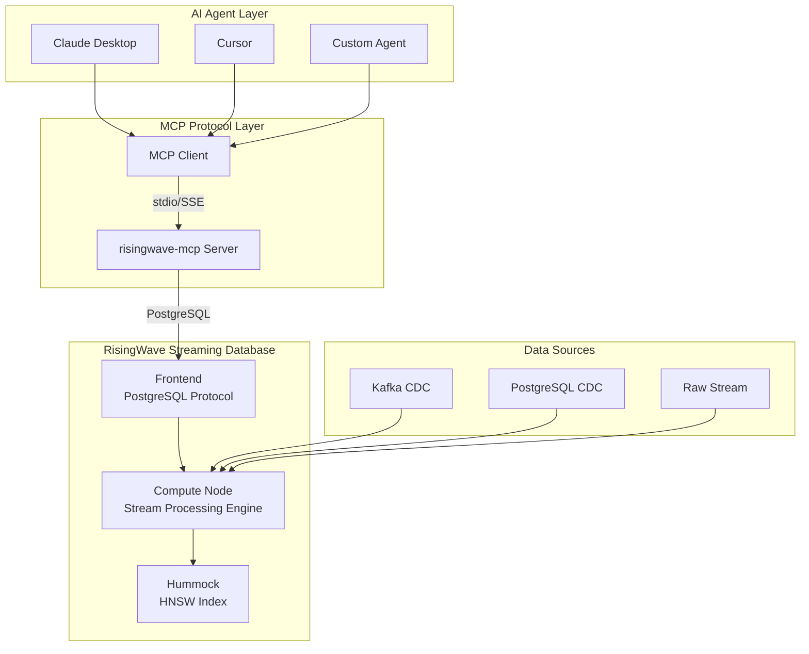

# RisingWave Official MCP Server Integration Guide: Real-Time Data Layer for AI Agents

> **Stage**: Knowledge/06-frontier | **Prerequisites**: [MCP Protocol Analysis](./mcp-protocol-agent-streaming.md), [RisingWave Vector Search](./risingwave-vector-search-2026.md) | **Formalization Level**: L3-L4
> **Status**: ✅ Published | **Last Updated**: 2026-04-21

---

## 1. Definitions

### Def-EN-06-20: RisingWave MCP Server

**Definition**: The RisingWave official MCP Server (`risingwavelabs/risingwave-mcp`) is a standardized interface based on the Model Context Protocol, enabling any MCP-compatible AI Agent to directly query real-time materialized views and streaming data in RisingWave:

$$
\mathcal{M}_{rw} = \langle \mathcal{C}, \mathcal{S}, \mathcal{Q}, \mathcal{V}, \mathcal{T} \rangle
$$

Where:

| Component | Symbol | Definition | Description |
|-----------|--------|------------|-------------|
| MCP Client | $\mathcal{C}$ | Any MCP-compatible Agent | Claude, Cursor, Custom Agent |
| MCP Server | $\mathcal{S}$ | `risingwave-mcp` | RisingWave official Server implementation |
| SQL Query | $\mathcal{Q}$ | $\text{SQL} \rightarrow \text{Result}$ | Executed via PostgreSQL protocol |
| Vector Search | $\mathcal{V}$ | $\mathbb{R}^d \times k \rightarrow \text{Top-K}$ | HNSW index real-time retrieval |
| Materialized View | $\mathcal{T}$ | $\text{Stream} \rightarrow \text{MV}$ | Incrementally maintained real-time view |

---

### Def-EN-06-21: Agent-Stream-DB Triad Model

**Definition**: AI Agent, streaming database, and MCP protocol form a new data access triad:

$$
\mathcal{A}_{stream} = \langle \text{Agent}, \text{MCP}, \text{RisingWave} \rangle
$$

**Traditional Architecture vs MCP-Stream Architecture**:

| Dimension | Traditional Architecture | MCP-Stream Architecture |
|-----------|-------------------------|------------------------|
| Data Access | REST API + SDK | MCP standard protocol |
| Real-time | Polling / Cache | Materialized view real-time push |
| Integration Cost | Custom per Agent | Plug-and-play |
| Query Capability | Predefined endpoints | Full SQL + Vector search |

---

## 2. Properties

### Lemma-EN-06-20: MCP Server Query Latency Bound

**Statement**: Query latency through RisingWave MCP Server satisfies:

$$
L_{mcp} = L_{protocol} + L_{sql} + L_{network}
$$

Where:

- $L_{protocol}$: MCP JSON-RPC serialization (~1ms)
- $L_{sql}$: RisingWave SQL execution (~10-100ms)
- $L_{network}$: Network round-trip (~1-10ms)

**Total Latency**: $L_{mcp} \approx 12-111ms$, meeting interactive Agent query requirements.

---

### Prop-EN-06-20: Code-Free Integration Proposition

**Proposition**: Any MCP-compatible AI Agent can access RisingWave data without custom code:

$$
\forall A \in \text{MCP-Compatible}: \text{connect}(A, \mathcal{M}_{rw}) \in O(1)
$$

**Engineering Significance**: Agent developers only need to configure the MCP Server address; no RisingWave client code is required.

---

## 3. Relations

### 3.1 RisingWave MCP vs Flink MCP Integration Comparison

| Dimension | RisingWave MCP | Flink MCP (Custom) |
|-----------|---------------|-------------------|
| Official Support | ✅ `risingwavelabs/risingwave-mcp` | ❌ Community-built |
| Query Interface | Native PostgreSQL | REST API / Queryable State |
| Vector Search | ✅ Built-in HNSW | ❌ External integration |
| Data Freshness | 1-second checkpoint | Checkpoint interval dependent |
| Deployment Complexity | Low (single binary) | High (Flink cluster) |
| MCP Tool Count | Auto-exposes all tables/MVs | Manual registration required |

### 3.2 Architecture Relationship Diagram

```
┌─────────────────────────────────────────────────────────────┐
│                    MCP Agent Ecosystem                        │
├─────────────────────────────────────────────────────────────┤
│                                                             │
│  ┌─────────────┐    MCP Protocol    ┌─────────────────────┐ │
│  │ Claude      │◄──────────────────►│ RisingWave MCP      │ │
│  │ Cursor      │    stdio/SSE       │ Server              │ │
│  │ Custom Agent│                    │  - list_tables()    │ │
│  └─────────────┘                    │  - query(sql)       │ │
│                                     │  - vector_search()  │ │
│                                     └──────────┬──────────┘ │
│                                                │            │
│                                     PostgreSQL Protocol     │
│                                                │            │
│                                     ┌──────────▼──────────┐ │
│                                     │   RisingWave        │ │
│                                     │  ┌───────────────┐  │ │
│                                     │  │ Materialized  │  │ │
│                                     │  │ Views + HNSW  │  │ │
│                                     │  └───────────────┘  │ │
│                                     └─────────────────────┘ │
│                                                             │
└─────────────────────────────────────────────────────────────┘
```

---

## 4. Argumentation

### 4.1 Why RisingWave + MCP is the Ideal Choice for Agent Data Layer?

**Real-time**: Agents need "current" data, not yesterday's snapshot. RisingWave's materialized views incrementally update at 1-second intervals.

**Simplicity**: PostgreSQL protocol means Agents can use standard SQL queries without learning new APIs.

**Vector-native**: Agents' RAG scenarios require vector search; RisingWave has built-in HNSW, eliminating the need for additional systems.

**MCP Standard**: Through the MCP Server, RisingWave automatically becomes an Agent's "tool," plug-and-play.

### 4.2 Complementary Relationship with Flink

RisingWave MCP Server is **not** a replacement for Flink, but a **complementary layer**:

- **Flink**: Complex stream processing (CEP, custom operators, DataStream API)
- **RisingWave + MCP**: Agent data service layer (simple queries, vector search, ad-hoc analytics)

**Typical Pipeline**:

$$
\text{Raw Data} \xrightarrow{\text{Flink}} \text{Processed Stream} \xrightarrow{\text{CDC}} \text{RisingWave} \xrightarrow{\text{MCP}} \text{AI Agent}
$$

---

## 5. Proof / Engineering Argument

### Thm-EN-06-20: MCP-Stream Architecture Agent Response Time Upper Bound

**Theorem**: In the RisingWave MCP Server architecture, the total time upper bound from Agent query initiation to result retrieval is:

$$
T_{total} \leq T_{mcp} + T_{pg} + T_{exec} + T_{return}
$$

Where:

- $T_{mcp} \leq 5ms$ (MCP protocol overhead)
- $T_{pg} \leq 2ms$ (PostgreSQL protocol parsing)
- $T_{exec} \leq 100ms$ (SQL execution, including HNSW retrieval)
- $T_{return} \leq 5ms$ (Result serialization)

$$
\therefore T_{total} \leq 112ms
$$

**Comparison with Alternatives**:

- Flink Queryable State: $T \approx 500ms-2s$ (state query latency)
- Traditional REST API + Database: $T \approx 200-500ms$
- Direct PostgreSQL connection: $T \approx 10-100ms$ (but no MCP standard)

---

## 6. Examples

### 6.1 MCP Server Configuration

```json
// claude_desktop_config.json
{
  "mcpServers": {
    "risingwave": {
      "command": "npx",
      "args": [
        "-y",
        "@risingwavelabs/risingwave-mcp",
        "--host", "localhost",
        "--port", "4566",
        "--database", "dev"
      ]
    }
  }
}
```

### 6.2 Agent Querying Real-Time Data

```python
# Agent queries RisingWave via MCP
async def get_realtime_insights():
    # MCP auto-discovers available tools
    tools = await mcp_client.list_tools()

    # Execute SQL query
    result = await mcp_client.call_tool(
        "query",
        {"sql": "SELECT * FROM realtime_sales_mv WHERE amount > 1000"}
    )

    # Vector search
    vectors = await mcp_client.call_tool(
        "vector_search",
        {
            "table": "doc_embeddings",
            "query_vector": embedding("user query"),
            "top_k": 5
        }
    )

    return result, vectors
```

### 6.3 Agent Data Preparation in RisingWave

```sql
-- Create real-time sales materialized view
CREATE MATERIALIZED VIEW realtime_sales_mv AS
SELECT
    product_id,
    SUM(amount) as total_amount,
    COUNT(*) as order_count,
    window_start
FROM TUMBLE(sales_stream, order_time, INTERVAL '1 MINUTE')
GROUP BY product_id, window_start;

-- Create document embedding table (for RAG)
CREATE TABLE doc_embeddings (
    doc_id INT PRIMARY KEY,
    content TEXT,
    embedding VECTOR(1536)
);

CREATE INDEX idx_doc_embedding ON doc_embeddings
USING HNSW (embedding);
```

---

## 7. Visualizations

### 7.1 RisingWave MCP Integration Architecture



---

## 8. References


---

*Document Version: v1.0 | Created: 2026-04-21 | Status: Active*
*Theorem Registry: Def-EN-06-20~21, Lemma-EN-06-20, Prop-EN-06-20, Thm-EN-06-20*
