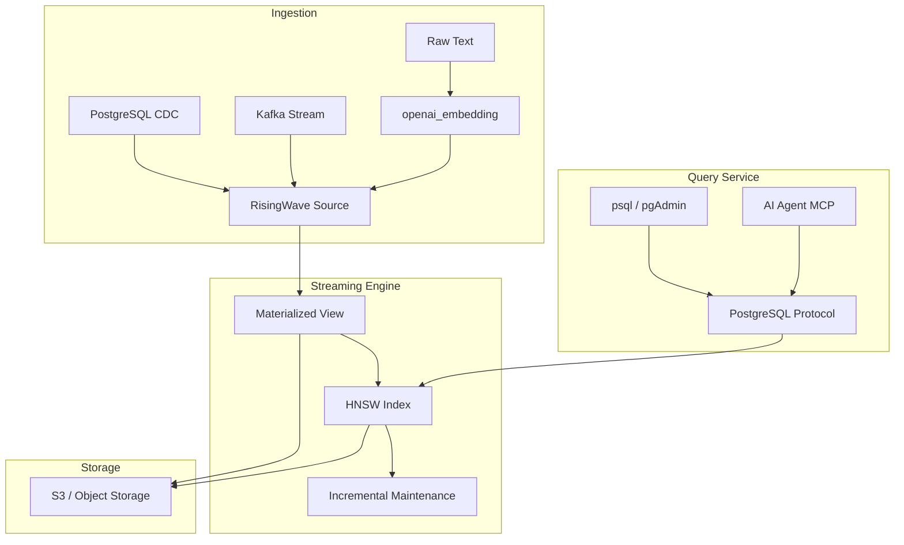

# RisingWave v2.6 Vector Search: Streaming Database meets AI

> **Stage**: Knowledge/06-frontier | **Prerequisites**: [RisingWave Deep Dive](../Knowledge/06-frontier/risingwave-deep-dive.md) | **Formal Level**: L3-L4
> **Version**: RisingWave v2.6+ | **Status**: ✅ Released | **Last Updated**: 2026-04-21

---

## 1. Definitions

### Def-EN-06-10: Streaming Database Vector Search

**Definition**: Streaming database vector search is the capability to perform real-time similarity retrieval on high-dimensional vector embeddings over continuously arriving data streams:

$$
\mathcal{V}_{stream} = \langle \mathcal{S}, \mathcal{E}, \mathcal{I}, \mathcal{Q}, \Delta, \tau \rangle
$$

| Component | Symbol | Description |
|-----------|--------|-------------|
| Data Stream | $\mathcal{S}$ | Infinite sequence of timestamped vectors |
| Embedding Function | $\mathcal{E}$ | Raw data to vector mapping |
| Index Structure | $\mathcal{I}$ | Vector set to graph index mapping |
| Query Interface | $\mathcal{Q}$ | Top-K similarity search |
| Incremental Update | $\Delta$ | Index incremental maintenance |
| Consistency Bound | $\tau$ | Max delay between query results and latest data |

---

### Def-EN-06-11: HNSW Streaming Index

**Definition**: RisingWave v2.6 adopts an incrementally maintained HNSW (Hierarchical Navigable Small World) index:

$$
\mathcal{H}_{hnsw}^{stream} = \langle G_0, G_1, ..., G_L, \mathcal{M}_{insert}, \mathcal{M}_{delete} \rangle
$$

**Key difference from batch HNSW**:

- Batch HNSW: $\mathcal{I} = \text{build}(S_{snapshot})$ — full rebuild
- Streaming HNSW: $\mathcal{I}_{t+1} = \Delta(\delta S_t, \mathcal{I}_t)$ — incremental update

---

## 2. Properties

### Lemma-EN-06-10: Streaming HNSW Query Correctness Bound

**Statement**: Query results at time $t$ satisfy:

$$
\text{results}(q, \mathcal{I}_t, k) \subseteq \text{results}(q, \mathcal{I}_{t_q}, k) \cup \epsilon_{stale}
$$

With RisingWave's 1-second checkpoint interval:

$$
|\epsilon_{stale}|_{max} = \lambda \cdot 1s
$$

---

## 3. Relations

### 3.1 RisingWave vs Flink VECTOR_SEARCH

| Dimension | RisingWave v2.6 | Flink 2.2 VECTOR_SEARCH |
|-----------|-----------------|------------------------|
| Architecture | Built-in storage + index | SQL TVF + external vector store |
| Index Type | HNSW (incremental) | Depends on external implementation |
| Embedding | `openai_embedding()` SQL function | External model service |
| Consistency | Snapshot (1s) | Checkpoint-based |
| Query Protocol | Native PostgreSQL | Flink SQL |
| CDC-driven Index | ✅ Native | ✅ Via CDC connector |

### 3.2 Three Generations of Vector Search Architecture

| Generation | Period | Architecture | Representative |
|------------|--------|--------------|--------------|
| Gen-1 | 2020-2022 | Specialized vector libraries | Faiss, Annoy |
| Gen-2 | 2022-2024 | Standalone vector databases | Pinecone, Weaviate |
| Gen-3 | 2024-2026 | Database-built-in vectors | RisingWave, pgvector |

---

## 4. Engineering Argument

### Why Stream Databases Need Built-in Vector Search

**2023 Architecture**: Stream processor + dedicated vector DB

- Data flows from Flink/Kafka to Pinecone/Weaviate
- Two systems, two consistency models
- Latency = stream processing + vector DB sync

**2026 Trend**: Database-built-in vectors become expectation

- Single system, single consistency model
- Single query interface
- Latency = stream processing only

---

## 5. Examples

### 5.1 Vector Column and HNSW Index

```sql
-- Create table with vector column
CREATE TABLE documents (
    id INT PRIMARY KEY,
    content TEXT,
    embedding VECTOR(1536)
);

-- Create HNSW index
CREATE INDEX idx_doc_embedding ON documents
USING HNSW (embedding)
WITH (ef_construction = 128, m = 16);

-- Real-time embedding computation
INSERT INTO documents (id, content, embedding)
SELECT id, content, openai_embedding(content, 'text-embedding-3-small')
FROM raw_documents;
```

### 5.2 Streaming RAG Query

```sql
-- Real-time vector similarity search
SELECT id, content,
       vector_similarity(embedding, openai_embedding('query text')) AS similarity
FROM documents
WHERE created_at > NOW() - INTERVAL '7 days'
ORDER BY similarity DESC
LIMIT 5;
```

---

## 6. Visualizations

### RisingWave Vector Search Architecture



---

## 7. References
