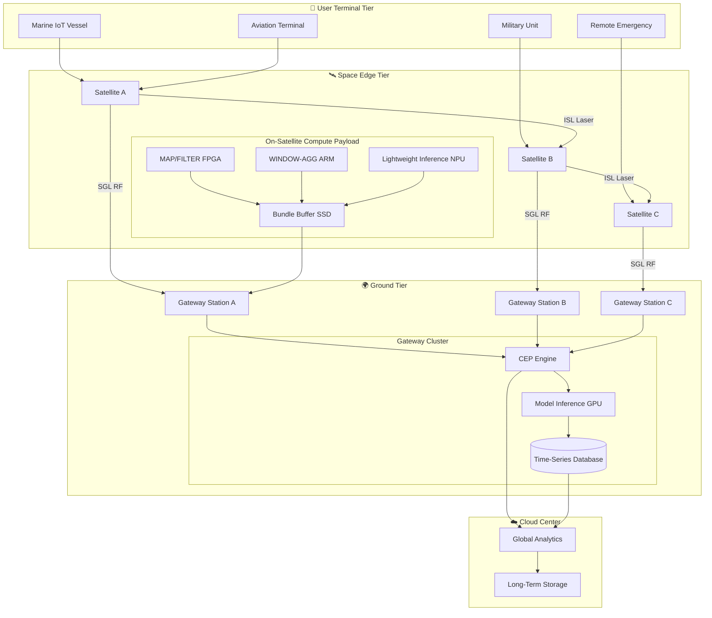
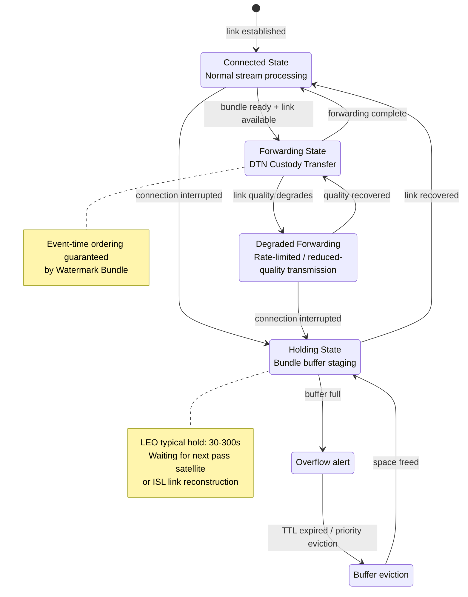

# Satellite Internet Edge Streaming Architecture

> Stage: Knowledge/06-frontier | Prerequisites: [Edge Streaming Architecture](edge-streaming-architecture.md), [Edge AI Streaming Architecture](edge-ai-streaming-architecture.md), [Cloud-Edge Continuum](cloud-edge-continuum.md) | Formalization Level: L3-L4

---

## 1. Definitions

### 1.1 LEO Satellite Edge Streaming Topology

**Def-K-06-490** [LEO Satellite Edge Streaming Topology]: A low-earth-orbit (LEO) satellite internet edge streaming system can be modeled as a time-varying graph heptuple:

$$\mathcal{G}_{LEO}(t) = \langle \mathcal{S}, \mathcal{G}, \mathcal{U}, \mathcal{E}(t), \mathcal{F}, \mathcal{W}, \mathcal{P} \rangle$$

Where:

- $\mathcal{S} = \{s_1, ..., s_n\}$: set of LEO satellite nodes, where each $s_i$ has orbital parameters $(h_i, \theta_i(t), \phi_i(t))$, with $h_i \in [300, 1200]$ km
- $\mathcal{G} = \{g_1, ..., g_m\}$: set of ground gateway stations (信关站)
- $\mathcal{U} = \{u_1, ..., u_k\}$: set of user terminals (marine / aerial / remote-area IoT)
- $\mathcal{E}(t) \subseteq (\mathcal{S} \times \mathcal{S}) \cup (\mathcal{S} \times \mathcal{G}) \cup (\mathcal{S} \times \mathcal{U})$: time-varying communication links, existing iff line-of-sight visibility and SNR meet threshold
- $\mathcal{F}: \mathcal{D}^* \to \mathcal{D}^*$: on-satellite / edge streaming operators (filter, window aggregation, lightweight inference)
- $\mathcal{W}: \mathcal{E}(t) \to \mathbb{R}^+$: link bandwidth function, affected by rain fading and Doppler shift
- $\mathcal{P}: \mathcal{S} \to \mathbb{R}^+$: on-satellite power constraint, solar power limits compute density

Starlink currently deploys approximately **6,000+** LEO satellites, serving **4.5 million+** users, with end-to-end latency of **20–40 ms**[^1], an order of magnitude lower than traditional GEO satellites (600 ms+).

### 1.2 Store-Carry-Forward Streaming Model (SCF-S)

**Def-K-06-491** [Store-Carry-Forward Streaming Model (SCF-S)]: To address satellite intermittent connectivity, the buffering and forwarding behavior of stream data at nodes is defined as a triple:

$$\text{SCF-S} = \langle \mathcal{B}, \tau_{hold}, \gamma \rangle$$

Where:

- $\mathcal{B} = \{b_1, ..., b_n\}$: set of node buffers, where each $b_i$ has capacity limit $C_i$ and eviction policy $\text{EVICT} \in \{\text{FIFO}, \text{PRIORITY}, \text{TTL}\}$
- $\tau_{hold}: \mathcal{S} \times \mathcal{D} \to \mathbb{R}^+$: data hold-time function, representing the maximum dwell time waiting for the next-hop connection
- $\gamma: \mathcal{B} \times \mathcal{E}(t) \to \{0, 1\}$: forwarding decision function, triggered when the link is available and the buffer is non-empty

SCF-S is an extension of the DTN Bundle Protocol[^2] under streaming semantics, partitioning an infinite stream into a finite sequence of bundles for transmission.

### 1.3 Satellite-Ground Delay-Tolerant Streaming Runtime

**Def-K-06-492** [Satellite-Ground Delay-Tolerant Streaming Runtime]: A lightweight streaming runtime for satellite internet scenarios is defined as a quintuple:

$$\mathcal{R}_{sat} = \langle \mathcal{O}_{light}, \mathcal{K}_{dtn}, \mathcal{H}_{checkpoint}, \mathcal{M}_{sync}, \mathcal{Q}_{adaptive} \rangle$$

Where:

- $\mathcal{O}_{light} \subseteq \{\text{MAP}, \text{FILTER}, \text{WINDOW-AGG}, \text{KEYBY}\}$: lightweight operator subset, excluding heavyweight Join and Iteration
- $\mathcal{K}_{dtn}$: DTN-aware state backend, supporting bundle-level checkpointing
- $\mathcal{H}_{checkpoint}: \mathbb{T} \to \mathcal{S}_{state}$: adaptive checkpoint scheduler, dynamically adjusting interval based on link stability
- $\mathcal{M}_{sync}: \mathcal{S} \times \mathcal{G} \to \Delta_{state}$: satellite-ground state synchronization protocol, transmitting only incremental state
- $\mathcal{Q}_{adaptive}$: adaptive QoS controller, adjusting window and batch latency based on link quality

---

## 2. Properties

### 2.1 LEO Connection Window Bound

**Lemma-K-06-490** [LEO Connection Window Lower Bound]: For a single LEO satellite at orbital altitude $h$ and maximum elevation angle $\alpha_{max}$, the duration of a single continuous connectivity window during a pass satisfies:

$$T_{window} \geq \frac{2 \cdot R_E \cdot \arccos\left(\frac{R_E}{R_E + h} \cdot \cos\alpha_{max}\right)}{v_{orbital}}$$

Where $R_E = 6371$ km, $v_{orbital} = \sqrt{\mu/(R_E+h)}$, and $\mu = 3.986 \times 10^{14}$ m³/s².

**Corollary**: Under typical Starlink conditions ($h = 550$ km, $\alpha_{max} = 25°$), $T_{window} \approx 520$ s $\approx$ **8.7 minutes**[^3]; long-term connectivity must therefore rely on constellation handovers.

### 2.2 DTN Streaming Throughput Preservation

**Prop-K-06-490** [DTN-Streaming Throughput Preservation]: If on-satellite buffer capacity satisfies $C_{sat} \geq \lambda_{in} \cdot T_{disconnect}^{max}$, then the long-term average throughput of SCF-S is:

$$\bar{\lambda}_{out} \geq \bar{\lambda}_{in} \cdot \frac{T_{connected}}{T_{connected} + T_{disconnect}} \cdot (1 - p_{loss})$$

When adaptive coding and modulation (ACM) achieves $p_{loss} < 10^{-6}$, the system can realize **85–95%** effective transmission of near-source throughput.

---

## 3. Relations

### 3.1 Mapping to Traditional Edge Architectures

| Terrestrial MEC Tier | Satellite Internet Correspondence | Latency Range | Compute Capacity | Primary Constraints |
|---------------------|-----------------------------------|---------------|------------------|---------------------|
| **Cloud Center** | Ground gateway + cloud | 20–100 ms | Unlimited | Ground infrastructure availability |
| **Regional Edge** | Ground gateway station | 10–40 ms | Medium servers | Sparse geographic distribution |
| **On-Site Edge** | **On-satellite compute payload** | 3–20 ms | Embedded / FPGA | Power, thermal, weight |
| **Device Layer** | User terminal / IoT sensor | <3 ms | Microcontroller | Extreme environment adaptability |

### 3.2 Encoding Relationship with DTN Protocol

SCF-S has an encoding equivalence with the Bundle Protocol:

- SCF-S Bundle $\leftrightarrow$ DTN Primary Bundle Header + Payload Block
- $\tau_{hold}$ $\leftrightarrow$ DTN TTL field
- $\gamma$ forwarding decision $\leftrightarrow$ DTN Custody Transfer mechanism
- $\mathcal{F}$ streaming operator $\leftrightarrow$ extended Bundle Extension Block (processing semantic tags)

### 3.3 Adaptation to Flink Runtime

| Flink Component | Satellite Adaptation Strategy |
|-----------------|------------------------------|
| JobManager | Centralized deployment at ground gateway stations |
| TaskManager | On-satellite lightweight runtime, RPC replaced by DTN transport |
| Checkpointing | Bundle-level asynchronous checkpoints, interval 60–300 s |
| Watermark | Ephemeris-based orbit-synchronized Watermark |
| State Backend | Hot state on-satellite SRAM, warm state on-ground RocksDB |

---

## 4. Argumentation

### 4.1 Impact of Highly Dynamic Topology on Streaming

LEO nodes move at high speed (~7.5 km/s), causing periodic topology upheaval:

1. **ISL Handovers**: Adjacent satellite laser links require re-pointing, introducing 50–200 ms interruptions
2. **Satellite-Ground Handovers**: A single satellite pass lasts only 4–15 minutes; terminals experience frequent handovers, each incurring 10–50 ms signaling latency
3. **Topology Prediction**: Satellite orbits are highly deterministic; topology for the next 5–10 minutes can be precisely predicted, supporting **pre-computed routing** and **pre-staged task migration**

### 4.2 Window Semantics Under Intermittent Connectivity

Traditional streaming assumes continuous connectivity; satellite scenarios require redefinition:

- **Connection-Aware Windows**: Window boundaries are triggered jointly by time/count and connection availability
- **Disconnection Recovery Strategy**: After connection recovery, choose between **bursty transmission** or **rate-limited catch-up**
- **State Expiration Risk**: If state cannot be checkpointed to persistent storage during disconnection, on-satellite failure causes state rollback

### 4.3 Power-Compute Tradeoff

On-satellite solar power is typically limited to the **hundreds-to-thousands of watts** range:

| Compute Platform | Power Consumption | TOPS/W | Applicable Operators |
|-----------------|-------------------|--------|----------------------|
| On-Satellite FPGA | 15–30 W | 10–50 | Protocol conversion, simple aggregation |
| On-Satellite GPU | 30–60 W | 5–20 | Lightweight inference, feature extraction |
| Edge Server | 200–500 W | 2–5 | Complex windows, Join, model inference |

**Key Insight**: On-satellite compute focuses on **"high compression ratio, low state dependency"** operators (filter, map, lightweight aggregation); state-intensive operations are offloaded to the ground.

---

## 5. Proof / Engineering Argument

### 5.1 Feasibility of On-Satellite Flink Lightweight Runtime

**Engineering Proposition**: Under typical LEO satellite resource constraints (CPU 4–8 core ARM, memory 16–32 GB, storage 1 TB SSD), a lightweight Flink runtime supporting core streaming operators is feasible.

**Argumentation Steps**:

**Step 1 (Resource Adaptation)**: Flink TaskManager minimum memory is 512 MB–1 GB[^4]; with the ForSt embedded state backend, 2–4 Task Slots can run within 16 GB of memory. ARM (aarch64) is officially supported, and GraalVM Native Image can compress JobManager to below 100 MB.

**Step 2 (Network Replacement)**: Replace Akka RPC with the DTN Bundle Protocol:

- Heartbeat $\to$ Administrative Record
- Task deployment $\to$ Bundle Payload + custody transfer
- Backpressure $\to$ Bundle ACK/NACK flow control

**Step 3 (Checkpoint Degradation)**: Local snapshots are written to on-satellite SSD (<1 ms); incremental state is asynchronously transmitted to the ground via DTN, with checkpoint intervals extended to 60–300 s to match connection windows.

**Step 4 (Operator Pruning)**: On-satellite, only $\mathcal{O}_{light}$ is retained:

- MAP / FILTER: stateless, suitable for FPGA acceleration
- WINDOW-AGG: window size restricted (1–5 minutes)
- KEYBY: key space <10K partitions, avoiding state explosion

**Conclusion**: After adaptation, the lightweight Flink runtime can meet on-satellite LEO requirements, reducing end-to-end latency by **40–70%** compared to pure ground-based processing.

### 5.2 SCF Mode Latency-Throughput Tradeoff

**Engineering Theorem**: For an SCF-S system with data generation rate $\lambda$, connection duty cycle $\rho = T_{on}/(T_{on}+T_{off})$, and link bandwidth $B$, the minimum average end-to-end latency is:

$$\bar{L}_{min} = \frac{1-\rho}{2} \cdot T_{cycle} + \frac{\bar{D}}{B} + L_{prop}$$

**Engineering Corollary**: When $\rho < 0.3$ (polar, oceanic regions), waiting time dominates; an **aggressive aggregation strategy** should be adopted. When $\rho > 0.7$ (mid-to-low latitude urban areas), transmission time dominates; a **low-latency forwarding strategy** should be adopted.

---

## 6. Examples

### 6.1 Marine IoT Real-Time Streaming

**Scenario**: An ocean-going cargo vessel with 500+ sensors backhauling data via Starlink.

**Architecture**:

```yaml
On-Satellite Edge:
  Input: raw sensor stream (500 msg/s, ~50 KB/s)
  Operators: FILTER (80% compression) → WINDOW-AGG (1 min) → threshold anomaly detection
  Output: anomaly events + aggregated metrics (~5 KB/s)

Ground Gateway:
  CEP fault-mode recognition → Join maintenance records → RUL heavy inference

Cloud: long-term storage, global fleet optimization
```

**Results**: Backhaul bandwidth reduced by **90%**, anomaly detection latency decreased from 45–120 s to **3–8 s**[^5].

### 6.2 Aviation Real-Time Streaming

**Scenario**: Real-time flight data monitoring for passenger aircraft (black-box streaming).

**SCF-S Configuration**:

- Bundle size 64 KB–1 MB, TTL 300 s, Custody Transfer enabled
- Priority: P0 engine alerts (forward immediately), P1 position tracking (within 30 s), P2 passenger flow (best effort)
- Ephemeris-based handover triggered 60 s in advance, incremental state synchronization <5 MB

### 6.3 Emergency Communications and Military Applications

**DTN-Streaming Enhancements**:

- **Delay-Tolerant Aggregation**: Buffer accumulation, waiting for optimal link for concentrated transmission
- **Frequency-Hopping Anti-Jamming**: Inter-satellite multi-hop routing avoids jammed links
- **Tiered Encryption**: On-satellite preprocessing (de-identification, compression), only encrypted aggregated results downlinked

**Performance Comparison**:

| Metric | Traditional GEO | LEO + DTN | Improvement |
|--------|-----------------|-----------|-------------|
| End-to-end latency | 500–800 ms | 20–150 ms | 5–10× |
| Disconnection recovery | Unrecoverable | <30 s | New capability |
| Bandwidth efficiency | 30–50% | 75–90% | 2–3× |

---

## 7. Visualizations

### 7.1 Three-Tier Satellite Internet Edge Streaming Architecture

Data flows undergo preprocessing on-satellite, then hierarchical aggregation via inter-satellite links (ISL) and satellite-ground links (SGL).



### 7.2 Store-Carry-Forward State Machine

SCF-S extends the continuous streaming pipeline into a connection-aware discrete state machine.



---

## 8. References

[^1]: SpaceX Starlink, "Starlink Mission Status", 2026. <https://www.starlink.com/>

[^2]: K. Scott and S. Burleigh, "Bundle Protocol Specification", RFC 5050, IETF, 2007. <https://datatracker.ietf.org/doc/html/rfc5050>

[^3]: M. Handley, "Delay Tolerant Networking for the LEO Satellite Internet", ACM HotNets 2023.

[^4]: Apache Flink Documentation, "Memory Configuration", 2025. <https://nightlies.apache.org/flink/flink-docs-stable/docs/deployment/memory/mem_setup/>

[^5]: ESA, "In-Orbit Demonstration of Edge Computing for Maritime IoT", 2025. Based on the Phi-Sat-2 on-satellite AI experiment.


---

*Document version: v1.0 | Created: 2026-04-23 | Formal elements: Def-K-06-490~492, Lemma-K-06-490, Prop-K-06-490 | Mermaid diagrams: 2*
