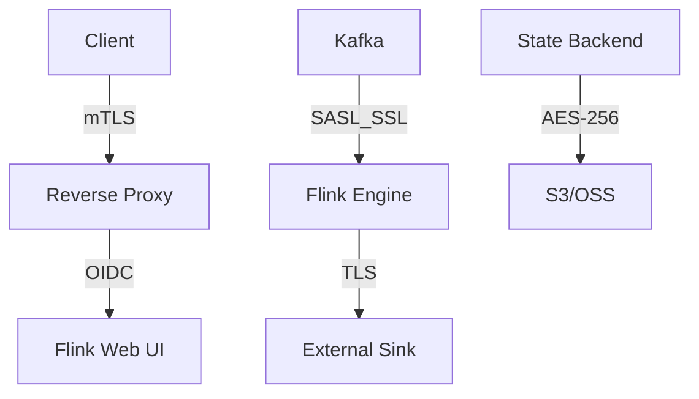

# Security Hardening Guide for Stream Processing

> **Stage**: Knowledge/07-best-practices | **Prerequisites**: [Streaming Security](../Knowledge/06-frontier/streaming-security-compliance.md) | **Formal Level**: L3
>
> Comprehensive security hardening strategies for Flink streaming systems covering authentication, authorization, encryption, and auditing.

---

## 1. Definitions

**Def-K-07-05: Stream Processing Security Hardening**

The process of configuring security controls, implementing best practices, and maintaining continuous monitoring to protect stream processing systems from unauthorized access, data breaches, and service disruption threats.

**Threat Model**:

- Data security threats: eavesdropping, tampering, exfiltration
- Infrastructure threats: unauthorized access, DDoS, privilege escalation
- Operational threats: misconfiguration, insider threats, audit gaps

---

## 2. Properties

**Prop-K-07-07: Defense in Depth**

Layered security controls ensure that compromise of any single layer does not lead to system-wide breach.

**Prop-K-07-08: Zero Trust Principle**

No implicit trust based on network location; every access request is authenticated and authorized regardless of origin.

---

## 3. Relations

- **with Compliance**: Maps to SOC 2, GDPR, HIPAA audit requirements.
- **with Kubernetes Security**: Integrates with RBAC, NetworkPolicy, Pod Security Standards.

---

## 4. Argumentation

**Zero Trust Architecture**: In distributed stream processing, data flows across multiple nodes and networks. Traditional perimeter security is insufficient; each component must verify every peer.

**Encryption Necessity**: Data in transit between Kafka → Flink → Sink crosses multiple network boundaries. TLS 1.3 provides both confidentiality and integrity guarantees.

---

## 5. Engineering Argument

**Authentication Configuration**:

```yaml
# Flink Kerberos authentication
security.kerberos.login.keytab: /etc/flink.keytab
security.kerberos.login.principal: flink@EXAMPLE.COM
```

**Authorization**: Flink 1.18+ supports fine-grained Web UI RBAC via configurable security filters.

**Data Encryption**:

- In-transit: TLS 1.3 for all network channels
- At-rest: AES-256 for state backend snapshots on S3/OSS

**Audit Logging**: All admin operations logged to immutable audit trail (e.g., Apache Ranger).

---

## 6. Examples

**Security Checklist**:

- [ ] Kerberos/SASL enabled for Kafka connector
- [ ] TLS 1.3 for RPC and REST endpoints
- [ ] Web UI behind reverse proxy with OIDC
- [ ] State snapshots encrypted at rest
- [ ] Audit logs forwarded to SIEM

---

## 7. Visualizations

**Security Architecture**:



---

## 8. References
