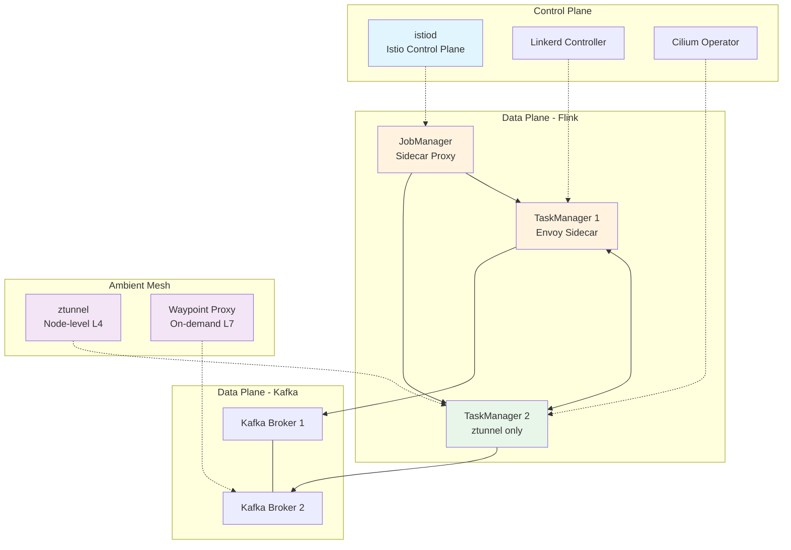
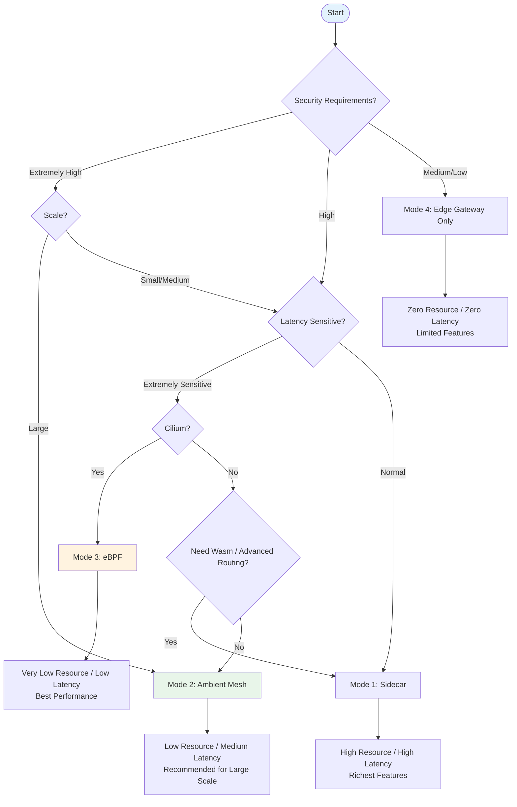
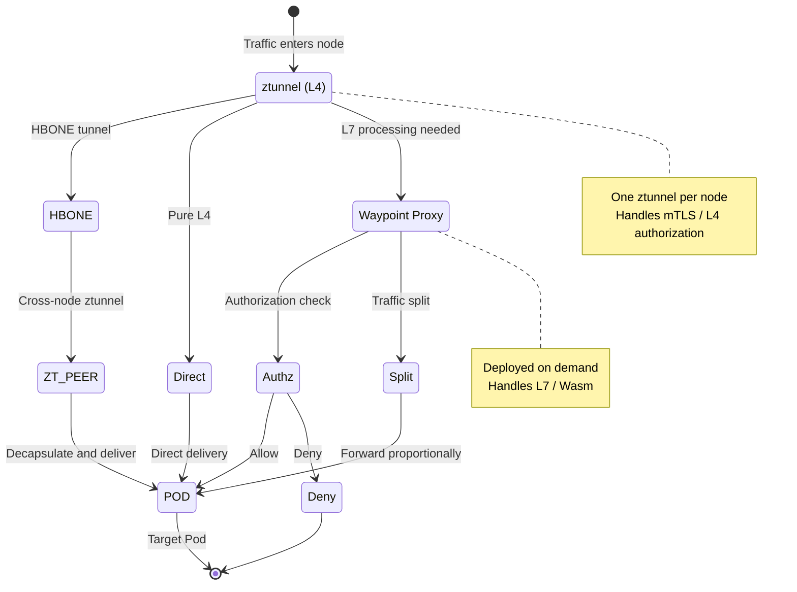

# Service Mesh and Stream Processing Integration Architecture Guide

> **Stage**: Knowledge | **Prerequisites**: [Flink/04-runtime/flink-on-kubernetes.md](../Flink/04-runtime/flink-on-kubernetes.md), [Knowledge/04-technology-selection/engine-selection-guide.md](../Knowledge/04-technology-selection/engine-selection-guide.md) | **Formalization Level**: L3-L4

## 1. Definitions

### Def-K-SM-01: Service Mesh

A Service Mesh is an **infrastructure layer** that decouples service-to-service communication capabilities (connectivity, security, traffic control, and observability) from applications,下沉 them into independent proxy components.

**Formal description**: Let a distributed system be a graph $\mathcal{S} = (V, E)$. Introducing a proxy layer $P$ reconstructs communication as:

$$\forall (u, v) \in E: \quad u \xrightarrow{p_u} p_v \xrightarrow{} v$$

where $p_u, p_v \in P$ are proxies attached to service instances, forming a **logically centralized control, physically distributed execution** architecture.

| Capability Domain | Function | Stream Processing Scenario |
|--------|------|-----------|
| Traffic Management | Routing, load balancing, circuit breaking | Inter-TaskManager load balancing |
| Secure Communication | mTLS, authentication, authorization | Cross-Pod data plane encryption |
| Observability | Metrics, logs, distributed tracing | Stream processing pipeline tracing |
| Policy Enforcement | Access control, quotas, rate limiting | Kafka topic-level rate limiting |

---

### Def-K-SM-02: Sidecar Proxy Pattern

Sidecar is the classic deployment mode of Service Mesh. Each Pod runs an independent proxy container that shares the network namespace with the application container, intercepting all ingress and egress traffic.

**Formalization**: Let Pod$_i = (C_{app}^{(i)}, C_{proxy}^{(i)})$, where the two share the Network Namespace, and traffic is redirected via iptables/eBPF:

$$\forall pkt \in Traffic(C_{app}^{(i)}): \quad pkt \text{ is redirected to } C_{proxy}^{(i)}$$

**Resource overhead**[^1][^2]:

- **Istio (Envoy)**: 50-100 MB per Pod, P99 latency +2-5 ms
- **Linkerd (linkerd2-proxy)**: 10-20 MB per Pod, P99 latency +0.5-1 ms

---

### Def-K-SM-03: Ambient Mesh Mode

Ambient Mesh is a **sidecar-free** mode proposed by Istio, separating the data plane into a node-level L4 proxy (ztunnel) and an on-demand L7 proxy (Waypoint Proxy).

**Deployment model**:

- **ztunnel**: one per node, responsible for L4 interception, mTLS, and basic routing
- **Waypoint Proxy**: deployed on-demand per service, responsible for L7 policies (traffic splitting, authorization)

**Resource comparison**[^3] (100-Pod cluster):

- **Sidecar**: $100 \times 50\text{MB} = 5\text{GB}$ to $10\text{GB}$
- **Ambient**: $k \times ztunnel + |S_{L7}| \times wp \approx 200\text{MB}$ to $500\text{MB}$

---

### Def-K-SM-04: eBPF Data Plane Offload

eBPF data plane offloading processes network traffic directly through kernel-programmable technology, without requiring user-space proxies to participate in the data path.

**Latency model**: Let the sidecar data path latency be $L_{sidecar} = L_{kernel} + L_{iptables} + L_{userspace} + L_{network}$. After eBPF offloading:

$$L_{ebpf} = L_{kernel} + L_{ebpf\_hook} + L_{network}$$

where $L_{ebpf\_hook} \ll L_{userspace}$.

**Capability matrix**[^4]:

| Capability | eBPF Native | Requires Envoy |
|------|----------|-------------|
| L3/L4 Policy | ✅ Kernel space | — |
| Network Observability | ✅ kprobe/tracepoint | — |
| mTLS | Partial | ✅ Full |
| L7 Routing/Retry | Limited | ✅ Full |
| Wasm Extension | ❌ | ✅ Full |

---

## 2. Properties

### Prop-K-SM-01: Sidecar Resource Overhead Lower Bound

**Proposition**: In a cluster of $n$ Pods, the minimum additional memory overhead of Sidecar mode satisfies:

$$M_{total} \geq n \cdot m_{min}$$

where $m_{min}$ is the minimum memory per proxy (approximately 50MB for Envoy, approximately 10MB for linkerd2-proxy).

**Proof**: By Def-K-SM-02, each Pod runs at least one proxy; hence $M_{total} = \sum_{i=1}^{n} m_i \geq n \cdot m_{min}$.

**Engineering corollary**: 100 TaskManagers × 50MB = 5GB additional memory, approximately 10-20% of total cluster memory.

---

### Lemma-K-SM-01: Latency-Security Trade-off Lemma

**Lemma**: The latency increment $\Delta L$ introduced by Service Mesh and the security capability strength $S$ satisfy a monotonic relationship:

$$S_1 < S_2 \Rightarrow \Delta L(S_1) \leq \Delta L(S_2)$$

**Proof sketch**: Ordered by security strength, the number and depth of processing nodes on the data path increase monotonically:

| Security Level | Solution | P99 Latency Increment |
|----------|------|-------------|
| No Encryption | Direct | 0 ms |
| Edge mTLS | Gateway only | ~0 ms (internal) |
| eBPF L4 | Kernel-space mTLS | 0.1-0.5 ms |
| Ambient L4 | ztunnel user space | 0.5-2 ms |
| Ambient L4+L7 | +Waypoint | 1-3 ms |
| Sidecar L7+mTLS | Double proxy per hop | 2-5 ms (Istio) / 0.5-1 ms (Linkerd) |

Stronger security requires deeper protocol stack processing or more proxy hops; latency increment is monotonically non-decreasing.

---

### Prop-K-SM-02: Ambient Mesh Memory Reduction Ratio

**Proposition**: After switching from Sidecar to Ambient, the memory reduction ratio $R$ for a 100-Pod cluster satisfies:

$$R = 1 - \frac{M_{ambient}}{M_{sidecar}} \in [90\%, 95\%]$$

**Derivation**: $M_{sidecar} \in [5\text{GB}, 10\text{GB}]$, $M_{ambient} \in [200\text{MB}, 500\text{MB}]$; hence $R \geq 1 - 500\text{MB}/5\text{GB} = 90\%$[^3].

---

## 3. Relations

### 3.1 Mapping to Stream Processing Systems

| Service Mesh Concept | Stream Processing Mapping | Typical Interaction |
|-------------------|-----------|---------|
| Service | Operator / Job | JobManager as service entry |
| Service Instance | TaskManager Pod | Sidecar proxies TM-to-TM communication |
| Virtual Service | Data stream routing rules | Kafka Partition consumption routing |
| Destination Rule | Connection pool / load balancing policy | Inter-TM Subtask communication policy |
| Peer Authentication | Data plane transport security | TM-to-TM mTLS |
| Authorization Policy | Fine-grained access control | Restrict cross-Namespace job communication |

Let the stream processing topology be $G = (O, C)$. The Service Mesh control plane configures proxy rules $Rule(o_i, o_j) = (route_{ij}, mTLS_{ij}, retry_{ij}, timeout_{ij})$ for each pair of communicating operators $(o_i, o_j) \in C$.

### 3.2 Integration Relationship with Flink

Impact of Flink communication patterns on Service Mesh:

| Communication Pattern | Sidecar Impact | Optimization Strategy |
|----------|------------|----------|
| JM-TM Control | Low (low frequency) | Keep default proxy |
| TM-TM Data Exchange | **High** (high frequency, large throughput) | Exempt same-node communication, enable eBPF |
| TM-External Kafka | Medium | Connection pool tuning |

**Key insight**: Flink TM-TM data exchange is extremely latency-sensitive; the per-hop 2-5ms latency of Sidecar may be amplified during backpressure propagation.

### 3.3 Adaptation for Kafka Communication

Service Mesh integration with Kafka requires handling **long-lived connection protocols** and **stateful consumer groups**[^5]: Kafka is based on TCP long-lived connections; proxies should not interrupt connections during consumer group rebalancing, and Partition-level load balancing differs semantically from Service Mesh service-level load balancing. **Adaptation strategy**: use `DestinationRule` to disable Kafka broker mTLS, and configure `ConnectionPool` to match long-lived connections.

---

## 4. Argumentation

### 4.1 Istio vs Linkerd Architecture Differences

| Dimension | Istio | Linkerd |
|------|-------|---------|
| Data Plane | Envoy (C++) | linkerd2-proxy (Rust) |
| Control Plane | istiod (Go) | controller (Go) |
| Deployment Mode | Sidecar / Ambient | Sidecar |
| Memory per Pod | 50-100 MB | 10-20 MB |
| P99 Latency | +2-5 ms | +0.5-1 ms |
| Feature Richness | Very high (Wasm, multi-cluster) | Medium (core well-built) |
| Installation Complexity | High | Low |

**Selection advice**:

- **Choose Istio**: Ambient Mesh is needed for memory reduction, Wasm extensions, or unified multi-cluster traffic management
- **Choose Linkerd**: Extreme latency sensitivity, medium cluster scale, or limited operations capacity[^2]

### 4.2 Multi-Cluster Communication Models

**Istio**: Single / multi control plane + Gateway interconnection, providing a global traffic view, suitable for hybrid cloud[^1].

**Linkerd**: Service mirror model, automatically mirroring remote services locally, suitable for lightweight disaster recovery[^6].

### 4.3 Boundary Discussion

**High applicability**: multi-tenant Flink clusters, financial-grade mTLS compliance, Kafka Streams microservices, canary deployment of streaming jobs. **Low applicability**: small-scale single-tenant (<20 TMs), extreme latency (<10ms), existing VPC+IPSec. **Anti-pattern warning**: forcing L7 traffic splitting or retries on the TM-TM data channel may cause backpressure distortion, checkpoint timeouts, or even state inconsistency.

---

## 5. Engineering Argument

### 5.1 Integration Mode Selection Argument

**Mode 1: Sidecar Proxy**

- **Condition**: $Security = \text{High} \land Scale < 50 \land Latency\_SLA > 50\text{ms}$
- **Configuration**: Disable TM-TM L7 processing (retain only L4 mTLS), increase connection pool limits

**Mode 2: Ambient Mesh**

- **Condition**: $Scale \geq 100 \land M_{budget} < 1\text{GB} \land L7\_Need \leq \text{Medium}$
- **Configuration**: Bind TM services to Waypoint Proxy for L7 observability, selectively bind Kafka

**Mode 3: eBPF (Cilium)**

- **Condition**: $\Delta L_{max} < 1\text{ms} \land CNI = \text{Cilium} \land L7\_Need = \text{Low}$
- **Configuration**: `CiliumNetworkPolicy` replaces Istio authorization policies, Hubble enables flow-level observability

**Mode 4: Edge Gateway mTLS Only**

- **Condition**: $Network_{internal} = \text{Trusted} \land Throughput_{max} = \text{Priority}$
- **Configuration**: Ingress Gateway handles external access, internal pure TCP maximizes throughput

### 5.2 Performance-Security-Complexity Three-Way Trade-off

| Mode | Security | P99 Latency | Memory / 100 Pods | Operations Complexity | Recommended Scenario |
|------|------|---------|-------------|------------|----------|
| Sidecar | ★★★★★ | +2-5 ms | 5-10 GB | High | Finance, compliance |
| Ambient | ★★★★☆ | +0.5-2 ms | 0.2-0.5 GB | Medium | Large-scale general |
| eBPF | ★★★☆☆ | +0.1-0.5 ms | 0.05-0.2 GB | Medium-High | Performance-first |
| Edge Gateway | ★★☆☆☆ | ~0 ms | ~0 GB | Low | Internal trusted network |

**Selection formula**:
$$Score(mode) = w_1 \cdot S(mode) + w_2 \cdot \frac{1}{\Delta L(mode)} + w_3 \cdot \frac{1}{M(mode)} + w_4 \cdot \frac{1}{Ops(mode)}$$

---

## 6. Examples

### 6.1 Istio + Flink Sidecar Mode Configuration

Financial-grade Flink real-time risk control cluster with mandatory mTLS:

```yaml
apiVersion: security.istio.io/v1beta1
kind: PeerAuthentication
metadata:
  name: flink-mtls-strict
  namespace: flink-risk
spec:
  mtls:
    mode: STRICT
---
apiVersion: networking.istio.io/v1beta1
kind: DestinationRule
metadata:
  name: flink-tm-connections
  namespace: flink-risk
spec:
  host: "*.flink-risk.svc.cluster.local"
  trafficPolicy:
    connectionPool:
      tcp:
        maxConnections: 500
        connectTimeout: 30ms
---
apiVersion: security.istio.io/v1beta1
kind: AuthorizationPolicy
metadata:
  name: flink-tm-policy
  namespace: flink-risk
spec:
  selector:
    matchLabels:
      app: flink-taskmanager
  action: ALLOW
  rules:
    - from:
        - source:
            principals: ["cluster.local/ns/flink-risk/sa/flink-jobmanager"]
      to:
        - operation:
            ports: ["6122", "6121"]
```

### 6.2 Ambient Mesh + Kafka Production Deployment

100-Pod log stream processing cluster with Ambient enabled:

```yaml
apiVersion: v1
kind: Namespace
metadata:
  name: streaming-platform
  labels:
    istio.io/dataplane-mode: ambient
---
apiVersion: gateway.networking.k8s.io/v1beta1
kind: Gateway
metadata:
  name: kafka-waypoint
  namespace: streaming-platform
  annotations:
    istio.io/for-service-account: kafka-sa
spec:
  gatewayClassName: istio-waypoint
  listeners:
    - name: kafka
      port: 9092
      protocol: TCP
```

**Resource comparison**: Sidecar proxy memory ~7.5GB → Ambient ~350MB (95% reduction), P99 TM-TM latency +3.2ms → +1.1ms (66% reduction).

### 6.3 Cilium eBPF Mode Stream Processing Cluster

Telecom 5G signaling stream processing, latency requirement <20ms:

```yaml
apiVersion: cilium.io/v2
kind: CiliumNetworkPolicy
metadata:
  name: flink-5g-policy
  namespace: telco-streaming
spec:
  endpointSelector:
    matchLabels:
      app: flink-taskmanager
  ingress:
    - fromEndpoints:
        - matchLabels:
            app: flink-jobmanager
      toPorts:
        - ports:
            - port: "6122"
              protocol: TCP
  egress:
    - toEndpoints:
        - matchLabels:
            k8s:io.kubernetes.pod.namespace: kafka
      toPorts:
        - ports:
            - port: "9092"
              protocol: TCP
```

**Performance benchmark**: Bare-metal throughput 2.5M records/s → Cilium eBPF 2.35M (6% reduction) → Istio Sidecar 1.8M (28% reduction)[^4].

---

## 7. Visualizations

### 7.1 Service Mesh and Stream Processing Integration Architecture Overview



**Note**: Three modes coexist—TM1 uses Sidecar, TM2 uses Ambient ztunnel, and Kafka binds to Waypoint Proxy on demand.

### 7.2 Four Integration Modes Comparison Decision Tree



### 7.3 Istio Ambient Mesh Data Plane Architecture



**Note**: Pure L4 (e.g., TM-TM mTLS) is handled in ztunnel; when L7 is needed, traffic is redirected to Waypoint Proxy.

---

## 8. References

[^1]: Istio Project, "Istio Performance and Scalability", 2025. <https://istio.io/latest/docs/ops/deployment/performance-and-scalability/>

[^2]: Linkerd Project, "Linkerd Performance Benchmarks", 2025. <https://linkerd.io/2023/05/23/linkerd-benchmarks/>

[^3]: Istio Project, "Introducing Ambient Mesh", 2022. <https://istio.io/latest/blog/2022/introducing-ambient-mesh/>

[^4]: Cilium Project, "Cilium Service Mesh", 2025. <https://docs.cilium.io/en/stable/network/servicemesh/>

[^5]: Confluent, "Running Kafka with Istio Service Mesh", 2024. <https://docs.confluent.io/platform/current/kafka-rest/concepts/istio.html>

[^6]: Buoyant, "Linkerd Multicluster", 2025. <https://linkerd.io/2.15/features/multicluster/>


---

*Document Version: v1.0 | Created: 2026-04-23 | Status: Production*
