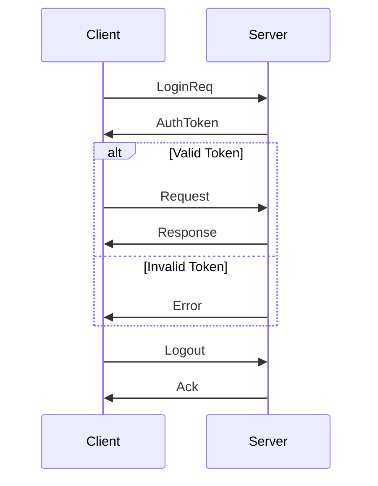

# Session Types

> **Stage**: Struct/01-foundation | **Prerequisites**: [CSP Formalization](csp-formalization.md), [Actor Model Formalization](actor-model-formalization.md) | **Formalization Level**: L4-L5
> **Translation Date**: 2026-04-21

## Abstract

**Session Types**, introduced by Kohei Honda in 1993, provide a type-theoretic framework for describing structured communication protocols. They ensure that communicating processes adhere to consistent protocols, preventing protocol violations and deadlocks through static type checking.

---

## 1. Definitions

### 1.1 Binary Session Type Syntax

Let $T$ be a value type. A session type $S$ is defined by the following grammar:

$$S ::= !T.S \mid ?T.S \mid \oplus\{l_1: S_1, \ldots, l_n: S_n\} \mid \&\{l_1: S_1, \ldots, l_n: S_n\} \mid \text{end}$$

where:

- $!T.S$: **send** a value of type $T$, then continue as $S$
- $?T.S$: **receive** a value of type $T$, then continue as $S$
- $\oplus\{l_i: S_i\}$: **internal choice** (select one label $l_i$)
- $\&\{l_i: S_i\}$: **external choice** (offer a set of labeled branches)
- $\text{end}$: session termination

### 1.2 Duality

The **dual** of a session type $S$, written $\overline{S}$, is defined inductively:

$$\overline{!T.S} = ?T.\overline{S}$$
$$\overline{?T.S} = !T.\overline{S}$$
$$\overline{\oplus\{l_i: S_i\}} = \&\{l_i: \overline{S_i}\}$$
$$\overline{\&\{l_i: S_i\}} = \oplus\{l_i: \overline{S_i}\}$$
$$\overline{\text{end}} = \text{end}$$

**Key property**: Communication is well-typed iff the two endpoints have dual types.

### 1.3 Multiparty Session Types

For $n$ participants, a **global type** $G$ describes the protocol from a global perspective:

$$G ::= p \to q: \langle T \rangle.G \mid p \to q: \{l_i: G_i\}_{i \in I} \mid \mu t.G \mid t \mid \text{end}$$

where $p \to q$ denotes communication from participant $p$ to participant $q$.

Each participant $r$ projects $G$ to a **local type** $G|_r$.

### 1.4 Session-Process Encoding

Session types can be embedded into the $\pi$-calculus:

$$[!T.S] = \overline{c}\langle x \rangle.[S] \quad (x: T)$$
$$[?T.S] = c(x).[S]$$

---

## 2. Properties

### 2.1 Linear Channel Usage

Channels in session types are **linear**: each endpoint must be used exactly once (no duplication, no dropping).

$$\frac{\Gamma \vdash P :: S \quad \Gamma' \vdash Q :: \overline{S}}{\Gamma, \Gamma' \vdash P \mid Q :: \text{ok}}$$

### 2.2 Subtyping

Session types admit a **subtyping** relation $S \leq T$:

- **Width subtyping**: $\oplus\{l_1: S_1, l_2: S_2\} \leq \oplus\{l_1: S_1\}$ (offer fewer choices)
- **Depth subtyping**: If $S_i \leq T_i$ for all $i$, then $\oplus\{l_i: S_i\} \leq \oplus\{l_i: T_i\}$

Subtyping preserves type safety through the standard substitution principle.

---

## 3. Relations

### 3.1 Relation to Process Calculi

Session types are a **disciplined fragment** of the $\pi$-calculus. The type system restricts channel usage to well-structured protocols, trading expressiveness for static guarantees.

### 3.2 Relation to Stream Processing

Stream processing pipelines can be modeled as session types:

- **Source** $\to$ **Transform**: $?T.!T'$
- **Join**: $?T_1.?T_2.!T_{\text{out}}$
- **Window aggregation**: $?T^*.!T_{\text{agg}}$

### 3.3 Extension Hierarchy

| Extension | Feature | Complexity |
|-----------|---------|------------|
| Binary | Two-party | PTIME |
| Multiparty | $n$-party | PTIME (with projection) |
| Parametric | Type parameters | Decidable |
| Recursive | $\mu$-types | Decidable |
| Higher-order | Channel passing | Undecidable (in general) |

---

## 4. Argumentation

### 4.1 Why Linear Types?

Linear types prevent:

- **Aliasing errors**: Two threads using the same endpoint simultaneously
- **Deadlocks**: Dropped channels that the peer waits on
- **Orphan messages**: Messages sent to closed channels

### 4.2 Internal vs. External Choice

- **Internal choice** ($\oplus$): The process *decides* which branch to take (e.g., client selects operation).
- **External choice** ($\&$): The process *offers* branches and the peer decides (e.g., server handles requests).

Duality ensures that one endpoint's internal choice matches the other's external choice.

---

## 5. Proofs

### 5.1 Type Safety Theorem

If $\Gamma \vdash P :: S$ and $P \to P'$ (reduces), then $\Gamma \vdash P' :: S'$ for some $S' \leq S$.

**Proof.** By case analysis on the reduction rule. Communication preserves duality; structural rules preserve typing. ∎

### 5.2 Deadlock Freedom Theorem

Well-typed closed processes with no free session channels cannot deadlock.

**Proof Sketch.** Define a progress measure based on session type depth. Each reduction strictly decreases the measure or terminates. ∎

### 5.3 Protocol Compliance Theorem

If $P$ and $Q$ communicate over channels with dual types, their interaction follows the protocol specified by the global type.

**Proof.** By subject reduction and the duality invariant: at each step, the remaining types of the two endpoints are dual. ∎

---

## 6. Examples

### 6.1 Two-Phase Commit Protocol

```
Coordinator: !prepare.&{commit: !ack.end, abort: !ack.end}
Participant: ?prepare.⊕{commit: ?ack.end, abort: ?ack.end}
```

The coordinator sends `prepare`, then offers `commit` or `abort`. The participant receives `prepare`, then selects the appropriate response.

### 6.2 Stream Processing Pipeline

```
Source: !Record.(!Record)*.end
Mapper: ?Record.!MappedRecord.Mapper  // recursive
Sink: ?MappedRecord.(?MappedRecord)*.end
```

---

## 7. Visualizations



**Two-phase interaction** modeled as a session type with internal/external choice.

---

## 8. References
