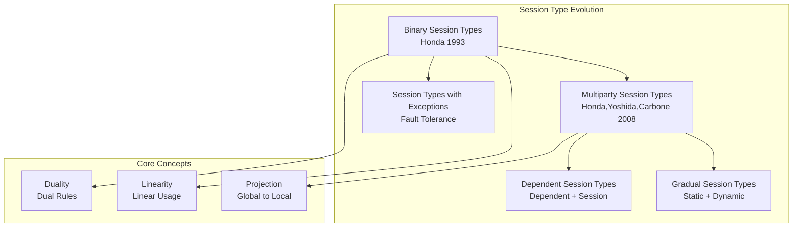
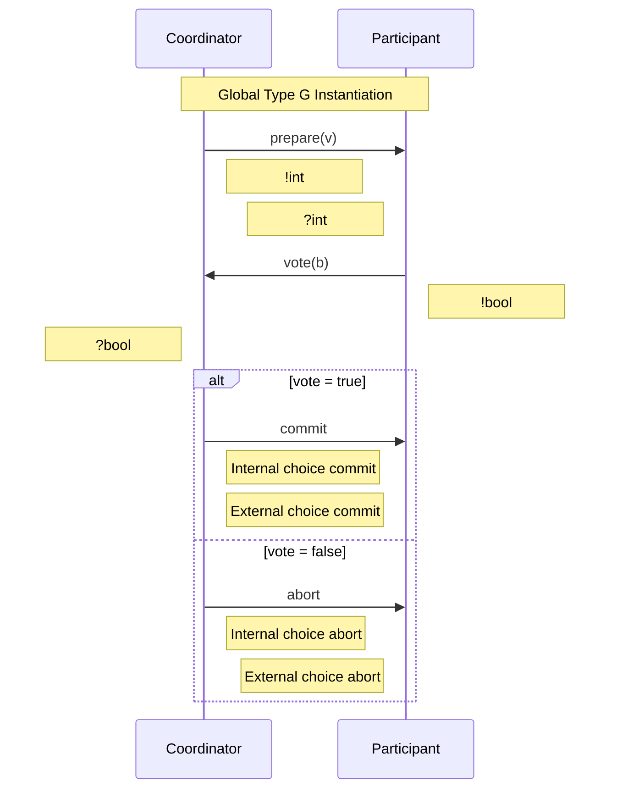
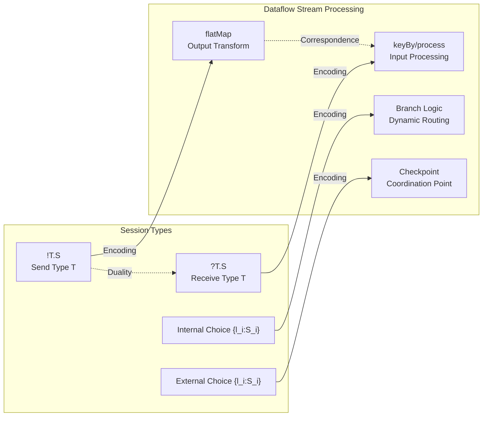
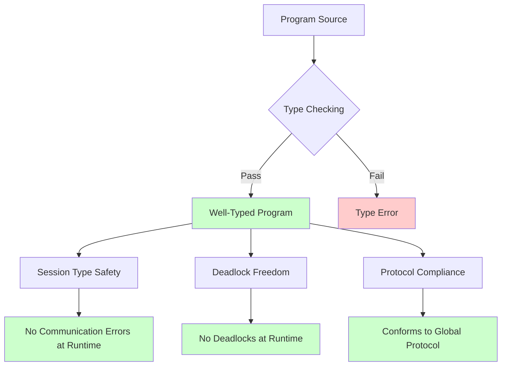

# 1.7 Session Types

> **Stage**: Struct/01-foundation | **Prerequisites**: [1.5 CSP Formalization](./01.05-csp-formalization.md), [1.3 Actor Model Formalization](./01.03-actor-model-formalization.md) | **Formalization Level**: L4-L5

---

## Table of Contents

- [1.7 Session Types](#17-session-types)
  - [Table of Contents](#table-of-contents)
  - [1. Definitions](#1-definitions)
    - [1.1 Binary Session Types Syntax](#11-binary-session-types-syntax)
    - [1.2 Duality](#12-duality)
    - [1.3 Multiparty Session Types](#13-multiparty-session-types)
    - [1.4 Encoding of Sessions and Processes](#14-encoding-of-sessions-and-processes)
  - [2. Properties](#2-properties)
    - [2.1 Formation Rules for Typing Environments](#21-formation-rules-for-typing-environments)
    - [2.2 Channel Linearity](#22-channel-linearity)
    - [2.3 Subtyping Relation](#23-subtyping-relation)
  - [3. Relations](#3-relations)
    - [3.1 Relation to Process Calculus](#31-relation-to-process-calculus)
    - [3.2 Correspondence with Stream Processing](#32-correspondence-with-stream-processing)
    - [3.3 Extension Hierarchy of Session Types](#33-extension-hierarchy-of-session-types)
  - [4. Argumentation](#4-argumentation)
    - [4.1 Why Linear Types?](#41-why-linear-types)
    - [4.2 Distinction Between Internal and External Choice](#42-distinction-between-internal-and-external-choice)
    - [4.3 Multiparty vs. Binary Sessions](#43-multiparty-vs-binary-sessions)
  - [5. Proof / Engineering Argument](#5-proof--engineering-argument)
    - [5.1 Type Safety Theorem](#51-type-safety-theorem)
    - [5.2 Deadlock Freedom Theorem](#52-deadlock-freedom-theorem)
    - [5.3 Protocol Compliance Theorem](#53-protocol-compliance-theorem)
  - [6. Examples](#6-examples)
    - [6.1 Session Types for the Two-Phase Commit Protocol](#61-session-types-for-the-two-phase-commit-protocol)
    - [6.2 Session Type Modeling of Stream Processing Pipelines](#62-session-type-modeling-of-stream-processing-pipelines)
  - [7. Visualizations](#7-visualizations)
    - [7.1 Session Type Hierarchy](#71-session-type-hierarchy)
    - [7.2 Session Flow for Two-Phase Commit](#72-session-flow-for-two-phase-commit)
    - [7.3 Mapping between Session Types and Stream Processing](#73-mapping-between-session-types-and-stream-processing)
    - [7.4 Guarantees of the Type System](#74-guarantees-of-the-type-system)
  - [8. References](#8-references)
  - [Appendix A: Symbol Quick Reference](#appendix-a-symbol-quick-reference)

## 1. Definitions

Session Types are a type theory introduced by Kohei Honda in 1993 for describing the structured types of communication protocols. They provide a formal specification for message exchange among processes, ensuring that communicating parties adhere to a consistent protocol.

### 1.1 Binary Session Types Syntax

**Definition 1.7.1** (Binary Session Types Syntax). Let $T$ range over value types. The syntax of session types $S$ is defined as follows:

$$
\text{Def-S-01-08} \quad S ::=
\begin{cases}
!T.S & \text{(Output: send a value of type } T \text{, continue as } S) \\
?T.S & \text{(Input: receive a value of type } T \text{, continue as } S) \\
\oplus\{l_1:S_1, \ldots, l_n:S_n\} & \text{(Internal choice: send label } l_i \text{, continue as } S_i) \\
\&\{l_1:S_1, \ldots, l_n:S_n\} & \text{(External choice: receive label } l_i \text{, continue as } S_i) \\
\text{end} & \text{(Session termination)}
\\
\mu X.S & \text{(Recursive definition)} \\
X & \text{(Recursive variable)}
\end{cases}
$$

**Informal Explanation**:

- $!T.S$ means the process **sends** a message of type $T$, then continues as $S$
- $?T.S$ means the process **receives** a message of type $T$, then continues as $S$
- $\oplus$ (oplus) means the sender **chooses** a branch to continue
- $\&$ means the receiver **offers** multiple branches for selection

### 1.2 Duality

**Definition 1.7.2** (Duality). The duality operation $\overline{S}$ transforms a session type $S$ into its dual type:

$$
\text{Def-S-01-09} \quad
\begin{aligned}
\overline{!T.S} &= ?T.\overline{S} \\
\overline{?T.S} &= !T.\overline{S} \\
\overline{\oplus\{l_i:S_i\}_{i \in I}} &= \&\{l_i:\overline{S_i}\}_{i \in I} \\
\overline{\&\{l_i:S_i\}_{i \in I}} &= \oplus\{l_i:\overline{S_i}\}_{i \in I} \\
\overline{\text{end}} &= \text{end} \\
\overline{\mu X.S} &= \mu X.\overline{S} \\
\overline{X} &= X
\end{aligned}
$$

Duality rules ensure that the types of communicating parties are complementary: output corresponds to input, and choice corresponds to branching.

### 1.3 Multiparty Session Types

**Definition 1.7.3** (Global Types). For sessions involving multiple participants, a global type $G$ describes the interaction protocol among all participants:

$$
\text{Def-S-01-10} \quad G ::=
\begin{cases}
p \to q : \{l_i\langle T_i \rangle.G_i\}_{i \in I} & \text{(Participant } p \text{ sends label } l_i \text{ and value } T_i \text{ to } q) \\
\mu X.G & \text{(Recursion)} \\
X & \text{(Recursive variable)} \\
\text{end} & \text{(Termination)}
\end{cases}
$$

where $p \to q$ denotes a message exchange from participant $p$ to $q$. Through the **projection** operation $\downarrow$, one can derive the local session type for each participant from the global type.

### 1.4 Encoding of Sessions and Processes

**Definition 1.7.4** (Session-Process Encoding). Session types can be mapped to π-calculus processes via the following encoding:

$$
\text{Def-S-01-11} \quad
\begin{aligned}
\llbracket !T.S \rrbracket_x &= \overline{x}\langle y \rangle.(P_T \mid \llbracket S \rrbracket_x) \quad \text{where } y:T \\
\llbracket ?T.S \rrbracket_x &= x(y).(\llbracket S \rrbracket_x \mid P'_T) \\
\llbracket \oplus\{l_i:S_i\} \rrbracket_x &= \bigoplus_{i \in I} \overline{x}\langle l_i \rangle.\llbracket S_i \rrbracket_x \\
\llbracket \&\{l_i:S_i\} \rrbracket_x &= x\{\text{case } l_i \Rightarrow \llbracket S_i \rrbracket_x\}_{i \in I}
\end{aligned}
$$

---

## 2. Properties

### 2.1 Formation Rules for Typing Environments

Let $\Gamma$ be a mapping from variables to types, and $\Delta$ a mapping from channels to session types. The typing judgment for a process $P$ is written:

$$
\Gamma \vdash P :: \Delta
$$

This denotes that, under environment $\Gamma$, process $P$ uses the channel set $\Delta$.

**Lemma 2.1** (Weakening). If $\Gamma \vdash P :: \Delta$ and $x \notin \text{fn}(P)$, then:

$$
\text{Lemma-S-01-04} \quad \Gamma, x:T \vdash P :: \Delta
$$

### 2.2 Channel Linearity

**Lemma 2.2** (Linear Usage). Every session channel must be used exactly once according to its type:

$$
\text{Lemma-S-01-05} \quad \text{If } x:S \in \Delta \text{ and } x \text{ occurs in } P \text{, then } x \text{ must fully consume } S
$$

Linearity ensures deadlock freedom: a channel cannot be partially used, nor can it be subject to race conditions.

### 2.3 Subtyping Relation

**Definition 2.3** (Session Subtyping). The subtyping relation $S \leqslant S'$ is defined as:

$$
\begin{aligned}
!T.S &\leqslant !T'.S' \quad \text{if } T' \leqslant T \text{ and } S \leqslant S' \\
?T.S &\leqslant ?T'.S' \quad \text{if } T \leqslant T' \text{ and } S \leqslant S' \\
\oplus\{l_i:S_i\}_{i \in I} &\leqslant \oplus\{l_j:S'_j\}_{j \in J} \quad \text{if } J \subseteq I \text{ and } \forall j \in J: S_j \leqslant S'_j
\end{aligned}
$$

**Lemma 2.4** (Subtyping Covariance/Contravariance). Output is covariant, input is contravariant:

$$
\text{Lemma-S-01-06} \quad S_1 \leqslant S_2 \implies \overline{S_2} \leqslant \overline{S_1}
$$

---

## 3. Relations

### 3.1 Relation to Process Calculus

| Process Calculus Concept | Session Type Counterpart | Semantic Correspondence |
|--------------------------|--------------------------|-------------------------|
| Channel $x$ | Session endpoint $x:S$ | Communication channel with type constraints |
| Output $\overline{x}\langle v \rangle.P$ | $!T.S$ | Typed send, then continue |
| Input $x(y).P$ | $?T.S$ | Typed receive, then continue |
| Choice $\oplus$ | $\oplus\{l_i:S_i\}$ | Labelled branching, internal choice |
| Parallel $P \mid Q$ | Duality composition $\Delta_1 \cdot \Delta_2$ | Complementary type composition |
| Restriction $(\nu x)P$ | Session hiding | Channel abstraction after type checking |

### 3.2 Correspondence with Stream Processing

There exists a profound structural correspondence between session types and Dataflow stream processing:

$$
\begin{aligned}
\text{Dataflow operator chain} &\leftrightarrow \text{Session channel sequence} \\
\text{Checkpoint barrier} &\leftrightarrow \text{Session boundary marker} \\
\text{End-to-end Exactly-Once} &\leftrightarrow \text{Session atomicity} \\
\text{Watermark propagation} &\leftrightarrow \text{Session timestamp parameter} \\
\text{Backpressure} &\leftrightarrow \text{Session flow control}
\end{aligned}
$$

This correspondence provides a theoretical foundation for the formal verification of stream processing systems.

### 3.3 Extension Hierarchy of Session Types

```
Binary Session Types
       |
       v
Multiparty Session Types
       |
       v
Dependent Session Types
       |
       v
Gradual Session Types
       |
       v
Session Types with Exceptions
```

---

## 4. Argumentation

### 4.1 Why Linear Types?

**Argument 4.1** (Necessity of Linearity). Consider a counterexample of non-linear channel usage:

```
Process P: send x.send x  (type: !Int.!Int.end)
Process Q: recv x          (type: ?Int.end)
```

Non-linear usage leads to:

1. **Deadlock**: $P$ blocks on the second send because there is no matching receiver
2. **Protocol violation**: $Q$ terminates prematurely without completing the protocol

Linear type systems rule out such errors at compile time by enforcing **exactly-once** usage.

### 4.2 Distinction Between Internal and External Choice

**Argument 4.2** (Design of Choice Types). The distinction between $\oplus$ (internal choice) and $\&$ (external choice) is necessary:

- **Internal choice ($\oplus$)**: The sender decides which branch to take; the receiver must be prepared to handle all possibilities
- **External choice ($\&$)**: The receiver offers options, and the sender chooses among them

This distinction guarantees **determinacy**: at any moment, both communicating parties have a clear consensus on "who decides," avoiding race conditions.

### 4.3 Multiparty vs. Binary Sessions

**Argument 4.3** (Advantages of Global Types). For a three-party protocol $A \to B \to C$:

The binary approach requires two independent session pairs:

- $A \leftrightarrow B$ with type $S_{AB}$
- $B \leftrightarrow C$ with type $S_{BC}$

The problem is: how does $B$ ensure that it forwards to $C$ immediately after receiving from $A$? Global types describe the complete protocol through a single specification, and guarantee compatibility of each participant's local type via projection.

---

## 5. Proof / Engineering Argument

### 5.1 Type Safety Theorem

**Theorem 5.1** (Session Type Safety). If $\Gamma \vdash P :: \Delta$ and $P \to^* Q$, then:

$$
\text{Thm-S-01-03} \quad \exists \Delta'. \Gamma \vdash Q :: \Delta' \text{ and } \Delta' \leqslant \Delta
$$

**Proof Sketch**:

1. **Structural induction** on the reduction relation $\to$:
   - Communication reduction: $x\langle v \rangle.P \mid x(y).Q \to P \mid Q[v/y]$
   - Choice reduction: $\overline{x}\langle l_j \rangle.P \mid x\{\text{case } l_i \Rightarrow Q_i\} \to P \mid Q_j$

2. **Substitution Lemma**: If $\Gamma \vdash v : T$ and $\Gamma, y:T \vdash Q :: \Delta$, then $\Gamma \vdash Q[v/y] :: \Delta$

3. **Preservation under reduction**: Each reduction consumes one session-type constructor; the remaining type is still well-formed

4. **Conclusion**: The reduced process preserves the typing judgment, possibly leaving fewer session obligations $\Box$

### 5.2 Deadlock Freedom Theorem

**Theorem 5.2** (Deadlock Freedom). For a closed process $P$ (without free variables), if $\vdash P :: \emptyset$, then $P$ cannot deadlock.

$$
\text{Thm-S-01-04} \quad \vdash P :: \emptyset \implies \neg \exists Q. P \to^* Q \text{ and } Q \text{ is deadlocked}
$$

**Proof Sketch**:

Define the state of a process as the set of all unfinished session channels. Deadlock means there exists a circular wait:

$$
P_1 \text{ waits for } P_2 \text{ and } P_2 \text{ waits for } P_3 \ldots \text{ and } P_n \text{ waits for } P_1
$$

Due to the **linearity** and **duality complementarity** of session types:

- Each waiting edge corresponds to an output waiting for an input (or vice versa)
- Duality guarantees that the waiting graph is **acyclic** (well-founded)
- Hence no circular wait exists $\Box$

### 5.3 Protocol Compliance Theorem

**Theorem 5.3** (Protocol Compliance). Let $G$ be a global type and $\{p_i : S_i\}$ the projections of all participants. If every $P_i$ satisfies $\vdash P_i :: x_i:S_i$, then the composed system satisfies all interaction sequences described by $G$.

$$
\text{Thm-S-01-05} \quad \forall i. \vdash P_i :: S_i = G \downarrow p_i \implies \prod_i P_i \models G
$$

**Engineering Argument**: This theorem provides **compile-time verification** for distributed systems:

- Developers write code for each participant separately
- The type checker verifies that local implementations conform to the projections of the global protocol
- At runtime, no additional synchronization is needed to guarantee protocol compliance

---

## 6. Examples

### 6.1 Session Types for the Two-Phase Commit Protocol

**Protocol Description**: Two-phase commit between a Coordinator (C) and a Participant (P)

**Global Type**:

```
G = C -> P: {prepare<int>. P -> C: {vote<bool>.
       C -> P: {commit.end + abort.end}}}
```

**Coordinator Local Type** (Projection to C):

```haskell
-- 协调者类型
S_C = !int.?bool.&{commit.end, abort.end}
    -- 发送prepare值
    -- 接收vote
    -- 选择commit或abort
```

**Participant Local Type** (Projection to P):

```haskell
-- 参与者类型
S_P = ?int.!bool.+{commit.end, abort.end}
    -- 接收prepare
    -- 发送vote
    -- 等待协调者选择
```

**Verification**: $\overline{S_C} = S_P$; the types are dual and the protocol is well-formed.

**Pseudocode Implementation**:

```text
# 协调者 (类型: S_C)
def coordinator(ch: Channel[!int.?bool.&{commit.end, abort.end}]):
    ch.send(prepare_value)           # !int
    vote = ch.receive()               # ?bool
    if vote:
        ch.select("commit")           # & 选择 commit
    else:
        ch.select("abort")            # & 选择 abort

# 参与者 (类型: S_P)
def participant(ch: Channel[?int.!bool.+{commit.end, abort.end}]):
    prepare = ch.receive()            # ?int
    vote = validate(prepare)
    ch.send(vote)                     # !bool
    match ch.branch():               # + 分支
        case "commit": commit()
        case "abort":  abort()
```

### 6.2 Session Type Modeling of Stream Processing Pipelines

**Scenario**: Producer -> Transformer -> Consumer pipeline

**Global Type**:

```
G = Prod -> Trans: stream<item>.
    Trans -> Cons: stream<result>.
    loop (Trans -> Cons: {next. Prod -> Trans: item.
                          Trans -> Cons: result})
```

**Local Types for Each Participant**:

```haskell
-- 生产者
S_Prod = !item.?ack.mu X.(!item.?ack.X + end)

-- 转换器
S_Trans = ?item.!result.mu X.(?item.!result.X + end)

-- 消费者
S_Cons = ?result.mu X.(!next.?result.X + end)
```

**Correspondence with Flink**:

| Session Type Construct | Flink Concept |
|------------------------|---------------|
| `!item.?ack` | Send record + await backpressure signal |
| `mu X.(...X + end)` | Infinite stream loop / finite stream termination |
| `!next` | Checkpoint barrier request |
| `end` | Job termination / checkpoint completion |

---

## 7. Visualizations

### 7.1 Session Type Hierarchy



### 7.2 Session Flow for Two-Phase Commit



### 7.3 Mapping between Session Types and Stream Processing



### 7.4 Guarantees of the Type System



---

## 8. References


---

## Appendix A: Symbol Quick Reference

| Symbol | Meaning | Location |
|--------|---------|----------|
| !T.S | Send then continue | Binary Session Types |
| ?T.S | Receive then continue | Binary Session Types |
| + | Internal Choice | Binary Session Types |
| & | External Choice | Binary Session Types |
| S-bar | Dual of S | Duality Operation |
| p -> q | From p to q | Global Types |
| downarrow | Projection | Global to Local |
| mu X.S | Recursive Definition | Recursive Types |
| Gamma |- P :: Delta | Typing Judgment for P | Type Rules |

---

*Document Status: Draft | Last Updated: 2026-04-02 | Formalization Level: L4.5*
