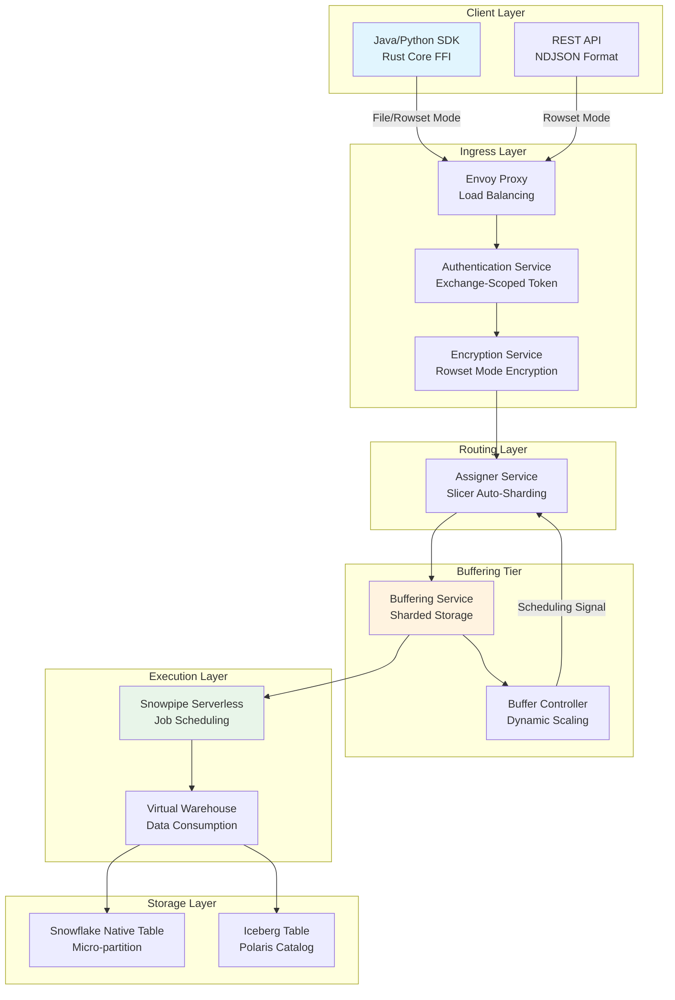
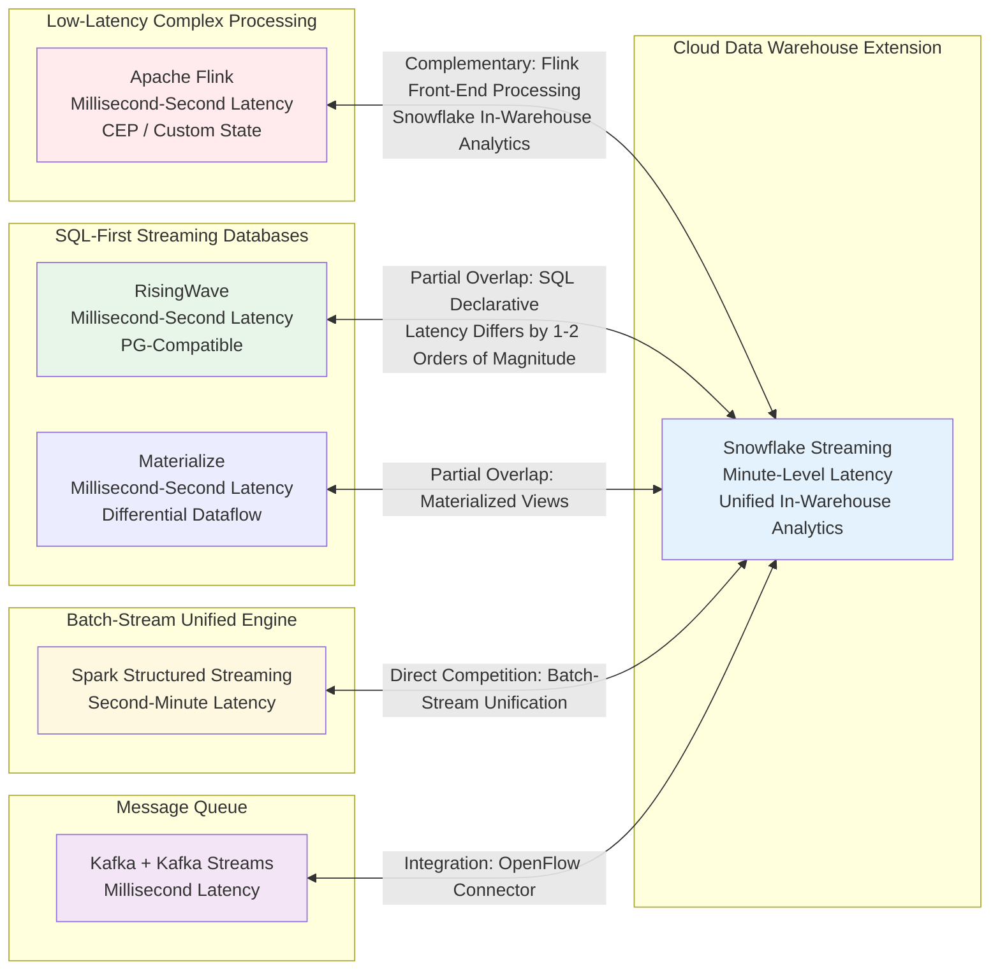

# Snowflake Streaming Architecture and Stream Processing Ecosystem Positioning Analysis

> **Stage**: Knowledge/06-frontier | **Prerequisites**: [streaming-databases.md](./streaming-databases.md), [streaming-database-ecosystem-comparison.md](./streaming-database-ecosystem-comparison.md) | **Formalization Level**: L3-L4

---

## 1. Definitions

### Def-K-06-480: Snowflake Stream Processing Platform

The Snowflake stream processing platform is a **hybrid data management system that extends from a cloud-native data warehouse core into the stream processing domain through incremental computation and real-time ingestion**.

**Formal Definition**: A sextuple $\mathcal{SSP} = (\mathcal{I}, \mathcal{T}, \mathcal{D}, \mathcal{O}, \Lambda, \mathcal{C})$, where:

- $\mathcal{I}$: Set of Snowpipe Streaming ingestion channels
- $\mathcal{T}$: Set of target tables (native tables, Dynamic Tables, Iceberg Tables)
- $\mathcal{D}$: Set of Dynamic Tables, where each $dt \in \mathcal{D}$ is defined by an SQL query, TARGET_LAG, and refresh mode
- $\mathcal{O}$: Set of OpenFlow connectors
- $\Lambda: \mathcal{T} \times \delta\mathcal{I} \rightarrow \mathcal{T}$: Incremental update function
- $\mathcal{C}$: Set of consistency configurations

**Core Constraint**: $\forall dt \in \mathcal{D}, \forall t \in \mathbb{T}: \quad dt_t = q(S_{\leq t}) \land \text{lag}(dt_t, S_t) \leq \tau_{target}$

**Key Components**:

| Component | Functional Positioning | Latency Characteristics |
|-----------|----------------------|------------------------|
| Snowpipe Streaming | Real-time row-level data ingestion | 5-10 seconds end-to-end |
| Dynamic Tables | Incremental materialized views | Minimum 60 seconds TARGET_LAG |
| OpenFlow | Integration connector framework | Depends on source system |
| Iceberg Tables | Open lakehouse format | Consistent with Dynamic Tables |

---

### Def-K-06-481: Snowpipe Streaming Next-Generation Architecture

The Snowpipe Streaming next-generation architecture is a **high-performance real-time ingestion system based on server-side buffering and serverless execution**, launched by Snowflake in 2025, supporting single-table throughput of up to 10 GB/s[^1].

**Formal Definition**: A septuple $\mathcal{SPS} = (\mathcal{E}, \mathcal{A}, \mathcal{B}, \mathcal{P}, \mathcal{W}, \mathcal{R}, \mathcal{F})$, where:

- $\mathcal{E}$: Ingress layer, implementing load balancing based on Envoy proxy
- $\mathcal{A}$: Authentication service, managing exchange-scoped tokens
- $\mathcal{B} = (B_{svc}, B_{ctrl})$: Buffering layer, containing sharded buffering service and buffering controller
- $\mathcal{P}$: Assigner service, dynamically allocating buffer nodes based on Slicer Auto-Sharding
- $\mathcal{W}$: Snowpipe serverless execution warehouse
- $\mathcal{R}$: Rust core SDK, exposing Java/Python interfaces through FFI
- $\mathcal{F} = \{file, rowset\}$: Transfer modes (File Mode for high-throughput optimization, Rowset Mode for low-latency flexibility)

**State Transition**: $\text{Data}_{in} \xrightarrow{\mathcal{E}} \text{Auth} \xrightarrow{\mathcal{A}} \text{Encrypt} \xrightarrow{\mathcal{P}} \mathcal{B} \xrightarrow{\mathcal{W}} \mathcal{T}$

---

### Def-K-06-482: Dynamic Tables Incremental Materialization Mechanism

Dynamic Tables are Snowflake's **declarative incremental materialized view** mechanism. Users define data transformation pipelines through SQL, and the system automatically tracks upstream changes and maintains a dependency DAG.

**Formal Definition**: A quintuple $dt = (q, \tau, w, \rho, \delta)$, where $q$ is the SQL query, $\tau$ is the TARGET_LAG, $w$ is the Virtual Warehouse, $\rho \in \{\text{INCREMENTAL}, \text{FULL}, \text{AUTO}\}$ is the refresh mode, and $\delta$ is the set of change types.

**Incremental Refresh Constraint**: $\rho = \text{INCREMENTAL} \Rightarrow dt_{t+1} = dt_t \oplus \Delta(\delta_t, q)$, where $\Delta$ is a change tracking function based on Stream metadata.

---

## 2. Properties

### Prop-K-06-480: Snowflake Stream Processing Latency Lower Bound

**Proposition**: The end-to-end latency of the Snowflake stream processing platform has a lower bound determined by design decisions, which is higher than that of dedicated stream processing engines.

**Formal Expression**: $L_{Snowflake} = L_{ingest} + L_{buffer} + L_{schedule} + L_{compute} + L_{commit}$

Lower bounds of each component: $L_{ingest} \geq 5s$, $L_{schedule} \geq 1s$, $L_{commit} \geq 0.5s$.

For Dynamic Tables, the minimum TARGET_LAG is 60 seconds[^2], thus $\forall dt \in \mathcal{D}: L_{dt} \geq 60s$.

Comparison with Flink: $L_{Flink} \approx 10ms \text{ -- } 1s \ll L_{Snowflake} \geq 60s$.

**Corollary**: Snowflake is unsuitable for sub-second decision-making use cases (such as high-frequency trading risk control) but is well-suited for near-real-time analytics and ELT pipelines.

---

### Prop-K-06-481: Dynamic Tables Refresh Mode Cost Trade-off

**Proposition**: The three refresh modes exhibit a ternary trade-off among computational cost, data freshness, and implementation complexity.

**Cost Function**:

$$C(\rho) = \begin{cases} c_{inc} \cdot |\delta_t| & \rho = \text{INCREMENTAL} \\ c_{full} \cdot |S_t| & \rho = \text{FULL} \\ \min(C_{inc}^*, C_{full}^*) & \rho = \text{AUTO} \end{cases}$$

Where $c_{inc} \gg c_{full}$, but $|\delta_t| \ll |S_t|$.

**Trade-off Relationship**: INCREMENTAL yields $C \downarrow$, $F \uparrow$, $X \uparrow$ (but does not support non-deterministic functions); FULL yields $C \uparrow$, $F \downarrow$, $X \downarrow$; AUTO fixes the decision at creation time, and upstream changes may cause refresh failures.

---

## 3. Relations

### 3.1 Architecture Mapping Between Snowflake and Dedicated Stream Processing Engines

| Snowflake Component | Corresponding Flink Concept | Corresponding RisingWave Concept | Key Differences |
|--------------------|----------------------------|----------------------------------|-----------------|
| Snowpipe Streaming | Source Connector | Source Connector | Limited stateless transformation capability |
| Dynamic Tables | Materialized Table | Materialized View | Minimum latency 60s; RisingWave is millisecond-level |
| OpenFlow Kafka Connector | Kafka Connector | CREATE SOURCE | Based on NiFi, feature-rich but higher latency |
| Iceberg Tables | Flink Iceberg Sink | External Table | Deep integration with Polaris Catalog |
| Stream (CDC) | Debezium Connector | Built-in CDC | Only tracks DML metadata |

**Formal Mapping**: For $\mathcal{Q}_{simple}$ containing only window aggregation, stream-stream JOIN, and filtering, $q_F \approx q_S$; for $\mathcal{Q}_{CEP}$ containing MATCH_RECOGNIZE or custom state operators, no equivalent $q_S$ exists.

### 3.2 Snowflake's Competitive Positioning in the Stream Processing Ecosystem

- **With Flink**: **Complementary relationship**. Flink covers low-latency complex processing, while Snowflake covers high-throughput in-warehouse analytics. In hybrid architectures, Flink handles front-end complex logic, and Snowflake ingests aggregation results[^5].
- **With RisingWave/Materialize**: **Partial overlap**. All three support SQL declarative stream processing, but Snowflake's latency is higher by 1-2 orders of magnitude.
- **With Spark Structured Streaming**: **Direct competition**. Both target batch-stream unification with minute-level latency. Snowflake's advantage lies in zero-ETL integration with the data warehouse; Spark's advantage lies in ecosystem breadth.

### 3.3 Technical Heritage of OpenFlow and Apache NiFi

$$\text{OpenFlow} = \text{NiFi}_{core} + \text{Snowflake}_{security} + \text{Snowpipe}_{streaming}$$

OpenFlow supports two deployment modes[^4]: SPCS (Snowflake Deployment, with native integrated authentication and authorization) and BYOC (data processing engine in the user's cloud environment).

---

## 4. Argumentation

### 4.1 Boundary Analysis of Snowflake Stream Processing Competitive Advantages

**Advantage Domains**: Zero-ETL integration (stream data can directly JOIN historical data after ingestion), elastic compute (Virtual Warehouse scales independently), governance consistency (Horizon Catalog unifies RBAC and auditing), SQL-friendly (fully declarative interface).

**Boundary Limitations**: Latency boundary (Dynamic Tables minimum 60 seconds), state management boundary (no explicit stateful operators), CEP boundary (does not support MATCH_RECOGNIZE), open-source ecosystem boundary (community contributions lag behind Flink).

### 4.2 Engineering Constraints of the Latency-Elasticity Trade-off

**Constraint 1: Cold Start Cost**. Serverless warehouses require cold starts after idle periods, which is an anti-pattern for sustained low-latency stream processing.

**Constraint 2: Transaction Commit Granularity**. Snowflake is based on immutable micro-partitions. Each Dynamic Tables refresh involves generating new micro-partitions and updating metadata. When refresh frequency exceeds a threshold, overhead becomes a bottleneck: $\text{Refresh Frequency} > \frac{1}{t_{partition} + t_{metadata}} \Rightarrow \text{Overhead dominates}$.

**Constraint 3: Resource Isolation**. When multiple Dynamic Tables share a warehouse, resource contention may cause TARGET_LAG violations: $\sum_{dt \in \mathcal{D}_w} \frac{1}{\tau_{dt}} > \frac{1}{t_{avg}(w)} \Rightarrow \exists dt: \text{lag}(dt) > \tau_{dt}$.

### 4.3 Impact Assessment of Complex Event Processing (CEP) Capability Gap

| Scenario | Impact Level | Alternative Solution |
|----------|-------------|---------------------|
| Fraud detection (sequence patterns) | High | Front-end Flink processing, Snowflake ingests aggregation results |
| Equipment failure prediction (time-series patterns) | High | External ML model + Snowflake storage |
| Real-time recommendation (session behavior) | Medium | Simplified feature engineering, sacrificing some real-timeness |
| Log anomaly detection (frequency突变) | Low | Dynamic Tables + threshold alerting is sufficient |

---

## 5. Proof / Engineering Argument

### Lemma-K-06-480: Functional Equivalence Boundary Between Dynamic Tables and Flink Materialized Tables

**Lemma**: For the query set $\mathcal{Q}_{eq}$ containing only projection, selection, inner join, grouped aggregation, and tumbling windows, Snowflake Dynamic Tables and Flink Materialized Tables are functionally equivalent under eventual consistency semantics; for $\mathcal{Q}_{neq}$ containing session windows, pattern matching, or custom state operators, no functional equivalence mapping exists between the two.

**Proof**:

**Part 1 ($\mathcal{Q}_{eq}$ Equivalence)**: Let $q \in \mathcal{Q}_{eq}$. Flink outputs $M_F(t) = q(S_{[t - \tau, t]})$, and Snowflake outputs $M_S(t) = q(S_{\leq t})$ under the TARGET_LAG $\tau$ constraint. Operations in $\mathcal{Q}_{eq}$ satisfy monotonicity and incremental computability; there exists an incremental update function $\Delta_q$ such that $M(t + \delta) = \Delta_q(M(t), \delta S)$. Flink's Incremental Materialized Table and Snowflake's INCREMENTAL Dynamic Table both implement equivalent $\Delta_q$, thus $M_F \equiv M_S$ (under eventual consistency semantics).

**Part 2 ($\mathcal{Q}_{neq}$ Non-Equivalence)**:

1. **Session Windows**: Boundaries are dynamically determined by data gaps, requiring state maintenance to detect timeouts. Snowflake's refresh mechanism is time-driven (TARGET_LAG), not event-driven, and cannot express dynamic boundary semantics.
2. **Pattern Matching**: MATCH_RECOGNIZE requires maintaining NFA states. Snowflake lacks explicit stateful operator abstractions and cannot implement NFA state management.
3. **Custom State Operators**: Flink ProcessFunction supports KeyedState and TimerService. Snowflake's SQL interface is closed, with no extension points for implementing arbitrary state machines.

In conclusion: $\exists q \in \mathcal{Q}_{neq}: \nexists \phi: M_F \xrightarrow{\phi} M_S$.

**Engineering Corollary**: If the workload falls entirely within $\mathcal{Q}_{eq}$, Dynamic Tables can simplify operations; if $\mathcal{Q}_{neq}$ is involved, Flink must be introduced as a front-end processing layer.

---

## 6. Examples

### 6.1 Cboe Global Markets Real-Time Market Data Ingestion

Cboe conducted production validation during the Snowpipe Streaming preview phase[^1]: daily ingestion of >100 TB uncompressed data, >190 billion rows, P95 query latency <30 seconds. The key design leverages pre-clustering to cluster data in-flight by query dimensions and uses serverless execution to elastically handle traffic peaks. This scenario is a **high-throughput, medium-latency-tolerant** use case, validating Snowflake's feasibility in financial market data warehousing.

### 6.2 Dynamic Tables Declarative Pipeline Definition

**Traditional Streams + Tasks Approach** (3+ objects):

```sql
CREATE STREAM raw_events_stream ON TABLE raw_events;
CREATE TASK clean_events_task
  WAREHOUSE = etl_wh SCHEDULE = '1 MINUTE'
AS MERGE INTO clean_events ...;
```

**Dynamic Tables Approach** (1 object):

```sql
CREATE DYNAMIC TABLE clean_events
  TARGET_LAG = '1 MINUTE'
  WAREHOUSE = etl_wh
  REFRESH_MODE = INCREMENTAL
AS SELECT user_id, event_type, PARSE_JSON(payload) as data
   FROM raw_events WHERE event_type IN ('click', 'purchase');
```

Dynamic Tables coalesce change tracking, dependency management, and incremental refresh into a single object, significantly reducing pipeline complexity[^7][^8].

### 6.3 OpenFlow Kafka Connector Configuration

The OpenFlow Kafka connector implements real-time data flow from Kafka to Snowflake[^4][^6]: Source is a Kafka Topic (Confluent Cloud, AWS MSK, Azure Event Hubs); Format is JSON/AVRO with automatic Schema Evolution support; Security supports SASL_SSL / SCRAM-SHA-256 / AWS_MSK_IAM; Destination writes to Snowflake tables through Snowpipe Streaming. OpenFlow also supports CDC output from Snowflake to Kafka.

---

## 7. Visualizations

### 7.1 Snowpipe Streaming Next-Generation Architecture Hierarchy Diagram



**Description**: The core evolution lies in migrating buffering from the client side to the server-side Buffering Tier, achieving dynamic sharding through the Assigner, and supporting two transfer strategies: File Mode (high-throughput, low-cost) and Rowset Mode (low-latency, flexible).

---

### 7.2 Stream Processing Ecosystem Competitive Positioning Matrix



**Description**: The core differentiation of Snowflake Streaming lies in **frictionless integration with the data warehouse**. For enterprises already deeply using Snowflake, Dynamic Tables provide the lowest-complexity path to stream processing; however, for latency-sensitive scenarios or those requiring CEP, a hybrid architecture with Flink or RisingWave is still necessary.

---

## 8. References

[^1]: Snowflake Engineering Blog, "Introducing Our Next-Gen Snowpipe Streaming Architecture", 2025-10. <https://www.snowflake.com/en/engineering-blog/next-gen-snowpipe-streaming-architecture/>

[^2]: Snowflake Documentation, "Dynamic Tables", 2025. <https://docs.snowflake.com/en/user-guide/dynamic-tables-about>

[^4]: Snowflake Documentation, "OpenFlow Connector for Kafka", 2025. <https://docs.snowflake.com/en/user-guide/data-integration/openflow/connectors/kafka/about>

[^5]: RisingWave Blog, "When to Use Flink vs When to Use a Streaming Database", 2026-04. <https://risingwave.com/blog/when-to-use-flink-vs-streaming-database/>

[^6]: Snowflake Quickstart, "Getting Started with Openflow Kafka Connector", 2025-10. <https://www.snowflake.com/en/developers/guides/getting-started-with-openflow-kafka-connector/>

[^7]: Yuki Data, "Everything to Know About Snowflake Dynamic Tables", 2025-12. <https://yukidata.com/snowflake-dynamic-tables-guide/>

[^8]: Analytics Today, "ELT Pipeline Design with Snowflake Dynamic Tables and Target Lag", 2025-08. <https://articles.analytics.today/how-snowflake-dynamic-tables-simplify-etl-pipelines>
