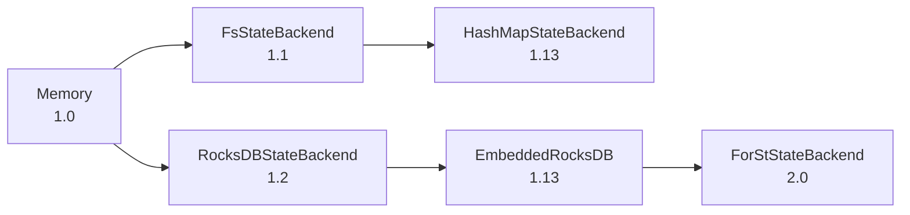

# State Backend Evolution Analysis

> **Stage**: Flink/02-core | **Prerequisites**: [State Backends Deep Comparison](state-backends-deep-comparison.md) | **Formal Level**: L4
>
> Evolution from MemoryStateBackend to HashMapStateBackend, RocksDBStateBackend, and Flink 2.0 ForSt.

---

## 1. Definitions

**Def-F-02-82: MemoryStateBackend**

Flink 1.0 original backend storing state in JVM heap:

$$
|S_{total}| \leq \alpha \cdot \text{taskmanager.memory.task.heap.size}, \quad \alpha \approx 0.3
$$

**Def-F-02-83: FsStateBackend**

Flink 1.1 extension: state in memory, snapshots async to filesystem. Deprecated in 1.13+.

**Def-F-02-84: HashMapStateBackend**

Flink 1.13+ unified in-memory backend.

**Def-F-02-85: RocksDBStateBackend**

Flink 1.2+ (renamed EmbeddedRocksDBStateBackend in 1.13+):

$$
\text{RocksDB} = \text{MemTable}_{active} \cup \text{MemTable}_{immutable} \cup \left( \bigcup_{i=0}^{L} \text{Level}_i \right)
$$

**Def-F-02-86: ForStStateBackend**

Flink 2.0+ disaggregated remote state backend.

---

## 2. Properties

**Lemma-F-02-39: Latency Hierarchy**

$$
\text{HashMap} \ll \text{RocksDB} \ll \text{ForSt (cache miss)}
$$

**Lemma-F-02-40: Capacity Hierarchy**

$$
\text{HashMap} \ll \text{RocksDB} \approx \text{ForSt}
$$

---

## 3. Relations

- **with Flink Versions**: Each backend corresponds to specific Flink versions.
- **with Cloud-Native**: ForSt is designed for Kubernetes/serverless deployments.

---

## 4. Argumentation

**Evolution Timeline**:

| Version | Backend | Innovation |
|---------|---------|------------|
| 1.0 | MemoryStateBackend | Basic heap storage |
| 1.1 | FsStateBackend | Async snapshots |
| 1.2 | RocksDBStateBackend | LSM-Tree, large state |
| 1.13 | HashMapStateBackend | Unified in-memory |
| 2.0 | ForStStateBackend | Disaggregated, cloud-native |

---

## 5. Engineering Argument

**Migration Path**: From RocksDB to ForSt:

1. Enable ForSt backend
2. Configure cache size
3. Set sync policy
4. Monitor cache hit rate
5. Gradual rollout

---

## 6. Examples

```java
// State backend evolution in configuration
// Flink 1.12
env.setStateBackend(new MemoryStateBackend());

// Flink 1.13+
env.setStateBackend(new HashMapStateBackend());
env.setCheckpointStorage(new FileSystemCheckpointStorage("hdfs://..."));

// Flink 2.0+
env.setStateBackend(new ForStStateBackend());
```

---

## 7. Visualizations

**State Backend Evolution**:



---

## 8. References
