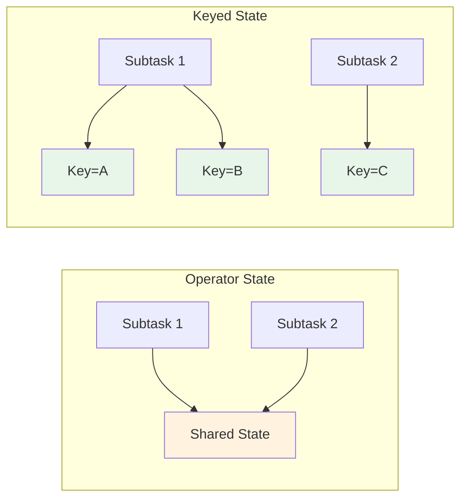

# State Management Concepts

> **Stage**: Knowledge/01-concept-atlas | **Prerequisites**: [Time Semantics](time-semantics.md) | **Formalization Level**: L3-L4
> **Translation Date**: 2026-04-21

## Abstract

State is the foundation of stateful stream processing. This document formalizes state types (operator state, keyed state), state backends, TTL, and their relationships to consistency models and checkpointing.

---

## 1. Definitions

### Def-K-04-01 (State)

**State** is the data that stream processing operators need to persist during computation:

$$\text{State}: (K, V, T) \to V'$$

where:
- $K$: state key space (optional)
- $V$: state value space
- $T$: time domain (for TTL)

### Def-K-04-02 (Operator State)

**Operator State** is bound to operator instances, shared across parallel subtasks:

$$\text{OperatorState}: \text{Op} \to 2^{(K \times V)}$$

**Characteristics**:
- State partitioning independent of data partitioning
- Suitable for Source/Sink state management
- Supports redistribution strategies

### Def-K-04-03 (Keyed State)

**Keyed State** is partitioned by data key, with independent state per key:

$$\text{KeyedState}: K \to V$$

**Characteristics**:
- State and data partitioned by the same key
- Same-key data guaranteed to be processed by the same subtask
- Supports finer-grained state management

### Def-K-04-04 (ValueState)

**ValueState** stores a single value:

$$\text{ValueState}: \text{Unit} \to V$$

Operations: `update(V)`, `value()`, `clear()`

### Def-K-04-05 (ListState)

**ListState** stores an append-only list:

$$\text{ListState}: \mathbb{N} \to V$$

Operations: `add(V)`, `get(): List<V>`, `update(List<V>)`, `clear()`

### Def-K-04-06 (MapState)

**MapState** stores a key-value map:

$$\text{MapState}: K \to V$$

Operations: `put(K, V)`, `get(K): V`, `contains(K)`, `remove(K)`, `entries()`

---

## 2. Properties

### Lemma-K-04-01 (Keyed State Determinism)

For keyed state, if two records with the same key arrive at the same operator instance, they access the same state partition:

$$\forall r_1, r_2: \text{key}(r_1) = \text{key}(r_2) \Rightarrow \text{StatePartition}(r_1) = \text{StatePartition}(r_2)$$

**Proof.** By definition of keyed partitioning: records are routed to subtasks via `hash(key) mod parallelism`. Same key → same hash → same subtask → same state. ∎

### Lemma-K-04-02 (Operator State Redistributability)

Operator state can be redistributed across parallelism changes via:
- **Even-split**: Divide state equally among new subtasks
- **Union**: All subtasks receive the complete state

---

## 3. State Backends

| Backend | Storage | Use Case | Performance |
|---------|---------|----------|-------------|
| MemoryStateBackend | JVM Heap | Development, small state | Fastest, volatile |
| FsStateBackend | FileSystem (async) | Medium state, batch+stream | Balanced |
| RocksDBStateBackend | RocksDB (local disk) | Large state, production | Slower, scalable |

### RocksDBStateBackend Details

```
RocksDBStateBackend Architecture:
├── In-Memory MemTable (active writes)
├── Immutable MemTables (flushing)
├── SST Files (level-compacted on disk)
└── Block Cache (frequently accessed data)
```

**Incremental Checkpointing**: Only changed SST files are uploaded, reducing checkpoint size and duration.

---

## 4. TTL (Time-To-Live)

### Def-K-04-07 (State TTL)

**TTL** automatically expires state entries after a configured duration:

$$\text{TTL}: \text{StateEntry} \times \mathbb{T} \to \{\text{Valid}, \text{Expired}\}$$

**Update types**:
- `OnCreateAndWrite`: TTL reset on create and update
- `OnReadAndWrite`: TTL reset on read, create, and update
- `OnCreate`: TTL set only on create

### TTL Cleanup Strategies

| Strategy | Mechanism | Overhead |
|----------|-----------|----------|
| Cleanup in full snapshot | Filter expired entries during snapshot | Low (periodic) |
| Incremental cleanup | Background cleanup with probability | Medium |
| RocksDB compaction filter | Expire during SST compaction | Low (integrated) |

---

## 5. Examples

### 5.1 Keyed ValueState in Flink

```java
// Define keyed state descriptor
ValueStateDescriptor<Long> sumState = 
    new ValueStateDescriptor<>("sum", Types.LONG);

// Access in KeyedProcessFunction
ValueState<Long> state = getRuntimeContext().getState(sumState);

public void processElement(Event event, Context ctx, Collector<Result> out) {
    Long current = state.value();
    if (current == null) current = 0L;
    state.update(current + event.getValue());
}
```

### 5.2 State with TTL

```java
StateTtlConfig ttlConfig = StateTtlConfig
    .newBuilder(Time.hours(24))
    .setUpdateType(OnCreateAndWrite)
    .setStateVisibility(NeverReturnExpired)
    .cleanupIncrementally(10, true)
    .build();

ValueStateDescriptor<MyState> descriptor = 
    new ValueStateDescriptor<>("myState", MyState.class);
descriptor.enableTimeToLive(ttlConfig);
```

---

## 6. Visualizations



---

## 7. References

[^1]: Apache Flink Documentation, "State Backends", 2025. https://nightlies.apache.org/flink/flink-docs-stable/docs/ops/state/backends/
[^2]: Apache Flink Documentation, "Queryable State", 2025.
[^3]: F. Hueske et al., "Stream Processing with Apache Flink", O'Reilly, 2019.
[^4]: RocksDB Documentation, "RocksDB Basics", Meta, 2025.
