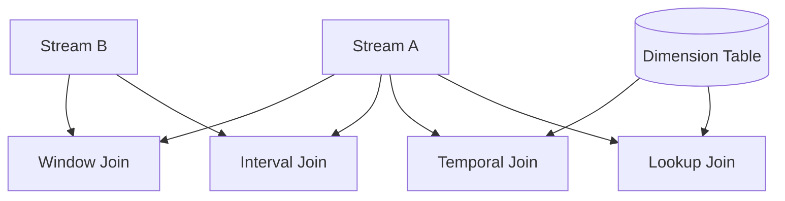

# Stream Join Patterns

> **Stage**: Knowledge | **Prerequisites**: [Stream Processing Fundamentals](../01-concept-atlas/01.01-stream-processing-fundamentals.md) | **Formal Level**: L4-L5
>
> Five standard stream join patterns with formal semantics and engineering implementation.

---

## 1. Definitions

**Def-K-02-32: Stream Join**

Mapping from two streams to output stream:

$$
\text{Join}_\theta: S_A \times S_B \to S_{out}
$$

**Def-K-02-33: Window Join**

Join records from both streams that fall within the same time window:

$$
\text{WindowJoin}(S_A, S_B, W) = \{(a, b) \mid a \in S_A \land b \in S_B \land t_a \in W \land t_b \in W \land k_a = k_b\}
$$

**Def-K-02-34: Interval Join**

Join records where one record's timestamp falls within a relative interval of the other:

$$
\text{IntervalJoin}(S_A, S_B, [l, r]) = \{(a, b) \mid k_a = k_b \land t_b \in [t_a + l, t_a + r]\}
$$

**Def-K-02-35: Temporal Table Join**

Join with a versioned table that tracks historical changes:

$$
\text{TemporalJoin}(a, T) = \{(a, b) \mid b \in T \land b\text{.version} = \max\{v \mid v \leq t_a\}\}
$$

**Def-K-02-36: Lookup Join**

Join each stream record with a lookup table via point query:

$$
\text{LookupJoin}(a, T) = \{(a, \text{lookup}_T(k_a))\}
$$

---

## 2. Properties

**Prop-K-02-17: Join State Requirements**

| Pattern | State for $S_A$ | State for $S_B$ |
|---------|-----------------|-----------------|
| Window Join | Window size | Window size |
| Interval Join | Interval range | Interval range |
| Temporal | None | Full history |
| Lookup | None | Cache |

**Prop-K-02-18: Semantic Guarantee Hierarchy**

Window Join ⊂ Interval Join ⊂ Temporal Join (in expressiveness)

---

## 3. Relations

- **with Window Aggregation**: Window Join uses the same window assigners.
- **with Delta Join**: Lookup Join is a precursor to Delta Join optimization.

---

## 4. Argumentation

**Join Pattern Selection Matrix**:

| Requirement | Window | Interval | Temporal | Lookup |
|-------------|--------|----------|----------|--------|
| Time correlation | ✓ | ✓ | ✓ | ✗ |
| Historic lookup | ✗ | ✗ | ✓ | ✓ |
| Large state | ✗ | ✗ | ✗ | ✓ |
| Event time | ✓ | ✓ | ✓ | Processing |

---

## 5. Engineering Argument

**Interval Join Correctness**: Interval Join is complete (all matching pairs emitted) and sound (no false matches) because the interval predicate is deterministic and time-bounded.

---

## 6. Examples

```java
// Interval Join in Flink DataStream
stream1.keyBy(Event::getKey)
    .intervalJoin(stream2.keyBy(Event::getKey))
    .between(Time.minutes(-5), Time.minutes(5))
    .process(new IntervalJoinFunction());
```

---

## 7. Visualizations

**Stream Join Patterns Overview**:



---

## 8. References
