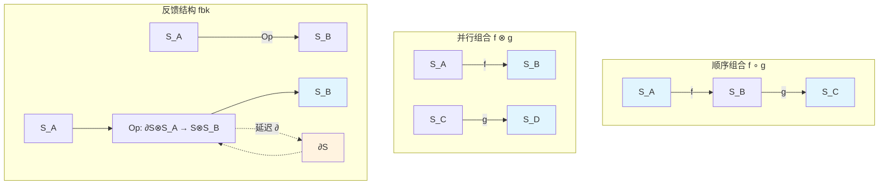
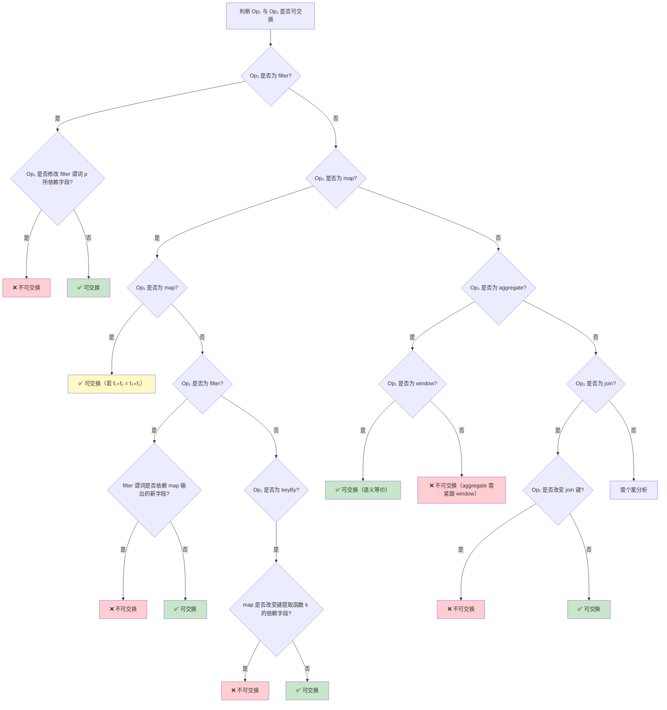
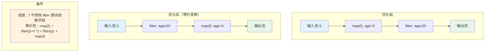
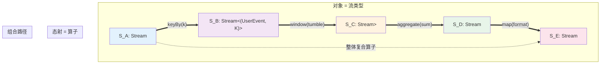
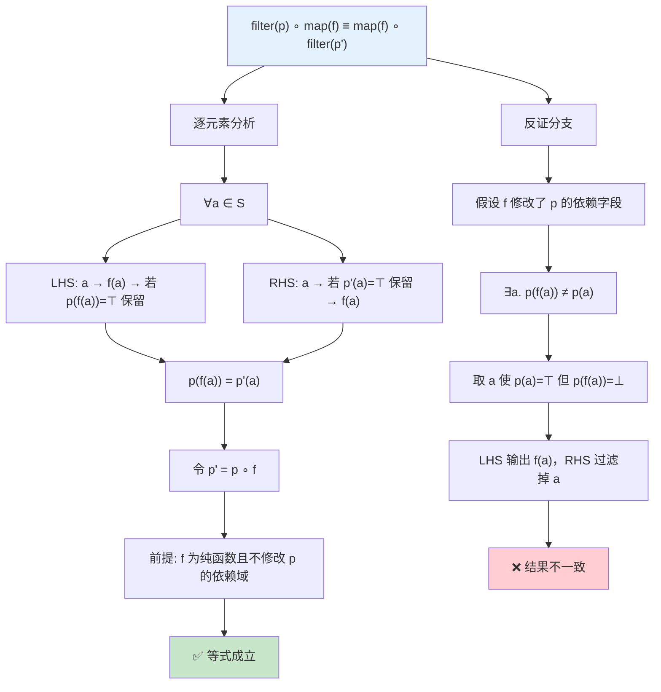
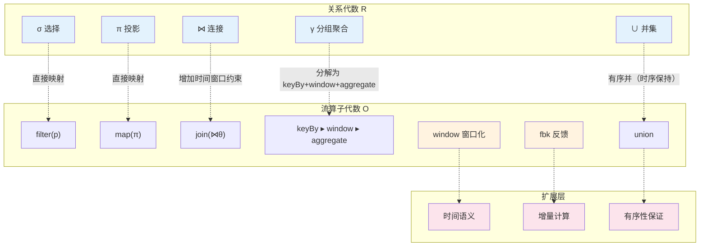

# Stream Operator Algebra and Composition Rules

> **Stage**: Struct/02-properties | **Prerequisites**: [Struct/01-foundation/01.01-stream-dataflow-model.md](unified-streaming-theory.md), [Struct/01-foundation/01.02-categorical-semantics.md](stream-operator-algebra.md) | **Formalization Level**: L5

---

## Table of Contents

- [Stream Operator Algebra and Composition Rules](#stream-operator-algebra-and-composition-rules)
  - [Table of Contents](#table-of-contents)
  - [1. Concept Definitions (Definitions)](#1-concept-definitions-definitions)
    - [1.1 Stream Types and Operator Signatures](#11-stream-types-and-operator-signatures)
    - [1.2 Operator Composition and Identity](#12-operator-composition-and-identity)
    - [1.3 Category-Theoretic Structure of Operator Algebra](#13-category-theoretic-structure-of-operator-algebra)
  - [2. Property Derivation (Properties)](#2-property-derivation-properties)
    - [2.1 Basic Algebraic Properties](#21-basic-algebraic-properties)
    - [2.2 Operator Property Classification](#22-operator-property-classification)
  - [3. Relation Establishment (Relations)](#3-relation-establishment-relations)
    - [3.1 Stream Operator Algebra as Monoid and Partial Monoid](#31-stream-operator-algebra-as-monoid-and-partial-monoid)
    - [3.2 Correspondence with Relational Algebra](#32-correspondence-with-relational-algebra)
    - [3.3 Operator Composition and String Diagrams in Category Theory](#33-operator-composition-and-string-diagrams-in-category-theory)
  - [4. Argumentation Process (Argumentation)](#4-argumentation-process-argumentation)
    - [4.1 Composition Property Determination Table](#41-composition-property-determination-table)
    - [4.2 Boundary Decision Tree](#42-boundary-decision-tree)
  - [5. Formal Proof / Engineering Argument (Proof / Engineering Argument)](#5-formal-proof--engineering-argument-proof--engineering-argument)
    - [5.1 Theorem: Stateless Operators Form a Subcategory of Cartesian Closed Categories](#51-theorem-stateless-operators-form-a-subcategory-of-cartesian-closed-categories)
    - [5.2 Theorem: Formal Proof of filter-pushdown Optimization Rule](#52-theorem-formal-proof-of-filter-pushdown-optimization-rule)
    - [5.3 Theorem: map-fusion Optimization Rule](#53-theorem-map-fusion-optimization-rule)
    - [5.4 Theorem: Partition Elimination Rule](#54-theorem-partition-elimination-rule)
  - [6. Example Verification (Examples)](#6-example-verification-examples)
    - [6.1 Counterexample: Seemingly Commutative but Actually Not](#61-counterexample-seemingly-commutative-but-actually-not)
    - [6.2 Counterexample: Associativity Failure Scenarios](#62-counterexample-associativity-failure-scenarios)
    - [6.3 Equivalent Transformation Example](#63-equivalent-transformation-example)
  - [7. Visualizations (Visualizations)](#7-visualizations-visualizations)
    - [7.1 Category Structure Diagram of Operator Composition](#71-category-structure-diagram-of-operator-composition)
    - [7.2 Inference Tree: filter-pushdown Correctness Proof](#72-inference-tree-filter-pushdown-correctness-proof)
    - [7.3 Hierarchy Diagram of Stream Operator to Relational Algebra Mapping](#73-hierarchy-diagram-of-stream-operator-to-relational-algebra-mapping)
  - [8. References (References)](#8-references-references)

## 1. Concept Definitions (Definitions)

### 1.1 Stream Types and Operator Signatures

**Def-O-02-01** (Stream Type / 流类型). Let $\mathcal{T}$ be the set of value types. A stream type $S \in \mathsf{StreamType}$ is defined as a timestamped finite sequence:

$$
S = \{ (\tau_i, v_i) \}_{i=0}^{n} \quad \text{where} \quad \tau_i \in \mathbb{T},\; v_i \in \mathcal{T},\; \tau_0 \leq \tau_1 \leq \cdots \leq \tau_n
$$

where $\mathbb{T}$ is a totally ordered time domain (discrete or continuous). The partial order relation $\sqsubseteq$ on stream types is defined as the prefix order: $S_1 \sqsubseteq S_2$ if and only if $S_1$ is a temporal prefix of $S_2$.

**Def-O-02-02** (Operator Type Signature / 算子类型签名). A stream processing operator $Op$ has the type signature:

$$
Op : S_1 \times S_2 \times \cdots \times S_n \times \Theta \rightarrow S_{out}
$$

where $S_1, \ldots, S_n$ are input stream types, $S_{out}$ is the output stream type, and $\Theta$ is the operator parameter space (e.g., predicate function $\theta_p$, window specification $\theta_w$, aggregation function $\theta_a$, etc.). When $n = 1$, $Op$ is called a **unary operator** (一元算子); when $n \geq 2$, $Op$ is called a **multi-ary operator** (多元算子).

**Def-O-02-03** (Basic Operator Set / 基本算子集合). The core stream operator set $\mathcal{O}$ contains the following primitives:

| Operator | Signature | Semantic Description |
|----------|-----------|----------------------|
| $\text{map}(f)$ | $S_A \rightarrow S_B$ | $f: A \rightarrow B$ element-wise mapping |
| $\text{filter}(p)$ | $S_A \rightarrow S_A$ | $p: A \rightarrow \{\top, \bot\}$ predicate filtering |
| $\text{keyBy}(k)$ | $S_A \rightarrow S_{A \times K}$ | $k: A \rightarrow K$ key extraction |
| $\text{window}(w)$ | $S_A \rightarrow S_{\mathcal{P}(A)}$ | $w$ cuts stream into finite subsets (windows) |
| $\text{aggregate}(a)$ | $S_{\mathcal{P}(A)} \rightarrow S_B$ | $a: \mathcal{P}(A) \rightarrow B$ aggregation computation |
| $\text{join}(\bowtie_\theta)$ | $S_A \times S_B \rightarrow S_{A \times B}$ | Stream join based on predicate $\theta$ |
| $\text{union}$ | $S_A \times S_A \rightarrow S_A$ | Multi-stream merge (time-ordered interleaving) |
| $\text{split}$ | $S_A \rightarrow S_A \times S_A$ | Single-stream replication into multiple outputs |
| $\text{flatMap}(f)$ | $S_A \rightarrow S_B$ | $f: A \rightarrow \mathcal{P}_{fin}(B)$ one-to-many expansion |

---

### 1.2 Operator Composition and Identity

**Def-O-02-04** (Sequential Composition / 顺序组合). Let $Op_1: S_A \times \Theta_1 \rightarrow S_B$ and $Op_2: S_B \times \Theta_2 \rightarrow S_C$ be two unary operators. Their **sequential composition** (顺序组合, denoted $\circ$ or $\gg$) is defined as:

$$
(Op_2 \circ Op_1)(S_A, \theta_1, \theta_2) \triangleq Op_2(Op_1(S_A, \theta_1), \theta_2) = S_C
$$

Or using the left-to-right streaming notation:

$$
Op_1 \gg Op_2 \;\triangleq\; \lambda S.\, Op_2(Op_1(S))
$$

**Def-O-02-05** (Parallel Composition / 并行组合). Let $Op_1: S_A \rightarrow S_B$ and $Op_2: S_C \rightarrow S_D$. Their **parallel composition** (并行组合, denoted $\otimes$ or $\|$) is defined as:

$$
(Op_1 \otimes Op_2)(S_A, S_C) \triangleq (Op_1(S_A),\; Op_2(S_C)) \in S_B \times S_D
$$

**Def-O-02-06** (Identity Operator / 单位算子). For any stream type $S$, the **identity operator** (单位算子) $\text{id}_S: S \rightarrow S$ is defined as:

$$
\text{id}_S(S_{in}) = S_{in}
$$

That is, $\text{id}_S$ does not transform the stream in any way and directly passes through all elements.

---

### 1.3 Category-Theoretic Structure of Operator Algebra

**Def-O-02-07** (Stream Operator Category $\mathbf{StreamOp}$ / 流算子范畴). Stream operators form a category $\mathbf{StreamOp}$, where:

- **Objects** (对象): The set of all stream types $\mathsf{StreamType}$;
- **Morphisms** (态射): For any objects $S_A, S_B$, $\text{Hom}(S_A, S_B)$ is the set of all operators from $S_A$ to $S_B$;
- **Composition** (复合): Morphism composition is sequential composition $\circ$;
- **Identity** (单位态射): For each object $S$, $\text{id}_S$ is the identity morphism.

**Def-O-02-08** (Symmetric Monoidal Category / 对称幺半范畴). The category $(\mathbf{StreamOp}, \otimes, I)$ forms a **Symmetric Monoidal Category** (对称幺半范畴), where:

1. **Tensor product** (张量积) $\otimes$ is the parallel composition operator;
2. **Unit object** (单位对象) $I$ is the **empty stream type** (空流类型) $S_\epsilon = \{\}$ (stream containing no elements);
3. **Associativity constraint** (结合约束) $\alpha_{A,B,C}: (S_A \otimes S_B) \otimes S_C \xrightarrow{\cong} S_A \otimes (S_B \otimes S_C)$ is induced by the associativity of Cartesian product of streams;
4. **Commutativity constraint** (交换约束) $\sigma_{A,B}: S_A \otimes S_B \xrightarrow{\cong} S_B \otimes S_A$ is induced by the commutativity of Cartesian product;
5. **Left/right unit constraints** (左/右单位约束) $\lambda_A: I \otimes S_A \xrightarrow{\cong} S_A$ and $\rho_A: S_A \otimes I \xrightarrow{\cong} S_A$ are induced by empty product cancellation.

**Def-O-02-09** (Feedback Structure / 反馈结构). Introduce the **delay operator** (延迟算子) $\partial: \mathbf{StreamOp} \rightarrow \mathbf{StreamOp}$. For operator $Op: S_A \rightarrow S_B$, define:

$$
\partial(Op)(S_A) \triangleq Op(\varepsilon \frown S_A^{\langle 1 \rangle})
$$

where $\varepsilon$ is a placeholder empty element and $S_A^{\langle 1 \rangle}$ denotes the suffix of stream $S_A$ with its first element removed. The **feedback operator** (反馈算子) $fbk^S$ feeds the output stream $S$ back to the input after delay: given $Op: \partial S \otimes S_A \rightarrow S \otimes S_B$, define $fbk^S(Op): S_A \rightarrow S_B$ satisfying:

$$
fbk^S(Op)(S_A) = \pi_B\bigl(Op(\partial S_{fbk} \otimes S_A)\bigr), \quad \text{where} \quad S_{fbk} = \pi_S\bigl(Op(\partial S_{fbk} \otimes S_A)\bigr)
$$

That is, output $S$ is re-injected into the input port after delay $\partial$, forming a least fixed-point semantics [^1].

---

## 2. Property Derivation (Properties)

### 2.1 Basic Algebraic Properties

**Lemma-O-02-01** (Associativity of Sequential Composition / 顺序组合的结合性). Let $Op_1: S_A \rightarrow S_B$, $Op_2: S_B \rightarrow S_C$, $Op_3: S_C \rightarrow S_D$ be any three operators. Then:

$$
(Op_3 \circ Op_2) \circ Op_1 \;=\; Op_3 \circ (Op_2 \circ Op_1)
$$

*Proof*. For any input stream $S_A$, expand both sides:

$$
\begin{aligned}
\text{LHS} &= (Op_3 \circ Op_2)(Op_1(S_A)) = Op_3(Op_2(Op_1(S_A))) \\
\text{RHS} &= Op_3((Op_2 \circ Op_1)(S_A)) = Op_3(Op_2(Op_1(S_A)))
\end{aligned}
$$

Both sides are equal, so associativity holds. $\square$

**Lemma-O-02-02** (Bilateral Identity / 单位元的双边性). For any operator $Op: S_A \rightarrow S_B$:

$$
\text{id}_{S_B} \circ Op \;=\; Op \;=\; Op \circ \text{id}_{S_A}
$$

*Proof*. Directly from the definition of $\text{id}$: $\text{id}_{S_B}(Op(S_A)) = Op(S_A)$ and $Op(\text{id}_{S_A}(S_A)) = Op(S_A)$. $\square$

**Lemma-O-02-03** (Bifunctoriality of Parallel Composition / 并行组合的双函子性). Let $Op_1: S_A \rightarrow S_B$, $Op'_1: S_{A'} \rightarrow S_{B'}$, $Op_2: S_B \rightarrow S_C$, $Op'_2: S_{B'} \rightarrow S_{C'}$. Then:

$$
(Op_1 \otimes Op'_1) \circ (Op_2 \otimes Op'_2) \;=\; (Op_1 \circ Op_2) \otimes (Op'_1 \circ Op'_2)
$$

(Under appropriate symmetry constraint adjustments). This is the **interchange law** in Monoidal Streams [^1].

*Proof Sketch*. Apply the pointwise definition of parallel composition to both inputs respectively, using the functoriality of Cartesian product. $\square$

---

### 2.2 Operator Property Classification

**Def-O-02-10** (State Independence / 状态无关性). An operator $Op: S_A \rightarrow S_B$ is called **stateless** (状态无关的) if and only if the output at any time $t$ depends only on the input at time $t$:

$$
\forall t.\; Op(S_A)[t] = f(S_A[t])
$$

where $f$ is a pure function. Operators not satisfying this condition are called **stateful** (状态依赖的), such as window-based aggregation operators.

**Def-O-02-11** (Key Preservation / 键保持性). An operator $Op: S_{A \times K} \rightarrow S_{B \times K}$ is called **key-preserving** (键保持的) if and only if the key of the output stream is the same as that of the input stream:

$$
\forall (\tau, (a, k)) \in S_{in}.\; \exists (\tau', (b, k')) \in S_{out}.\; k = k'
$$

**Def-O-02-12** (Selectivity / 选择性). The **selectivity** (选择性) of an operator $Op: S_A \rightarrow S_B$ is defined as the ratio of output to input element count:

$$
sel(Op) \triangleq \lim_{|S_A| \rightarrow \infty} \frac{|Op(S_A)|}{|S_A|}
$$

- If $\text{sel}(Op) = 1$: **preserving operator** (保持性算子) (e.g., map, keyBy)
- If $\text{sel}(Op) \leq 1$: **reducing operator** (缩减性算子) (e.g., filter, aggregate)
- If $\text{sel}(Op) \geq 1$: **expanding operator** (扩展性算子) (e.g., flatMap)

---

## 3. Relation Establishment (Relations)

### 3.1 Stream Operator Algebra as Monoid and Partial Monoid

**Prop-O-02-01** (Monoid Structure of Stateless Operators / 状态无关算子的幺半群结构). Let $\mathcal{O}_{stateless} \subseteq \mathcal{O}$ be the set of all stateless operators. Then $(\mathcal{O}_{stateless}, \circ, \text{id})$ forms a **Monoid** (幺半群):

1. **Closure** (封闭性): $\forall Op_1, Op_2 \in \mathcal{O}_{stateless}.\; Op_2 \circ Op_1 \in \mathcal{O}_{stateless}$
2. **Associativity** (结合性): Guaranteed by Lemma-O-02-01
3. **Identity** (单位元): $\text{id} \in \mathcal{O}_{stateless}$ and satisfies Lemma-O-02-02

*Proof*. Closure: The composition of stateless operators remains pointwise function composition $f_2 \circ f_1$, which is obviously stateless. Associativity and identity have been proved. $\square$

**Prop-O-02-02** (Partial Monoid Structure of All Operators / 全算子集的偏幺半群结构). The full operator set $(\mathcal{O}, \circ, D, \text{id})$ forms a **Partial Monoid** (偏幺半群), where the domain $D \subseteq \mathcal{O} \times \mathcal{O}$ is:

$$
D = \{ (Op_1, Op_2) \mid \text{codomain}(Op_1) = \text{domain}(Op_2) \}
$$

That is, composition is defined only when the output/input stream types match [^2].

### 3.2 Correspondence with Relational Algebra

| Relational Algebra (关系代数) | Stream Operator | Matching Condition | Extended Explanation |
|--------------------|-----------------|--------------------|----------------------|
| $\sigma_p$ (Selection / 选择) | $\text{filter}(p)$ | Direct correspondence | Preserves time semantics on streams |
| $\pi_{\{a_i\}}$ (Projection / 投影) | $\text{map}(\lambda x.\, x.\{a_i\})$ | Direct correspondence | Can be nested within windows |
| $\bowtie_\theta$ (Join / 连接) | $\text{join}(\bowtie_\theta)$ | Requires window/time boundary | Stream join requires time semantics |
| $\gamma_{G, a}$ (Group Aggregation / 分组聚合) | $\text{keyBy}(k) \gg \text{window}(w) \gg \text{aggregate}(a)$ | Stream requires key partitioning + window | Stream aggregation introduces time dimension |
| $\cup$ (Union / 并集) | $\text{union}$ | Ordered union vs. unordered union | Stream union preserves temporal order |
| $\setminus$ (Difference / 差集) | $\text{join}(\text{anti})$ | Non-direct correspondence | Requires time-window-based compensation |
| $\rho$ (Rename / 重命名) | $\text{map}(\lambda x.\, x\{\text{new}/\text{old}\})$ | Direct correspondence | Field remapping |

**Prop-O-02-03** (Stream Algebra as Extension of Relational Algebra / 流代数对关系代数的扩展). The stream operator algebra $\mathcal{O}$ strictly extends relational algebra $\mathcal{R}$:

1. **Time dimension introduction** (时间维度引入): Stream operators natively carry timestamps $\tau$; relational algebra has no such concept;
2. **Windowing operations** (窗口化操作): The $\text{window}$ operator has no direct counterpart in relational algebra; it transforms unbounded streams into finite relations;
3. **Feedback and recursion** (反馈与递归): The $fbk$ feedback structure allows expressing temporal recursive queries, beyond the expressive power of classical relational algebra;
4. **Monotonicity guarantee** (单调性保证): Stream operators can impose monotonicity constraints to ensure correctness of incremental computation.

### 3.3 Operator Composition and String Diagrams in Category Theory

The following Mermaid diagram shows the representation of stream operator composition in category-theoretic String Diagrams:

---

## 4. Argumentation Process (Argumentation)

### 4.1 Composition Property Determination Table

The following table systematically summarizes the properties of various operator compositions, providing sufficient/necessary conditions or counterexamples for each entry:

| Property | Operator Pair | Holding Condition | Counterexample/Proof Sketch |
|----------|---------------|-------------------|----------------------------|
| **Commutativity** (交换律) | $\text{map}(f) \circ \text{map}(g)$ | Always holds | Function composition is generally non-commutative: $f \circ g \neq g \circ f$ |
| | $\text{filter}(p) \circ \text{filter}(q)$ | Always holds | Predicate conjunction is commutative: $p \land q = q \land p$ |
| | $\text{map}(f) \circ \text{filter}(p)$ | When $f$ does not modify fields $p$ depends on | If $f$ modifies the field $p$ judges, results differ |
| | $\text{keyBy}(k) \circ \text{map}(f)$ | When $k(f(x)) = k(x)$ | If $f$ changes the field required for key extraction |
| | $\text{aggregate}(a) \circ \text{window}(w)$ | Always holds (single input) | The two are naturally sequential; swapping has no semantic meaning |
| | $\text{join} \circ \text{map}$ | **Generally does not hold** | map changes the join key domain |
| **Associativity** (结合律) | $(Op_1 \circ Op_2) \circ Op_3$ | Always holds when types match | Lemma-O-02-01 |
| | $(Op_1 \otimes Op_2) \otimes Op_3$ | Always holds | Associativity of Cartesian product |
| **Distributivity** (分配律) | $\text{window} \circ (\text{map} \otimes \text{id})$ | Window left-distributes over map | Window acting on map output is equivalent to map followed by window |
| | $\text{aggregate} \circ (\text{union})$ | **Does not hold** | aggregate(union(A,B)) ≠ union(aggregate(A), aggregate(B)) |
| | $\text{keyBy}(k) \circ \text{union}$ | $\text{union}(\text{keyBy}(A), \text{keyBy}(B))$ | Distributive under key preservation |
| **Idempotence** (幂等性) | $\text{filter}(p) \circ \text{filter}(p)$ | Always holds | $\text{filter}(p) \circ \text{filter}(p) = \text{filter}(p)$ |
| | $\text{map}(f) \circ \text{map}(f)$ | When $f \circ f = f$ (projective) | Generally $f \circ f \neq f$ |
| | $\text{distinct}$ | Always holds | Deduplication operator is naturally idempotent |
| | $\text{window}(w) \circ \text{window}(w)$ | **Does not hold** | Second windowing changes window boundaries |
| **Monotonicity** (单调性) | Data volume monotonicity | filter, map preserve | aggregate output count ≤ input window count |
| | Latency monotonicity | stateless operators preserve end-to-end latency | stateful operators (with windows) introduce additional buffering latency |
| **Closure** (闭包性) | $\mathcal{O}_{stateless}$ under $\circ$ | Closed | Prop-O-02-01 |
| | $\mathcal{O}$ under $\circ$ | Closed under type matching | Def-O-02-04 requires type compatibility |

### 4.2 Boundary Decision Tree

The following decision tree is used to determine whether any two adjacent operators can be safely exchanged:

---

## 5. Formal Proof / Engineering Argument (Proof / Engineering Argument)

### 5.1 Theorem: Stateless Operators Form a Subcategory of Cartesian Closed Categories

**Thm-O-02-01** (Cartesian Closed Subcategory / 笛卡尔闭子范畴). Let $\mathbf{StreamOp}_{sl}$ be the subcategory containing only stateless operators. Then $\mathbf{StreamOp}_{sl}$ is a subcategory of a **Cartesian Closed Category** (笛卡尔闭范畴, CCC).

*Proof*. We need to verify that the four structures of CCC are preserved in $\mathbf{StreamOp}_{sl}$:

1. **Terminal object** (终对象): The empty stream type $S_\epsilon$ is the terminal object. For any $S_A$, there exists a unique morphism $!_A: S_A \rightarrow S_\epsilon$ (discarding all elements), which is obviously stateless.

2. **Cartesian product** (笛卡尔积): Parallel composition $\otimes$ provides the product structure. Projections $\pi_1: S_A \otimes S_B \rightarrow S_A$ and $\pi_2: S_A \otimes S_B \rightarrow S_B$ are both stateless.

3. **Diagonal map** (对角映射): $\Delta: S_A \rightarrow S_A \otimes S_A$, $\Delta(x) = (x, x)$, stateless.

4. **Exponential object** (指数对象): For any $S_A, S_B$, define the exponential object $S_B^{S_A}$ as the set of stream liftings of all stateless functions $f: A \rightarrow B$. The evaluation map (求值映射) $ev: S_B^{S_A} \otimes S_A \rightarrow S_B$ is defined as $ev(f, x) = f(x)$, which is obviously stateless. Currying (柯里化) $\Lambda: \text{Hom}(S_C \otimes S_A, S_B) \rightarrow \text{Hom}(S_C, S_B^{S_A})$ transforms binary operators into higher-order operators returning functions, preserving statelessness.

Therefore $\mathbf{StreamOp}_{sl}$ is a CCC. $\square$

---

### 5.2 Theorem: Formal Proof of filter-pushdown Optimization Rule

**Thm-O-02-02** (Filter-Pushdown / filter-pushdown 优化规则). Let $Op$ be a stateless operator and $\text{filter}(p)$ be a predicate filtering operator. If $Op$ does not modify the fields that predicate $p$ depends on, then:

$$
Op \circ \text{filter}(p) \;=\; \text{filter}(p) \circ Op
$$

*Proof*. Let $Op = \text{map}(f)$ (general stateless operators can be reduced to pointwise mapping composition). For any element $a$ in input stream $S_A$:

**LHS**: filter first, then map

- If $p(a) = \top$, element passes filter, becomes $f(a)$ in output;
- If $p(a) = \bot$, element is filtered out.

**RHS**: map first, then filter

- Element first becomes $f(a)$;
- Since $f$ does not modify fields $p$ depends on, $p(f(a)) = p(a)$;
- If $p(a) = \top$, $f(a)$ passes filter and is output;
- If $p(a) = \bot$, $f(a)$ is filtered out.

Both sides produce exactly the same output for each element, so the equality holds. $\square$

**Cor-O-02-01** (Filter Through Window / Filter 穿越 Window). If filter predicate $p$ depends only on the element itself (not on timestamps or window metadata), then:

$$
\text{window}(w) \circ \text{filter}(p) \;=\; \text{map}(\text{filter}(p)) \circ \text{window}(w)
$$

That is, filter can be pushed down to execute element-wise inside the window.

*Proof*. Let window function $w$ cut the stream into subsets $W_1, W_2, \ldots$. LHS filters first then windows: windows see the already-filtered stream. RHS windows first then filters each element inside each window. Since $p$ does not depend on window context, element-wise filter inside a window is equivalent to global filter. $\square$

---

### 5.3 Theorem: map-fusion Optimization Rule

**Thm-O-02-03** (Map-Fusion / map-fusion 优化规则). For any two map operators:

$$
\text{map}(f) \circ \text{map}(g) \;=\; \text{map}(f \circ g)
$$

*Proof*. Expand element-wise for input stream $S_A$:

$$
\begin{aligned}
(\text{map}(f) \circ \text{map}(g))(S_A) &= \text{map}(f)\bigl(\{ g(a_i) \}\bigr) \\
&= \{ f(g(a_i)) \} \\
&= \{ (f \circ g)(a_i) \} \\
&= \text{map}(f \circ g)(S_A)
\end{aligned}
$$

Both sides produce the same output for each input element, so fusion equivalence holds. $\square$

**Cor-O-02-02** (Filter-Filter Fusion).

$$
\text{filter}(p) \circ \text{filter}(q) \;=\; \text{filter}(\lambda x.\, p(x) \land q(x))
$$

*Proof*. An element passes the composite filter if and only if it satisfies both $p$ and $q$, i.e., $p \land q$. $\square$

---

### 5.4 Theorem: Partition Elimination Rule

**Thm-O-02-04** (Partition Elimination / 分区消除). Let $\text{keyBy}(k_1)$ be immediately followed by $\text{keyBy}(k_2)$. If $k_2$ depends only on the output of $k_1$ (i.e., there exists function $h$ such that $k_2(x) = h(k_1(x))$), then:

$$
\text{keyBy}(k_2) \circ \text{keyBy}(k_1) \;=\; \text{keyBy}(k_2)
$$

*Proof*. The first keyBy marks elements as $(a, k_1(a))$; the second keyBy marks them as $((a, k_1(a)), k_2(a)) = ((a, k_1(a)), h(k_1(a)))$. If subsequent operators depend only on the outermost key $k_2$, then the inner key $k_1$ is redundant information, and keying directly by $k_2$ suffices. $\square$

---

## 6. Example Verification (Examples)

### 6.1 Counterexample: Seemingly Commutative but Actually Not

**Counterexample 1: Non-commutativity of map and filter**

Let input stream $S = [(1, \text{"age"}=20), (2, \text{"age"}=30)]$. Consider:

- $Op_1 = \text{map}(\lambda x.\, x.\text{age} \leftarrow x.\text{age} + 5)$ (age + 5)
- $Op_2 = \text{filter}(\lambda x.\, x.\text{age} \leq 25)$ (filter age ≤ 25)

**Filter first, then map**:

- After filter: $[(1, 20)]$ (30 filtered out)
- After map: $[(1, 25)]$

**Map first, then filter**:

- After map: $[(1, 25), (2, 35)]$
- After filter: $[(1, 25)]$ (35 filtered out)

In this example the results happen to be the same by coincidence. Change input to $S = [(1, 21), (2, 30)]$:

- Filter then map: $[(1, 21)] \rightarrow [(1, 26)]$
- Map then filter: $[(1, 26), (2, 35)] \rightarrow [(1, 26)]$ (still coincidental)

Change again to $S = [(1, 22), (2, 30)]$:

- Filter then map: $[(1, 22)] \rightarrow [(1, 27)]$ — 22 ≤ 25 kept, +5 gives 27
- Map then filter: $[(1, 27), (2, 35)] \rightarrow []$ — 27 > 25 filtered out!

**Different results**: filter-then-map outputs $[(1, 27)]$; map-then-filter outputs empty stream $[]$.

**Counterexample 2: Non-commutativity of join and map**

Let $S_1 = [(k=1, v=10)]$, $S_2 = [(k=1, v=20)]$, join key is $k$:

- $Op_1 = \text{join}_{k}$ (join on $k$)
- $Op_2 = \text{map}(\lambda x.\, x.k \leftarrow x.k + 1)$ (key + 1)

Join then map: outputs $[(k=2, v_1=10, v_2=20)]$ (match succeeds first, then key changed).

Map then join: $S_1$ becomes $[(k=2, v=10)]$, $S_2$ becomes $[(k=2, v=20)]$, then join also outputs $[(k=2, v_1=10, v_2=20)]$. They seem the same, but if $S_2 = [(k=2, v=20)]$:

- Join then map: $S_1.k=1$ and $S_2.k=2$ do not match, output empty
- Map then join: $S_1.k=2$ and $S_2.k=2$ match, output $[(2, 10, 20)]$

Results are completely different.

### 6.2 Counterexample: Associativity Failure Scenarios

**Counterexample 3: Associativity failure of window aggregation**

Let window operator $\text{window}(\text{tumble}, 5s)$ be a 5-second **tumbling window** (翻滚窗口), and $\text{aggregate}(\text{sum})$ be sum aggregation. Consider:

- $Op_1 = \text{window}(5s)$
- $Op_2 = \text{aggregate}(\text{sum})$
- $Op_3 = \text{map}(\lambda x.\, x \times 2)$ (multiply result by 2)

$(Op_3 \circ Op_2) \circ Op_1$: window first, then aggregate, then multiply by 2. Multiply each window sum by 2 separately.

$Op_3 \circ (Op_2 \circ Op_1)$: Since the output type of $Op_2 \circ Op_1$ is $S_{\mathbb{R}}$ (numeric stream), matching the input type of $Op_3$, semantics are the same and associativity holds. This example is insufficient.

A true counterexample requires **type mismatch** or **state sharing**:

Let $Op_1 = \text{keyBy}(k_1)$, $Op_2 = \text{aggregate}(\text{sum})$ (keyed aggregation), $Op_3 = \text{keyBy}(k_2)$ (re-keying).

$(Op_3 \circ Op_2) \circ Op_1$: aggregate by $k_1$ first, then repartition by $k_2$.

$Op_3 \circ (Op_2 \circ Op_1)$: Typing-wise, the output of $Op_2 \circ Op_1$ is an aggregated result stream, which can directly connect to $Op_3$.

Associativity holds when types match, but fails at the **physical execution level**: $(Op_3 \circ Op_2) \circ Op_1$ means "repartition after aggregation", while $Op_3 \circ (Op_2 \circ Op_1)$ if interpreted by the engine as "do some operation within $k_1$ partitions first" may produce different numbers of network Shuffles.

A more rigorous associativity counterexample comes from **non-deterministic operators**:

Let $\text{sample}(p)$ independently sample each element with probability $p$ (non-deterministic filter):

Input stream $S = [a, b]$, $Op_1 = \text{sample}(0.5)$, $Op_2 = \text{sample}(0.5)$.

$(Op_2 \circ Op_1)(S)$: first sample to get possible $[a]$ or $[b]$ or $[a,b]$ or $[]$, then sample again.

$Op_2 \circ (Op_1)(S)$ has the same semantics (associativity holds in expectation, but each run produces different samples at the sample level).

True associativity counterexample: Let $Op_1 = \text{window}(\text{session}, g)$ be a **session window** (会话窗口, dynamic boundary), $Op_2 = \text{aggregate}(\text{count})$, $Op_3 = \text{window}(\text{tumble}, 10s)$.

$(Op_3 \circ Op_2) \circ Op_1$: session window count first, then 10-second tumbling window on the count results.

$Op_3 \circ (Op_2 \circ Op_1)$: Type mismatch, because $Op_2 \circ Op_1$ outputs a numeric stream, and $Op_3$ expects an input stream, but windowing a numeric stream is semantically meaningless (window operators typically act on raw event streams).

### 6.3 Equivalent Transformation Example

The following Mermaid diagram shows the equivalent transformation before and after filter-pushdown optimization:

---

## 7. Visualizations (Visualizations)

### 7.1 Category Structure Diagram of Operator Composition

### 7.2 Inference Tree: filter-pushdown Correctness Proof

### 7.3 Hierarchy Diagram of Stream Operator to Relational Algebra Mapping

---

## 8. References (References)

[^1]: Di Lavore, E., De Felice, G., & Román, S. (2022). "Monoidal Streams for Dataflow Programming." *arXiv preprint arXiv:2202.02061*. <https://arxiv.org/abs/2202.02061>

[^2]: Kähler, D., & Moschoyiannis, S. (2016). "An Algebraic Framework for Compositional Reasoning about Dataflow Streaming." *Brunel University London*. <https://bura.brunel.ac.uk/bitstream/2438/14112/1/Fulltext.pdf>
