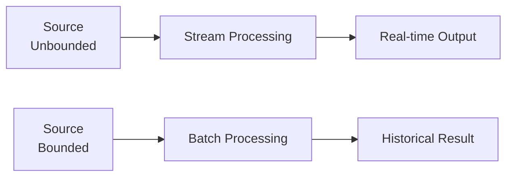

# Stream Processing Fundamentals

> **Stage**: Knowledge/01-concept-atlas | **Prerequisites**: None | **Formal Level**: L2-L3
>
> Core concepts: data streams, bounded vs unbounded streams, stream processing vs batch processing, and system components.

---

## 1. Definitions

**Def-K-01-01: Data Stream**

An infinite sequence $S = \langle e_1, e_2, e_3, \ldots \rangle$ where each element $e_i = (v_i, t_i, k_i)$:

- $v_i$: event value
- $t_i$: event timestamp
- $k_i$: key (optional)

Formal definition: $S: \mathbb{T} \rightharpoonup \mathcal{V}$

**Def-K-01-02: Bounded Stream**

Defined on finite interval $[t_{start}, t_{end}]$:

$$
S_{bounded} = \{ (v, t, k) \in S \mid t_{start} \leq t \leq t_{end} \}, \quad |S_{bounded}| < \infty
$$

**Def-K-01-03: Unbounded Stream**

Defined on infinite time domain:

$$
S_{unbounded} = \{ (v, t, k) \in S \mid t \in [t_{start}, \infty) \}, \quad |S_{unbounded}| = \infty
$$

**Def-K-01-04: Stream Processing**

Computation process $P$ mapping input stream to output stream:

$$
P: S_{in} \rightarrow S_{out}
$$

Characteristics: incremental, continuous, low-latency (< second).

**Def-K-01-05: Batch Processing**

Offline computation on bounded dataset:

$$
B: D \rightarrow R
$$

Assumes data is fully available before computation.

---

## 2. Properties

**Prop-K-01-01: Stream-Batch Duality**

Batch is a special case of stream where the stream is bounded.

**Prop-K-01-02: Latency Hierarchy**

$$
\text{Stream Processing} \ll \text{Micro-batch} \ll \text{Batch Processing}
$$

---

## 3. Relations

- **with Dataflow Model**: Stream processing implements the Dataflow Model's continuous computation.
- **with Event-Driven Architecture**: Streams are the backbone of event-driven systems.

---

## 4. Argumentation

**Stream vs Batch Selection**:

| Factor | Stream | Batch |
|--------|--------|-------|
| Latency | Milliseconds | Minutes/Hours |
| Data volume | Unbounded | Bounded |
| Use case | Real-time decisions | Historical analysis |
| Complexity | Higher | Lower |

---

## 5. Engineering Argument

**Unified Batch-Stream Processing**: Modern engines (Flink, Spark Structured Streaming) support both batch and stream processing with the same API, enabling "Kappa architecture" where a single streaming pipeline replaces separate batch and speed layers.

---

## 6. Examples

```java
// Flink DataStream API
StreamExecutionEnvironment env = StreamExecutionEnvironment.getExecutionEnvironment();
DataStream<Event> stream = env.fromSource(kafkaSource, WatermarkStrategy.forBoundedOutOfOrderness(Duration.ofSeconds(5)), "Kafka Source");
stream.filter(e -> e.getValue() > 100)
    .map(e -> new EnrichedEvent(e))
    .addSink(new ElasticsearchSink<>());
```

---

## 7. Visualizations

**Stream Processing Concepts**:



---

## 8. References
