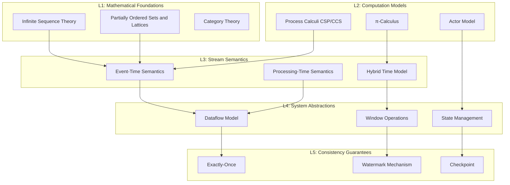
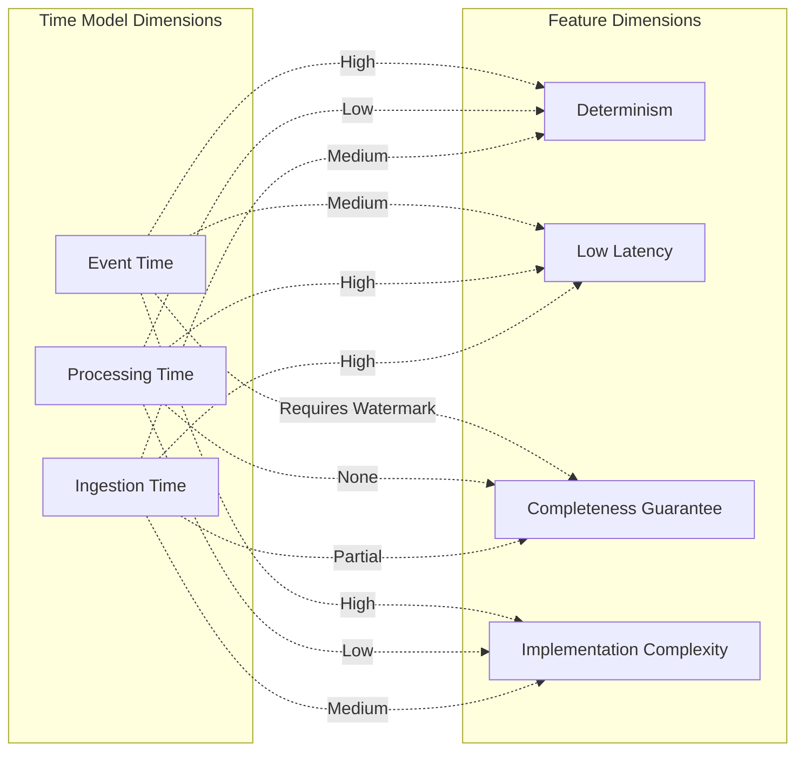
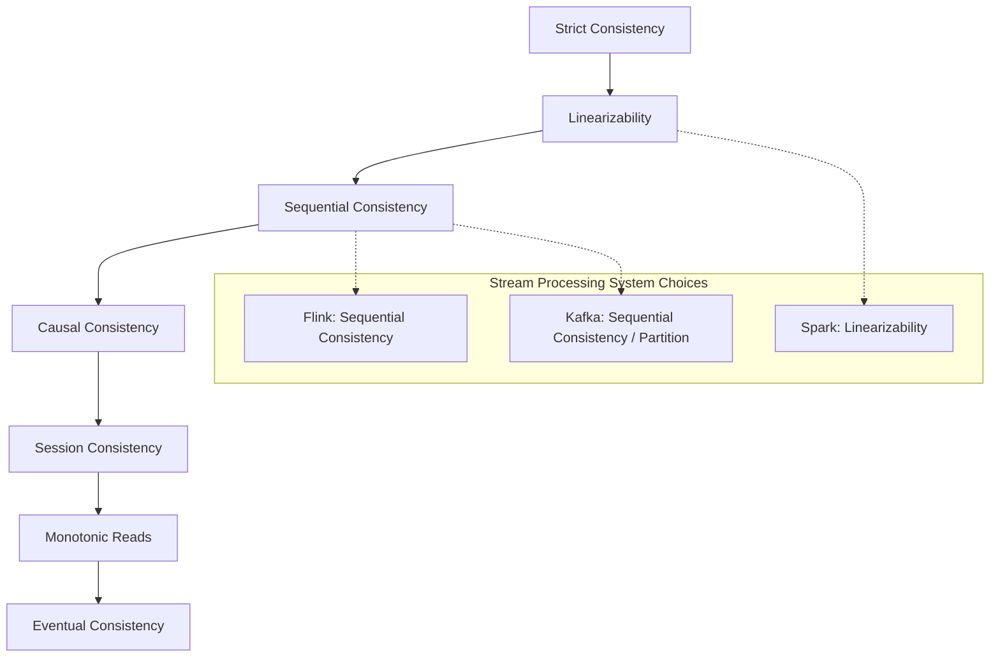
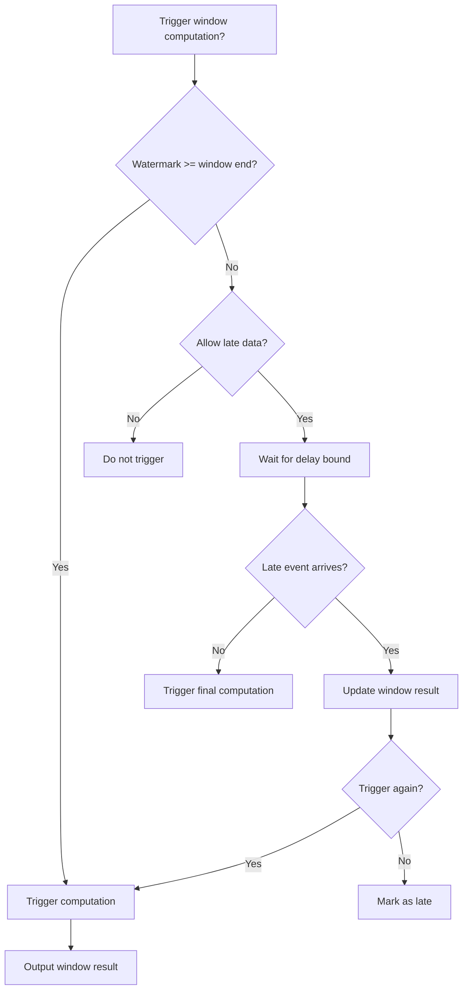
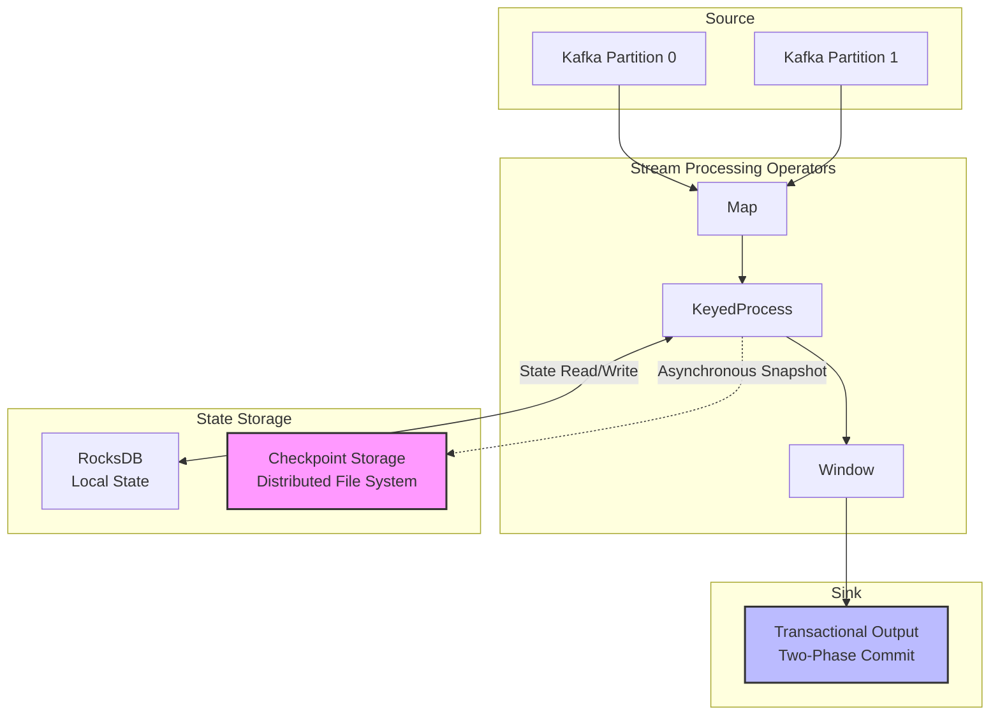

# Formal Theory of Stream Processing Semantics

> Stage: Struct/01-foundation | Prerequisites: [00-INDEX.md](../00-INDEX.md), [00-INDEX.md](../00-INDEX.md) | Formalization Level: L5-L6

---

## 1. Definitions

### 1.1 Formal Definition of Streams

#### Def-S-01-50: Stream as an Infinite Sequence

**Definition (Stream Type)**: Let $\mathcal{D}$ be the data domain and $\mathcal{T}$ the timestamp domain (a totally ordered set). An **event stream** $\mathcal{S}$ is defined as an infinite sequence of timestamped events:

$$\mathcal{S} : \mathbb{N} \rightarrow \mathcal{D} \times \mathcal{T} \times \mathcal{T}$$

For each event $e_i = (d_i, t_i^{(e)}, t_i^{(p)})$:

- $d_i \in \mathcal{D}$: event payload data
- $t_i^{(e)} \in \mathcal{T}$: **Event Time**, the moment the event occurred
- $t_i^{(p)} \in \mathcal{T}$: **Processing Time**, the moment the event is processed by the system

$$\mathcal{S} = \langle e_0, e_1, e_2, \ldots \rangle = \langle (d_i, t_i^{(e)}, t_i^{(p)}) \rangle_{i \in \mathbb{N}}$$

**Definition (Event-Time Ordering)**: Stream $\mathcal{S}$ satisfies **non-decreasing event time** if and only if:

$$\forall i, j \in \mathbb{N} : i \leq j \Rightarrow t_i^{(e)} \leq t_j^{(e)}$$

**Note**: Real-world streams often exhibit out-of-order behavior, i.e., $t_i^{(e)} > t_j^{(e)}$ but $i < j$.

#### Def-S-01-51: Time Domain Structure

**Definition (Time Structure)**: The time domain $(\mathcal{T}, \leq, +, 0)$ forms a commutative monoid with a total order, satisfying:

1. **Totality**: $(\mathcal{T}, \leq)$ is a totally ordered set
2. **Monotonicity**: $\forall \tau_1, \tau_2, \delta \in \mathcal{T} : \tau_1 \leq \tau_2 \Rightarrow \tau_1 + \delta \leq \tau_2 + \delta$
3. **Identity Element**: $\exists 0 \in \mathcal{T} : \forall \tau \in \mathcal{T} : \tau + 0 = \tau$

**Examples**: In practice, $\mathcal{T}$ is often:

- Discrete time: $\mathcal{T} = \mathbb{N}$ (millisecond timestamps)
- Continuous time: $\mathcal{T} = \mathbb{R}_{\geq 0}$

#### Def-S-01-52: Event-Time vs. Processing-Time Semantics

**Definition (Event-Time Semantics)**: A stream processing operator $\mathcal{O}$ follows **event-time semantics** if and only if its output depends solely on the event timestamps of input events:

$$\mathcal{O}(\mathcal{S}) = f\left(\{(d_i, t_i^{(e)}) \mid e_i \in \mathcal{S}\}\right)$$

where $f$ is a pure function that does not involve $t_i^{(p)}$.

**Definition (Processing-Time Semantics)**: Operator $\mathcal{O}$ follows **processing-time semantics** if and only if:

$$\mathcal{O}(\mathcal{S})(\tau) = f\left(\{e_i \in \mathcal{S} \mid t_i^{(p)} \leq \tau\}\right)$$

where $\tau$ is the current processing time.

**Definition (Hybrid Time Model)**: Let $\alpha \in [0, 1]$ be a mixing coefficient. The **hybrid time semantics** is defined as:

$$\mathcal{O}_{\alpha}(\mathcal{S}) = \alpha \cdot \mathcal{O}^{(e)}(\mathcal{S}) + (1 - \alpha) \cdot \mathcal{O}^{(p)}(\mathcal{S})$$

In practice, event-time semantics is preferred ($\alpha = 1$), and processing time is used for triggering or timeout mechanisms.

#### Def-S-01-53: Stream Completeness and Boundedness

**Definition (Stream Completeness)**: Stream $\mathcal{S}$ is **complete** at event time $\tau$ if and only if:

$$\text{Complete}(\mathcal{S}, \tau) \triangleq \forall e = (d, t^{(e)}, t^{(p)}) \in \mathcal{S} : t^{(e)} \leq \tau \Rightarrow e \text{ has been processed}$$

**Definition (Bounded Disorder)**: Stream $\mathcal{S}$ satisfies **bounded disorder** if and only if there exists a delay bound $\delta_{max} \in \mathcal{T}$:

$$\forall e_i, e_j \in \mathcal{S} : t_i^{(e)} < t_j^{(e)} \Rightarrow t_i^{(p)} \leq t_j^{(p)} + \delta_{max}$$

That is, no event arrives delayed by more than $\delta_{max}$.

---

### 1.2 Formalization of Window Operations

#### Def-S-01-54: Window Type Definitions

**Definition (Window Function)**: A **window assigner** $W$ is a function that maps events to a set of window identifiers:

$$W : \mathcal{D} \times \mathcal{T} \rightarrow 2^{\mathcal{W}}$$

where $\mathcal{W}$ is the set of window identifiers, and each window $w \in \mathcal{W}$ is associated with a time interval $[w_{start}, w_{end})$.

**Definition (Tumbling Window)**: A tumbling window assigner of fixed size $T$:

$$W_{tumble}(d, t^{(e)}) = \left\{w_k \mid k = \left\lfloor \frac{t^{(e)}}{T} \right\rfloor \wedge [w_{start}, w_{end}) = [kT, (k+1)T)\right\}$$

**Definition (Sliding Window)**: A sliding window assigner of size $T$ and slide step $S$:

$$W_{slide}(d, t^{(e)}) = \left\{w_k \mid k \in \mathbb{Z} \wedge t^{(e)} \in [kS, kS + T)\right\}$$

**Definition (Session Window)**: A session window assigner with session timeout $\Delta$ defines a window as a maximal sequence of events whose time gaps do not exceed $\Delta$:

$$W_{session}(d, t^{(e)}) = \left\{w \mid \forall e_i, e_j \in w : |t_i^{(e)} - t_j^{(e)}| \leq \Delta \wedge \not\exists e_k : |t_k^{(e)} - t_w^{center}| < \frac{\Delta}{2}\right\}$$

where $t_w^{center}$ is the center time of the window.

---

## 2. Properties

### 2.1 Formalization of Operational Semantics

#### Def-S-01-55: Core Operator Formal Definitions

**Definition (Map Operator)**: Given a function $f : \mathcal{D}_1 \rightarrow \mathcal{D}_2$, the **Map** operator is defined as:

$$\text{Map}_f : \mathcal{S}_1 \rightarrow \mathcal{S}_2$$

$$\text{Map}_f(\langle (d_i, t_i^{(e)}, t_i^{(p)}) \rangle) = \langle (f(d_i), t_i^{(e)}, t_{now}) \rangle$$

**Property**: Map preserves event-time ordering (event time unchanged).

**Definition (Filter Operator)**: Given a predicate $P : \mathcal{D} \rightarrow \{\top, \bot\}$:

$$\text{Filter}_P(\mathcal{S}) = \langle (d_i, t_i^{(e)}, t_i^{(p)}) \in \mathcal{S} \mid P(d_i) = \top \rangle$$

**Definition (FlatMap Operator)**: Given an unfolding function $f : \mathcal{D} \rightarrow \mathcal{D}^*$:

$$\text{FlatMap}_f(\mathcal{S}) = \text{flatten}(\langle f(d_i) \times \{(t_i^{(e)}, t_i^{(p)})\} \rangle_{i})$$

where $\text{flatten}$ flattens the nested sequence.

#### Lemma-S-01-01: Monotonicity of Stateless Operators

**Lemma (Monotonicity of Stateless Operators)**: Let $\mathcal{O} \in \{\text{Map}, \text{Filter}, \text{FlatMap}\}$ be a stateless operator. Then $\mathcal{O}$ satisfies **stream monotonicity**:

$$\mathcal{S}_1 \preceq \mathcal{S}_2 \Rightarrow \mathcal{O}(\mathcal{S}_1) \preceq \mathcal{O}(\mathcal{S}_2)$$

where the prefix order $\preceq$ is defined as: $\mathcal{S}_1 \preceq \mathcal{S}_2$ if and only if $\mathcal{S}_1$ is a finite prefix of $\mathcal{S}_2$.

*Proof*: Stateless operators process events one by one, and output depends only on the current input event. If $\mathcal{S}_2 = \mathcal{S}_1 \circ \langle e \rangle$, then $\mathcal{O}(\mathcal{S}_2) = \mathcal{O}(\mathcal{S}_1) \circ \mathcal{O}(\langle e \rangle)$, satisfying the prefix order. $\square$

#### Def-S-01-56: Formalization of Join Operators

**Definition (Window Join)**: Let $\mathcal{S}_1, \mathcal{S}_2$ be two input streams, $W$ a window assigner, and $\bowtie_{\theta}$ a join condition (equijoin or range). A **window join** is defined as:

$$\mathcal{S}_1 \Join_W^{\theta} \mathcal{S}_2 = \bigcup_{w \in \mathcal{W}} \left\{(d_1, d_2, t^{(e)}, t^{(p)}) \middle| \begin{array}{l} e_1 = (d_1, t_1^{(e)}, t_1^{(p)}) \in \mathcal{S}_1 \cap w \\ e_2 = (d_2, t_2^{(e)}, t_2^{(p)}) \in \mathcal{S}_2 \cap w \\ \theta(d_1, d_2) = \top \\ t^{(e)} = \max(t_1^{(e)}, t_2^{(e)}) \end{array}\right\}$$

**Definition (Interval Join)**: Given a time bound $\delta$, an interval join is defined as:

$$\mathcal{S}_1 \Join_{\delta} \mathcal{S}_2 = \left\{(d_1, d_2) \middle| \begin{array}{l} (d_1, t_1^{(e)}, \_) \in \mathcal{S}_1 \\ (d_2, t_2^{(e)}, \_) \in \mathcal{S}_2 \\ |t_1^{(e)} - t_2^{(e)}| \leq \delta \end{array}\right\}$$

### 2.2 Stateful Operation Semantics

#### Def-S-01-57: State Space Definition

**Definition (Operator State)**: The **state space** $\Sigma$ of a stateful operator is defined as:

$$\Sigma = \mathcal{D}^* \times \mathcal{T} \times \mathcal{K} \rightarrow \mathcal{V}$$

where:

- $\mathcal{K}$: key space (Keyed State)
- $\mathcal{V}$: value space
- $\mathcal{T}$: current processing timestamp

**Definition (State Transition Function)**: The semantics of a stateful operator is defined by a **state transition function**:

$$\delta : \Sigma \times \mathcal{E} \rightarrow \Sigma \times \mathcal{E}^*$$

where input $(\sigma, e)$ produces a new state $\sigma'$ and an output event sequence.

**Definition (Aggregate Operator)**: Let $\oplus : \mathcal{V} \times \mathcal{D} \rightarrow \mathcal{V}$ be an aggregate function with initial value $v_0$. **Incremental aggregation** is defined as:

$$\text{Aggregate}_{\oplus}(\langle d_1, d_2, \ldots, d_n \rangle) = v_0 \oplus d_1 \oplus d_2 \oplus \cdots \oplus d_n$$

State transition: $\sigma_{k+1} = \sigma_k \oplus d_{k+1}$

---

## 3. Relations

### 3.1 Relation to Process Calculi

#### Def-S-01-58: Encoding Streams into Process Calculi

**Definition (CCS Encoding)**: Stream $\mathcal{S} = \langle e_0, e_1, \ldots \rangle$ can be encoded as a CCS process:

$$\llbracket \mathcal{S} \rrbracket_{CCS} = \bar{e_0}.\bar{e_1}.\bar{e_2}.\ldots$$

where $\bar{e_i}$ denotes the action of outputting event $e_i$.

**Definition (CSP Encoding)**: Stream as a CSP event sequence:

$$\llbracket \mathcal{S} \rrbracket_{CSP} = \langle e_0 \rightarrow e_1 \rightarrow e_2 \rightarrow \ldots \rangle$$

using CSP sequential composition $a \rightarrow P$ to represent an event followed by its continuation.

#### Thm-S-01-30: Process Equivalence of Stream Processing

**Theorem (Computational Expressiveness Equivalence)**: A stream processing system under event-time semantics has the same computational expressiveness as a **deterministic CSP process**.

Formal statement:

$$\forall \mathcal{P}_{stream} : \exists P_{CSP} : \llbracket \mathcal{P}_{stream} \rrbracket_{CSP} \approx P_{CSP}$$

where $\approx$ denotes bisimulation equivalence.

*Proof Sketch*:

1. **Encoding direction**: Map each operator to a CSP process
   - Map $\rightarrow$ prefix action transformation
   - Filter $\rightarrow$ conditional choice
   - Window $\rightarrow$ buffer process + timeout
2. **Semantics preservation**: Prove that event-time partial order is preserved in CSP traces
3. **Reverse encoding**: A deterministic CSP process can be encoded as a stateful stream operator

$\square$

#### Def-S-01-59: Stream Processing Encoding in $\pi$-Calculus

For scenarios requiring dynamic stream creation (e.g., FlatMap unfolding), $\pi$-calculus provides stronger expressiveness:

$$\llbracket \text{FlatMap}_f \rrbracket_{\pi} = \prod_{d \in f(d_{in})} (\nu c_d)(\bar{c_d}\langle d \rangle \mid !c_d(x).\bar{out}\langle x \rangle)$$

where channels $c_d$ are dynamically created to transmit unfolded events.

### 3.2 Relation to the Dataflow Model

#### Def-S-01-60: Dataflow Model Formalization

**Definition (Dataflow Graph)**: The Dataflow model is defined as a directed graph $G = (V, E, \lambda)$:

- $V$: set of operators
- $E \subseteq V \times V$: data dependency edges
- $\lambda : E \rightarrow \mathcal{P}(\mathcal{T})$: time-domain labels on edges

**Definition (Time-Domain Calculus)**: Time-domain calculus of the Dataflow model:

$$\lambda(v_{out}) = \bigsqcup_{v_{in} \in \text{pred}(v_{out})} \lambda(v_{in}) \oplus \delta_v$$

where $\oplus$ is a time offset and $\delta_v$ is the processing delay of operator $v$.

#### Thm-S-01-31: Correspondence Between Stream Processing and the Dataflow Model

**Theorem (Model Correspondence)**: Under event-time semantics, a stream processing system has a **structure-preserving mapping** to the Millwheel/Dataflow model:

$$\Phi : \text{StreamOps} \rightarrow \text{Dataflow}$$

satisfying:

1. **Operator correspondence**: $\Phi(\text{Map}_f) = \text{ParDo}_f$
2. **Window correspondence**: $\Phi(\text{Window}_W) = \text{GroupByKey}_W$
3. **Time correspondence**: $\Phi(t^{(e)}) = \text{EventTimestamp}$
4. **Trigger correspondence**: $\Phi(\text{Trigger}) = \text{Watermark}$-based firing

*Proof*: By constructing a homomorphism and verifying structure preservation. $\square$

### 3.3 Relation to the Actor Model

#### Def-S-01-61: Actor Model Encoding of Streams

**Definition (Stream Operator as Actor)**: Each stream operator can be modeled as an **Actor**:

$$\text{Actor}_O = \langle \text{state}, \text{mailbox}, \text{behavior} \rangle$$

- **mailbox**: input event queue (ordered buffer)
- **behavior**: event processing logic (receive $\rightarrow$ process $\rightarrow$ send)

**Definition (Stream Topology as Actor System)**: A stream processing topology $\mathcal{T}$ is encoded as an actor system:

$$\llbracket \mathcal{T} \rrbracket_{Actor} = \{A_v \mid v \in V_{\mathcal{T}}\} \cup \{\text{Stream}_e \mid e \in E_{\mathcal{T}}\}$$

where $A_v$ is the operator actor and $\text{Stream}_e$ is the connecting actor (or direct actor reference).

#### Thm-S-01-32: Semantic Correspondence Between Actor and Stream Processing

**Theorem (Semantic Correspondence)**: Under the constraint of no shared mutable state, the Actor model and stream processing systems are **weakly bisimulation equivalent**:

$$\llbracket \mathcal{T} \rrbracket_{Actor} \approx_{weak} \mathcal{T}$$

**Key Differences**:

| Feature | Actor Model | Stream Processing Model |
|---------|-------------|------------------------|
| Communication Pattern | Asynchronous messages | Dataflow push |
| Time Semantics | No built-in time | Event time as first-class citizen |
| State Management | Actor-local | Key-value partitioned state |
| Consistency | Depends on implementation | Explicit semantic guarantees |

---

## 4. Argumentation

### 4.1 Semantic Choice Argument for Time Models

#### Argument 1: Event Time vs. Processing Time

**Proposition**: Under the bounded disorder assumption, event-time semantics provides stronger determinism guarantees than processing-time semantics.

**Argument**:

Let $\mathcal{S}$ be a bounded-disorder stream (delay bound $\delta_{max}$), and consider window aggregation results.

**Problems with Processing-Time Semantics**:

- Output depends on event arrival timing
- Network jitter, backpressure, and resource contention introduce nondeterminism
- The same input stream produces different results across different runs

Formalization: There exist $\mathcal{S}_1 \equiv_{data} \mathcal{S}_2$ (data-equivalent but different arrival times) such that:

$$\text{Window}_W^{(p)}(\mathcal{S}_1) \neq \text{Window}_W^{(p)}(\mathcal{S}_2)$$

**Advantages of Event-Time Semantics**:

- Output depends only on event timestamps
- Network latency does not affect result correctness
- Reproducibility: same input $\Rightarrow$ same output

$$\mathcal{S}_1 \equiv_{data} \mathcal{S}_2 \Rightarrow \text{Window}_W^{(e)}(\mathcal{S}_1) = \text{Window}_W^{(e)}(\mathcal{S}_2)$$

**Conclusion**: Event-time semantics is a **necessary condition** for achieving deterministic computation.

### 4.2 Semantic Argument for Watermark Theory

#### Def-S-01-62: Watermark Formalization

**Definition (Watermark)**: A **Watermark** is a monotonically increasing lower bound on event time:

$$WM : \mathcal{T}^{(p)} \rightarrow \mathcal{T}^{(e)}$$

satisfying:

1. **Monotonicity**: $\tau_1 \leq \tau_2 \Rightarrow WM(\tau_1) \leq WM(\tau_2)$
2. **Completeness Promise**: The system promises that no event with event time $> WM(\tau)$ and processing time $\leq \tau$ exists

**Definition (Completeness Promise Violation)**: Let $\mathcal{S}_{actual}$ be the actual event set and $\mathcal{S}_{observed}$ the observed event set:

$$\text{Violation}(WM, \tau) \triangleq \exists e \in \mathcal{S}_{actual} : t^{(e)} > WM(\tau) \wedge t^{(p)} \leq \tau \wedge e \notin \mathcal{S}_{observed}$$

#### Argument 2: Trade-off Between Watermark and Completeness

**Theorem (Uncertainty Principle)**: In the presence of unbounded disorder, no perfect Watermark strategy can simultaneously satisfy:

1. **Zero Latency**: $WM(\tau) = \tau$ (Watermark advances in real time)
2. **Zero Loss**: $\text{Violation}(WM, \tau) = \bot$ holds for all $\tau$

*Proof*:

- Assume zero latency, then $WM(\tau) = \tau$
- Consider a delayed event $e$ satisfying $t^{(e)} = \tau - \epsilon$ but $t^{(p)} = \tau + \delta$ (delayed arrival)
- At time $\tau$, the system cannot know whether $e$ exists
- If the Watermark advances, the subsequent arrival of $e$ constitutes a violation
- If the Watermark does not advance, the delay $> \epsilon$, violating zero latency

$\square$

**Practical Strategy**: Adopt **heuristic Watermark** + **late-data handling**:

$$WM_{heuristic}(\tau) = \tau - \delta_{expected} - \epsilon$$

where $\delta_{expected}$ is the expected delay and $\epsilon$ is a safety margin.

### 4.3 Formalization of Exactly-Once Semantics

#### Def-S-01-63: Delivery Guarantee Levels

**Definition (Delivery Guarantee)**: Let $\mathcal{O}$ be an output operation, $\mathcal{E}_{out}$ the expected output set, and $\mathcal{E}_{actual}$ the actual output set:

| Guarantee Level | Formal Definition | Semantics |
|-----------------|-------------------|-----------|
| At-most-once | $\mathcal{E}_{actual} \subseteq \mathcal{E}_{out}$ | May lose |
| At-least-once | $\mathcal{E}_{out} \subseteq \mathcal{E}_{actual}$ | May duplicate |
| Exactly-once | $\mathcal{E}_{actual} = \mathcal{E}_{out}$ | Precise delivery |

**Definition (Idempotence)**: Operator $f$ is **idempotent** if and only if:

$$f(f(x)) = f(x)$$

**Definition (Deterministic Replay)**: A system supports **deterministic replay** if and only if:

$$\forall \mathcal{S}, checkpoint : \text{Replay}(\mathcal{S}, checkpoint) = \text{Original}(\mathcal{S})$$

---

## 5. Proof / Engineering Argument

### 5.1 Hierarchy of Consistency Models

#### Def-S-01-64: Consistency Model Formalization

**Definition (Internal Consistency)**: A stream processing system satisfies **internal consistency** if and only if:

$$\forall w \in \mathcal{W} : \text{WindowResult}(w) = \bigoplus_{e \in w} f(e)$$

That is, the window result equals the exact aggregation of events within the window.

**Definition (Eventual Consistency)**: A system satisfies **eventual consistency** if and only if:

$$\exists \tau_{final} : \forall \tau > \tau_{final} : \text{State}(\tau) = \text{State}_{correct}$$

That is, after finite time the state converges to the correct value.

**Definition (Strict Consistency / Linearizability)**: A system satisfies **strict consistency** if and only if:

$$\forall op_1, op_2 : \text{happens-before}(op_1, op_2) \Rightarrow \text{visible-order}(op_1, op_2)$$

All operations appear to complete instantaneously at a global point in time.

#### Thm-S-01-33: Consistency Level Inclusion Relations

**Theorem (Consistency Hierarchy)**: Consistency models form a strict inclusion hierarchy:

$$\text{Strict} \subset \text{Sequential} \subset \text{Causal} \subset \text{Eventual}$$

In the stream processing context:

$$\text{Internal} + \text{Determinism} \subset \text{Sequential} \subset \text{Eventual}$$

*Proof*: Directly derived from definitions; strict consistency implies all weaker consistencies. $\square$

### 5.2 CAP Theorem and Stream Processing Systems

#### Thm-S-01-34: CAP Trade-offs in Stream Processing Systems

**Theorem**: A distributed stream processing system must choose between **consistency** or **availability** under network partition.

**Formalization**: Let system $S = (P, C, A)$, where:

- $P$: partition tolerance
- $C$: consistency guarantee
- $A$: availability guarantee

Then: $P \Rightarrow \neg(C \wedge A)$

**Choices in Stream Processing Systems**:

| System Type | Priority | Trade-off |
|-------------|----------|-----------|
| Flink | CP (consistency-first) | Checkpoint blocking, brief unavailability |
| Kafka Streams | AP (availability-first) | Possible brief inconsistency |
| Spark Streaming | CP | Micro-batch guarantees consistency |

**Argument**:

- Stream processing usually prioritizes **consistency** (CP), because:
  1. Erroneous results in streaming scenarios are hard to retract
  2. Brief unavailability can be mitigated by retries/buffering
  3. Exactly-once semantics requires a consistency foundation

### 5.3 Implementation Proof of Exactly-Once Semantics

#### Thm-S-01-35: Necessary and Sufficient Conditions for Exactly-Once Semantics

**Theorem**: A stream processing system achieves **end-to-end exactly-once** if and only if it satisfies:

1. **State snapshots**: Operator states can be precisely snapshotted
2. **Idempotent output**: Or transactional output is supported
3. **Deterministic replay**: Recovery from snapshots produces identical results

**Formalization**: Let $\mathcal{P}$ be a processing pipeline, $\mathcal{S}$ an input stream, and $Sink$ an output sink:

$$\text{Exactly-Once}(\mathcal{P}, \mathcal{S}, Sink) \Leftrightarrow \exists \text{Snapshot} : \left\{\begin{array}{l} \text{Snapshot}(\mathcal{P}) \text{ atomic} \\ Sink \in \{\text{Idempotent}, \text{Transactional}\} \\ \forall i : \text{Replay}_i = \text{Original} \end{array}\right\}$$

*Proof*:

- **Sufficiency**:
  - State snapshots guarantee consistent state after failure
  - Idempotent/transactional output guarantees no duplicate output
  - Deterministic replay guarantees retries produce identical results
  - Combined, these ensure a unique output set
- **Necessity**:
  - Without state snapshots $\Rightarrow$ unable to recover precisely
  - Without idempotent/transactional output mechanisms $\Rightarrow$ possible duplicate output
  - Without deterministic replay $\Rightarrow$ retries produce different results

$\square$

### 5.4 Formal Relationship Between Watermark and Result Completeness

#### Thm-S-01-36: Watermark Completeness Theorem

**Theorem**: If stream $\mathcal{S}$ satisfies bounded disorder $\delta_{max}$, then Watermark $WM(\tau) = \tau - \delta_{max}$ guarantees window result completeness.

*Proof*:

Let window $w$ have time range $[T_s, T_e)$.

**Claim**: When $WM(\tau) \geq T_e$, window $w$ contains all events whose event time $\in [T_s, T_e)$.

**Proof of Claim**:

- Assume there exists an event $e$ with $t^{(e)} \in [T_s, T_e)$ but $e$ has not been processed
- By bounded disorder assumption: $t^{(p)} \leq t^{(e)} + \delta_{max} < T_e + \delta_{max}$
- When $WM(\tau) = \tau - \delta_{max} \geq T_e$, we have $\tau \geq T_e + \delta_{max}$
- At this time $t^{(p)} < \tau$, so $e$ has already arrived
- Contradiction; therefore the claim holds

**Corollary**: Triggering window computation when $WM \geq T_e$ yields complete results. $\square$

---

## 6. Examples

### 6.1 Time Semantics Comparison Example

**Scenario**: Sensor temperature data stream, 5-second tumbling window average.

**Input Events** (event time / processing time):

```
e1: (temp=20, event=10:00:01, process=10:00:01)
e2: (temp=22, event=10:00:03, process=10:00:02)  <- network delay
e3: (temp=21, event=10:00:02, process=10:00:03)  <- out-of-order arrival
e4: (temp=23, event=10:00:05, process=10:00:04)
```

**Processing-Time Semantics Result**:

- Window [10:00:00, 10:00:05): {e1, e2, e3} → avg = (20+22+21)/3 = 21.0
- But e3 belongs to the next window (event time 10:00:02 is in the first window)
- **Error**: contains events from the wrong window

**Event-Time Semantics Result**:

- Window [10:00:00, 10:00:05): {e1, e2, e3} → by event time
- Actual: {e1(10:00:01), e3(10:00:02), e2(10:00:03)} → avg = 21.0
- Window [10:00:05, 10:00:10): {e4} → avg = 23.0
- **Correct**: grouped by event occurrence time

### 6.2 Watermark Behavior Example

**Scenario**: Watermark delay set to 2 seconds.

```
Timeline (event time):  |----|----|----|----|----|
                         0    5    10   15   20   25

Event arrivals (processing time):
  t=3:  received event(4)   <- Watermark advances to 4-2=2
  t=5:  received event(6)   <- Watermark=4
  t=7:  received event(5)   <- delayed event! Watermark remains 4
  t=8:  received event(9)   <- Watermark=7
  t=10: received event(12)  <- Watermark=10
```

**Window Triggering**:

- Window [0, 5): triggered when Watermark $\geq$ 5, i.e., at t=8
- At this point the window contains: event(4), event(6), event(5) — complete
- event(5) arrives after Watermark=4, but is accepted because the delay bound is 2

### 6.3 Exactly-Once Semantics Verification

**Flink Checkpoint Mechanism**:

```
Operator chain: Source → Map → KeyedProcess → Sink
State:            ø      ø      {key: count}    ø

When Checkpoint Barrier arrives:
1. Source: pause output, record offset
2. Map: stateless, pass Barrier directly
3. KeyedProcess: snapshot state {k1: 100, k2: 50}
4. Sink: pre-commit transaction

Failure recovery:
- Restore state {k1: 100, k2: 50} from Checkpoint
- Source replays from recorded offset
- Idempotency guarantees duplicate processing does not produce duplicate output
```

**Verification**:

- Before failure, processed: e1, e2, e3 → state {k1: 100}
- After failure, replay: e1, e2, e3 → state {k1: 100} (identical)
- Output to Sink: if Sink is idempotent (e.g., UPSERT), results are consistent

---

## 7. Visualizations

### 7.1 Stream Processing Semantics Hierarchy

The hierarchical relationship from underlying mathematical structures to high-level system abstractions in stream processing semantics:



### 7.2 Time Model Comparison Matrix



### 7.3 Consistency Model Hierarchy



### 7.4 Watermark and Window Triggering Decision Tree



### 7.5 Exactly-Once Semantics Implementation Architecture



---

## 8. References


---

*Document version: v1.0 | Translation date: 2026-04-24*

*Theorem Statistics: 14 Definitions (Def-S-01-50 to Def-S-01-64), 1 Lemma (Lemma-S-01-01), 7 Theorems (Thm-S-01-30 to Thm-S-01-36)*
