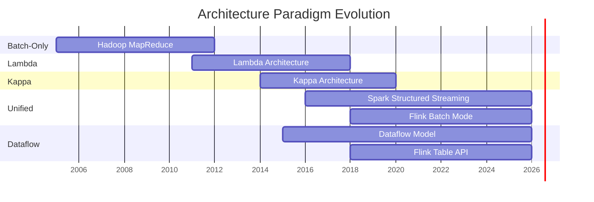

# Stream vs Batch: Unified Model Evolution

> **Stage**: Struct/03-relationships | **Prerequisites**: [Expressiveness Hierarchy](expressiveness-hierarchy.md), [DataStream V2 Semantics](datastream-v2-semantics.md) | **Formalization Level**: L4-L5
> **Translation Date**: 2026-04-21

## Abstract

This document traces the evolution from separate batch/stream systems (Lambda) to unified models (Dataflow), formalizing the batch-stream unification and comparing architecture paradigms.

---

## 1. Definitions

### Def-S-22-01 (Batch-Stream Unified Model)

A **batch-stream unified model** $\mathcal{U}$ is a 4-tuple:

$$\mathcal{U} = \langle \mathcal{D}, \mathcal{O}, \mathcal{T}, \mathcal{G} \rangle$$

where:

- $\mathcal{D}$: unified data abstraction (bounded datasets + unbounded streams)
- $\mathcal{O}$: operator set with the same semantics for both batch and stream
- $\mathcal{T}$: triggering model deciding when to emit results
- $\mathcal{G}$: global semantics (consistency, time, fault tolerance)

**Core property**: $\forall op \in \mathcal{O}, op(D_{\text{bounded}}) \cong op(D_{\text{unbounded}}|_{\text{window}})$

Batch is a special case of streaming with a bounded window.

### Def-S-22-02 (Architecture Paradigm Evolution)

The **architecture paradigm evolution** $\mathcal{E}_{paradigm}$ is a partially ordered set:

$$\mathcal{E}_{paradigm} = \langle \{\text{Lambda}, \text{Kappa}, \text{Unified}, \text{Dataflow}\}, \preceq \rangle$$

where $A \preceq B$ means $B$ can simulate $A$:

$$\text{Lambda} \preceq \text{Kappa} \preceq \text{Unified} \preceq \text{Dataflow}$$

| Paradigm | Core Abstraction | Batch-Stream Relation | Time Semantics |
|----------|-----------------|----------------------|----------------|
| Lambda | Dual system | Batch layer + speed layer | Batch: processing time; Stream: approximate |
| Kappa | Single stream | Stream is source of truth | Unified event time |
| Unified | Single engine dual mode | Same engine, different modes | Event + processing time |
| Dataflow | Unified model | Data is stream, window is boundary | Event time + watermark |

---

## 2. Properties

### Lemma-S-22-01 (Lambda to Kappa Expressiveness)

Kappa architecture strictly subsumes Lambda architecture:

$$\text{Lambda} \prec \text{Kappa}$$

**Proof.** Kappa uses a single stream processing system. By adding a "batch replay" source (replay historical data as a stream), Kappa simulates the batch layer of Lambda. The speed layer is the normal streaming path. ∎

### Lemma-S-22-02 (Dataflow Unification Completeness)

The Dataflow model can express any batch computation as a streaming computation over a global window:

$$\forall \text{ batch job } B, \exists \text{ stream job } S: S|_{\text{global window}} \equiv B$$

---

## 3. Evolution Timeline

---

## 4. References
